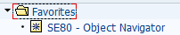
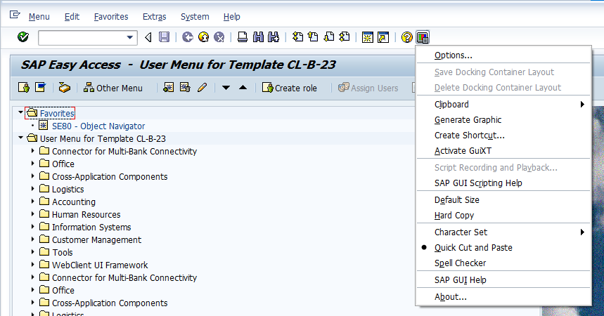

# Unit4 SAP User Interfaces

## 목표

* ### SAP GUI for Windows를 사용하여 AS ABAP 시스템 탐색

* ### 사용자 인터페이스 개인 설정

* ### SAP GUI for JAVA 를 사용하여 AS ABAP 시스템에 액세스

* ### SAP GUI for HTML 을 사용하여 AS ABAP 시스템에 액세스

****

****

## Lesson1 Accessing AS ABAP Systems with SAP GUI

****

## 개요

* SAP 환경의 다양한 사용자 인터페이스에 대해 설명하고 다양한 스타일의 SAP GUI 를 살펴본다.

* SAP GUI for Windows의 즐겨찾기 관리 옵션과 개인 설정 옵션에 대해서도 설명한다.

## 목표

* SAP GUI for Windows 를 사용하여 AS ABAP 시스템 탐색
* 사용자 인터페이스 개인 설정
* SAP GUI for JAVA 를 사용하여 AS ABAP 시스템에 액세스
* SAP GUI for HTML 을 사용하여 AS ABAP 시스템에 액세스

****

* ## 액세스 기술 사례

| SAP Product                      | Typical Access Technology                                    |
| -------------------------------- | ------------------------------------------------------------ |
| SAP ERP                          | SAP GUI for Windows 또는 SAP GUI for HTML                    |
| SAP Buisiness Warehouse(BW)      | Browser-based interface (각종 브라우저 지원)                 |
| SAP Business ByDesign            | Browser-based interface (각종 브라우저 지원), **S**oftware **a**s **a** **S**ervice (SaaS) |
| SAP Business All-inOne solutions | SAP NetWeaver Business Client                                |
| SAP S/4HANA                      | SAP Fiori                                                    |

* ## ABAP dispatcher의 역할

  서비스를 받아 워크 프로세스에 작업을 할당한다.

* ## User settings

  Easy Access -> favaorites 우클릭 -> insert transaction 을 통해 원하는 transaction을 favorites에 추가 할 수 있다.

  Easy Access -> extra -> setting -> display technical names 을 통해 T코드를 같이 볼 수 있다.

  

  

  드래그만으로 복사하고 우클릭을 통해 붙여넣기를 가능하게 해준다.

* ## 학습평가 

  * #### 다음중 SAP GUI에서 사용할 수 있는 개인 설정 옵션은 무엇인가?

    * ##### A SAP GUI의 글꼴 크기를 일정한 범위 내에서 변경할 수 있다.

    * ##### B 대화 상자에 시스템 메시지를 표시할 수 있다.

    * C 입력 필드의 크기를 다양하게 설정할 수 있다.

    * ##### D SAP GUI에서 그림이 표시되지 않도록 할 수 있다.

    * E 사용자 임의의 사진 SAP Easy Access 화면에 넣을 수 있다.

  * #### SAP GUI for the Java Environment (SAP GUI for Java)는 AS Java에서 실행되는 어플리케이션의 프론트엔드이다.

    * 참

    * ##### 거짓

    SAP GUI for the Java Environment (SAP GUI for Java) 는 Java 로 개발되어 플랫폼에 댁립적인 SAP GUI 이다. 자세한 내용은 ***SAPTEC 과정 (8-1) 또는 TAW10 파트1 (4-1) 참조***
