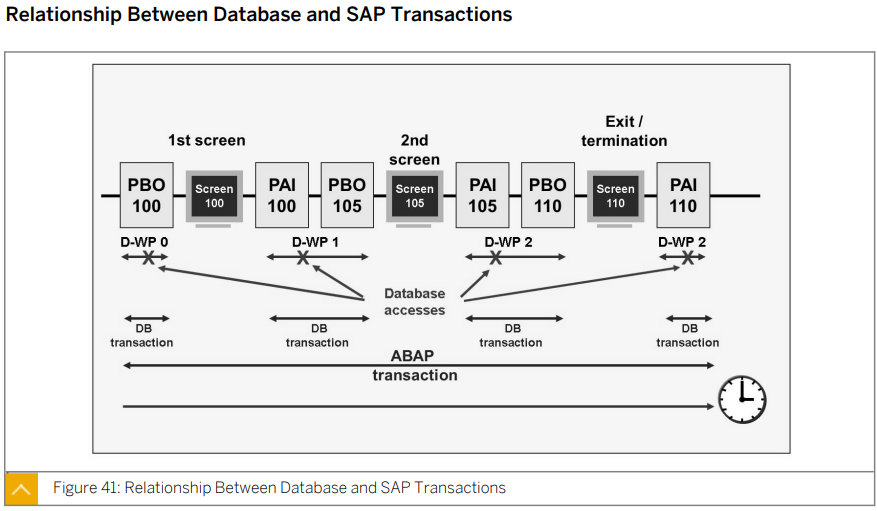
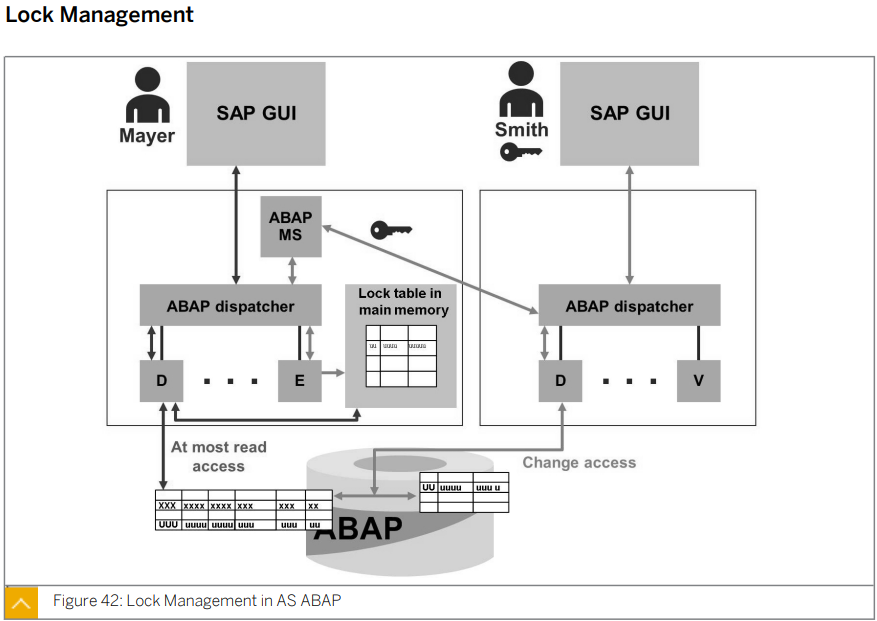

# Unit5 The System Core

## 목표

* ### 시스템 상태 정보에 액세스

* ### AS ABAP 시스템의 프로세스 구분

* ### AS ABAP 에서의 요청 처리

* ### AS ABAP 에서의 트랜잭션 처리

* ### 인쇄요청처리

* ### 백그라운드 작업 일정 계획

* ### 게이트웨이를 사용한 통신

* ### 웹요청 처리

****

****

## Lesson1. Explaining AS ABAP and AS java System Architecture

****

### 개요

이 소단원에서는 SAP NetWeaver Application Server(AS)의 서로 다른 유형인 AS ABAP(Advanced Buisiness Application Programming), AS Java, AS ABAP+Java의 아키텍처에 대해 설명한다.

### 목표

* 시스템 상태 정보에 액세스

****

* ### AS ABAP 시스템

  이 유형의 AS는 ABAP 기반의 어플리케이션을 개발하고 사용할 수 있는 전체 인프라를 제공한다.

* ### AS Java 시스템

  이 유형의 AS는 J2EE 기반의 어플리케이션을 개발하고 사용할 수 있는 전체 인프라를 제공한다.

* ### AS ABAP + Java 시스템

  이 유형의 AS 는 ABAP 기반 어플리케이션과 J2EE 기반 어플리케이션을 개발하고 사용할 수 있는 전체 인프라를 제공한다.

  이 유형의 시스템은 SAP Process Integration 또는 SAP Solution Manager 등의 솔루션에서 명시적으로 요구하는 경우에만 설치한다.

#### SAP NetWeaver AS의 중요한 특징중 하나는 데이터베이스의 ABAP 스키마는 ABAP 테이블, 프로그램, 어플리케이션을 저장하고 Java 스키마는 Java 데이터를 저장한다는 점이다. 

#### SAP NetWeaver AS ABAP의 경우 7.0X와 상위 릴리스 간에 아키텍처 면에서 변경된 점이 없다.

#### 단. 7.1 부터는 Central Instance(CI) '중앙 인스턴스' 라는 용어가 Primary Appi. Server(PAS) '주 어플리케이션 서버'로 Dialog Instance(DI) '다이얼로그 인스턴스' 가 Addtional Application Server '추가 어플리케이션 서버' 로 바뀌었다.

#### 또한 ABAP MS와 ABAP ES가 Central Services 에 구분된다.

****

* ## Message Server 

  * AS ABAP 의 내부통신을 처리하는 중앙 메시지 서비스 담당
    * **EX )** 업데이트 시작, 잠금 요청 및 제거, 백그라운드 요청 실행
  * 시스템에서 현재 사용가능한 인스턴스에 대한 정보를 제고
  * 어플리케이션 서버에 있는 ABAP 디스패처 사이의 프로세스간 통신을 가능하게 한다.
    * 메시지 서버는 SAP 시스템당 한번만 설치된다.
  * 사용자가 SAP GUI for Windows 또는 SAP GUI for Java에서 로그온 그룹을 사용하여 AS ABAP에 로그온 할 때 사용자로 인한 부하를 여유 인스턴스에 분배

여러개의 서버로 운용 될때 ABAP Dispatcher를 사용하며

7.1 이상부터 를 사용한다. 

 가 Central Services 로 분리 된다.	

****

****

## Lesson2. Identifying the processes of an AS ABAP System

****

### 개요

이 소단원에서는 AS ABAP 시스템에서 실행되는 프로세스를 개적으로 설명한다.

### 목표

* AS ABAP 시스템의 프로세스 구분

****

* ### ABAP Dispatcher의 역할:

  * 요청을 작업 프로세스에 배분한다.

* ### The Message Server (MS)

  * AS ABAP 내의 분산된 디스패터들 사이의 통신을 처리한다.
  * 이는 여러개의 어플리케이션 서버를 원할하게 동시에 운영할 수 있도록 해준다.
  * **MS는 시스템당 한번만 구성된다.**

* ### The Gateway (GW)

  * SAP 시스템간 통신,  또는 SAP 시스템과 외부 어플리케이션 싯템간의 통신을 가능하게 한다.
  * 각각의 별도로 구성되어있는 SAP 시스템 또는 non-SAP 시스템을 연결해주는 역할을 한다.
  * **디스패처마다 하나의 GW 리더가 있다.**

* ### The Internet Communication Manager (ICM)

  * HTTP등의 웹 프로토콜을 사용하여 SAP 시스템과의 통신을 가능하게 한다.
  * ICM 은 클라이언트로 부터 요청을 받아 이를 SAP 시스템에 전달하여 처리하게 한다.
  * ABAP + Java 시스템에서는 요청이 AS ABAP용인지 AS Java용인지르르 판단하여 그에 맞게 전달한다.
  * 또한 SAP 시스템에서 웹 서버로 HTTP 요청을 전달하고 다시 그 응답을 웹서버에서 받아 SAP 시스템에 보낼 수도 있다.
  * **어플리케이션 서버당 ICM 프로세스를 하나만 구성할 수 있다. (소프트웨어 기준 관점)**

* ### Work Process

  * #### Dialog DWP

    * 사용자의 요청에 의해 dialog 스탭을 수행
    * 쉽게 말해 ABAP 의 구문이 한줄한줄 씩 순차적으로 진행되어 가는 것

    * **ABAP Dispatcher 별로 최소 두개** 이상 있어야 한다.
    * **가장 많이 사용**

  * #### Background BWP

    * 사용자와 상호작용 없이 실행되는 프로그램을 철히한다.
    * 지정한 스케줄 마다 시스템을 실행시켜준다.
    * 하나의 작업이 너무 오래 걸릴때도 사용
    * **ABAP dispatcher 별로 최소 하나** 존재해야한다.
    * **ABAP dispatcher 별로 두개 이상**  존재하는 것이 이상적이다.
      * 기본적으로 SAP 시스템의 일반적인 작업을 수행하기에는 하나의 백그라운드 프로세스로 충분
      * 하지만 **업그레이드나 ABAP 전송 요청의 임포트**와 같은 작업을 위해서는 **두번째 백그라운드 작업 프로세스 필요**

  * #### Lock management EWP

    * 공유 메모리의 잠금테이블을 관리
      * 여러 유저에 의해 사용되다 보니 여러 유저에 의해 데이터가 동시에 수정되는 상황이 발생
      * 따라서 특정 유저가 데이터를 수정중일때 다른 유저가 수정할 수 없게 설정을 해준다.
      * ABAP 런타임 환경에서의 논리적 데이터베이스 잠금이 기록된다.
    * 이것이  **인큐 워크 프로세스**이다.
    * **SAP 시스템마다 하나만 필요**
      * 각각의 서버 마다 있으면 문제 발생

  * #### Update VWP

    * 업데이트 요청을 처리한다. 
    * **SAP 시스템당 최소 하나** 존재해야한다.
    * **ABAP dispatcher 별로 최소 둘 이상** 구성 가능하다.

  * #### Spool S

    * 프린터를 통해 출력할때 사용
    * **SAP 시스템당 최소 하나** 존재해야한다.
    * **ABAP dispatcher 별로 최소 둘 이상** 구성 가능하다.

****

****

## Lesson3. Processing User Requests in AS ABAP

****

### 개요

AS ABAP 에서 사용자 요청이 어떻게 처리되는지 설명한다. 트랜잭션, 잠금, 업데이트 처리 개념에 대해서도 설명한다.

### 목표

* AS ABAP에서의 요청 처리
* AS ABAP에서의 트랜잭션 처리

****

* ## SAP GUI 에서 들어오는 사용자 요청 처리

  

  사용자는 SAP 시스템에 SAP GUI 또는 웹 클라이언트(브라우저)를 통해 로그온 할 수 있다.

  SAP GUI를 통해 로그온 하면 사용자 요청이 ABAP 런타임 환경에 의해 처리된다.

  브라우저를 통해 로그온 하면 사용자 요청이 그 성격에 따라 ABAP 런타임 환경에 의해 처리되기도 하고 Java 런타임 환경에의해 처리되기도 한다.

  사용자가 MS를 통해 로그온 하거나 ABAP 디스패쳐를 통해 직접 로그온 하고 나면 사용자 요청이 작업 프로세스에 의해 처리된다.

  위 그림에서 보는 것과 같이, AS ABAP 에서 사용자 요청을 처리할 때는 세개의 계층 ***Presentation 화면 Layer, Application어플리케이션 Level , Database데이터베이스 level***에 걸쳐 여러 프로세스가 관련된다.

   사용자가 화면에 입력한 정보는 SAP GUI에 접수되어 내부 포맷으로 변환된 다음 AS ABAP에 전달된다.

* ### ABAP Dispatcher

  * ABAP 로 작성된 어플리케이션의 리소스를 각 운영 체제와 연계하여 관리
  * 요청을 Work Process에 분배
  * Presentation Layer  통합
  * 통신 액티비티 정리
  * 처리 요청을 요청 queue에 저장 후 처리
    * queue는 first in first out 를 원칙으로 한다. 선입 선출 원칙

  ABAP Dispatcher가 요청을 받아 이 요청으로 work process를 할당한다.

  유저와 1대1로 section이 맺어지지 않는다. (사용자에 대한 고정 작업 프로세스가 있는 것이 아니다.) => 빈 프로세스에 넣는 방식

  따라서 특정 유저의 요청이 긴 시간을 실행하고 있으면 다른 유저의 요청을 실행 할 수 없다. (유한 자원)  => 자원 낭비 => background 워크 프로세스로 실행한다.

  Buffer 는 데이터베이스 레벨의 테이블의 데이터를 로드하여 사용할 수 있게 해준다.

  각 인스턴스에는 자체 버퍼가 존재한다.

  

  작업 프로세스는 어플리케이션 프로그램의 프로세스 로직을 실행한다.

  작업 프로세스의 내부는 메인 메모리, 작업 프로세스의 동작을 조정하는 태스크 핸들러, 각종 소프트웨어 프로세서, 데이터베이스 인터페이스로 구성

  Dynpro 프로세서는 어플리케이션 프로그램의 화면 흐름 로직을 실행하고 어플리케이션 프로그램의 실질적인 처리 로직을 실행

  화면 프로세서는 화면 흐림 로직의 처리 상태에 따라 실행해야 하는 하위 프로그램을 ABAP 프로세서에 알려준다.

  디스패처가 특정 다이얼로그 작업 프로세스를 선택하면 해당 프로세스는 먼저 사용자 컨텍스트 데이터를 *<u>Roll-In</u>*  한다.

  이를 통해 실행중인 프로그램의 처리 상태와 사용자 정보가 작업 프로세스에 인식된다.

  그러면 작업 프로세스가 사용자 요청을 처리하고, 처리 결과를 반환한 다음 사용자 컨텍스트 데이터를 공유 메모리로 *<u>Roll-Out</u>* 한다.

  *<u>Roll-Out</u>*까지 마친 Work Process는 다시 요청 *Queue*에 대기 중인 새로운 사용자 요청을 처리할 수 있게 된다.

  결과가  SAP GUI에 전송되면 사용자에 새로운 화면이 표시된다. 

****

* ## AS ABAP 의 데이터베이스 인터페이스

  대규모의 데이터 집합을 관리하기 위해 RDBMS 을 사용한다.

  RDBMS는 데이터와 데이터 관계를 2차원 테이블로 저장한다.

  데이터, 테이블 및 테이블 관계는 RDBMS 데이터베이스 카탈로그(데이터 딕셔너리)의 데이터베이스 레벨에서 정의된다.

  

  ABAP에서는 *<u>ABAP Open SQL</u>*을 사용하면 RDBMS 의 유형과 상관 없이 데이터베이스에 있는 어플리케이션 데이터에 액세스할 수 있다.

  AS ABAP의 모든 작업 프로세스에 포함되는 DB interface 가 ABAP의 Open SQL 문을 사용중인 데이터베이스의 해당 SQL문으로 변환해 준다.

  * ABAP Open SQL 은 (ISO) SQL 표준을 바탕으로 한 데이트베이스 쿼리 언어이다.
  * ABAP Open SQL 에는 SQL 표준에는 없는 추가 기능이 포함되어있다.

  SAP DB interface 는 Open SQL 문을 해석할 때 그 구문을 점검하여 어플리케이션 서버 공유 메모리의 로컬 SAP버퍼가 가장 효과적으로 활용되도록 한다.

  자주 사용되는 데이터는 이 버퍼에 저장되므로 시스템에서 해당 데이터를 읽기 위해 매번 데이터베이스 서버에 액세스 할 필요가 없다.

  특히, 운영체제가 변경되지 않는 한 ABAP 프로그램, 화면, ABAP 딕셔너리 정보, 작업 관리 매개변수와 같은 기술 데이터는 모두 변경 없이 그대로 유지되므로 기술 데이터는 버퍼에 저장하기에 이상적이다.

  Native SQL을 사용하기 위해서는 구문의 시작과 끝에 각각 *<u>EXEC SQL. , END EXEC.</u>* 구문을 사용해 준다.

  ABAP 인터프리터는 이 코드 안의 명령어에 대해서는 구문을 검사하지 않는다.

  * 단, Native SQL을 사용하여 프로그램을 개발하면 프로그램의 플랫폼 독립성이 사라진다. 

  * 다시 말해, 플랫폼에 따라 제약이 발생할 수 있다.

****

* ## 다이얼로그 요청 처리

  

  위의 그림에서 보듯이, 프로그램의 다이얼로그 단계는 하나의 특정한 다이얼로그 작업 프로세스에 지정된다

  **여러 개의 화면으로 구성된 프로그램**의 경우에는 각 다이얼로그 단계가 프로그램 런타임 중에 **여러 다이얼로그 작업 프로세스에 의해 실행** 될 수 있다.

  이를 ***Work Process Multiplexing*** 이라고 한다.

  다이얼로그 작업 프로세스는 여러 사용자 및 프로그램의 다이얼로그 단계를 순차적으로 처리한다.

  SAP 어플리케이션은 사용자 상호작용과 처리 로직을 구분한다.

  사용자 액션은 Dynpro(dynamic program) 라고도 하느느 화면을 사용하여 기술적으로 구현되는데 이는 화면 이미지와 기반이 되는 흐름 로직으로 구성된다.

  작업 프로세스의 Dynpro 프로세서는 어플리케이션의 화면 흐름 로직을 실행하고 처리 로직 모듈을 호출하며 필드 내용을 처리 로직으로 전송한다.

  * ### 화면 흐름 로직 모듈 세분화

    * #### Process Before Output (PBO)

      * 화면 이미지를 보내기전에 처리된다.
      * 이부분은 논리적으로 후속화면 이미지에 속한다.

    * #### Process After Input (PAI)

      * 사용자가 화면에 입력을 한 후에 처리된다.
      * 이 부분은 논리적으로 이전 화면 이미지에 속한다.

  ABAP 프로그램의 실질적인 처리 로직은 ABAP 인터프리터가 실행한다.

  화면 흐름 로직의 처리 상태에 따라 실행해야 하는 하위 프로그램을 화면 프로세서가 ABAP 프로세서에 알려준다.

  다이얼로그 단계에서 데이터베이스나 버퍼와의 데이터 교환은 DB Interface를 통해 교환한다.

  이렇듯 데이터베이스 인터페이스를 거치므로 데이터베이스 테이블, ABAP 프로그램, ABAP 딕셔너리 등 다양한 대상에 액세스 할 수 있다.

****

* ## AS ABAP에서의 업데이트

  * ### Transaction(트랜잭션)

    * #### 트랜잭션은 기능적으로 같은 부류에 속하는 처리단위이다.

    * #### 트랜잭션의 주요 특징 (ACID)

      * 원자성 (Atomic)

        트랜잭션이 완전하게 처리되지 않는 한 이 트랜잭션은 아무런 효과도 일으키지 않는다. 

        트랜잭션을 진행하던 시스템이 다운되면 일관성 없는 불완전한 결과는 모두 저장되지 않고 사라진다.

      * 일관성 (Consistent)

        시스템 상태가 특정 상태에서 다른 상태로 변경되려면 두 상태 모두가 정확하고 작업적으로 일관성이 있어야 한다.

      * 고립성 (Isolated)

        트랜잭션이 처리하는 변경사항은 최종 확정(커밋) 되기 전까지 다른 트랜잭션이 볼 수 없다.

      * 지속성 (Durable)

        최종 확정 후에느느 데이터베이스에 영구적으로 저장되어 트랜잭션의 결과가 지속된다.

  * ### 데이터베이스 트랜잭션과 ABAP 트랜잭션

    * 모든 작업 프로세스는 SAP 인스턴스의 런타임 기간 내내 데이터베이스 측의 특정 통신 상대에 접속한다.
    * 런타임 기간중에는 작업 프로세스 간에 통신 상대를 맞바꿀 수 없다.
      * 따라서 작업 프로세스는 하나의 데이터베이스 트랜잭션 내에서만 데이터베이스를 변경할 수 있다.

  * ###  데이터베이스 트랜잭션

    * ACID 원칙에 따르면 데이터베이스 트랜잭션은 나눌 수 없는 일련의 데이터베이스 작업이다.
    * 트랜잭션 시작과 종료 시 데이터베이스상의 데이터세트 (Dataset) 가 일관성을 유지해야한다.
    * 데이터베이스 트랜잭션의 시작과 끝은 데이터베이스 시스템에 대한 커밋 명령어로 정의된다.
    * 데이터베이스 트랜잭션을 처리하는 동안에는 데이터베이스 시스템이 직접 데이터세트의 일관성 유지를 관리한다.
    * 오류로 인해 트랜잭션이 종료되면 데이터베이스 시스템은 데이터세트를 이전 상태로 복원한다.
      * 이를 롤백이라고 한다.

  * ### 비지니스 트랜잭션

    * 비지니스 트랜잭션은 특정 기능을 수행하기 위해 여러 개의 처리 단위가 하나로 묶여진 것
    * 대표적인 예로는 ***불가분 관계에 있는 차변과 대변의 업데이트, 주문 발생에 이은 관련자재의 예약***이 있다.
    * AS ABAP 트랜잭션은 전부가 아니면 전무하게 실행되어야 하는 나눌 수 없는 비지니스 프로세스로 정의된다.
    * 시스템 상에서 AS ABAP 트랜잭션은 업무적으로 일관되고 논리적으로 연결된 연속적 다이얼로그 단계의 형태로 나타난다.
    * 하나의 화면 이미지가 하나의 사용자 다이얼 로그 단계에 해당한다.

****

* ## 데이터베이스 트랜잭션과 SAP 트랜잭션 사이의 관계

  

  * 위 그림은 데이터베이스 트랜잭션과 SAP 트랜잭션의 관계를 보여준다.
  * SAP 트랜잭션이 반드시 하나의 다이얼로그 작업 프로세스로 처리될 필요는 없다.
  * 데이터베이스 변경 트랜잭션에서 사용자가 화면을 통해 데이터베이스 변경을 요청
  * 트랜잭션이 완료되어 데이터가 변경된 후에도 데이터베이스의 일관성이 손상되지 않아야 한다.
  * 하나의 대화 상자가 여러개의 작업프로세스에 의해 처리될 수 있다. **(Multiplexing of Work Processes)**
  * 각 작업 프로세스는 서로 관련되지 않은 어플리케이션에서 발생한 다이얼로그 단계를 단순히 순서에 따라 돌아가며 처리한다.
  * 그 과정에서 서로 관련되지 않은 두 어플리케이션의 두 다이얼 로그 단계가 하나의 동일한 작업 프로세스에 의해 연달아 처리될 수 있다. 
  * 하지만 이러한 경우에도 이 두 어플리케이션이 하나의 동일한 데이터베이스 트랜잭션에서 실행될 수 는 없다.
  * 따라서 작업 프로세스는 다이얼로그 단계 하나마다 새로운 데이터베이스 트랜잭션을 시작해야 한다.
  * db transaction은 화면 이동 찰나의 순간에 해당된다.**??????**

****

* ## 잠금관리

  

  SAP 시스템 안에서 데이터 일관성을 보장하기 위해 여러명의 사용자가 동시에 데이터 레코드에 접근하여 변경하지 못하도록 관리해야 한다.

  SAP 시스템은 자체적인 잠금 관리 체계를 가지고 있다.

  

  데이터베이스의 관점에서 모든 다이얼로그 단계는 데이터베이스 트랜잭션이라는 물리적, 논리적 단위를 형성한다.

  데이터베이스 잠금 관리는 이러한 유형의 데이터베이스 트랜잭션만 다루어 처리할 수 있다.

  

  하지만 SAP 관점에서는 이보다 많은 것이 필요하다. 

  * SAP 트랜잭션은 대개 여러개의 다이얼로그 단계로 이루어지기 때문

  따라서 SAP 시스템에는 자체적인 잠금 관리 체계가 필요하다.

  SAP 는 **enqueue work process(인큐 작업 프로세스)**를 사용하여 그러한 체계를 구현한다.

  이 방법으로 잠금 관리의 플랫폼 독립성도 유지 된다.

  

  SAP 잠금 체계는 처리할 데이터 레코드에 대한 잠금 엔트리를 잠금 테이블에 기록한다는 원칙을 기반으로 한다.

  잠금 테이블에 동일한 엔트리가 없는 경우에만 잠금 엔트리를 기록할 수 있다.

  

  enqueue work process(인큐 작업 프로세스)가 이 잠금 테이블을 통해 SAP 트랜잭션의 논리적 잠금을 관리한다.

  잠금 테이블은 enqueue work process(인큐 작업 프로세스)가 있는 인스턴스의 메인 메모리 안에 위치한다.

  

  ##### 메인 메모리 안에 잠금 테이블을 가지고 있는 인스턴스를 *Enqueue Server (인큐서버)* 라고도 한다.

  

  * ### Lock Request(잠금 요청)

    사용자가 데이터를 변경하려 하면 담당 다이얼로그 작업 프로세스가 잠금을 요청한다.

    * 어플리케이션 개발자가 이 요청을 명시적으로 프로그래밍해야함

    다이얼로그 요청이 처리되고 있는 곳이 Enqueue Server 인 경우 다이얼로그 작업 프로세스가 잠금 테이블에 직접 액세스할 수 있다.

    * **다이얼로그 작업 프로세스**는 새로운 잠금을 생성할 수 있는지 확인한다.
      * 즉 이미 설정되어있는 잠금과 충돌이 없는지
    * 잠금을 설정할 수 있으면 다이얼로그 작업 프로세스가 잠금을 생성하고 사용자(잠금 소유자)에게 잠금 키가 부여된다. 잠금 키는 공유 메모리의 사용자 컨텍스트에 보관된다.

    

    다이얼로그 작업 프로세스와 인큐 작업 프로세스가 서로 별개의 인스턴스에서 실행되고 있으면 이 두작업 프로세스는  abap ms 를 통해 두 서버의 abap dispatcher를 연결해 준다.

    이 경우, 잠금 요청이 다이얼로그 작업 프로세스로부터 디스패처와 메시지 서버를 거쳐 인큐 작업 프로세스에 전달된다.

    * 잠금을 설정할 수 있는지 여부를 **인큐 작업 프로세스**가 확인한다.
    * 가능한 것으로 판단되면 인큐 작업 프로세스에 의해 잠금이 설정된다.
    * 잠금키가 디스패처와 메시지 서버를 거쳐 요청 다이얼로그 작업 프로세스에 전달된다.

    

    잠금이 요청되면 요청된 잠금이 잠금 테이블 내의 기존 엔트리와 충돌하지 않는지 확인을 거친다.

    잠금 테이블에 같은 엔트리가 이미 있는 경우에는 잠금 요청이 거부된다.

    그러면 어플리케이션 프로그램은 요청된 작업을 현재 실행할 수 없음을 사용자에게 알린다.

    

    * 시스템이 잠금 요청을 수행하기 위해서는 ABAP 딕셔너리에 잠금 오브젝트가 정의되어 있어야 한다.
    * 잠금 오브젝트는 엔트리를 잠글 수 있는 하나 또는 여러 개의 테이블로 이루어져 있다.
    * 잠금 오브젝트에 잠금 모드를 정의할 수 있다.

  

  * ### Lock Mods(잠금모드)

    * #### Write Locks (lock mode exclusive_배타적 잠금 모드)

      단 한명의 사용자만 잠금 데이터를 편집할 수 있다. 

      다른 쓰기 잠금 및 읽기 잠금 요청은 거부된다.

      쓰기 잠금으로 잠긴 오브젝트에는 어떤 유형의 트랜잭션도 수행할 수 없다.

      동일한 잠금 소유자만 잠금을 다시 설정할 수 있다 **(comulate_ 누적)**.

      

    * #### Read Locks (lock mode shared_ 공유 잠금 모드)

      잠긴 데이터를 여러 명의 사용자가 동시에 읽을 수 있다. 

      추가적인 읽기 잠금 요청은 다른 사용자의 요청이더라도 수락된다. 

      쓰기 잠금은 거부된다.

      

    * #### Enhanced Write Locks (lock mode exclusivs noncumulative_ 비누적 배타적 잠금 모드)

      일반적인 쓰기 잠금은 같은 트랜잭션에서 연속적으로 요청하고 해제할 수 있는 반면, 고급 쓰기 잠금은 같은 트랜잭션에서 한번만 요청할 수 있다.

      다른 모든 잠금 요청은 거부된다.

      

    * #### Optimistic Locks (lock mode optimistic_ 낙관적 잠금 모드)

      낙관적 잠금은 최초에는 읽기 잠금 형태로 작동하다가 나중에 쓰기 잠금으로 변경 가능하다.

      사용자가 변경모드로 데이터를 조회하는 경우에 설정된다.

      동일한 오브젝트에 여러 번 설정해도 충돌이 발생하지 않는다.

      사용자가 데이터를 변경 후 저장할 때는 낙관적 잠금이 쓰기 잠금(모드 E)로 변경되어야 한다.

      하지만 누군가가 먼저 해당 오브젝트에 비 낙관적 잠금을 설정해 놓은 경우에는 쓰기 잠금으로 변경되지 않는다.

      오브젝트에 설정되어있던 다른 낙관적 잠금은 이 과정에 삭제된다.

      

    어플리케이션 프로그램에 의해 설정된 잠금은 데이터베이스 변경을 끝낸 후에 어플리케이션 프로그램이 직접 해제하거나 업데이트 프로그램이 해제 한다.

    업데이트 작업 프로세스에 전달된 잠금은 운영 체제 쪽의 파일에도 기록되므로 인큐 서버가 다운되더라도 복원이 가능하다.

    트랜잭션 SM12 (툴 -> 관리 -> 모니터 -> 잠금엔트리) 에서는 현재 설정되어 있는 잠금을 조회할 수 있다.

    업데이트 프로세스에 전달된 잠금에는 백업 표시가 설정된다.

    이러한 잠금은 인큐서버를 다시 시작해도 잠금 테이블에 그대로 표시된다.

  

  * ### Removal of a Lock (잠금제거)

    * 사용자 개요 트랜잭션 SM04 (툴 -> 관리 -> 모니터 -> 시스템 모니터링 -> 사용자 개요)에서 사용자 세션을 종료
    * SM12 에서 잠금엔트리를 직접 삭제

    첫번째 방법(사용자 세션 종료) 을 사용하면 원래의 잠금 소유자의 트랜잭션이 종료되고, 귀속된 모든 잠금이 해제된다.

    두번째 방법 (잠금 엔트리 직접 삭제) 을 사용하면 잠금 테이블에서 잠금 엔트리를 삭제한다. 

    * 따라서 이론적으로는, 이 방법 사용 시 여러 명의 사용자가 동일한 데이터 레코드를 동시에 변경할 수 있게 된다.

    #### 주의

    **잠금을 삭제하기 전에 시스템 관리자는 먼저 SM04 트랜잭션을 사용하여 잠금을 소유한 사용자가 아직 시스템에 로그온해 있는지 확인해야 한다.** 

    **잠금 소유자가 시스템에 로그온되어 있지 않지만 잠금은 그래도 소유하고 있는 경우에만 (사용자가 시스템에 로그오프하지 않고 컴퓨터를 꺼버려 SAP GUI 와 SAP 시스템 간의 연결이 끊어진 경우 등) 트랜잭션 SM12 를 통해 잠금 엔트리를 삭제해야 한다.**

  * ### Stand-Alone Enqueue Server / ABAP Central Server                  (독립형 인큐 서버 / ABAP 중앙 서비스)

    일반적으로 인큐 작업 프로세스는 ABAP 메시지 서버와 함께 ABAP 중앙 서비스 인스턴스 (ASCS) 에 설치된다. 

    독립 실행형 인큐 서버를 설치하면 고가용성을 보장 할 수 있다.

    **SAP NetWeaver Library => Function-Oriented View => Application Server => Application Server Interface => Components of SAP NetWeaver** 를 선택하고 **The SAP Lock Concept => Standalon Enqueue Server** 를 선택하여 더 자세한 내용을 참조 가능 

****

* ### Update Processing

  

  SAP의 비지니스 트랜잭션 (EX. 주문 생성) 은 여러 차례의 화면 데이터 변경으로 이루어지는 경우가 많다.

  이러한 프로세스에 의한 연속된 데이터 변경은 데이터베이스에서 완전히 처리되거나 전혀 처리되지 않아야한다.

  즉, 트랜잭션 중에 오류가 밸생하여 작업이 중단되는 일이 발생하면 이 트랜잭션은 데이터베이스의 데이터를 단하나도 변경하지 않아야한다.

  이 일을 **SAP 업데이트 서버** 가 관리한다.

  110번에서 저장 버튼을 누를때 commit work가 이루어 져야 한다.

  따라서 나머지의 구간에서는 flag만 바꿔준다.

  즉 일부 transaction의 수정 내용만이 따로 저장되진 않는다.

  이런 과정을 all or nothing이라고 한다.

  * ### Update Process(업데이트 프로세스)

    SAP의 비동기 업데이트는 보안과 성능을 향상시킨다. 

    또한 업데이트 시스템을 통해 데이터베이스 변경 처리 중 데이터 복원이 가능하다.

    

    업데이트 시스템은 시간이 많이 소요되는 부분인 데이터베이스 변경 작업을 SAP 트랜잭션에서 분리한다.

    * 즉 이러한 작업은 특별 업데이트 작업 프로세스에서 비동기적으로 수행된다. 
    * 또한 SAP 트랜잭션과 데이터 베이스에서의 논리 작업 단위 (LUW) 개념이 서로 다른 것에서 기인하는 롤백 문제도 해결한다.

    

    처리할 데이터가 업데이트 작업 프로세스에 전달되면 다이얼로그 작업 프로세스는 업데이트 요청이 처리 완료되 때까지 기다리지 않는다.

    업데이트는 비동기적으로 처리된다.

    

    다이얼로그 부분이 ABAP 명령어 COMMIT WORK 로 완료되면 SAP 트랜잭션의 업데이트 부분이 시작된다.

    

    업데이트 서버가 업데이트 작업 프로세스에 업데이트 요청을 전송한다.

    여기서 각 다이얼로그 단계는 데이터베이스 트랜잭션 (전부 처리되거나 전혀 처리되지 않아야 하며 COMMIT 명령어로 완료) 이다.

    시스템이 SAP 트랜잭션의 업데이트 부분을 하나의 데이터베이스 트랜잭션으로 처리한다.

    데이터가 어플리케이션 테이블에 복사되는 시점이 바로 이때이다.

    

    사용자가 데이터 레코드를 변경하기 위해 다이얼로그 모드에서 SAP 트랜잭션을 호출하여 화면에 원하는 값을 입력한 후, 데이터를 저장하는 순간 업데이트 프로세스가 시작된다.

    

  * ### Steps in Asynchronous Update(비동기 업데이트 단계)

    * 프로그램이 인큐 작업 프로세스를 통해 (경우에 따라서는 메시지 서버를 통해) 데이터 레코드를 잠근다.

      인큐 작업 프로세스가 잠금 테이블에 이를 위한 엔트리를 작성한다.

      다른 사용자가 해당 데이터를 이미 잠근 경우에는 현재 데이터 레코드의 변경이 불가능한 상태임을 인큐 작업 프로세스가 사용자에게 알려준다.

    * 인큐 작업 프로세스가 잠금 테이블에 잠금 엔트리를 작성하는데 성공하면 잠금 키를 생성하여 사용자에게 전달한다.

      변경할 레코드를 프로그램이 데이터베이스에서 읽어온다. 

      이제 사용자가 SAP 트랜잭션의 화면에서 이 레코드를 변경할 수 있다.

    *  다이얼로그 작업 프로세스에서 프로그램이 CALL FUNCTION ... IN UPDATE TASK 를 사용하여 함수 모듈을 호출하고 업데이트 요청을 데이터베이스 업데이트 테이블 에 기록한다.

      * call function ... in update task 구문은 commit work 구문을 만나야지만 dispatcher는 update work proccess를 할당한다.

      이 테이블을 VB* 테이블 이라고도 하는데, 테이블의 이름이 VB로 시작하기 때문이다.

      * VB 테이블의 내부는 VBHDR(업데이트헤더), VBMOD(업데이트모듈), VBDATA(업데이트 데이터), VBERROR(가능한 오류 정보)로 구성되어 있으며 ABAP 딕셔너리 (트랜잭션 SE11)를 사용하여 테이블 구조를 볼 수 있다.

      이 테이블은 임시 메모리 역할로서 변경 대상 데이터를 저장하며, 여기에 저장된 데이터를 나중에 하나의 데이터베이스 트랜잭션으로 어플리케이션 테이블에 한꺼번에 기록한다.

    * 트랜잭션의 다이얼로그 단계가 끝나면 (EX. 사용자가 나머지 다이얼로그 단계를 완료한 후 데이터를 저장하는 경우) 프로그램이 COMMIT WORK  문을 사용하여 트랜잭션을 종료를 시작한다

      그러면 현재 다이얼로그 단계를 처리중인 작업 프로세스가 업데이트 헤더를 작성한 후 업데이트 작업 프로세스를 트리거 한다.

    * 다이얼로그 작업 프로세스에게 받은 정보(엡데이트 순서키, 잠금키) 를 바탕으로 업데이트 작업 프로세스가 이 SAP 트랜잭션에 속하는 로그레코드를 VB테이블에서 읽는다.

    * 업데이트 작업 프로세스는 VB테이블에 표시 및 수집되어 있는 변경사항을 업데이트 요청의 형식으로 데이터베이스에 전달한 후 데이터베이스의 응답을 살핀다.

      변경사항이 대상 테이블에 성공적으로 기록되면 업데이트 작업 프로세스느느 데이터베이스의 최종 변경이 끝난 후 데이터베이스 커밋을 트리거하고 관련된 엔트리들을 VB 테이블에서 삭제한다.

      오류가 발생한 경우 업데이트 작업 프로세스는 데이터베이스 롤백을 트리거하고 VB 테이블에 로그 레코드르르 남겨 놓되 이를 결함 있음으로 표시한다.

    * 잠금 테이블의 잠금 엔트리가 해제된다.

    

  * ### 업데이트의 유형

    * #### V1 업데이트(즉각적인 처리 필요, 1순위)

      재고 변경, 주문 생성과 같이 SAP 시스템에서 결정적인 기능을 가진 오브젝트를 위한 업데이트이다.

    * #### V2 업데이트(즉각적인 처리 불필요, 2순위)

      V1 업데이트에 부속되는 업데이트

      예를 들어 결과 계산과 같이 순수한 통계 자료용 업데이트가 이에 해당

    * #### 기타 즉각적 처리 불필요 업데이트

      이러한 업데이트는 나중에 한꺼번에 모아서 처리

    SAP 트랜잭션의 V1 모듈은 하나의 업데이트 작업 프로세스에서 순차적으로 처리된다.

    V2 업데이트를 위한 작업 프로세스가 있는 경우 V2 모듈만 해당 작업 프로세스에서 실행될 수 있다.

    성공적으로 처리가 완료되면 V1 업데이트 작업 프로세스가 관련 잠금을 다시 해제한다.

    일반 업데이트 작업 프로세스는 즉각적인 처리가 필요한 V1 업데이트에 우선 사용되며 관련 잠금 엔트리도 더 먼저 삭제된다.

    V2 업데이트  작업 프로세스를 구성하지 않았다면 V1 작업 프로세스가 모든 업데이트를 처리한다.

    V1 업데이트 모듈이 모두 처리된 후 V2 모듈이 처리되어야 한다.

    

    일괄 실행 대상으로 분류된 모듈으느 자동으로 업데이트가 되지 않고, RSM13005 라는 전용 리포트를 통해 업데이트를 지시해야만 업데이트 된다.

    그러면 함수 모듈에 대한 모든 호출이 한꺼번에 수집, 집계 및 업데이트된다.

    이러한 함수 모듈은 V2 업데이트 모듈처럼 다루어진다.

    

    업데이트 도중에 오류가 발생할 경우 진행중인 업데이트 컴포넌트의 프로세스가 종료된다.

    업데이트가 예기치 않게 종료되면 긴급 메일을 통해 자동으로 사용자에게 보고된다.

    다이얼로그 작업 프로세스가 VB 테이블에 데이터르르 기록하는 동안 예기치 않게 종료되면 해당 테이블에는 업데이트에 사용할 수 없는 데이터가 남아 있게 된다. 이러한 데이터는 시스템을 다시 시작할 때 자동으로 삭제되며 수동으로 삭제할 수도 있다.

    물론, 어플리케이션 테이블에는 변경이 수해되지 않는다.

    

    비동기 업데이트는 다양한 이유로 인해 예기치 않게 종료될 수 있다. 

    * 예를 들어, 하나의 테이블에서 (삽입을 사용해) 동일한 데이터 레코드를 입력하려는 시도가 여러번 있을 경우 코딩에서 중복키(duplicate key) 예외 조건이 발생한다. 

      같은 키의 엔트리가 이미 테이블에 있기 때문이다.

      따라서 동일한 데이터 레코드를 데이터베이스 테이블에 여러번 기록할 수 없다.

      

     업데이트가 예기치 않게 종료되면 해당 업데이트를 트리거한 사용자에게 긴급 메일이 발송된다.

    그리고 시스템 관리자는 그에 대한 조치를 취해야 한다. 

    트랜잭션 SM13(업데이트 요청)은 시스템 관리자용 분석 툴로서, 종료된 업데이트에 대한 작업을 처리할 수 있다. 

    종료를 유발한 오류를 해결한 후에는 처리를 다시 시작해야 한다.

    

****

****

## Lesson4. Using additional Processes of an AS ABAP System

****

****

## 개요

AS ABAP 에서 실행되는 스풀, 백그라운드 프로세스와 게이트웨이 서비스, 인터넷 통신 관리자 (ICM) 등에 대해 설명한다.

## 목표

* 인쇄 요청 처리
* 백그라운드 작업 일정 계획
* 게이트웨이를 이용한 통신
* 웹 요청 처리

****

****

* ## Printing

  

  SAP 시스템에서는 비지니스 데이터 등의 여러 데이터를 다양하게 나타내고 출력할 수 있다.

  이러한 데이터는 다이얼로그 단계에서 생성 및 포맷 지정되고, 이후 프린터와 기타 출력 인터페이스(팩스, 전자메일 등)에 보낼 수 있다.

  프린터르르 사용하려면 먼저 시스템에 설정을 해야한다.

  

  SAP 시스템에서 인쇄하려면 설정되어 있는 기존 프린터르르 선택, 인쇄 명령어 (Ctrl + P) 를 선택해 F4 도움말을 선택한다. 

  일반적으로 사용자 프로파일에 표준 프린터가 기본값으로 설정되어 있다.

  

  프린터 설정만 끝나면 SAP 시스템안에 있는 정보만으로 스풀 요청을 생성할 수 있다.

  

  스풀 요청에는 출력할 데이터, 포맷 지정, 사용 프린터 모델에 대한 정보가 들어간다.

  생성된 스풀 요청은 TemSe(임시 순차 파일)에 저장된다.

  * 스풀 요청은 다이얼로그 작업 프로세스 또는 백그라운드 작업 프로세스가 생성한다.
  * 스풀 작업 프로세스는 스풀 요청을 생성하지 않는다.

  

  스풀 작업 프로세스는 스풀 요청 내의 데이터에 포맷을 적용한 후 출력 요청을 생성한다. 

  출력 요청 안의 모든 데이터는 대상 프린터에 적합한 포맷으로 되어 있다. 

  이 데이터는 로컬에서 (동일한 컴퓨터에서) 또는 원격으로(네트워크 연결을 통해) 알맞은 운영 체제 스풀 프로세스에 전달될 수 있다.

  * SAP 시스템에서는 스풀 작업 프로세스와 운영체제 스풀 프로세스 간의 연결을 액세스 방법이라고 한다.
  * 다른 방법도 있으나 로컬과 원격이 SAP 시스템에서 프린터를 연결하는 가장 많이 쓰이는 액세스 방법이다.
  * 출력이 이루어지는 물리적 위치를 가리키는 것이 아니라 스풀 작업 프로세스와 운영 체제 스풀 프로세스 간의 연결이 이루어지는 곳을 가르킨다.

  

  인쇄를 빠르게 처리하려면 인쇄 대상 데이터를 최대한 신속하게 운영 체제에 보내야 한다. 

  인쇄할 데이터르르 보낼 때는 로컬 액세스 방법을 사용한다. 

  그러면 운영체제가 나머지 모든 작업 (대기열에 넣기, 선택한 프린터로 데이터 전송 등)을 수행한다.

  * 선택 가능한 각 프린터는 운영 체제 레벨에서 인쇄를 수행해야한다.

  자신에게 속한 스풀 요청과 출력 요청을 보려면 트랜잭션 SP02 (시스템 => 자체 스풀 요청) 을 선택한다.

  트랜잭션 SU3 (시스템 => 사용자 프로파일 => 사용자 데이터) 를 선택하면 스풀 제어 섹션의 기본값 탭 페이지에서 인쇄 관련 개인 설정이 가능하다.

  * ADM100을 통해 더 자세히 학습 가느ㅡㅇ

****

* ## 백그라운드 처리

  

  특정 프로그램을 주기적으로 정해진 룰에 따라 실행해야 되는 경우 (자동화) 또는 실행 기간이 긴 프로그램을 실행 (작업 리소스의 효율적 사용) 할 수 있게 해주는 수단이다.

  * ### 특징

    * 원하는 시간에 프로그램을 자동 실행 할 수 있다.
    * 리소스를 많이 사용하는 프로그램이나 오래 실행되는 프로그램을 한가한 시간에 실행하려고 할때 백그라운드 처리를 사용할 수 있다.
    * 리포트와 프로그램을 실행할 수 있다.
    * 백그라운드에서 실행되거나 다이어로그 프로세싱의 런타임 제약(10분 실행 후 프로그램이 터니네이션됨) 이 없는 다이얼로그ㅡ 리소스와 레포트에 대한 부담이 없다.

  

  백그라운드 처리의 전담 작업 프로세스를 두어 백그라운드 처리와 대화형 작업을 새로운 기준으로 나누어 관리할 수 있다.

   백그라운드 처리와 대화형 작업은 서로 다른 시간대에 발생하므로 가령, 주간에는 시스템을 대화형 작업에 사용하고 야간에는 백그라운드 처리에 사용할 수 있다.

  서버를 기준으로 백그라운드 처리와 대화형 작업을 나눌 수도 있다.

  * 백그라운드 작업은 백그라운드 철를 지원하는 서버에서만 실행되기 때문

    

  * ### 백그라운드에서 프로그램 실행

    scheduling을 설정해 놓으면 ABAP dispatcher는 scheduling을 참고 하여 background wp를 할당하여  실행한다

    * 사용자가 프로그램을 백그라운드 작업으로 실행할 시간을 지정

    * 작업 일정 계획 테이블의 계획된 실행 시간까지 대기

    * 예정시간에 사용가능한 백그라운드 작업 프로세스가 있으면 해당 작업이 백그라운드 스케듈어에 의해 백그라운드 작업 프로세스에 전달된 후 실행

    * 사용자가 어플리케이션 트랜잭션에서 결과를 확인 가능

      리스트 생성 프로그램의 경우 해단 작업의 스풀 요청을 확인 가능

      자신의 작업을 조회하려면 SAP Easy Access 화면에서 시스템 => 자체 작업을 선택 (트랜잭션 SMX)

  

  일반적으로  시스템 관리자는 SM36 트랜잭션에서 다양한 백그라운드 태스크를 계획할 권한이 있다.

  SM37 트랜잭션을 통해 시스템 전체의 작업을 몬터링 할 수 있다.

  

  여러 시스템의 백그라운드 태스크르르 계획하고 모니터링하는 데는 SAP Central Process Scheduling(SAP CPS) 와 기타 허가된 파트너 제품을 사용한다.

  

****

* ## 게이트웨이 프로세스

  

  AS ABAP 시스템의 각 인스턴스는 게이트웨이를 포함하고 있다.

  GW는 주로 여러 인스턴스의 작업프로세스 간 통신 또는 별도의 SAP 시스템 을 연결하는데 사용한다.

  작업 프로세스와 외부 프로그램 간의 통신에도 사용된다.

  GW는 시스템의 메인 프로세스이다.

  디스패쳐에 의해 시작되고 정기적으로 점검된다.

  

  원격 함수 호출 (RFC) 나 CPIC(Common Programming Interface for Communications)를 사용하여 시스템 또는 시스템 인스턴스가 서로 통신할때 항상 관련된다.

  다이얼로그 작업 프로세스가 요청을 처리하기 위해 원격 시스템에 RFC 연결을 해야하는 경우 (가령, 고객 데이터를 가져오기 위해) 게이트웨이를 사용한다.

  게이트웨이가 이러한 원격 통신을 맡아 원격 시스템에 있는 다른 게이트웨이에 해당 요청을 보낸다. 

  원격 게이트웨이는 전달 받은 요청을 디스패처에 전달하고 디스패처는 이를 작업 프로세스에게 할당한다.

  이후 작업 프로세스와 게이트웨이가 디스패처를 거치지 않고 직접 통신한다.

  

  들어오는 RFC 연결은 항상 게이트웨이에서 수신한다.

  나가는 연결은 작업 프로세스에서 시작된다.

  

  GW는 ms처럼 dispatcher들을 연결 할 수 있으나 주로 사용하지 않는다.

* ## 웹 요청 처리

  

  SAP 시스템은 인터넷 통신 관리자(ICM) 을 통해 HTTP, HTTPS  및 SMTP 프로토콜이 사용되는 통신을 처리한다.

  ICM 은 URL 에 서버/포트 조합이 포함된 인터넷 요청을 처리할 수 있다.

  HTTP 요청은 ABAP 작업 프로세스에서 처리될 수도 있고 (예: ABAP Web Dynpro 어플리케이션), AS Java 에 전달될 수도 있다. (예: Java Web Dynpro 어플리케이션)

  이중 스택 (Dual-Stack) 시스템에서는 ICM이 해당 요청을 어느 쪽으로 보낼지 URL을 통해 판단한다.

  AS ABAP 에서 데이터베이스 데이터가 필요하면 메모리 파이프를 통해 작업 프로세스와의 연결이 생성된다.

  

  AS Java로 향하는 요청은 SAP NetWeaver 7.0 이하에서는 Java 디스패처(2b) 에 전달된 후 Java 서버 프로세스(3b)에 전달된다.

  SAP NetWeaver 7.1x 이상에서는 ICM이 Java 디스패처의 역할을 대신한다.

  이어서 Java 서버 프로세스가 필요에 따라 Java 데이터베이스 스키마에서 데이터를 읽은 후 ICM에 응답을 보낸다.

  마지막으로, ICM은 요청을 보낸 사용자에게 SAP 시스템의 응답으르 보낸다.

## 학습평가

* ### 게이트웨이 리더는 SAP 시스템 사이의 통신, 또는 SAP 시스템과 외부 어플리케이션 시스템 사이의 통신이 가능하게 한다.

  * #### <u>참</u>

  * **거짓**

* ### SAP NetWeaver Application Server (AS) 의 가능한 설치 유형을 선택하시오.

  * #### <u>SAP NetWeaver AS ABAP</u>

  * #### <u>SAP NetWeaver AS Java</u>

  * #### <u>SAP NetWeaver AS ABAP + Java</u> 

  * **SAP NetWeaver AS C++**

  * **SAP NetWeaver AS All - In - One**

* ### 버퍼는 사용자 요청을 빨리 처리할 수 있도록 해준다. 데이터가 필요할 때 매번 데이터베이스에서 읽으르 필요 없이 버퍼에서 빠르게 불러올 수 있다.

  * #### 참

  * **거짓**

  자주 읽히기는 하지만 거의 변경되지 않는 데이터 (EX. 클라이언트, 통화, 회사 코드 등의 커스터마이징 데이터 또는 프로그램 데이터) 는 어플리케이션 서버의 공유 메모리에 데이터베이스 컨텐츠 사본으로 보관할 수 있다.

  따라서 필요할때 매번 데이터 베이스에 해당 데이터를 읽으ㅡㄹ 필요 없이 버퍼에서 데이터를 빠르게 불러올 수 있다. 

  각 인스턴스에는 자체 버퍼가 있다.

  

* ### 다음 중 ABAP 디스패처와 관련한 설명으로 바른 것은 무엇인가?

  * #### <u>ABAP 으로 작성된 어플리케이션의 리소스를 관리</u>

  * #### <u>요청을 작업 프로세스에 분배</u>

  * **웹 브라우저에서 들어오는 HTTP 요청 수락**

  * #### <u>사용자 요청을 요청 큐에 저장한 후 선입선출 (first in, first out) 원칙에 따라 처리</u>

  * **ABAP 데이터베이스 스키마를 소유**

* ### AS ABAP 시스템의 작업 프로세스 유형에 해당하는 것은 어느것인가?

  * #### <u>다이얼로그 작업 프로세스</u>

  * **메시지 서버 프로세스**

  * #### <u>업데이트 작업 프로세스</u>

  * **인터넷 통신 관리자 (ICM) 프로세스**

  * #### <u>백그라운드 작업 프로세스</u> 

  * #### <u>Enqueue 작업 프로세스</u>

  * #### <u>스풀 작업 프로세스</u>

