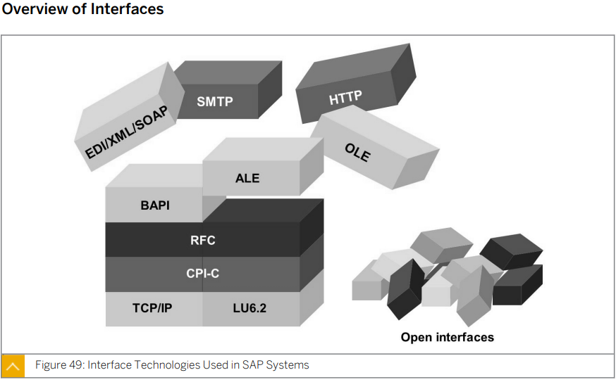
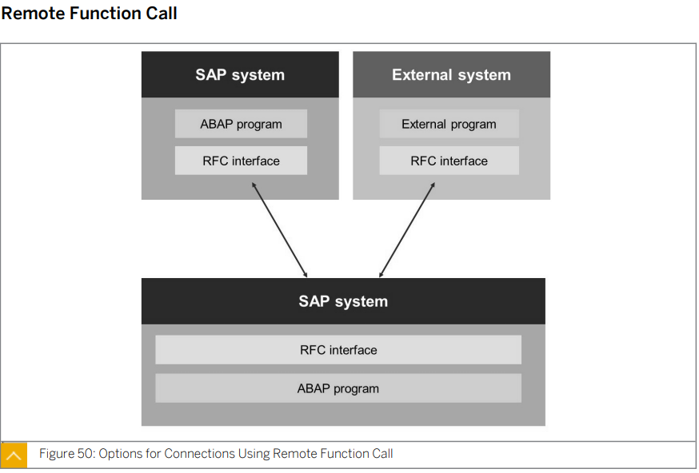
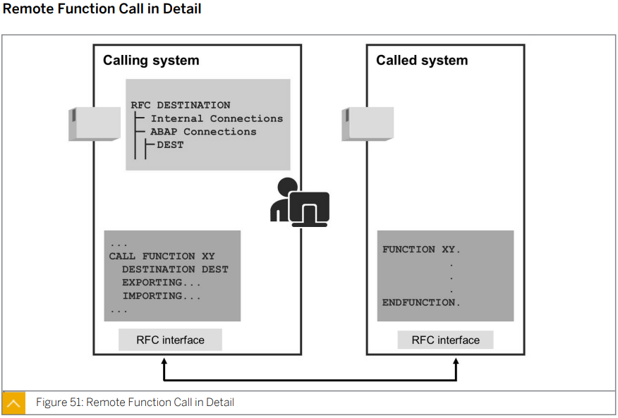
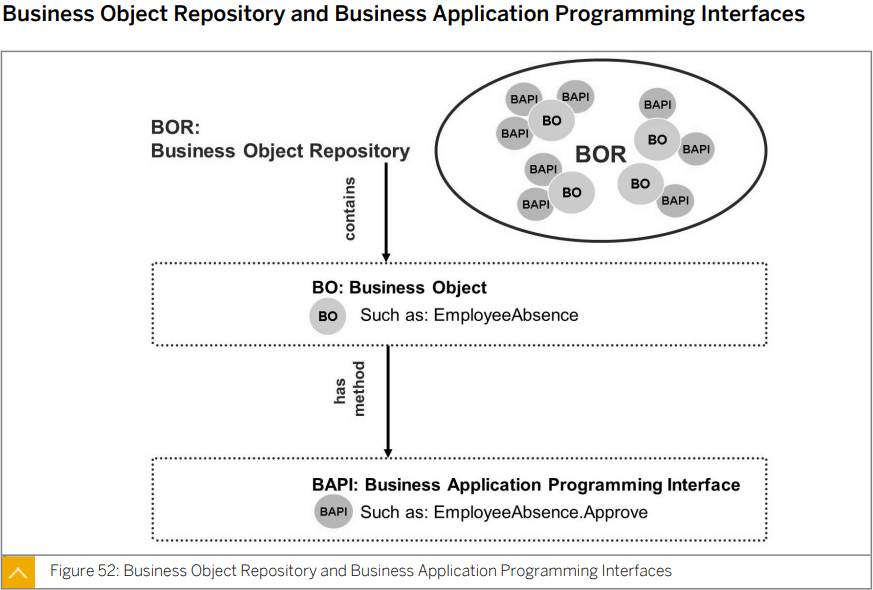
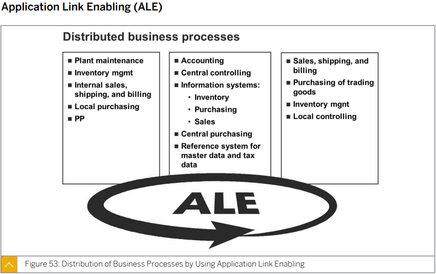
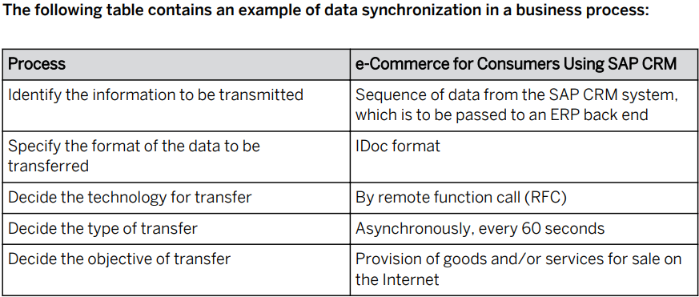
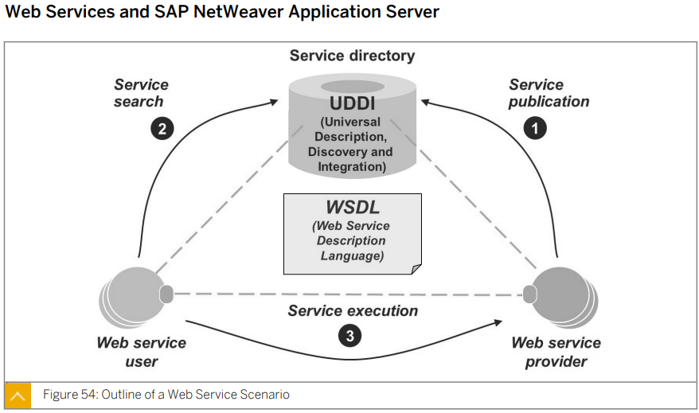

# Unit6 Communication and Integration Technologies

## Lesson1 Describing Communication with *Remote Function Call-Based(RFC)* Technology

XY 라는 RFC를 호출 할때는 CALL FUNCTION XY 를 통해 호출하고 DESTINATION DEST 를 통해 목적지를 지정해 준다.

다른 시스템에서 데이터를 주고 받을때에는 해당 시스템의 RFC가 있어야 한다. 호출하는 시스템에는 DESTINATION이 있어야 한다.

Import에는 param 들이 있을 수 있으며  Export 또한 여러 return 값들이 있을 수 있다.

Exporting 구문 다음에는 호출되어지는 RFC의 Import 파라미터가 오며

Importing 구문 다음에는 호출되어지는 RFC의 export 파라미터가 온다.

여러 **Business Object Repository(BOR)** 들은 여러 **Business Object(BO)**들이 존재하며 method 들을 가지고 있는 여러 **Business Application Programming Interface(BAPI)**들을 제공한다.

데이터를 통합 할때 사용

****

****

## Lesson2 Describing the Basics of Web Services

UDDI에서 웹서비스를 찾는다. 이후 WSDL을 통해 웹서비스를 구현한다. 이후 Web service provider가 제공하는 웹서비스를 사용한다.????

## Lesson3 Describing OData in SAP Gateway

나중에 보기로

