# Unit7 Flow of an ABAP Program

## Lesson1 Describing the Processing of ABAP Programs

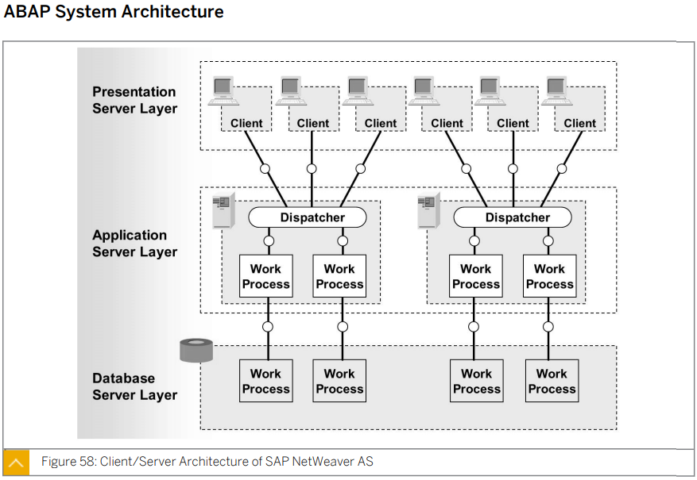

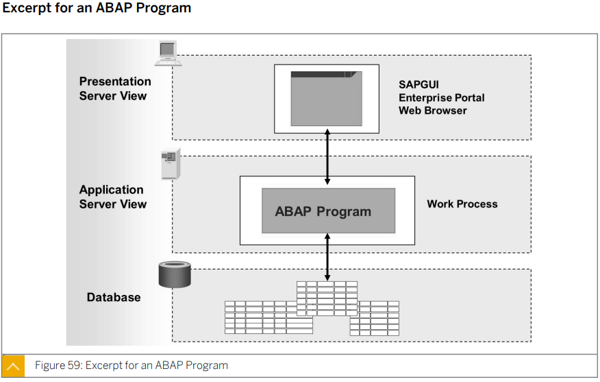

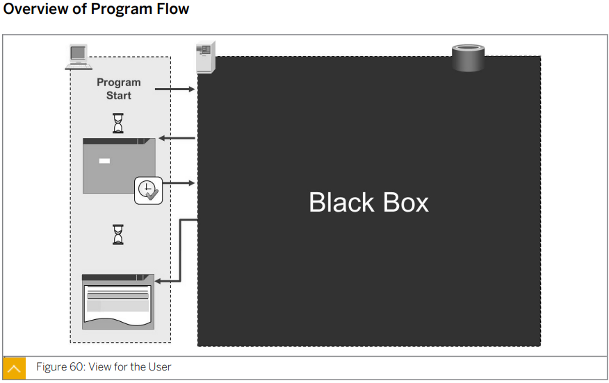

user(end user)는 program view만 관심 있다.

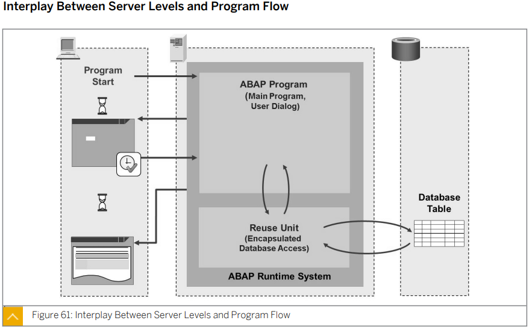

user dialog : 사용자들이 볼 수 있는 스크린

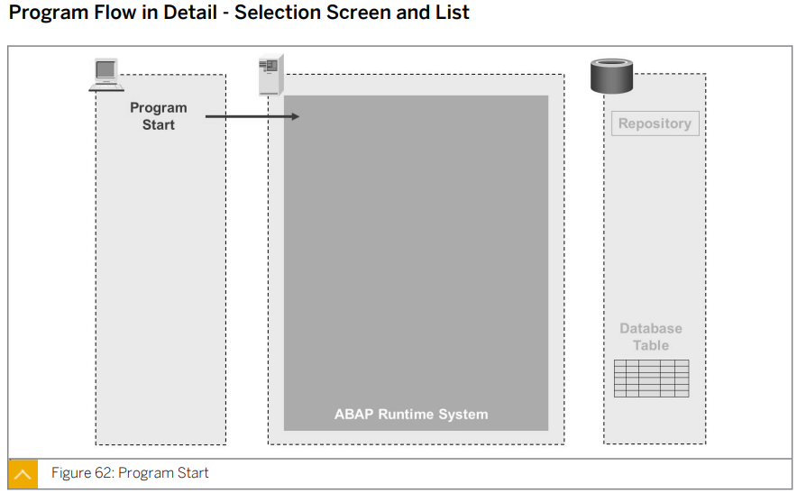

ABAP 프로그램은 프로그램을 생성하면 Database Table의 레파지토리 내부에 생성된다.

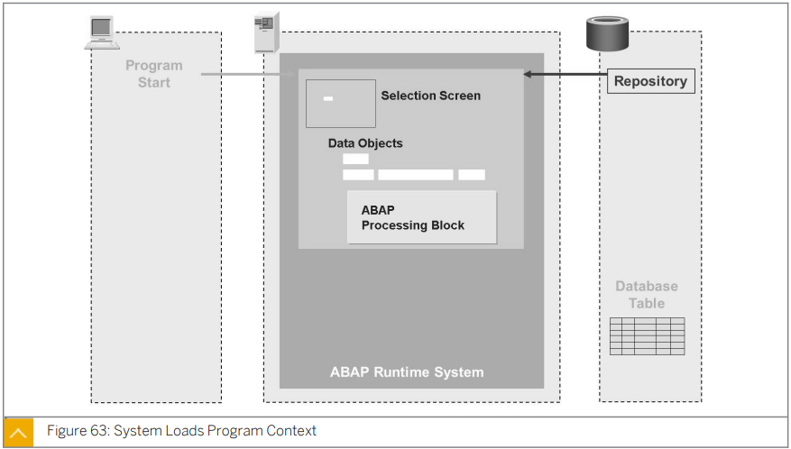

프로그램이 실행 되면 레파지토리에서 프로그램을 읽어 와서 Selection Screen, Data Objects, ABAP Processing Block 등을 가져온다.

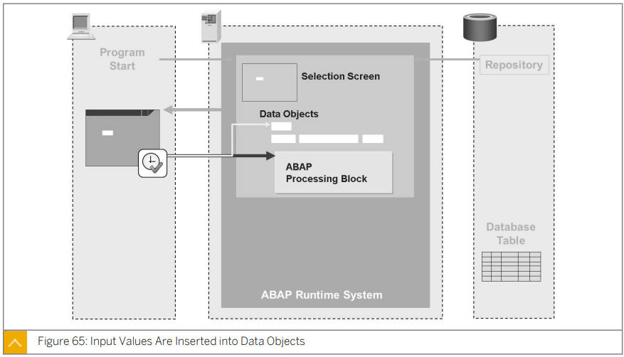

이후 다시 Processing Block이 실행된다.

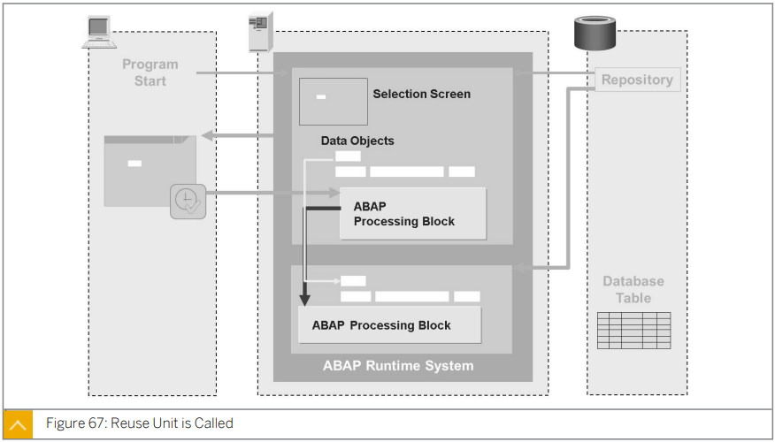

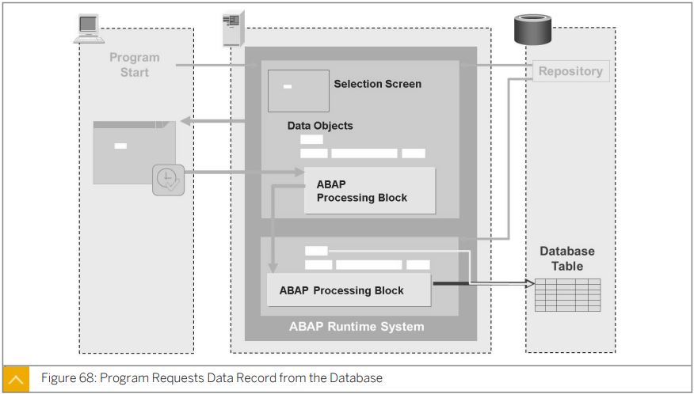

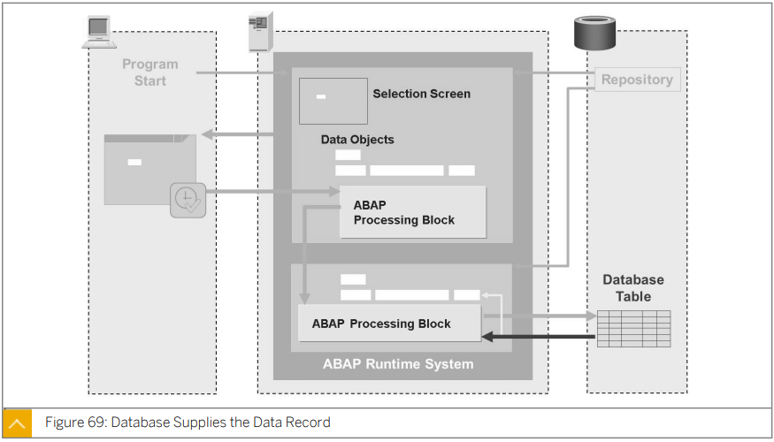

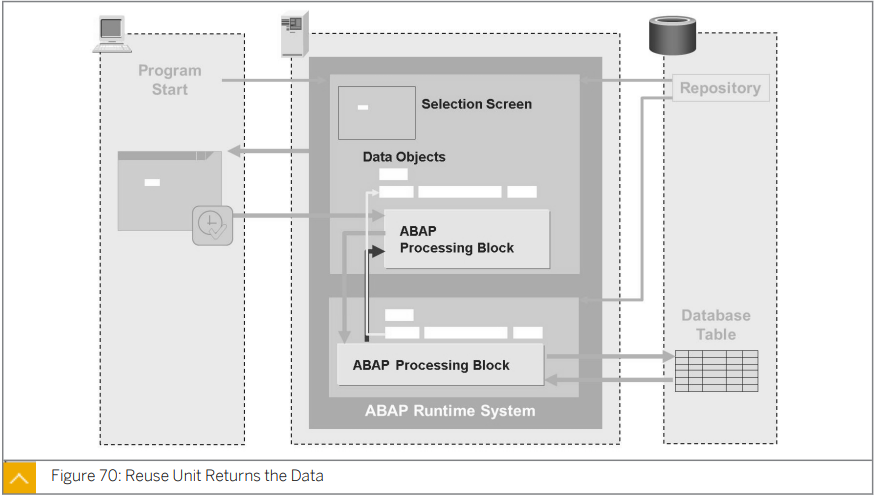

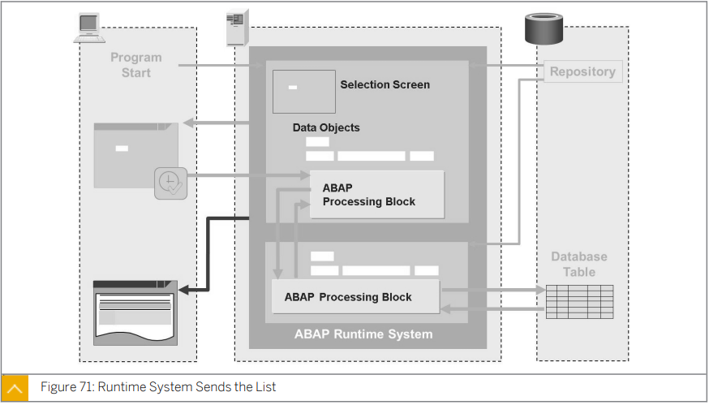

데이터를 순수하게 읽어오고 때로 가공하는 프로그램

