# Unit8 *ABAP Workbench*

## Lesson1 *Introducing the ABAP Workbench*

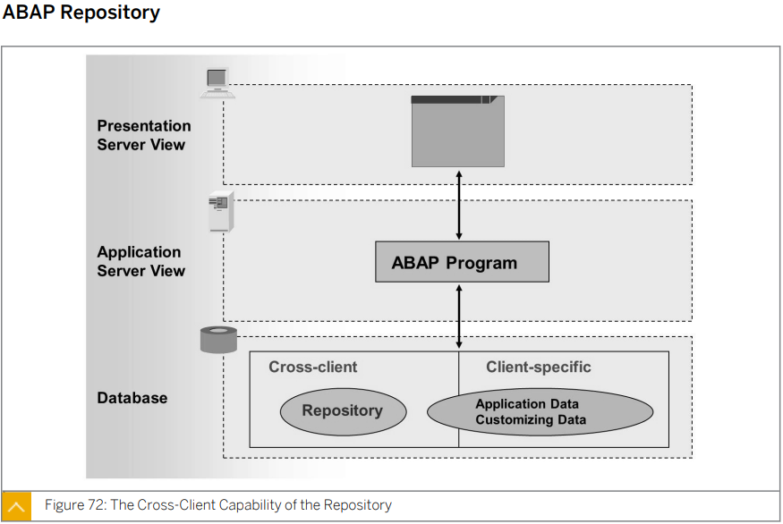

레파지토리에 저장되어 있는 프로그램들은 어느 클라이언트에서 수정을 하나 전부 수정이 된다.

이를 Cross Client 또는 Client independent 라고 한다.

테이블에 저장되어있는 데이터들은 클라이언트 별로 다르다.

이를 Client dependent Client Specific 이라고 한다.

일부 데이터들은 Cross Client로 적용 되며 이는 명시된다.

하나의 프로그램으로 클라이언트별로 회사를 나누어 사용할 수 있다.

또는 1차 2차 3차... 테스트들을 클라이언트 별로 사용할 수 있다.


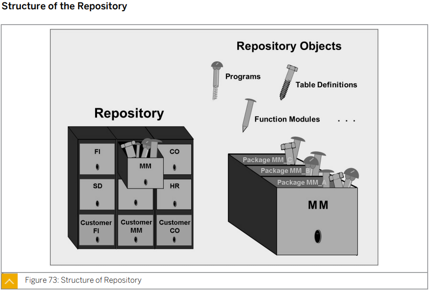

application component

customer component

​	package

​		

모듈가 같은 개념이다. 관리를 위한 시스템


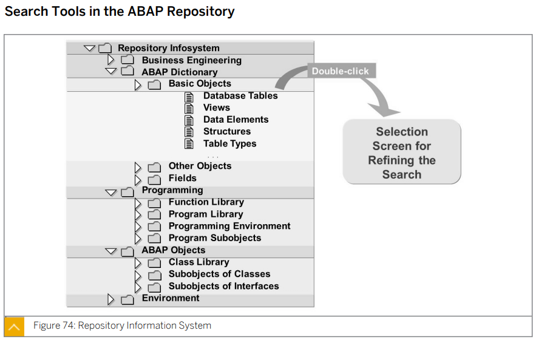


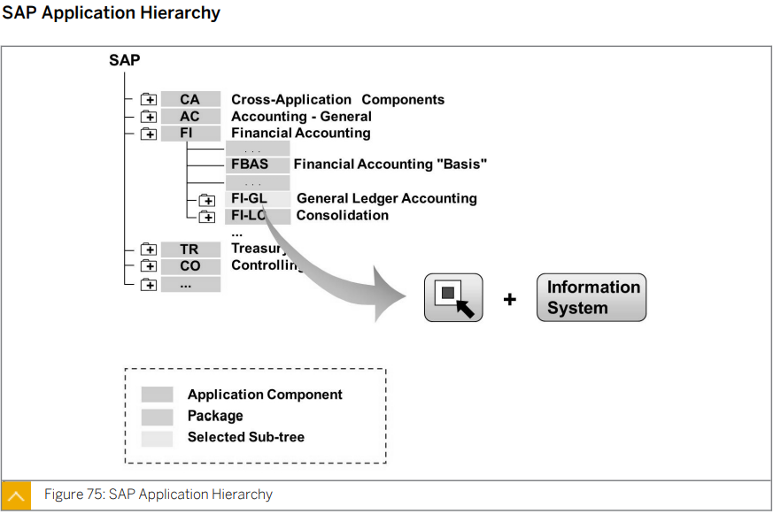


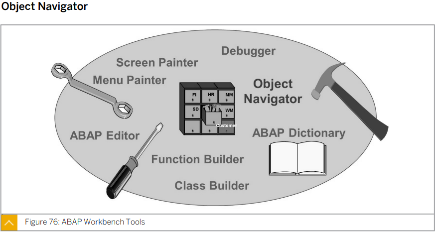

Object Navigator

​	t-code: se80

​	object 카테고리와 object 이름을 통해 검색도 가능하다.

​	favorite 기능도 있다. 잘 사용하진 않음

ABAP Dictionary

​	t-code: se11	

Function Builder

​	t-code: se37

Class Builder

​	t-code: se24

ABAP Editor

​	t-code: se38

Menu Painter

​	t-code: se41

Screen Painter

​	t-code: se51

​	Object Navigator에서 스크린 파일을 더블 클릭시 이동 가능하기 때문에 잘 사용하지 않는다.


****

****


## Lesson2 Organizing ABAP Development Projects


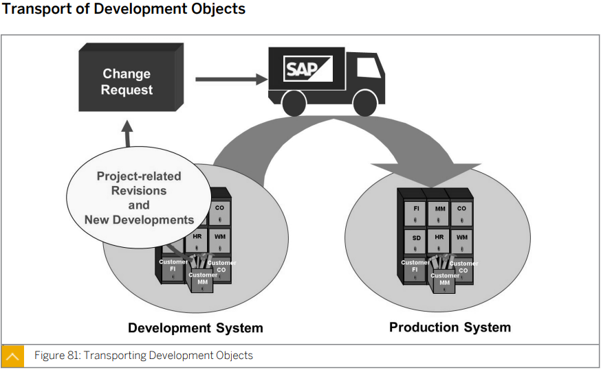

Development System 의 개발된 또는 기존 것을 수정한 시스템들을 Change Request에 할당한다.

이후 이를 Production System 에 적용한다.

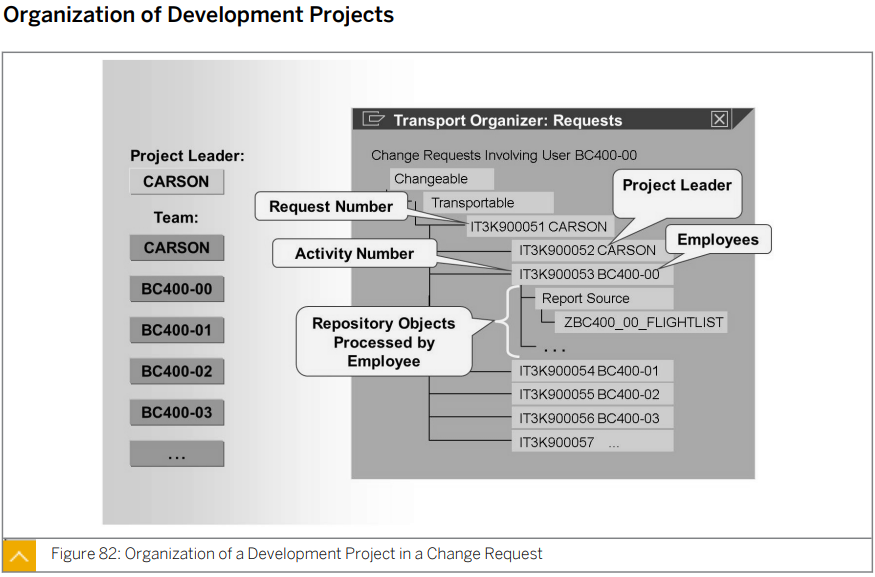

request 번호는 자동 할당 된다. 그 뒤에 만든 user id가 입력된다.

여러개의 파스크 넘버가 있을 수 있다.

여러 팀원들이 존재 하나의 request number에 할당


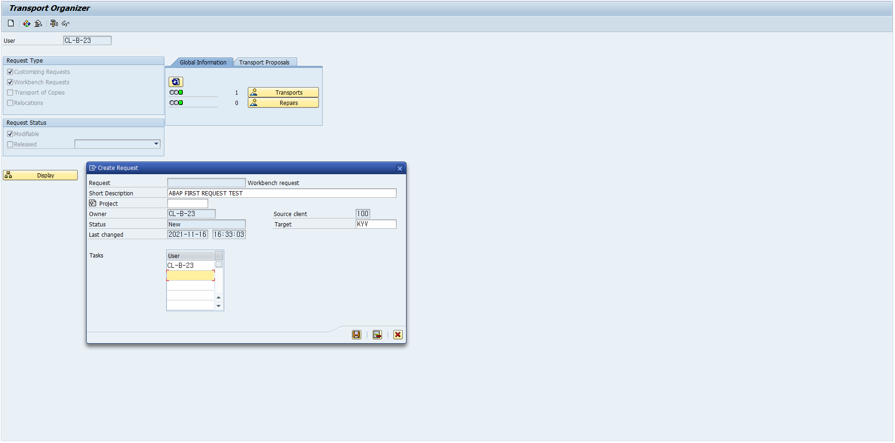

노란칸에 팀원의 이름이 들어가게 된다.

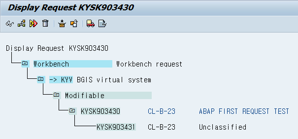


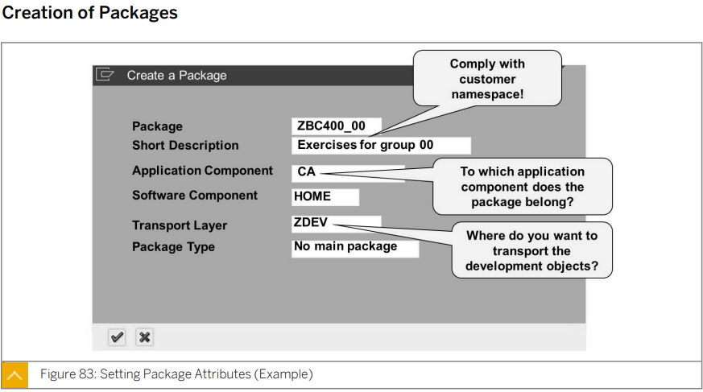

패키지 이름또한 z,y로 시작

패키지 이름, short description 이외는 기본적으로 자동 할당

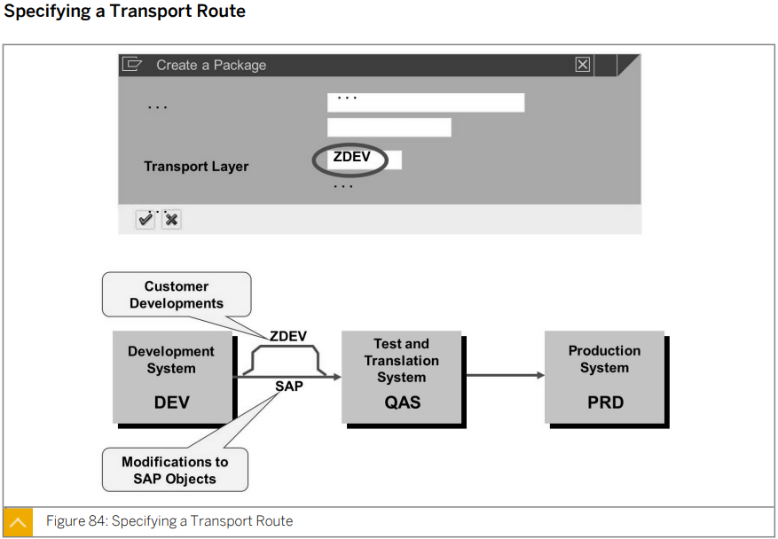


sap에서 제공해주는 프로그램을 수정한 내용을 옮기는 레이어가 SAP 레이어이다.


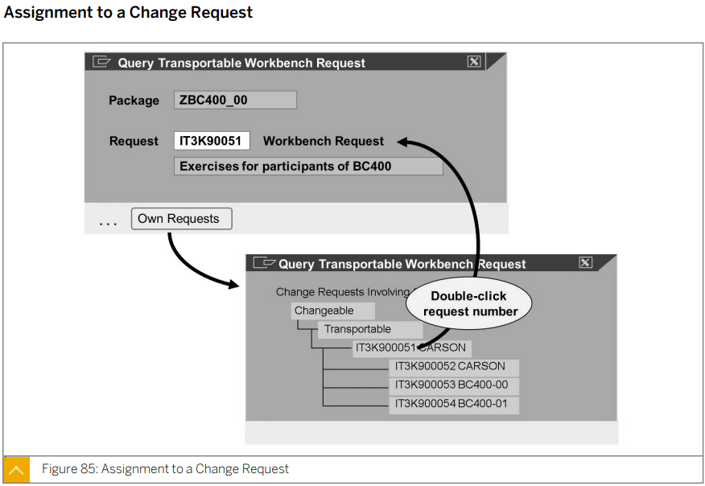

change request 를 입력한다.


****

****


## Lesson3 Developing ABAP Programs


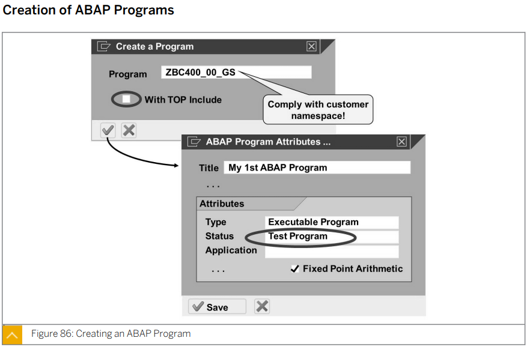

체크박스에는 체크하지 않는다.


The features of the ABAP programming language are as follows:

주로 open sql 사용

특별한 경우가 아니면 native sql은 사용하지 않는다.


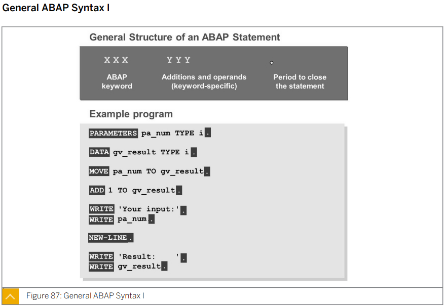

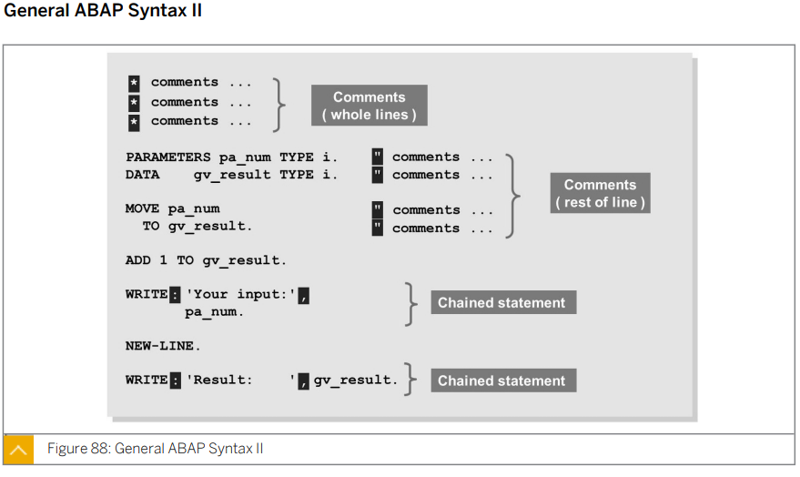

단어와 단어사이는 하나 이상의 공백으로 구분한다.

여러 문장을 한 라인에 사용할 수 있다.

한 문장은 여러라인으로 사용할 수 있다.

마지막에 .로 구분한다.


* PARAMETERS : 파라미터를 입력할 수 있는 selection screen

* DATA :  빈 변수를 초기화

* MOVE : 어떤 변수의 값을 다른 변수에 할당할 때 사용한다.

* ADD : 어떤 값에 어떤 숫자를 더할 때 사용한다.

* WRITE 
  * 화면에 어떤 값을 출력할때 사용한다.
  * 여러개를 출력할때는 WRITE: 뒤에 출력할 내용을 , 로 구분하여 작성한다.
  * 이러한 작성방식을 ***Chained statement***라고 한다.


NEW-LINE : 줄을 바꾼다?


```ABAP
*&---------------------------------------------------------------------*
*& Report ZABAP_SYNTAX_B23
*&---------------------------------------------------------------------*
*&
*&---------------------------------------------------------------------*
REPORT ZABAP_SYNTAX_B23.

DATA gv_result TYPE i.
* gv_result 변수를 int 타입으로 초기화한다.

PARAMETERS pa_num TYPE i.
* pa_num 을 int 타입으로 초기화하고 이 변수에 들어갈 값을 입력할 selection screen을 생성한다.

MOVE pa_num  TO gv_result.
* pa_num 에 할당된 값을 gv_result 에 할당한다.

ADD 1 TO gv_result.
* gv_result에 1을 더해준다.

WRITE 'Your input: '.
WRITE pa_num.
* 'Your input: ' 와 pa_num 에 할당된 값을 한줄에 출력한다.

NEW-LINE.
* 줄을 바꾼다.

WRITE: 'Result    : ',
        gv_result.
* 'Result    : ' 와 gv_result 에 할당된 값을 한줄에 출력한다.
```


*는 주석처리 기호이다.

line의 일부를 주석처리 할때는 "를 붙여 줄의 마지막에 작성한다.


****

****

## Lesson4 Finalizing ABAP Development Projects

