# Unit9 Basic ABAP Language Elements


## Lesson1. Defining Elementary Data Objects


* ## Data Types and Data Objects

  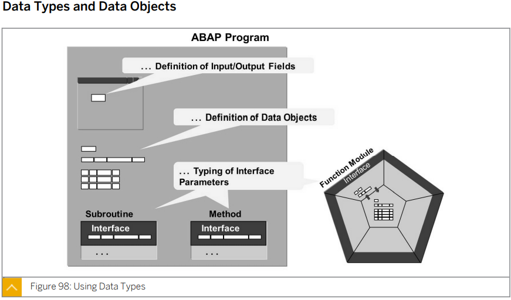

  데이터 타입은 값을 담을 수 있다.

  데이터 오브젝트는 값을 담을 수 있는 용기이다.


* ## Complete Data Type

  | Standard Type | Description                                                  |
  | ------------- | ------------------------------------------------------------ |
  | D             | Type for **date**         format: **YYYYMMDD**    **length 8 (fixed)** |
  | T             | Type for **time**         format: **HHMMSS**         **length 6 (fixed)** |
  | I, INT8       | Type for **integer**    either **length 4** (fixed) (for I) , or **length 8** (fixed for INT 8) |
  | F             | Type for **Floating Point Num**    **length 8 (fixed)**      |
  | STRING        | Type for **Dynamic Length Character String**                 |
  | XSTRING       | Type for **Dynamic Length Byte Sequence (HeXadecimal String)** |
  | DECFLOAT16    | Types for **DECimal FLOATing Point numbers** with mantissa and exponent    **length 8 bytes with 16 decimal places (fixed)** |
  | DECFLOAT34    | Types for **DECimal FLOATing Point numbers** with mantissa and exponent    **length 16 bytes with 34 decimal places (fixed)** |

* ## Incomplete Data Type

  TYPE 뒤에 LENGTH 로 길이를 정해주거나 변수명 뒤에 (_길이_) 를 붙여 길이를 정해줄수 있다.

  | Standard Type | Description                                                  |
  | ------------- | ------------------------------------------------------------ |
  | C             | Type for **Character String** (**C**haracter) for which the length is to be specified |
  | N             | Type for **Numerical Character String** (**N**umerical Character) for which the length is to be specified |
  | X             | Type for **Byte Sequence** (He**X**adecimal String) for which the length is to be specified |
  | P             | Type for **Packed Number** (**P**acked number) for which the length is to be specified (In the definition of a packed number, the number of decimal points might also be specified.)  소숫점 자리수를 적게 사용하고자 할때 사용 |

  

  ##### Program *ZABAP_STDTYPE_B23* of Package *ZBC400_B23*

  ```ABAP
  *&---------------------------------------------------------------------*
  *& Report ZABAP_STDTYPE_B23
  *&---------------------------------------------------------------------*
  *&
  *&---------------------------------------------------------------------*
  REPORT zabap_stdtype_b23.
  
  PARAMETERS: pa_date TYPE d.
  
  DATA: gv_date TYPE d.
  
  gv_date = '20211117'.
  
  WRITE: 'Today:    ', gv_date,
       / 'Birthday: ', pa_date.
  
  
  
  
  DATA: gv_char TYPE c LENGTH 10,
        gv_num  TYPE n LENGTH 4,
        gv_int  type i .
  ```

  

* ## Local Data Types

  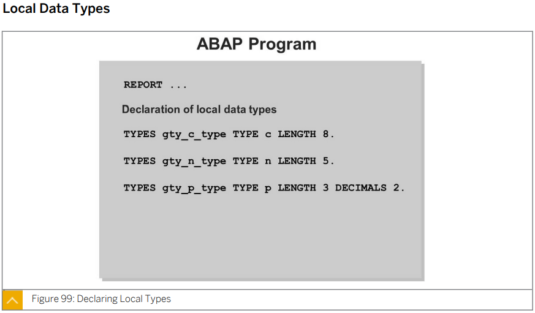

  해당 프로그램 안에서만 사용할 수 있다.


* ## Global Data Types

  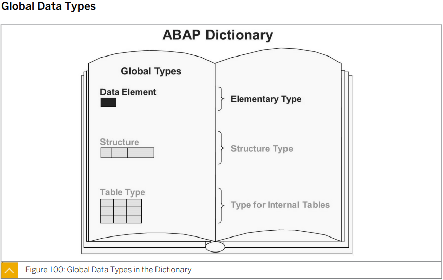


* ## Definition of Variable Data Objects

  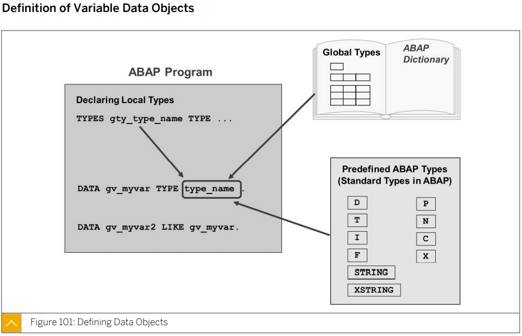

  * type_name에는 STD Data Type 또는 현재 프로그램에서 정의한 Local Data Type이 올 수 있다.
  * LIKE는 기준으로 왼쪽의 변수를 오른쪽 변수의 타입으로 초기화한다.

  

* ## Categories of Data Types


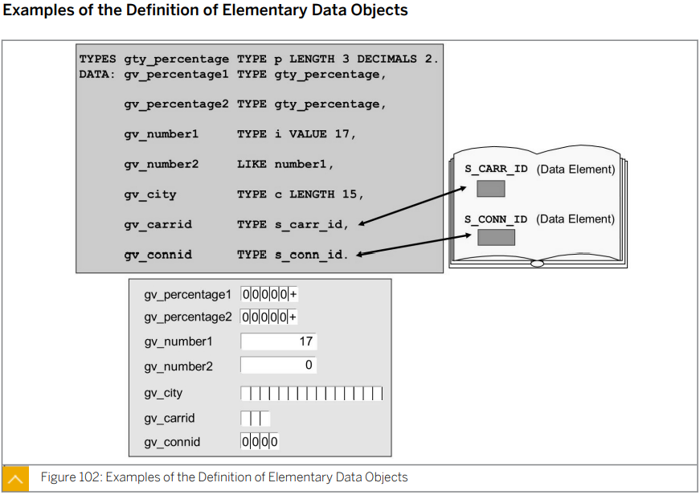

P 타입 - LENGTH * 2 의 길이로 생기며 마지막은 + - 를 결정하는 칸이 된다. 또 DECIMALS 만큼이 소숫점 아래 자리수로 할당되며 나머지는 정수부분으로 할당된다. 

VALUE : 기본값을 할당해 준다.


```ABAP
*&---------------------------------------------------------------------*
*& Report ZABAP_VARIABLE_B23
*&---------------------------------------------------------------------*
*&
*&---------------------------------------------------------------------*
REPORT zabap_variable_b23.

TYPES tv_percentage TYPE p LENGTH 3 DECIMALS 2.

DATA: gv_percentage TYPE tv_percentage,
      gv_int1       TYPE i VALUE 20,
      gv_city       TYPE c LENGTH 20 VALUE 'Seoul',
      gv_int2       LIKE gv_int1,
      gv_carrid     TYPE s_carr_id.


gv_percentage = '52.027'.
* 지정한 DECIMALS를 초과하면 반올림하여 지정한만큼만 나타낸다.

CONSTANTS gc_pi TYPE tv_percentage VALUE '3.14'.


WRITE:/ gv_percentage,
      / gv_int1,
      / gv_city,
      / gv_int2,
      / gv_carrid.
```


## 이부분은 다시 확인 

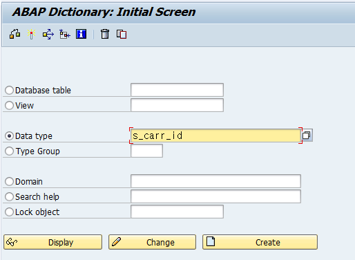


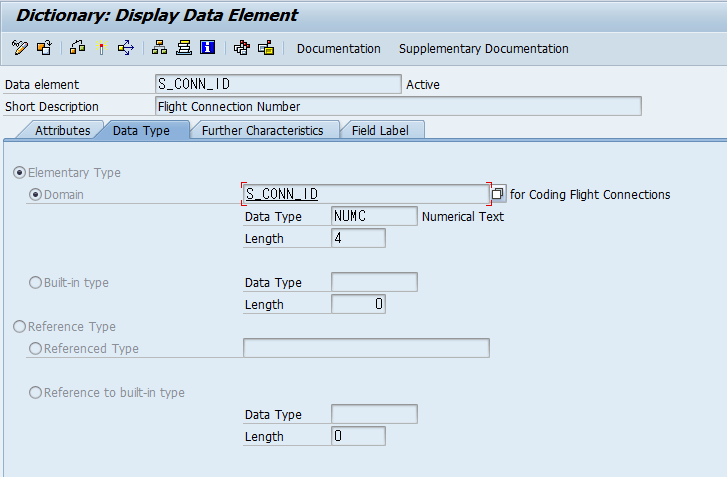


* ## Literals, Constants, and Text Symbols

  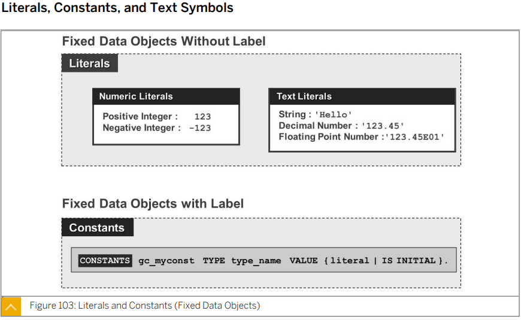

  소숫점이 들어갈 때에는 ''을 써주어야 한다. 소숫점이 문장의 끝으로 인식되어 오류!!

  상수를 선언할때는 CONSTANTS 를 사용한다. ==> 수정 불가능

  ```ABAP
  CONSTANTS gc_myconst TYPE type_name VALUE (LITERAL | IS INITIAL) .
  CONSTANTS gc_pi TYPE tv_percentage VALUE '3.14'.
  ```


* ## Text Symbols

  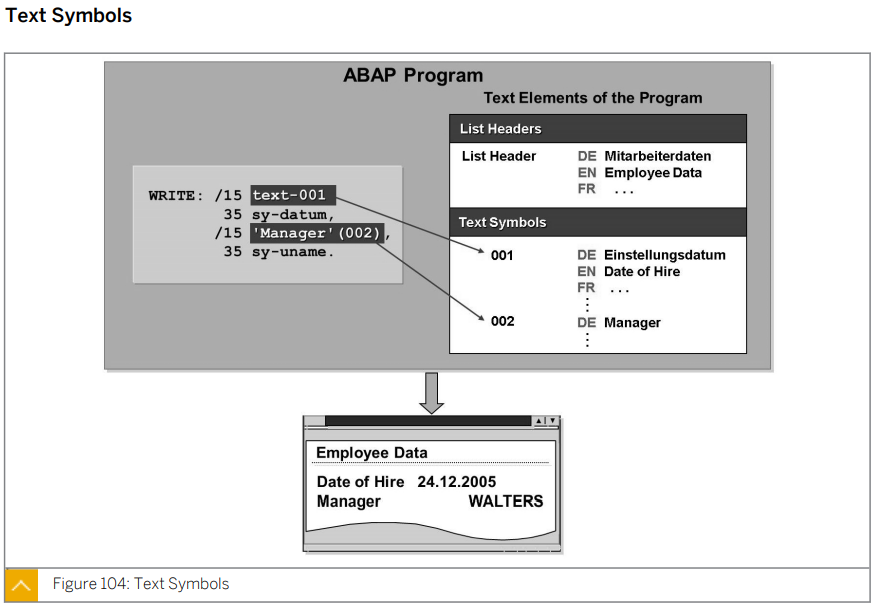

  기본적으로 프로그램에서의 출력문은 언어설정과 무관하게 출력된다.

  text-_Text Symbols_ 를 통해 언어설정에 따라 출력을 지정할 수 있다.

  text symbols 들어가는 법 text code를 더블 클릭 또는 '문자열'()에 붙은 부분을 클릭 text elements를 클릭

  ```ABAP
  *&---------------------------------------------------------------------*
  *& Report ZBC400_23_HELLO
  *&---------------------------------------------------------------------*
  *&
  *&---------------------------------------------------------------------*
  REPORT zbc400_23_hello.
  
  PARAMETERS pa_name TYPE string.
  
  *WRITE 'Hello World!'.
  *NEW-LINE.
  *WRITE: 'Hello',
  *       pa_name.
  
  WRITE: 'Hello World!',
       / 'Hello',
         pa_name.
  
  WRITE: TEXT-001.
  
  WRITE: 'Hello'(abc), pa_name.
  ```

  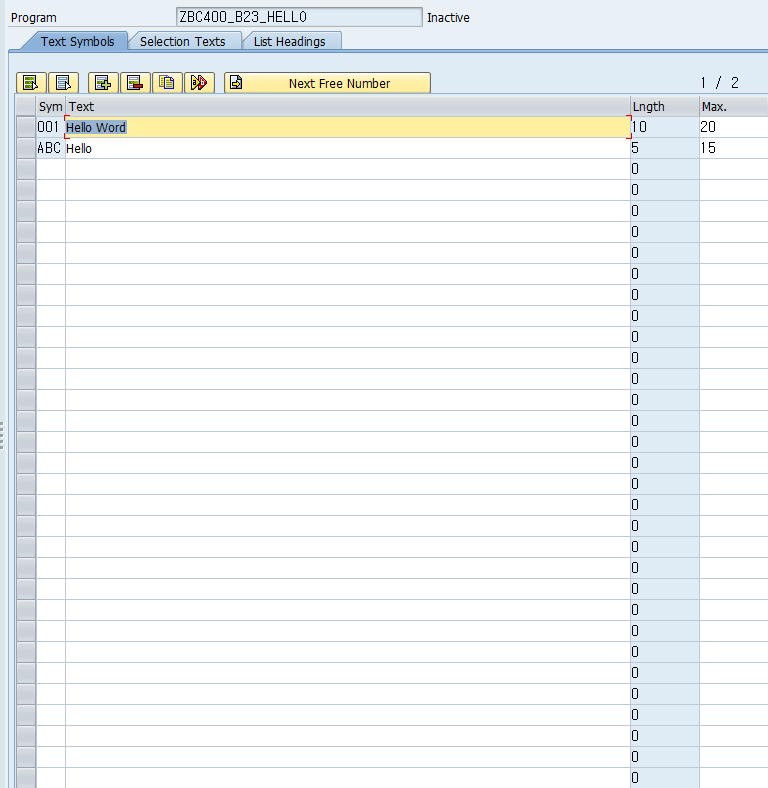

  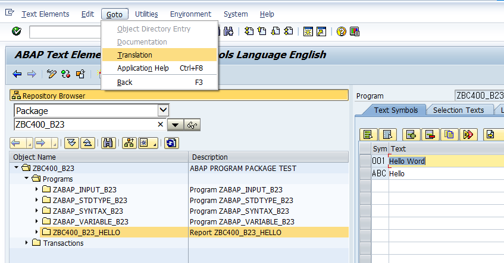

  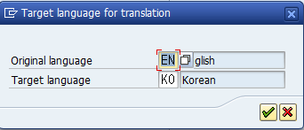

  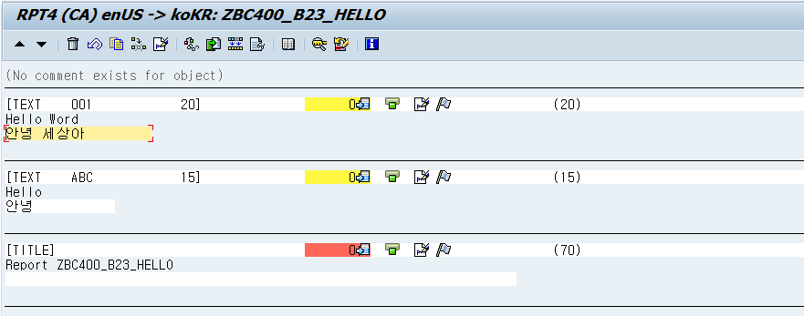

  


* ## Comparison - Local and Global Data Types

  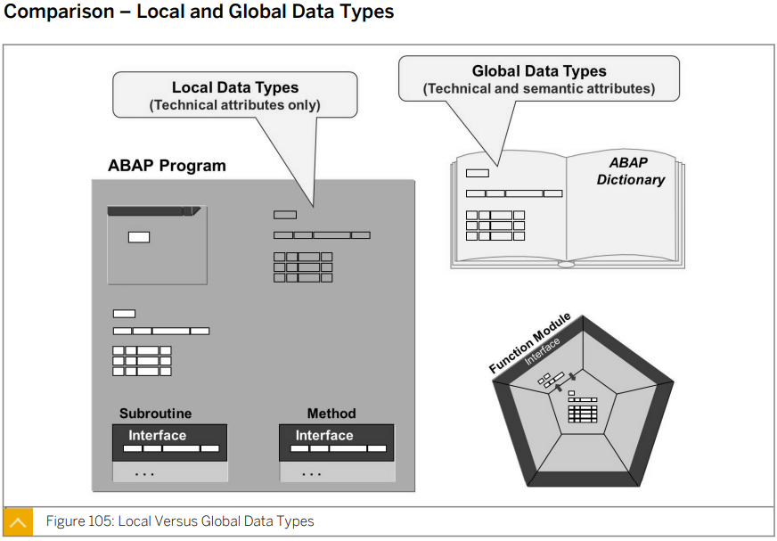

  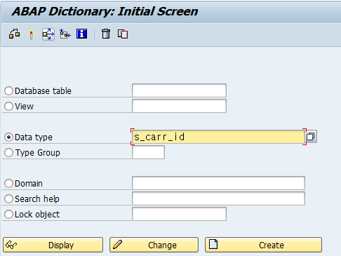

  


****

****


## Lesson2. Using Basic ABAP Statements


* ## Value Assignments (변수 할당)

  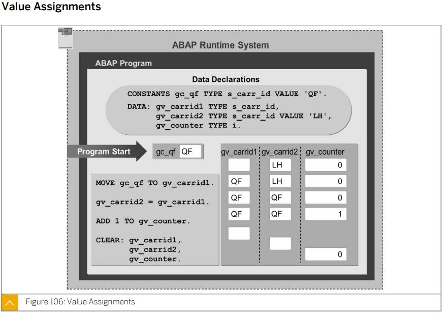

  ```ABAP
  *&---------------------------------------------------------------------*
  *& Report ZABAP_VALUE_B23
  *&---------------------------------------------------------------------*
  *&
  *&---------------------------------------------------------------------*
  REPORT zabap_value_b23.
  
  DATA: gv_carrid1 TYPE s_carr_id,
        gv_carrid2 LIKE gv_carrid1 VALUE 'AA',
        gv_count   TYPE i.
  
  CONSTANTS: gc_qf TYPE s_carr_id VALUE 'LH'.
  
  MOVE gc_qf TO gv_carrid1.
  gv_carrid1 = gc_qf.
  
  gv_carrid2 = gv_carrid1.
  *MOVE gv_carrid1 TO gv_carrid2.
  
  gv_count = gv_count + 1.
  *ADD 1 TO gv_count.
  
  ULINE.
  WRITE:/ 'gv_carrid1 : ', gv_carrid1,
        / 'gv_carrid2 : ', gv_carrid2,
        / 'gv_count   : ', gv_count.		"타입만 선언해주고 정의해 주지 않아 기본값 0이되었으며 + 1이 되어 1이 출력된다.
  
  ULINE.
  CLEAR: gv_carrid1,
         gv_carrid2,
         gv_count.
  
  WRITE:/ 'gv_carrid1 : ', gv_carrid1,
        / 'gv_carrid2 : ', gv_carrid2,
        / 'gv_count   : ', gv_count.
  
  
  WRITE:/ 'gv_carrid1 : ', gv_carrid1,
        / 'gv_carrid2 : ', gv_carrid2,
        / 'gv_count   : ', gv_count.
  
  CLEAR: gv_carrid1,
         gv_carrid2,
         gv_count.
  ```

  

  

* ## Calculations and Arithmetic Expressions

  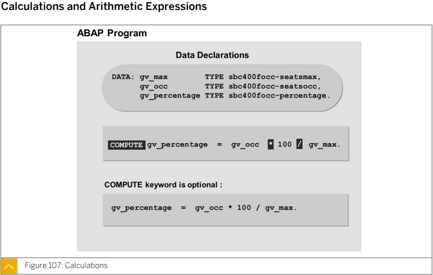

  strlen: 문자열의 길이를 반환

  ##### ZABAP_CALC_B23

  ```ABAP
  *&---------------------------------------------------------------------*
  *& Report ZABAP_CALC_B23
  *&---------------------------------------------------------------------*
  *&
  *&---------------------------------------------------------------------*
  REPORT zabap_calc_b23.
  
  DATA: gv_perc TYPE p LENGTH 8 DECIMALS 2,
        gv_len  TYPE i.
  
  PARAMETERS: pa_max TYPE i,
              pa_occ TYPE i,
              pa_str TYPE string.
  
  gv_perc = pa_occ / pa_max * 100.
  gv_len = strlen ( pa_str ).
  
  WRITE:/ 'Percentage : ', gv_perc,
        / 'Length     : ', gv_len.
  
  
  *Report ZABAP_CALC_B23
  
  *Percentage :             50.
  *Length     :          26
  ```

  * #### 실습 - 할인가 출력하기

    ##### ZABAP_DISC_B23

    ```ABAP
    *&---------------------------------------------------------------------*
    *& Report ZABAP_DISC_B23
    *&---------------------------------------------------------------------*
    *&
    *&---------------------------------------------------------------------*
    REPORT zabap_disc_b23.
    
    PARAMETERS pa_amt TYPE p LENGTH 5 DECIMALS 2.
    PARAMETERS pa_dic LIKE pa_amt.
    PARAMETERS pa_tax LIKE pa_amt.
    
    *DATA: pa_rslt1 LIKE pa_amt,
    *      pa_dic2 LIKE pa_dic.
    *
    *pa_dic2 = 100 - pa_dic.
    *pa_rslt1 = pa_amt * pa_dic2 / 100.
    
    
    DATA: pa_rslt1 LIKE pa_amt.
    DATA: pa_rslt2 LIKE pa_amt.
    
    *pa_rslt1 = pa_amt - pa_amt * pa_dic / 100.
    pa_rslt1 = pa_amt * ( 100 - pa_dic ) / 100.
    pa_rslt2 = pa_amt * ( 100 + pa_tax ) / 100.
    
    WRITE: 'pa_rslt = ', pa_rslt.
    
    
    * Report ZABAP_DISC_B23
    
    * pa_rslt1 =       80.00
    * pa_rslt2 =      120.00
    ```

    

    

  * 

    ##### ZABAP_DIV_B23

    ```ABAP
    *&---------------------------------------------------------------------*
    *& Report ZABAP_DIV_B23
    *&---------------------------------------------------------------------*
    *&
    *&---------------------------------------------------------------------*
    REPORT zabap_div_b23.
    
    DATA: gv_result1 TYPE p LENGTH 3 DECIMALS 1,
          gv_result2 TYPE p LENGTH 3 DECIMALS 1,
          gv_result3 TYPE i,
          gv_rem     TYPE i.
    
    gv_result1 = 10 / 3.
    gv_result2 = 10 DIV 3.
    gv_result3 = 10 / 3.
    gv_rem = 10 MOD 3.
    
    WRITE:/ 'result1   : ', gv_result1,
          / 'result2   : ', gv_result2,
          / 'result3   : ', gv_result3,
          / 'remainder : ', gv_rem.
    
    
    
    * Report ZABAP_DIV_B23
    
    * result1   :     3.3
    * result2   :     3.0
    * result3   :           3
    * remainder :           1
    ```


* ## Conditional Branches and Logical Expression (조건문과 논리식)

  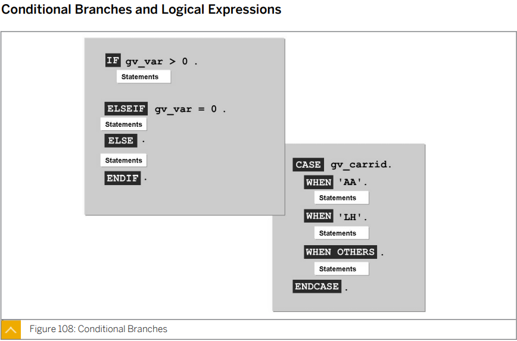

  ##### ZABAP_CASE_B23

  ```ABAP
  *&---------------------------------------------------------------------*
  *& Report ZABAP_CASE_B23
  *&---------------------------------------------------------------------*
  *&
  *&---------------------------------------------------------------------*
  REPORT zabap_case_b23.
  
  PARAMETERS : pa_car TYPE s_carr_id.
  
  CASE pa_car.
    WHEN 'AA'.
      WRITE 'American Airline'.
    WHEN 'BA'.
      WRITE 'British Airways'.
    WHEN 'DL'.
      WRITE 'Delta Airline'.
    WHEN OTHERS.
      WRITE 'Other Airline'.
  ENDCASE.
  
  NEW-LINE.
  ULINE.
  
  IF pa_car = 'AA' AND sy-datum >= '20211117'. " sy-datum : sy로 시작하는 것들은 시스템에서 어떤 값들을 리턴해주는데 sy-datum는 시스템의 날짜를 리턴해준다.
    WRITE: 'American airline', sy-datum.
  ELSEIF pa_car > 'AA' AND pa_car < 'LH'.
    WRITE 'BA ~ LH'.
  ELSEIF pa_car BETWEEN 'NG' AND 'NW'.
    WRITE 'NG ~~~~ NW'.
  ELSE.
    WRITE 'Other'.
  ENDIF.
  
  
  
  IF pa_car IS INITIAL.
    WRITE /'initial'.
  ELSE.
    WRITE /'not initial'.
  ENDIF.
  ```

  <> not equal

  IS NOT INITIAL 각 변수마다 이니셜밸류 값을 갖는데

  * #### 실습 - 원둘레

    * pa-rad - 반지름
    * pa-op 
      * r: 원둘레
      * a: 원넓이
      * 이외는 'Invalid Operator!' Display
    * pi - 상수로 선언

    ##### ZABAP_CIRCLE_B23

    ```ABAP
    *&---------------------------------------------------------------------*
    *& Report ZABAP_CIRCLE_B23
    *&---------------------------------------------------------------------*
    *&
    *&---------------------------------------------------------------------*
    REPORT zabap_circle_b23.
    
    PARAMETERS: pa_rad TYPE p LENGTH 5 DECIMALS 2,
                pa_op  TYPE c LENGTH 1.
    
    DATA gv_rst LIKE pa_rad.
    
    CONSTANTS gc_pi LIKE pa_rad VALUE '3.14'.
    
    IF pa_op = 'R'.
      rst = 2 * pi * pa_rad.
      WRITE: 'result : ', rst.
    ELSEIF pa_op = 'A'.
      rst = pi * pa_rad ** 2.
      WRITE: 'result : ', rst.
    ELSE.
      WRITE  'Invalid Operator!'.
    ENDIF.
    
    
    CASE pa_op.
      WHEN 'R'.
        gv_rst = 2 * gc_pi * pa_rad.
        WRITE: 'result : ', gv_rst.
      WHEN 'A'.
        gv_rst = gc_pi * pa_rad ** 2.
        WRITE: 'result : ', gv_rst.
      WHEN OTHERS.
        WRITE  'Invalid Operator!'.
    ENDCASE.
    ```

    


****

****


## Lesson3. Analyzing Programs with the ABAP Debugger