# Unit9 Basic ABAP Language Elements


# Lesson1. Defining Elementary Data Objects

****

## 개요

기본 데이터 오브젝트의 사용과 ABAP 프로그램에서 기본 데이터 오브젝트가 어떻게 정의되는지 설명한다.

* TYPE 과 VARIABLE의 차이점과 사용 방식
* LOCAL / GLOBAL DATA TYPE의 차이점과 사용방식
* LITERAL, CONSTANTS, TEXT SYMBAL의 사용

## 목표

*  DATA TYPE 및 DATA OBJECT 비교

****


* ## Data Types and Data Objects

  

  * ### Data Object

    데이터 오브젝트의 유형에 따라 해당 기술적 속성이 정의된다.
  
  * ### Interface Parameters
  
    인터페이스 매개변수의 유형에 따라 모듈화 단위가 호출될 때 전송되는 실제 배개변수의 유형이 결정된다.
  
  * ### Input / Output Fields
  
    입력/출력 필드의 유형을 통해 기술적 특징에 대한 추가 정보가 제공될 수 있다.
  
    

****


* ## Standard Data Type

  #### *<u>단골문제</u>*

  * ### Complete Data Type

    | Standard Type  | Description                                                  |
    | -------------- | ------------------------------------------------------------ |
    | **D**          | Type for **date**         format: **YYYYMMDD**    **length 8 (fixed)** |
    | **T**          | Type for **time**         format: **HHMMSS**         **length 6 (fixed)** |
    | **I, INT8**    | Type for **integer**    either **length 4** (fixed) (for I) , or **length 8** (fixed for INT 8) |
    | **F**          | Type for **Floating Point Num**    **length 8 (fixed)**      |
    | **STRING**     | Type for **Dynamic Length Character String**                 |
    | **XSTRING**    | Type for **Dynamic Length Byte Sequence (HeXadecimal String)** |
    | **DECFLOAT16** | Types for **DECimal FLOATing Point numbers** with mantissa and exponent    **length 8 bytes with 16 decimal places (fixed)** |
    | **DECFLOAT34** | Types for **DECimal FLOATing Point numbers** with mantissa and exponent    **length 16 bytes with 34 decimal places (fixed)** |


  * ### Incomplete Data Type

    TYPE 뒤에 LENGTH 로 길이를 정해주거나 변수명 뒤에 (_길이_) 를 붙여 길이를 정해줄수 있다.

    | Standard Type | Description                                                  |
    | ------------- | ------------------------------------------------------------ |
    | **C**         | Type for **Character String** (**C**haracter) for which the length is to be specified |
    | **N**         | Type for **Numerical Character String** (**N**umerical Character) for which the length is to be specified |
    | **X**         | Type for **Byte Sequence** (He**X**adecimal String) for which the length is to be specified |
    | **P**         | Type for **Packed Number** (**P**acked number) for which the length is to be specified (In the definition of a packed number, the number of decimal points might also be specified.)  소숫점 자리수를 적게 사용하고자 할때 사용<br>LENGTH * 2 의 길이로 생기며 마지막은 + - 를 결정하는 칸이 된다. 또 DECIMALS 만큼이 소숫점 아래 자리수로 할당되며 나머지는 정수부분으로 할당된다. |

    

    ##### Program *ZABAP_STDTYPE_B23* of Package *ZBC400_B23*

    ```ABAP
    *&---------------------------------------------------------------------*
    *& Report ZABAP_STDTYPE_B23
    *&---------------------------------------------------------------------*
    *&
    *&---------------------------------------------------------------------*
    REPORT zabap_stdtype_b23.
    
    PARAMETERS: pa_date TYPE d.
    
    DATA: gv_date TYPE d.
    
    gv_date = '20211117'.
    
    WRITE: 'Today:    ', gv_date,
         / 'Birthday: ', pa_date.
    
    
    
    
    DATA: gv_char TYPE c LENGTH 10,
          gv_num  TYPE n LENGTH 4,
          gv_int  type i .
    ```


****


* ## Local Data Types

  

  STD Data Type 을 사용하면 프로그램에서 기본 표준 데이터 유형보다 더 완전하거나 복합적인 로컬 데이터 유형을 선언할 수 있다.
  
  Local Data Type은 해당 프로그램 안에만 존재하므로 해당 프로그램에서만 사용할 수 있다.
  
  **Types 문 사용!!**
  
  #### 변수 이름 설정
  
  * tv : Single Value
  * ts : Structure
  * tt : Table 


* ## Global Data Types

  

  ABAP 딕셔너리에 선언되어있는 Data Type 은 관련된 SAP 시스템 전반에서 사용할 수 있으며 Global Data Type 이라고 한다.

  

  #### 세가지로 유형으로 존재한다.

  * elementary type
  * structure type
  * type for internal table (internal type)


****


* ## Definition of Variable Data Objects

  

  * type_name에는 STD Data Type 또는 Global Data Type 또는 현재 프로그램에서 정의한 Local Data Type이 올 수 있다.
  * LIKE는 기준으로 왼쪽의 변수를 오른쪽 변수의 타입으로 초기화한다.

  

#### VALUE : 기본값을 할당해 준다.

* ## 실습

  ```ABAP
  *&---------------------------------------------------------------------*
  *& Report ZABAP_VARIABLE_B23
  *&---------------------------------------------------------------------*
  *&
  *&---------------------------------------------------------------------*
  REPORT zabap_variable_b23.
  
  TYPES tv_percentage TYPE p LENGTH 3 DECIMALS 2.
  
  DATA: gv_percentage TYPE tv_percentage,
        gv_int1       TYPE i VALUE 20,
        gv_city       TYPE c LENGTH 20 VALUE 'Seoul',
        gv_int2       LIKE gv_int1,
        gv_carrid     TYPE s_carr_id.
  
  
  gv_percentage = '52.027'.
  * 지정한 DECIMALS를 초과하면 반올림하여 지정한만큼만 나타낸다.
  
  CONSTANTS gc_pi TYPE tv_percentage VALUE '3.14'.
  
  
  WRITE:/ gv_percentage,
        / gv_int1,
        / gv_city,
        / gv_int2,
        / gv_carrid.
  ```

  


* ## Data Type 검색방법 

  

  


* ## Literals, Constants, and Text Symbols

  

  #### 소숫점이 들어갈 때에는 'xx.xxx'와 같이 '로 감싸주어야한다. 소숫점이 문장의 끝으로 인식되어 오류!!

  #### 상수를 선언할때는 CONSTANTS 를 사용한다. ==> 수정 불가능

  ```ABAP
  CONSTANTS gc_myconst TYPE type_name VALUE ( LITERAL | IS INITIAL ) .
  CONSTANTS gc_pi TYPE tv_percentage VALUE '3.14'.
  ```


* ## Text Symbols

  

  기본적으로 프로그램에서의 출력문은 언어설정과 무관하게 출력된다.

  text-_Text Symbols_ 를 통해 언어설정에 따라 출력을 지정할 수 있다.

  text symbols 들어가는 법 text code를 더블 클릭 또는 '문자열'()에 붙은 부분을 클릭 text elements를 클릭

  ```ABAP
  *&---------------------------------------------------------------------*
  *& Report ZBC400_23_HELLO
  *&---------------------------------------------------------------------*
  *&
  *&---------------------------------------------------------------------*
  REPORT zbc400_23_hello.
  
  PARAMETERS pa_name TYPE string.
  
  *WRITE 'Hello World!'.
  *NEW-LINE.
  *WRITE: 'Hello',
  *       pa_name.
  
  WRITE: 'Hello World!',
       / 'Hello',
         pa_name.
  
  WRITE: TEXT-001.
  
  WRITE: 'Hello'(abc), pa_name.
  ```

  

  

  

  

  


* ## Comparison - Local and Global Data Types

  

  

  * ### 전역 데이터 타입의 장점
  
    * 시스템 전체에서 사용되므로 시스템 일관성이 향상되며 관리 작업이 줄어든다.
      * 재사용이 가능하며 유지보수가 수월하다.
    * 사용처 리스트 사용 시 해당 데이터 유형을 사용하는 저장소 오브젝트가 포함된다.
    * 데이터 유형의 의미 정보가 정의될 오브젝트의 비지니스 새역과 일치한다.


****

****


# Lesson2. Using Basic ABAP Statements

****

## 개요

기본 데이터 오브젝트에 값을 채우는 방법과 ABAP 에서 계산을 수행하느느 방법에 대해 설명한다.

## 목표

*  기본 데이터 오브젝트에 값을 채우는 방법
* ABAP에서 계산을 수행하는 방법
* 기본 프로그래밍 개념의 ABAP 구문 이해

****


* ## Value Assignments (변수 할당)

  

  ```ABAP
  *&---------------------------------------------------------------------*
  *& Report ZABAP_VALUE_B23
  *&---------------------------------------------------------------------*
  *&
  *&---------------------------------------------------------------------*
  REPORT zabap_value_b23.
  
  DATA: gv_carrid1 TYPE s_carr_id,
        gv_carrid2 LIKE gv_carrid1 VALUE 'AA',
        gv_count   TYPE i.
  
  CONSTANTS: gc_qf TYPE s_carr_id VALUE 'LH'.
  
  MOVE gc_qf TO gv_carrid1.
  gv_carrid1 = gc_qf.
  
  gv_carrid2 = gv_carrid1.
  *MOVE gv_carrid1 TO gv_carrid2.
  
  gv_count = gv_count + 1.
  *ADD 1 TO gv_count.
  
  ULINE.
  WRITE:/ 'gv_carrid1 : ', gv_carrid1,
        / 'gv_carrid2 : ', gv_carrid2,
        / 'gv_count   : ', gv_count.		"타입만 선언해주고 정의해 주지 않아 기본값 0이되었으며 + 1이 되어 1이 출력된다.
  
  ULINE.
  CLEAR: gv_carrid1,
         gv_carrid2,
         gv_count.
  
  WRITE:/ 'gv_carrid1 : ', gv_carrid1,
        / 'gv_carrid2 : ', gv_carrid2,
        / 'gv_count   : ', gv_count.
  
  
  WRITE:/ 'gv_carrid1 : ', gv_carrid1,
        / 'gv_carrid2 : ', gv_carrid2,
        / 'gv_count   : ', gv_count.
  
  CLEAR: gv_carrid1,
         gv_carrid2,
         gv_count.
  ```

  

  

* ## Calculations and Arithmetic Expressions

  

  * ### + : 덧셈

  * ### - : 뺄셈

  * ### \* : 곱셈
  
  * ### / : 나눗셈
  
  * ### \** : 거듭제곱
  
  * ### DIV : 나머지가 없는 정수 나누기
  
  * ### MOD : 정수 나누기 후 나머지
  
  ###   
  
  ##### ZABAP_CALC_B23
  
  ```ABAP
  *&---------------------------------------------------------------------*
  *& Report ZABAP_CALC_B23
  *&---------------------------------------------------------------------*
  *&
  *&---------------------------------------------------------------------*
  REPORT zabap_calc_b23.
  
  DATA: gv_perc TYPE p LENGTH 8 DECIMALS 2,
        gv_len  TYPE i.
  
  PARAMETERS: pa_max TYPE i,
              pa_occ TYPE i,
              pa_str TYPE string.
  
  gv_perc = pa_occ / pa_max * 100.
  gv_len = strlen ( pa_str ).
  
  WRITE:/ 'Percentage : ', gv_perc,
        / 'Length     : ', gv_len.
  
  
  *Report ZABAP_CALC_B23
  
  *Percentage :             50.
  *Length     :          26
  ```
  
  * #### 실습 - 할인가 출력하기
  
    ##### ZABAP_DISC_B23
  
    ```ABAP
    *&---------------------------------------------------------------------*
    *& Report ZABAP_DISC_B23
    *&---------------------------------------------------------------------*
    *&
    *&---------------------------------------------------------------------*
    REPORT zabap_disc_b23.
    
    PARAMETERS pa_amt TYPE p LENGTH 5 DECIMALS 2.
    PARAMETERS pa_dic LIKE pa_amt.
    PARAMETERS pa_tax LIKE pa_amt.
    
    *DATA: pa_rslt1 LIKE pa_amt,
    *      pa_dic2 LIKE pa_dic.
    *
    *pa_dic2 = 100 - pa_dic.
    *pa_rslt1 = pa_amt * pa_dic2 / 100.
    
    
    DATA: pa_rslt1 LIKE pa_amt.
    DATA: pa_rslt2 LIKE pa_amt.
    
    *pa_rslt1 = pa_amt - pa_amt * pa_dic / 100.
    pa_rslt1 = pa_amt * ( 100 - pa_dic ) / 100.
    pa_rslt2 = pa_amt * ( 100 + pa_tax ) / 100.
    
    WRITE: 'pa_rslt = ', pa_rslt.
    
    
    * Report ZABAP_DISC_B23
    
    * pa_rslt1 =       80.00
    * pa_rslt2 =      120.00
    ```
  
    
  
    
  
  * 
  
    ##### ZABAP_DIV_B23
  
    ```ABAP
    *&---------------------------------------------------------------------*
    *& Report ZABAP_DIV_B23
    *&---------------------------------------------------------------------*
    *&
    *&---------------------------------------------------------------------*
    REPORT zabap_div_b23.
    
    DATA: gv_result1 TYPE p LENGTH 3 DECIMALS 1,
          gv_result2 TYPE p LENGTH 3 DECIMALS 1,
          gv_result3 TYPE i,
          gv_rem     TYPE i.
    
    gv_result1 = 10 / 3.
    gv_result2 = 10 DIV 3.
    gv_result3 = 10 / 3.
    gv_rem = 10 MOD 3.
    
    WRITE:/ 'result1   : ', gv_result1,
          / 'result2   : ', gv_result2,
          / 'result3   : ', gv_result3,
          / 'remainder : ', gv_rem.
    
    
    
    * Report ZABAP_DIV_B23
    
    * result1   :     3.3
    * result2   :     3.0
    * result3   :           3
    * remainder :           1
    ```


* ## Conditional Branches and Logical Expression (조건문과 논리식)

  

  ##### ZABAP_CASE_B23

  ```ABAP
  *&---------------------------------------------------------------------*
  *& Report ZABAP_CASE_B23
  *&---------------------------------------------------------------------*
  *&
  *&---------------------------------------------------------------------*
  REPORT zabap_case_b23.
  
  PARAMETERS : pa_car TYPE s_carr_id.
  
  CASE pa_car.
    WHEN 'AA'.
      WRITE 'American Airline'.
    WHEN 'BA'.
      WRITE 'British Airways'.
    WHEN 'DL'.
      WRITE 'Delta Airline'.
    WHEN OTHERS.
      WRITE 'Other Airline'.
  ENDCASE.
  
  NEW-LINE.
  ULINE.
  
  IF pa_car = 'AA' AND sy-datum >= '20211117'. " sy-datum : sy로 시작하는 것들은 시스템에서 어떤 값들을 리턴해주는데 sy-datum는 시스템의 날짜를 리턴해준다.
    WRITE: 'American airline', sy-datum.
  ELSEIF pa_car > 'AA' AND pa_car < 'LH'.
    WRITE 'BA ~ LH'.
  ELSEIF pa_car BETWEEN 'NG' AND 'NW'.
    WRITE 'NG ~~~~ NW'.
  ELSE.
    WRITE 'Other'.
  ENDIF.
  
  
  
  IF pa_car IS INITIAL.
    WRITE /'initial'.
  ELSE.
    WRITE /'not initial'.
  ENDIF.
  ```

  <> not equal

  IS NOT INITIAL 각 변수마다 이니셜밸류 값을 갖는데

  * ### 실습 - 원둘레

    * pa-rad - 반지름
    * pa-op 
      * r: 원둘레
      * a: 원넓이
      * 이외는 'Invalid Operator!' Display
    * pi - 상수로 선언

    ##### ZABAP_CIRCLE_B23

    ```ABAP
    *&---------------------------------------------------------------------*
    *& Report ZABAP_CIRCLE_B23
    *&---------------------------------------------------------------------*
    *&
    *&---------------------------------------------------------------------*
    REPORT zabap_circle_b23.
    
    PARAMETERS: pa_rad TYPE p LENGTH 5 DECIMALS 2,
                pa_op  TYPE c LENGTH 1.
    
    DATA gv_rst LIKE pa_rad.
    
    CONSTANTS gc_pi LIKE pa_rad VALUE '3.14'.
    
    IF pa_op = 'R'.
      rst = 2 * pi * pa_rad.
      WRITE: 'result : ', rst.
    ELSEIF pa_op = 'A'.
      rst = pi * pa_rad ** 2.
      WRITE: 'result : ', rst.
    ELSE.
      WRITE  'Invalid Operator!'.
    ENDIF.
    
    
    CASE pa_op.
      WHEN 'R'.
        gv_rst = 2 * gc_pi * pa_rad.
        WRITE: 'result : ', gv_rst.
      WHEN 'A'.
        gv_rst = gc_pi * pa_rad ** 2.
        WRITE: 'result : ', gv_rst.
      WHEN OTHERS.
        WRITE  'Invalid Operator!'.
    ENDCASE.
    ```

* ## Loops (반복문)

  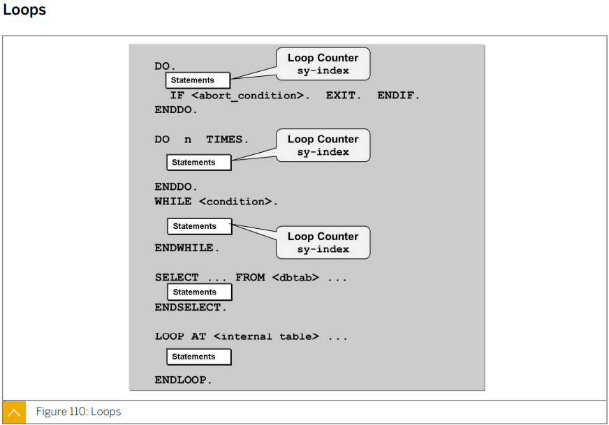

  * ### DO문

    **EXIT. 으로 빠져나오지 않으면  무한 반복**

    ```ABAP
    *&---------------------------------------------------------------------*
    *& Report ZABAP_LOOP_B23
    *&---------------------------------------------------------------------*
    *&
    *&---------------------------------------------------------------------*
    REPORT zabap_loop_b23.
    
    DATA: gv_rslt TYPE i.
    
    PARAMETERS: pa_num TYPE i.
    
    DO.
      gv_rslt = gv_rslt + sy-index.
      IF pa_num = sy-index.
        WRITE:/ 'result : ', gv_rslt.
        EXIT.
      ENDIF.
    ENDDO.
    
    *Program ZABAP_LOOP_B23
    *input  :          10
    *result :          55
    ```

    

  * ### DO n TIMES 문

    ```ABAP
    *&---------------------------------------------------------------------*
    *& Report ZABAP_LOOP_B23
    *&---------------------------------------------------------------------*
    *&
    *&---------------------------------------------------------------------*
    REPORT zabap_loop_b23.
    
    DATA: gv_rslt TYPE i.
    
    PARAMETERS: pa_num TYPE i.
    
    DO pa_num TIMES.
      gv_rslt = gv_rslt + sy-index.
    ENDDO.
    
    WRITE:/ 'result : ', gv_rslt.
    
    *Program ZABAP_LOOP_B23
    *input  :          10
    *result :          55
    ```

    

    n번 반복

    

  * ### WHILE 문

    ```ABAP
    *&---------------------------------------------------------------------*
    *& Report ZABAP_LOOP_B23
    *&---------------------------------------------------------------------*
    *&
    *&---------------------------------------------------------------------*
    REPORT zabap_loop_b23.
    
    DATA: gv_rslt TYPE i.
    
    PARAMETERS: pa_num TYPE i.
    
    WHILE sy-index <= pa_num.
      gv_rslt = gv_rslt + sy-index.
    ENDWHILE.
    WRITE:/ 'result : ', gv_rslt.
    
    *Program ZABAP_LOOP_B23
    *input  :          10
    *result :          55
    ```

    조건문이 사실인 동안 반복

  * ### SELECT ... FROM ... . --- ENDSELECT.

    

  * ### LOOP AT <internal table> --- ENDLOOP

  

  * ### 실습 - 구구단

    ```ABAP
    *&---------------------------------------------------------------------*
    *& Report ZABAP_GUGU_B23
    *&---------------------------------------------------------------------*
    *&
    *&---------------------------------------------------------------------*
    REPORT zabap_gugu_b23.
    
    DATA: gv_rslt TYPE i.
    
    PARAMETERS: pa_dan TYPE i.
    
    
    IF pa_dan > 1 AND pa_dan < 10.
    
      WHILE sy-index <= 9.
        gv_rslt = pa_dan * sy-index.
        WRITE:/ pa_dan, ' * ', sy-index, ' = ', gv_rslt.
      ENDWHILE.
    
    
      DO 9 TIMES.
        gv_rslt = pa_dan * sy-index.
        WRITE:/ pa_dan, ' * ', sy-index, ' = ', gv_rslt.
      ENDDO.
    
    ELSEIF pa_dan < 2.
      WRITE:/ '2 이상을 입력하시오.'.
    ELSE.
      WRITE:/ '9 이하를 입력하시오.'.
    ENDIF.
    
    * Program ZABAP_GUGU_B23
    * input : 3 
    *          3   *           1   =           3
    *          3   *           2   =           6
    *          3   *           3   =           9
    *          3   *           4   =          12
    *          3   *           5   =          15
    *          3   *           6   =          18
    *          3   *           7   =          21
    *          3   *           8   =          24
    *          3   *           9   =          27
    *          3   *           1   =           3
    *          3   *           2   =           6
    *          3   *           3   =           9
    *          3   *           4   =          12
    *          3   *           5   =          15
    *          3   *           6   =          18
    *          3   *           7   =          21
    *          3   *           8   =          24
    *          3   *           9   =          27
    ```

  * ### 실습 - 구구단 업그레이드

    ##### ZABAP_GUGU_B23

    ```ABAP
    *&---------------------------------------------------------------------*
    *& Report ZABAP_GUGU_B23
    *&---------------------------------------------------------------------*
    *&
    *&---------------------------------------------------------------------*
    REPORT zabap_gugu_b23.
    
    DATA: gv_rslt TYPE i.
    
    PARAMETERS: pa_dan TYPE i.
    
    DATA: gv_dan TYPE i.
    gv_dan = 2.
    
    IF pa_dan > 1 AND pa_dan < 10.
      WHILE gv_dan <= pa_dan.
        WRITE:/ gv_dan, '단'.
        DO 9 TIMES.
          gv_rslt = gv_dan * sy-index.
          WRITE:/ gv_dan, ' * ', sy-index, ' = ', gv_rslt.
        ENDDO.
        ULINE.
        gv_dan = gv_dan + 1.
      ENDWHILE.
    
    ELSEIF pa_dan < 2.
      WRITE:/ '2 이상을 입력하시오.'.
    ELSE.
      WRITE:/ '9 이하를 입력하시오.'.
    ENDIF.
    
    *Program ZABAP_GUGU_B23
    *input : 9
    * 2  단
    * 2   *           1   =           2
    * 2   *           2   =           4
    * 2   *           3   =           6
    * 2   *           4   =           8
    * 2   *           5   =          10
    * 2   *           6   =          12
    * 2   *           7   =          14
    * 2   *           8   =          16
    * 2   *           9   =          18
    *
    * 3  단
    * 3   *           1   =           3
    * 3   *           2   =           6
    * 3   *           3   =           9
    * 3   *           4   =          12
    * 3   *           5   =          15
    * 3   *           6   =          18
    * 3   *           7   =          21
    * 3   *           8   =          24
    * 3   *           9   =          27
    *
    * 4  단
    * 4   *           1   =           4
    * 4   *           2   =           8
    * 4   *           3   =          12
    * 4   *           4   =          16
    * 4   *           5   =          20
    * 4   *           6   =          24
    * 4   *           7   =          28
    * 4   *           8   =          32
    * 4   *           9   =          36
    *
    * 5  단
    * 5   *           1   =           5
    * 5   *           2   =          10
    * 5   *           3   =          15
    * 5   *           4   =          20
    * 5   *           5   =          25
    * 5   *           6   =          30
    * 5   *           7   =          35
    * 5   *           8   =          40
    * 5   *           9   =          45
    *
    * 6  단
    * 6   *           1   =           6
    * 6   *           2   =          12
    * 6   *           3   =          18
    * 6   *           4   =          24
    * 6   *           5   =          30
    * 6   *           6   =          36
    *6   *           7   =          42
    *6   *           8   =          48
    *6   *           9   =          54
    *
    *7  단
    *7   *           1   =           7
    *7   *           2   =          14
    *7   *           3   =          21
    *7   *           4   =          28
    *7   *           5   =          35
    *7   *           6   =          42
    *7   *           7   =          49
    *7   *           8   =          56
    *7   *           9   =          63
    *
    *8  단
    *8   *           1   =           8
    *8   *           2   =          16
    *8   *           3   =          24
    *8   *           4   =          32
    *8   *           5   =          40
    *8   *           6   =          48
    *8   *           7   =          56
    *8   *           8   =          64
    *8   *           9   =          72
    *
    *9  단
    *9   *           1   =           9
    *9   *           2   =          18
    *9   *           3   =          27
    *9   *           4   =          36
    *9   *           5   =          45
    *9   *           6   =          54
    *9   *           7   =          63
    *9   *           8   =          72
    *9   *           9   =          81
    ```

    ```ABAP
    DO pa_dan TIMES.
      gv_index = sy-index.
      IF sy-index = 1.
        CONTINUE.
      ENDIF.
      DO 9 TIMES.
        gv_rslt = gv_index * sy-index.
        WRITE:/ gv_index, '*', sy-index, '=', gv_rslt.
      ENDDO.
    ENDDO.
    ```

    

* ## System Fields (Excerpt)

  ### sy-mandt

  * 로그온 클라이언트

  ### sy-uname

  * 사용자 로그온 이름

  ### sy-langu
  
  * 사용자 로그온 언어
  
  ### sy-datum
  
  * ABAP 시스템 현지 일자
  
  ### sy-uzeit
  
  * ABAP 시스템 현지 시간
  
  ### sy-tcode
  
  * 현재 트랜잭션 코드
  
  ### sy-repid
  
  * 현재 ABAP 프로그램 이름
  
  ### sy-index
  
  * DO / WHILE 문의 루프 횟수
  
  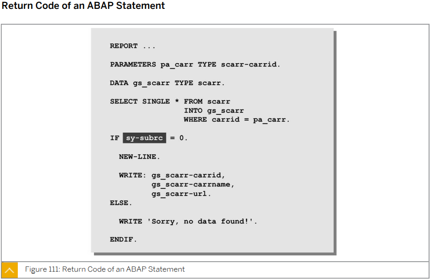
  
  ### sy-tabix
  
  * Loop 문의 루프 횟수
  
  ### sy-dbcnt
  
  * select loop문에서 반복 횟수
  
  ### sy-subrc
  
  * 정상적으로 실행 됐는지 않됐는지 확인 
    * 해당 테이블에 데이터가 존재할 경우
      * return 0
    * 그 이외는 
      * 일반적으로 return 4 


##### ZABAP_RETURN_B23

```ABAP
*&---------------------------------------------------------------------*
*& Report ZABAP_RETURN_B23
*&---------------------------------------------------------------------*
*&
*&---------------------------------------------------------------------*
REPORT zabap_return_b23.

* structurevariable
DATA: gs_spfli TYPE spfli.

* structure type 의 필드 이름
* data element를 참조
PARAMETERS: pa_car TYPE spfli-carrid,
            pa_con TYPE spfli-connid.


* SINGLE : 한건의 데이터를 불러올때 사용
SELECT SINGLE *
  INTO gs_spfli         " 불러온 데이터를 gs_spfli 에 할당하겠다.
  FROM spfli
  WHERE carrid = pa_car
    AND connid = pa_con.

IF sy-subrc = 0.
  WRITE: gs_spfli-carrid,
         gs_spfli-connid,
         gs_spfli-cityfrom,
         gs_spfli-cityto.
ELSE.
  WRITE 'Sorry, no data found!'.
ENDIF.

*Report ZABAP_RETURN_B23
*INPUT
*PA_CAR:	AA
*PA_CON:	0017
*RESULT
*AA  0017 NEW YORK             SAN FRANCISCO
```


* ## Exercise 14

  ```ABAP
  *&---------------------------------------------------------------------*
  *& Report ZBC400_B23_COMPUTE
  *&---------------------------------------------------------------------*
  *&
  *&---------------------------------------------------------------------*
  REPORT zbc400_b23_compute.
  
  PARAMETERS: pa_int1 TYPE i,
              pa_int2 TYPE i,
              pa_op   TYPE c LENGTH 1.
  
  DATA gv_rslt TYPE p LENGTH 16 DECIMALS 2.
  
  
  CASE pa_op.
    WHEN '+'.
      gv_rslt = pa_int1 + pa_int2.
      WRITE: / pa_int1, '+', pa_int2, '=', gv_rslt.
    WHEN '-'.
      gv_rslt = pa_int1 - pa_int2.
      WRITE: / pa_int1, '-', pa_int2, '=', gv_rslt.
    WHEN '*'.
      gv_rslt = pa_int1 * pa_int2.
      WRITE: / pa_int1, '*', pa_int2, '=', gv_rslt.
    WHEN '/'.
      IF pa_int2 = 0.
        WRITE / 'PA_INT2 Error'.
      ELSE.
        gv_rslt = pa_int1 / pa_int2.
        WRITE: / pa_int1, '/', pa_int2, '=', gv_rslt.
      ENDIF.
    WHEN OTHERS.
      WRITE 'PA_OP Error'.
  ENDCASE.
  ```

  ```abap
  IF ( pa_op = '+' OR
       pa_op = '-' OR
       pa_op = '*' OR
       pa_op = '/' AND pa_int2 <> 0 ).
    CASE pa_op.
      WHEN '+'.
        gv_rslt = pa_int1 + pa_int2.
      WHEN '-'.
        gv_rslt = pa_int1 - pa_int2.
      WHEN '*'.
        gv_rslt = pa_int1 * pa_int2.
      WHEN '/'.
        gv_rslt = pa_int1 / pa_int2.
    ENDCASE.
    WRITE: gv_rslt.
  
  ELSE.
    WRITE 'error'.
  ENDIF.
  ```


* ## Dialog Messages

  

  **MESSAGE** **t**nnn(message_class )

  | MESSAGE     | **t** | nnn              | (message_class )                                             | WITH v1 v2 v3 v4                                             |
  | ----------- | ----- | ---------------- | ------------------------------------------------------------ | ------------------------------------------------------------ |
  | ABAP 명령어 |       | 번호 000~999까지 | REPORT 부분 뒤에 MESSAGE-ID message_class로 지정해 준경우 쓸필요 없다. | optional 하게 추가  with 뒤는 플레이스 홀더 variable 값들을 4개까지 |

   ```abap
   REPORT zbc400_b23_compute MESSAGE-ID ZMESSAGE_B23.
   
   
     WHEN OTHERS.
       WRITE 'PA_OP Error'(paop).
       MESSAGE i000(zmessage_b23) WITH pa_op.
       MESSAGE i000 WITH pa_op.					"REPORT뒤에서 지정해 준경우
       MESSAGE w000 WITH pa_op DISPLAY LIKE 'S'.
       MESSAGE s005 WITH sy-uname sy-datum
                         sy-uzeit sy-repid.
                         
   * 하드코딩에 사용
       MESSAGE 'Invalid Operator!' TYPE 'I'. 		"타입 대문자로!!!!
   ```

  

  i : 팝업으로 디스플레이된다.

  s: success 메세지라고도 한다. 에러 없이 처리 됐을때 스테이터스바에 디스플레이 된다.

  w:

  e: 

  a: 모델 다이얼로그 박스에서 팝업으로

  x: short dump 화면 잘 쓰지 않는다. 

  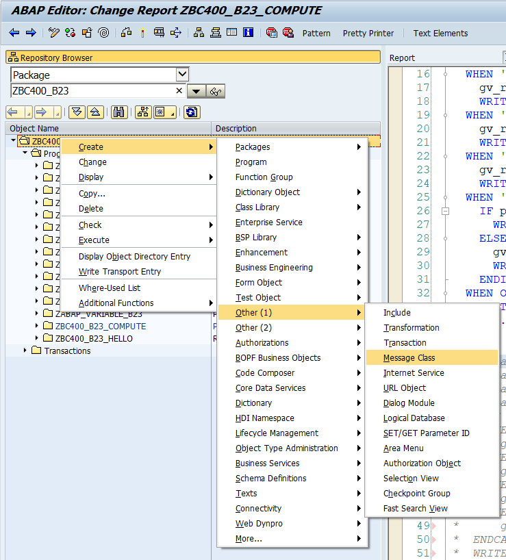

  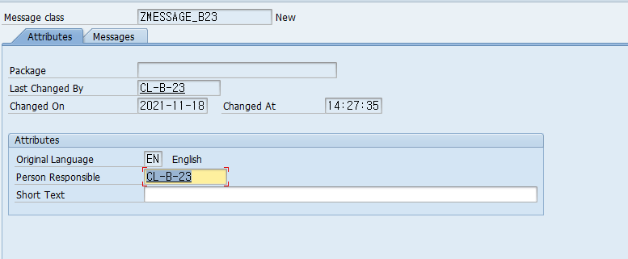

  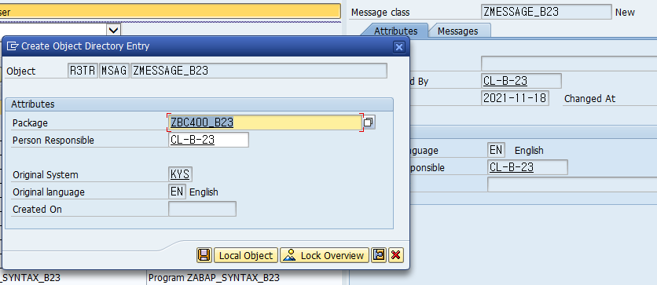

  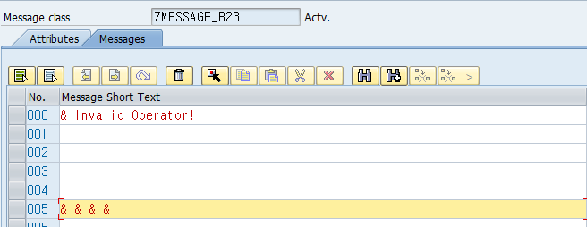

  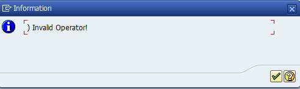

  

  

  


****


# Lesson3. Analyzing Programs with the ABAP Debugger

* ## Debugging 접근방법

  * ### ABAP Editor 에서 접근

    

    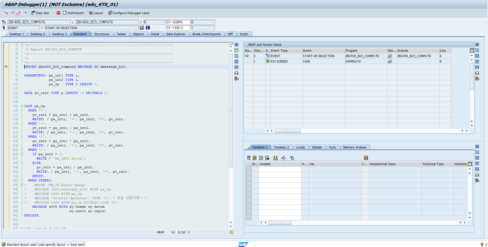

    프로그램을 우클릭해 디버깅 메뉴로 접근해 프로그램을 실행시킨다.

    

    

    

    또는 break point 버튼을 클릭후 원하는 지점에 break point를 설정해 프로그램을 실행한다.

    

  * ### /h 를 통해 접근

    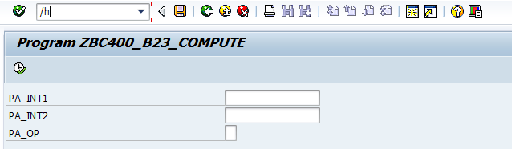

    프로그램을 실행한후 t_code /h를 입력한다.

    

    상태창에 Debugging switched on 이 뜬 것을 확인한후 실행하면 debugging 창으로 접근 할 수 있다.

  * ### System 메뉴를 통한 접근

    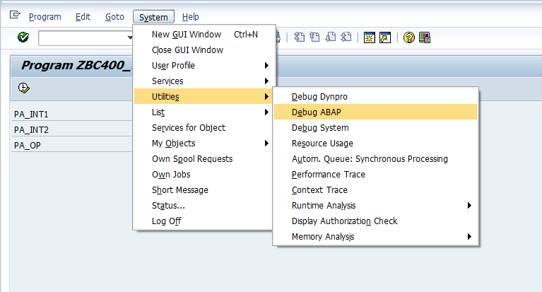

    프로그램을 실행한 후 system => utilities => debug ABAP 를 클릭한다.

    

    상태창에 Debugging switched on 이 뜬 것을 확인한후 실행하면 debugging 창으로 접근 할 수 있다.


* ## Single Step

  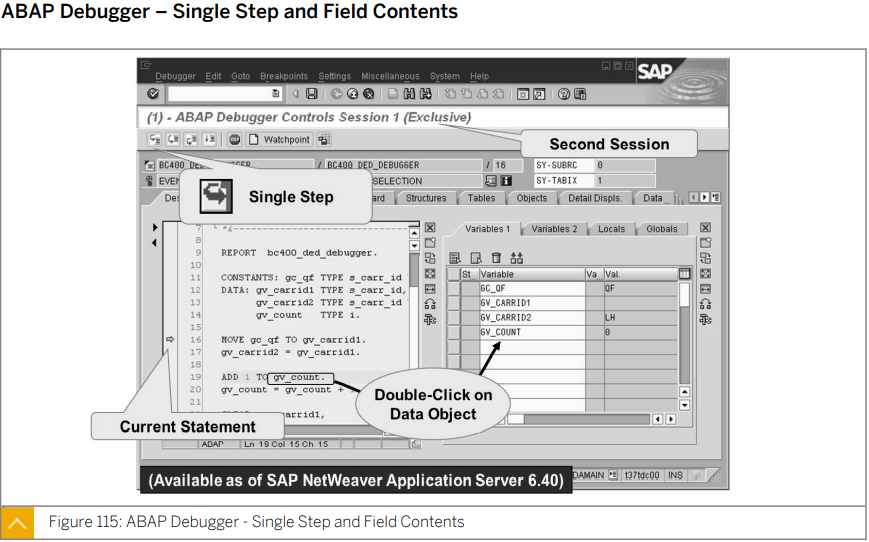

  

  

  

* ## Breakpoints

  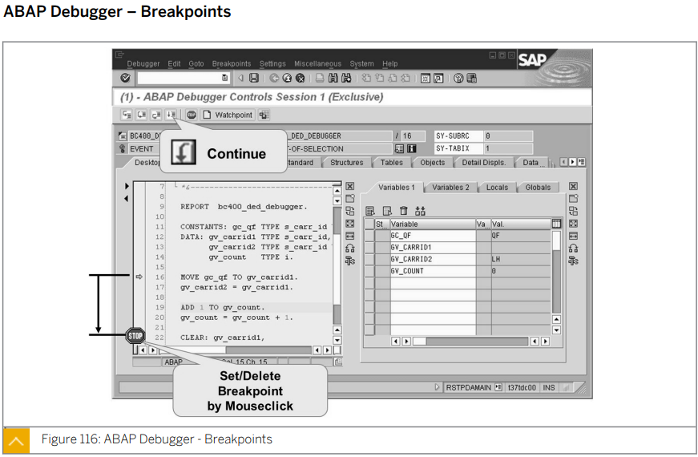


* ## Change of Field Contents

  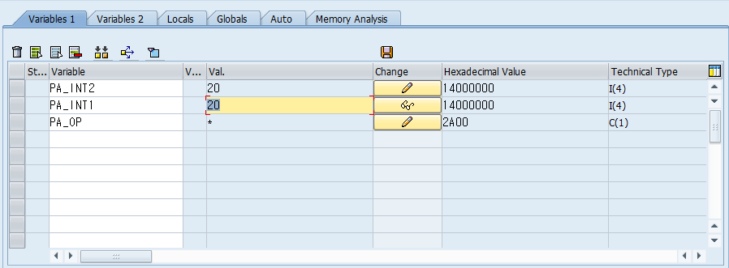

  변수들을 더블 클릭하면 변수 창에 해당 변수들이 등록 된다.

  Change 를 통해 입력한 변수들을 바꿀 수 있다.

  상수는 변경이 불가능하다. 


* ## 부록

  strlen() - string 형의 길이를 반환한다.

  charlen() - character 형의 길이를 반환한다.

  

  #### ipow ( base = i exp = j ) : i**j

  

  문자열 결합

  * 문자열 && 문자열


  * CONCATENATE 'AAA' pa_name INTO gv_str

  논리 연산자

  * = EQ

  * <> NQ


* * *


## 학습평가

* ### 다음중 컴플리트 ABAP STD TYPE은 무엇인가?

  * #### <u>T (시간)</u>

  * **C (문자)**

  * **N (숫자)**

  * #### <u>INT8 (8 바이트 길이의 정수)</u>

  * #### <u>D (일자)</u>


* ### 다음중 IF 문에서 논리식 앞에 사용하여 부정을 공식화하는 연산자는 무엇인가?

  * **AND**

  * **OR**

  * **END** 

  * #### <u>NOT</u>


* ### 다음중 Message 문의 구문에 필요한 항목은 무엇인가?

  * #### <u>메시지번호</u>

  * #### <u>메시지유형</u>

  * #### <u>메시지클래스</u>

  * **메시지역할**


* ### 중첩 루프에서 자신이 위치한 루프의 루프패스 수는 어디에 포함되어 있는가?

  * #### <u>sy-index</u>

  * **sy-repid**

  * **sy-uname**

  * **sy-mandt**


* ### 다음중 디버거를 시작하기 위해 화면의 명령어 필드에 입력하는 시스템 명령어는 무엇인가?

  * **/d**

  * #### <u>/h</u>

  * **/i**

  * **/a**뇨