# UNIT3. SAP Gateway Service Implementation


# Lesson 1: Implementing a Gateway Service


* ## 실습

  **SEGW** T-code 를 이용해 SAP GATEWAY SERVICE BUILDER 로 간다.

  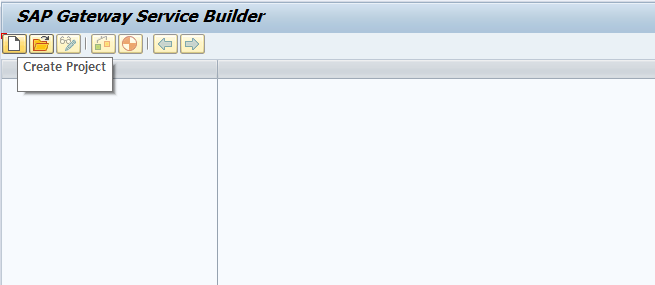
  
  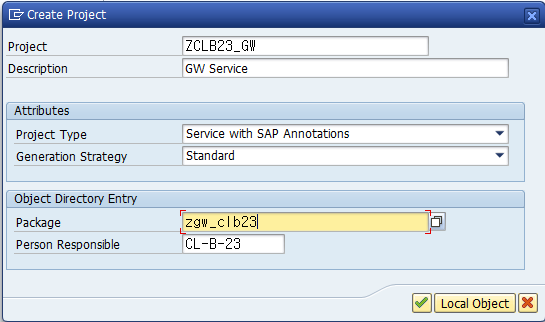
  
  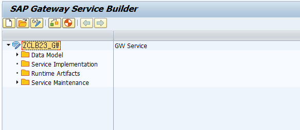
  
  Data Model은 
  
  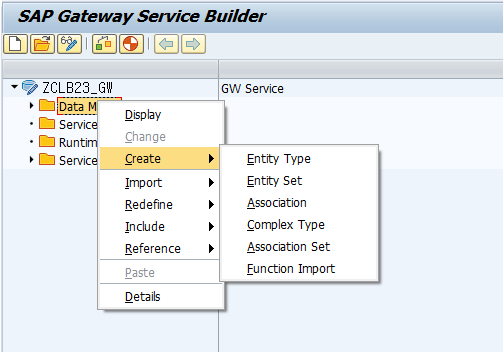
  
  직접 생성할 수도 있으며
  
  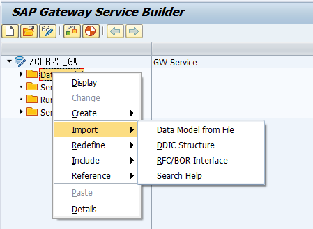
  
  import 해올 수도 있다.
  
  
  
  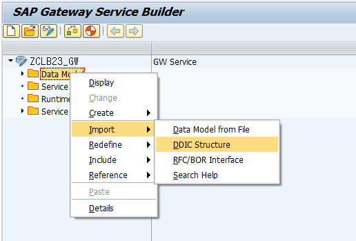
  
  우리는 그중 ***Import => <u>D</u>DIC Structure*** 을 통해 ABAP Dictionary에서 import 하여 실습한다.
  
  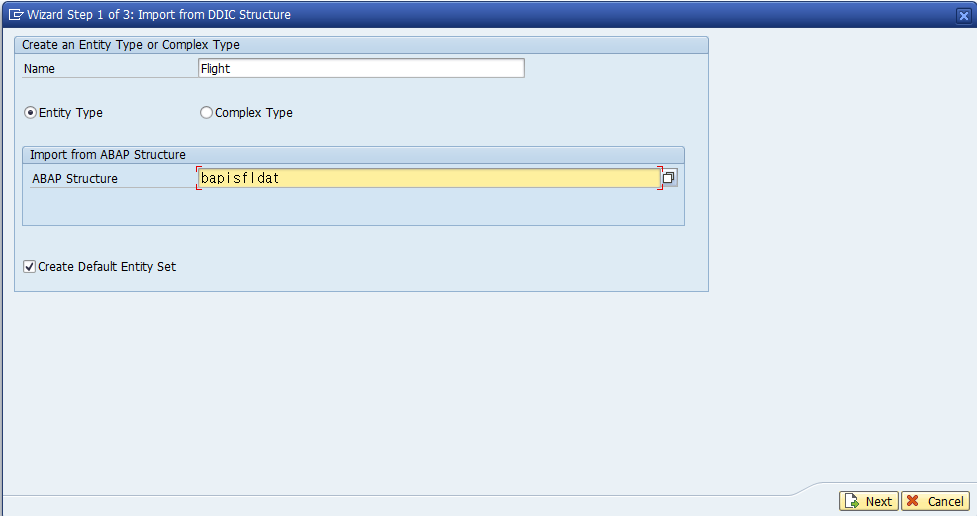
  
  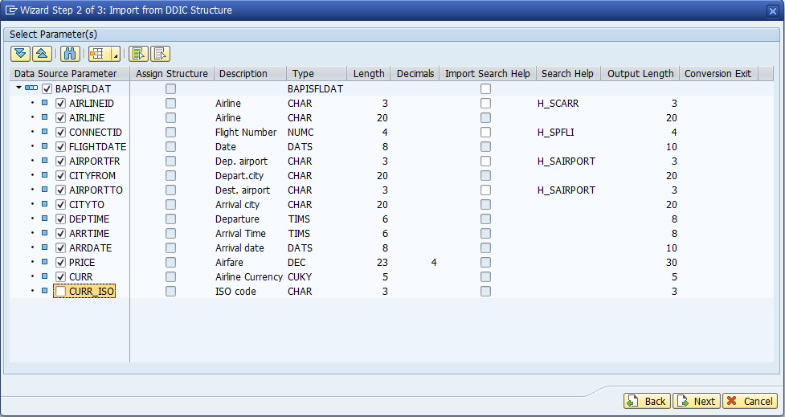
  
  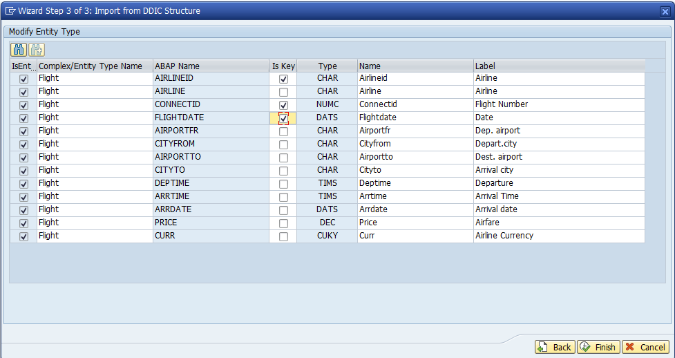
  
  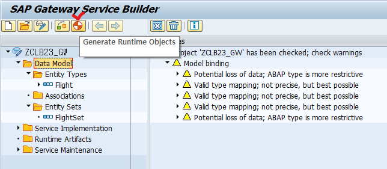
  
  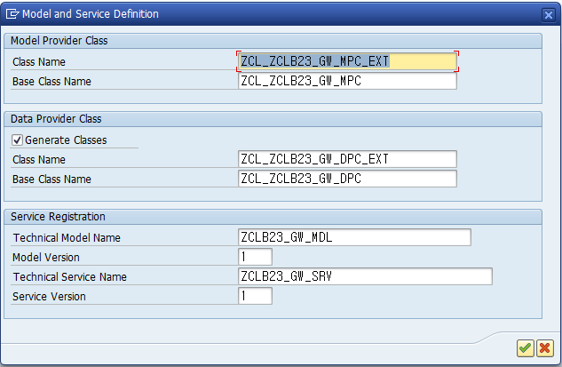
  
  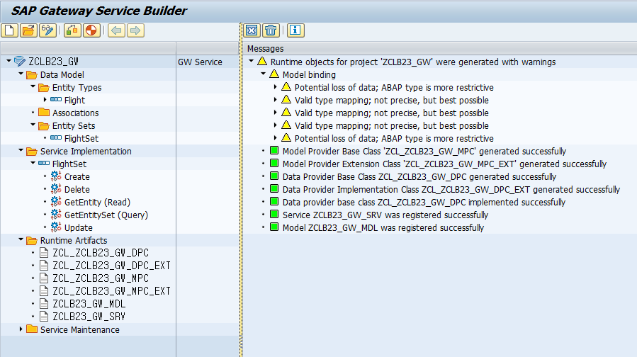
  
  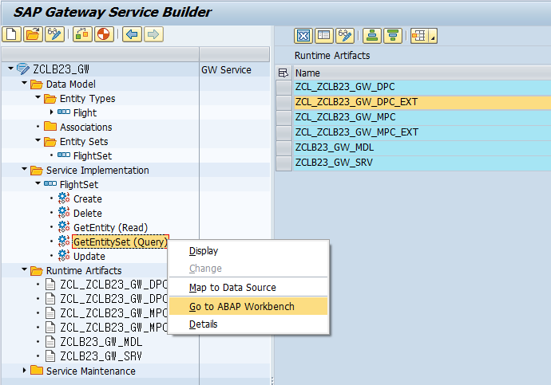
  
  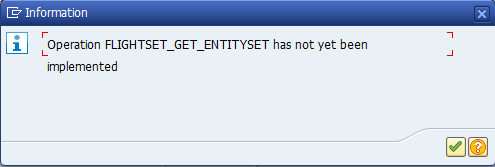
  
  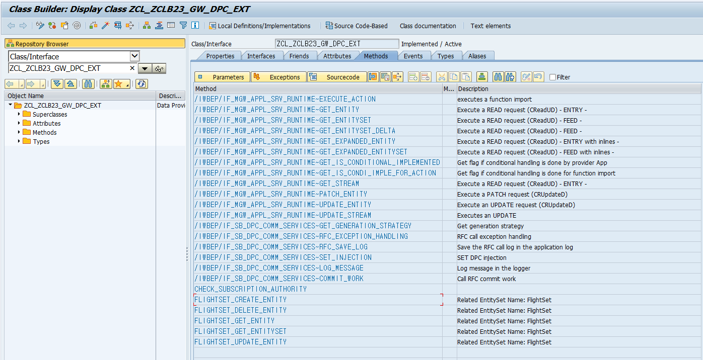
  
  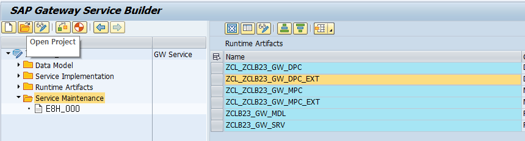
  
  
  
  
  
  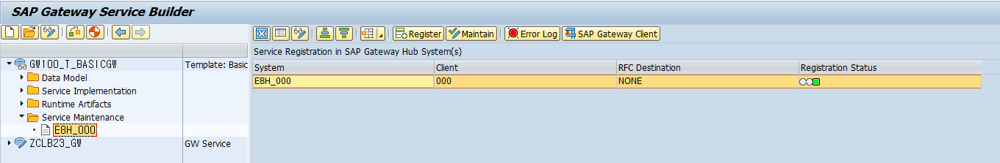
  
  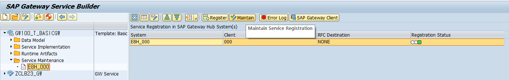
  
  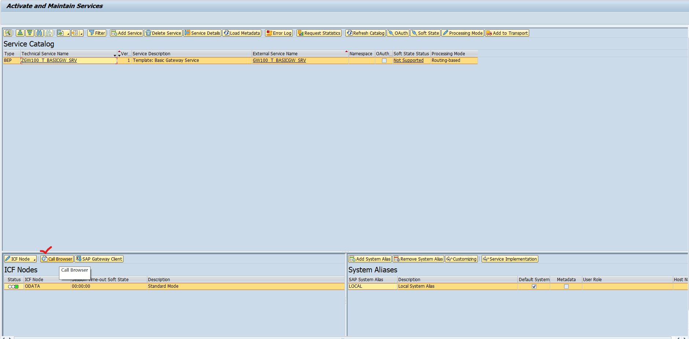
  
  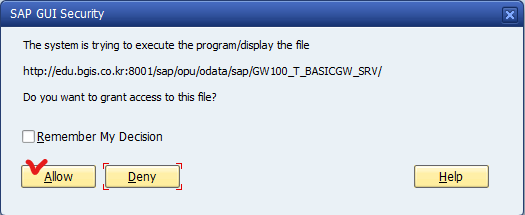
  
  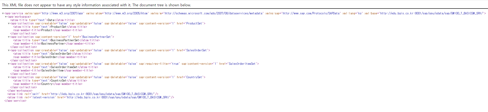
  
  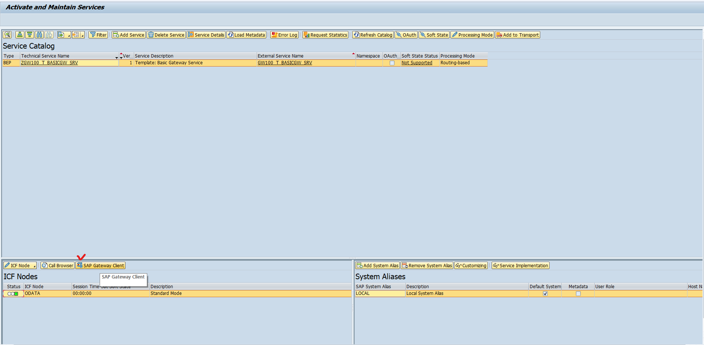
  
  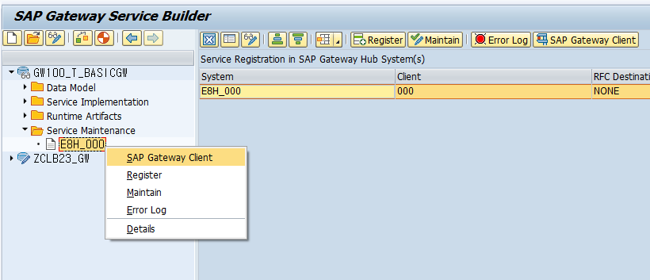
  
  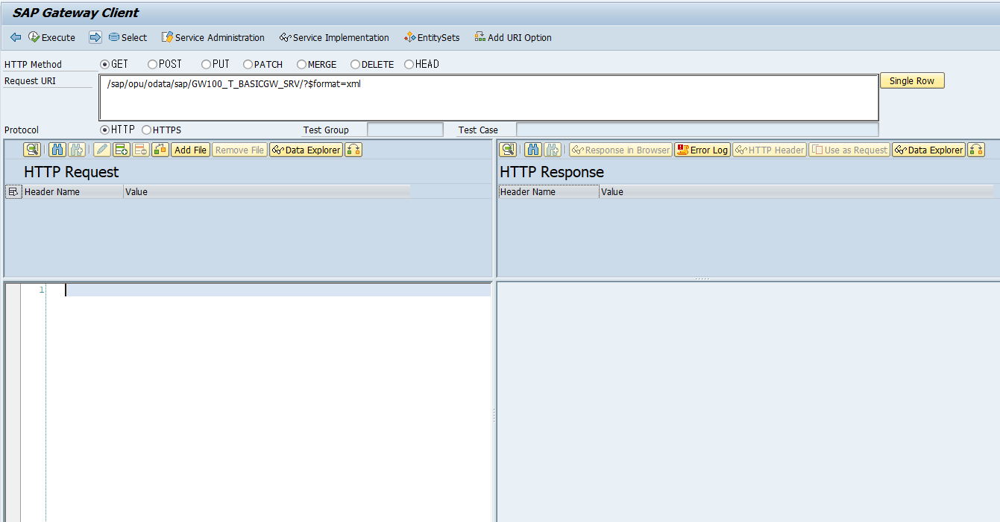
  
  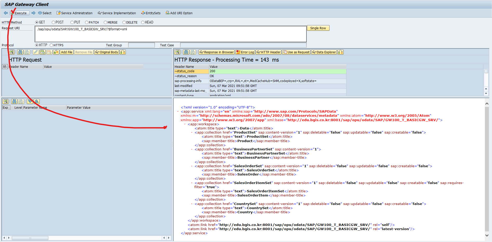
  
  
  
  Direct navigation to the CRUD methods of DPC EXT class:
  
  * CREATE => <Entity_Set>\_GREATE_ENTITY
  * READ     => <Entity_Set>\_GET_ENTITY
  * QUERY  => <Entity_Set>\_GET_ENTITYSET
  
  
  
  
  
  
  
  
  
  
  
  IWFND/MAINT_SERVICE T_CODE
  
  


* ## Exercise 5

  위에서 한거 반복


# Lesson 2: Defining a Data Model


DATA MODEL DEFINITION (MPC) 세가지 방법

SERVICE IMPLEMENTATION (DPC) 두가지 방법


# Lesson 3: Implementing Read Operations


* ## QUERY OPERATION

  <ENTITY_SET>\_GET_ENTITY

  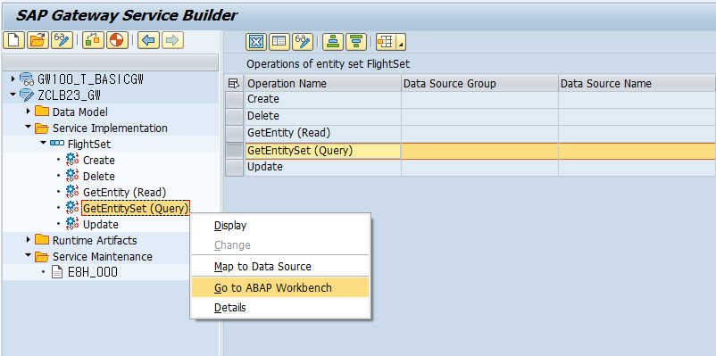

  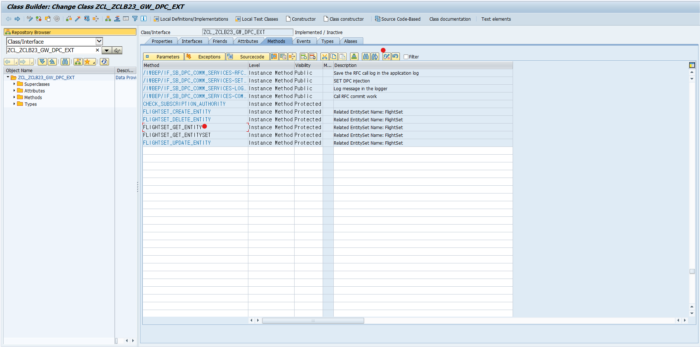

  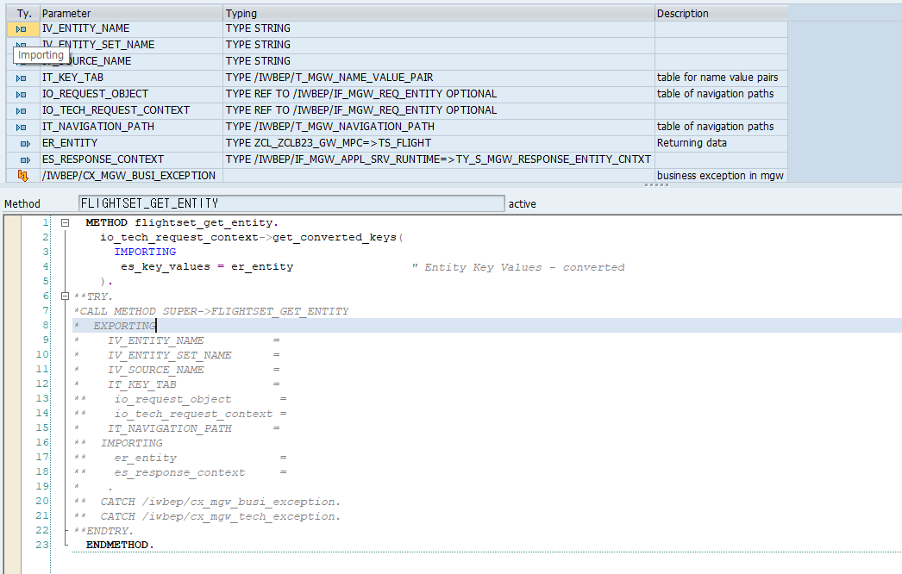

  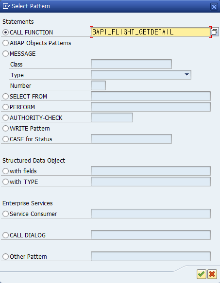

  ```ABAP
    METHOD flightset_get_entity.
  
      DATA: LS_FLIGHT TYPE BAPISFLDAT.
  
      io_tech_request_context->get_converted_keys(
        IMPORTING
         es_key_values = er_entity                 " Entity Key Values - converted
      ).
      CALL FUNCTION 'BAPI_FLIGHT_GETDETAIL'
        EXPORTING
          airlineid             = ER_ENTITY-AIRLINEID
          connectionid          = ER_ENTITY-connectid
          flightdate            = ER_ENTITY-flightdate
       IMPORTING
         FLIGHT_DATA           = LS_FLIGHT
  *       ADDITIONAL_INFO       =
  *       AVAILIBILITY          =
  *     TABLES
  *       EXTENSION_IN          =
  *       EXTENSION_OUT         =
  *       RETURN                =
                .
  
      MOVE-CORRESPONDING LS_FLIGHT TO ER_ENTITY.
  
  **TRY.
  *CALL METHOD SUPER->FLIGHTSET_GET_ENTITY
  *  EXPORTING
  *    IV_ENTITY_NAME          =
  *    IV_ENTITY_SET_NAME      =
  *    IV_SOURCE_NAME          =
  *    IT_KEY_TAB              =
  **    io_request_object       =
  **    io_tech_request_context =
  *    IT_NAVIGATION_PATH      =
  **  IMPORTING
  **    er_entity               =
  **    es_response_context     =
  *    .
  **  CATCH /iwbep/cx_mgw_busi_exception.
  **  CATCH /iwbep/cx_mgw_tech_exception.
  **ENDTRY.
    ENDMETHOD.
  ```

  

  

   

* ## READ OPERATION

  <ENTITY_SET>\_GET_ENTITYSET

  

  

  \_GET_ENTITYSET 을 선택 후 Redefine method 버튼을 클릭한다.

  

  

  ```ABAP
    METHOD flightset_get_entityset.
  
      DATA: lt_flight TYPE TABLE OF bapisfldat.
  
      CALL FUNCTION 'BAPI_FLIGHT_GETLIST'
  * EXPORTING
  *   AIRLINE                =
  *   DESTINATION_FROM       =
  *   DESTINATION_TO         =
  *   MAX_ROWS               =
        TABLES
  *       DATE_RANGE  =
  *       EXTENSION_IN           =
          flight_list = lt_flight
  *       EXTENSION_OUT          =
  *       RETURN      =
        .
      MOVE-CORRESPONDING lt_flight TO et_entityset.
  **TRY.
  *CALL METHOD SUPER->FLIGHTSET_GET_ENTITYSET
  *  EXPORTING
  *    IV_ENTITY_NAME           =
  *    IV_ENTITY_SET_NAME       =
  *    IV_SOURCE_NAME           =
  *    IT_FILTER_SELECT_OPTIONS =
  *    IS_PAGING                =
  *    IT_KEY_TAB               =
  *    IT_NAVIGATION_PATH       =
  *    IT_ORDER                 =
  *    IV_FILTER_STRING         =
  *    IV_SEARCH_STRING         =
  **    io_tech_request_context  =
  **  IMPORTING
  **    et_entityset             =
  **    es_response_context      =
  *    .
  **  CATCH /iwbep/cx_mgw_busi_exception.
  **  CATCH /iwbep/cx_mgw_tech_exception.
  **ENDTRY.
    ENDMETHOD.
  ```

  

  

  

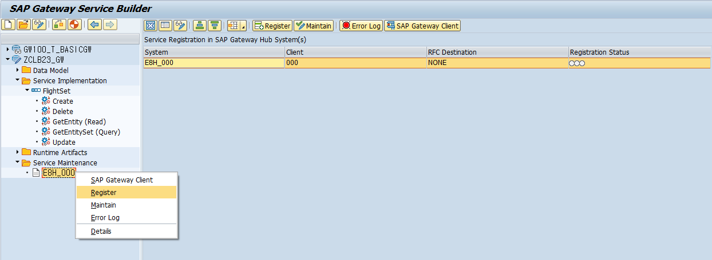

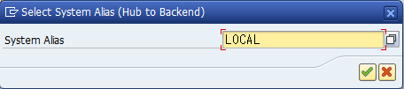

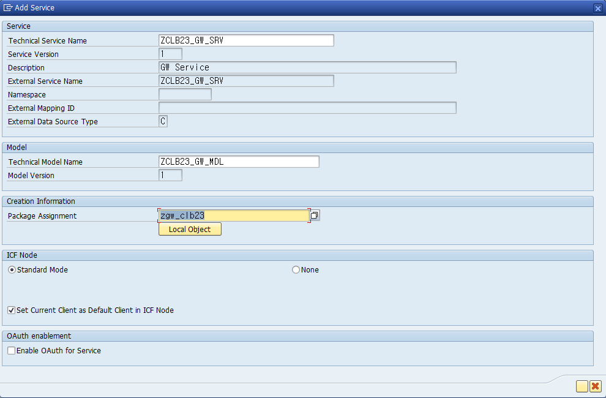

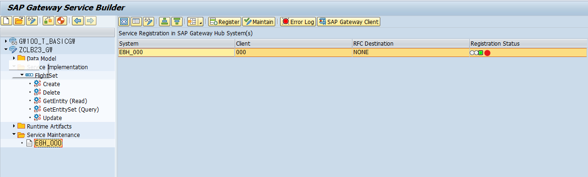

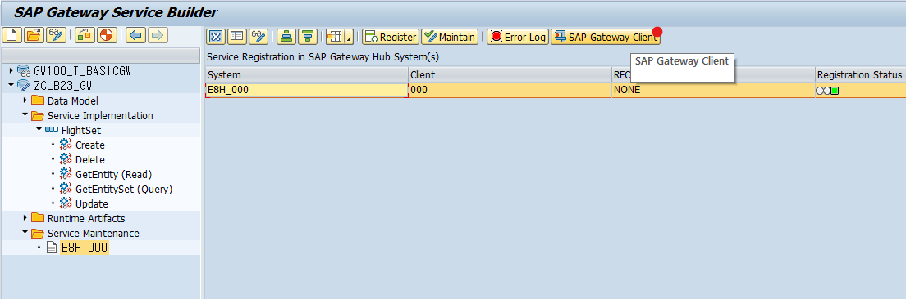

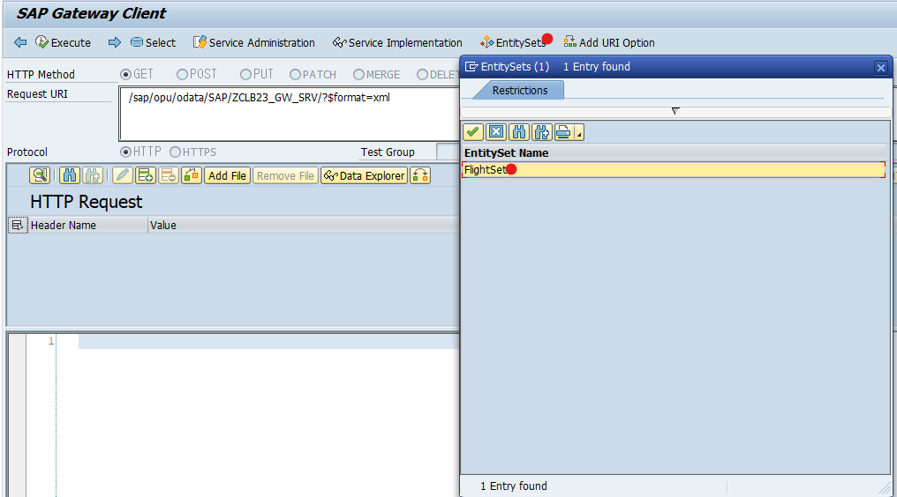

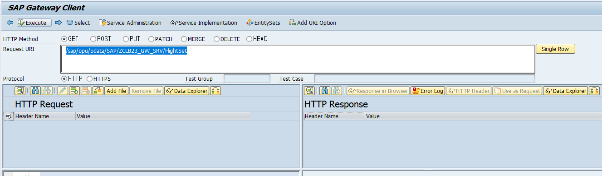

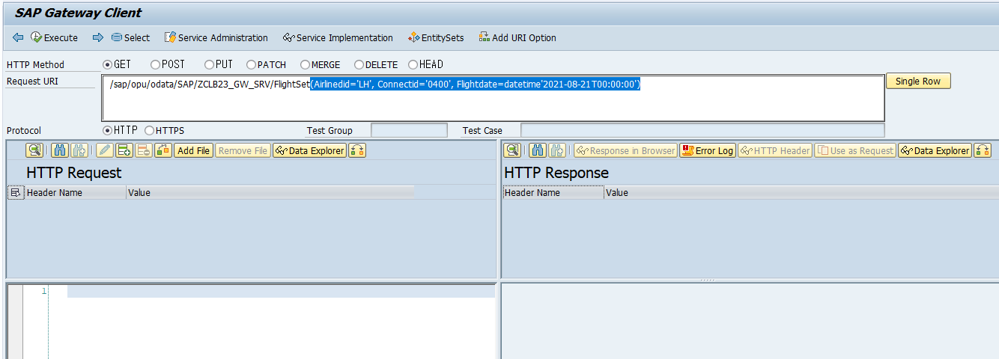

/sap/opu/odata/SAP/ZCLB23_GW_SRV/FlightSet(Airlineid='LH',Connectid='0400',Flightdate=datetime'2021-08-21T00:00:00')


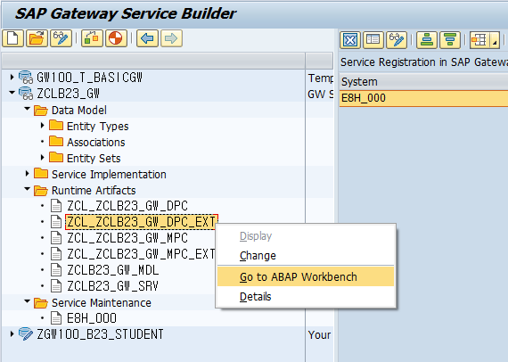


* ## Exercise 6.

  42~52

  

  

  

  

  

* ## Exercise 7.

  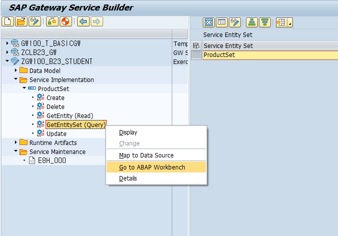

  #### PRODUCTSET_GET_ENTITYSET

  ```ABAP
    METHOD productset_get_entityset.
      DATA: ls_entity     LIKE LINE OF et_entityset,
            lt_headerdata TYPE TABLE OF bapi_epm_product_header,
            ls_headerdata TYPE bapi_epm_product_header,
            lt_return     TYPE TABLE OF bapiret2.
  
  *   GET DATA
      CALL FUNCTION 'BAPI_EPM_PRODUCT_GET_LIST'
  *     EXPORTING
  *       MAX_ROWS                    =
        TABLES
          headerdata = lt_headerdata
  *       SELPARAMPRODUCTID           =
  *       SELPARAMSUPPLIERNAMES       =
  *       SELPARAMCATEGORIES          =
          return     = lt_return.
  
  *   BAPI 는 EXCEPTION 을 가질 수 없어 RETURN PARAMETER로 예외를 처리한다.
      IF lt_return IS NOT INITIAL.
        mo_context->get_message_container( )->add_messages_from_bapi( lt_return ).
        RAISE EXCEPTION TYPE /iwbep/cx_mgw_busi_exception
          EXPORTING
            textid            = /iwbep/cx_mgw_busi_exception=>business_error
            message_container = mo_context->get_message_container( ).
      ENDIF.
  
  *   FILL RESPONSE DATA
      MOVE-CORRESPONDING lt_headerdata TO et_entityset.
    ENDMETHOD.
  ```

  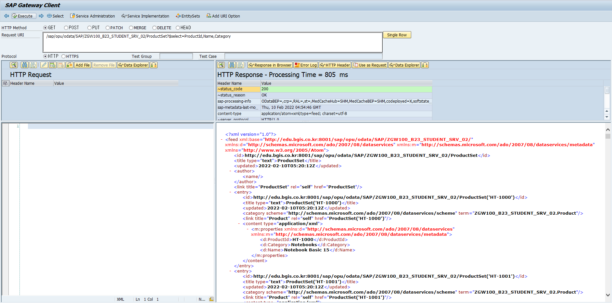

  

  #### PRODUCTSET_GET_ENTITY

  ```ABAP
    METHOD productset_get_entity.
      DATA: lt_key        TYPE /iwbep/t_mgw_tech_pairs,
            ls_key        TYPE /iwbep/s_mgw_tech_pair,
            ls_product_id TYPE bapi_epm_product_id,
            ls_headerdata TYPE bapi_epm_product_header,
            lt_return     TYPE TABLE OF bapiret2.
  *   GET KEY FIELDS FROM REQUEST
      CALL METHOD io_tech_request_context->get_converted_keys
        IMPORTING
          es_key_values = ls_headerdata.                 " Entity Key Values - converted
      ls_product_id-product_id = ls_headerdata-product_id.
  
  *   GET DATA
      CALL FUNCTION 'BAPI_EPM_PRODUCT_GET_DETAIL'
        EXPORTING
          product_id = ls_product_id
        IMPORTING
          headerdata = ls_headerdata
        TABLES
          return     = lt_return.
      IF lt_return IS NOT INITIAL.
  *   RAISE EXCEPTION
      ENDIF.
  
  *   FILL RESPONSE DATA
      MOVE-CORRESPONDING ls_headerdata TO er_entity.
  
    ENDMETHOD.
  ```

  

* ## Exercise8.

  #### PRODUCTSET_GET_ENTITY

  ```ABAP
    METHOD productset_get_entity.
      DATA: lt_key        TYPE /iwbep/t_mgw_tech_pairs,
            ls_key        TYPE /iwbep/s_mgw_tech_pair,
            ls_product_id TYPE bapi_epm_product_id,
            ls_headerdata TYPE bapi_epm_product_header,
            lt_return     TYPE TABLE OF bapiret2.
  *   GET KEY FIELDS FROM REQUEST
      CALL METHOD io_tech_request_context->get_converted_keys(
        IMPORTING
          es_key_values = er_entity
      ). " Entity Key Values - converted)
  
  *   MAP KEY FIELDS TO FUNCTION MODULE PARAMETERS
      ls_product_id-product_id = er_entity-product_id.
  
  *   GET DATA
      CALL FUNCTION 'BAPI_EPM_PRODUCT_GET_DETAIL'
        EXPORTING
          product_id = ls_product_id
        IMPORTING
          headerdata = ls_headerdata
        TABLES
          return     = lt_return.
  
  
      IF lt_return IS NOT INITIAL.
  *   RAISE EXCEPTION
  *     MESSAGE CONTAINER
        mo_context->get_message_container( )->add_messages_from_bapi( lt_return ).
        RAISE EXCEPTION TYPE /iwbep/cx_mgw_busi_exception
          EXPORTING
            textid            = /iwbep/cx_mgw_busi_exception=>business_error
            message_container = mo_context->get_message_container( ).
      ENDIF.
  
  *   FILL RESPONSE DATA
    MOVE-CORRESPONDING ls_headerdata TO er_entity.
  
  ENDMETHOD.
  ```

  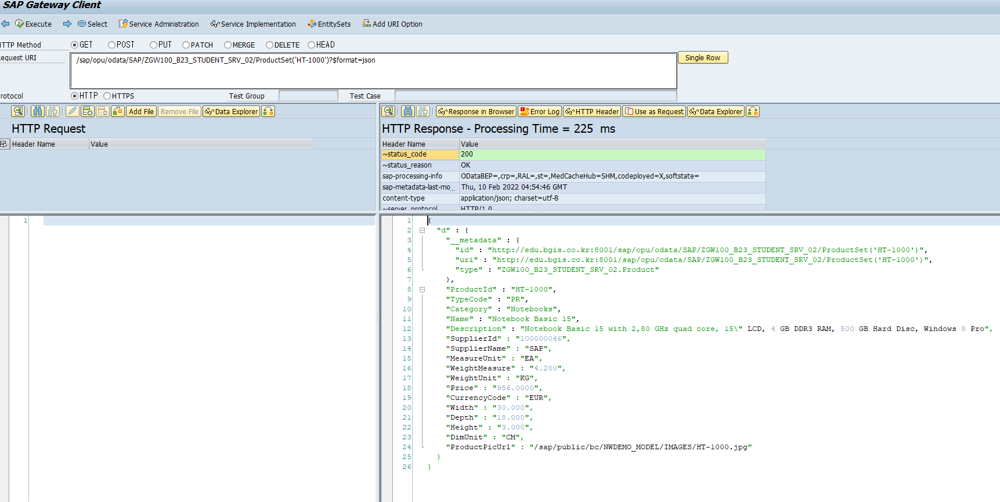

  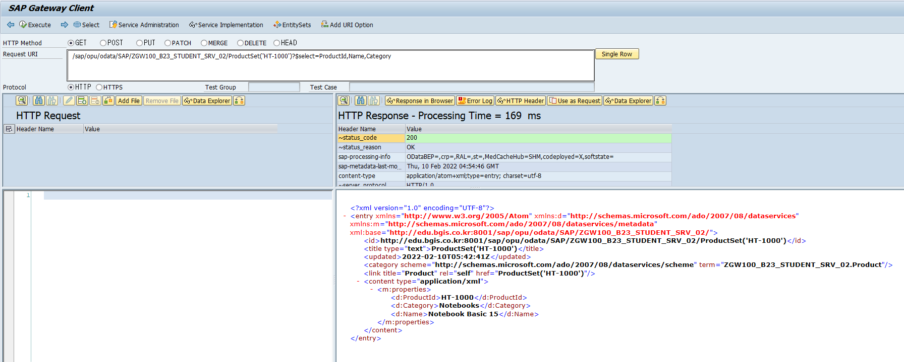

  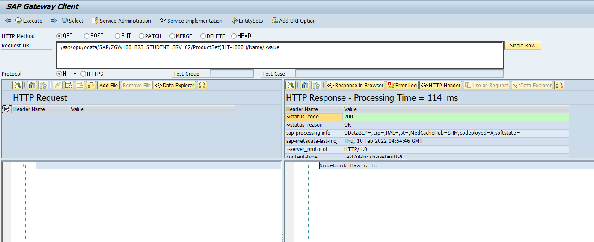

  /sap/opu/odata/SAP/ZGW100_B23_STUDENT_SRV_02/ProductSet('HT-1000')?$format=json

  


# Lesson 4: Implementing Navigation


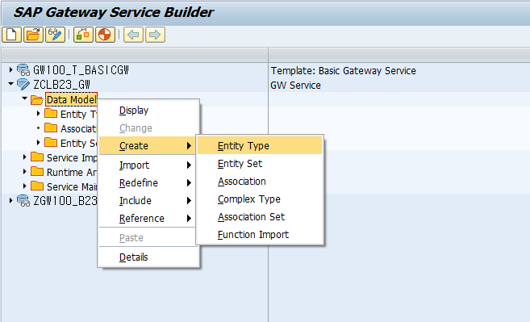

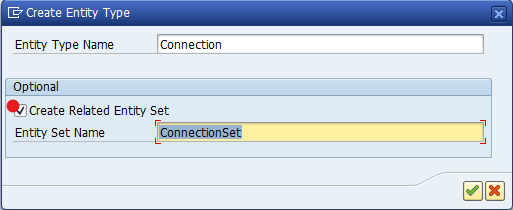

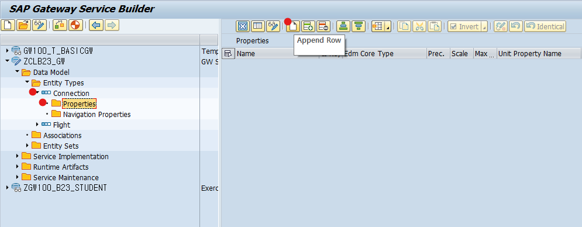

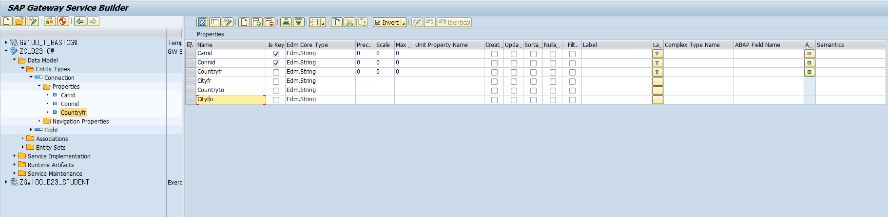

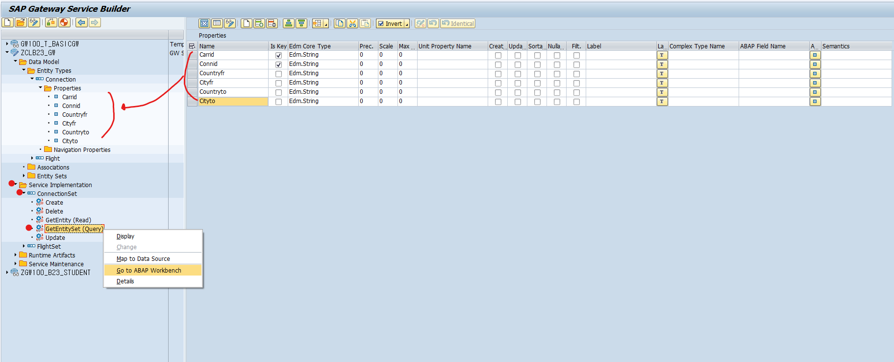

#### connectionset_get_entityset

```ABAP
  METHOD connectionset_get_entityset.

    DATA: lt_connection TYPE TABLE OF spfli.

    SELECT *
      INTO CORRESPONDING FIELDS OF TABLE lt_connection
      FROM spfli.

    MOVE-CORRESPONDING lt_connection TO et_entityset.

  ENDMETHOD.
```

```abap
  METHOD connectionset_get_entity.

    DATA: ls_key_value  TYPE zcl_zclb23_gw_mpc=>ts_connection,
*   ZCL_ZCLB23_GW_MPC 의 TS_CONNECTION에는 우리가 지정한 FIELD들을 가진 STRUCTURE TYPE 이 저장되어있다.
          ls_connection TYPE spfli.

*   GET KEY FIELDS FROM REQUEST
*   IO_TECH_REQUEST_CONTEXT 의 METHOD GET_CONVERTED_KEYS를 통해 KEY PROPERTY에 대한 VALUE 값을 받아 ER ENTITY 에 할당한다. 또는 DNLDP 지정한 LS_KEY_VALUE 에 할당한다.
    CALL METHOD io_tech_request_context->get_converted_keys(
      IMPORTING
        es_key_values = ls_key_value
    ). " Entity Key Values - converted)

*   MAP KEY FIELDS TO FUNCTION MODULE PARAMETERS
    ls_connection-carrid = er_entity-carrid.
    ls_connection-connid = er_entity-connid.
    SELECT SINGLE *
      INTO CORRESPONDING FIELDS OF ls_connection
      FROM spfli
     WHERE carrid = ls_key_value-carrid
       AND connid = ls_key_value-connid.

    MOVE-CORRESPONDING ls_connection TO er_entity.

  ENDMETHOD.
```

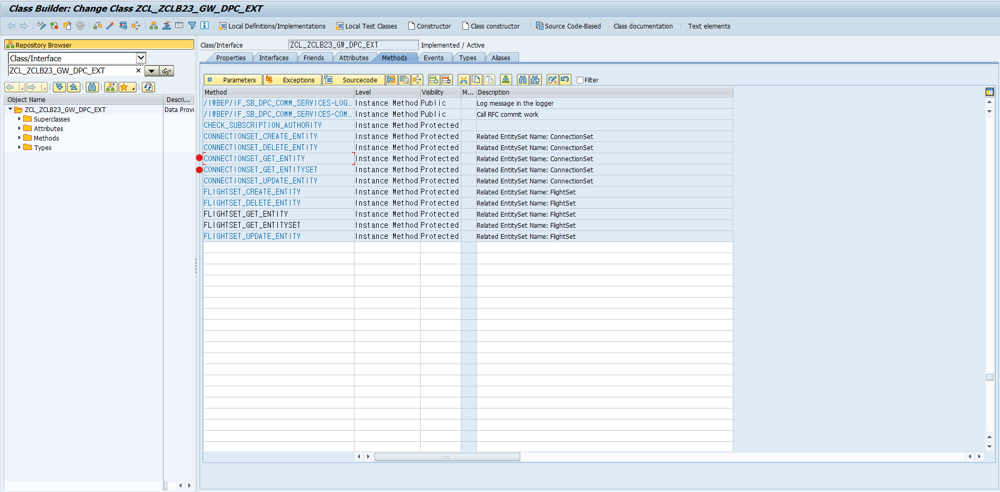

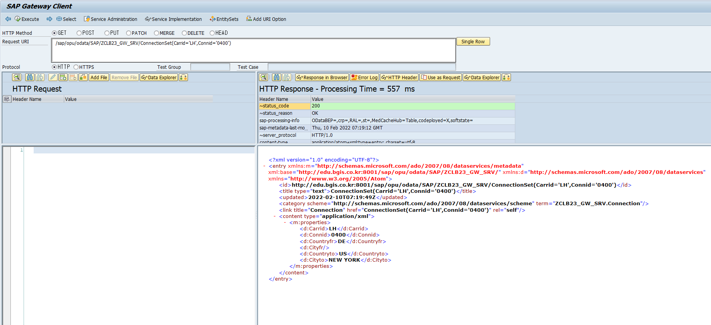


* ## Navigation Property

  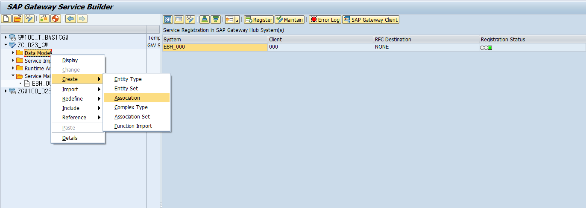

  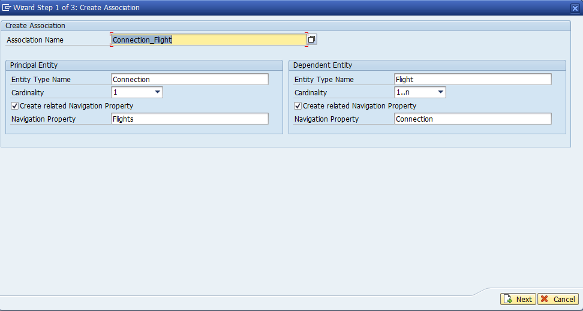

  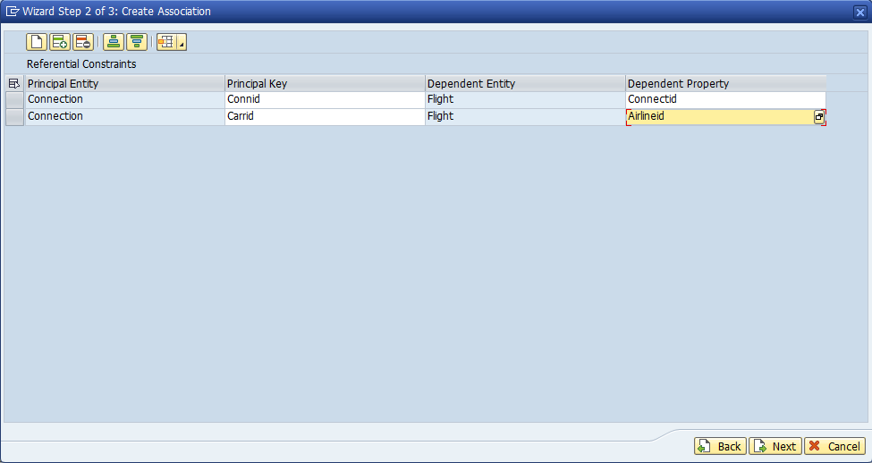

  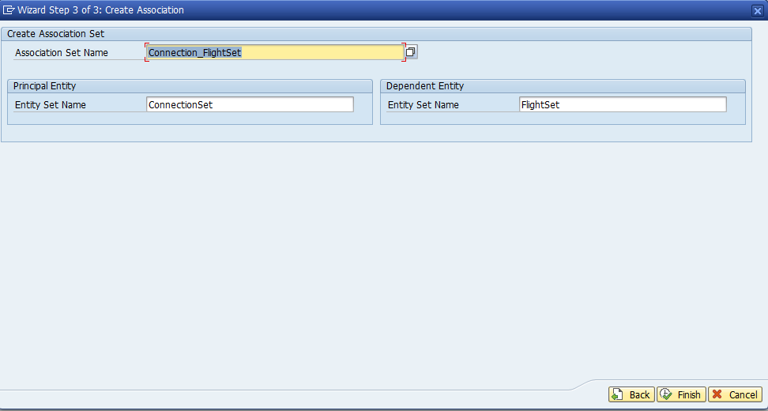

  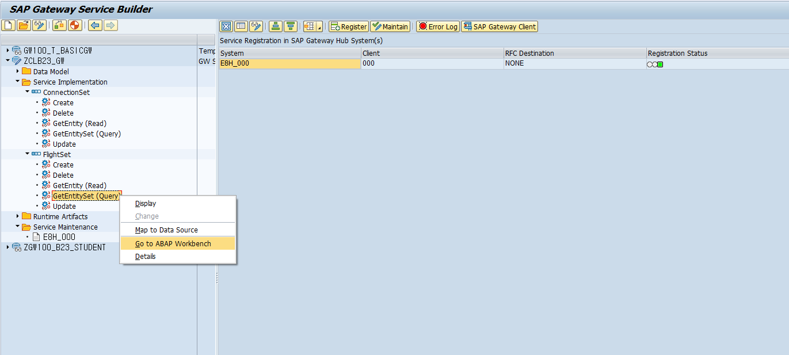

  ```ABAP
    METHOD flightset_get_entityset.
  
      DATA: lt_flight TYPE TABLE OF bapisfldat.
  
      DATA: lt_return TYPE TABLE OF bapiret2.
  
      DATA: lv_source_entity TYPE /iwbep/mgw_tech_name.
  
      DATA: ls_connection TYPE zcl_zclb23_gw_mpc=>ts_connection.
  
      DATA: lv_airline TYPE bapisflkey-airlineid.
  
      lv_source_entity = io_tech_request_context->get_source_entity_type_name( ).
  
      CASE lv_source_entity.
        WHEN zcl_zclb23_gw_mpc=>gc_connection.
  
          io_tech_request_context->get_converted_source_keys(
            IMPORTING
              es_key_values = ls_connection                 " Source Entity Key Values - converted
          ).
  *        SELECT * INTO CORRESPONDING FIELDS OF TABLE lt_flight
  *          FROM sflight
  *         WHERE carrid = ls_connection-carrid
  *           AND connid = ls_connection-connid.
          lv_airline = ls_connection-carrid.
          CALL FUNCTION 'BAPI_FLIGHT_GETlIST'
            EXPORTING
              airline     = lv_airline
            TABLES
              flight_list = lt_flight
              return      = lt_return.
        WHEN OTHERS.
          CALL FUNCTION 'BAPI_FLIGHT_GETlIST'
            TABLES
              flight_list = lt_flight
              return      = lt_return.
      ENDCASE.
      
      MOVE-CORRESPONDING lt_flight TO et_entityset.
    ENDMETHOD.
  ```

  

  

  

  /sap/opu/odata/SAP/ZCLB23_GW_SRV/ConnectionSet('Carrid='AA',Connid='0017')?$expand=Flights


* ## Create Association

  
  
  
  
  
  
  
  
  
  
  
  
  
  
  
  
  
  
  
  
* ## Exercise 9.

  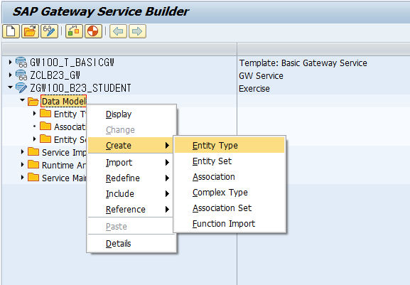

  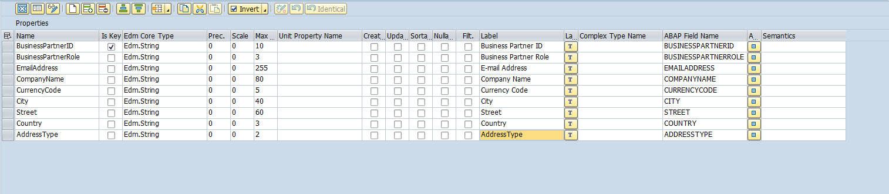

  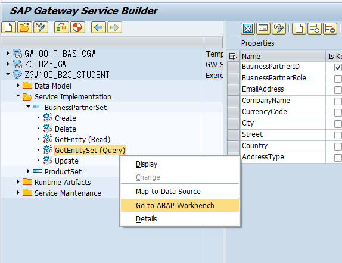

  

  ```abap
    METHOD businesspartners_get_entityset.
  
      DATA: ls_entity     LIKE LINE OF et_entityset,
            lt_headerdata TYPE TABLE OF bapi_epm_bp_header,
            ls_headerdata LIKE LINE OF lt_headerdata,
            lt_return     TYPE TABLE OF bapiret2.
  
  *   GET DATA
      CALL FUNCTION 'BAPI_EPM_BP_GET_LIST'
        TABLES
          bpheaderdata = lt_headerdata
          return       = lt_return.
      IF lt_return IS NOT INITIAL.
        "MESSAGE CONTAINER
        mo_context->get_message_container( )->add_messages_from_bapi( lt_return ).
  
        RAISE EXCEPTION TYPE /iwbep/cx_mgw_busi_exception
          EXPORTING
            textid            = /iwbep/cx_mgw_busi_exception=>business_error
            message_container = mo_context->get_message_container( ).
      ENDIF.
  
  *   MAP PROPERTIES FROM THE BACK END TO OUTPUT RESPONSE STRUCTURE
      LOOP AT lt_headerdata INTO ls_headerdata.
        ls_entity-businesspartnerid = ls_headerdata-bp_id.
        ls_entity-businesspartnerid = ls_headerdata-bp_id.
        ls_entity-businesspartnerrole = ls_headerdata-bp_role.
        ls_entity-emailaddress = ls_headerdata-email_address.
        ls_entity-companyname = ls_headerdata-company_name.
        ls_entity-currencycode = ls_headerdata-currency_code.
        ls_entity-city = ls_headerdata-city.
        ls_entity-street = ls_headerdata-street.
        ls_entity-country = ls_headerdata-country.
        ls_entity-addresstype = ls_headerdata-address_type.
        APPEND ls_entity TO et_entityset.
        CLEAR ls_entity.
      ENDLOOP.
  
    ENDMETHOD.
  ```

  

  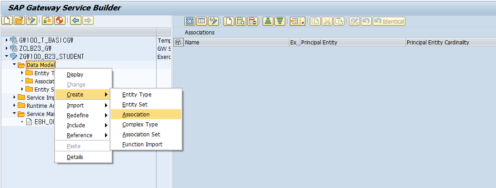

  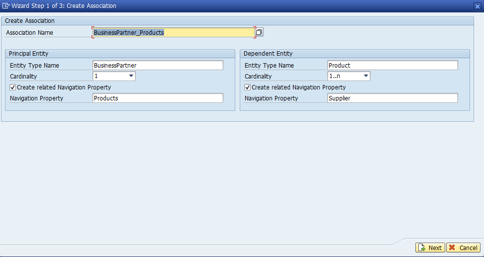

  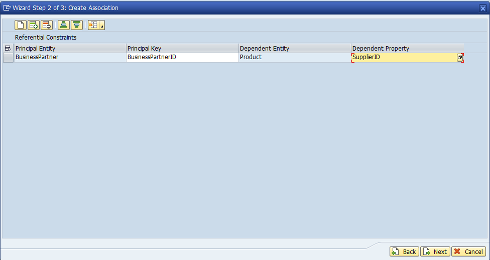

  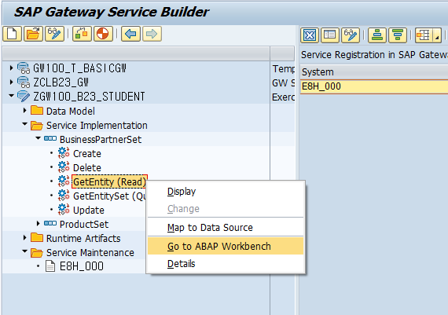

  

  ```abap
    METHOD businesspartners_get_entity.
      DATA: ls_bp_id      TYPE bapi_epm_bp_id,
            ls_headerdata TYPE bapi_epm_bp_header,
            lt_return     TYPE TABLE OF bapiret2.
  
  *   GET KEY FIELDS FROM REQUEST
      io_tech_request_context->get_converted_keys(
        IMPORTING
          es_key_values = er_entity                 " Entity Key Values - converted
      ).
      ls_bp_id-bp_id = er_entity-businesspartnerid.
  
  *   GET DATA
      CALL FUNCTION 'BAPI_EPM_BP_GET_DETAIL'
        EXPORTING
          bp_id      = ls_bp_id
        IMPORTING
          headerdata = ls_headerdata
        TABLES
  *       CONTACTDATA       =
          return     = lt_return.
  
      IF lt_return IS NOT INITIAL.
        "MESSAGE CONTAINER
        mo_context->get_message_container( )->add_messages_from_bapi( lt_return ).
        RAISE EXCEPTION TYPE /iwbep/cx_mgw_busi_exception
          EXPORTING
            textid            = /iwbep/cx_mgw_busi_exception=>business_error
            message_container = mo_context->get_message_container( ).
      ENDIF.
  
  *   MAP PROPERTIES FROM THE BACKEND TO OUTPUT RESPONSE STRUCTURE
      er_entity-businesspartnerid = ls_headerdata-bp_id.
      er_entity-businesspartnerrole = ls_headerdata-bp_role.
      er_entity-emailaddress = ls_headerdata-email_address.
      er_entity-companyname = ls_headerdata-company_name.
      er_entity-currencycode = ls_headerdata-currency_code.
      er_entity-city = ls_headerdata-city.
      er_entity-street = ls_headerdata-street.
      er_entity-country = ls_headerdata-country.
      er_entity-addresstype = ls_headerdata-address_type.
  
    ENDMETHOD.
  ```

  

  ```abap
    METHOD productset_get_entityset.
      DATA: ls_entity     LIKE LINE OF et_entityset,
            lt_headerdata TYPE TABLE OF bapi_epm_product_header,
            ls_headerdata TYPE bapi_epm_product_header,
            lt_return     TYPE TABLE OF bapiret2.
      DATA: ls_bp_id           TYPE bapi_epm_bp_id,
            ls_bp_headerdata   TYPE bapi_epm_bp_header,
            ls_so_supplier     TYPE bapi_epm_supplier_name_range,
            lt_so_supplier     TYPE TABLE OF bapi_epm_supplier_name_range,
            ls_businesspartner TYPE cl_gw100_s_navigation_mpc=>ts_businesspartner,
            lv_source_entity   TYPE /iwbep/mgw_tech_name.
  
  
  *   GET NAVIGATION SOURCE
      lv_source_entity = io_tech_request_context->get_source_entity_type_name( ).
  
  *   HANDLE NAVIGATION
      CASE lv_source_entity.
        WHEN cl_gw100_s_navigation_mpc=>gc_businesspartner.
          io_tech_request_context->get_converted_source_keys(
            IMPORTING
              es_key_values = ls_businesspartner                 " Source Entity Key Values - converted
          ).
          ls_bp_id-bp_id = ls_businesspartner-businesspartnerid.
          CALL FUNCTION 'BAPI_EPM_BP_GET_DETAIL'
            EXPORTING
              bp_id      = ls_bp_id
            IMPORTING
              headerdata = ls_bp_headerdata
            TABLES
              return     = lt_return.
          IF lt_return IS NOT INITIAL.
            "MESSAGE CONTAINER
            mo_context->get_message_container( )->add_messages_from_bapi( lt_return ).
            RAISE EXCEPTION TYPE /iwbep/cx_mgw_busi_exception
              EXPORTING
                textid            = /iwbep/cx_mgw_busi_exception=>business_error
                message_container = mo_context->get_message_container( ).
          ENDIF.
          ls_so_supplier-sign = 'I'.
          ls_so_supplier-option = 'EQ'.
          ls_so_supplier-low = ls_bp_headerdata-company_name.
          APPEND ls_so_supplier TO lt_so_supplier.
      ENDCASE.
  
  
  *   GET DATA
      CALL FUNCTION 'BAPI_EPM_PRODUCT_GET_LIST'
  *     EXPORTING
  *       MAX_ROWS                    =
        TABLES
          headerdata            = lt_headerdata
  *       SELPARAMPRODUCTID     =
          selparamsuppliernames = lt_so_supplier
  *       SELPARAMCATEGORIES    =
          return                = lt_return.
  
  *   BAPI 는 EXCEPTION 을 가질 수 없어 RETURN PARAMETER로 예외를 처리한다.
      IF lt_return IS NOT INITIAL.
        mo_context->get_message_container( )->add_messages_from_bapi( lt_return ).
        RAISE EXCEPTION TYPE /iwbep/cx_mgw_busi_exception
          EXPORTING
            textid            = /iwbep/cx_mgw_busi_exception=>business_error
            message_container = mo_context->get_message_container( ).
      ENDIF.
  
  *   FILL RESPONSE DATA
      MOVE-CORRESPONDING lt_headerdata TO et_entityset.
    ENDMETHOD.
  ```

  /sap/opu/odata/SAP/ZGW100_B23_STUDENT_SRV_02/BusinessPartnerSet('0100000000')?$expand=Products

  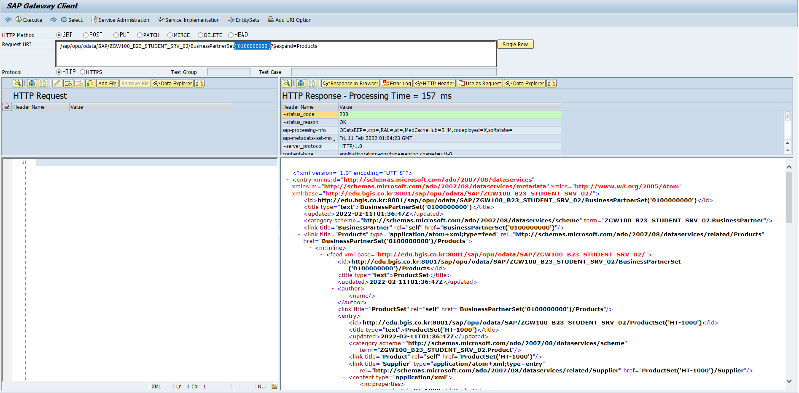

  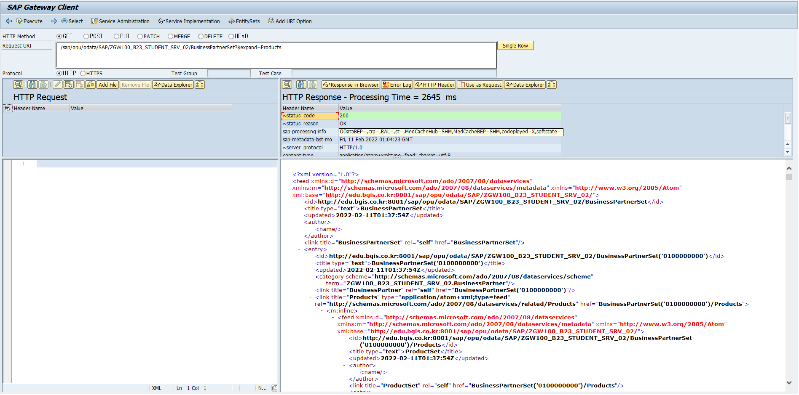

  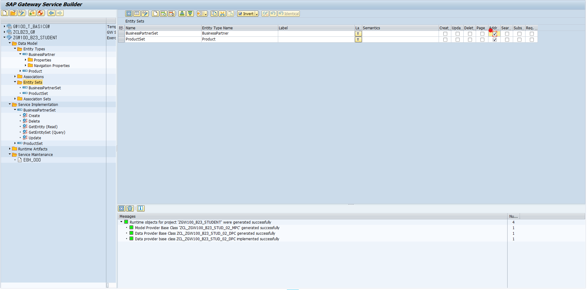


# Lesson 5: Implementing Query Options


```abap
  METHOD connectionset_get_entityset.

    DATA: lt_filter TYPE /iwbep/t_mgw_select_option,
          ls_filter TYPE /iwbep/s_mgw_select_option.
    DATA: lt_cityfrom TYPE RANGE OF spfli-cityfrom.
    lt_filter = io_tech_request_context->get_filter( )->get_filter_select_options( ).

    READ TABLE lt_filter INTO ls_filter WITH TABLE KEY property = 'CITYFROM'.
    IF sy-subrc = 0.
      MOVE-CORRESPONDING ls_filter-select_options TO lt_cityfrom.
    ENDIF.


    DATA: lt_connection TYPE TABLE OF spfli.

    SELECT *
      INTO CORRESPONDING FIELDS OF TABLE lt_connection
      FROM spfli
     WHERE CITYFROM IN LT_CITYFROM.

    MOVE-CORRESPONDING lt_connection TO et_entityset.

  ENDMETHOD.
```

/sap/opu/odata/SAP/ZCLB23_GW_SRV/ConnectionSet?$filter=startswith(Cityfrom,'B')


* ## Exercise 11.

  ```abap
    METHOD businesspartners_get_entityset.
  
      DATA: ls_entity     LIKE LINE OF et_entityset,
            lt_headerdata TYPE TABLE OF bapi_epm_bp_header,
            ls_headerdata LIKE LINE OF lt_headerdata,
            lt_return     TYPE TABLE OF bapiret2.
  
      DATA: lt_filters    TYPE /iwbep/t_mgw_select_option,
            ls_filter     TYPE /iwbep/s_mgw_select_option,
            lt_so_company TYPE TABLE OF bapi_epm_company_name_range.
  
  *   GET FILTER
      lt_filters = io_tech_request_context->get_filter( )->get_filter_select_options( ).
  
      READ TABLE lt_filters
        WITH TABLE KEY property = 'COMPANYNAME'
        INTO ls_filter.
      IF sy-subrc EQ 0.
        MOVE-CORRESPONDING ls_filter-select_options TO lt_so_company.
      ENDIF.
  
  *   GET DATA
      CALL FUNCTION 'BAPI_EPM_BP_GET_LIST'
        TABLES
          bpheaderdata        = lt_headerdata
          selparamcompanyname = lt_so_company
          return              = lt_return.
      IF lt_return IS NOT INITIAL.
        "MESSAGE CONTAINER
        mo_context->get_message_container( )->add_messages_from_bapi( lt_return ).
  
        RAISE EXCEPTION TYPE /iwbep/cx_mgw_busi_exception
          EXPORTING
            textid            = /iwbep/cx_mgw_busi_exception=>business_error
            message_container = mo_context->get_message_container( ).
      ENDIF.
  
  *   MAP PROPERTIES FROM THE BACK END TO OUTPUT RESPONSE STRUCTURE
      LOOP AT lt_headerdata INTO ls_headerdata.
        ls_entity-businesspartnerid = ls_headerdata-bp_id.
        ls_entity-businesspartnerid = ls_headerdata-bp_id.
        ls_entity-businesspartnerrole = ls_headerdata-bp_role.
        ls_entity-emailaddress = ls_headerdata-email_address.
        ls_entity-companyname = ls_headerdata-company_name.
        ls_entity-currencycode = ls_headerdata-currency_code.
        ls_entity-city = ls_headerdata-city.
        ls_entity-street = ls_headerdata-street.
        ls_entity-country = ls_headerdata-country.
        ls_entity-addresstype = ls_headerdata-address_type.
        APPEND ls_entity TO et_entityset.
        CLEAR ls_entity.
      ENDLOOP.
  
    ENDMETHOD.
  ```

  /sap/opu/odata/SAP/ZGW100_B23_STUDENT_SRV_02/BusinessPartnerSet?4filter=startswith(CompanyName,'S')

  

  

  

  

* ## Exercise 12.

  ```ABAP
    METHOD businesspartners_get_entityset.
  
      DATA: ls_entity     LIKE LINE OF et_entityset,
            lt_headerdata TYPE TABLE OF bapi_epm_bp_header,
            ls_headerdata LIKE LINE OF lt_headerdata,
            lt_return     TYPE TABLE OF bapiret2.
  
      DATA: lt_filters    TYPE /iwbep/t_mgw_select_option,
            ls_filter     TYPE /iwbep/s_mgw_select_option,
            lt_so_company TYPE TABLE OF bapi_epm_company_name_range.
  
      DATA: ls_max_rows TYPE bapi_epm_max_rows,
            ls_paging   TYPE /iwbep/s_mgw_paging.
  
  *   GET PAGIN
      ls_paging-top = io_tech_request_context->get_top( ).
      ls_paging-skip = io_tech_request_context->get_skip( ).
      IF ls_paging-top > 0.
        ls_max_rows-bapimaxrow = ls_paging-top + ls_paging-skip.
      ENDIF.
  
  *   GET FILTER
      lt_filters = io_tech_request_context->get_filter( )->get_filter_select_options( ).
  
      READ TABLE lt_filters
        WITH TABLE KEY property = 'COMPANYNAME'
        INTO ls_filter.
      IF sy-subrc EQ 0.
        MOVE-CORRESPONDING ls_filter-select_options TO lt_so_company.
      ENDIF.
  
  *   GET DATA
      CALL FUNCTION 'BAPI_EPM_BP_GET_LIST'
        EXPORTING
          max_rows            = ls_max_rows
        TABLES
          bpheaderdata        = lt_headerdata
          selparamcompanyname = lt_so_company
          return              = lt_return.
      IF lt_return IS NOT INITIAL.
        "MESSAGE CONTAINER
        mo_context->get_message_container( )->add_messages_from_bapi( lt_return ).
  
        RAISE EXCEPTION TYPE /iwbep/cx_mgw_busi_exception
          EXPORTING
            textid            = /iwbep/cx_mgw_busi_exception=>business_error
            message_container = mo_context->get_message_container( ).
      ENDIF.
  
  *   DELETE SKIPPED RESPONSE DATA
      IF ls_paging-skip IS NOT INITIAL.
        DELETE lt_headerdata TO ls_paging-skip.
      ENDIF.
  
  *   MAP PROPERTIES FROM THE BACK END TO OUTPUT RESPONSE STRUCTURE
      LOOP AT lt_headerdata INTO ls_headerdata.
        ls_entity-businesspartnerid = ls_headerdata-bp_id.
        ls_entity-businesspartnerid = ls_headerdata-bp_id.
        ls_entity-businesspartnerrole = ls_headerdata-bp_role.
        ls_entity-emailaddress = ls_headerdata-email_address.
        ls_entity-companyname = ls_headerdata-company_name.
        ls_entity-currencycode = ls_headerdata-currency_code.
        ls_entity-city = ls_headerdata-city.
        ls_entity-street = ls_headerdata-street.
        ls_entity-country = ls_headerdata-country.
        ls_entity-addresstype = ls_headerdata-address_type.
        APPEND ls_entity TO et_entityset.
        CLEAR ls_entity.
      ENDLOOP.
  
    ENDMETHOD.
  ```

  /sap/opu/odata/SAP/ZGW100_B23_STUDENT_SRV_02/BusinessPartnerSet?$top=3

  

  ##### /sap/opu/odata/SAP/ZGW100_B23_STUDENT_SRV_02/BusinessPartnerSet?$top=3&$format=json

  ```json
  {
    "d" : {
      "results" : [
        {
          "__metadata" : {
            "id" : "http://edu.bgis.co.kr:8001/sap/opu/odata/SAP/ZGW100_B23_STUDENT_SRV_02/BusinessPartnerSet('0100000000')",
            "uri" : "http://edu.bgis.co.kr:8001/sap/opu/odata/SAP/ZGW100_B23_STUDENT_SRV_02/BusinessPartnerSet('0100000000')",
            "type" : "ZGW100_B23_STUDENT_SRV_02.BusinessPartner"
          },
          "BusinessPartnerID" : "0100000000",
          "BusinessPartnerRole" : "01",
          "EmailAddress" : "customer-do.not.reply@sap.com",
          "CompanyName" : "SAP",
          "CurrencyCode" : "EUR",
          "City" : "Walldorf",
          "Street" : "Dietmar-Hopp-Allee",
          "Country" : "DE",
          "AddressType" : "02",
          "Products" : {
            "__deferred" : {
              "uri" : "http://edu.bgis.co.kr:8001/sap/opu/odata/SAP/ZGW100_B23_STUDENT_SRV_02/BusinessPartnerSet('0100000000')/Products"
            }
          }
        },
        {
          "__metadata" : {
            "id" : "http://edu.bgis.co.kr:8001/sap/opu/odata/SAP/ZGW100_B23_STUDENT_SRV_02/BusinessPartnerSet('0100000001')",
            "uri" : "http://edu.bgis.co.kr:8001/sap/opu/odata/SAP/ZGW100_B23_STUDENT_SRV_02/BusinessPartnerSet('0100000001')",
            "type" : "ZGW100_B23_STUDENT_SRV_02.BusinessPartner"
          },
          "BusinessPartnerID" : "0100000001",
          "BusinessPartnerRole" : "01",
          "EmailAddress" : "customer-dagmar.schulze@beckerberlin.de",
          "CompanyName" : "Becker Berlin",
          "CurrencyCode" : "EUR",
          "City" : "Berlin",
          "Street" : "Calvinstraße",
          "Country" : "DE",
          "AddressType" : "02",
          "Products" : {
            "__deferred" : {
              "uri" : "http://edu.bgis.co.kr:8001/sap/opu/odata/SAP/ZGW100_B23_STUDENT_SRV_02/BusinessPartnerSet('0100000001')/Products"
            }
          }
        },
        {
          "__metadata" : {
            "id" : "http://edu.bgis.co.kr:8001/sap/opu/odata/SAP/ZGW100_B23_STUDENT_SRV_02/BusinessPartnerSet('0100000002')",
            "uri" : "http://edu.bgis.co.kr:8001/sap/opu/odata/SAP/ZGW100_B23_STUDENT_SRV_02/BusinessPartnerSet('0100000002')",
            "type" : "ZGW100_B23_STUDENT_SRV_02.BusinessPartner"
          },
          "BusinessPartnerID" : "0100000002",
          "BusinessPartnerRole" : "01",
          "EmailAddress" : "customer-maria.brown@delbont.com",
          "CompanyName" : "DelBont Industries",
          "CurrencyCode" : "USD",
          "City" : "Wilmington, Delaware",
          "Street" : "1 2345 King Street",
          "Country" : "US",
          "AddressType" : "02",
          "Products" : {
            "__deferred" : {
              "uri" : "http://edu.bgis.co.kr:8001/sap/opu/odata/SAP/ZGW100_B23_STUDENT_SRV_02/BusinessPartnerSet('0100000002')/Products"
            }
          }
        }
      ]
    }
  }
  ```

  ##### /sap/opu/odata/SAP/ZGW100_B23_STUDENT_SRV_02/BusinessPartnerSet?$top=3&$skip=2&$format=json

  ```json
  {
    "d" : {
      "results" : [
        {
          "__metadata" : {
            "id" : "http://edu.bgis.co.kr:8001/sap/opu/odata/SAP/ZGW100_B23_STUDENT_SRV_02/BusinessPartnerSet('0100000002')",
            "uri" : "http://edu.bgis.co.kr:8001/sap/opu/odata/SAP/ZGW100_B23_STUDENT_SRV_02/BusinessPartnerSet('0100000002')",
            "type" : "ZGW100_B23_STUDENT_SRV_02.BusinessPartner"
          },
          "BusinessPartnerID" : "0100000002",
          "BusinessPartnerRole" : "01",
          "EmailAddress" : "customer-maria.brown@delbont.com",
          "CompanyName" : "DelBont Industries",
          "CurrencyCode" : "USD",
          "City" : "Wilmington, Delaware",
          "Street" : "1 2345 King Street",
          "Country" : "US",
          "AddressType" : "02",
          "Products" : {
            "__deferred" : {
              "uri" : "http://edu.bgis.co.kr:8001/sap/opu/odata/SAP/ZGW100_B23_STUDENT_SRV_02/BusinessPartnerSet('0100000002')/Products"
            }
          }
        },
        {
          "__metadata" : {
            "id" : "http://edu.bgis.co.kr:8001/sap/opu/odata/SAP/ZGW100_B23_STUDENT_SRV_02/BusinessPartnerSet('0100000003')",
            "uri" : "http://edu.bgis.co.kr:8001/sap/opu/odata/SAP/ZGW100_B23_STUDENT_SRV_02/BusinessPartnerSet('0100000003')",
            "type" : "ZGW100_B23_STUDENT_SRV_02.BusinessPartner"
          },
          "BusinessPartnerID" : "0100000003",
          "BusinessPartnerRole" : "01",
          "EmailAddress" : "customer-saskia.sommer@talpa-hannover.de",
          "CompanyName" : "Talpa",
          "CurrencyCode" : "EUR",
          "City" : "Hannover",
          "Street" : "An der Breiten Wiese",
          "Country" : "DE",
          "AddressType" : "02",
          "Products" : {
            "__deferred" : {
              "uri" : "http://edu.bgis.co.kr:8001/sap/opu/odata/SAP/ZGW100_B23_STUDENT_SRV_02/BusinessPartnerSet('0100000003')/Products"
            }
          }
        },
        {
          "__metadata" : {
            "id" : "http://edu.bgis.co.kr:8001/sap/opu/odata/SAP/ZGW100_B23_STUDENT_SRV_02/BusinessPartnerSet('0100000004')",
            "uri" : "http://edu.bgis.co.kr:8001/sap/opu/odata/SAP/ZGW100_B23_STUDENT_SRV_02/BusinessPartnerSet('0100000004')",
            "type" : "ZGW100_B23_STUDENT_SRV_02.BusinessPartner"
          },
          "BusinessPartnerID" : "0100000004",
          "BusinessPartnerRole" : "01",
          "EmailAddress" : "customer-bob.buyer@panorama-studios.biz",
          "CompanyName" : "Panorama Studios",
          "CurrencyCode" : "USD",
          "City" : "Hollywood, California",
          "Street" : "Morning Drive",
          "Country" : "US",
          "AddressType" : "02",
          "Products" : {
            "__deferred" : {
              "uri" : "http://edu.bgis.co.kr:8001/sap/opu/odata/SAP/ZGW100_B23_STUDENT_SRV_02/BusinessPartnerSet('0100000004')/Products"
            }
          }
        }
      ]
    }
  }
  ```

  

# Lesson 6: Implementing Change Operations


#### BOOKINGSET_GET_ENTITYSET

```abap
  METHOD bookingset_get_entityset.

    SELECT *
      INTO CORRESPONDING FIELDS OF TABLE et_entityset
      UP TO 10 ROWS
      FROM sbook
     WHERE fldate >= sy-datum.

  ENDMETHOD.
```

#### BOOKINGSET_GET_ENTITY

```ABAP
  METHOD bookingset_get_entity.

    io_tech_request_context->get_converted_keys(
      IMPORTING
        es_key_values = er_entity                 " Entity Key Values - converted
    ).

    SELECT SINGLE *
      INTO CORRESPONDING FIELDS OF er_entity
      FROM sbook
     WHERE carrid = er_entity-carrid
       AND connid = er_entity-connid
       AND fldate = er_entity-fldate
       AND bookid = er_entity-bookid.

  ENDMETHOD.
```

#### BOOKINGSET_DELETE_ENTITY

```ABAP
  METHOD bookingset_delete_entity.

    DATA: ls_key TYPE bapisbokey.

    DATA: ls_entity TYPE zcl_zclb23_gw_mpc=>ts_booking.

    DATA: lt_return TYPE TABLE OF bapiret2.

    io_tech_request_context->get_converted_keys(
      IMPORTING
        es_key_values = ls_entity                 " Entity Key Values - converted
    ).

    ls_key-airlineid = ls_entity-carrid.
    ls_key-bookingid = ls_entity-bookid.

    CALL FUNCTION 'BAPI_FLBOOKING_CANCEL'
      EXPORTING
        airlineid     = ls_key-airlineid
        bookingnumber = ls_key-bookingid
        test_run      = 'X'               "TEST 만 하고 실재로 데이터에 반영하지는 않는다.
      TABLES
        return        = lt_return.

  ENDMETHOD.
```


/sap/opu/odata/SAP/ZCLB23_GW_SRV/BookingSet(Carrid='LH',Connid='0401',Fldate=datetime'2022-02-11T00:00:00',Bookid='00092097')


/sap/opu/odata/SAP/ZCLB23_GW_SRV/BookingSet(Carrid='LH',Connid='0401',Fldate=datetime'2022-02-11T00:00:00',Bookid='00092097')?$format=json

```json
{
  "d" : {
    "__metadata" : {
      "id" : "http://edu.bgis.co.kr:8001/sap/opu/odata/SAP/ZCLB23_GW_SRV/BookingSet(Carrid='LH',Connid='0401',Fldate=datetime'2022-02-11T00%3A00%3A00',Bookid='00092097')",
      "uri" : "http://edu.bgis.co.kr:8001/sap/opu/odata/SAP/ZCLB23_GW_SRV/BookingSet(Carrid='LH',Connid='0401',Fldate=datetime'2022-02-11T00%3A00%3A00',Bookid='00092097')",
      "type" : "ZCLB23_GW_SRV.Booking"
    },
    "Carrid" : "LH",
    "Connid" : "0401",
    "Fldate" : "\/Date(1644537600000)\/",
    "Bookid" : "00092097",
    "Customid" : "00003145",
    "Custtype" : "P",
    "Smoker" : "",
    "Luggweight" : "0.000",
    "Wunit" : "KG",
    "Invoice" : false,
    "Class" : "Y",
    "Forcuram" : "666.00",
    "Forcurkey" : "EUR",
    "Loccuram" : "666.00",
    "Loccurkey" : "EUR",
    "OrderDate" : "\/Date(1622851200000)\/",
    "Counter" : "00000000",
    "Agencynum" : "00000087",
    "Cancelled" : "",
    "Reserved" : "",
    "Passname" : "Christoph Hansmann",
    "Passform" : "",
    "Passbirth" : null
  }
}
```


왼쪽에 

```json
{
    "Carrid" : "LH",
    "Connid" : "0401",
    "Fldate" : "\/Date(1644537600000)\/",
    "Customid" : "00003145",
    "Custtype" : "P",
    "Smoker" : "",
    "Luggweight" : "0.000",
    "Wunit" : "KG",
    "Invoice" : false,
    "Class" : "Y",
    "Forcuram" : "666.00",
    "Forcurkey" : "EUR",
    "Loccuram" : "666.00",
    "Loccurkey" : "EUR",
    "OrderDate" : "\/Date(1622851200000)\/",
    "Counter" : "00000000",
    "Agencynum" : "00000087",
    "Cancelled" : "",
    "Reserved" : "",
    "Passname" : "Christoph Hansmann",
    "Passform" : "",
    "Passbirth" : null
}
```

넣고 post 로

/sap/opu/odata/SAP/ZCLB23_GW_SRV/BookingSet  excute 한다.


* ## Exercise 13. 다시

  

  

  #### BUSINESSPARTNERS_CREATE_ENTITY

  ```abap
    METHOD businesspartners_create_entity.
  
      DATA: ls_entry_data TYPE cl_gw100_s_cud_mpc=>ts_businesspartner,
            ls_headerdata TYPE bapi_epm_bp_header,
            ls_bp_id      TYPE bapi_epm_bp_id,
            lt_return     TYPE TABLE OF bapiret2.
  
  *   GET REQUEST DATA
      io_data_provider->read_entry_data(
        IMPORTING
          es_data = ls_entry_data
      ).
  *   CATCH /iwbep/cx_mgw_tech_exception. " mgw technical exception
  
  *   MAP REQUEST FIELDS TO FUNCTION MODULE PARAMETERS
  
      ls_headerdata-company_name  = ls_entry_data-companyname.
      ls_headerdata-email_address = ls_entry_data-emailaddress.
      ls_headerdata-currency_code = ls_entry_data-currencycode.
      ls_headerdata-city          = ls_entry_data-city.
      ls_headerdata-street        = ls_entry_data-street.
      ls_headerdata-country       = ls_entry_data-country.
      ls_headerdata-address_type  = ls_entry_data-addresstype.
      ls_headerdata-bp_role       = ls_entry_data-businesspartnerrole.
  
  *   CREATE DATA
      CALL FUNCTION 'BAPI_EPM_BP_CREATE'
        EXPORTING
          headerdata        = ls_headerdata
          persist_to_db     = abap_true
        IMPORTING
          businesspartnerid = ls_bp_id
        TABLES
  *       CONTACTDATA       =
          return            = lt_return.
  
      IF lt_return IS NOT INITIAL.
        "MESSAGE CONTAINER
        mo_context->get_message_container( )->add_messages_from_bapi( lt_return ).
        RAISE EXCEPTION TYPE /iwbep/cx_mgw_busi_exception
          EXPORTING
            textid            = /iwbep/cx_mgw_busi_exception=>business_error
            message_container = mo_context->get_message_container( ).
      ENDIF.
  
  *   FILL RESPONSE DATA
      ER_ENTITY-BUSINESSPARTNERID   = LS_BP_ID.
      ER_ENTITY-COMPANYNAME         = LS_HEADERDATA-company_name.
      ER_ENTITY-EMAILADDRESS        = LS_HEADERDATA-email_address.
      ER_ENTITY-CURRENCYCODE        = LS_HEADERDATA-currency_code.
      ER_ENTITY-CITY                = LS_HEADERDATA-city.
      ER_ENTITY-STREET              = LS_HEADERDATA-STREET.
      ER_ENTITY-COUNTRY             = LS_HEADERDATA-country.
      ER_ENTITY-ADDRESSTYPE         = LS_HEADERDATA-address_type.
      ER_ENTITY-BUSINESSPARTNERROLE = LS_HEADERDATA-bp_role.
  
    ENDMETHOD.
  ```

  #### /sap/opu/odata/SAP/ZGW100_B23_STUDENT_SRV_02/BusinessPartnerSet('0100000000')

  

  /sap/opu/odata/SAP/ZGW100_B23_STUDENT_SRV_02/BusinessPartnerSet