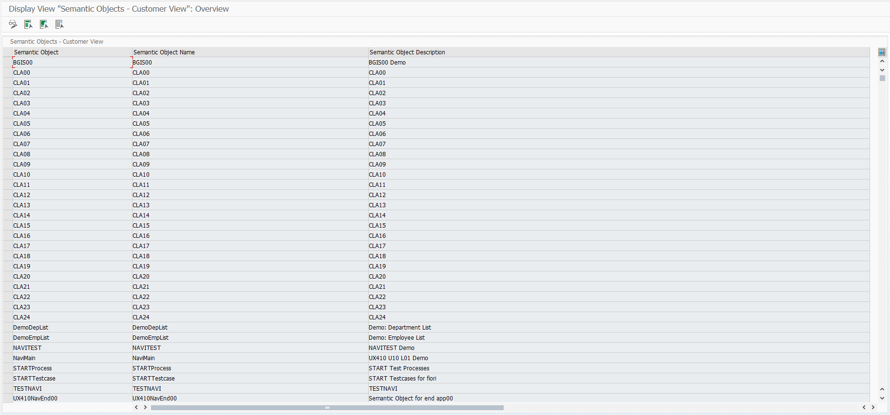

# UNIT 10.


* ## Configuration Steps

  

  

  

  **[1] Create Semantic Object in SAP Fiori Server (Front-end) server**

  **[2] Create Launchpad Role in SAP Fiori Server (Front-end) server**

  **[3] Create Business Catalog**

  **[4] Create Business Group**

  **[5] Create App’s PFCG Role in SAP Fiori Server (Front-end) server**

  * **[A] Create PFCG Role for Fiori Launchpad accessibility**

  * **[B] Create PFCG Role for SAPUI5 Application**

  - **[C] Role assignment to user-id**

   

  

  

   


* ## T-CODE

  #### DESPLAY VIEW SEMANTIC OBJECT : /UI2/SEMOBJ

  

  유저모두가 동일한 데이터를 보게 되어 누군가 수정중이라면 수정이 막히게 된다.

   
  
  #### LUNCHPAD DESIGNER : /UI2/FLPD_CUST
  
  
  
  
  
  


* ## Dynamic Tile

  


* ### 화면 생성 밑 ABAP-DEPLOY

  #### zfiorib23_nav_a

  ```xml
  <mvc:View
      controllerName="iitp.zfiorib23nava.controller.View1"
      xmlns:mvc="sap.ui.core.mvc"
      displayBlock="true"
      xmlns="sap.m"
  >
      <Shell id="shell">
          <App id="app">
              <pages>
                  <Page id="page" title="{i18n>title}">
                      <content>
                          <Table id="tbDep" items="{/EtDepSet}" >
                              <columns>
                                  <Column id="colDepid">
                                      <header>
                                          <Text id="colTxtDepid" text="Department ID" />
                                      </header>
                                  </Column>
                                  <Column id="colName">
                                      <header>
                                          <Text id="colTxtName" text="Department Name" />
                                      </header>
                                  </Column>
                              </columns>
                              <items>
                                  <ColumnListItem id="colList" press="onItemClick" type="Active" >
                                      <cells>
                                          <Text id="celTxtId" text="{Depid}" />
                                          <Text id="celTxtName" text="{Dtext}" />
                                      </cells>
                                  </ColumnListItem>
                              </items>
                          </Table>
                      </content>
                  </Page>
              </pages>
          </App>
      </Shell>
  </mvc:View>
  ```

  #### zfiorib23_nav_b

  ```xml
  <mvc:View
      controllerName="iitp.zfiorib23navb.controller.View1"
      xmlns:mvc="sap.ui.core.mvc"
      displayBlock="true"
      xmlns="sap.m"
  >
      <Shell id="shell">
          <App id="app">
              <pages>
                  <Page id="page" title="{i18n>title}">
                      <content>
                          <Table id="tbEmp" items="{/EtEmpSet}">
                              <columns>
                                  <Column id="colEmpno">
                                      <header><Text id="txtEmpno" text="Employee No."/></header>
                                  </Column>
                                  <Column id="colEmpName">
                                      <header><Text id="txtEmpName" text="Employee Name"/></header>
                                  </Column>
                                  <Column id="colEntDate">
                                      <header><Text id="txtEntDate" text="Enter Date"/></header>
                                  </Column>
                                  <Column id="colGrade">
                                      <header><Text id="txtGrade" text="Grade"/></header>
                                  </Column>
                                  <Column id="colDept">
                                      <header><Text id="txtDept" text="Department"/></header>
                                  </Column>
                              </columns>
                              <items>
                                  <ColumnListItem id="colList">
                                      <cells>
                                          <Text id="delTxtEmpno" text="{Pernr}"/>
                                          <Text id="delTxtEname" text="{Ename}"/>
                                          <Text id="delTxtBegda" text="{Begda}"/>
                                          <Text id="delTxtGrade" text="{Grade}"/>
                                          <Text id="delTxtDtext" text="{Dtext}"/>
                                      </cells>
                                  </ColumnListItem>
                              </items>
                          </Table>
                      </content>
                  </Page>
              </pages>
          </App>
      </Shell>
  </mvc:View>
  
  ```

  

  BAS에서 Front end 프로그램인 프로젝트를 생성한 후 프로젝트를 우클릭 open in terminal을 통해 terminal 창을 연다.

  ```ABAP
  npm install
  
  npm run build
  
  abap-deploy
  
  ./dist 			"=> enter
  
  sap gui 		"아이디와 비밀번호 입력
  
  application name : zfiorib23_nav_a, zfiorib23_nav_b
  
  description : Navigation a, Navigation b
  ```

  위의 과정을 실행한 경우 처음 오류가 날 수 있다. 

  이후 SAP GUI SE80 T-CODE를 들어가 확인해 보면

  

  BSP Library에 추가된 것을 확인할 수 있다.

  

* ### Semantic Objects 생성 T-CODE */N/UI2/SEMOBJ*

  

  ##### Display -> Change 버튼을 통해 수정모드로 들어간다.

  

  ##### 확인을 누른다. (한번에 한사람만 수정 가능하다.)

  

  ##### New Entries 버튼을 눌러

  

  ##### 새로운 항목을 만든 후 저장 버튼을 눌러 RFC를 등록한다.

* ### LUNCHPAD DESIGNER  (T-CODE  /N/UI2/FLPD_CUST)

  ##### 해당 T-CODE를 입력하면 

  ##### 브라우저를 통해 http://edu.bgis.co.kr:8001/sap/bc/ui5_ui5/sap/arsrvc_upb_admn/main.html?scope=CUST&sap-client=100&sap-language=EN

  ##### 로 이동하게 된다. (로그인 창이 뜰 경우 SAP GUI 계정과 동일하게 입력하면 된다.)

  

  LUNCHPAD DESIGNER 화면

  

  

  

  ##### 화면 왼쪽 하단의 Plus 버튼을 클릭하여 새로운 Catalog를 생성한다.

  

  

  ##### 생성한 Catalog를 클릭한 후 

  

  ##### Target Mapping을 클릭하고 Create Target Mapping 버튼을 클릭한다.

  

  

  Create Target Mapping 화면

  

  

  #### T-CODE *SICF* 로 들어가 

  

  ##### 우리가 생성하여 ABAP-DEPLOY한 서비스를 검색한다.

  

  ##### 원하는 프로그램을 더블 클릭하여 (UI5_UI5/SAP 경로의 프로그램)

  

  ##### 경로를 복사한후 (/default_host 빼고!!!!!!!)

  

  ##### URL 칸에 입력해 준다. (경로 뒤에는 프로그램 명 까지)

  ##### (Semantic Object는 위의 과정에서 생성한 것을 사용)

  

  

  

  ##### 이후 Tiles 탭을 클릭 후 Create Tile 버튼을 클릭한다.

  

  ##### App Launcher-Static 을 클릭한 후

  

  ##### Tile 구성을 위한 정보를 입력해 준다.

  

  위 과정을 ***zfiorib23_nav_b*** 프로젝트에도 동일하게 수행한다.

  

  ### (/default_host 빼고!!!!!!!)

  

  

  

  

  

  

  

  

  

  

  

  

* ### 권한 부여 (T-CODE  PFCG)  

  

  

  

  

  

  

  

  

  

  

  
  
  
  
  
  
  
  
  
  
  


* ### 두 프로그램간 연결

  nav_a 프로그램의 row 선택시 Employee List 로 넘어가는 Logic을 구상하고 싶다

  #### iitp.zfiorib23_nav_a Controller

  ```js
  sap.ui.define([
      "sap/ui/core/mvc/Controller"
  ],
      /**
       * @param {typeof sap.ui.core.mvc.Controller} Controller
       */
      function (Controller) {
          "use strict";
  
          return Controller.extend("iitp.zfiorib23nava.controller.View1", {
              onInit: function () {
                  this._fnGetService = sap.ushell && sap.ushell.Container && sap.ushell.Container.getService;
                  this._oCrossAppNavigation = this._fnGetService && this._fnGetService("CrossApplicationNavigation");
              },
  
              onItemClick: function (oEvent) {
                  var sContext = oEvent.getSource().getBindingContext();
                  var oModel = this.getView().getModel();
                  var depId = oModel.getProperty("Depid", sContext);
  
                  if (this._oCrossAppNavigation) {
                      //어플리케이션 간 이동 서비스 참조해서 toExternal 함수 호출
                      var oHref = this._oCrossAppNavigation.toExternal({
                          target: {
                              semanticObject: "CLB23",
                              action: "navb"
                          },
                          // Target App에 파라미터를 통해 값 전달
                          params: {
                              "pDepId": depId
                          }
                      })
                  }
              }            
          });
      })
  ```

  

  아직 오류가 뜬다.

  

  #### iitp.zfiorib23_nav_b Controller

  ```js
  sap.ui.define([
      "sap/ui/core/mvc/Controller",
      "sap/ui/model/Filter"
  ],
      /**
       * @param {typeof sap.ui.core.mvc.Controller} Controller
       */
      function (Controller, Filter) {
          "use strict";
  
          return Controller.extend("iitp.zfiorib23navb.controller.View1", {
              onInit: function () {
                  //component data 취득.
                  var oComponentData = this.getOwnerComponent().getComponentData()
  
                  //component의 navigation parameter에서 시작 파라미터 취득.
                  if (oComponentData && oComponentData.startupParameters && oComponentData.startupParameters.pDepId) {
                      var depId = oComponentData.startupParameters.pDepId[0];
                      var oFilter = new Filter("Depid", "EQ", depId, "");
                      var oTable = this.byId("tbEmp");
  
                      var oBinding = oTable.getBinding("items");
                      oBinding.filter(oFilter);
                  }
              }
          });
      });
  ```

  이후 적용하기 위해서는 npm install 은 생략하고 npm run build 와 abap-deploy 는 꼭 실행해줘야한다.


* ## 실습 

  #### zclb23_car

  ```xml
  <mvc:View
      controllerName="iitp.zclb23car.controller.View1"
      xmlns:mvc="sap.ui.core.mvc"
      displayBlock="true"
      xmlns="sap.m"
  >
      <Shell id="shell">
          <App id="app">
              <pages>
                  <Page id="page" title="{i18n>title}">
                      <content>
                          <Table id="tbCarr" items="{/UX_C_Carrier_TP}" >
                              <columns>
                                  <Column id="colCarrid">
                                      <header>
                                          <Text id="colTxtCarrid" text="Airline ID" />
                                      </header>
                                  </Column>
                                  <Column id="colCarrname">
                                      <header>
                                          <Text id="colTxtCarrname" text="Airline Name" />
                                      </header>
                                  </Column>
                                  <Column id="colCurrcode">
                                      <header>
                                          <Text id="colTxtCurrcode" text="Currency" />
                                      </header>
                                  </Column>
                              </columns>
                              <items>
                                  <ColumnListItem id="colList" press="onItemClick" type="Active" >
                                      <cells>
                                          <Text id="celTxtId" text="{Carrid}" />
                                          <Text id="celTxtName" text="{Carrname}" />
                                          <Text id="celTxtCode" text="{Currcode}" />
                                      </cells>
                                  </ColumnListItem>
                              </items>
                          </Table>
                      </content>
                  </Page>
              </pages>
          </App>
      </Shell>
  </mvc:View>
  
  ```

  ```js
  sap.ui.define([
      "sap/ui/core/mvc/Controller"
  ],
      /**
       * @param {typeof sap.ui.core.mvc.Controller} Controller
       */
      function (Controller) {
          "use strict";
  
          return Controller.extend("iitp.zclb23car.controller.View1", {
              onInit: function () {
                  this._fnGetService = sap.ushell && sap.ushell.Container && sap.ushell.Container.getService;
                  this._oCrossAppNavigation = this._fnGetService && this._fnGetService("CrossApplicationNavigation");
              },
  
              onItemClick: function (oEvent) {
                  var sContext = oEvent.getSource().getBindingContext();
                  var oModel = this.getView().getModel();
                  var carrId = oModel.getProperty("Carrid", sContext);
  
                  if (this._oCrossAppNavigation) {
                      //어플리케이션 간 이동 서비스 참조해서 toExternal 함수 호출
                      var oHref = this._oCrossAppNavigation.toExternal({
                          target: {
                              semanticObject: "CLB23",
                              action: "zclb23con"
                          },
                          // Target App에 파라미터를 통해 값 전달
                          params: {
                              "pCarrid": carrId
                          }
                      })
                  }
              }
          });
      });
  
  ```

  

  #### zclb23_con

  ```xml
  <mvc:View
      controllerName="iitp.zclb23con.controller.View1"
      xmlns:mvc="sap.ui.core.mvc"
      displayBlock="true"
      xmlns="sap.m"
  >
      <Shell id="shell">
          <App id="app">
              <pages>
                  <Page id="page" title="{i18n>title}">
                      <content>
                          <Table id="tbConn" items="{/UX_C_Connection_TP}">
                              <columns>
                                  <Column id="colCarrid">
                                      <header>
                                          <Text id="colTxtCarrid" text="Airline ID" />
                                      </header>
                                  </Column>
                                  <Column id="colConnid">
                                      <header><Text id="txtConnid" text="Connection No."/></header>
                                  </Column>
                                  <Column id="colCityfrom">
                                      <header><Text id="txtCityfrom" text="City From"/></header>
                                  </Column>
                                  <Column id="colAirpfrom">
                                      <header><Text id="txtAirpfrom" text="Airport From"/></header>
                                  </Column>
                                  <Column id="colCityto">
                                      <header><Text id="txtCityto" text="City To"/></header>
                                  </Column>
                                  <Column id="colAirpto">
                                      <header><Text id="txtAirpto" text="Airport To"/></header>
                                  </Column>
                              </columns>
                              <items>
                                  <ColumnListItem id="colList">
                                      <cells>
                                          <Text id="celTxtCarrid" text="{Carrid}"/>
                                          <Text id="celTxtConnid" text="{Connid}"/>
                                          <Text id="celTxtCityfrom" text="{Cityfrom}"/>
                                          <Text id="celTxtAirpfrom" text="{Airpfrom}"/>
                                          <Text id="celTxtCityto" text="{Cityto}"/>
                                          <Text id="celTxtAirpto" text="{Airpto}"/>
                                      </cells>
                                  </ColumnListItem>
                              </items>
                          </Table>
                      </content>
                  </Page>
              </pages>
          </App>
      </Shell>
  </mvc:View>
  ```

  ```js
  sap.ui.define([
      "sap/ui/core/mvc/Controller",
      "sap/ui/model/Filter"
  ],
      /**
       * @param {typeof sap.ui.core.mvc.Controller} Controller
       */
      function (Controller, Filter) {
          "use strict";
  
          return Controller.extend("iitp.zclb23con.controller.View1", {
              onInit: function () {
                  //component data 취득.
                  var oComponentData = this.getOwnerComponent().getComponentData();
  
                  //component의 navigation parameter에서 시작 파라미터 취득.
                  if(oComponentData && oComponentData.startupParameters && oComponentData.startupParameters.pCarrid) {
                      var carrId = oComponentData.startupParameters.pCarrid[0];
                      var oFilter = new Filter("Carrid", "EQ", carrId);
                      var oTable = this.byId("tbConn");
  
                      var oBinding = oTable.getBinding("items");
                      oBinding.filter(oFilter);
                  }
              }
          });
      });
  ```

  