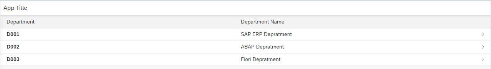
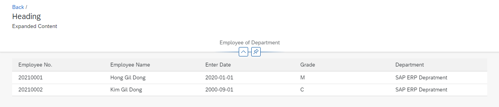

# UNIT 11. SAP Fiori Layout Decision Guidelines


# Lesson 1. Differentiating between Application Framework, Page Layout and Floorplans


# Lesson 2. Creating a Dynamic Page App


* ## 실습 zfiorib23_dynamic

  ### Main

  ```xml
  <mvc:View
      controllerName="iitp.zfiorib23dynamic.controller.Main"
      xmlns:mvc="sap.ui.core.mvc"
      displayBlock="true"
      xmlns="sap.m"
  >
      <Shell id="shell">
          <App id="app">
              <pages>
                  <Page id="page" title="{i18n>title}">
                      <content>
                          <Table id="tbDept" items="{/EtDepSet}">
                              <columns>
                                  <Column id="colDepId">
                                      <header><Text id="txtDepId" text="Department"/></header>
                                  </Column>
                                  <Column id="colDepName">
                                      <header><Text id="txtDepName" text="Department Name"/></header>
                                  </Column>
                              </columns>
                              <items>
                                  <ColumnListItem id="colList" press="onItemClick" type="Navigation">
                                      <cells>
                                          <ObjectIdentifier id="objIdDept" title="{Depid}"/>
                                          <Text id="celTxtName" text="{Dtext}"/>
                                      </cells>
                                  </ColumnListItem>
                              </items>
                          </Table>
                      </content>
                  </Page>
              </pages>
          </App>
      </Shell>
  </mvc:View>
  
  ```

  ```js
  sap.ui.define([
      "sap/ui/core/mvc/Controller"
  ],
      /**
       * @param {typeof sap.ui.core.mvc.Controller} Controller
       */
      function (Controller) {
          "use strict";
  
          return Controller.extend("iitp.zfiorib23dynamic.controller.Main", {
              onInit: function () {
  
              },
  
              onItemClick: function (oEvent) {
                  var sContext = oEvent.getSource().getBindingContext();
                  //이벤트 발생 지점의 소스를 받아 binding 되어 있는 내용을 불러 sContext 에 저장한다.
                  var oModel = this.getView().getModel();
                  //현 화면에 binding 되어 있는 Model을 oModel 변수에 할당한다.
                  var depId = oModel.getProperty("Depid", sContext);
                  //화면에 연결된 모델에서 getProperty 를 통해 
  
                  var oRouter = sap.ui.core.UIComponent.getRouterFor(this);
                  oRouter.navTo("Detail",{
                      //Router에 selDepid 파라미터로 manifest 의 target의 패턴을 사용
                      selDepid : depId
                  })
              }
          });
      });
  
  ```

  ### Detail

  ```xml
  <mvc:View
      controllerName="iitp.zfiorib23dynamic.controller.Detail"
      xmlns:mvc="sap.ui.core.mvc"
      displayBlock="true"
      xmlns="sap.m"
      xmlns:f="sap.f"
      xmlns:layout="sap.ui.layout"
      xmlns:core="sap.ui.core"
  >
      <f:DynamicPage id="dynPageCarrier" headerExpanded="true" toggleHeaderOnTitleClick="true">
          <!-- headerExpanded : Expanded 여부를 결정해준다. -->
          <!-- toggleHeaderOnTitleClick 헤더 타이틀 부분이나 expand 버튼을 눌러 expand 여부를 결정할 수 있도록 한다. -->
          <!-- 둘다 false인 경우 구현해도 뜨지 않으며 true false 인경우 확장 된 상태로 계속 유지된다. -->
          <f:title>
              <f:DynamicPageTitle id="dynPageTlt">
                  <f:breadcrumbs>
                      <Breadcrumbs id="brdCrm">
                          <Link id="linkBack" text="Back" press="onBack"/>
                      </Breadcrumbs>
                  </f:breadcrumbs>
                  <!-- 이전 단계에 대한 링크 목록을 제공하여 사용자가 항목 사이를 이동할 수 있게 해준다. -->
                  
                  <f:heading>
                      <Title id="hTltTxt" text="Heading"/>
                  </f:heading>
                  <f:expandedContent>
                      <Text id="expContTxt" text="Expanded Content"/>
                  </f:expandedContent>
                  <!-- heading 태그 밑에 들어갈 글자를 넣을 수 있으며 이는 expand 여부에 따라 표시여부가 결정된다. -->
              </f:DynamicPageTitle>
          </f:title>
          <f:header>
              <f:DynamicPageHeader id="dynPageHeader" pinnable="true">
              <!-- pinnable 고정할 수 있는 pin 버튼이 추가되며 이를 누를시 헤더 부분이 스크롤을 내려도 고정된다. -->
                  <f:content>
                      <FlexBox id="flexBox" alignContent="Start" justifyContent="SpaceAround">
                      <!-- alignContent FlexBox의 글자 세로 배치를 결정한다 
                      https://sapui5.hana.ondemand.com/#/api/sap.m.FlexAlignContent%23properties -->
                      <!-- justifyContent FlexBox의 글자의 가로 배치를 결정한다. 
                      https://sapui5.hana.ondemand.com/#/api/sap.m.FlexJustifyContent-->
                          <items>
                              <layout:HorizontalLayout id="horLayout" allowWrapping="true">
                              <!-- allowWrapping 줄이 길어질 경우 자동 줄바꿈할지 여부를 결정한다. -->
                                  <layout:VerticalLayout id="vrtLayout">
                                      <ObjectAttribute id="objAttr" text="Employee of Department"/>
                                  </layout:VerticalLayout>
                              </layout:HorizontalLayout>
                          </items>
                      </FlexBox>
                  </f:content>
              </f:DynamicPageHeader>
          </f:header>
  
          <f:content>
              <Table id="tbEmpList" items="{/EtEmpSet}">
                  <columns>
                      <Column id="colEmpNo">
                          <header><Text id="coltxtEmpNo" text="Employee No."/></header>
                      </Column>
                      <Column id="colEmpNm">
                          <header><Text id="coltxtEmpNm" text="Employee Name"/></header>
                      </Column>
                      <Column id="colEntDt">
                          <header><Text id="coltxtEntDt" text="Enter Date"/></header>
                      </Column>
                      <Column id="colGrade">
                          <header><Text id="coltxtGrade" text="Grade"/></header>
                      </Column>
                      <Column id="colDept">
                          <header><Text id="coltxtDept" text="Department"/></header>
                      </Column>
                  </columns>
  
                  <items>
                      <ColumnListItem id="colList">
                          <cells>
                              <Text id="celTxtPernr" text="{Pernr}"/>
                              <Text id="celTxtEname" text="{Ename}"/>
                              <Text id="celTxtBegda" text="{Begda}"/>
                              <Text id="celTxtGrade" text="{Grade}"/>
                              <Text id="celTxtDtext" text="{Dtext}"/>
                          </cells>
                      </ColumnListItem>
                  </items>
              </Table>
          </f:content>
      </f:DynamicPage>
      <!-- <Shell id="shell">
          <App id="app">
              <pages>
                  <Page id="page" title="{i18n>title}">
                      <content />
                  </Page>
              </pages>
          </App>
      </Shell> -->
  </mvc:View>
  
  ```

  ```js
  sap.ui.define([
      "sap/ui/core/mvc/Controller",
      "sap/ui/model/Filter",
      "sap/ui/core/UIComponent"
  ],
      /**
       * @param {typeof sap.ui.core.mvc.Controller} Controller
       */
      function (Controller, Filter, UIComponent) {
          "use strict";
  
          return Controller.extend("iitp.zfiorib23dynamic.controller.Detail", {
              onInit: function () {
                  var oRouter = this.getRouter();
                  oRouter.getRoute("Detail").attachMatched(this._onObjectMatched, this);
              },
  
              getRouter: function () {
                  return UIComponent.getRouterFor(this);
  
              },
              _onObjectMatched: function (oEvent) {
                  var parmDepid = oEvent.getParameter("arguments").selDepid;
  
                  var oFilter = new Filter("Depid", "EQ", parmDepid, "");
                  var oTable = this.byId("tbEmpList");
                  var oBinding = oTable.getBinding("items");
                  oBinding.filter(oFilter);
              },
              onBack: function () {
                  var oRouter = UIComponent.getRouterFor(this);
                  oRouter.navTo("Main");
              }
          });
      });
  
  ```

  ### manifest.json

  ```json
  {
    "_version": "1.32.0",
    "sap.app": {
      "id": "iitp.zfiorib23dynamic",
      "type": "application",
      "i18n": "i18n/i18n.properties",
      "applicationVersion": {
        "version": "0.0.1"
      },
      
  	...
  	...
  	...
  	...
  	
      "routing": {
        "config": {
          "routerClass": "sap.m.routing.Router",
          "viewType": "XML",
          "async": true,
          "viewPath": "iitp.zfiorib23dynamic.view",
          "controlAggregation": "pages",
          "controlId": "app",
          "clearControlAggregation": false
        },
        "routes": [							//route 들을 저장
          {
            "name": "Main",
            "pattern": "",
            "target": ["Main"]
          },
  
          {
            "name": "Detail",
            "pattern": "Detail/{selDepid}",
            //URL 주소 맨 뒤에 붙을 해당 화면 독자적인 추가 주소가 붙는다.
            "target": ["Detail"]
          }
        ],
        "targets": {
          "Main": {
            "viewType": "XML",
            "transition": "slide",    		// 화면의 전환 방법을 지정
            "clearControlAggregation": false,
            "viewId": "Main",
            "viewName": "Main"
          },
          "Detail": {
            "viewType": "XML",
            "transition": "fade",
            "clearControlAggregation": false,
            "viewId": "Detail",
            "viewName": "Detail"
          }
        }
      },
      
      
      "rootView": {
        "viewName": "iitp.zfiorib23dynamic.view.View1",
        "type": "XML",
        "async": true,
        "id": "View1"
      }
    }
  }
  
  ```

  

  

  * ### flip

    화면이 뒤집히면서 전환

  * ### fade 

    화면이 움직이지 않으며 서서히 흐려지면서 전환

  * ### show

    화면이 움직이지 않으며 바로 전환

  * ### slide 

    화면이 옆으로 움직이며 전환


* ## 과제 zclb23_dynamic

  ### Main

  ```xml
  <mvc:View
      controllerName="iitp.zfiorib23dynamic.controller.Main"
      xmlns:mvc="sap.ui.core.mvc"
      displayBlock="true"
      xmlns="sap.m"
  >
      <Shell id="shell">
          <App id="app">
              <pages>
                  <Page id="page" title="{i18n>title}">
                      <content>
                          <Table id="tbDept" items="{/EtDepSet}">
                              <columns>
                                  <Column id="colDepId">
                                      <header><Text id="txtDepId" text="Department"/></header>
                                  </Column>
                                  <Column id="colDepName">
                                      <header><Text id="txtDepName" text="Department Name"/></header>
                                  </Column>
                              </columns>
                              <items>
                                  <ColumnListItem id="colList" press="onItemClick" type="Navigation">
                                      <cells>
                                          <ObjectIdentifier id="objIdDept" title="{Depid}"/>
                                          <Text id="celTxtName" text="{Dtext}"/>
                                      </cells>
                                  </ColumnListItem>
                              </items>
                          </Table>
                      </content>
                  </Page>
              </pages>
          </App>
      </Shell>
  </mvc:View>
  
  ```

  ```js
  sap.ui.define([
      "sap/ui/core/mvc/Controller"
  ],
      /**
       * @param {typeof sap.ui.core.mvc.Controller} Controller
       */
      function (Controller) {
          "use strict";
  
          return Controller.extend("iitp.zclb23dynamic.controller.Main", {
              onInit: function () {
  
              },
  
              onItemClick: function (oEvent) {
                  var sContext = oEvent.getSource().getBindingContext();
                  var oModel = this.getView().getModel();
                  var carrId = oModel.getProperty("Carrid", sContext);
  
                  var oRouter = sap.ui.core.UIComponent.getRouterFor(this);
                  oRouter.navTo("Detail",{
                      //Router에 selDepid 파라미터로 manifest 의 target의 패턴을 사용
                      selCarrid : carrId
                  })
              }
          });
      });
  
  ```

  ### Detail

  ```xml
  <mvc:View
      controllerName="iitp.zclb23dynamic.controller.Detail"
      xmlns:mvc="sap.ui.core.mvc"
      displayBlock="true"
      xmlns="sap.m"
      xmlns:f="sap.f"
      xmlns:layout="sap.ui.layout"
      xmlns:core="sap.ui.core"
  >
      <f:DynamicPage id="dynPageConn" headerExpanded="true" toggleHeaderOnTitleClick="true">
          <!-- headerExpanded : Expanded 여부를 결정해준다. -->
          <!-- toggleHeaderOnTitleClick 헤더 타이틀 부분이나 expand 버튼을 눌러 expand 여부를 결정할 수 있도록 한다. -->
          <!-- 둘다 false인 경우 구현해도 뜨지 않으며 true false 인경우 확장 된 상태로 계속 유지된다. -->
          <f:title>
              <f:DynamicPageTitle id="dynPageTlt">
                  <f:breadcrumbs>
                      <Breadcrumbs id="brdCrm">
                          <Link id="linkBack" text="Back" press="onBack"/>
                      </Breadcrumbs>
                  </f:breadcrumbs>
                  <!-- 이전 단계에 대한 링크 목록을 제공하여 사용자가 항목 사이를 이동할 수 있게 해준다. -->
                  
                  <f:heading>
                      <Title id="hTltTxt" text="Heading"/>
                  </f:heading>
                  <f:expandedContent>
                      <Text id="expContTxt" text="Expanded Content"/>
                  </f:expandedContent>
                  <!-- heading 태그 밑에 들어갈 글자를 넣을 수 있으며 이는 expand 여부에 따라 표시여부가 결정된다. -->
              </f:DynamicPageTitle>
          </f:title>
  
  
          <f:header>
              <f:DynamicPageHeader id="dynPageHeader" pinnable="true">
              <!-- pinnable 고정할 수 있는 pin 버튼이 추가되며 이를 누를시 헤더 부분이 스크롤을 내려도 고정된다. -->
                  <f:content>
                      <FlexBox id="flexBox" alignContent="Center" justifyContent="Start">
                      <!-- alignContent FlexBox의 글자 세로 배치를 결정한다 
                      https://sapui5.hana.ondemand.com/#/api/sap.m.FlexAlignContent%23properties -->
                      <!-- justifyContent FlexBox의 글자의 가로 배치를 결정한다. 
                      https://sapui5.hana.ondemand.com/#/api/sap.m.FlexJustifyContent-->
                          <items>
                              <layout:HorizontalLayout id="horLayout" allowWrapping="true">
                              <!-- allowWrapping 줄이 길어질 경우 자동 줄바꿈할지 여부를 결정한다. -->
                                  <layout:VerticalLayout id="vrtLayout">
                                      <ObjectAttribute id="objAttr" text="Flight Connection"/>
                                  </layout:VerticalLayout>
                              </layout:HorizontalLayout>
                          </items>
                      </FlexBox>
                  </f:content>
              </f:DynamicPageHeader>
          </f:header>
  
  
          <f:content>
              <Table id="tbConn" items="{/UX_C_Connection_TP}">
                  <columns>
                      <Column id="colCarrid">
                          <header><Text id="coltxtCarrid" text="Airline ID."/></header>
                      </Column>
                      <Column id="colConnid">
                          <header><Text id="coltxtConnid" text="Connection No."/></header>
                      </Column>
                      <Column id="colCityfrom">
                          <header><Text id="coltxtCityFrom" text="City From"/></header>
                      </Column>
                      <Column id="colAirpfrom">
                          <header><Text id="coltxtAirpFrom" text="Airport From"/></header>
                      </Column>
                      <Column id="colCityto">
                          <header><Text id="coltxtCityTo" text="City From"/></header>
                      </Column>
                      <Column id="colAirpto">
                          <header><Text id="coltxtAirpTo" text="Airport To"/></header>
                      </Column>
                  </columns>
  
                  <items>
                      <ColumnListItem id="colList">
                          <cells>
                              <Text id="celTxtCarrid" text="{Carrid}"/>
                              <Text id="celTxtConnid" text="{Connid}"/>
                              <Text id="celTxtCityfrom" text="{Cityfrom}"/>
                              <Text id="celTxtAirpfrom" text="{Airpfrom}"/>
                              <Text id="celTxtCityto" text="{Cityto}"/>
                              <Text id="celTxtAirpto" text="{Airpto}"/>
                          </cells>
                      </ColumnListItem>
                  </items>
              </Table>
          </f:content>
      </f:DynamicPage>
  </mvc:View>
  
  ```

  ```js
  sap.ui.define([
      "sap/ui/core/mvc/Controller",
      "sap/ui/model/Filter",
      "sap/ui/core/UIComponent"
  ],
      /**
       * @param {typeof sap.ui.core.mvc.Controller} Controller
       */
      function (Controller, Filter, UIComponent) {
          "use strict";
  
          return Controller.extend("iitp.zclb23dynamic.controller.Detail", {
              onInit: function () {
                  var oRouter = this.getRouter();
                  oRouter.getRoute("Detail").attachMatched(this._onObjectMatched, this);
              },
  
              getRouter: function () {
                  return UIComponent.getRouterFor(this);
  
              },
              _onObjectMatched: function (oEvent) {
                  var parmCarrid = oEvent.getParameter("arguments").selCarrid;
  
                  var oFilter = new Filter("Carrid", "EQ", parmCarrid, "");
                  var oTable = this.byId("tbConn");
                  var oBinding = oTable.getBinding("items");
                  oBinding.filter(oFilter);
              },
              onBack: function () {
                  var oRouter = UIComponent.getRouterFor(this);
                  oRouter.navTo("Main");
              }
          });
      });
  
  ```

  ### manifest.json

  ```json
  {
    "_version": "1.32.0",
    "sap.app": {
      "id": "iitp.zfiorib23dynamic",
      "type": "application",
      "i18n": "i18n/i18n.properties",
      "applicationVersion": {
        "version": "0.0.1"
      },
      
  	...
  	...
  	...
  	...
  	
      
      "routing": {
        "config": {
          "routerClass": "sap.m.routing.Router",
          "viewType": "XML",
          "async": true,
          "viewPath": "iitp.zclb23dynamic.view",
          "controlAggregation": "pages",
          "controlId": "app",
          "clearControlAggregation": false
        },
        "routes": [
          {
            "name": "Main",
            "pattern": "",
            "target": ["Main"]
          },
  
          {
            "name": "Detail",
            "pattern": "Detail/{selCarrid}",
            "target": ["Detail"]
          }
        ],
        "targets": {
          "Main": {
            "viewType": "XML",
            "transition": "slide",
            "clearControlAggregation": false,
            "viewId": "Main",
            "viewName": "Main"
          },
          "Detail": {
            "viewType": "XML",
            "transition": "fade",
            "clearControlAggregation": false,
            "viewId": "Detail",
            "viewName": "Detail"
          }
        }
      },
      
      
      "rootView": {
        "viewName": "iitp.zfiorib23dynamic.view.View1",
        "type": "XML",
        "async": true,
        "id": "View1"
      }
    }
  }
  
  ```

  

# Lesson 3. Understanding the Flexible Column Layout

 


* ## 실습

  ### VIEW1

  ```XML
  <mvc:View
      controllerName="iitp.zfiorib23master.controller.View1"
      xmlns:mvc="sap.ui.core.mvc"
      displayBlock="true"
      xmlns="sap.m"
  >
      <Shell id="shell">
          <App id="app">
              <pages>
                  <Page id="page" title="{i18n>title}">
                      <content>
                          <SplitApp id="splitApp">
                              <masterPages></masterPages>
                              <detailPages></detailPages>
                          </SplitApp>
                          <!-- 화면을 분할하여 사용할 수 있도록 해준다.
                          MANIFEST.JSON 파일을 이용해 MASTERPAGES와 DETAILPAGES에 VIEW 파일을 연결해준다. -->
                      </content>
                  </Page>
              </pages>
          </App>
      </Shell>
  </mvc:View>
  ```

  #### SplitApp에 연결해 사용할 View들은 따로 상위 태그들을 사용할 필요 없이 content 내부의 내용만 작성해도 무방하다.

  ### Main

  ```XML
  <mvc:View
      controllerName="iitp.zfiorib23master.controller.Main"
      xmlns:mvc="sap.ui.core.mvc"
      displayBlock="true"
      xmlns="sap.m"
  >
      <List id="listDep" items="{/EtDepSet}" footerText="End of List" noDataText="No Department" showNoData="true">
          <items>
              <ObjectListItem id="objListDept" type="Navigation" title="{Depid}" press="onSelectChange">
                  <attributes>
                      <ObjectAttribute id="objAttr" title="Department" text="{Dtext}"/>
                  </attributes>
              </ObjectListItem>
          </items>
      </List>
  </mvc:View>
  ```

  ```
  
  ```

  

  ### Detail

  ```xml
  
  ```

  ```js
  sap.ui.define([
      "sap/ui/core/mvc/Controller",
      "sap/ui/model/Filter",
      "sap/ui/core/UIComponent"
  ],
      /**
       * @param {typeof sap.ui.core.mvc.Controller} Controller
       */
      function (Controller, Filter, UIComponent) {
          "use strict";
  
          return Controller.extend("iitp.zfiorib23master.controller.Detail", {
              onInit: function () {
                  var oRouter = UIComponent.getRouterFor(this);
                  oRouter.getRoute("Detail").attachPatternMatched(this._onObjectMatched, this);
              },
              _onObjectMatched: function (oEvent) {
                  var paramDepid = oEvent.getParameter("arguments").selDepid;
                  var oFilter = new Filter("Depid", "EQ", paramDepid, "");
                  var oTable = this.byId("tbEmp");
  
                  var oBinding = oTable.getBinding("items");
                  oBinding.filter(oFilter);
              }
          });
      });
  
  ```

  

  ### manifest.json

  ```json
  
        "routes": [
          {
              "name": "RouteView1",
              "pattern": "RouteView1",
              "target": [
                "TargetView1"
              ]
          },  
  
          {
            "name": "Main",
            "pattern": "",
            "target": ["Main"]
          },
  
          {
            "name": "Detail",
            "pattern": "Detail/{selDepid}",
            "target": ["Detail"]
          }
        ],
        "targets": {
          "TargetView1": {
              "viewType": "XML",
              "transition": "slide",
              "clearControlAggregation": false,
              "viewId": "View1",
              "viewName": "View1"
            },
    
          "Main": {
            "viewType": "XML",
            "viewName": "Main",
            "controlAggregation": "masterPages",
            //View1의 연결해줄 splitApp의 하위 태그를 값으로 준다.
            "controlId": "splitApp"
            //View1의 splitApp태그의 ID를 값으로 준다.
          },
          "Detail": {
            "viewType": "XML",
            "viewName": "Detail",
            "controlAggregation": "detailPages",
            "controlId": "splitApp"
          }
        }
      },
  ```

  

  

  


* ## 과제

  ### View1

  ```xml
  <mvc:View
      controllerName="iitp.zclb23masterdetail.controller.View1"
      xmlns:mvc="sap.ui.core.mvc"
      displayBlock="true"
      xmlns="sap.m"
  >
      <Shell id="shell">
          <App id="app">
              <pages>
                  <Page id="page" title="{i18n>title}">
                      <content>
                          <SplitApp id="splitApp">
                              <masterPages></masterPages>
                              <detailPages></detailPages>
                          </SplitApp>
                      </content>
                  </Page>
              </pages>
          </App>
      </Shell>
  </mvc:View>
  ```

  

  ### Master

  ```xml
  <mvc:View
      controllerName="iitp.zclb23masterdetail.controller.Master"
      xmlns:mvc="sap.ui.core.mvc"
      displayBlock="true"
      xmlns="sap.m"
  >
      <List id="listDep" items="{/UX_C_Carrier_TP}" footerText="End of List" noDataText="No Department" showNoData="true">
          <items>
              <ObjectListItem id="objListDept" type="Navigation" title="{Carrid}" press="onSelectChange">
                  <attributes>
                      <ObjectAttribute id="objAttr" title="Airline" text="{Carrname}"/>
                  </attributes>
              </ObjectListItem>
          </items>
      </List>
  </mvc:View>
  
  ```

  ```js
  sap.ui.define([
      "sap/ui/core/mvc/Controller"
  ],
      /**
       * @param {typeof sap.ui.core.mvc.Controller} Controller
       */
      function (Controller) {
          "use strict";
  
          return Controller.extend("iitp.zclb23masterdetail.controller.Master", {
              onInit: function () {
  
              },
  
              onSelectChange: function (oEvent) {
                  var oItem = oEvent.getSource();
                  var oContext = oItem.getBindingContext();
                  var oModel = this.getView().getModel();
                  var carrId = oModel.getProperty("Carrid", oContext);
                  
                  var oRouter = sap.ui.core.UIComponent.getRouterFor(this);
                  oRouter.navTo("Detail", {
                      selCarrid: carrId
                  })
              }
          });
      });
  
  ```

  

  ### Detail

  ```xml
  <mvc:View
      controllerName="iitp.zclb23masterdetail.controller.Detail"
      xmlns:mvc="sap.ui.core.mvc"
      displayBlock="true"
      xmlns="sap.m"
  >
      <Table id="tbConn" items="{/UX_C_Connection_TP}">
          <columns>
              <Column id="colCarrid">
                  <header><Text id="colTxtCarrid" text="Airline ID"/></header>
              </Column>
              <Column id="colConnid">
                  <header><Text id="colTxtConnid" text="Connection No."/></header>
              </Column>
              <Column id="colCityfrom">
                  <header><Text id="colTxtCityfrom" text="City From"/></header>
              </Column>
              <Column id="colAirpfrom">
                  <header><Text id="colTxtAirpfrom" text="Airport From"/></header>
              </Column>
              <Column id="colCityto">
                  <header><Text id="colTxtCityto" text="City To"/></header>
              </Column>
              <Column id="colAirpto">
                  <header><Text id="colTxtAirpto" text="Airport To"/></header>
              </Column>
          </columns>
  
          <items>
              <ColumnListItem id="colListItem">
                  <cells>
                      <Text id="celCarrid" text="{Carrid}"/>
                      <Text id="celConnid" text="{Connid}"/>
                      <Text id="celCityfrom" text="{Cityfrom}"/>
                      <Text id="celAirpfrom" text="{Airpfrom}"/>
                      <Text id="celCityto" text="{Cityto}"/>
                      <Text id="celAirpto" text="{Airpto}"/>
                  </cells>
              </ColumnListItem>
          </items>
      </Table>
  </mvc:View>
  
  ```

  ```js
  sap.ui.define([
      "sap/ui/core/mvc/Controller",
      "sap/ui/model/Filter",
      "sap/ui/core/UIComponent"
  ],
      /**
       * @param {typeof sap.ui.core.mvc.Controller} Controller
       */
      function (Controller, Filter, UIComponent) {
          "use strict";
  
          return Controller.extend("iitp.zclb23masterdetail.controller.View1", {
              onInit: function () {
                  var oRouter = UIComponent.getRouterFor(this);
                  oRouter.getRoute("Detail").attachPatternMatched(this._onObjectMatched, this);
              },
              _onObjectMatched: function (oEvent) {
                  var paramCarrid = oEvent.getParameter("arguments").selCarrid;
                  var oFilter = new Filter("Carrid", "EQ", paramCarrid, "");
                  var oTable = this.byId("tbConn");
  
                  var oBinding = oTable.getBinding("items");
                  oBinding.filter(oFilter);
              }
          });
      });
  ```

  

  ### manifest.json

  ```json
  
        "routes": [
          {
              "name": "RouteView1",
              "pattern": "RouteView1",
              "target": [
                "TargetView1"
              ]
          },  
  
          {
            "name": "Master",
            "pattern": "",
            "target": ["Master"]
          },
  
          {
            "name": "Detail",
            "pattern": "Detail/{selCarrid}",
            "target": ["Detail"]
          }
        ],
        "targets": {
          "TargetView1": {
              "viewType": "XML",
              "transition": "slide",
              "clearControlAggregation": false,
              "viewId": "View1",
              "viewName": "View1"
            },
    
          "Master": {
            "viewType": "XML",
            "viewName": "Master",
            "controlAggregation": "masterPages",
            "controlId": "splitApp"
          },
          "Detail": {
            "viewType": "XML",
            "viewName": "Detail",
            "controlAggregation": "detailPages",
            "controlId": "splitApp"
          }
        }
      },
  ```

  