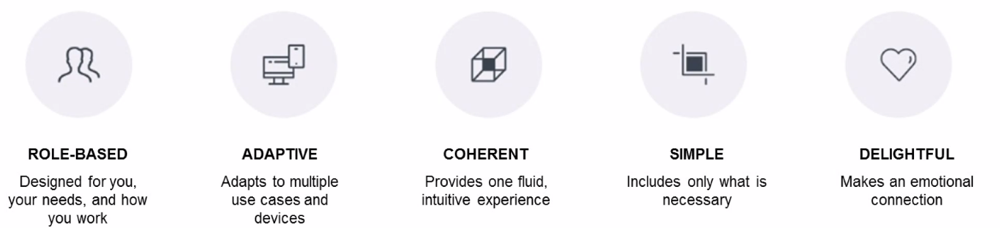
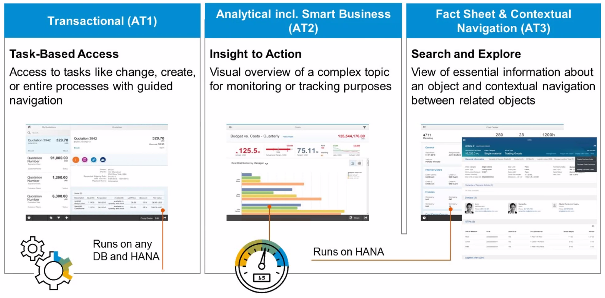
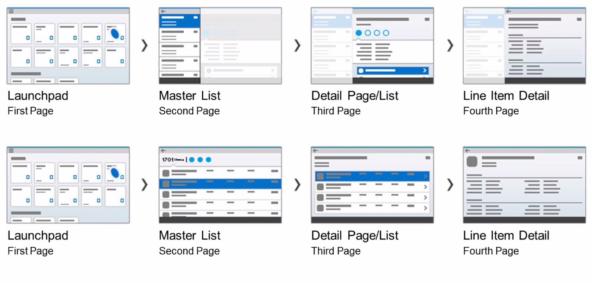
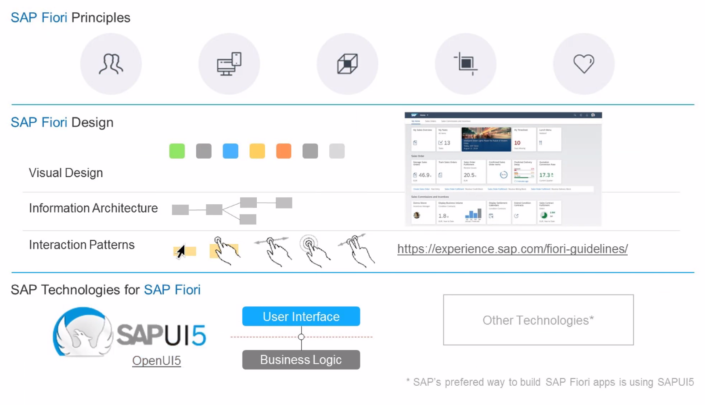

# UNIT 3. 

# Lesson1. 

* ## SAP Fiori Principles

  ### ROLE-BASED 

  ### ADAPTIVE

  ### CHERENT

  ### SIMPLE

  ### DELIGHTFUL

  

  

* ## APP Types

  

* ## Simple, Delightful and Intuitive ...

  

* ## From Technology to Design

  