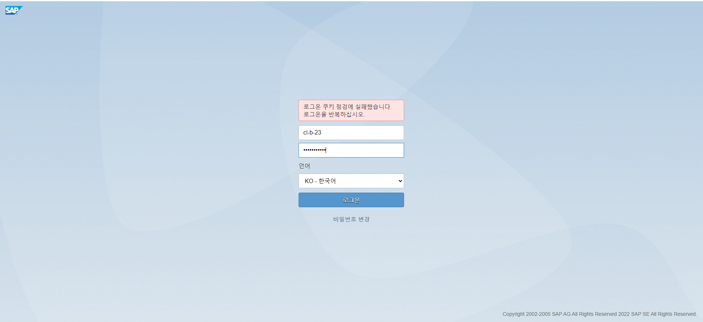
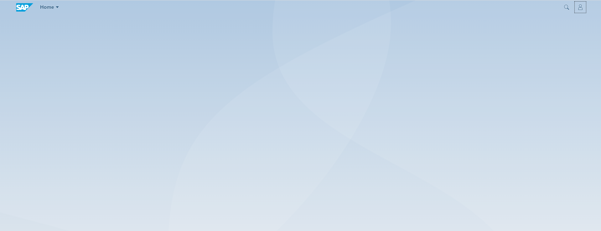

# UNIT 9. 

# Lesson 1. 

***/n/ui2/flp*** T-Code를 실행하는 경우 

https://edu.bgis.co.kr:8443/sap/bc/ui2/flp

로 이동하게 된다.

안되는 경우 C:\Windows\System32\drivers\etc 의 hosts 파일을 txt로 열어 마지막에 210.16.199.140 edu.bgis.co.kr을 추가하여 저장해준다.

이곳에 tile들이 들어가게 된다.

