# UNIT 4. Advanced Concepts

# Lesson 1. Defining CDS Views with Input Parameters

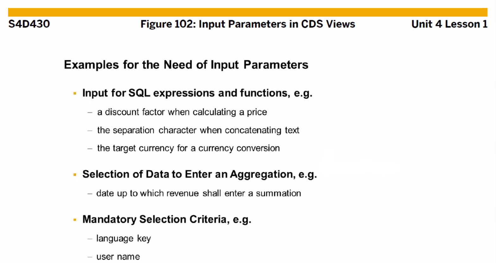

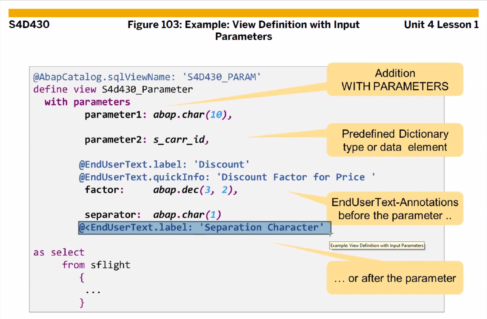

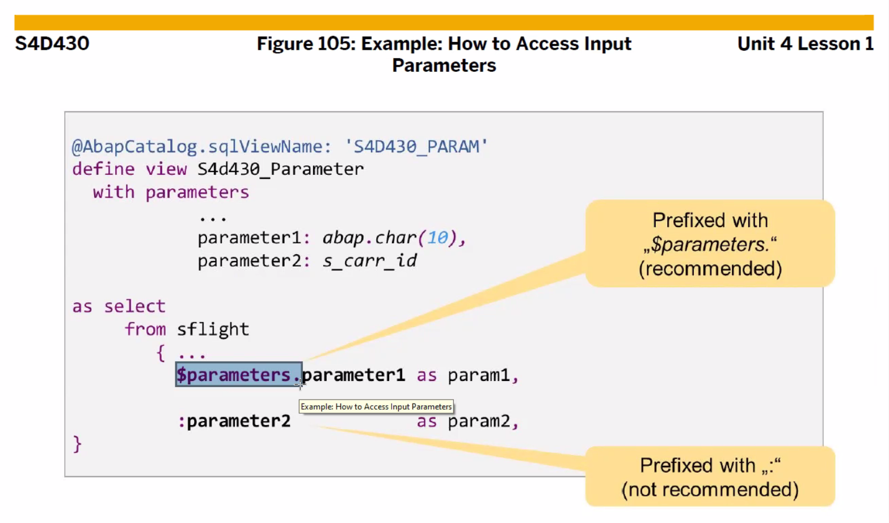

:을 사용하는 것은 권장하지 않는다. $parameters. 사용을 권장

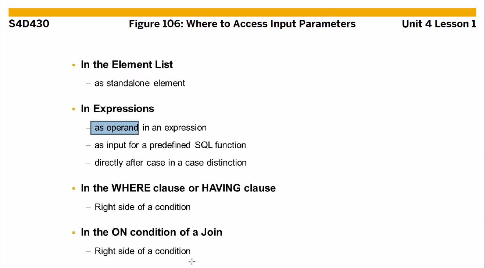

* ## CDS View vs ABAP Program

  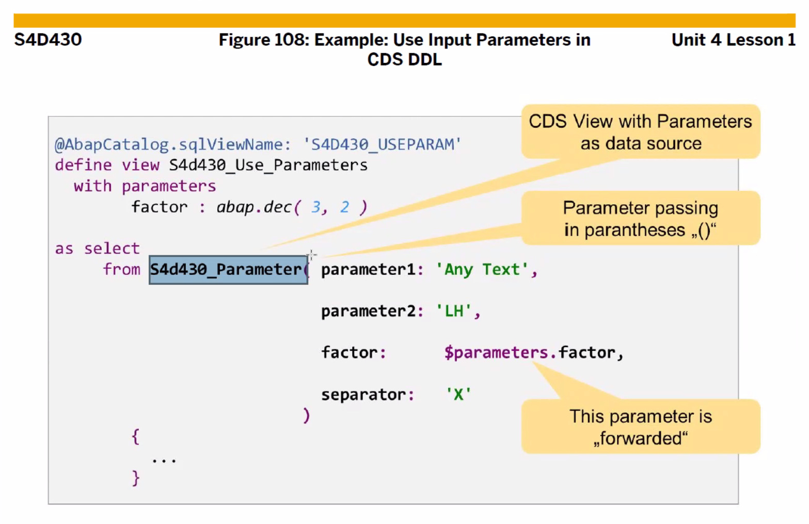

  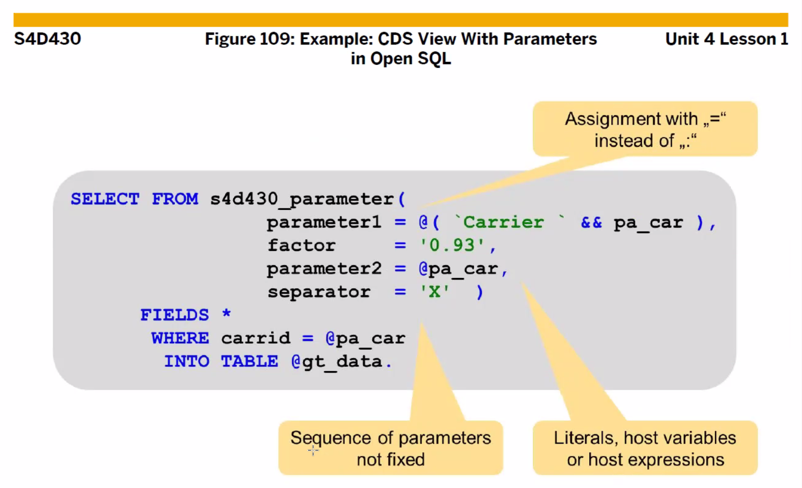

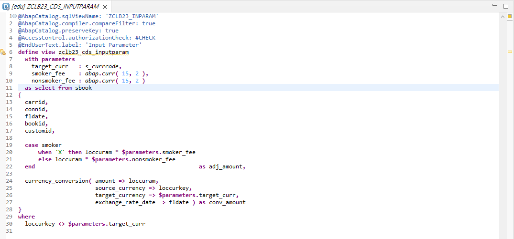

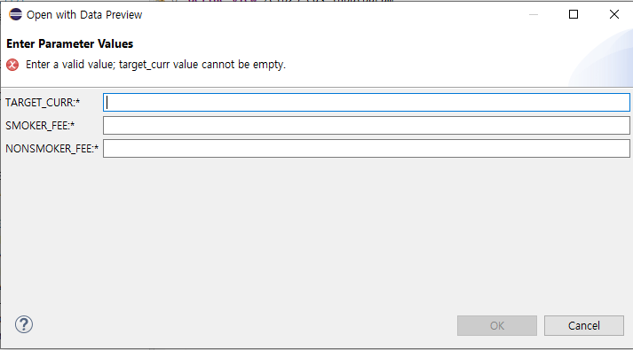

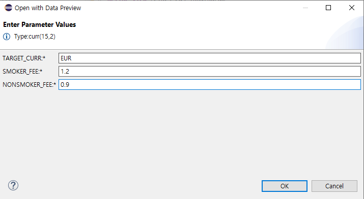

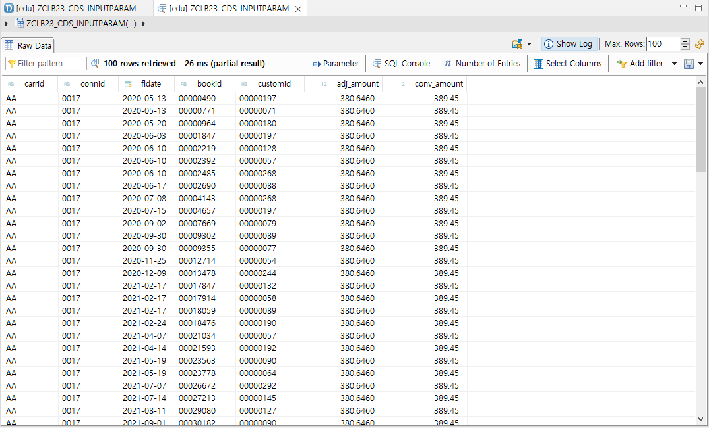

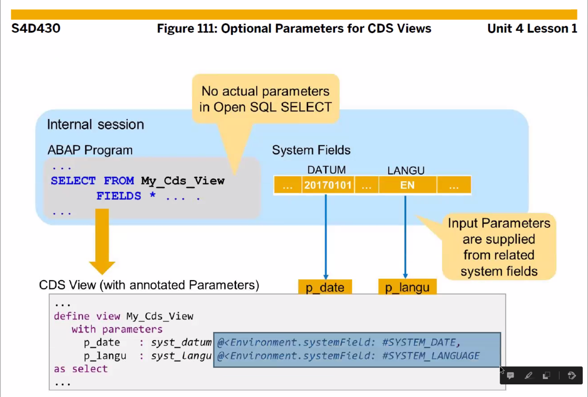

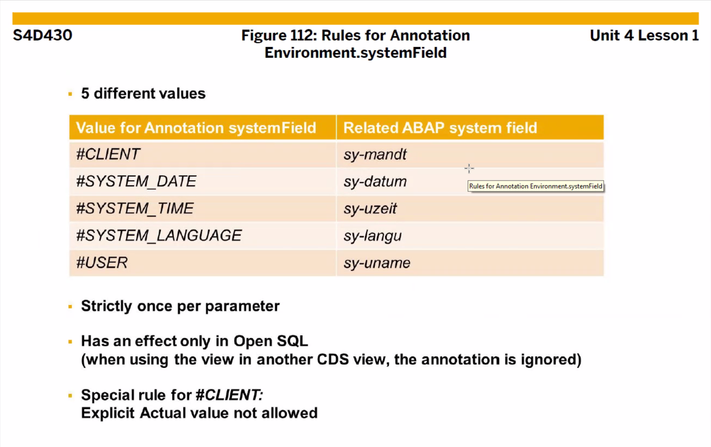

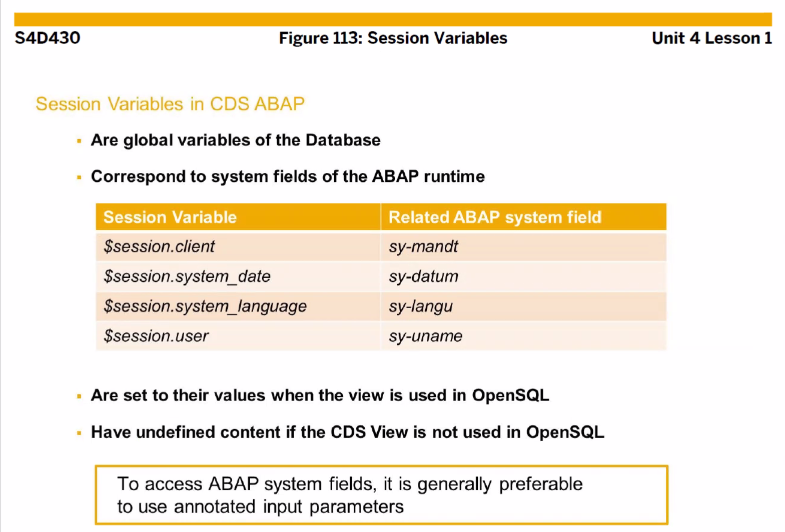

# Lesson 2. Building CDS Views with Associations

# Lesson 3. Enhancing a CDS view

# Lesson 4. Linking a CDS View with Authorization Rules

