# Unit 12. The Program Interface


# Lesson 1. Explaining User Interfaces


* ## User Interface Overview

  ### GUI Title

  

  ### GUI Status

  * #### Menu bar

  * #### Standard toolbar

  * #### Application toolbar

  * #### Key Setting

    * #### F1 Help

    * #### F2 Choose

    * #### F3 Back


## 


# Lesson 2. Setting a GUI Title and a GUI Status


* ## BACK EXIT CANC 버튼 만들기

  ```ABAP
  PROCESS BEFORE OUTPUT.
    MODULE status_0100.
  ```

  #### MODULE status_0100.

  ```ABAP
  *&---------------------------------------------------------------------*
  *& Module STATUS_0100 OUTPUT
  *&---------------------------------------------------------------------*
  *&
  *&---------------------------------------------------------------------*
  MODULE status_0100 OUTPUT.
    SET PF-STATUS '0100'.
    SET TITLEBAR  '0100'.
  ENDMODULE.
  ```

  PF-STATUS '0100'을 더블 클릭한다.

  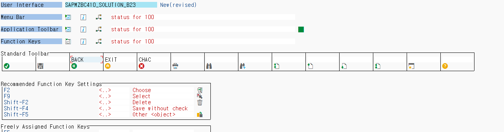

  

  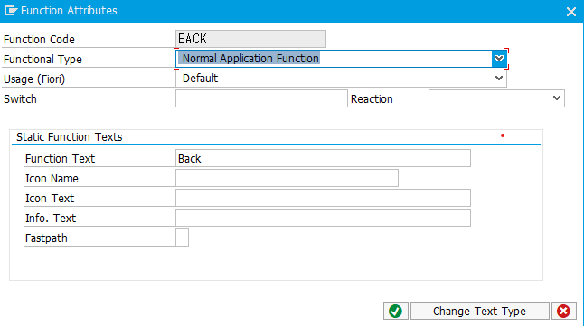

  BACK : Normal Application Function

  로 설정하고

  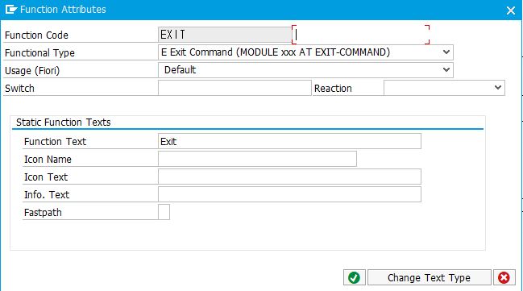

  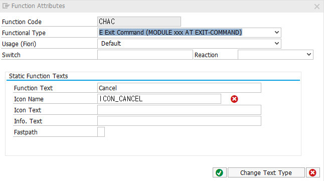

  EXIT, CANC: E Exit Command (MODULE XXX AT EXIT-COMMAND)

  로 설정한다.

  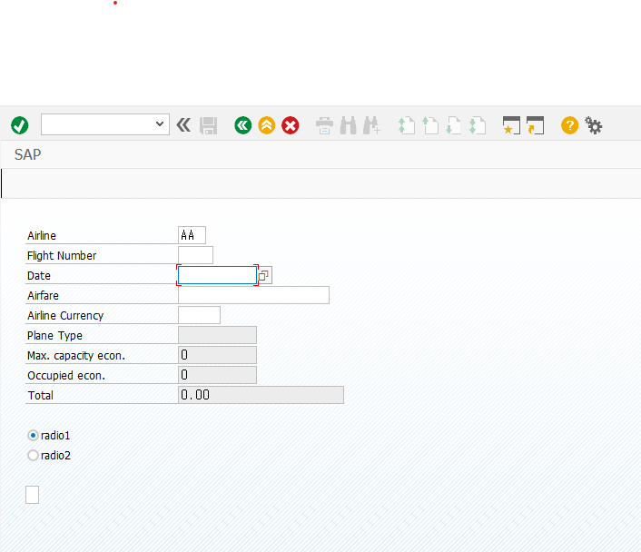

  버튼은 구현이 되었으나 아직 기능이 할당 되지 않은 상태이다.

  

  

  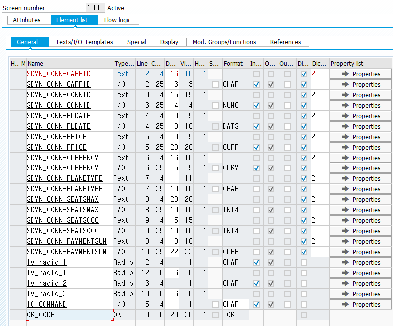

  스크린 100의 Element list에 ok_code변수를 추가해 주고

  #### TOP에 ok_code.를 TYPE sy-ucomm으로 선언하고        ***(user command)***

  #### SCREEN 100.

  ```ABAP
  PROCESS AFTER INPUT.
    MODULE exit AT EXIT-COMMAND.
    MODULE user_command_0100.
  ```

  ####  Module USER_COMMAND_0100.

  ```ABAP
  *&---------------------------------------------------------------------*
  *&      Module  USER_COMMAND_0100  INPUT
  *&---------------------------------------------------------------------*
  *       text
  *----------------------------------------------------------------------*
  MODULE user_command_0100 INPUT.
    CASE ok_code.
      WHEN 'BACK'.
        LEAVE TO SCREEN 0.  "set screen 0. leave screen.
    ENDCASE.
    CASE IO_COMMAND.
      WHEN 'T'.
        CALL SCREEN 101 STARTING AT 10 10
                        ENDING   AT 50 20.
        CLEAR IO_COMMAND.
    ENDCASE.
  ENDMODULE.
  ```

  #### MODULE exit.

  ```ABAP
  *&---------------------------------------------------------------------*
  *&      Module  EXIT  INPUT
  *&---------------------------------------------------------------------*
  *       text
  *----------------------------------------------------------------------*
  MODULE exit INPUT.
    CASE ok_code.
      WHEN 'EXIT'.
        LEAVE PROGRAM.
      WHEN 'CANC'.
        CLEAR: sdyn_conn.
        LEAVE TO SCREEN 0.
    ENDCASE.
  ENDMODULE.
  ```

  기존에 만들어둔 USER_COMMAND_0100. 와 EXIT-COMMAND METHOD에 위와 같은 프로그램을 버튼에 기능을 부여한다.

  EXIT 과 CANC는 EXIT-COMMAND에 구현하며 그이외의 버튼은 USER_COMMAND_0100에 구현한다.

  


* #### 설명

  MENU BAR								  ^

  APPLICATION TOOLBAR		   |

  FUNCTION KEY ASSIGNMENT  |

  기본적으로 BOTTOM UP 방식으로 아래에서 위의 순서로 구현한다.

  내가 누른 버튼을 시스템이 인식 하게 하기 위해서는 SCREEN의 ELEMENT LIST에 OK_CODE를 추가해 줘야하며 TOP에서 변수로 선언해 줘야한다.


* ## SET TITLEBAR

  

  #### PBO의 STATUS_0100 모듈의 SET TITLEBAR '0100'.를 더블 클릭한다.

  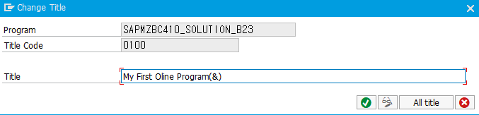

  #### 제목을 정해 준다. (&)에는 이후 우리가 정해주는 text element가 들어가게 된다.

  #### Module STATUS_0100.

  ```ABAP
  *&---------------------------------------------------------------------*
  *& Module STATUS_0100 OUTPUT
  *&---------------------------------------------------------------------*
  *&
  *&---------------------------------------------------------------------*
  MODULE status_0100 OUTPUT.
    SET PF-STATUS '0100'.
    SET TITLEBAR  '0100' WITH TEXT-001.
  ENDMODULE.
  ```

  #### Module STATUS_0100에 text element를 추가해주고

  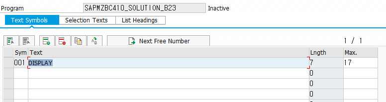

  #### 생성해 준다.

  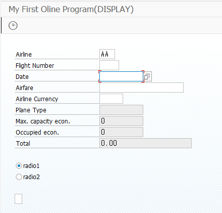

  #### 결과로 다음과 같이 제목이 변경된 것을 알 수 있다.

   

* ## Time Button 생성 및 Menubar에 추가

  #### Function Key에 F5키에 TIME을 할당해 주며  ICON을 선택해 주고 fastpath또한 T로 설정해 준다.

  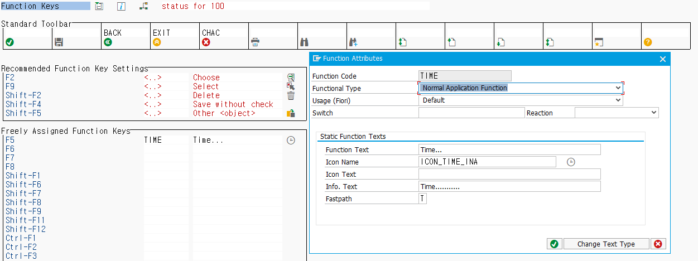

  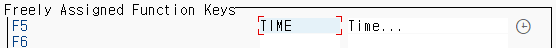

  #### 그러면 Function Key 에 위와 같이 추가되는 것을 확인할 수 있다.

  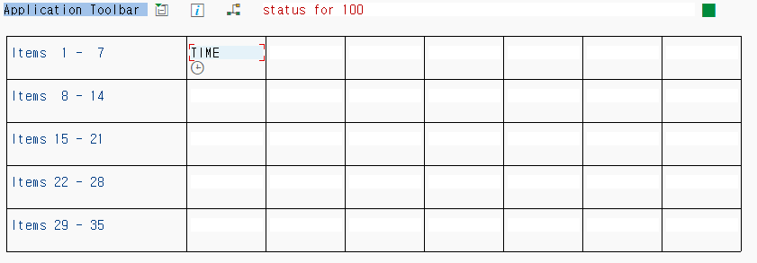

  #### 이후 Application Toolbar에 만들어둔 TIME 을 생성해 주고

  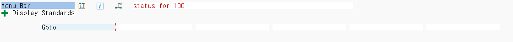

  #### Menu Bar에 Goto 메뉴를 생성해 준 후

  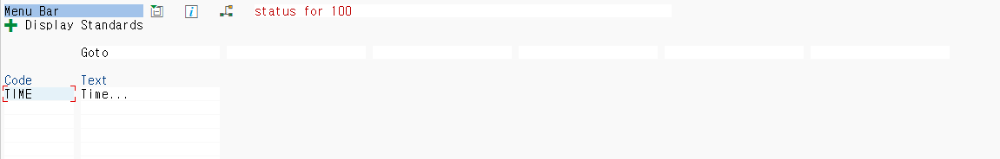

  #### 더블클릭하여 만들어둔 TIME을 넣어준다.

  #### 위 과정에서 만들어 줄때 우리는 TIME 버튼을 NORMAL APPLICATION FUNCTION 으로 만들어 주었다.

  #### 따라서 PAI 의 USER_COMMAND_0100 모듈에서 버튼 기능을 구현해 준다.

  #### Module  USER_COMMAND_0100.

  ```ABAP
  *&---------------------------------------------------------------------*
  *&      Module  USER_COMMAND_0100  INPUT
  *&---------------------------------------------------------------------*
  *       text
  *----------------------------------------------------------------------*
  MODULE user_command_0100 INPUT.
    CASE ok_code.
      WHEN 'BACK'.
        LEAVE TO SCREEN 0.  "set screen 0. leave screen.
      WHEN 'TIME'.
        CALL SCREEN 101 STARTING AT 10 10
                        ENDING   AT 50 20.
    ENDCASE.
    CASE IO_COMMAND.
      WHEN 'T'.
        CALL SCREEN 101 STARTING AT 10 10
                        ENDING   AT 50 20.
        CLEAR IO_COMMAND.
    ENDCASE.
  ENDMODULE.
  ```

  

  

  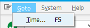

  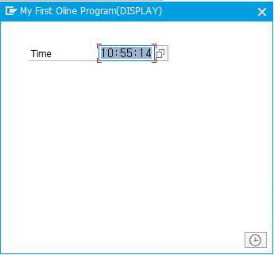

  원하는 데로 버튼이나 메뉴바에서 클릭시 101 screen 으로 이동하는 것을 볼 수 있다.

  
