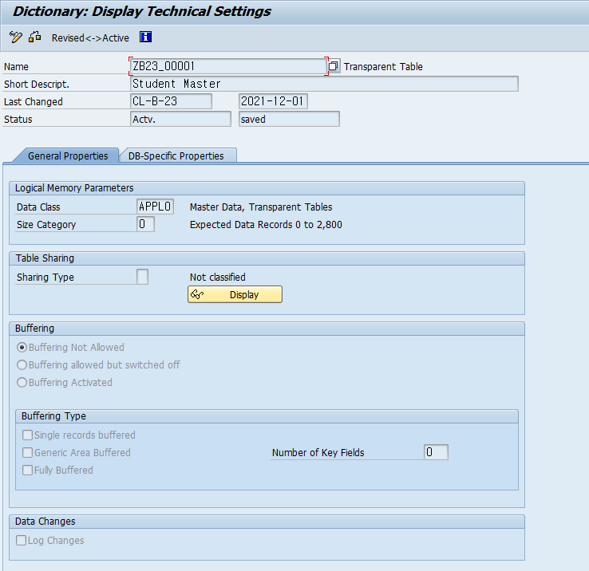

# Unit 3. Database Tables

# Lesson 1. Creating Transparent Tables

* ## Transparent Tables

  

  

  

  

  

  

  

  

  

* 

* ## SAP 에서의 데이터 저장

  | DATA |  =>  | DATA ELEMENT |  =>  |   DOMAIN    |
  | :--: | :--: | :----------: | :--: | :---------: |
  |      | 참조 | 의미적 정보  | 참조 | 기술적 정보 |

  **의미적인 정보와 기술적인 정보를 분리하여 저장 할 수 있다.** 

  **장점이 많다.**

  #### EX )

  CITYFROM 과 CITYTO 는 같은 DOMAIN S_CITY을 갖지만 DATA ELEMENT는 다르다.

  ##### DOMAIN은 하나를 잘 만들어 놓고 활용하며 DATA ELEMENT 는 의미에 따라 다양하게 만들어 사용한다.

  

* ## Transparent Tables and Structures

  Transparent Table과 Structure는 ABAP Dictionary에서 보면 타입 부분을 제외하면 같은 모양이다.

  하지만 Transparent Table은 물리적인 Database에 Table을 가지고 있으며 Structure는 그렇지 않다.

* ## Transparent Table 만들기

  

  

  

  

  #### 체크해 줄시 입력되지 않았을때의 해당 field의 type에 맞는 초기값으로 입력해준다.

  

  

  

  

  CBO 기업에서 필요에 따라 만드는 테이블

  

  #### 누가 언제 몇시에 수정했는지를 저장할 Structure을 생성한다.

  #### UNAME - USER ID

  #### DATUM - 시스템 날짜

  #### UZEIT - 시스템 시간

  ### 오류가 발생한다. WHEN : 예약어

  

  #### 이름을 바꿔준다.

  

* ## Technical Settings for Transparent Tables

  

  

  * ### Data Class

    

    

    #### Master Table (APPL0)

    한번 데이터가 만들어지면, 거의 수정, 삭제, 변경이 되지 않는 성격의 내용

    #### Transaction Table (APPL1)

    시스템을 운영하면서 빈번하게 입력, 수정, 삭제가 발생하는 내용

    #### Customizing Table (APPL2)

    시스템 설정에 관련된 내용

    #### EX )

    학생 TABLE => APPL0

    성적 TABLE => APPL1

    

  * ### Size Category

    테이블을 만들자 마자의 기본 크기를 결정하는 것이 아니다

    테이블이 꽉 차서 늘려야 하는 경우에 적용된다.

    

    

  

  ### Buffering은 이후 내용에서 추가한다.(Buffer table) 

  ### LOGGING 잘 사용하지 않는다.  접속 내용 관련

  

  

* ## Table Fragmentation in the Database

  Fragmentation을 최소화 하기 위해서는 Data Class를 잘 지정해야한다.

  Fragmentation을 최소화 하

최소한 Master Data / Organizational Data / Transaction Data class를 구분 할 수 있어야 한다.

시스템 설정 = Customizing

# Lesson 2. Defining Cluster Tables and Pooled Tables

* ## Cluster Tables and Pooled Tables

  과거에는 Cluster Tables and Pooled Tables Transparent Tables 세가지가 있었다.

  지금은 Transparent Tables 로 통일

  

  

  

  skip

  

  