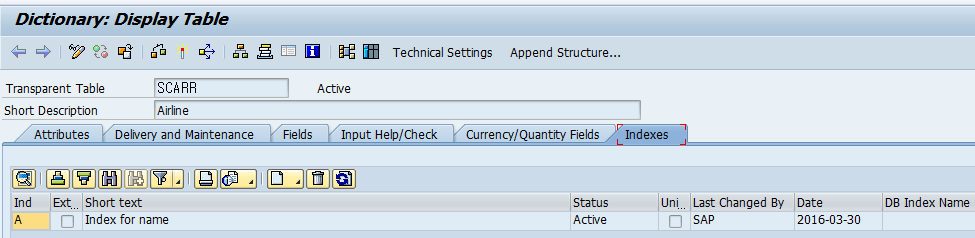
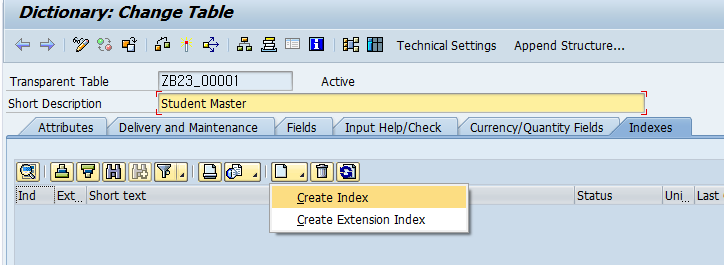
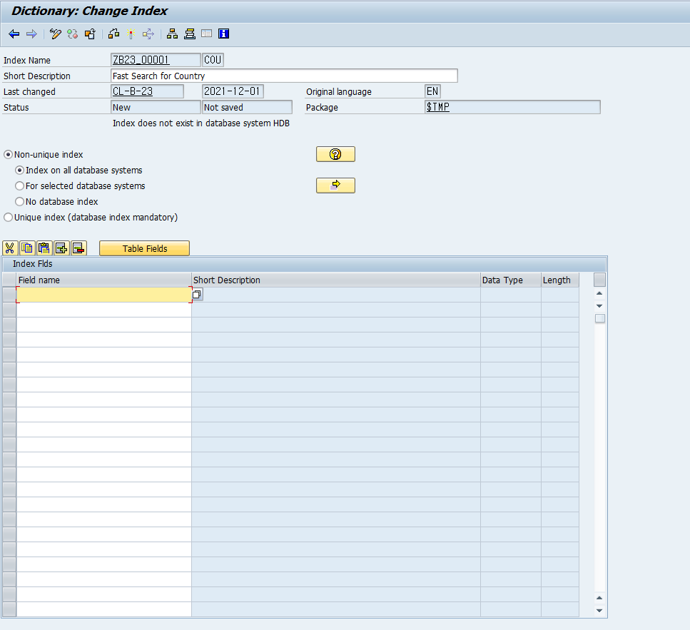
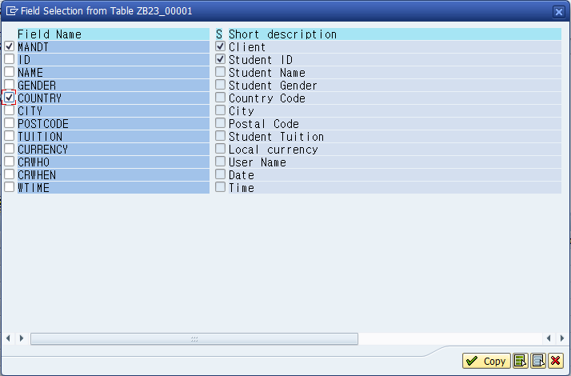
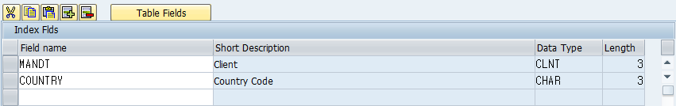
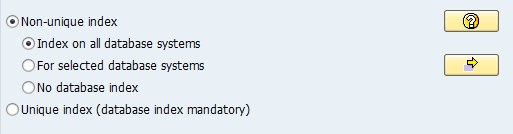
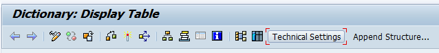
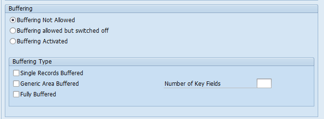

# Unit 4. Performance During Table Access


# Lesson 1. Creating Database Table Indexes

### Primary Index 이름

* ## Index 종류

  ### Primary Index

  * 테이블 설계시 Key 설정하면 자동으로 생성됨

  * #### 이름 : <table명>~0 

  ### Secondary Index

  * 필요에 따라 Manual 하게 생성해야함.

  * #### 이름 : <table명>~<작명> 

    

  ### Secondary Index 확인

  

  

  * scarr의 secondary index의 이름은 SCARR~A 이며 CARRNAME이다.


* ## Index를 통한 탐색

  ```ABAP
  *&---------------------------------------------------------------------*
  *& Report ZB23_00032
  *&---------------------------------------------------------------------*
  *&
  *&---------------------------------------------------------------------*
  REPORT zb23_00032.
  
  DATA: gt_student TYPE TABLE OF zb23_00001,
        gw_student LIKE LINE  OF gt_student.
  
  SELECT SINGLE *
    INTO gw_student
    FROM zb23_00001
    WHERE id = '4'.
  
  WRITE:/ gw_student-name.     "인덱스를 탄다 Primary key이기 때문이다.
  
  PARAMETERS p_land TYPE zb23_00001-country.
  
  * 화면에서 입력 받은 국가의 학생을 취득하고 싶다.
  
  SELECT *
    INTO TABLE gt_student
    FROM zb23_00001
    WHERE country = p_land.     "인덱스를 타지 않는다. 탐색 속도가 느리다. 
                                "국가를 통한 검색이 많을 경우 개선을 위해 국가를 Secondary Index로 정해준다.
                                
  LOOP AT gt_student INTO gw_student.
    WRITE:/ gw_student-name, gw_student-country, gw_student-city.
  ENDLOOP.
  ```


* ## Secondary Index 생성

  

  

  

  

  

  * ### Non-Unique Index 

    해당 인덱스의 데이터가 중복이 있다.

    * #### Index on all database systems

      모든 환경에서 만들어라

    * #### For selected database systems

      특정 환경에서만 만들어라

    * #### No database index

      만들지는 않고 설계만 할것이다.

  * ### Unique Index

    해당 인덱스의 데이터가 중복이 없다.


# Lesson 2. Setting Up Table Buffering


* ## Database Interface의 역할

  Open SQL을 Native SQL로 번역해준다.

  MANDT를 정해준다.

  한번 탐색한 데이터를 Buffer에 저장해 준다.


* ## Buffer의 종류

  * ### Full Buffering

    데이터가 몇건이 리턴되던 심지어 리턴된 값이 없어도 리턴된 내용 뿐 아니라 모든 내역을 Buffer에 올리겠다.   

    * ## 의미차이 확인 이부분 다시

  

  * ### Generic Buffering

    

    Number of Key Field ( Generic Key 개수 ) 를 반드시 지정해야 함.  수는  (Primary Key 개수) - 1 이하로 지정할 수 있다.

    Generic Key 

    ```ABAP
    SELECT * FROM SPFLI WHERE CARRID = 'AA' AND CONNID = '0017'.
    
    ```

    이 경우 Generic Key가 2인 경우 MANDT = '100' 이고 CARRID = 'AA' 인 모든 데이터를 Buffer에 올린다.

  * ### Single-record Buffering

    검색된 데이터가 한건인 경우 Buffer에 올리겠다. **(SELECT SINGLE 만 !!!)**

    SELECT SINGLE이 아닌 경우에는 검색된 데이터가 한건 이어도 Buffer에 올리지 않는다.


* 

  

  

  

  ### Buffering Not Allowed

  수행안함

  ### Buffering allowed but switched off

  설계만 하고 활성화 안함

  ### Buffering activated

  수행함


* ## Buffer Synchronization

  sap 는 삭재를 하면 Synchronization Table에 기록을 한다. => Application Server 2도 JL을 삭재된 것을 알 수 있다.

  Buffer 의 불일치를 막기 위한 Synchronization

  

  

  

  Synchronization 이벤트 시간이 짧으면 sap 시스템에 부화가 오지만 불일치를 확실히 막을 수 있다.

  시간이 길면 sap 시스템에 부화를 줄일 수 있지만 불일치가 일어날 확률이 높아진다.


* ## Decision Tree for Buffering 

  버퍼의 종류를 결정할 때 도움을 줄 수 있다.

  |      |      |      |
  | ---- | ---- | ---- |
  |      |      |      |
  |      |      |      |
  |      |      |      |
  |      |      |      |
  |      |      |      |

  


