# Unit 9. Search Helps

# Lesson 1. Creating Search Helps

Selection Method를 통해 데이터를 가져올 수 있으며 여기에는 table이나 view가 들어간다.

데이터를 보여주는 방식을 선택할 수 있다.

Dialog depends on set of values

Dialog3

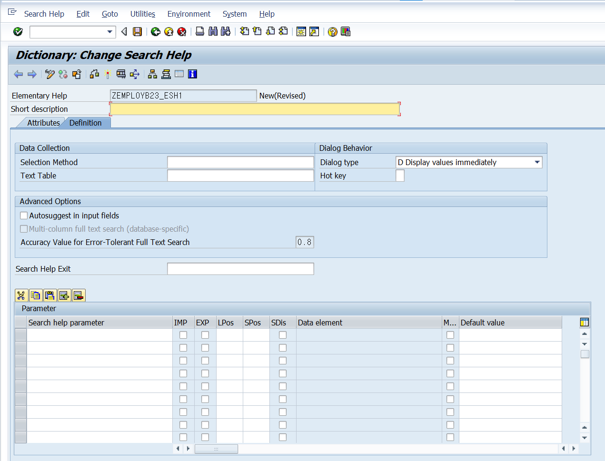

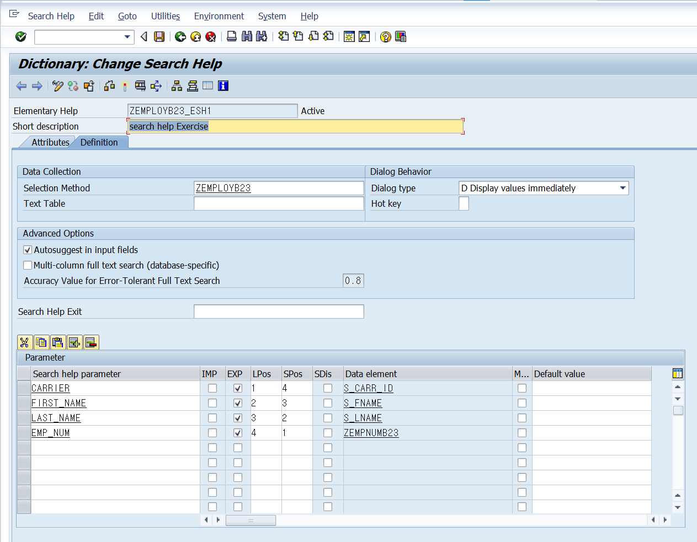

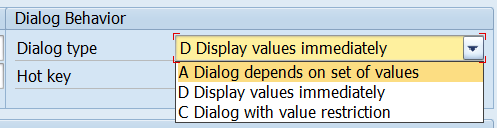

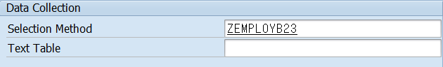

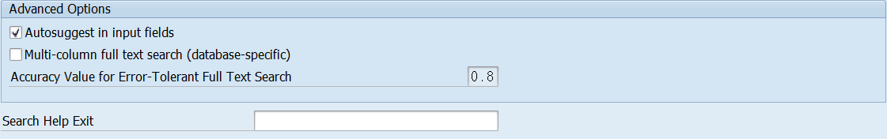

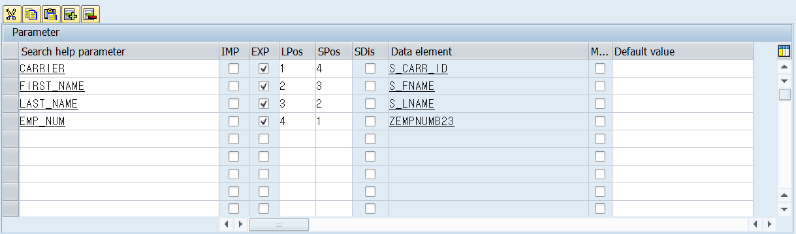

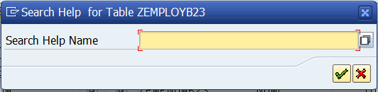

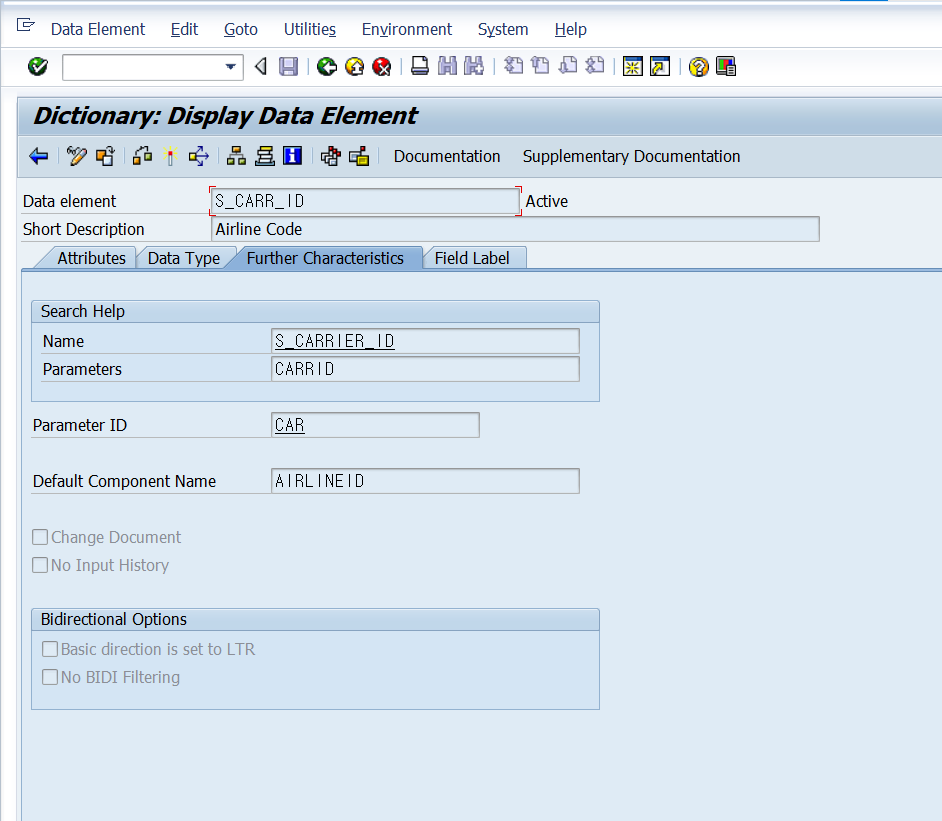

DATA ELEMENT 의 Further Characteristics 에서 Search Help를 설정할 수 있다.

* ZSPFLIB23_1 TABLE 만들기 : SPFLI TABLE 카피
* DATA ELEMENT 만들기 -> 만들어둔 SEARCH HELP 달기
* CHECK TABLE 만들기 -> ZSPFLIB23_CHK -> FOREIGN KEY RELATION SHIP (SCARR 테이블과) -> SEARCH HELP 바뀐 것 확인 (SCARR의 내용이 뜬다.)
* SEARCH HELP COPY -> ZSHEB23_SPFLI_1 (RESTRICTION)
* CHECK TABLE : MORE -> EXTRAS -> SEARCH HELP FOR TABLE 통해 CHECK TABLE 달기 : 2번째 SEARCH HELP 탑재
* ZSPFLIB23_1 테이블에서 FOREIGN KEY RELATION 잡기: ZSPFLIB23_CHK 로 잡기 : SEARCH HELP가 본 테이블이 아닌 CHECK TABLE의 2번째 것이 뜬다.  

* ## Performance of the Input Help

  

  

  

* ## View as Selection Method of a Search Help\

  

  

  

  

* ## Alternative Displays of the Input Help

  * ### Input Help Control (amodal)

    팝업창이 떴을때 다른 창을 컨트롤 할 수 있다.

  * ### Dialog (modal)

    팝업창이 떴을때 팝업창을 해결한 후에 기존 창을 컨트롤 할 수 있다.

  * ### Listbox

    

# Lesson 2. Applying Advanced Search Help Techniques

* ## Collective Search Helps

  이용자에 따라 각기 다른 Search Help를 만들 수도 있지만

  

  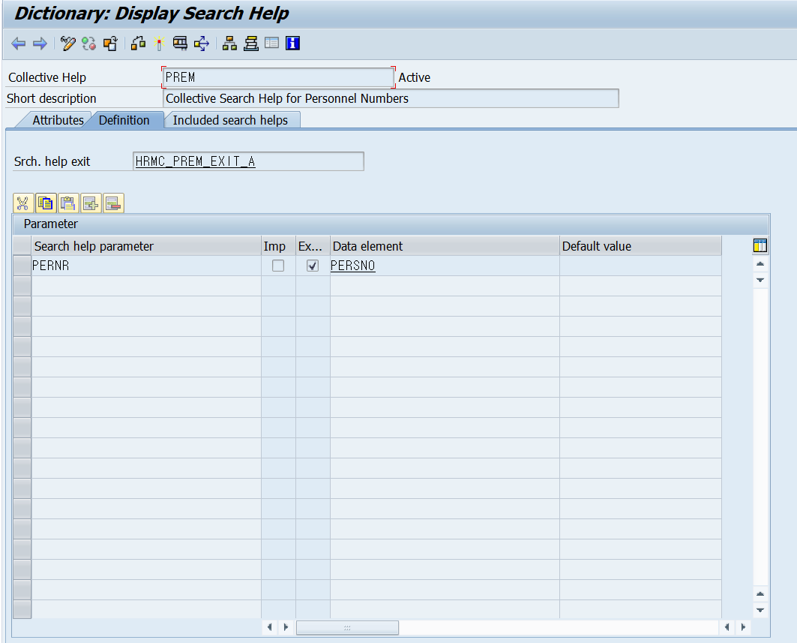

  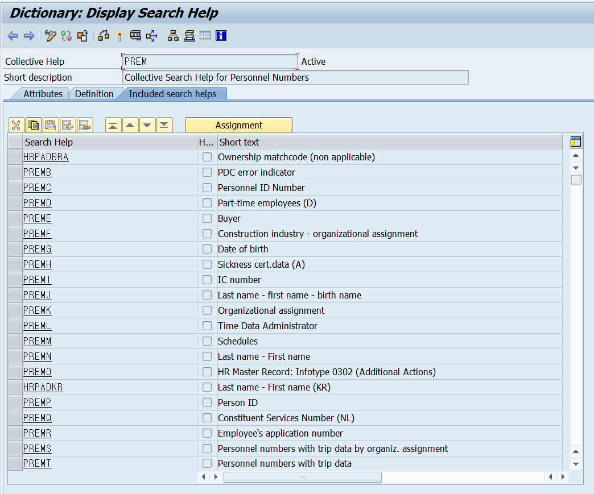

  하나의 Search Help 를 위해 다양한 Search Help 를 담아둘 수 있다.

  

  

  

  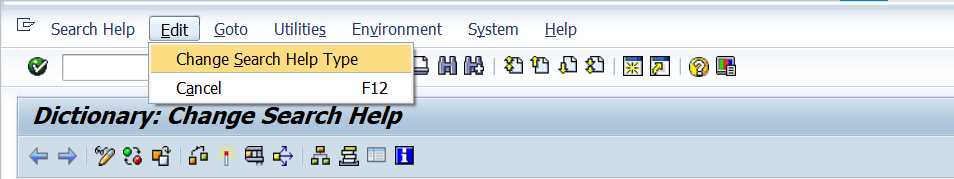

  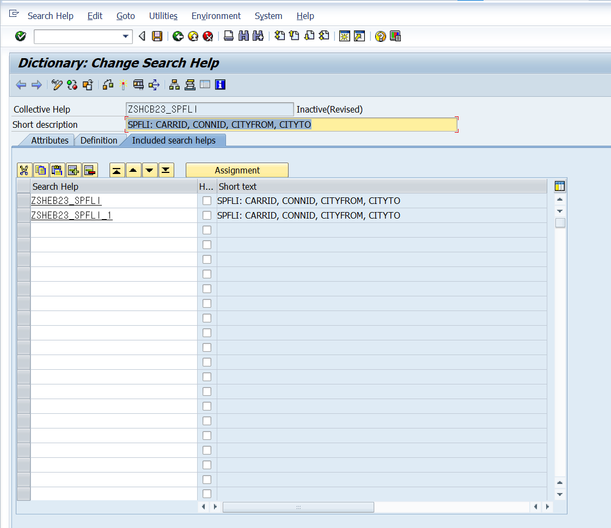

  

  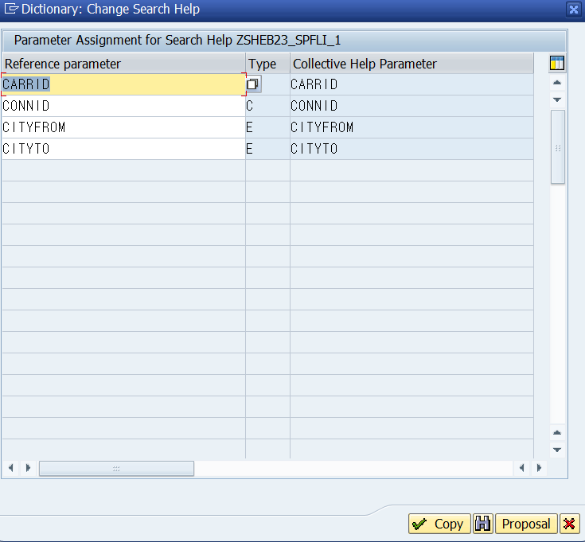

  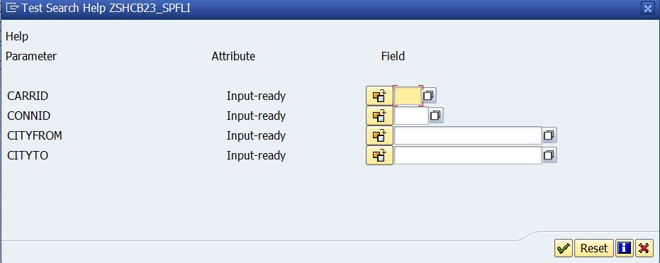

* ## Append Search Helps

  

