# Unit 11. Introduction to Screen Programming


# Lesson 1. Explaining th User Dialog Programming Model

MainScreen 100 200 300

SubScreen 110 120 130

PopScreen 101 102 103

* ## ABAP Program Types

  ### TYPE 1 Executable Program 

  

  ### TYPE M Module Pool

  * 트랜잭션 코드를 만들어야 실행이 가능하다. SAPM Z/Y

  * Top INCL를 체크하고 만든다.

  

  ### TYPE F Function group

  ### TYPE J Interface pool

  ### TYPE K Class pool

  ### TYPE I Include program

  단독적으로는 실행이 불가능하다.

  

  

* ## Program Organizatioin

  모듈풀 프로그램은 스크린 단위로 움직인다.

  ### Include 

  * Include 프로그램을 만들때는 MZ 을 앞에 붙인다.

  

  #### Global declaration

  #### Events

  #### Form routines

  #### PAI module

  Process After Input 스크린이 뜬 이후 작동할 로직을 저장한다.

  #### PBO module

  Process Before Output

  

  

  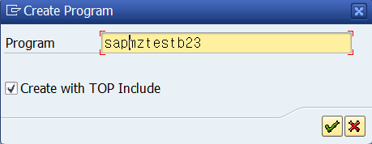

  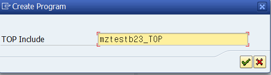

  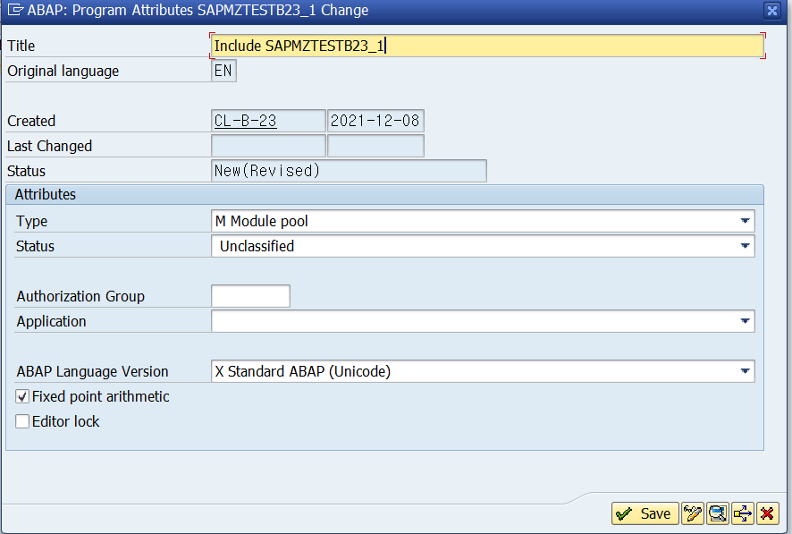

  

  

  ```ABAP
  *&---------------------------------------------------------------------*
  *& Module Pool      SAPMZTESTB23
  *&---------------------------------------------------------------------*
  *&
  *&---------------------------------------------------------------------*
  
  INCLUDE MZTESTB23_TOP                           .    " Global Data
  
  INCLUDE MZTESTB23_O01                           .  " PBO-Modules
  INCLUDE MZTESTB23_I01                           .  " PAI-Modules
  INCLUDE MZTESTB23_F01                           .  " FORM-Routines
  ```

  주석을 푼 후 각 program들을 더블 클릭하여 생성하여 활성화한다.


# Lesson 2. Introducing Screen Programming


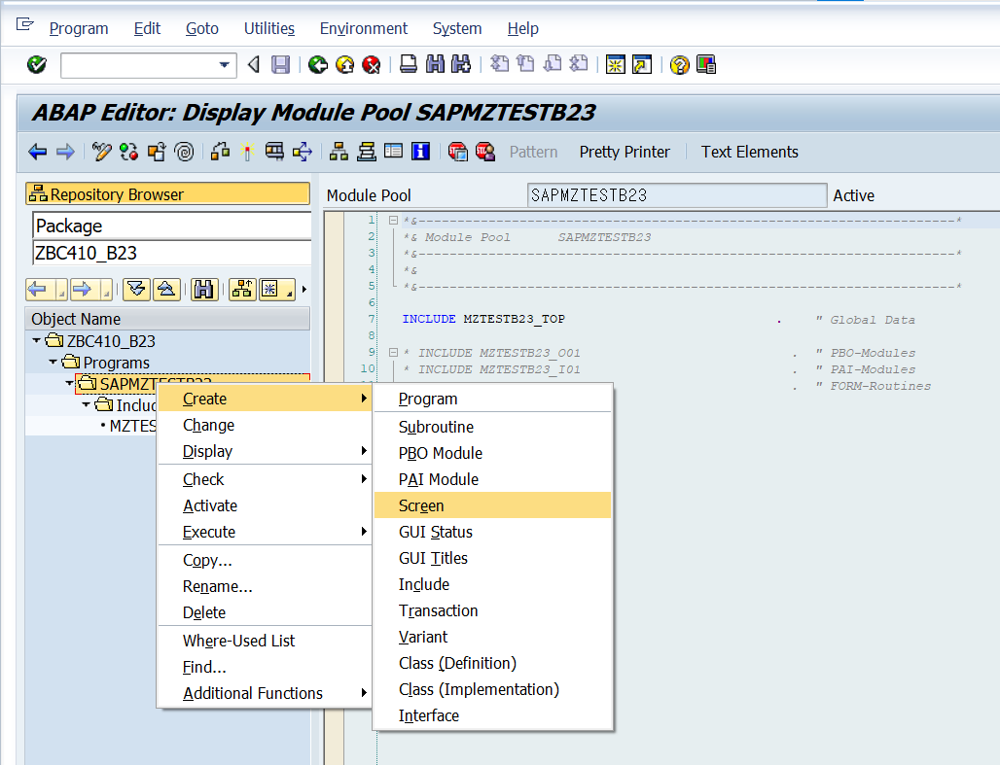

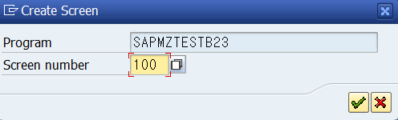

* ## Attributes of Screen Elements

  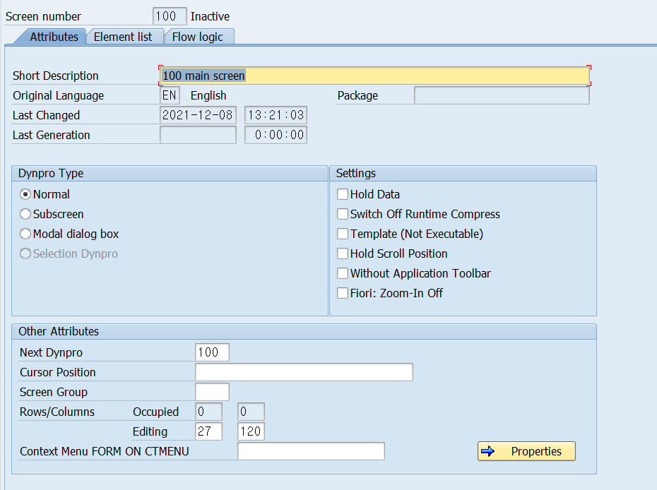

  ### Admin.

  * Program

  * Screen no.

  * Short desc.

  * Screen Group

  * Status

  * Original Lang.

    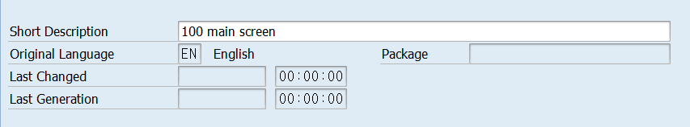

  ### Type 

  * Normal

  * Subscreen

  * Modal dialog box

  * Selection screen

    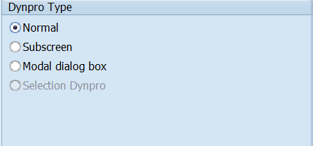

  ### Size

  * Static
    * Maintained
    * Occupied
  * Dynamic
    * Starting at
    * Size

  ### Sequence

  * Next screen

  ### Settings

  * Cursor position

  * Hold data

  * Runtime compression

  * Context menu

  * Hold scroll position

  * W/o Applic. Toolbar

    

    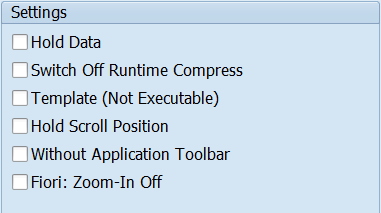

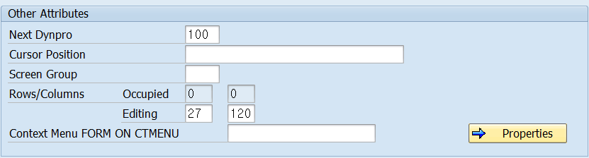

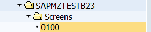


* ## Transaction 만들기

  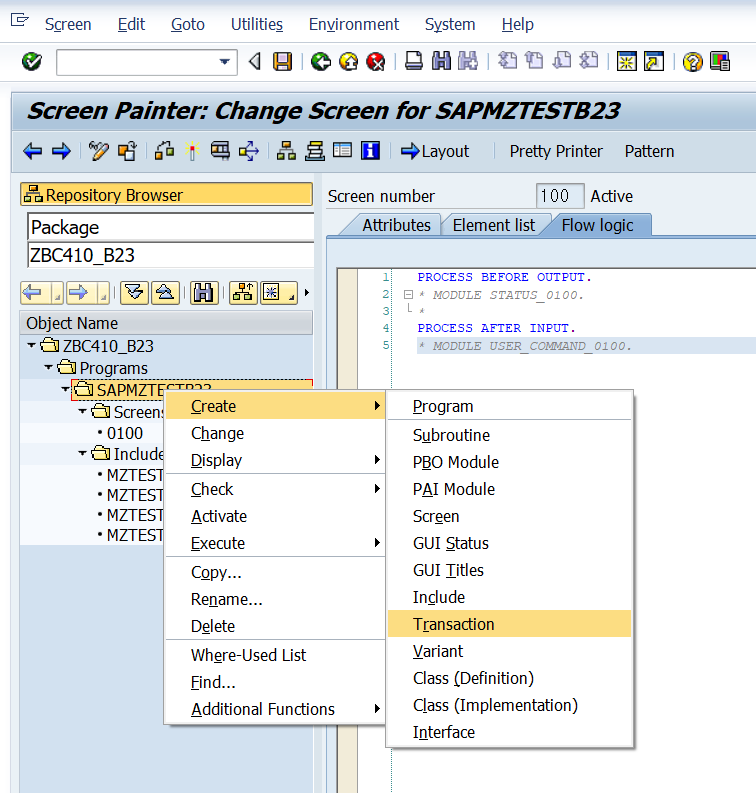

  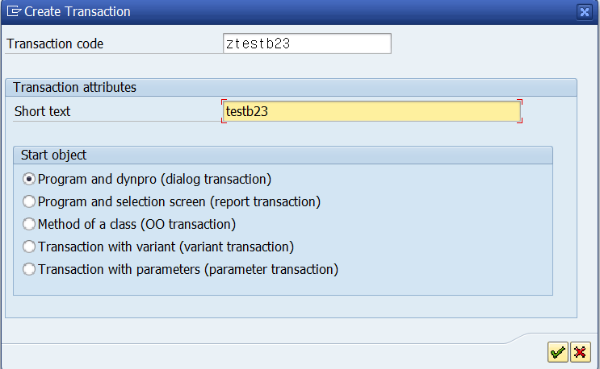

  #### 트랜잭션의 이름은 z나 y로 시작해야한다.

  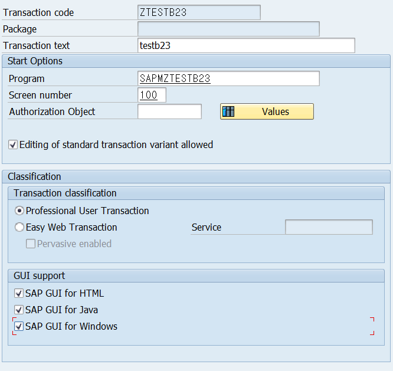

  #### Screen number에 만들어둔 screen number를 넣는다.

  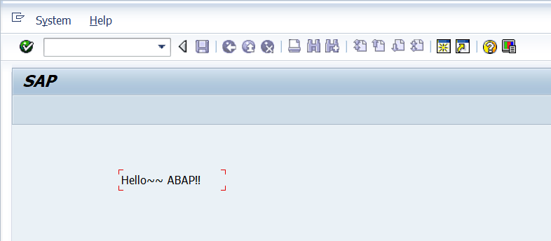

  #### 트랜잭션을 입력하면 이전에 만들어둔 화면으로 연결되는 것을 볼 수 있다.

  #### 트랜잭션을 만들어 줘야 실행 가능하다.

  


# Lesson 3. Creating Screens and screen Elements


* ## Creating Screens

  * ### Screen Attributes

    Screen no. 100

    Short description ___

    Screen type normal

    Next screen ###

    ...

    설정

  * ### Screen Layout

    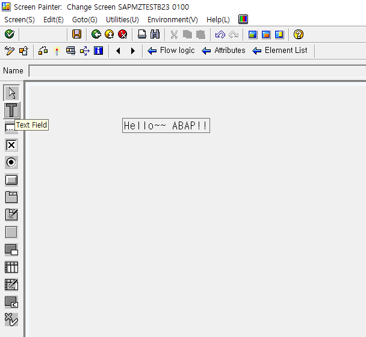

  * ### Element Attributes

    

  * ### Flow logic


* ## Screen Layout

  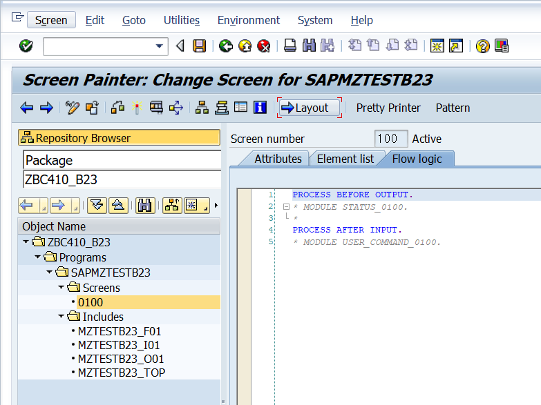

  

  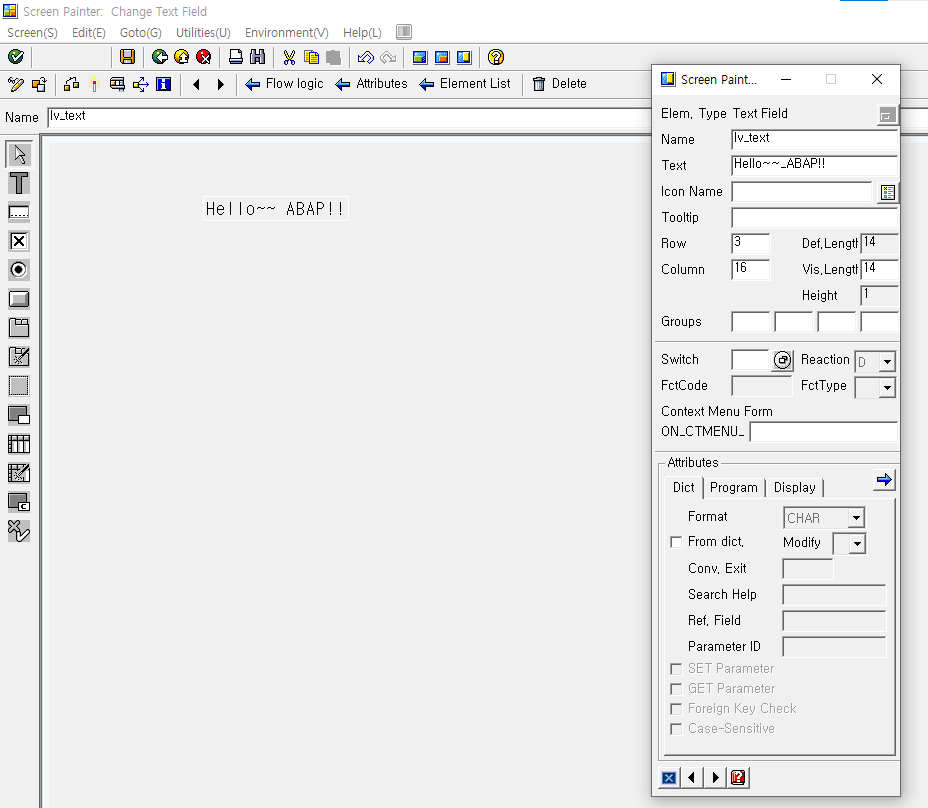

  * ### ABAP Dictionary에서 가져오기

  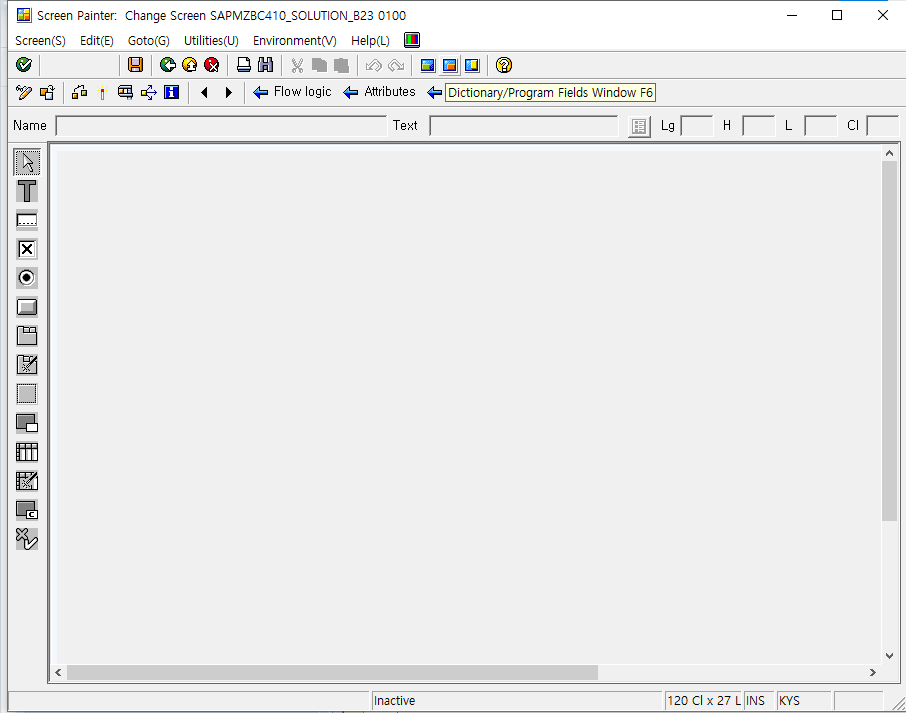

  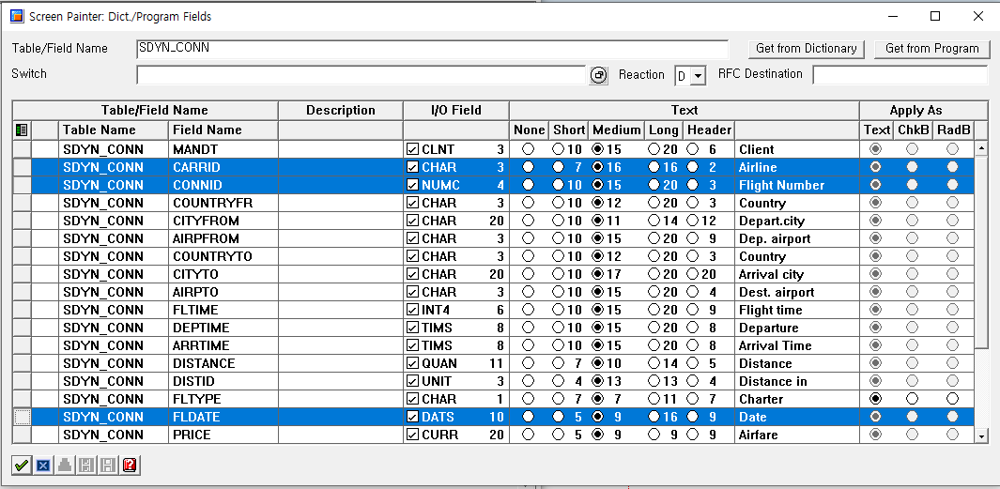

  #### 원하는 테이블이나 필드명을 입력후 ***Get from Dictionary*** 를 누른후 원하는 필드들을 클릭후 확인버튼을 누른다.

  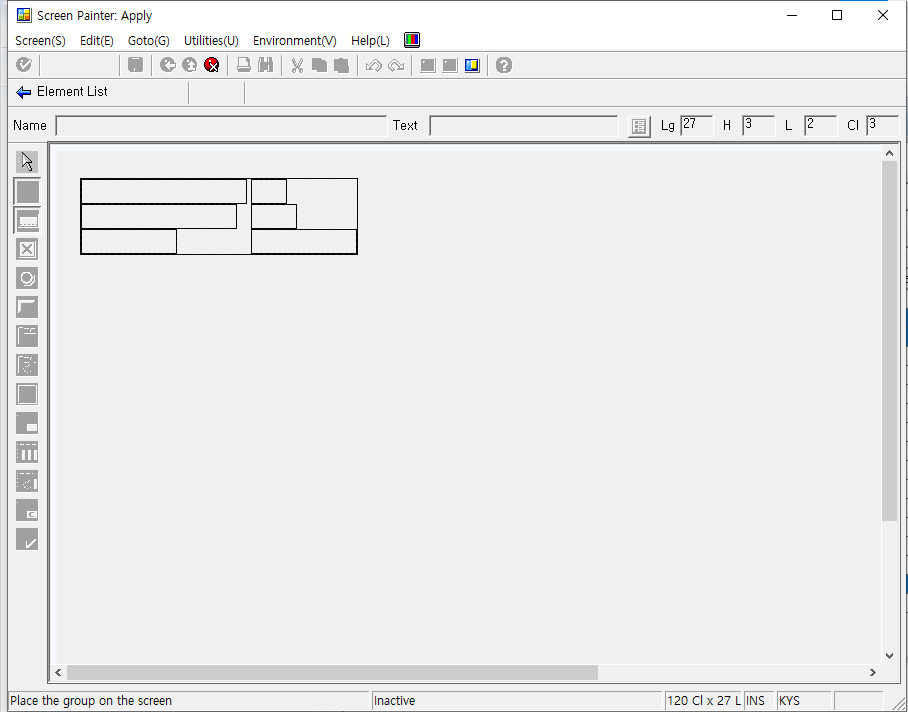

  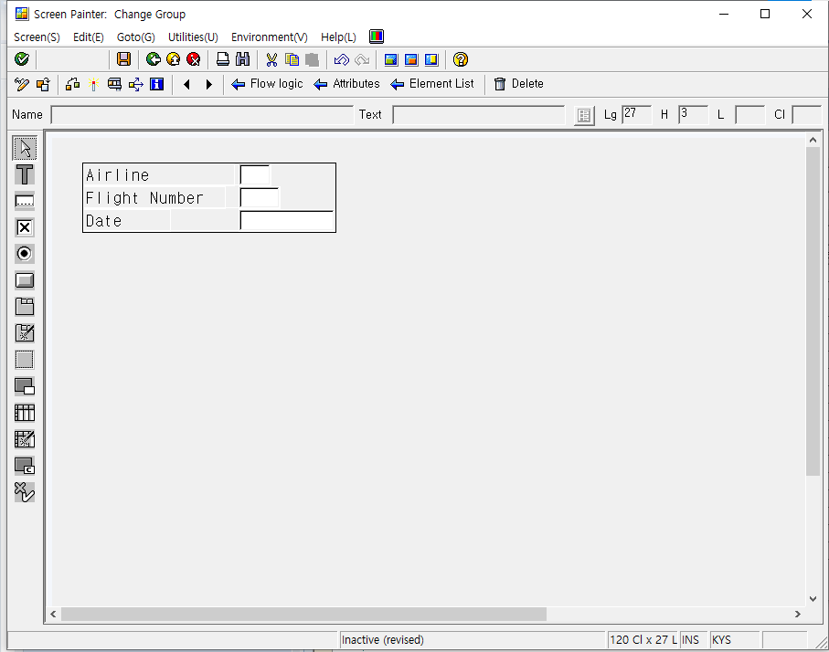

  #### 커서로 위치를 잡아준다.


* ## Maintain Attributes with Element List

  

  

  

* ## Flow Logic of Screens

  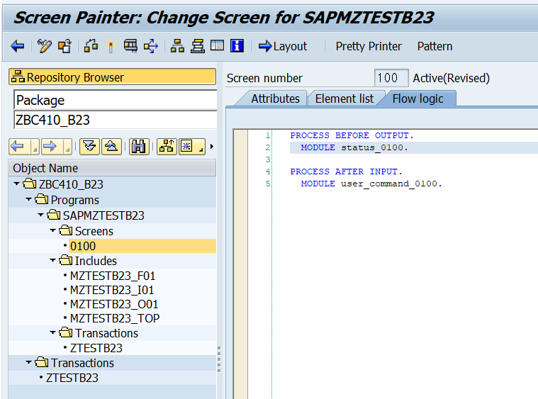

  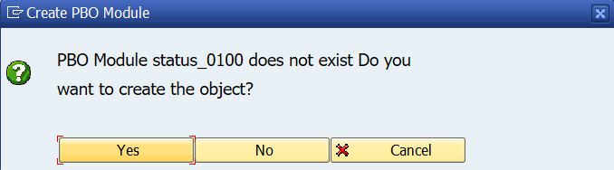

  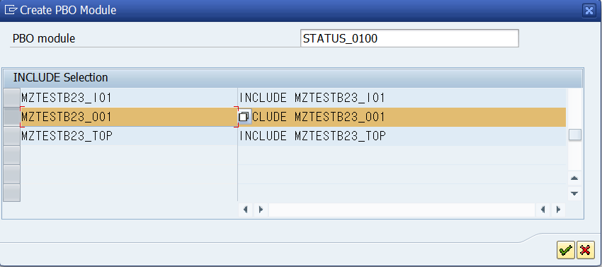

  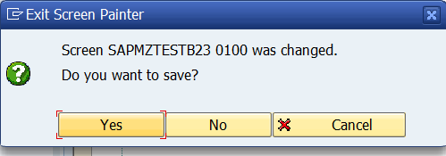

  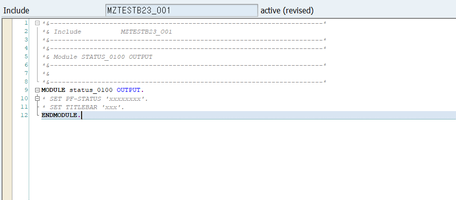


## 


* ## Data Visibility   중요!!!

  ABAP 로직과 DYNP에서의 이름이 같아야한다. **Identical names**


* ## SET GET PARAMETERS


## 


* ## Excercise

  SAPMZBC410_SOLUTION_B23

  ```ABAP
  *&---------------------------------------------------------------------*
  *& Module Pool      SAPMZBC410_SOLUTION_B23
  *&---------------------------------------------------------------------*
  *&
  *&---------------------------------------------------------------------*
  
  INCLUDE mztestb23top                            .    " Global Data
  
  INCLUDE mztestb23o01                            .  " PBO-Modules
  INCLUDE mztestb23i01                            .  " PAI-Modules
  INCLUDE mztestb23f01                            .  " FORM-Routines
  ```

  MZTESTB23TOP

  ```ABAP
  *&---------------------------------------------------------------------*
  *& Include MZTESTB23TOP                             - Module Pool      SAPMZBC410_SOLUTION_B23
  *&---------------------------------------------------------------------*
  PROGRAM SAPMZBC410_SOLUTION_B23.
  
  TABLES: sdyn_conn.
  DATA: wa_sflight TYPE sflight.
  ```

  SCREEN 0100

  ```ABAP
  PROCESS BEFORE OUTPUT.
    MODULE get_sflight.
    MODULE move_to_dynp.
  
  
  PROCESS AFTER INPUT.
    MODULE check_sflight.
  ```

  MZTESTB23O01

  ```ABAP
  *&---------------------------------------------------------------------*
  *& Include          MZTESTB23O01
  *&---------------------------------------------------------------------*
  *&---------------------------------------------------------------------*
  *& Module MOVE_TO_DYNP OUTPUT
  *&---------------------------------------------------------------------*
  *&
  *&---------------------------------------------------------------------*
  MODULE move_to_dynp OUTPUT.
    MOVE-CORRESPONDING wa_sflight TO sdyn_conn.
  ENDMODULE.
  *&---------------------------------------------------------------------*
  *& Module GET_SFLIGHT OUTPUT
  *&---------------------------------------------------------------------*
  *&
  *&---------------------------------------------------------------------*
  MODULE get_sflight OUTPUT.
    SELECT SINGLE *
      FROM sflight
      INTO CORRESPONDING FIELDS OF wa_sflight
     WHERE carrid = sdyn_conn-carrid
       AND connid = sdyn_conn-connid
       AND fldate = sdyn_conn-fldate.
  
      CHECK sy-subrc <> 0.
      CLEAR: wa_sflight.
      MESSAGE i007(bc410).
  
  ENDMODULE.
  ```

  MZTESTB23I01

  ```ABAP
  *&---------------------------------------------------------------------*
  *& Include          MZTESTB23I01
  *&---------------------------------------------------------------------*
  MODULE check_sflight INPUT.
    MOVE-CORRESPONDING sdyn_conn TO wa_sflight.
  ENDMODULE.
  ```

  

  SCREEN 100번이 뜨기 위해서는

  로직들이 수행되며 스크린을 구성해준다.

  

  PBO에 있는

  GET_SFLIGHT에서 데이터를 WA에 넣어주며

  MOVE_TO_DYNP에서 

  

  

  

  

  

  PBO - SCREEN - PAI - 다음 스크린의 PBO - SCREEN - PAI

  

  

  

  

  

  

  /NZBC410_SOLUTION_B23

  

  

# Lesson 4. Modifying Screen at Runtime

* ## Dynamic Screen Modifications


* ## Screen System Table

  ### Goup 1, 2, 3, 4,

  

  ### Length

  

  ### Input

  

  ### Output

  

  ### Required

  

  ### Intensified

  

  ### Invisible

  

  ### Active

  

  

  

* ## Dynamic Modification of Attributes -Program

  LOOP AT SCREEN을 통해 스크린의 엘리먼트들을 루프로 돈다

  MODIFY SCREEN.을 통해 반영시킨다. 		**<u>중요!!!</u>**

  #### 3,4 문단 중요!!!


# Lesson 5. Designing Screen Sequence


```ABAP
SCREEN-ACTIVE = 1  ==  SCREEN-INVISIBLE = 0  ==  SCREEN-INVISIBLE = 1

MODULE ...
  SET SCREEN 300.     "-+
					  " +-  == LEAVE TO SCREEN 300.
  LEAVE SCREEN.       "-+
```

을 통해 강제로 다음 스크린을 지정할 수 있다.

```ABAP
LEAVE TO SCREEN 0.
```

를 통해 이전 스크린으로 돌아갈 수 있다.


```ABAP
____ = '____'
SET CURSOR FIELD '______'.
```

를 원하는 인풋 필드의 기본 값과 커서위치의 기본 값을 정해줄 수 있다.


# Lesson 6. Calling a Dialog Box Dynamically


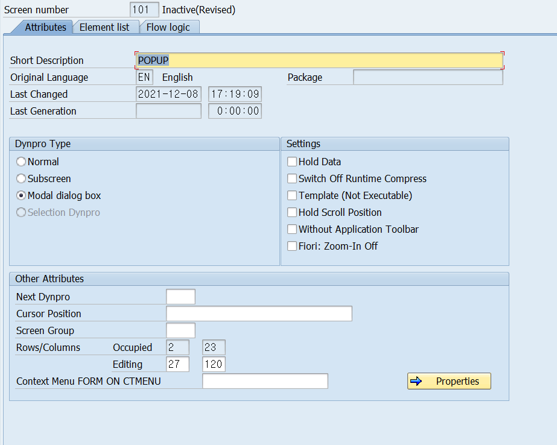

DYNPRO TYPE을 Modal dialog box로 잡으며 Next dynpro를 0으로 잡아준다.

TOP에 사용할 커맨드 변수 IO_COMMAND (CHAR 1)를 선언한다.

MZ410_00_O01

```ABAP
*&---------------------------------------------------------------------*
*& Include MZTESTB23TOP                             - Module Pool      SAPMZBC410_SOLUTION_B23
*&---------------------------------------------------------------------*
PROGRAM sapmzbc410_solution_b23.

TABLES: sdyn_conn.
DATA: wa_sflight    TYPE sflight,
      lv_radio_1(1) TYPE c,
      lv_radio_2(1) TYPE c,
      io_command.
```

SCREEN 100 **PAI에** IO_COMMAND와 관련된 MODULE을 넣어준다.

SCREEN 100

```ABAP
PROCESS BEFORE OUTPUT.
  MODULE get_sflight.
  MODULE move_to_dynp.
  MODULE set_curser.
  MODULE modify_screen.

PROCESS AFTER INPUT.
  MODULE USER_COMMAND_0100.
  MODULE check_sflight.
```

넣어준 MODULE을 정의해준다.

MZTESTB23I01

```ABAP
*&---------------------------------------------------------------------*
*&      Module  USER_COMMAND_0100  INPUT
*&---------------------------------------------------------------------*
*       text
*----------------------------------------------------------------------*
MODULE user_command_0100 INPUT.
  CASE IO_COMMAND.
    WHEN 'T'.
      CALL SCREEN 101 STARTING AT 10 10
                      ENDING   AT 50 20.
      CLEAR IO_COMMAND.
  ENDCASE.
ENDMODULE.
```

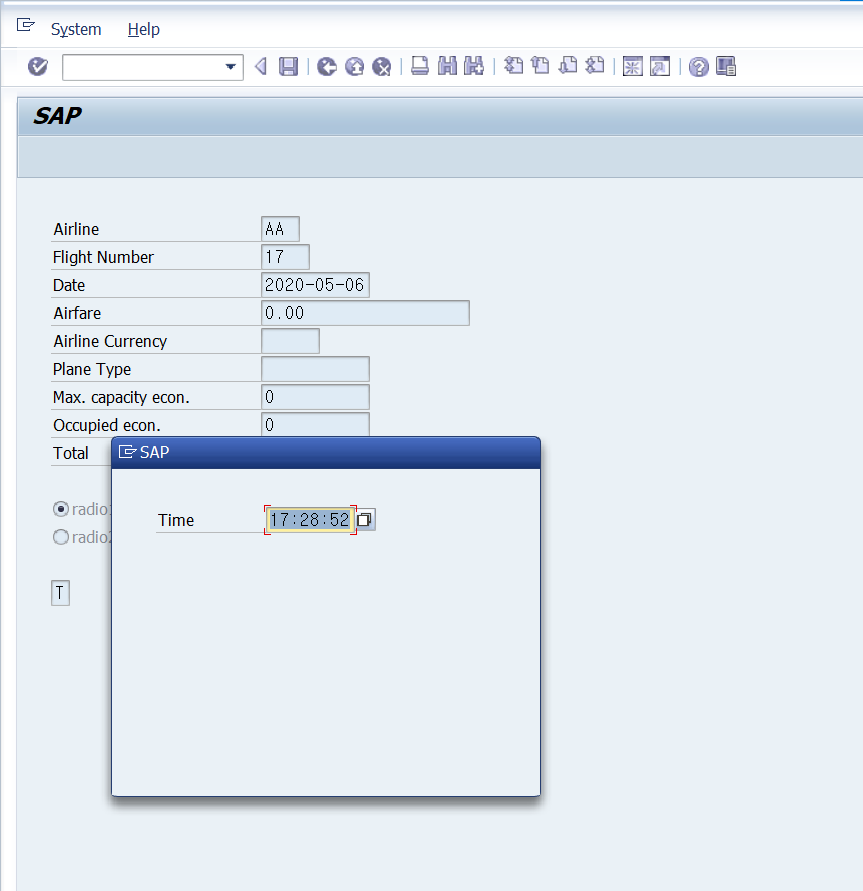

