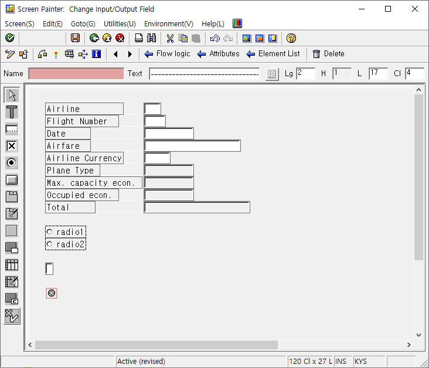
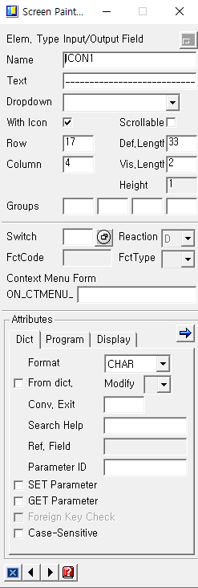
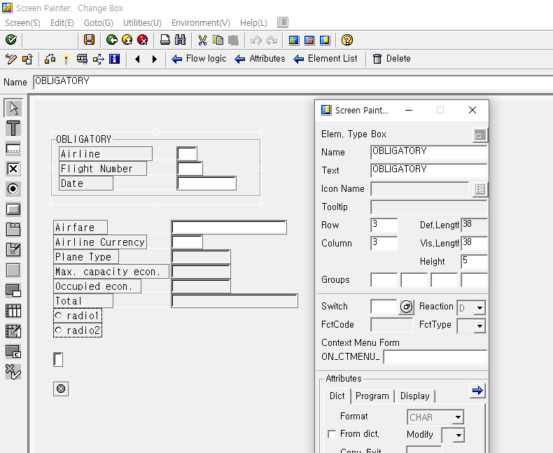
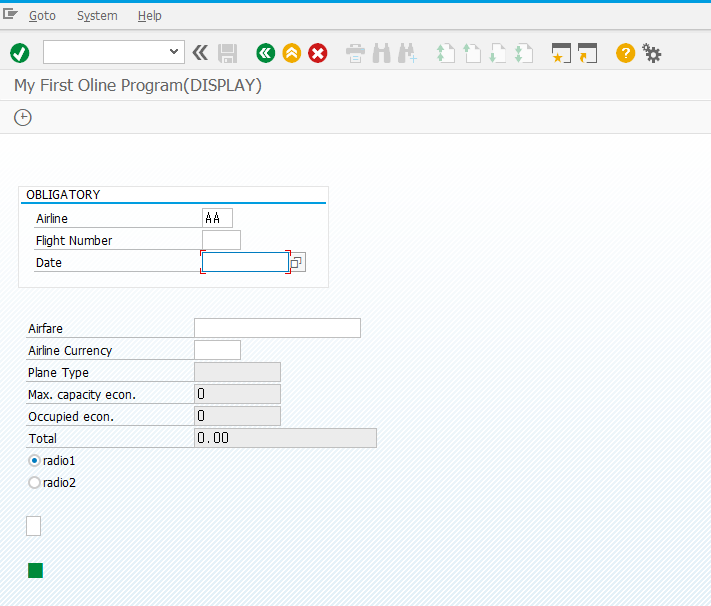
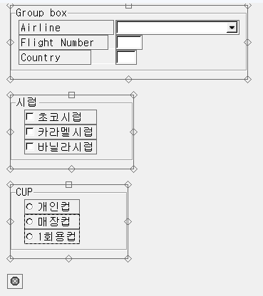
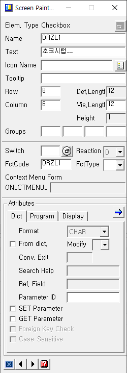
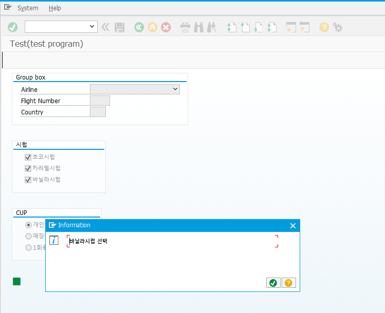
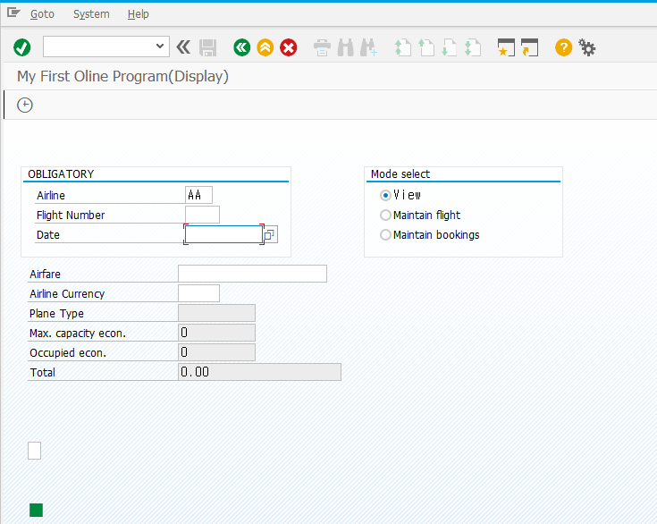
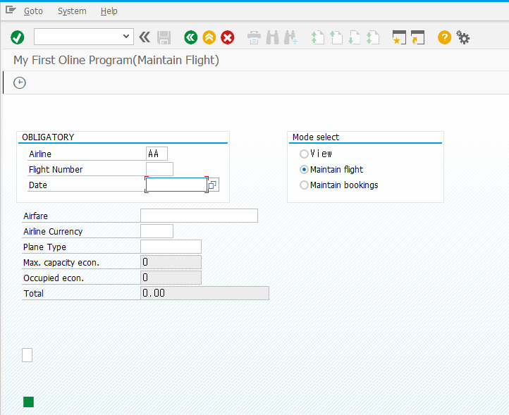
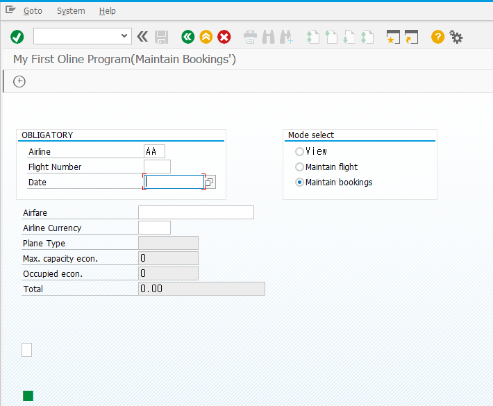

# Unit 13. Simple Screen Elements


# Lesson 1. Creating Screen Elements for Output


* ## ICON 추가하기

  

  

  screen Painter에서 아이콘을 추가한후 변수명을 정해준다.

  이후 해당 변수명을 TOP에서 TYPE ICONS_TEXT로 선언해 주고

  PBO에 SET_ICON 모듈을 표현해 준다.

  #### SCREEN 100.

  ```ABAP
  PROCESS BEFORE OUTPUT.
    MODULE status_0100.
    MODULE set_icon.
  ```

  #### MODULE SET_ICON.

  ```ABAP
  *&---------------------------------------------------------------------*
  *& Module SET_ICON OUTPUT
  *&---------------------------------------------------------------------*
  *&
  *&---------------------------------------------------------------------*
  MODULE set_icon OUTPUT.
    CALL FUNCTION 'ICON_CREATE'
      EXPORTING
        name   = 'ICON_LED_GREEN'
  *     TEXT   = ' '
  *     INFO   = ' '
  *     ADD_STDINF                  = 'X'
      IMPORTING
        result = icon1
  * EXCEPTIONS
  *     ICON_NOT_FOUND              = 1
  *     OUTPUTFIELD_TOO_SHORT       = 2
  *     OTHERS = 3
      .
    IF sy-subrc <> 0.
  * Implement suitable error handling here
    ENDIF.
  ENDMODULE.
  ```

  CALL FUNCTION을 통해 'ICON_CREATE' 함수를 불러 우리가 추가한 아이콘을 원하는 모양의 아이콘으로 생성해 준다.

  ICON 트랜잭션에서 아이콘 이름들을 확인 할 수 있다.

  

  


* ## Group Box만들기

  Screen Painter에서 Box를 클릭 후 원하는 크기로 만들고

  더블클릭해 변수 명, text를 입력해 준다.

  

  

  


# Lesson 2. Creating Input/Output Fields


### 앞의 과정에서 실습을 통해 했다.


# Lesson 3. Defining Checkboxes and Radio Button Groups


* ## Checkboxes and Radio Buttons

  

  

  Radio Button들은 드래그 하여 Radio Button Group 을 Define해 준다.

  둘 모두 TOP에서 선언해준다.

  

  

  FCTCODE를 정해준다. 클릭시 OK_CODE에서 FCTCODE에 정의된 값으로 받게 된다.

  RADIO는 하나로 통일된다.

  #### TOP.

  ```ABAP
  DATA: drzl1,  "초코시럽
        drzl2,  "카라멜시럽
        drzl3,  "바닐라 시럽
        cup1,   "개인컵
        cup2,   "매장컵
        cup3.   "1회용
  ```

  MODULE USER_COMMAND_0100에서 로직을 작성해 준다.

  Radio Box는 클릭 됐을때 ok_code에서 '***TOGGLE***' 받으므로 TOGGLE에 대한 케이스 문이 하나 더 필요하며

  Check Box는 클릭 됐을 때 ok_code에서 클릭한 체크 박스의 변수 명으로 받는다. 

  #### MODULE USER_COMMAND_0100.

  ```ABAP
  *&---------------------------------------------------------------------*
  *& Include          MZTESTB23_I01
  *&---------------------------------------------------------------------*
  *&---------------------------------------------------------------------*
  *&      Module  USER_COMMAND_0100  INPUT
  *&---------------------------------------------------------------------*
  *       text
  *----------------------------------------------------------------------*
  MODULE user_command_0100 INPUT.
    CASE ok_code.
      WHEN 'BACK'.
        LEAVE TO SCREEN 0.
  
      WHEN 'DRZL1'.
        IF drzl1 IS NOT INITIAL.
          MESSAGE '초코시럽 선택' TYPE 'I'.
        ENDIF.
      WHEN 'DRZL2'.
        IF drzl2 IS NOT INITIAL.
        MESSAGE '카라멜시럽 선택' TYPE 'I'.
        ENDIF.
      WHEN 'DRZL3'.
        IF drzl3 IS NOT INITIAL.
          MESSAGE '바닐라시럽 선택' TYPE 'I'.
        ENDIF.
  
      WHEN 'TOGGLE'.
        CASE 'X'.
          WHEN cup1.
            MESSAGE '개인컵 선택' TYPE 'I'.
          WHEN cup1.
            MESSAGE '매장컵 선택' TYPE 'I'.
          WHEN cup3.
            MESSAGE '1회용 선택' TYPE 'I'.
        ENDCASE.
      WHEN OTHERS.
    ENDCASE.
  ENDMODULE.
  ```

  

  


* ## 동적인 Title

  ```ABAP
  *&---------------------------------------------------------------------*
  *& Module STATUS_0100 OUTPUT
  *&---------------------------------------------------------------------*
  *&
  *&---------------------------------------------------------------------*
  MODULE status_0100 OUTPUT.
    SET PF-STATUS '0100'.
    CASE 'X'.
      WHEN lv_radio_1.
        SET TITLEBAR '0100' WITH 'Display'(vie).
      WHEN lv_radio_2.
        SET TITLEBAR '0100' WITH 'Maintain flight'(fli).
      WHEN lv_radio_3.
        SET TITLEBAR  '0100'  WITH 'Maintain Bookings'(boo).
    ENDCASE.
  ENDMODULE.
  ```

  MODULE status_0100 에서 case문을 통해 title을 동적으로 설정해 줄 수 있다.

  

  

  


# Lesson 4. Creating Pushbuttons


동일하다

PUSH 버튼 만들고 FCTCODE를 통해 전달하여 동작을 수행한다.