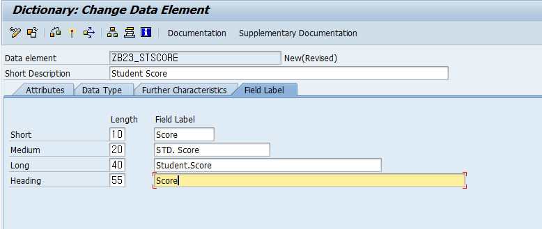

# Unit 2. Data Types in the ABAP Dictionary


# Lesson 1. Creating Domains and Data Elements

* ## Data Type으로 쓸 수 있는 것들

  > #### Data Elements
  >
  > #### Table - Column

  > #### Domain은 Data Type 으로 사용할 수 없다.abap


* ## Domain을 정의 후 Data Element를 정의하기

  

  

  #### Case-sensitive를 체크시 소문자 허용이 가능하다.

  

  #### Data Element 이름과 Domain의 이름은 같아도 허용

  

  

  

  ```ABAP
  *& Report ZB23_00027
  *&---------------------------------------------------------------------*
  *&
  *&---------------------------------------------------------------------*
  REPORT ZB23_00027.
  
  parameters p_name type 
  
  ```

  

  #### 데이터의 길이를 결정하는 것은 Domain부분이다.

  #### 입력 필드의 이름은 Data Element 부분이다.

  * #### Data Element => 의미적인 정보 (Semantic Information) 를 제공

  * #### Domain => 기술적인 정보 (Technical Information) 를 제공

* ## 실습

  #### 한국어로 로그인시 입력 필드의 이름을 한글로 번역

  #### Data Element에서 수정해야 한다.

  

  

  

  

* ## Data Element 를 정의 하면서 Domain 정의

  

  

  

  #### Data Element를 먼저 정의해 준 후 

  

  #### Domain 지정후 해당 Domain 을 더블 클릭해 생성해 준다.

  

  
  
  #### DEC 로 TYPE을 정의한 경우 전체 길이와 DECIMAL PLACES의 길이를 정의한다. 이후 OUTPUT LENGTH 는 전체 길이 + 1로 정해진다. (소숫점 자리)
  
  


* ## Data Types in the ABAP Dictionary

  도메인을 수정할 때는 항상 조심해야 한다.


* ## Data Elements 기능

  다국어 처리 , F4 HELP , SET/GET Parameters


# Lesson 2. Creating Flat Structures

* ## Flat Structure 만들기

  

  

  

  


****


* ## Nested Structure 만들기

  

  #### 안에 들어갈 스트럭쳐 타입을 만들어준 후

  

  #### Nested Structure의 Component 로 넣어 준다.

  

  ### 프로그램 짜는데 불편하여 실무에서 권장하지는 않는다.

  

  

****


* ## .INCLUDE 


#### .INCLUDE 를 사용하고 TYPE에 추가할 STRUCTURE을 넣는다. 

#### 이런 경우 INCLUDE한 STRUCTURE의 필드가 추가된 FLAT STRUCTURE가 만들어진다.


#### Expand All 버튼을 통해 INCLUDE한 내용을 펼쳐 볼 수 있으며 그 옆의 COLLAPSE ALL을 통해 다시 접을 수 있다.

```ABAP
*&---------------------------------------------------------------------*
*& Report ZB23_00028
*&---------------------------------------------------------------------*
*&
*&---------------------------------------------------------------------*
REPORT zb23_00028.

" Flat Structure.
DATA str1 TYPE zsb23_00001.
str1-stdid = 1.
str1-stnam = 'Hong Kildong'.
str1-city  = 'SEOUL'.
str1-zip   = '12345'.
str1-stsco = '98.20'.

" Nested Structure.
DATA str2 TYPE zsb23_00003.
str2-stdid      = 2.
str2-stnam      = 'Chae Jihoon'.
str2-stsco      = '98.29'.
str2-addrs-zip  = '12345'.
str2-addrs-city = 'SEOUL'.


" .INCLUDE (=> 플랫 스트럭쳐와 동일하게 사용 가능)
DATA STR4 TYPE ZSB23_00004.
str4-stdid = 1.
str4-stnam = 'Hong Kildong'.
str4-city  = 'SEOUL'.
str4-zip   = '12345'.
str4-stsco = '98.20'.
```

### 유지보수가 쉬워진다.


internal table 3가지 구성요소

line type

key component

table 유형(Standard, Sorted, Hashed)


# Lesson 3. Creating Table Types and Deep Structures

* ## Deep Structure을 포함한 Table만들기

  

  

  

  #### Deep Structure 내부에 들어갈 Table의 타입이 되어줄 Structure type 지정

  

  

  

  

  #### Deep Structure에 들어갈 테이블 만들기

  

  #### Deep Structure 생성

  

  #### Deep Structure을 포함한 Table생성

  

  ```ABAP
  *&---------------------------------------------------------------------*
  *& Report ZB23_00029
  *&---------------------------------------------------------------------*
  *&
  *&---------------------------------------------------------------------*
  REPORT zb23_00029.
  
  DATA: gt_student TYPE ztb23_00005,
        gw_student LIKE LINE OF gt_student,
        gw_contact TYPE zsb23_00006.
  
  CLEAR: gw_student.
  gw_student-stdid = 1.
  gw_student-stnam = '홍길동'.
  gw_student-stsco = 100.
  
  CLEAR: gw_contact.
  gw_contact-telephone = '010-1111-1111'.
  gw_contact-email = 'hong@naver.com'.
  APPEND gw_contact TO gw_student-contacts.
  
  CLEAR: gw_contact.
  gw_contact-telephone = '02-111-1111'.
  gw_contact-email = 'hong@hanmail.net'.
  APPEND gw_contact TO gw_student-contacts.
  
  APPEND gw_student TO gt_student.
  
  
  CLEAR: gw_student.
  gw_student-stdid = 2.
  gw_student-stnam = '김미리'.
  gw_student-stsco = 98.
  
  CLEAR: gw_contact.
  gw_contact-telephone = '010-2222-2222'.
  gw_contact-email = 'miree@naver.com'.
  APPEND gw_contact TO gw_student-contacts.
  
  CLEAR: gw_contact.
  gw_contact-telephone = '02-222-2222'.
  gw_contact-email = 'miree@hanmail.net'.
  APPEND gw_contact TO gw_student-contacts.
  
  APPEND gw_student TO gt_student.
  ```

  ### Deep Structure 내부의 Table을 조작할 때에도 항상 Work Area가 필요하다!!


* ## Global Type Data Element for SELECT-OPTION 

  SELECT-OPTION 을 통해 만들어진 HEADER가 있는 테이블의 로컬 타입을 만들어줄때 우리는 

  TYPE RANGE OF 를 사용하여 정의 하였다.

  이를 Global Type의 Data Element를 만드는 과정은 다음과 같다.

  

  

  #### Edit 의 Define as ranges table type을 눌러주면 아래와 같이 생성창이 변하게 된다.

  

  #### Create 버튼을 눌러주면 아래와 같이 Structured Row Type을 만드는 창으로 넘어간다.

  

  #### 자동생성된 것을 activate 시킨후 돌아가 이전 화면도 activate 시켜준다.

  ```ABAP
  *&---------------------------------------------------------------------*
  *& Report ZB23_00030
  *&---------------------------------------------------------------------*
  *&
  *&---------------------------------------------------------------------*
  REPORT zb23_00030.
  
  DATA: wa_scarr TYPE scarr.
  
  *TYPES: TT_RG_CARRID TYPE RANGE OF S_CARR_ID.
  
  SELECT-OPTIONS s_car FOR wa_scarr-carrid.
  
  PERFORM get_data USING s_car[].
  
  *&---------------------------------------------------------------------*
  *& Form get_data
  *&---------------------------------------------------------------------*
  *& text
  *&---------------------------------------------------------------------*
  *&      --> S_CAR[]
  *&---------------------------------------------------------------------*
  FORM get_data  USING    p_s_car TYPE ztb23_rg_carrid. "또는 TT_RG_CARRID
  
  ENDFORM.
  ```

  


# Lesson 4. Creating type Groups


## 대표적으로 ICON, COL이 있다.


* ## Type Group 생성하기

  

  

  

  ### Type Group 정의

  ```ABAP
  TYPE-POOL zgb23 .
  
  " 성 타입과 이름 타입 정의.
  TYPES: zgb23_fname TYPE c LENGTH 16,
         zgb23_lname TYPE c LENGTH 8.
  ```

  ### Type Group 호출과 사용

  ```ABAP
  *&---------------------------------------------------------------------*
  *& Report ZB23_00031
  *&---------------------------------------------------------------------*
  *&
  *&---------------------------------------------------------------------*
  REPORT zb23_00031.
  
  TYPE-POOLS: zgb23.
  
  DATA: gv_fname TYPE zgb23_fname,
        gv_lname TYPE zgb23_lname.
  ```

  #### 자주 사용하는 관련된 타입들을 한곳에 묶어 효율적으로 관리하고 사용할 수 있다.

  


# 부록


* ## WIRTE AT n

  ```ABAP
  WRITE: AT n ___.
  ```

  n번째 칸에 입력한다.

* ## Sorted Table Data Element 만들기

  

  

  ***Initialization and Access*** 에서 *Sorted Table*을 클릭한 후 

  ***Primary Key*** 탭에서 ***Key Definition***을 *Key Components* 로 놓고 ***Key Category***를 *Non-Unique*로 놓은 후 

  ***Key Component***에 정렬 기준이 될 Key들을 추가한다.