# Unit 5. Input Checks


# Lesson 1. Creating Fixed Valsues

* ## Fixed Values

  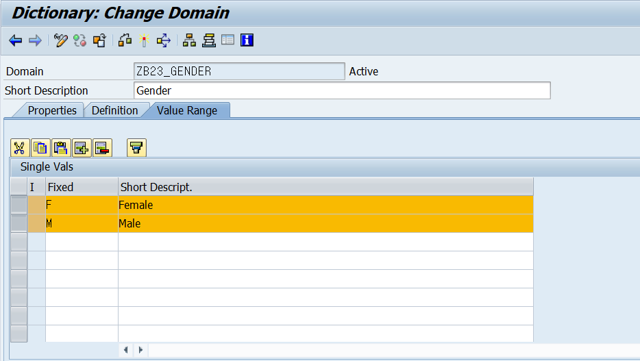

  Fixed Value 파트에서는 입력될 수 있는 값들을 지정할 수 있다. f4 help기능

  #### Domain Fixed Value : 한번 설정이 되면 값이 변하면 안되는 항목

  

  f4 help 기능은 만들어지지만 Input Check 기능은 구현되지 않는다.

  ```ABAP
  *&---------------------------------------------------------------------*
  *& Report ZB23_00033
  *&---------------------------------------------------------------------*
  *&
  *&---------------------------------------------------------------------*
  REPORT zb23_00033.
  
  * 성별을 입력 받아서 해당 학생 리스트 출력.
  PARAMETERS p_gen TYPE zb23_00001-gender VALUE CHECK. " ****
  
  START-OF-SELECTION.
    WRITE: p_gen.
  ```

  VALUE CHECK를 통해 Input Check를 할 수 있다.

  Intervals 부분에서 입력되는 값의 범위를 지정할 수 있다.

  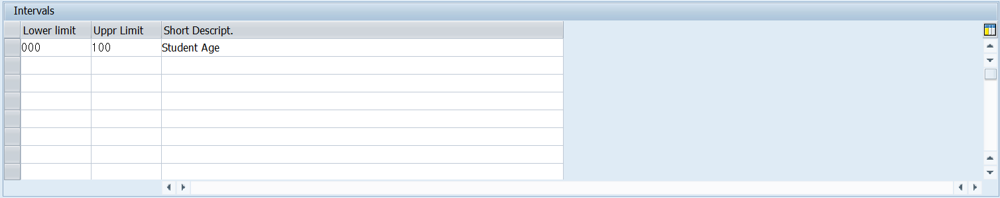


# Lesson 2. Defining Foreign Keys to Perform Input Checks

* ## Foreign Key

  #### Foreign Key를 설정해 놓으면 연결되어 있는 Check Table을 참조 할 수 있다.

  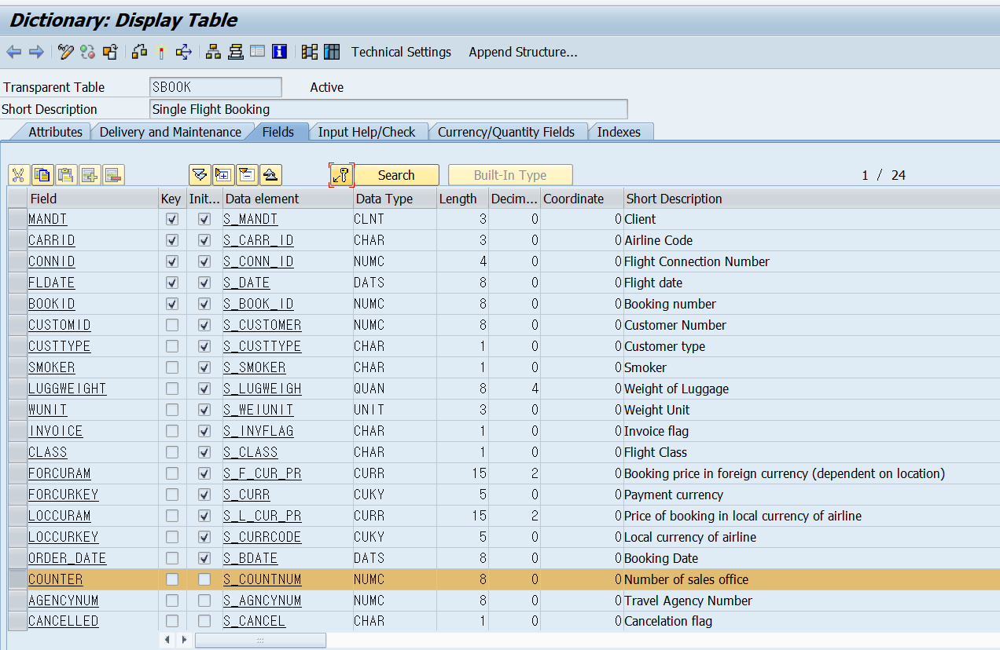

  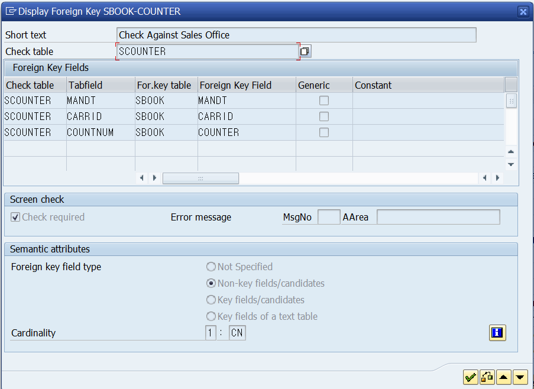

  확인하고 싶은 field에 커서를 올린 후 열쇠모양 버튼을 누르면 foreign key를 확인 할 수 있다.

  

  ```ABAP
  SELECT COUNT(*) fROM SCOUNTER
  	WHERE CARRID = 'AA'
  	  AND COUNTER = '8'.
  IF sy-subrc <> 0.
  	"에러출력.
  ELSE.
  	"실행
  ENDIF.	
  " 와 같은 동작을 시스템에서 처리해 줄 수 있다.
  ```

  #### Check Table 과 Foreign Key 구별 중요!!!

  * #### Ex )

    ```ABAP
    *&---------------------------------------------------------------------*
    *& Report ZB23_00033
    *&---------------------------------------------------------------------*
    *&
    *&---------------------------------------------------------------------*
    REPORT zb23_00033.
    
    PARAMETERS p_car type spfli-carrid value check.
    PARAMETERS p_con type spfli-connid value check.
    
    START-OF-SELECTION.
      write: p_car, p_con.
    ```

    

    SPFLI의 CARRID 는 Foreign Key가 걸려 있어 연결된 SCARR 의 CARRID 의 Check Table을 참조하여 AT를 입력할시 오류 메시지를 띄운다.

    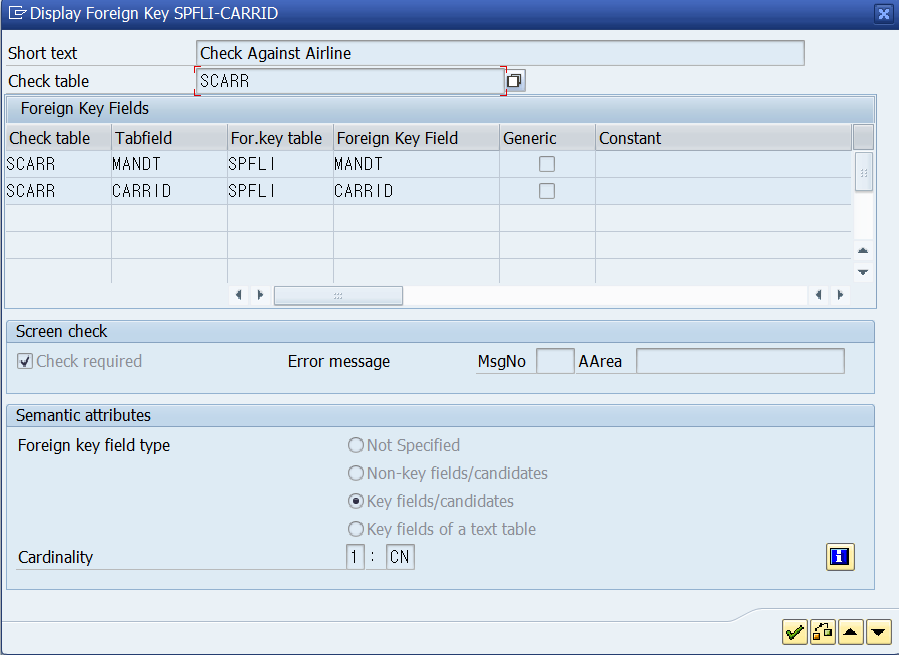


* ## 실습

  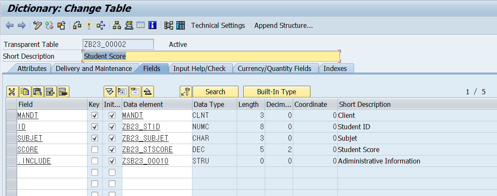

  

  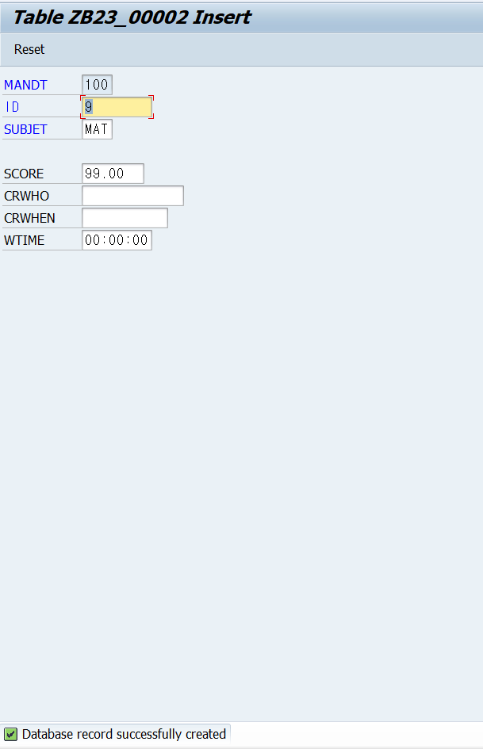

  * ### 방법1

    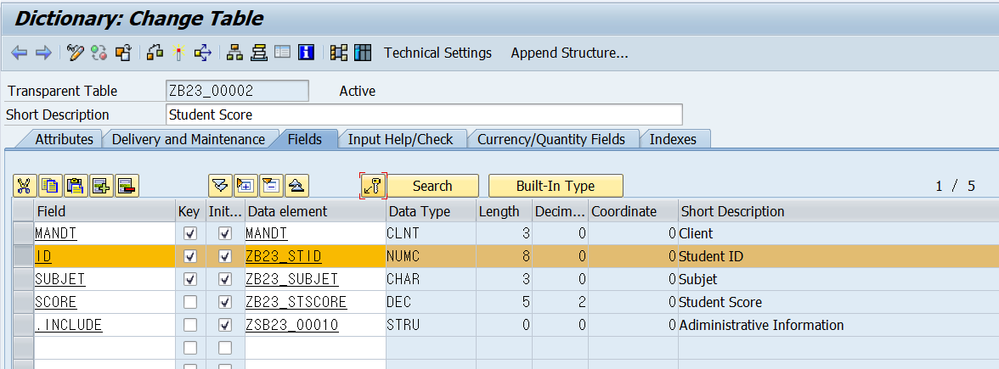

    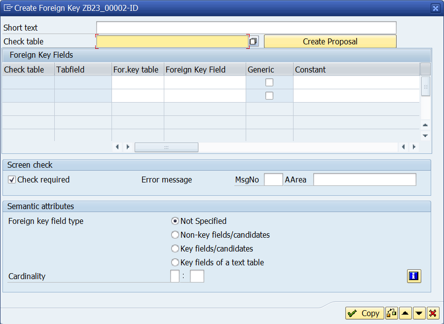

    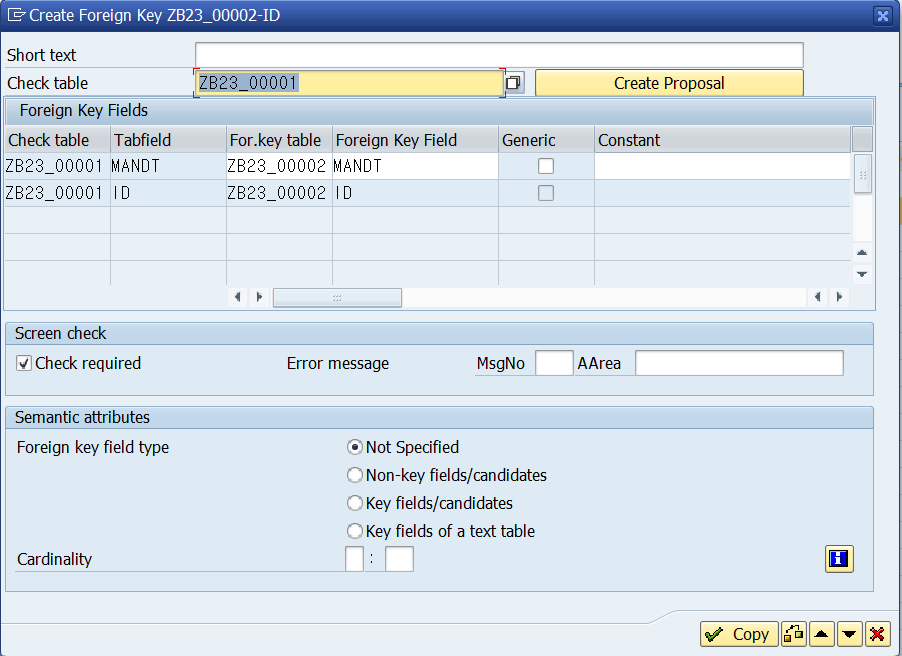

  * ### 방법 2

    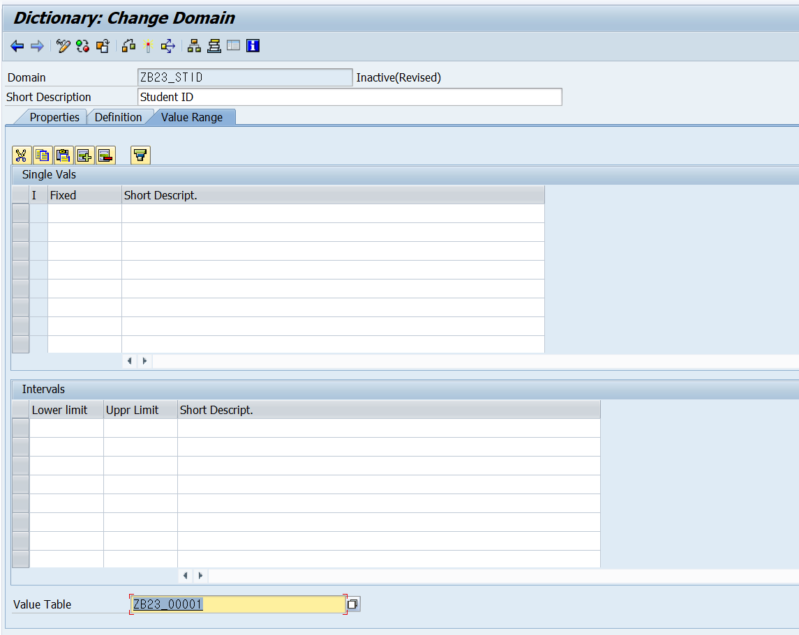

    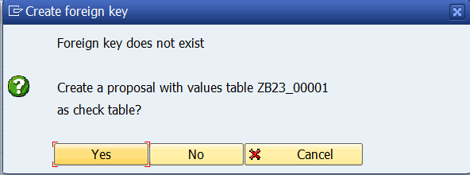

    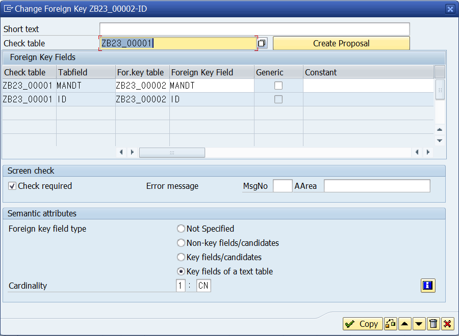

  

* ## Cardinality

  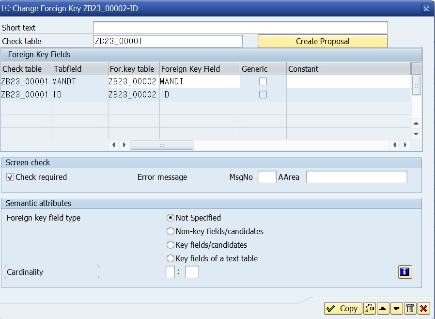

  Foreign Key 와 Check Table의 몇대 몇인지 입력해 준다.

  | Check Table |  :   | Key Table |
  | :---------: | :--: | :-------: |
  |             |      |           |
  |             |      |           |
  |             |      |           |
  |             |      |           |

  

* ## Foreign key field type

  지금 보고있는 Field가 무엇인지 알려준다. 


# Lesson 3. Creating Text Tables

코드테이블에는 순수하게 코드만 있어야 하며 언어 테이블도 있어야 한다. 언어 key 하나 더 추가 되어야 한다?????? 이부분 다시


* ## Text Table의 목적

  Code 테이블에 텍스트를 지원하면서 다국어 지원

  

  CODE 테이블 + TEXT 테이블을 만든다.

  둘을 하나로 만드는 경우 다국어 지원이 안된다.


Foreign key fiel type을 Key fields of a text table로 지정해준다.

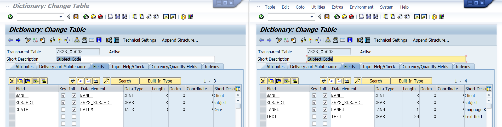


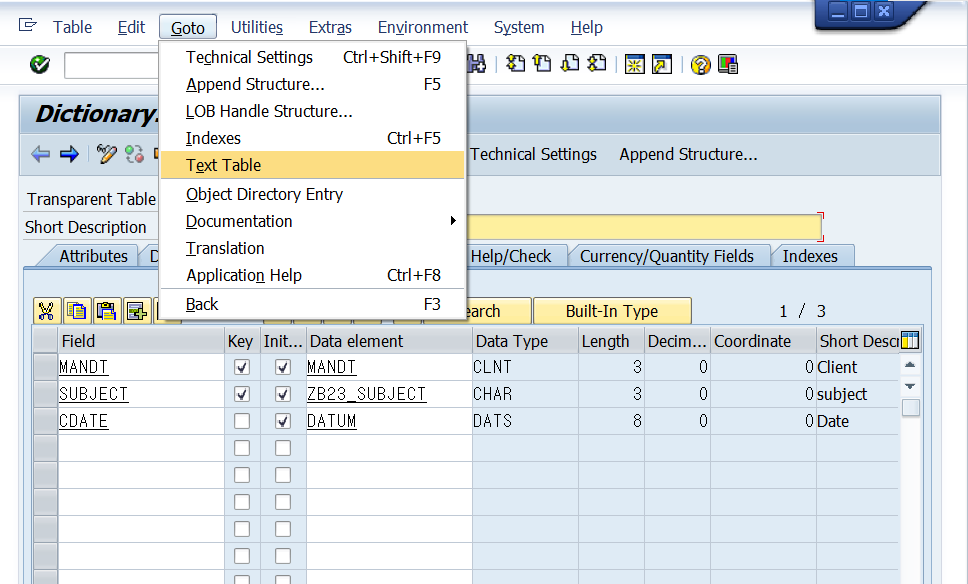

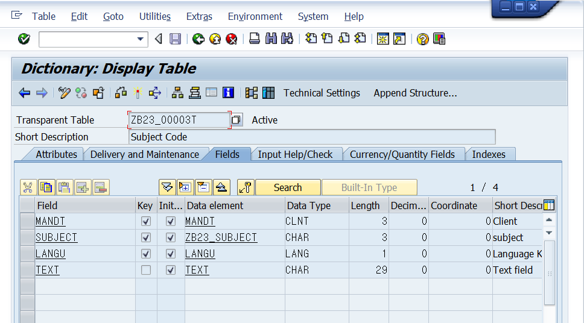

CODE table에서 ***GoTo - Text Table***을 통해 Text Table로 이동할 수 있다. 

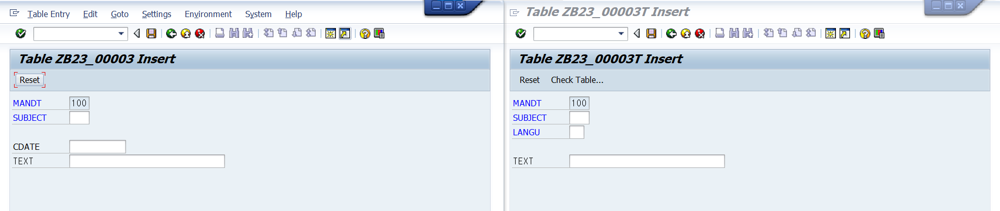

Code Table에도 TEXT input 창이 추가된것을 볼 수 있다.

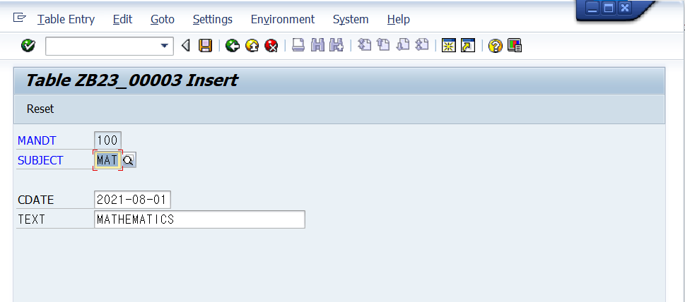

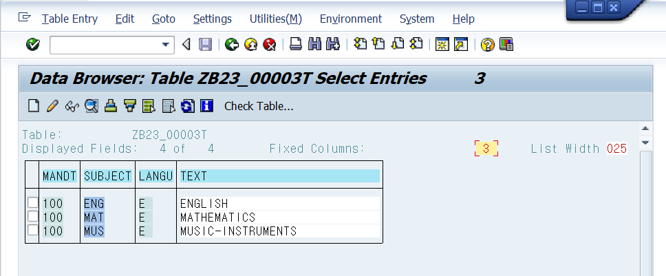

code table에 입력하면 text table에도 입력된다.


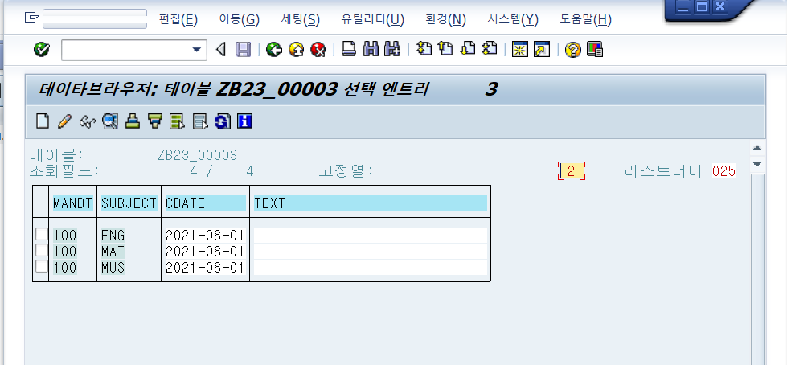

한국어로 로그인하면 Text가 비어있는 것을 알 수 있다.

기존에 있던 zb23_00002의 subject를 foreign key로 하고 zb23_00003의 subject와 연결한다.