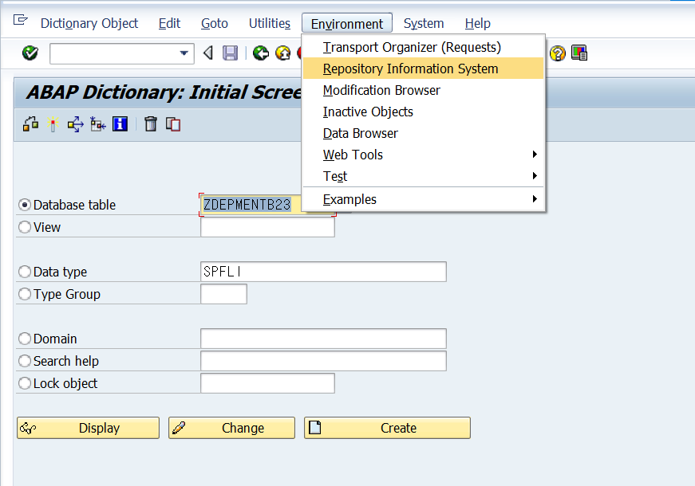

# Unit 6. Dictionary Object Dependencies

# Lesson 1. Differentiation Between Active and Inactive Dictionary Objects

런타임 환경은 액티브 버전만 확인한다.

# Lesson 2. Identify Dependencies with ABAP Dictionary Objects

Program 도 dependency가 있다 Program 들 간에 Submit으로 호출한 경우

* ## The Repository Information System

  RIS

  