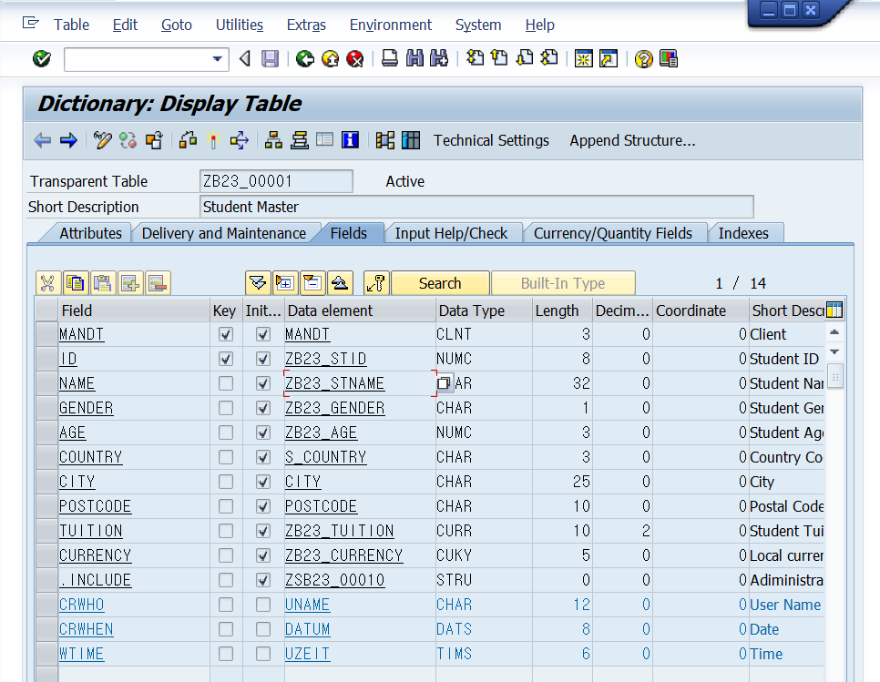
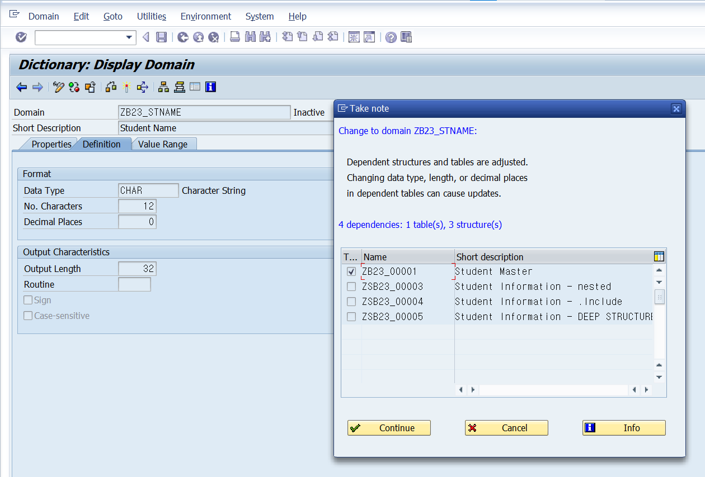
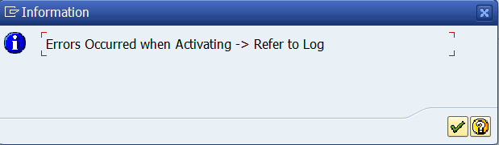
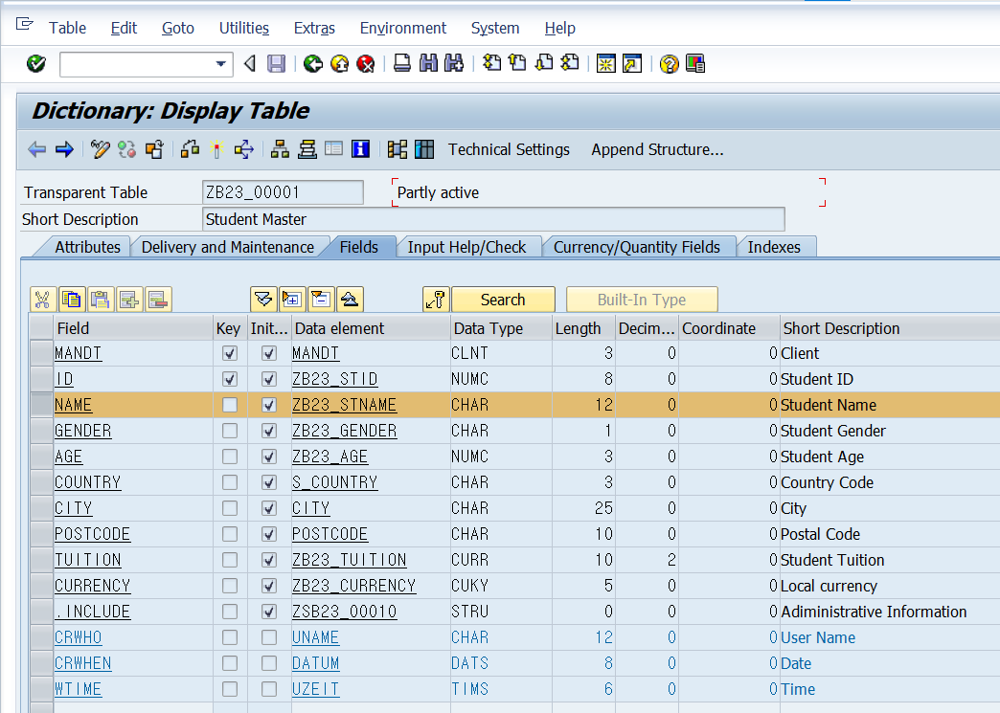
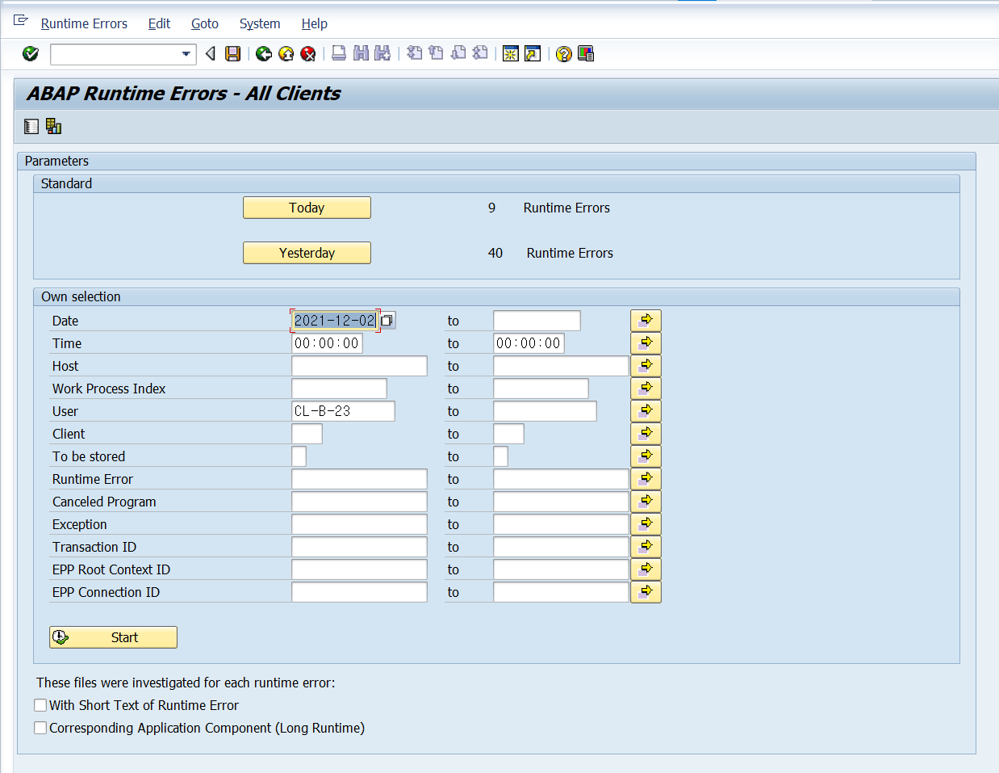
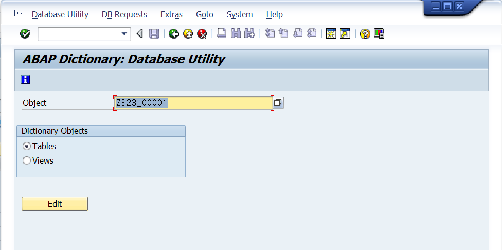
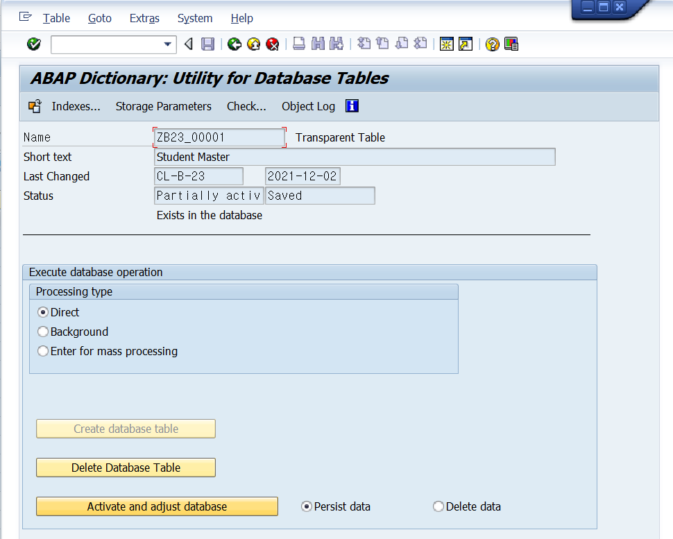
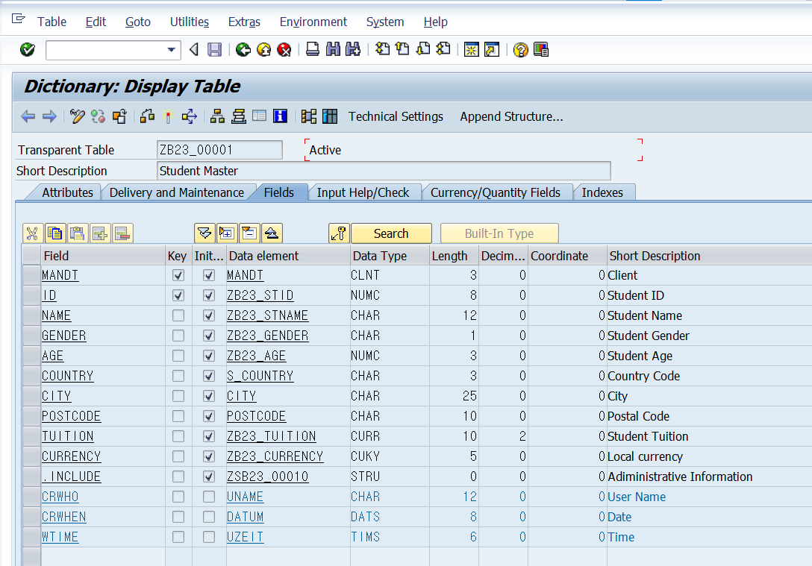
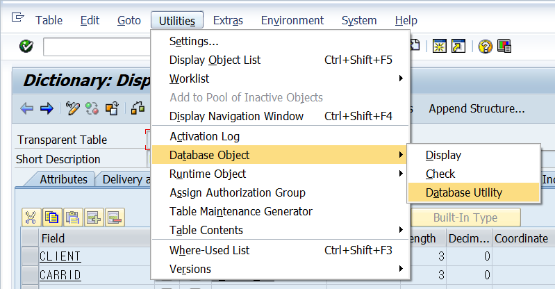

# Unit 7. Table Changes

# Lesson 1. Performing a Table Conversion

* ## 테이블의 구조 변경

  * ### 데이터가 있는가?

    컬럼 추가, Length 늘리기 (Length 줄이기 불가능).... 가능

    이외의 케이스:

    * Conversion 수행

  * ### 데이터가 없는가?

    원하는 것 모두 가능 (컬럼 추가, 컬럼 삭제, 도메인 변경 ....)

* ## The Table Conversion Process

  * Table에 lock을 건다

  * Conversion을 수행할 테이블 이름을 **QCM + '기존 테이블 이름'** 으로 바꾼다.

  * 해당 테이블의 index들을 모두 지운다.

  * 임시 테이블을 생성한다. 해당 임시 테이블 명은  **QCM + 8 + '기존 테이블 이름'** 으로 정한다.

    임시테이블에 변경 사항을 적용한 후 데이터를 옮겨준다. 

    (이과정에서 데이터의 유실이 있을 수도 있다.)

  * 원래 테이블을 삭제한 후 임시테이블의 기존 테이블 명으로 변경한다.

* ## 실습

  

  #### NAME의 길이를 12로 바꾼다.

  

  

  #### 오류가 나는 것을 알 수 있다.

  

  #### NAME의 길이는 바뀌었으나 active 하는 과정에 오류가 나서 Partly Active 상태인 것을 볼 수 있다.

  

  #### st22 t-code를 통해 오류난 내역들을 볼 수 있다.

  

  #### se14 t-code로 들어가 edit을 누른 후

  

  #### Activate and adjust database를 클릭하면 Conversion의 5단계를 자동으로 수행해 주어

  

  #### Success 메시지가 뜨며

  

  #### active 가 성공한것을 확인 할 수 있다.

  

  ***Utilities - Database Object - Database Utility*** 를 통해서도

  

  ***ABAP Dictionary: Utility for Database Tables*** 화면에 접근 할 수 있다.

# Lesson 2. Enhancing Tables Using Append Structures

