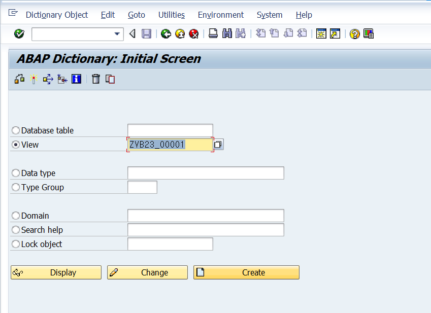
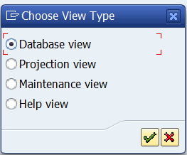
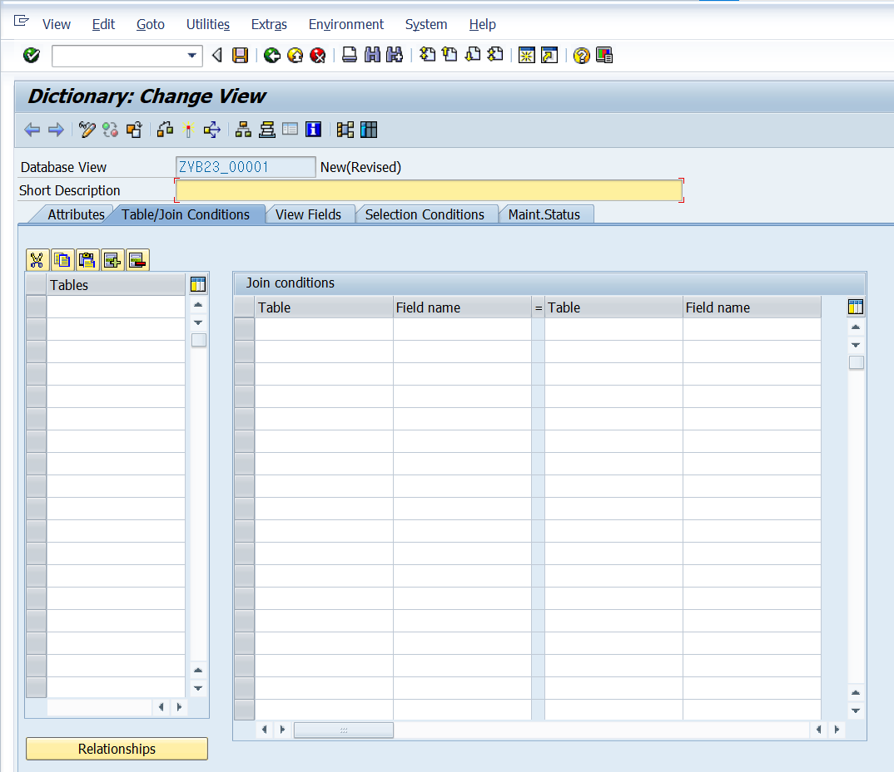
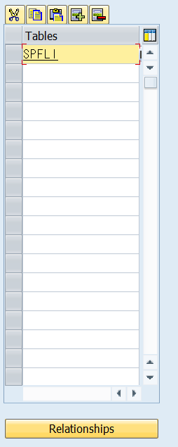
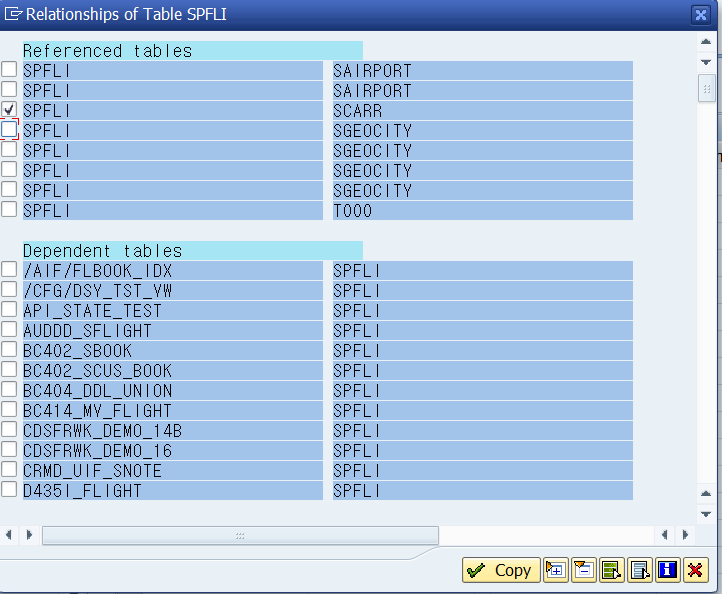
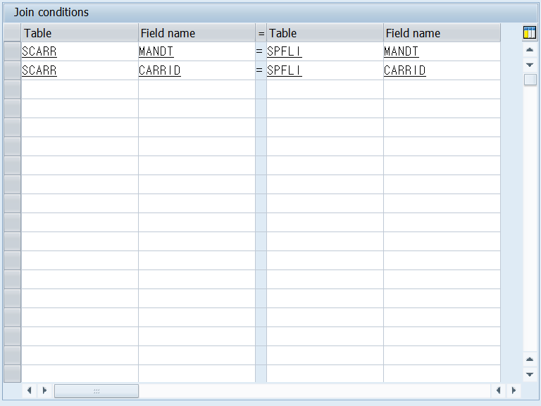
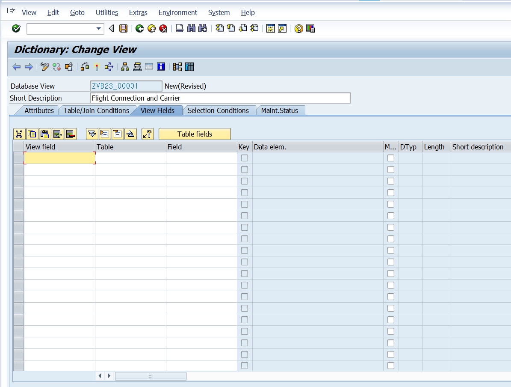
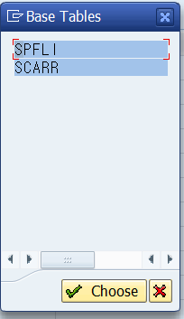
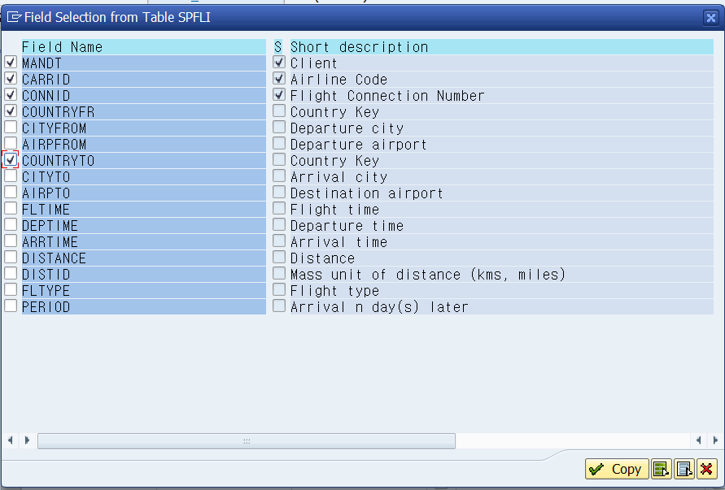
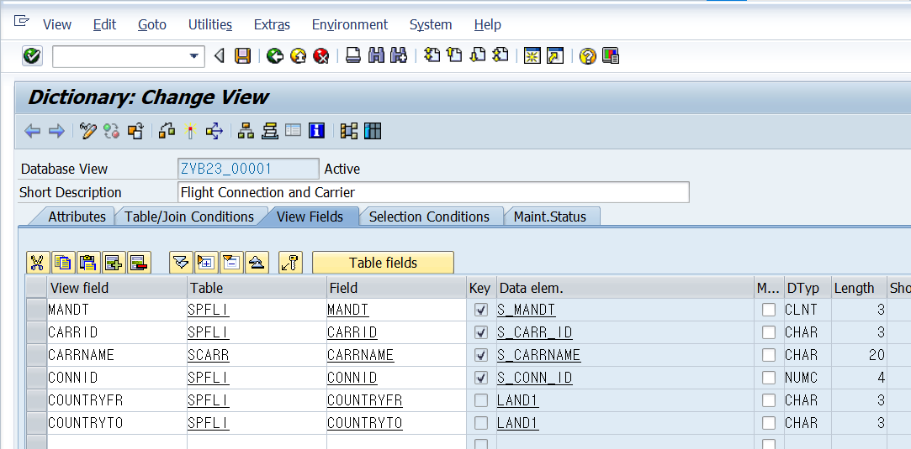

# Unit 8. Views and Maintenance Views


# Lesson 1. Creating Database Views


* ## SAP Views

  ### Database에 존재하는 View

  * Database View

    여러개의 테이블 간에 관계를 미리 설정해 놓은 DB Object

    오직 Inner Join만 가능

    => ABAP Join 을 써도 가능

  * Pojection View

  * 하나의 테이블에서 필요한 컬럼들만 미리 뽑아 놓은 DB Object

    #### Ex )

    컬럼 150 개로 구성된 테이블에 대해 필요한 컬럼만 뽑아 놓음

    ```ABAP
    SELECT * FROM <Projection View>.
    ```

  ### Database에 존재하지 않는 View

  * Maitenance View

    마스터 테이블(s)에 데이터를 쉽게 CRUD 프로그램임

  * Help View

    Left Outer Join을 지원하는 View


* ## View 생성하기

  

  

  

  

  

  

  

  

  

  

  

  ````ABAP
  *&---------------------------------------------------------------------*
  *& Report ZB23_00016
  *&---------------------------------------------------------------------*
  *&
  *&---------------------------------------------------------------------*
  REPORT zb23_00034.
  
  TYPES: BEGIN OF ts_rslt.
           INCLUDE STRUCTURE zvb23_00001.
           TYPES: flight TYPE c LENGTH 1.
  TYPES:END OF ts_rslt.
  
  DATA: gt_rslt TYPE TABLE OF ts_rslt,
        gw_rslt LIKE LINE  OF gt_rslt.
  
  SELECT *
    INTO CORRESPONDING FIELDS OF table gt_rslt
    FROM zvb23_00001.
  
  
  cl_demo_output=>display_data( gt_rslt ).
  
  
  LOOP AT gt_rslt INTO gw_rslt.
    IF gw_rslt-countryfr = gw_rslt-countryto.
      gw_rslt-flight = 'D'.
    ELSE.
      gw_rslt-flight = 'I'.
    ENDIF.
    MODIFY gt_rslt FROM gw_rslt INDEX sy-tabix TRANSPORTING flight.
  ENDLOOP.
  
  cl_demo_output=>display_data( gt_rslt ).
  ````

  

  ```ABAP
  TYPES: BEGIN OF ts_rslt,
           carrid    TYPE spfli-carrid,
           carrname  TYPE scarr-carrname,
           connid    TYPE spfli-carrid,
           countryfr TYPE spfli-countryfr,
           countryto TYPE spfli-countryto,
           flight    TYPE c LENGTH 1,
         END OF ts_rslt.
  
  DATA: gt_rslt TYPE TABLE OF ts_rslt,
        gw_rslt LIKE LINE  OF gt_rslt.
  
  SELECT s~carrid c~carrname s~connid s~countryfr s~countryto
    INTO TABLE gt_rslt
    FROM spfli AS s INNER JOIN scarr AS c
      ON s~carrid = c~carrid.
  **************************************************************  
  ====>
  **************************************************************
  TYPES: BEGIN OF ts_rslt.
           INCLUDE STRUCTURE zvb23_00001.
           TYPES: flight TYPE c LENGTH 1.
  TYPES:END OF ts_rslt.
  
  DATA: gt_rslt TYPE TABLE OF ts_rslt,
        gw_rslt LIKE LINE  OF gt_rslt.
  
  SELECT *
    INTO CORRESPONDING FIELDS OF table gt_rslt
    FROM zvb23_00001.
  ```

  #### 기존의 프로그램 내에서 Inner Join을 했을 때와 달리 재사용성이 훨씬 높아진다.

  #### SELECT 문의 Inner Join 문을 통해 만든 두 TABLE을 합친 것을 View로 만들어 두고 여러 곳에서 사용할 수 있다.


# Lesson 2. Creating Maintenance Views


# Lesson 3. Creating View Clusters

