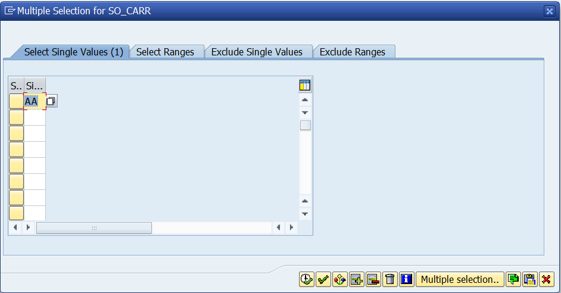
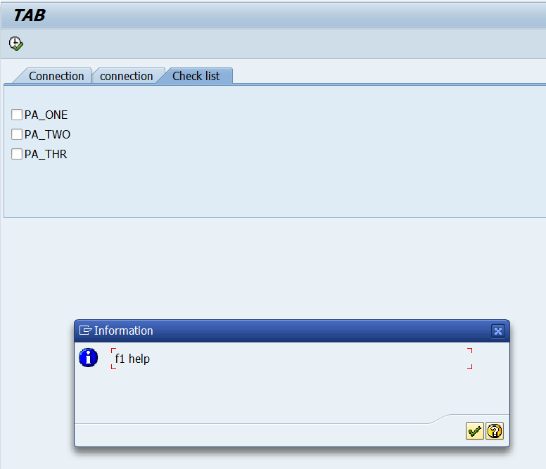

# Unit 10. Selection Screens


# Lesson 1. Implementing a Selection Screen

* ## Over View

  * ### Within Program

    ```ABAP
    PARAMETERS : ...
    
    SELECT-OPTIONS : ...
    ```

    

    Standard Selection Screen (Screen 1000) 이 생성된다.

  * ### Logical Database

    ```ABAP
    NODES: ...
    ```

    Standard Selection Screen (Screen 1000) 이 생성된다.

  * BEGIN OF SCREEN ####.

    ```ABAP
    BEGIN OF SCREEN ####.
    
    END OF SCREEN.
    ```


* ## Statement of PARAMETERS 

  ```ABAP
  PARAMETERS <f>
    TYPE <TYPE> 
    LIKE <F1>
    DECIMALS <N> 
    MEMORY ID <PID> 
    OBLIGATORY
    DEFAULT <VALUE> 
    LOWER CASE
    VALUE CHECK 
    AS CHECKBOX 
    RADIOBUTTON GROUP <GRP>
    MODIF ID <MOD>
  ```

  * ###  TYPE <TYPE> 

    변수의 TYPE을 지정해 준다.

    

  * ### LIKE <F1>

    변수를 통해 같은 TYPE으로 TYPE을 지정해 준다.

    

  * ### DECIMALS <N> 

    소숫점 자릿수를 정해준다.

    

  * ### MEMORY ID <PID> 

    

    ```ABAP
    PARAMETERS: PA_DATE  TYPE SFLIGHT-FLDATE MEMORY ID FLD.
    ```

    

  * ### OBLIGATORY

    필수 입력 값으로 바꿔준다.

    

  * ### DEFAULT <VALUE> 

    기본 입력값을 정해준다.

    ```ABAP
    PARAMETERS: pa_conn  TYPE s_conn_id      DEFAULT '0017'.
    ```

    

    

  * ### LOWER CASE

    소문자도 입력이 가능하게 한다.

    ```ABAP
    PARAMETERS: PA_CITY2 TYPE C LENGTH 20    LOWER CASE.
    ```

    

    

    

  * ### VALUE CHECK 

    

    

  * ### AS CHECKBOX 

     DEFAULT 'X' 를 통해 체크 된 것을 기본 값으로 할 수 있다.

    ```ABAP
    PARAMETERS: pa_name AS CHECKBOX DEFAULT 'X',
                pa_curr AS CHECKBOX,
    ```

    

  * ### RADIOBUTTON GROUP <GRP>

     DEFAULT 'X' 를 통해 체크 된 것을 기본 값으로 할 수 있다.

    같은 이름의 GROUP 으로 묶여진 것들을 하나의 RADIOBUTTON으로 만들어준다. 

    주로 CASE문과 같이 쓰인다. 

    ```ABAP
    PARAMETERS: pa_lim1 RADIOBUTTON GROUP lim DEFAULT 'X',
                pa_lim2 RADIOBUTTON GROUP lim,
                pa_lim3 RADIOBUTTON GROUP lim.
                
    CASE gc_mark.
      WHEN pa_lim1.
        WRITE '1번'.
      WHEN pa_lim2.
        WRITE '2번'.
      WHEN pa_lim3.
        WRITE '3번'.
    ENDCASE.
    ```

    

  * ### MODIFY ID <MOD>

  

  

  

  

  

  ```ABAP
  *&---------------------------------------------------------------------*
  *& Report ZTAW00_01
  *&---------------------------------------------------------------------*
  *&
  *&---------------------------------------------------------------------*
  REPORT ZTAW00_01.
  
  PARAMETERS: PA_CARR TYPE SFLIGHT-CARRID OBLIGATORY,
              PA_NAME AS CHECKBOX DEFAULT 'X',
              PA_CURR AS CHECKBOX,
              PA_LIM1 RADIOBUTTON GROUP LIM DEFAULT 'X',
              PA_LIM2 RADIOBUTTON GROUP LIM,
              PA_LIM3 RADIOBUTTON GROUP LIM.
  
  PARAMETERS: PA_CONN  TYPE S_CONN_ID      DEFAULT '0017',
              PA_DATE  TYPE SFLIGHT-FLDATE MEMORY ID FLD,
              PA_CITY1 TYPE C LENGTH 20,
              PA_CITY2 TYPE C LENGTH 20    LOWER CASE.
  
  CONSTANTS: GC_MARK VALUE 'X'.
  
  DATA: GT_SFLIGHT TYPE TABLE OF SFLIGHT,
        GS_SFLIGHT LIKE LINE OF GT_SFLIGHT.
  
  START-OF-SELECTION.
  
    WRITE:/ PA_CARR.
    WRITE:/ SY-ULINE.
  
    IF PA_NAME EQ GC_MARK.
      WRITE:/ '이름이 모뉘~~'.
    ENDIF.
  
    IF PA_CURR EQ GC_MARK.
      WRITE:/ '얼마뉘~ 얼마면 되니~~~~'.
    ENDIF.
  
    CASE GC_MARK.
      WHEN PA_LIM1.
        WRITE:/ '1번 선택했뉘~~?'.
      WHEN PA_LIM2.
        WRITE:/ '2번 선택했뉘~~?'.
      WHEN PA_LIM3.
        WRITE:/ '3번 선택했뉘~~?'.
    ENDCASE.
  
    SELECT *
      FROM SFLIGHT
      INTO CORRESPONDING FIELDS OF TABLE GT_SFLIGHT
     WHERE CARRID = PA_CARR
       AND CONNID = PA_CONN.
  
    BREAK-POINT.
  ```

  

* ## SELECT-OPTIONS

  ```ABAP
  SELECT-OPTIONS: <seltab> FOR <Data Object> DEFAULT <Default>.
  ```

  | Field  | Value                    | Meaning             |
  | ------ | ------------------------ | ------------------- |
  | SIGN   | I <br>E                  | Include <br>Exclude |
  | OPTION | EQ<BR>NE<BR>LE<BR>LT<BR> |                     |
  |        |                          |                     |

  ```ABAP
  SELECT-OPTIONS: so_carr FOR sflight-carrid.
  ```

  오류가 난다 Data Object가 아니기 때문

  ===>

  ```ABAP
  DATA: gs_sflight TYPE sflight.
  
  SELECT-OPTIONS: so_carr FOR gs_flight-carrid
  ```

  

  

  

* ## Multiple Selection 

  * Select Single Values

    검색할 값들을 입력한다.

  * Select Ranges

    검색할 값을 범위로 입력한다.

    

    

    

  * Exclude Single Values

    제외할 값을 입력한다.

  * Exclude Ranges

    제외 할 범위를 입력한다.

  입력한 내용이 SELECT-OPTION의 테이블에 쌓이는것을 볼 수 있다.

  

  

* ## Statement of  SELECT-OPTIONS

  * DEFAULT <VALUE>

    기본값을 설정해 준다.

    

  * DEFAULT <VALUE1> TO <VALUE2>

    기본값을 설정해 준다.

    

  * MEMORY ID <PID>

    ```ABAP
    SELECT-OPTIONS: SO_CARR6 FOR GS_SFLIGHT-CARRID MEMORY ID CAR.
    ```

    

  * LOWER CASE

    소문자를 입력 가능하게 해준다.

    ```ABAP
    SELECT-OPTIONS: SO_CARR1 FOR GS_SFLIGHT-CARRID LOWER CASE.
    ```

    

  * OBLIGATORY

    필수 입력으로 만들어준다.

    ```ABAP
    SELECT-OPTIONS: SO_CARR2 FOR GS_SFLIGHT-CARRID OBLIGATORY.
    ```

    

  * NO-EXTENSION

    Multiple Selection 버튼을 제거해 준다.

    ```ABAP
    SELECT-OPTIONS: SO_CARR4 FOR GS_SFLIGHT-CARRID NO-EXTENSION.
    ```

    

  * NO INTERVALS

    입력창을 하나로 만들어준다. 

    범위 검색은 Multiple Selection에서 가능하다.

    NO-EXTENSION과 같이 사용 가능하다.

    ```ABAP
    SELECT-OPTIONS: SO_CARR3 FOR GS_SFLIGHT-CARRID NO INTERVALS.
    ```

    

  *  NO-EXTENSION NO INTERVALS

    ```ABAP
    SELECT-OPTIONS: SO_CARR5 FOR GS_SFLIGHT-CARRID NO-EXTENSION NO INTERVALS.
    ```

    

  * MODIF ID <MOD>

  

  

  

  

* ## ABAP Events related to Selection Screens

  * LOAD-OF-PROGRAM

    1, N

  * INITIIALIZATION

    TYPE 1 programs 에서만 사용 가능하다.

    MOVE를 통해 SELECT-OPTION에 값을 넣어줄 수 있다. SELECTION SCREEN에서는 변화 없음

    ```ABAP
    INITIALIZATION
      MOVE: 'I' TO so_carr-sign,
            'BT' TO so_carr-option,
            'AA' TO so_carr-low,
            'LH' TO so_carr-high.
      APPEND so_carr.
    
    
      MOVE: 'I' TO so_carr-sign,
            'EQ' TO so_carr-option,
            'US' TO so_carr-low,
            ' ' TO so_carr-high.
      APPEND so_carr.
    ```

    

  * AT SELECTION-SCREEN OUTPUT

  * AT SELECTION-SCREEN

  * START-OF-SELECTION


* ## BLOCK, ROW

  * BLOCK

    SELECTION-SCREEN에 블록을 만들어준다.

    ```ABAP
    SELECTION-SCREEN BEGIN OF BLOCK carr WITH FRAME.
    
      SELECT-OPTIONS: so_carr FOR gs_sflight-carrid DEFAULT 'AA',
                      so_conn FOR gs_sflight-connid.
      
    SELECTION-SCREEN END OF BLOCK carr.
    ```

    

  * LINE

    안의 값들을 한줄에 프린트 해준다.

    ```ABAP
    SELECTION-SCREEN BEGIN OF LINE.
      SELECTION-SCREEN COMMENT 1(20) TEXT-002.
    
      SELECTION-SCREEN COMMENT POS_LOW(8) TEXT-003 FOR FIELD PA_COL.
      PARAMETERS: PA_COL AS CHECKBOX.
    
      SELECTION-SCREEN COMMENT POS_HIGH(10) TEXT-004.
      PARAMETERS: PA_ICO AS CHECKBOX.
    
    SELECTION-SCREEN END OF LINE.
    ```

    

  

* ## POP Screen

  ```ABAP
  *&---------------------------------------------------------------------*
  *& Report ZTAWB23_03
  *&---------------------------------------------------------------------*
  *&
  *&---------------------------------------------------------------------*
  REPORT ztawb23_03.
  
  PARAMETERS: pa_add AS CHECKBOX.
  
  
  * Definition of the selection-screen 1100
  SELECTION-SCREEN: BEGIN OF SCREEN 1100.
    SELECTION-SCREEN BEGIN OF BLOCK details WITH FRAME TITLE TEXT-00a.
      PARAMETERS: pa_cus AS CHECKBOX,
                  pa_agy AS CHECKBOX.
    SELECTION-SCREEN END OF BLOCK details.
  SELECTION-SCREEN: END OF SCREEN 1100.
  
  
  *----------------------------------------------------------------------*
  * Second Selection Screen needed?
  AT SELECTION-SCREEN ON pa_add.
    IF pa_add = 'X'.
      CALL SELECTION-SCREEN 1100 STARTING AT 5 5
                                 ENDING   AT 50 10.
      IF sy-subrc <> 0.
        LEAVE TO SCREEN 1000.
      ENDIF.
    ENDIF.
  
  START-OF-SELECTION.
    WRITE: 'Good Job!'.
  ```

  SELECTION-SCREEN: BEGIN OF SCREEN 1100. 과 

  SELECTION-SCREEN: END OF SCREEN 1100. 

  사이에 1100번 스크린을 정의 하고

  AT SELECTION-SCREEN ON pa_add. 에서 pa_add의 결과에 따라 실행을 눌렀을 때 

  CALL SELECTION-SCREEN 1100을 통해 1100번 스크린을 실행해 준다.


* ## POS_LOW/HIGH

  

  

  

  

  

* ## 실습

  시나리오: 커피주문 화면 만들기

  화면을 아래와 같이 구상한다.

  * 음료 선택 (초기값: 1번)
    * 아메리카노
    * 라떼 
    * 초코라떼 
    * 녹차라떼
  * HOT / ICE 선택 (초기값 아래 참고)
    * 아이스
    * 핫
  * 컵설정
    * 개인컵
    * 테이크아웃컵
    * 매장컵
  * 드리즐 선택(가로로 보여주기, 다중 선택 가능)
    * 초코
    * 바닐라
    * 카라멜
  * 픽업시간 선택
    * LOW~HIGH 값으로 선택 , 5분 이내로 설정 : sy-uzeit + 300
    * 픽업은 오전 9시부터 오후 6시 이내에만 가능하다고 메시지 보여주기
  * 초기값 설정하기
    * 기본 음료는 아메리카노


* ## Header SELECTION-OPTION


# Lesson 2. Implementing Multiple Selection Screens


* ## Tabstrips on Selection Screens

  Subscreen으로 만들어준다.

  * Subscreen area on the selection screen for the tabstrip
  * Individual tab titles
  * Selection screens as subscreens for each tab

  ```ABAP
  SELECTION-SCREEN BEGIN OF SCREEN <NNN> AS SUBSCREEN
  	...
  SELECTION-SCREEN END OF SCREEN <NNN>
  ```

  으로 서브스크린에 들어갈 내용을 입력해 준다.

  ```ABAP
  SELECTION-SCREEN BEGIN OF TABBED BLOCK <NAME> FOR <N> LINES
  	SELECTION-SCREEN TAB (10) tab1 USER-COMMAND comm1 DEFAULT SCREEN <NNN>.
  	SELECTION-SCREEN TAB (10) tab2 USER-COMMAND comm2 DEFAULT SCREEN <NNN>.
  	SELECTION-SCREEN TAB (10) tab3 USER-COMMAND comm3 DEFAULT SCREEN <NNN>.
  SELECTION-SCREEN END OF BLOCK tab-block.
  
  INITIALIZATION.
  * Setting texts for pushbuttons
    tab1 = 'Connection' (001).
    tab2 = 'Flight' (002).
    tab3 = 'Bokking' (003).
  * Opotional : setting initial active tab
    tab_block-activetab = 'COMM2'.
    tab_block-dynnr = 102.
  ```

  을 통해  이전에 만들어둔 Subscreen을 넣어준다.

  

  

  

  

  

  ```ABAP
  *&---------------------------------------------------------------------*
  *& Report ZTAWB23_04
  *&---------------------------------------------------------------------*
  *&
  *&---------------------------------------------------------------------*
  REPORT ztawb23_04.
  
  DATA: gs_spfli TYPE spfli,
        gt_spfli LIKE TABLE OF gs_spfli.
  
  SELECTION-SCREEN BEGIN OF SCREEN 101 AS SUBSCREEN.
    SELECT-OPTIONS: so_carr FOR gs_spfli-carrid.
  SELECTION-SCREEN END OF SCREEN 101.
  
  SELECTION-SCREEN BEGIN OF SCREEN 102 AS SUBSCREEN.
    SELECT-OPTIONS: so_conn FOR gs_spfli-connid.
  SELECTION-SCREEN END OF SCREEN 102.
  
  SELECTION-SCREEN BEGIN OF SCREEN 103 AS SUBSCREEN.
    PARAMETERS: pa_one AS CHECKBOX,
                pa_two AS CHECKBOX,
                pa_thr AS CHECKBOX.
  SELECTION-SCREEN END OF SCREEN 103.
  
  SELECTION-SCREEN BEGIN OF TABBED BLOCK tab_block FOR 5 LINES.
    SELECTION-SCREEN TAB (20) tab1 USER-COMMAND comm1 DEFAULT SCREEN 101.
    SELECTION-SCREEN TAB (20) tab2 USER-COMMAND comm2 DEFAULT SCREEN 102.
    SELECTION-SCREEN TAB (20) tab3 USER-COMMAND comm3 DEFAULT SCREEN 103.
  SELECTION-SCREEN END OF BLOCK tab_block.
  
  
  INITIALIZATION.
    tab1 = 'Connection'.
    tab2 = 'connection'.
    tab3 = 'Check list'.
  
    tab_block-activetab = 'COMM2'.
    tab_block-dynnr     = '102'.
  ```

  


# Lesson 3. Implementing Input Checks and Creation Variants

* ## Input Check

  ```ABAP
  AT SELECTION-SCREEN ON so_conn.
    IF so_conn-low BETWEEN '900' AND '999'.
      MESSAGE '다시 선택하시오' TYPE 'E'.
    ENDIF.
  ```

  

  

  

  ```ABAP
  AT SELECTION-SCREEN ON HELP-REQUEST FOR pa_one.
    MESSAGE 'f1 help' TYPE 'I'.
  ```

  

  ### F4IF_INT_TABLE_VALUE_REQUEST 확인해 보기!!!

  ```ABAP
  AT SELECTION-SCREEN ON so_conn.
    IF so_conn-low BETWEEN '900' AND '999'.
      MESSAGE '다시 선택하시오' TYPE 'E'.
    ENDIF.
  
  AT SELECTION-SCREEN ON HELP-REQUEST FOR pa_one.
    MESSAGE 'f1 help' TYPE 'I'.
  
  START-OF-SELECTION.
    CASE tab_block-activetab.
      WHEN 'COMM1'.
        WRITE:/ '1번 탭이 눌렸다.'.
  
        SELECT *
          FROM spfli
          INTO CORRESPONDING FIELDS OF TABLE gt_spfli
         WHERE carrid IN so_carr.
  
        LOOP AT gt_spfli INTO gs_spfli.
          WRITE:/ gs_spfli-carrid,
                  gs_spfli-connid,
                  gs_spfli-cityfrom,
                  gs_spfli-cityto.
          CLEAR: gs_spfli.
        ENDLOOP.
  
      WHEN 'COMM2'.
        WRITE:/ '2번 탭이 눌렸다.'.
  
        SELECT *
          FROM sflight
          INTO CORRESPONDING FIELDS OF TABLE gt_sflight
         WHERE connid IN so_conn.
  
        LOOP AT gt_spfli INTO gs_spfli.
          WRITE:/ gs_sflight-carrid,
                  gs_sflight-connid,
                  gs_sflight-seatsmax,
                  gs_sflight-seatsocc.
          CLEAR: gs_sflight.
        ENDLOOP.
      WHEN 'COMM3'.
        WRITE:/ '3번 탭이 눌렸다.'.
    ENDCASE.
  ```

  


