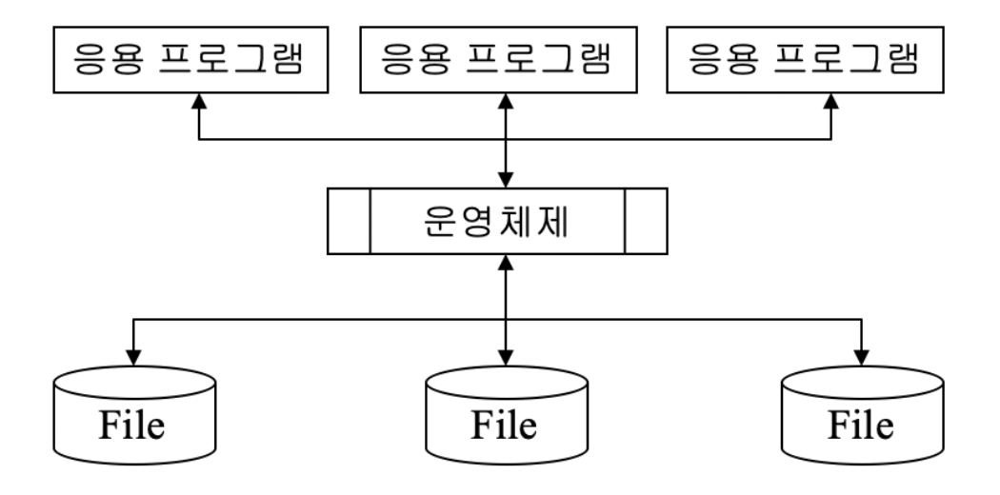
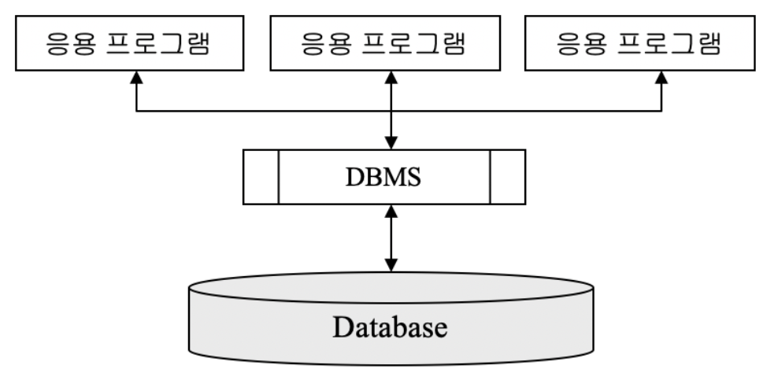

# 1. 관계형 데이터베이스의 주요 개념


## 데이터베이스의 역사


* ### 파일 시스템의 위기

  * 컴퓨터 발전의 역사 = 데이터 처리의 발전사
  
  * __EDPS__ (***E***lectronic ***D***ata ***P***rocessing ***S***ystem)
  	* 컴퓨터와 데이터 처리의 밀접한 관계를 보여줌
  
  * 제 1세대 컴퓨터 시스템
  
    * 소프트웨어나 저장장치 등의 개발이 부족
  
    * 주로 기술 분야의 계산, 자료 분류 등에 사용
  
    * 제 2세대 컴퓨터 시스템
      * 운영체제가 도입되고 FORTRAN(수치계산), COBOL(실무용_ 은행에서는 아직도 사용하고 있음) 등의 고급 언어 개발
      * 파일 시스템(file system)의 도입
      * 자료를 분석하고 처리하는 일에 본격적으로 사용되기 시작
      
      
  


****


* ### 파일 시스템의 위기

  

  * #### 데이터의 종속성

    - 데이터를 사용하는 프로그램의 구조가 데이터 구조 (파일 구조)의 영향을 받는다는 것을 의미
    - 데이터 종속성은 프로그램의 개발과 유지 보수를 어렵게 한다.

  * #### 데이터 무결성(data integrity)의 침해

    * 데이터 무결성이란?

        저장된 데이터의 내용이 본래 의도했던 데이터의 형식, 범위를 준수해야 한다는 성질

    * 예를 들어 학생정보 파일에서 

      * 나이(AGE) 필드는 숫자 형식이어야 하고 음수가 아닌 양수여야 한다.
      * 나이의 범위는 20~60 사이
    * 과거의 정보 시스템에서는 데이터 무결성을 지켜야 할 책임이 프로그래머에게 있었음

    * 정보화 사회에서는 인간의 삶이 많은 부분 컴퓨터 시스템에 저장된 데이터에 의존하고 있기 때문에 데이터 무결성의 침해는 매우 심각한 문제

  * #### 데이터의 중복성

    * 같은 내용의 데이터가 여러 곳에 중복하여 저장되는 것을 의미
    * 과거의 정보시스템에서는 개별 부서나 응용 프로그램에서 필요로 하는 데이터 파일을 각각 만들어 사용하는 일이 많았음
    * 저장 공간의 낭비 문제 발생
    * 데이터의 불일치, 보안의 어려움과 같은 문제들이 발생

  * #### 데이터의 불일치

    * 중복 저장된 데이터들이 서로 일치하지 않는 것을 의미

  * #### 데이터의 표준화의 어려움

    * 일정 규모 이상의 정보 시스템을 개발하기 위해서는 많은 수의 개발자들이 협력 작업 필요
      * 개발자A는 응용 프로그램에서 학생이름을 'S-NAME'으로, 길이는 20자리로 사용
      * 개발자B는 학생이름을 'SNME' 으로, 길이는 15 자리로 사용
    * 표준화가 되어 있지 않으면 제 3자가 프로그램을 이해하기도 어렵고 두 응용 프로그램간의 호환성에도 문제
    * 학생 이름을 지칭하고 표현하는 표준화된 규칙이 있다 ㅎ더라도 응용 프로그래머가 이를 지키지 않을 수 있음

  * #### 데이터 보안성(data security)의 결여

    * 데이터가 저장되어 있는 파일은 그 내용이 Text 형식이나 잘 알려진 형식으로 저장되기 때문에 응용 프로그램이 없이도 쉽게 파일을 열어 내용을 볼 수 가 있음
    * 파일의 공유ㅠ를 위해 접긍니 쉬운 위치에 파일을 저장했기 때문에 보안 유지가 어려움
    * 현대의 정보 시스템에는 기업의 영업 비밀이나 고객의 사생활 정보와 같은 보안을 필요로 하는 데이터가 많이 저장
    * 보안성의 결여는 심각한 문제임


****


* ### 데이터베이스의 등장

  * 파일 시스템의 단점을 극복하면서도 다수의 사용자들이 정보를 공유할 수 있어야 한다는 요구에 따라 제안

  * 데이터베이스의 철학

    * 파일형태로 여기저기에 흩어져 있는 데이터 정보들을 하나로 모아 관리
    * 모아놓은 데이터들을 관리하고 사용자(응용 프로그램)와 데이터 사이에 인터페이스 역할을 할 수 있는 S/W를 제공
    * 초기에는 계층형(hierarchical)데이터 베이스, 네트워크형(),,,,,,, 추가 요망

    

  

  

****


* ### 데이터 베이스의 특징

  * #### 데이터 독립성(independency) 지원

    * 사용자 혹은 응용 프로그램이 직접 데이터베이스에 접근 할 수 없고 반드시 DBMS를 통해서만 접근 가능
    * DBMS는 데이터베이스 내에 있는 데이터의 물리적, 논리적 변화가 응용 시스템에 영향을 미치지 않도록 함으로써 데이터 독립성을 보장

  * #### 데이터 무결성 유지

    * DBMS가 무결성을 위반하는 데이터가 들어올 경우 처리를 거절함으로써 데이터의 무결성을 지원

  * #### 데이터 중복성 및 불일치 최소화

    - 데이터베이스 내의 데이터는 한 개인의 관점이나 특정 부서의 관점에서 관리되는 것이 아니라 데이터베이스를 공용하는 조직 전체의 관점에서 관리
    - 동일 데이터가 여러 부서에서 사용하는 경우 이를 하나로 관리함으로써 중복성 방지

  * #### 데이터 표준화의 용이성

    - **데이터베이스 관리자(DBA)**가 설계과정을 주도함으로써 부서간 이해를 조정하고 관리될 데이터를 표준화시킴
    - 응용 프로그램에서 데이터에 접근하기 위해서는 DBMS가 가지고 있는 구조 정보에 따라야 하기 때문에 자연스럽게 표준화됨

  * #### 높은 데이터 보안성

    - DBMS는 사용자의 권한에 따라 데이터베이스 내에 있는 데이터에 대한 접근을 제한할 수 있음
    - 저장된 데이터베이스는 일반적으로 DBMS를 통하지 않고는 외부에서 내용을 알아내기 매우 어려움

  * #### 데이터 공유(data sharing)의 용이성

    - 데이터베이스 시스템의 기본 철학이 데이터를 통합 관리하고 이를 여러 부서, 사용자들이 공유하도록 하는 것
    - DBMS는 여러 사용자의 요구를 동시적으로 처리할 수 있는 능력을 가지고 있음
    - DBMS는 데이터를 쉽게 이용할 수 있는 수단을 제공함


****


## 관계형 데이터베이스(RDBMS)

* ### 관계형 데이터 베이스

  * 현재 가장 많이 사용되는 데이터베이스 모델

  * 데이터가 테이블 형태로 표현되며, 사용자가 데이터를 쉽게 다룰 수 있도록 해주는 질의어 (SQL)를 제공

  * 테이블 형태로 표현된 데이터는 단순해서 누구나 쉽게 이해할 수 있음

  * SQL은 자연어에 가까운 문법을 가지고 있어서 배우기 쉽고, 데이터를 어떻게(HOW) 가져올 것인가 대신에 어떤(WHAT) 데이터를 원하는지만 기술해주면 되기 때문에 사용자나 개발자의 입장에서는 데이터를 다루는 작업이 매우 단순해짐

  * SQL 명령어나 문법은 표준화 되어 있기 때문에 대부분의 명령어는 모든 관계형 데이터베이스 제품에서 공통적으로 사용가능

    ****

* ### 관계형 데이터베이스 용어

  ### 	

  * #### 릴레이션(relation)

    - 테이블이라는 용어로 더 많이 사용.
    - 관계형 데이테베이스에서 정보를 구분하여 저장하는 기본 단위
      - STUDENT 릴레이션 : 학생에 관한 정보를 저장
      - SUBJECT라는 릴레이션 : 과목에 대한 정보를 저장
    - 동일한 데이터베이스 내에서는 같은 이름을 갖는 릴레이션이 존재할 수 없다

  * #### 속성(attribute)

    - 릴레이션에서 관리하는 구체적인 정보 항목에 해당하는 것이 속성
    - 현실세계의 개체(예: 학생, 교수, 과목,...)들은 많은 속성들을 갖는데 그중에서 관리해야할 필요가 있는 속성들만을 선택하여 릴레이션에 포함시킴
    - 속성 역시 고유한 이름을 갖으며 동일 릴레이션 내에서는 같은 이름의 속성이 존재할 수 없음

  * #### 튜플(tuple)

    - 릴레이션이 현실세계의 어떤 개체를 표현한다면 튜플은 그 개체에 속한 구성원들 개개의 정보를 표현
    - 예) 학생은 개체를 나타내는 이름이고 **‘김철수’**, **‘박선하’**, **‘안미희’**,.. 등은 **‘학생’** 개체의 구성원
    - 한 릴레이션에 포함된 튜플의 개수는 시간에 따라 변할 수 있으며, 한 릴레이션은 적게는 수십 개 많게는 수십만 개의 튜플을 포함할 수 있음

  * #### 도메인(domain)

    - 도메인이란 릴레이션에 포함된 각각의 속성들이 갖을 수 있는 값들의 집합

    - 도메인이라는 개념이 필요한 이유는 릴레이션에 저장되는 데이터 값들이 본래 의도했던 값들만 저장되고 관리되도록 하는데 있음

      - 예)'**성별'**이라는 속성이 있다면 이 속성이 가질 수 있는 값은 {남,여}.

        데이터베이스 설계자는 성별의 도메인으로 **'SEX'**를 정의하고 그 값으로 {남,여}를 지정한 뒤, **'성별'** 이라는 속성은 **'SEX'** 도메인에 있는 값만을 갖을 수 있다고 지정해 놓으면 사용자들이 실수로 남,여 이외의 값을 입력하는 것을 DBMS가 막을 수 있음

    - 현실적으로 도메인을 구현하는 것은 어렵기 때문에 대부분의 DBMS 제품에서는 사용자 정의 데이터 타입으로 사용

​				


****


## 기본키와 외래키

* ### 키의 필요성

  * 튜플의 중복 여부를 알아내기 위해서는 삽입하고자 하는 튜플과 이미 존재하는 모든 튜플을 일일이 비교해야 하는데 이는 비현실적임

  * 중복 여부를 효과적으로 알 수 있도록 하는 수단이 **'키(KEY)'** 임

  * ****

* ### 후보키(candidate key)

  * 테이블에서 각 튜플을 구별하는데 기준이 되는 하나 혹은 그 이상의 칼럼들의 집합

    (후보키는 테이블에 있는 각 튜플을 고유하게 식별할 수 있어야 한다.)

  * 튜플의 중복 여부 확인시 기존 튜플의 모든 칼럽값을 비교하는 대신 후보키 컬럼의 값만 비교한다.

  * #### 기본키(Primary key)

    * 후보키 중 튜플을 식별하는데 기준으로 사용할 키

  * #### 대체키(alternate key)

    *  후보키 중 기본키로 선택되지 않은 나머지 키

    

  * #### 복합키(Composite key)

    * 하나의 컬럼이 후보키의 역할을 하지 못하고 두개 이상의 컬럼이 합쳐져야 후보키의 역할을 하는 경우

    * ****

* ### 외래키(Foreign key)

  * 상호 관련이 있는 테이블들 사이에서 데이터의 일관성을 보장해 주는 수단이 외래키이다.

  * 두 테이블 간에 외래키에 의한 참조관계에 있다면 두 테이블 간 데이터 불일치가 발생하는 상황이 되면 DBMS는 다음과 같은 조치를 취할 수 있다.

    * 제한(**RESTRICT**)
    * 연쇄(**CASCADE**)
    * 널값으로 대체(**NULLIFY**)

  * 다음 슬라이드에서 사원 테이블의 부서번호(deptid)는 부서정보 테이블의 부서번호(deptid)를 참조하는 

  * ****


## 뷰

* ### 뷰의 필요성

  * 하나의 테이블, 혹은 여러 테이블에 대하여 특정 사용자나 조직의 관점에서 데이터를 바라 수 있도록 해주는 수단 (생성 수정 삭제의 기능은 없다고 볼 수 있다.)

```SQL
CREATE VIEW __view name__
	AS SELECT __fields__
	FROM __table__
	WHERE __조건__
```

****

* ### 뷰를 사용하는 경우

  * 하나의 테이블을 서로 다른 관점으로 보기를 원할때
  * 테이블에서 민감한 데이터를 보안으로 감추고자 할때
  * 자주 사용하는 복잡한 질의문을 미리 뷰로 정의하여 간편하게 쓰고자 할때

****


## SQL 언어

* ### SQL 개요

  * 관계형 데이터베이스의 장점중의 하나는 사용자들이 쉽ㅂ게 사용할 수 있는 **SQL**(***S***tructured ***Q***uery ***L***anguage) 언어를 제공한다는 것

  * 사용자는 간단한 SQL 문을 사용하여 DBMS에게 작업을 요청

  * 기본적인 SQL 문들은 표준화 되어 있기 때문에 거의 대부분의 DBMS 제품에 동일하게 적용

  * SQL은 1974년 IBM 연구소에서 System R 프로젝트를 통해 개발 되었고 1986년 미국 표준기구 ANSI에서 SQL표준을 재정

  * SQL 언어는 비절차적 언어(non-procedural language) : 사용자는 자신이 원하는 바만을 명시하며, 원하는 바를 DBMS가 어떻게 처리할지는 명시할 필요가 없음

  * #### SQL의 두가지 사용 방식

    - **대화식 SQL** : DBMS 회사에서 제공하는 유틸리티 프로그램(예: ORACLE의 SQL*Plus)을 이용하여 사용자가 직접 SQL문을 입력하고 실행결과를 확인하는 방식
    - **내장 SQL** : SQL문이 C, Java와 같은 프로그램 안에 포함되어져서 사용되는 방식

    

    ****

* ### SELECT

  ```SQL
  # 급여가 300을 넘고 담당업무가 영업관리인 사원의 모든 정보를 보이시오
  
  SELECT * 
      FROM   emp 
      WHERE salary > 300 AND job = '영업관리' ;
  ```

   ```sql
   # 부서 번호와 그 부서에 속한 사원들의 급여액 합계를 보이시오
   
   SELECT deptid, SUM(salary)
       FROM   emp 
       GROUP BY deptid ;				# GROUP BY를 통해 하나로 묶어서 사용할 수 있다.
   ```

  ```SQL
  # 모든 사원들의 이름과, 부서이름을 보이시오
  
  SELECT emp.ename, dept.name 
      FROM   emp, dept 
      WHERE emp.deptid = dept.deptid ;    # table.field 의 경우 해당 테이블 안의 필드를 의미한다.
  ```

  ```SQL
  # 곽희준 사원이 속한 부서의 예산은 얼마인가
  
  SELECT d.name 
      FROM   emp e, dept d
      WHERE  e.deptid = d.deptid 
      AND     e.ename = '곽희준';
  ```

  

* INSERT  

  일부 컬럼을 생략하고 튜플을 삽입하는 경우, 생략된 컬럼들의 값은 null 로 저장된다

  ```sql
  INSERT INTO emp (empid, ename, deptid, hire_date, job, salary) 
  	VALUES (106, ‘강윤호’, 200, ‘2001-01-10’, ‘연말정산’, 400);
  ```

  ```SQL
  INSERT INTO emp (empid, ename, salary) 
      VALUES (107, ‘남진선’, 500);
  ```

  
