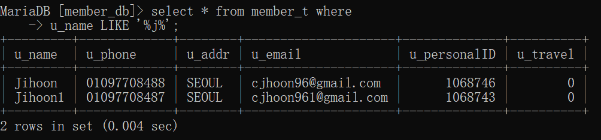

# 1. HTML + PHP + DB

```
<!doctype html>
<html> 
  <head>
    <title>test</title>
    <link rel="stylesheet" href="style.css">
  </head>

  <body>
    <?php
      echo("이게보입니까?");
    ?>
    <h1>test</h1>
    <br>
    <a href = "https://www.naver.com">  NAVER </a>
  </body>
</html>
```


* ### 확장자 명을 html로 한 경우


* ### 확장자명을 php로 한 경우

  

확장자 명을 html으로 한경우 php 부분을 자동으로 주석처리 하여 화면에 뜨지 않는 것을 볼 수 있다.


* ### index3.php

  ```php+HTML
  <!doctype html>
  <html> 
    <head>
      <title>test</title>
      <link rel="stylesheet" href="style.css">
    </head>
  
    <body>
    <?php
      $data = 12345;            // variable
      echo("<font size=7 color=blue> 데이터는 </font>" . $data . "입니다.");
  
      echo("<hr size=2>");
      echo("<font size=7 color=blue> 이게보입니까? </font>");
      echo("<hr size=2>")
    ?>
    <h1>test</h1>
    <br>
    <a href = "https://www.naver.com">  NAVER </a>
    </body>
  </html>
  ```

  

* ### 연산자

  ```php+HTML
  <?php
      echo("<hr size=2>");
      $data = 12345;            // variable
      $data2 = 3;
      $result = $data - $data2;
      $div_1 = 7;
      $div_2 = 3;
      $div_rst = $div_1 / $div_2;
      $ceil = ceil($div_rst);
  
      echo("<font size=7 color=blue>");
      echo("데이터는" . $data . "입니다.<br>");
      echo("결과는" . $result . "입니다.<br>");
      echo("나누기 결과는" . $div_rst . "입니다.<br>");
      echo("div_rst의 올림은" . $ceil . "입니다.<br>");
  
  
      echo("이게보입니까?<br>");
      echo("<hr size=2>")
    ?>
  ```

  

* ### 실습: 회원가입 양식 만들기

  * 버튼은 회원가입 이라는 텍스트가 쓰옂 있다.

  * 누르면, member_register.php 페이지로 데이터를 보내게 된다.

    ```html
    <form action="member_register.php" method="POST">  <!--action에는 url이 들어간다.-->
      <input type="submit" value="회원가입">
    </form>
    ```

    

    

  * 페이지 상단에는 큼지막한 h1 태그로 회원가입이라고 보여준다.

  * 페이지의 가장 하단에는 작은 h5 or h6 태그로 회사정보를 적어줌

  * 입력해야하는 회원정보는 아래와 같다.

    * 회원이름 text
    * 전화번호 number
    * 이메일주소 text
    * 주민등록번호 뒷자리 number

  * 페이지의 타이틀은 member_register, 파일 이름은 "member-register.html" 이다.

  * 접속 종료

    
  
  ``` html
  <!doctype html>
  <html> 
    <head>
      <title>member_register</title>
      <meta charset = "utf-8">
      <link rel="stylesheet" href="style.css">
    </head>
  
    <body>
      <header>
        <h1>회원가입</h1>
      </header>
      
  
  
      <section>
        <form action="member_register.php" method="get">
         
          회원이름<br>
          <input type="text" name="u_name_box"> 
          <br><br>
  
          주소<br>
          <input type="text" name="u_addr_box"> 
          <br><br>
          
          이메일주소<br>
          <input type="text" name="u_email_box"> 
          <br><br>
          
          연락처<br>
          <input type="text" name="u_phone_box">
          <br><br> 
  
          주민등록번호<br>
          <input type="number" name="u_personalID_box">
          <br><br><br>
          
          14일 이내에 국외 여행을 다녀오신적 있으십니까?
          <br>
          yes<input type="radio" name="u_travel_box" value = "yes">
          <br>
          no<input type="radio" name="u_travel_box" value = "no">
          <br>
          <br><br><br>
          
          <input type="submit" value="회원가입">
  
        </form>
      </section>
  
  
  
      <footer>
        <h5>Copyright, 010-0000-0000</h5><br>
        <h6>대표:Jihoon Chae</h6>
      </footer>
    </body>
  </html>
  ```

  __member_register.html__
  
  ```php
  <html>
      <head>
          <meta charset="utf-8">
  				<link rel="stylesheet" href="style.css">
      </head>
      <body>
          <?php
          //$u_name = $_POST["u_name_box"];   //get에서 "u_name_box" 데이터만 만 꺼내라
          // $u_addr = $_POST["u_addr_box"];
          // $u_email = $_POST["u_email_box"];
          // $u_phone = $_POST["u_phone_box"];
          // $u_personalID = $_POST["u_personalID_box"];
          // $u_travel = $_POST["u_travel_box"];
          
          $u_name = $_GET["u_name_box"];      //get에서 "u_name_box" 데이터만 만 꺼내라
          $u_addr = $_GET["u_addr_box"];
          $u_email = $_GET["u_email_box"];
          $u_phone = $_GET["u_phone_box"];
          $u_personalID = $_GET["u_personalID_box"];
  				$u_travel = $_GET["u_travel_box"];
  				$data = array($u_name, $u_addr, $u_email, $u_phone, $u_personalID, $u_travel)
  
  				function empty_check($data){
  					if 
  				}
          
          echo("보아나?"); 
          ?>
  
  
          <table border="2">
  					<tr>
  						<th colspan=2 scope="rowgroup">[회원정보]</th>
  					</tr>
  
            <tr>
              <td>u_name</td>
              <td><?=$u_name?></td>
            </tr>
  
            <tr>
              <td>u_addr</td>
              <td><?=$u_addr?></td>
            </tr>
            
            <tr>
              <td>u_email</td>
              <td><?=$u_email?></td>
            </tr>
  
            <tr>
              <td>u_phone</td>
              <td><?=$u_phone?></td>
            </tr>
            
            <tr>
              <td>u_personalID</td>
              <td><?=$u_personalID?></td>
            </tr>
  
            <tr>
              <td>u_travel</td>
              <td><?=$u_travel?></td>
            </tr>
          </table>
      </body>
  </html>
  ```
  
  __member_register.php__


* ## 실습 : db 연결해 보기

  * 데이터베이스로 하고 싶은 작업

  * 우리가 만든 데이터베이스의 테이블에 뭔가를 저장하고 싶다.

  * temp_db 안에 temp_t 테이블이 있다. 여기에 데이터를 저장한다.
  * 테이블 이름수정 --> 테이블의 칸(컬럼or필드)의 이름이 틀림
  *  테이블 칸 수가 안맞음

  ```php
  <?php
  // 데이터베이스 접속
  $conn = mysqli_connect("localhost", "root", "", "temp_db");
  
  
  // $search_result = mysqli_query($connect_no, "SLELCT * FROM login_t");
  
  $result = mysqli_query($conn, 
                          "INSERT INTO temp_t (u_name, u_addr, u_phone)
                          VALUES ('superuser', 'SEOUL', '01099999999')" );
  $result = mysqli_query($conn, 
                          "INSERT INTO temp_t (u_name, u_addr, u_phone)
                          VALUES ('superman', 'SEOUL', '01099999999')" );                        
  
  mysqli_close($conn);
  
  ?>
  ```

  

* ### 실습 : 회원가입 mini

  * 유저가 데이터를 입력해서 보낸다. (html파일. 입력양식)

    * 입력양식을 만들어 주에요

      * 이름, 전화번호, 주소를 입력하는 상자.
      * 전송버튼

      

  * 웹서버가 전달을 받는다.

    * 입력양식접속 (http://localhost/member_reg.html)
    * 응답하는페이지 (member_reg.php)

    

  * 웹서버와 연동된 프로그래밍언어가 작동된다. (우리는 php)

    * 전달받은 데이터를 일단 화면에 출력해준다. (검사)
    * 전달받은 데이터들을 모두 데이터베이스의 테이블에 저장해준다.

    

  * 프로그래밍 언어가 데이터를 DATABASE에 저장한다.

  * 접속 종료

  * CMD창에서 SELECT 를 이용해서 잘 저장되었나 확인한다.

  * 변수을 DB에 넣을 때에는 '{변수}' 식으로 중괄호로 묶어준다.

  #### member_reg.html
  
  ```html
  <!doctype html>
  <html> 
    <head>
      <title>member_reg</title>
      <meta charset = "utf-8">
      <link rel="stylesheet" href="style.css">
    </head>
  
    <body>
      <header>
        <h1>회원가입</h1>
      </header>
      
  
  
      <section>
        <form action="member_reg.php" method="get">
         
          회원이름<br>
          <input type="text" name="u_name_box"> 
          <br><br>
  
          연락처<br>
          <input type="text" name="u_phone_box">
          <br><br> 
  
          주소<br>
          <input type="text" name="u_addr_box"> 
          <br><br>
           
          <input type="submit" value="회원가입">
  
        </form>
      </section>
        
    </body>
  </html>

  ```

  #### member_reg.php
  
  ```php
  <html>
      <head>
          <meta charset="utf-8">
  				<link rel="stylesheet" href="style.css">
      </head>
      <body>
          <?php
      
          $u_name = $_GET["u_name_box"];      //get에서 "u_name_box" 데이터만 만 꺼내라
          $u_addr = $_GET["u_addr_box"];
          $u_phone = $_GET["u_phone_box"];
  
          $conn = mysqli_connect("localhost", "root", "", "temp_db");
  
          $result = mysqli_query($conn, 
                                  "INSERT INTO temp_t (u_name, u_addr, u_phone)
                                  VALUES ('{$u_name}', '{$u_addr}', '{$u_phone}')" );
  
          mysqli_close($conn);        
  
          ?>
  
  
          <table border="2">
  					<tr>
  						<th colspan=2 scope="rowgroup">[회원정보]</th>
  					</tr>
  
            <tr>
              <td>u_name</td>
              <td><?=$u_name?></td>
            </tr>
  
            <tr>
              <td>u_phone</td>
              <td><?=$u_phone?></td>
            </tr>
            
            <tr>
              <td>u_addr</td>
              <td><?=$u_addr?></td>
            </tr>
            
            <!-- <tr>
              <td>u_email</td>
              <td><?=$u_email?></td>
            </tr>
  
            <tr>
              <td>u_personalID</td>
              <td><?=$u_personalID?></td>
            </tr>
  
            <tr>
              <td>u_travel</td>
              <td><?=$u_travel?></td>
            </tr> -->
          </table>
      </body>
</html>
  ```

* ### 실습 : 회원가입 페이지 완성형

  * member_register.html 과 member_register.php 를 작동시키기 위한 데이터저장소를 만든다. (database and table)
  * 데이터베이스의 이름은 "member_db" , 테이블의 이름은 "member_t" 이다.
  * member_t 테이블에 들어갈 데이터들은 6가지 이고, 각각의 타입은 아래와 같다.
    * 회원이름 :	문자열  - 20글자까지 저장가능.
    * 연락처  :  문자열 - 15글자까지 저장가능.
    * 주소 : 문자열 - 50 글자까지 저장가능.
    * 이메일 : 문자열 - 50글자까지 저장가능.
    * 주민번호뒷자리 : 숫자 - int말고 가장 작은 숫자 형태
    * 국외여행여부 : Boolean 형태 - True/False (실제로는 1 / 0 으로 저장됨)

  #### member_register.html

  ```html
  <!doctype html>
  <html> 
    <head>
      <title>member_register</title>
      <meta charset = "utf-8">
      <link rel="stylesheet" href="style.css">
    </head>
  
    <body>
      <header>
        <h1>회원가입</h1>
      </header>
      
  
  
      <section>
        <form action="member_register.php" method="get">
         
          회원이름<br>
          <input type="text" name="u_name_box"> 
          <br><br>
  
          주소<br>
          <input type="text" name="u_addr_box"> 
          <br><br>
          
          이메일주소<br>
          <input type="text" name="u_email_box"> 
          <br><br>
          
          연락처<br>
          <input type="text" name="u_phone_box">
          <br><br> 
  
          주민등록번호<br>
          <input type="number" name="u_personalID_box">
          <br><br><br>
          
          14일 이내에 국외 여행을 다녀오신적 있으십니까?
          <br>
          yes<input type="radio" name="u_travel_box" value = "yes">
          <br>
          no<input type="radio" name="u_travel_box" value = "no">
          <br>
          <br><br><br>
           
          <input type="submit" value="회원가입">
  
        </form>
      </section>
  
  
  
      <footer>
        <h5>Copyright, 010-0000-0000</h5><br>
        <h6>대표:Jihoon Chae</h6>
      </footer>
    </body>
  </html>
  
  ```

  #### member_register.php

  ```php+HTML
  <html>
      <head>
          <meta charset="utf-8">
  				<link rel="stylesheet" href="style.css">
      </head>
      <body>
          <?php
          //$u_name = $_POST["u_name_box"];   //get에서 "u_name_box" 데이터만 만 꺼내라
          // $u_addr = $_POST["u_addr_box"];
          // $u_email = $_POST["u_email_box"];
          // $u_phone = $_POST["u_phone_box"];
          // $u_personalID = $_POST["u_personalID_box"];
          // $u_travel = $_POST["u_travel_box"];
          
          $u_name = $_GET["u_name_box"];      //get에서 "u_name_box" 데이터만 만 꺼내라
          $u_addr = $_GET["u_addr_box"];
          $u_email = $_GET["u_email_box"];
          $u_phone = $_GET["u_phone_box"];
          $u_personalID = $_GET["u_personalID_box"];
  				$temp_u_travel = $_GET["u_travel_box"];
  
          if($temp_u_travel == "yes"){
            $u_travel = 1;
          } else{
            $u_travel = 0;
          }
          $conn = mysqli_connect("localhost", "root", "", "member_db");
  
          mysqli_query($conn, 
                      "INSERT INTO member_t (u_name, u_phone, u_addr, u_email, u_personalID, u_travel)
                      VALUES ('{$u_name}', '{$u_phone}', '{$u_addr}', '{$u_email}', '{$u_personalID}', '{$u_travel}')" );
          ?>
  
  
          <table border="2">
  					<tr>
  						<th colspan=2 scope="rowgroup">[회원정보]</th>
  					</tr>
  
            <tr>
              <td>u_name</td>
              <td><?=$u_name?></td>
            </tr>
  
            <tr>
              <td>u_addr</td>
              <td><?=$u_addr?></td>
            </tr>
            
            <tr>
              <td>u_email</td>
              <td><?=$u_email?></td>
            </tr>
  
            <tr>
              <td>u_phone</td>
              <td><?=$u_phone?></td>
            </tr>
            
            <tr>
              <td>u_personalID</td>
              <td><?=$u_personalID?></td>
            </tr>
  
            <tr>
              <td>u_travel</td>
              <td><?=$u_travel?></td>
            </tr>
          </table>
      </body>
  </html>
  ```

  

