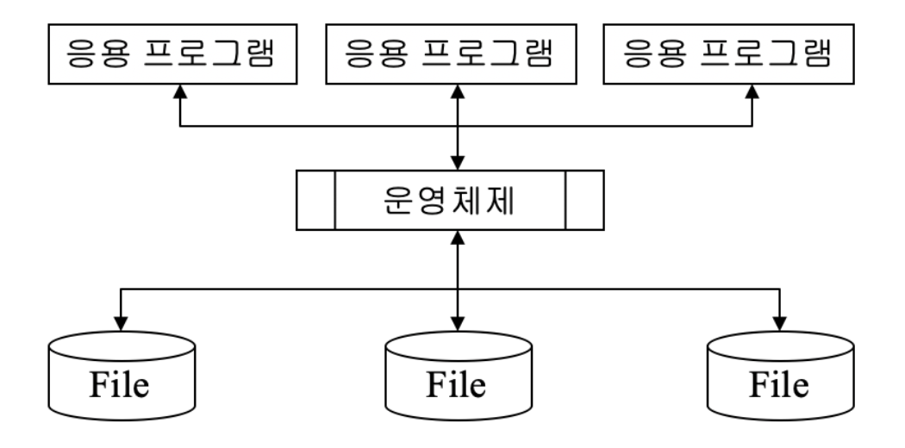
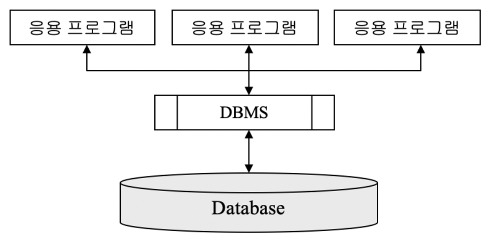
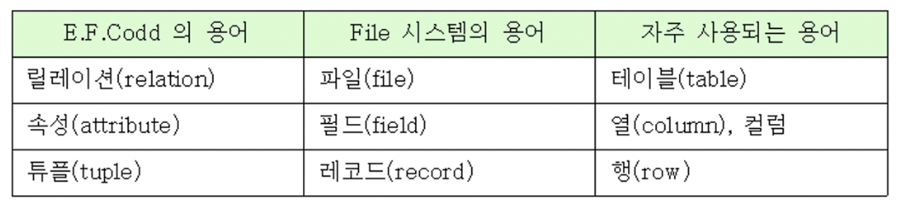
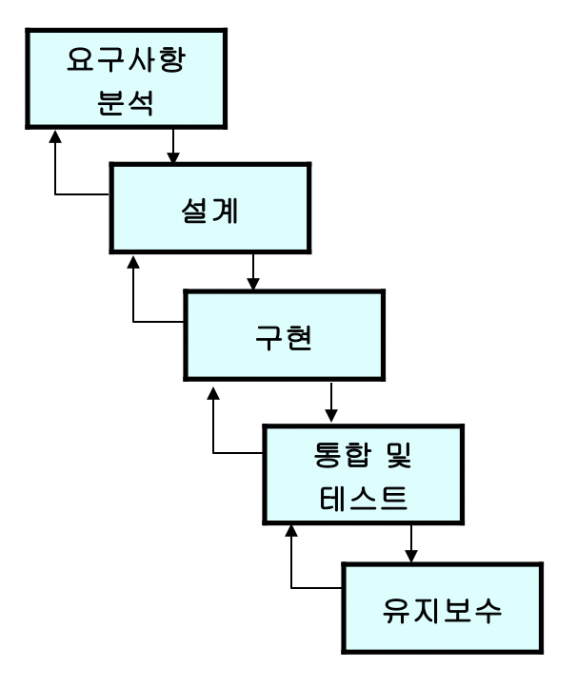
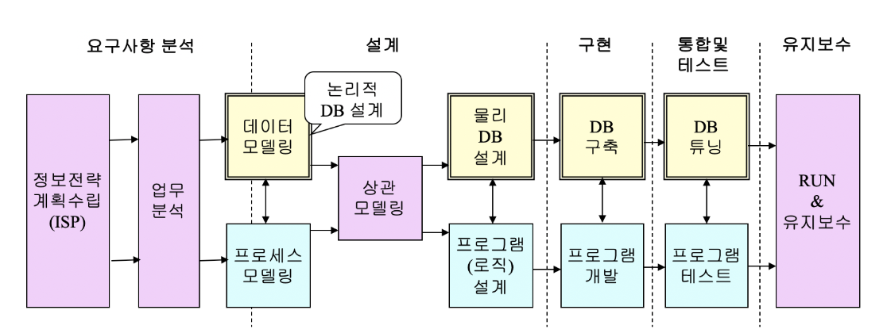
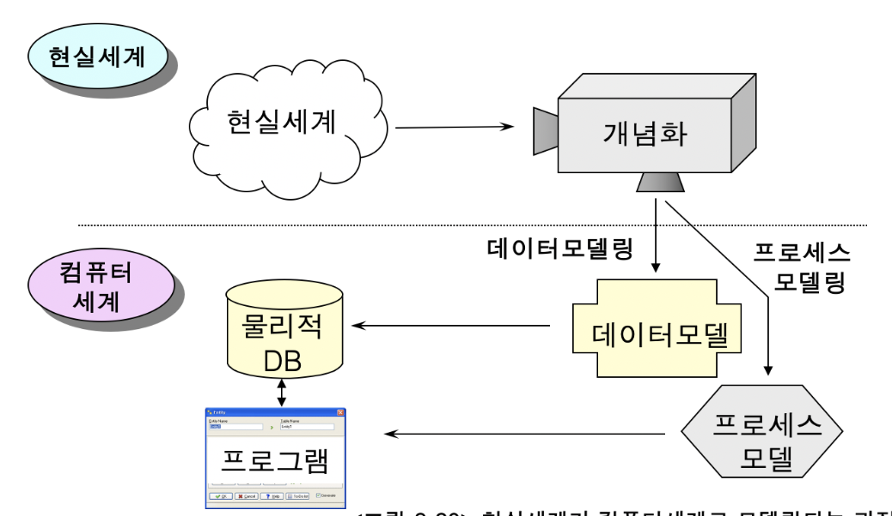
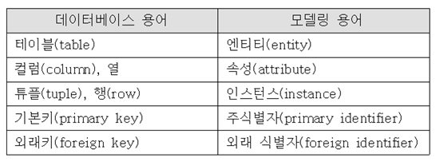
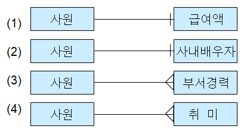
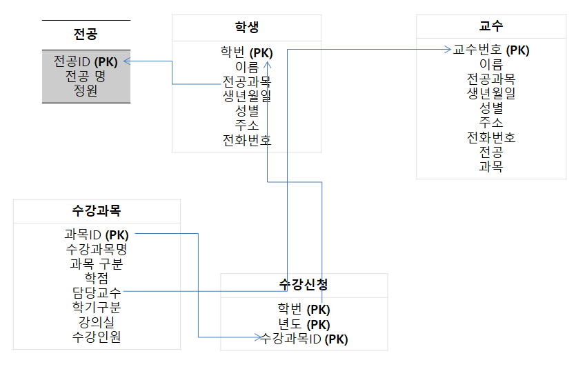

# 1. 관계형 데이터베이스의 주요 개념


## 데이터베이스의 역사


* ### 파일 시스템의 위기

  * 컴퓨터 발전의 역사 = 데이터 처리의 발전사
  
  * __EDPS__ (***E***lectronic ***D***ata ***P***rocessing ***S***ystem)
  	* 컴퓨터와 데이터 처리의 밀접한 관계를 보여줌
  
  * 제 1세대 컴퓨터 시스템
  
    * 소프트웨어나 저장장치 등의 개발이 부족
  
    * 주로 기술 분야의 계산, 자료 분류 등에 사용
  
    * 제 2세대 컴퓨터 시스템
      * 운영체제가 도입되고 FORTRAN(수치계산), COBOL(실무용_ 은행에서는 아직도 사용하고 있음) 등의 고급 언어 개발
      * 파일 시스템(file system)의 도입
      * 자료를 분석하고 처리하는 일에 본격적으로 사용되기 시작
      
      
  


****


* ### 파일 시스템의 위기

  

  * #### 데이터의 종속성

    - 데이터를 사용하는 프로그램의 구조가 데이터 구조 (파일 구조)의 영향을 받는다는 것을 의미
    - 데이터 종속성은 프로그램의 개발과 유지 보수를 어렵게 한다.

  * #### 데이터 무결성(data integrity)의 침해

    * 데이터 무결성이란?

        저장된 데이터의 내용이 본래 의도했던 데이터의 형식, 범위를 준수해야 한다는 성질

    * 예를 들어 학생정보 파일에서 

      * 나이(AGE) 필드는 숫자 형식이어야 하고 음수가 아닌 양수여야 한다.
      * 나이의 범위는 20~60 사이
    * 과거의 정보 시스템에서는 데이터 무결성을 지켜야 할 책임이 프로그래머에게 있었음

    * 정보화 사회에서는 인간의 삶이 많은 부분 컴퓨터 시스템에 저장된 데이터에 의존하고 있기 때문에 데이터 무결성의 침해는 매우 심각한 문제

  * #### 데이터의 중복성

    * 같은 내용의 데이터가 여러 곳에 중복하여 저장되는 것을 의미
    * 과거의 정보시스템에서는 개별 부서나 응용 프로그램에서 필요로 하는 데이터 파일을 각각 만들어 사용하는 일이 많았음
    * 저장 공간의 낭비 문제 발생
    * 데이터의 불일치, 보안의 어려움과 같은 문제들이 발생

  * #### 데이터의 불일치

    * 중복 저장된 데이터들이 서로 일치하지 않는 것을 의미

  * #### 데이터의 표준화의 어려움

    * 일정 규모 이상의 정보 시스템을 개발하기 위해서는 많은 수의 개발자들이 협력 작업 필요
      * 개발자A는 응용 프로그램에서 학생이름을 'S-NAME'으로, 길이는 20자리로 사용
      * 개발자B는 학생이름을 'SNME' 으로, 길이는 15 자리로 사용
    * 표준화가 되어 있지 않으면 제 3자가 프로그램을 이해하기도 어렵고 두 응용 프로그램간의 호환성에도 문제
    * 학생 이름을 지칭하고 표현하는 표준화된 규칙이 있다 ㅎ더라도 응용 프로그래머가 이를 지키지 않을 수 있음

  * #### 데이터 보안성(data security)의 결여

    * 데이터가 저장되어 있는 파일은 그 내용이 Text 형식이나 잘 알려진 형식으로 저장되기 때문에 응용 프로그램이 없이도 쉽게 파일을 열어 내용을 볼 수 가 있음
    * 파일의 공유ㅠ를 위해 접긍니 쉬운 위치에 파일을 저장했기 때문에 보안 유지가 어려움
    * 현대의 정보 시스템에는 기업의 영업 비밀이나 고객의 사생활 정보와 같은 보안을 필요로 하는 데이터가 많이 저장
    * 보안성의 결여는 심각한 문제임


****


* ### 데이터베이스의 등장

  * 파일 시스템의 단점을 극복하면서도 다수의 사용자들이 정보를 공유할 수 있어야 한다는 요구에 따라 제안

  * 데이터베이스의 철학

    * 파일형태로 여기저기에 흩어져 있는 데이터 정보들을 하나로 모아 관리
    * 모아놓은 데이터들을 관리하고 사용자(응용 프로그램)와 데이터 사이에 인터페이스 역할을 할 수 있는 S/W를 제공
    * 초기에는 계층형(hierarchical)데이터 베이스, 네트워크형(),,,,,,, 추가 요망

    

  

  

****


* ### 데이터 베이스의 특징

  * #### 데이터 독립성(independency) 지원

    * 사용자 혹은 응용 프로그램이 직접 데이터베이스에 접근 할 수 없고 반드시 DBMS를 통해서만 접근 가능
    * DBMS는 데이터베이스 내에 있는 데이터의 물리적, 논리적 변화가 응용 시스템에 영향을 미치지 않도록 함으로써 데이터 독립성을 보장

  * #### 데이터 무결성 유지

    * DBMS가 무결성을 위반하는 데이터가 들어올 경우 처리를 거절함으로써 데이터의 무결성을 지원

  * #### 데이터 중복성 및 불일치 최소화

    - 데이터베이스 내의 데이터는 한 개인의 관점이나 특정 부서의 관점에서 관리되는 것이 아니라 데이터베이스를 공용하는 조직 전체의 관점에서 관리
    - 동일 데이터가 여러 부서에서 사용하는 경우 이를 하나로 관리함으로써 중복성 방지

  * #### 데이터 표준화의 용이성

    - **데이터베이스 관리자(DBA)**가 설계과정을 주도함으로써 부서간 이해를 조정하고 관리될 데이터를 표준화시킴
    - 응용 프로그램에서 데이터에 접근하기 위해서는 DBMS가 가지고 있는 구조 정보에 따라야 하기 때문에 자연스럽게 표준화됨

  * #### 높은 데이터 보안성

    - DBMS는 사용자의 권한에 따라 데이터베이스 내에 있는 데이터에 대한 접근을 제한할 수 있음
    - 저장된 데이터베이스는 일반적으로 DBMS를 통하지 않고는 외부에서 내용을 알아내기 매우 어려움

  * #### 데이터 공유(data sharing)의 용이성

    - 데이터베이스 시스템의 기본 철학이 데이터를 통합 관리하고 이를 여러 부서, 사용자들이 공유하도록 하는 것
    - DBMS는 여러 사용자의 요구를 동시적으로 처리할 수 있는 능력을 가지고 있음
    - DBMS는 데이터를 쉽게 이용할 수 있는 수단을 제공함


****

****


## 관계형 데이터베이스(RDBMS)

* ### 관계형 데이터 베이스

  * 현재 가장 많이 사용되는 데이터베이스 모델
  * 데이터가 테이블 형태로 표현되며, 사용자가 데이터를 쉽게 다룰 수 있도록 해주는 질의어 (SQL)를 제공
  * 테이블 형태로 표현된 데이터는 단순해서 누구나 쉽게 이해할 수 있음
  * SQL은 자연어에 가까운 문법을 가지고 있어서 배우기 쉽고, 데이터를 어떻게(HOW) 가져올 것인가 대신에 어떤(WHAT) 데이터를 원하는지만 기술해주면 되기 때문에 사용자나 개발자의 입장에서는 데이터를 다루는 작업이 매우 단순해짐
  * SQL 명령어나 문법은 표준화 되어 있기 때문에 대부분의 명령어는 모든 관계형 데이터베이스 제품에서 공통적으로 사용가능


****

* ### 관계형 데이터베이스 용어

	

  * #### 릴레이션(relation)

    - 테이블이라는 용어로 더 많이 사용.
    - 관계형 데이테베이스에서 정보를 구분하여 저장하는 기본 단위
      - STUDENT 릴레이션 : 학생에 관한 정보를 저장
      - SUBJECT라는 릴레이션 : 과목에 대한 정보를 저장
    - 동일한 데이터베이스 내에서는 같은 이름을 갖는 릴레이션이 존재할 수 없다

  * #### 속성(attribute)

    - 릴레이션에서 관리하는 구체적인 정보 항목에 해당하는 것이 속성
    - 현실세계의 개체(예: 학생, 교수, 과목,...)들은 많은 속성들을 갖는데 그중에서 관리해야할 필요가 있는 속성들만을 선택하여 릴레이션에 포함시킴
    - 속성 역시 고유한 이름을 갖으며 동일 릴레이션 내에서는 같은 이름의 속성이 존재할 수 없음

  * #### 튜플(tuple)

    - 릴레이션이 현실세계의 어떤 개체를 표현한다면 튜플은 그 개체에 속한 구성원들 개개의 정보를 표현
    - 예) 학생은 개체를 나타내는 이름이고 **‘김철수’**, **‘박선하’**, **‘안미희’**,.. 등은 **‘학생’** 개체의 구성원
    - 한 릴레이션에 포함된 튜플의 개수는 시간에 따라 변할 수 있으며, 한 릴레이션은 적게는 수십 개 많게는 수십만 개의 튜플을 포함할 수 있음

  * #### 도메인(domain)

    - 도메인이란 릴레이션에 포함된 각각의 속성들이 갖을 수 있는 값들의 집합

    - 도메인이라는 개념이 필요한 이유는 릴레이션에 저장되는 데이터 값들이 본래 의도했던 값들만 저장되고 관리되도록 하는데 있음

      - 예)'**성별'**이라는 속성이 있다면 이 속성이 가질 수 있는 값은 {남,여}.

        데이터베이스 설계자는 성별의 도메인으로 **'SEX'**를 정의하고 그 값으로 {남,여}를 지정한 뒤, **'성별'** 이라는 속성은 **'SEX'** 도메인에 있는 값만을 갖을 수 있다고 지정해 놓으면 사용자들이 실수로 남,여 이외의 값을 입력하는 것을 DBMS가 막을 수 있음

    - 현실적으로 도메인을 구현하는 것은 어렵기 때문에 대부분의 DBMS 제품에서는 사용자 정의 데이터 타입으로 사용




****

****


## 기본키와 외래키

* ### 키의 필요성

  * 튜플의 중복 여부를 알아내기 위해서는 삽입하고자 하는 튜플과 이미 존재하는 모든 튜플을 일일이 비교해야 하는데 이는 비현실적임
  * 중복 여부를 효과적으로 알 수 있도록 하는 수단이 **'키(KEY)'** 임


****

* ### 후보키(candidate key)

  * 테이블에서 각 튜플을 구별하는데 기준이 되는 하나 혹은 그 이상의 칼럼들의 집합

    (후보키는 테이블에 있는 각 튜플을 고유하게 식별할 수 있어야 한다.)

  * 튜플의 중복 여부 확인시 기존 튜플의 모든 칼럽값을 비교하는 대신 후보키 컬럼의 값만 비교한다.

  * #### 기본키(Primary key)

    * 후보키 중 튜플을 식별하는데 기준으로 사용할 키

  * #### 대체키(alternate key)

    *  후보키 중 기본키로 선택되지 않은 나머지 키

    

  * #### 복합키(Composite key)

    * 하나의 컬럼이 후보키의 역할을 하지 못하고 두개 이상의 컬럼이 합쳐져야 후보키의 역할을 하는 경우

      

****

* ### 외래키(Foreign key)

  * 상호 관련이 있는 테이블들 사이에서 데이터의 일관성을 보장해 주는 수단이 외래키이다.

  * 두 테이블 간에 외래키에 의한 참조관계에 있다면 두 테이블 간 데이터 불일치가 발생하는 상황이 되면 DBMS는 다음과 같은 조치를 취할 수 있다.

    * 제한(**RESTRICT**)
    * 연쇄(**CASCADE**)
    * 널값으로 대체(**NULLIFY**)

  * 다음 슬라이드에서 사원 테이블의 부서번호(deptid)는 부서정보 테이블의 부서번호(deptid)를 참조하는 

    

    

****

****


## 뷰

* ### 뷰의 필요성

  * 하나의 테이블, 혹은 여러 테이블에 대하여 특정 사용자나 조직의 관점에서 데이터를 바라 수 있도록 해주는 수단 (생성 수정 삭제의 기능은 없다고 볼 수 있다.)

```SQL
CREATE VIEW __view name__
	AS SELECT __fields__
	FROM __table__
	WHERE __조건__
```

****

* ### 뷰를 사용하는 경우

  * 하나의 테이블을 서로 다른 관점으로 보기를 원할때
  * 테이블에서 민감한 데이터를 보안으로 감추고자 할때
  * 자주 사용하는 복잡한 질의문을 미리 뷰로 정의하여 간편하게 쓰고자 할때

****

****


## SQL 언어

* ### SQL 개요

  * 관계형 데이터베이스의 장점중의 하나는 사용자들이 쉽ㅂ게 사용할 수 있는 **SQL**(***S***tructured ***Q***uery ***L***anguage) 언어를 제공한다는 것

  * 사용자는 간단한 SQL 문을 사용하여 DBMS에게 작업을 요청

  * 기본적인 SQL 문들은 표준화 되어 있기 때문에 거의 대부분의 DBMS 제품에 동일하게 적용

  * SQL은 1974년 IBM 연구소에서 System R 프로젝트를 통해 개발 되었고 1986년 미국 표준기구 ANSI에서 SQL표준을 재정

  * SQL 언어는 비절차적 언어(non-procedural language) : 사용자는 자신이 원하는 바만을 명시하며, 원하는 바를 DBMS가 어떻게 처리할지는 명시할 필요가 없음

  * #### SQL의 두가지 사용 방식

    - **대화식 SQL** : DBMS 회사에서 제공하는 유틸리티 프로그램(예: ORACLE의 SQL*Plus)을 이용하여 사용자가 직접 SQL문을 입력하고 실행결과를 확인하는 방식
    - **내장 SQL** : SQL문이 C, Java와 같은 프로그램 안에 포함되어져서 사용되는 방식

    

    ****

* ### SELECT

  ```SQL
  # 급여가 300을 넘고 담당업무가 영업관리인 사원의 모든 정보를 보이시오
  
  SELECT * 
      FROM   emp 
      WHERE salary > 300 AND job = '영업관리' ;
  ```

   ```sql
   # 부서 번호와 그 부서에 속한 사원들의 급여액 합계를 보이시오
   
   SELECT deptid, SUM(salary)
       FROM   emp 
       GROUP BY deptid ;				# GROUP BY를 통해 하나로 묶어서 사용할 수 있다.
   ```

  ```SQL
  # 모든 사원들의 이름과, 부서이름을 보이시오
  
  SELECT emp.ename, dept.name 
      FROM   emp, dept 
      WHERE emp.deptid = dept.deptid ;    # table.field 의 경우 해당 테이블 안의 필드를 의미한다.
  ```

  ```SQL
  # 곽희준 사원이 속한 부서의 예산은 얼마인가
  
  SELECT d.name 
      FROM   emp e, dept d
      WHERE  e.deptid = d.deptid 
      AND     e.ename = '곽희준';
  ```

  

* ### INSERT  

  일부 컬럼을 생략하고 튜플을 삽입하는 경우, 생략된 컬럼들의 값은 null 로 저장된다

  ```sql
  INSERT INTO emp (empid, ename, deptid, hire_date, job, salary) 
  	VALUES (106, ‘강윤호’, 200, ‘2001-01-10’, ‘연말정산’, 400);
  ```

  ```SQL
  INSERT INTO emp (empid, ename, salary) 
      VALUES (107, ‘남진선’, 500);
  ```

  일부 컬럼을 생략하고 삽입하는 경우, 생략된 칼럼들의 값은 null 로 저장된다.

* ### UPDATE

  ```sql
  # 홍성길 사원의 부서번호를 400으로, 급여를 500으로 변경하시오
  
  UPDATE emp 
      SET     deptid=400, salary=500 
      WHERE   ename='홍성길‘ ;
  ```

  ```SQL
  # 영업부에 속한 사원의 급여를 20% 인상하시오 
  
  UPDATE emp 
  SET     salary = salary*1.2  
      WHERE   deptid = (SELECT deptid					# SUBQUERY
                           FROM dept
                           WHERE dname = '영업부') ;
  ```

* ### DELETE

  ```SQL
  # 홍성길 사원의 정보를 사원정보에서 삭제하시오
  
  DELETE FROM emp 
  WHERE   ename='홍성길‘ ;
  ```

  

  ```SQL
  # 모든 사원의 정보를 사원정보에서 삭제하시오
  
  DELETE FROM emp ;
  ```

  삭제시 복구할 방법이 거의 없다 !! ___주의___

* ### CREATE

  ```SQL
  CREATE TABLE emp
      ( deptid int(10) NOT NULL, 
        dname char(20), 
        budget char(5), 
        PRIMARY KEY(deptid)		#deptid 를 Primary key 로 설정한다.
      );
  
  CREATE TABLE emp( 
  	empid int(10) NOT NULL, 
    ename char(20), 
    deptid int(5), 
    hire_date date, 
    job char(20), 
    salary int(10) NOT NULL,
    PRIMARY KEY(empid),
    FOREIGN KEY (deptid) REFERENCES dept(deptid)) ;
  ```


****

****

****


# 2. 정보시스템 구축 절차와 데이터베이스 설계

## 추상화 모델링

* ### 데이터베이스 설계과정은

  * 소프트웨어(정보시스템) 개발 과정의 일부
  * 소프트웨어 개발은 현실세계에 대한 추상화(abstraction) 과정이다.
  * 추상화개념은 이해하는 것이 데이터베이스 설계를 이해하는데 도움이 된다.
  * 추상화는 모델(model)이라는 수단을 통해 이루어진다.
  * 추상화 ~= 모델링
  * 추상화의 대표적인 사례 = 지도

****

* ### 추상화

  * #### 모델(model): 

    사람들이 복잡한 현실세계를 쉽게 이해하기 위하여 현실세계를 개념화, 단순화 하여 가시적으로 표현한것

  * #### 모델링(modeling): 

    모델을 만드는 과정

  * #### 추상화:

    현실세계를 모델링하는 것은 다른말로 현실세계에 대한 추상화라고 한다.

****

* 훌령한 소프트웨어 엔지니어는 코딩을 잘하는 사람이 아니라 현실 세계의 문제를 잘 파악하고 모델링할 수 있는 능력을 가진 사람이다.


********

****


## 데이터베이스 설계의 개념

* ### 오늘날 정보 시스템(웹사이트)의 개발

  * 대부분 데이터베이스를 기반으로 한다.
  * 따라서 데이터베이스 설계가 중요

****

* ### 데이터베이스의 설계란?

  * 데이터베이스 안에 저장될 테이블, 뷰 등의 구조를 디자인하고, 기본키, 외래키, 인덱스 등의 요소들을 계획하는 작업

  * 업무의 분석, 논리적 설계(데이터 모델링), 물리적 설계, 데이터베이스 구축에 이르는 전 과정을 포함

  * 데이터베이스 설계는 소프트웨어 개발과정 중의 일부 이므로 데이터베이스의 설계 역시 현실세계에 대한 모델링 과정에 속한다.

  * 그리고 구축된 데이터베이스 역시 현실세계의 어떤 부분을 반영한 것이다.

  * 현실세계에 존재하는 개체(entity)에 대한 정보, 데이터를 반영

  * 개체들의 행위(behavior)나 사건(event)는 반영되지 않고 프로그램에서 반영

  * 데이터베이스와 프로그램이 결합될 때 현실세계가 온전히 모델링 된다.

  * #### 논리적 데이터베이스 설계

    * 현실세계를 관찰, 분석하여 개념적 모델(**ERD**)을 만드는 과정. 

    * **데이터 모델링**이라고도 한다.
    * DBMS 제품의 종류와는 무관하게 진행

  * #### 물리적 데이터베이스 설계

    * 논리적 설계를 바탕으로 실제 데이터베이스를 구축하기 위한 테이블, 뷰, 인덱스 등을 설계하고 반정규화를 시행하는 과정
    * 특정 DBMS 제품을 염두에 두고 진행


****

****

## 정보시스템 구축과 DB 설계

* ### 일반적인 소프트웨어 개발 절차

  

  ​	우리 교육과정에서는 유지보수 단계는 없다고 볼 수 있다.

  ​	실무에서는 유지 보수 필수 !!

****

* ### 데이터베이스를 기반으로 한 정보시스템 구축 절차

  

  * #### 정보 전략 계획 수립 : 

    기업의 경영 전략 및 장단점 분석

  * #### 업무의 분석 :

    현실세계에서 업무가 어떻게 이루어지는지를 파악

  * #### 데이터 모델링 : 

    현실세계를 데이터의 관점에서 파악하여 **ERD** 로 표현하는 단계

  * #### 프로세스 모델링 :

    업무의 구성, 업무의 처리절차를 파악

  * #### 상관 모델링 :

    * 데이터 모델과 프로세스 모델을 통합하여 평가
    * 데이터 모델과 프로세스 모들은 동일한 현실세계의 서로 다른 면을 표현한 것이기 때문에  상호 조화를 이루어야 한다.

  * #### 물리적 DB 설계:

    * 데이터 베이스 구축을 위한 테이블, 뷰, 인덱스, 데이터 용량 등을 설계

    * 테이블 기술서

  * #### 데이터베이스 구축

    - 특정 DBMS 제품에 대하여 데이터베이스 및 테이블, 뷰, 인덱스 등을 생성하는 과정
    - 이렇게 구축된 데이터베이스를 가지고 프로그램을 개발하고 테스트 하게 된다
    - 데이터베이스의 구축은 수작업으로 할 수도 있지만 보통은 모델링 도구에서 제공하는 기능을 이용하여 거의 자동적으로 데이터베이스를 구축

  * #### 데이터베이스 튜닝:

    * 데이터베이스가 일정한 성능을 유지할 수 있도록 비효율적인 요소를 제거하고 성능 개선을 위하여 SQL 문장을 포함, 데이터베이스의 여러 요소들을 조정하는 과정
    * 데이터베이스 내에 데이터의 양이 증가하고 사용자의 수가 증가하면 자연히 데이터베이스의 응답 속도 및 처리 속도가 저하된다.
    * 따라서 데이터베이스 튜닝을 통하여 일정한 성능을 유지시키는 것이 중요하다.

  * #### 유지보수 : 

    데이터베이스 구축 후 시스템을 운영하면서 지속적으로 데이터베이스를 관리하는 과정

    * 사용자 요구의 변화    -+
    * 경영 환경의 변화 	  -+ -->> 데이터 베이스의 변화
    * 프로그램의 변화        -+

  * #### 정리

    


****

****

****


# 3. 데이터 모델링의 주요 개념

## 개요

* ### 데이터 모델링의 목적

  * 정보 시스템을 구축하는데 필요한 정보(데이터)를 약속된 표기법에 의해 표현함으로써 시스템 구축 대상이 되는 업무 내용을 정확하게 분석하고자 함

  * 분석된 모델을 가지고 실제 데이터베이스를 생성하여 개발 및 관리에 이용하고자 함

  * #### NOTE

    * 논리적 데이터베이스 설계를 다른 말로 데이터 모델링 이라 한다.
      * ‘데이터 모델링’이 일반적으로 많이 쓰임
    * 데이터 모델링은 전체 데이터베이스 설계에서 핵심적인 부분
    * 데이터 모델링을 할 수 있기 위해서는 모델링에 사용되는 주요 개념들에 대해 알고 있어야 한다.
    * 데이터 모델링은 종이와 연필을 가지고도 진행할 수 있지만, 효율적인 모델링을 위해 지원 도구를 사용하는 경우가 많다.
    * 데이터 모델링을 수행하게 되면 최종적인 산출물(output)은 ERD 이다.

****

* ### 데이터 모델링의 세가지 개념

  * 엔티티 (Entity)        
  * 관계 (Relationship)  
  * 속성 (attribute)       

****

* ### 데이터베이스 용어 - V S - 모델링 용어

   

****

****

## 엔티티(Entity)

* ### 엔티티란?

  * Entity란 업무의 관심 대상이 되는 **정보를 갖고 있거나 그에 대한 정보를 알아야 하는** 유형, 무형의 사물이나 객체를 말한다.
  * 엔티티의 예
    * 고객, 사원 정보, 부서, 제품
    * 주문서, 성적표, 입고 전표, 금전 출납부
    * 생산 계획, 공정

****

* ### 엔티티의 분류

  * #### 유형 엔티티 : 

    * 물리적인 형태가 있고 쉽게 엔티티임을 알 수 있다. 
    * (예: 고객, 사원, 상품, 거래처, 학생, 교수, ...)

  * #### 무형 엔티티 : 

    * 물리적인 형태가 없고 개념적으로 존재하는 엔티티이다. 
    * (예: 생산계획, 부서조직, 색상별선호도, ...)

  * #### 문서 엔티티 : 

    * 업무 절차상에서 사용되는 문서나 장부, 전표에 대한 엔티티이다. 
    * (예: 거래명세서, 입출금전표, 주문서, 금전출납부, .. )

  * #### 이력 엔티티 : 

    * 업무상 반복적으로 이루어지는 행위나 사건의 내용을 일자별, 시간별로 저장하기 위한 엔티티이다. 
    * (예: 입고이력, 출고이력, ..)

  * #### 코드 엔티티 : 

    * 무형 엔티티의 일종으로 각종 코드를 관리하기 위한 엔티티이다. 
    * (예: 국가코드, 색상코드, 직급분류코드, 상태코드, ...)

****

* ### 엔티티의 특징

  * 시스템 구축 대상이 되는 업무에서 필요하고 관리하고자 하는 정보여야 한다.

    * **ex)** 환자 : 

      병원 정보 시스템에서는 꼭 필요한 엔티티

      일반 회사의 정보 시스템에서는 필요하지 않음

  * 일반적으로 엔티티는 **2개 이상의 인스턴스(instance)**가 존재해야 의미가 있다.

    * **ex)** 과목
      * 영어, 수학, 과학, ...
      * 수학만 가르치는 보습학원에서 과목이라는 엔티티를 만드는 것은 무의미하다.

  * 엔티티는 **반드시 하나 이상의 속성**을 가져야 한다.

    * **ex)** 과목
      * 과목 코드, 과목명, 학점, ...
    * 만일 **속성을 찾을 수 없다면** 엔티티이기 보다는 **다른 엔티티의 속성일 가능성**이 높다.

****

* ### 엔티티의 명명 (naming)

  * 어떤 엔티티에 적절한 이름을 붙이는 것은 쉬운 일이 아니다.
    * 예: 고객이 어떤 제품을 주문했는지를 관리하는 엔티티
      * 고객제품 : 고객이 주문한 제품? 고객의 제품 ?
  * 일반적인 명명 기준
    * 현업 업무에서 사용하는 용어를 사용
    * 약어를 가능하면 사용하지 않는다.
    * 단수 명사를 사용
    * 모든 엔티티명은 유일해야 함
    * 엔티티 생성 의미대로 이름을 부여

****

****

## 속성 (Attribute)      

* ### 속성이란?

  * 엔티티에서 관리하고자 하는 **더이상 분리되지 않는 최소 단위의 데이터**

  * 엔티티는 한개 혹은 한 개 이상의 속성을 가진다.

  * 엔티티는 **'속성들의 집합'** 으로 정의될 수 있다.

  * #### 속성이란

    * 엔티티의 속성은 나중에 **테이블의 컬럼**에 대응된다.
    * 현실세계의 정보 항목중 업무에서 관심이 있는 정보 항목만을 속성으로 취한다.

****

* ### 속성의 분류

  * #### 기본 속성 :

    * 업무 분석을 통해 현실세계로 부터 얻어낸 속성
    * 제품이름, 제조년월, 원가

  * #### 설계 속성 : 

    * 원래 현실세계에는 존재하지 않지만 설계 과정에서 만들어진 속성
    * 국가코드, 색깔 코드, 일련번호

  * #### 유도 속성 :

    * 다른 속성으로 부터 계산이나 변혀에 의해 나온 속성
    * 금액 (= 수량 * 단가), 평균 (= 합계/인원수)

****

* ### 속성의 명명 규칙

  * 속성의 의미가 분명히 들어나도록 이름을 부여
  * 해당 업무에서 사용하는 이름을 부여
  * 서술식 속성명은 사용하지 않는다. 수식어 소유격 자제
  * 약어의 사용은 가급적 피한다.
  * 엔티티에서 유일하게 식별 가능하도록 지정
  * 용어상의 혼란을 피하기 위해 사전에 **용어사전(data dictionary)**을 정의해서 쓰는 경우도 많다.

****

****

## 관계 (Relationship)

* ### 관계란?

  * 두개 혹은 그 이상의 엔티티들 간의 의미있는 연결

  * 엔티티와 엔티티가 존재의 형태나 행위로 서로에게 영향을 주는 형태

  * 두 엔티티가 관계가 있다는 의미는 상호 공유하는 속성이 있다는 것을 의미한다.

  * 상호 관계가 있는 두 엔티티에서 공유하는 속성은 반드시 이름이 같을 필요는 없다.

  * **ex)** 

    사원 정보 -- 부서 정보	==> 부서코드 공통

    학생 -- 수강과목			==>  과목코드 공통

****

* ### 관계의 명명

  * 두 엔티티 사이의 관계에 대해 이름을 붙이는 것

****

* ### 관계의 카디널리티 (Cardinality)

  * 두개의 엔티티간의 관계에서 참여자 (인스턴스)의 수를 표현한 것
  * 단일 (OneToOne) : | 
  * 다중 (OneToMany) : <

  

  * #### 1:1

    * 하나의 테이블로 합칠 수도 있다.

  * #### 1:N

    * 엔티티와 엔티티의 관계는 대부분 1:N의 경우가 많다.

  * #### M:N


****

* ### 관계의 참여도

  * 관계가 있는 두 엔티티의 인스턴스들이 항상 관계에 참여하는지, 아니면 경우에 따라 관계에 참여하는지 여부

    * 필수 : |
    * 선택 : O

  * **EX )**

    **사원 >O-----------|| 부서**

    * 모든 사원은 반드시 부서를 가지며, 단 하나의 부서에 소속된다.
    * 어떤 부서는 특정 지점에서 사원이 없을수도 있고, 있는 경우 여러 사원을 포함할 수 있다.

    **학생 ||-----------O< 학생의 취미**

    

****

* ### 부모 엔티티와 자식 엔티티

  * 상호 관계가 있는 두 엔티티는 부모 - 자식의 관계에 있는 경우가 많다.

  * 부모, 자식 여부는 어느쪽에 정보가 먼저 생성이 되는가에 따라 결정된다.

    * 정보가 먼저 생성되어야 하는 쪽이 부모, 가져다 쓰는 쪽이 자식

    * **EX )**

      **부서 - 사원** 의 경우 부서 엔티티가 부모 엔티티가 된다.

      **학과 - 학생** 의 경우 학과 엔티티가 부모 엔티티가 된다.

  * 두 엔티티가 부모 - 자식 의 관계가 있다면 일반적으로 부모 엔티티와 자식 엔티티의 **카디낼러티는 1:N** 이고 **참여도는 부모쪽이 필수, 자식쪽이 선택**으로 나타난다.

****

****

## 주식별자와 외래식별자 **<u>#### 반드시 추가내용</u>**

* ### 식별자 - V S - 키

  * Data Modeling 단계		
    * 주식별자
    * 외래식별자
    * 보조식별자
  * 물리적 DB 설계 단계
    * 기본키
    * 외래키
    * 대체키

****

* ### 주식별자 표현 방법

  * 속성 이름앞에 ◆로 표기하거나 이름 뒤에 **(PK)**로 표기한다. 

  | 사원정보                            |
  | ----------------------------------- |
  | **◆사번**  **(PK)**    ==> 주식별자 |
  | 이름 주민등록번호, 생년월일,...     |

* 외래식별자의 역할

  * 외래식별자는 다른 엔티티와의 연결고리 역할을 한다
  * 부모 엔티티와 자식 엔티티 관계에서 자식 엔티티의 외래식별자는 부모 엔티티의 주식별자와 연결된다는 사실을 공식처럼 기억해두자
  * 주식별자는 null 값을 가질 수 있지만 외래식별자는 null 값을 가질 수 없다.

****

****

## ERD 표기법  ----------**<u>교제 참고</u>**





