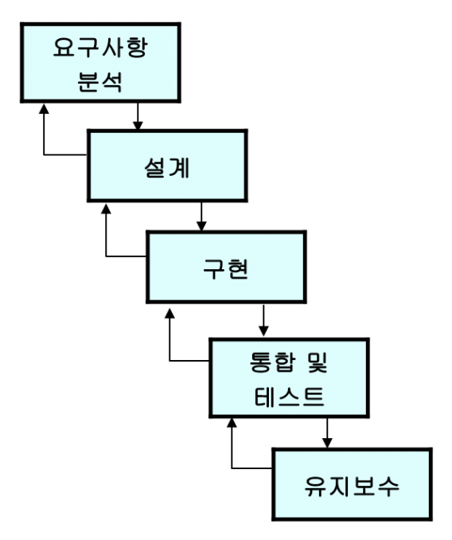
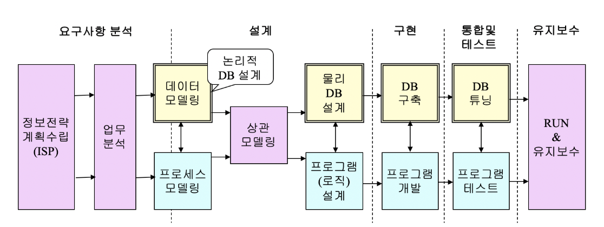
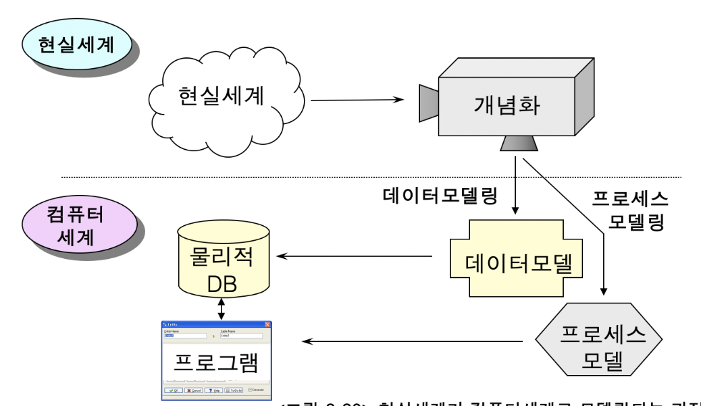

# 2. 정보시스템 구축 절차와 데이터베이스 설계

## 추상화 모델링

* ### 데이터베이스 설계과정은

  * 소프트웨어(정보시스템) 개발 과정의 일부
  * 소프트웨어 개발은 현실세계에 대한 추상화(abstraction) 과정이다.
  * 추상화개념은 이해하는 것이 데이터베이스 설계를 이해하는데 도움이 된다.
  * 추상화는 모델(model)이라는 수단을 통해 이루어진다.
  * 추상화 ~= 모델링
  * 추상화의 대표적인 사례 = 지도

****

* ### 추상화

  * #### 모델(model): 

    사람들이 복잡한 현실세계를 쉽게 이해하기 위하여 현실세계를 개념화, 단순화 하여 가시적으로 표현한것

  * #### 모델링(modeling): 

    모델을 만드는 과정

  * #### 추상화:

    현실세계를 모델링하는 것은 다른말로 현실세계에 대한 추상화라고 한다.

****

* 훌령한 소프트웨어 엔지니어는 코딩을 잘하는 사람이 아니라 현실 세계의 문제를 잘 파악하고 모델링할 수 있는 능력을 가진 사람이다.

********

****

## 데이터베이스 설계의 개념

* ### 오늘날 정보 시스템(웹사이트)의 개발

  * 대부분 데이터베이스를 기반으로 한다.
  * 따라서 데이터베이스 설계가 중요

****

* ### 데이터베이스의 설계란?

  * 데이터베이스 안에 저장될 테이블, 뷰 등의 구조를 디자인하고, 기본키, 외래키, 인덱스 등의 요소들을 계획하는 작업

  * 업무의 분석, 논리적 설계(데이터 모델링), 물리적 설계, 데이터베이스 구축에 이르는 전 과정을 포함

  * 데이터베이스 설계는 소프트웨어 개발과정 중의 일부 이므로 데이터베이스의 설계 역시 현실세계에 대한 모델링 과정에 속한다.

  * 그리고 구축된 데이터베이스 역시 현실세계의 어떤 부분을 반영한 것이다.

  * 현실세계에 존재하는 개체(entity)에 대한 정보, 데이터를 반영

  * 개체들의 행위(behavior)나 사건(event)는 반영되지 않고 프로그램에서 반영

  * 데이터베이스와 프로그램이 결합될 때 현실세계가 온전히 모델링 된다.

  * #### 논리적 데이터베이스 설계

    * 현실세계를 관찰, 분석하여 개념적 모델(**ERD**)을 만드는 과정. 

    * **데이터 모델링**이라고도 한다.
    * DBMS 제품의 종류와는 무관하게 진행

  * #### 물리적 데이터베이스 설계

    * 논리적 설계를 바탕으로 실제 데이터베이스를 구축하기 위한 테이블, 뷰, 인덱스 등을 설계하고 반정규화를 시행하는 과정
    * 특정 DBMS 제품을 염두에 두고 진행

****

****

## 정보시스템 구축과 DB 설계

* ### 일반적인 소프트웨어 개발 절차

  

  ​	우리 교육과정에서는 유지보수 단계는 없다고 볼 수 있다.

  ​	실무에서는 유지 보수 필수 !!

****

* ### 데이터베이스를 기반으로 한 정보시스템 구축 절차

  

  * #### 정보 전략 계획 수립 : 

    기업의 경영 전략 및 장단점 분석

  * #### 업무의 분석 :

    현실세계에서 업무가 어떻게 이루어지는지를 파악

  * #### 데이터 모델링 : 

    현실세계를 데이터의 관점에서 파악하여 **ERD** 로 표현하는 단계

  * #### 프로세스 모델링 :

    업무의 구성, 업무의 처리절차를 파악

  * #### 상관 모델링 :

    * 데이터 모델과 프로세스 모델을 통합하여 평가
    * 데이터 모델과 프로세스 모들은 동일한 현실세계의 서로 다른 면을 표현한 것이기 때문에  상호 조화를 이루어야 한다.

  * #### 물리적 DB 설계:

    * 데이터 베이스 구축을 위한 테이블, 뷰, 인덱스, 데이터 용량 등을 설계

    * 테이블 기술서

  * #### 데이터베이스 구축

    - 특정 DBMS 제품에 대하여 데이터베이스 및 테이블, 뷰, 인덱스 등을 생성하는 과정
    - 이렇게 구축된 데이터베이스를 가지고 프로그램을 개발하고 테스트 하게 된다
    - 데이터베이스의 구축은 수작업으로 할 수도 있지만 보통은 모델링 도구에서 제공하는 기능을 이용하여 거의 자동적으로 데이터베이스를 구축

  * #### 데이터베이스 튜닝:

    * 데이터베이스가 일정한 성능을 유지할 수 있도록 비효율적인 요소를 제거하고 성능 개선을 위하여 SQL 문장을 포함, 데이터베이스의 여러 요소들을 조정하는 과정
    * 데이터베이스 내에 데이터의 양이 증가하고 사용자의 수가 증가하면 자연히 데이터베이스의 응답 속도 및 처리 속도가 저하된다.
    * 따라서 데이터베이스 튜닝을 통하여 일정한 성능을 유지시키는 것이 중요하다.

  * #### 유지보수 : 

    데이터베이스 구축 후 시스템을 운영하면서 지속적으로 데이터베이스를 관리하는 과정

    * 사용자 요구의 변화    -+
    * 경영 환경의 변화 	  -+ -->> 데이터 베이스의 변화
    * 프로그램의 변화        -+

  * #### 정리

    

****

****

****

# 연습문제

##### 1. 모델이란 어떤 의도를 가지고 현실세계를 개념화 하여 가시적으로 표현한 것이다. 모델의 예를 교재에 나와있지 않은 것으로 하나 제시하시오

**SOL )**

설계도면

##### 2. 다음은 교통 표지판의 하나이다. 이 표지판이 나타내는 의미는 무엇인가? 이 표지판에는 어떤 데이터가 포함되어 있는가?

**SOL )**

차간 거리 확보

##### 3. 관계형 데이터 베이스의 테이블은 현실세계를 보고 데이터 부분만을 모델링하여 도표 형태로 나타낸 것이다. 다음은 사원 테이블의 일부이다. 화살 표시가 되어 있는 튜플이 나타내는 현실세계의 의미를 풀어서 기술하시오

**SOL )**

해당 테이블/릴레이션은 EMP 즉 직원의 데이터를 담고 있는 테이블이다. 그중 튜플에 해당하는 내용은 그 개체에 속한 구성원 개개의 정보 즉 사원 개개인의 정보를 담고 있다.

사원 번호 1003 이름 김동준 부서 생산부 고용날짜 2000.9.1 생년월일 1986.5.16 주소 부산 대하동 업무 품질관리 봉급 300

##### 4. 

**SOL )**

##### 5. 

**SOL )**

##### 6. 

**SOL )**

