# 4. 모델링 도구

## 모델링 도구 개요로서 

* ### CASE 도구

  * 정보시스템의 개발은 장시간이 소요되며 많은 개발 인력이 필요
  * 대규모 시스템 개발 환경에서는 개발과정에서 작성되는 문서들이 개발자들간에 공유되어야 하고 하나의 문서는 모든 사람에게 동일한 의미로 이해되어야 한다.
  * 워드프로세서를 이용해서 작업할 경우 표준화, 공유의 한계
  * 대규모 시스템을 효과적으로 개발하기 위하여 개발자들은 CASE (***C***omputer ***A***ided ***S***oftware ***E***ngineering) 도구를 사용
    * 분석, 설계, 구현, 테스트의 전 과정을 지원하는 S / W 로서 문서화 기능까지를 포함

****

* ### 데이터 설계 도구

  * 데이터베이스 설계의 전 과정을 지원해 주는 전문적인 도구
    * 논리적 모델링
    * 물리적 모델링
    * DBMS 와 연동하여 데이터베이스를 구축해 주는 기능
    * 역공학 (**reverse engineering**)


****

****

****


# 5. 업무분석


## 개요

* ### 분석 단계의 중요성

  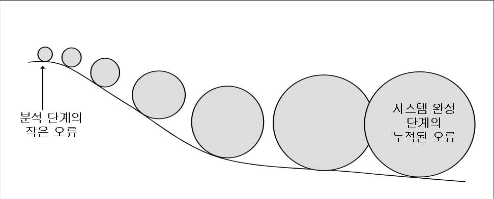

****

* ### DB 설계의 준비 단계로서의 업무 분석

  * 개발을 의뢰한 회사에 대한 이해 (매출규모, 종업원수, 조직, 직장문화...)
  * 서브젝트 에어리어 (subject area) 의 설정
    * 전체 업무를 분석 가능한 크기의 영역으로 분할함
  * 각 서브젝트 에어리어별로 업무에 관련된 문서 수집
    * 업무 메뉴얼, 업무상 기록하는 장부, 거래에서 주고 받는 전표, 혹은 PC에서 Excell 과 같은 스프레드 시트로 관리되는 자료 등
    * 가능하면 데이터가 들어있는 문서로 수집
  * 업무 담당자 인터뷰
    * 해당 업무를 보다 명확히 이해하고 담당자들의 요구사항을 파악하기 위함
  * 수집 문서 및 인터뷰 문서 정리
    * 여러가지 다이어그램 및 도구 이용


****

****


## 문서 및 자료수집

* ### 수집해야 할 주요 문서들

  * #### 업무 매뉴얼

    * 특정 업무를 어떤 절차와 방법에 의해 수행해야 하는지를 명시적으로 기술해 놓은 문서
    * 신입사원을 교육할 때, 업무 담당자가 바뀌어서 인수인계를 할 때 사용
    * 분석자가 업무를 이해하는데 매우 소중한 자료
    * 업무 메뉴얼에는 해당 업무 분야에서 사용되는 용어들이 나와 있으므로 이를 이해하면 업무 담당자들과 인터뷰 할 때 도움이 된다.

  * #### 다른 업무 주체와의 업무과정에서 주고 받는 문서들

    * 현실세계에서의 업무를 살펴보면 업무 담당자가 물건을 구매 혹은 판매를 하는 것과 같이 다른 주체들과 상호작용을 해야 하는 경우가 많다.
    * 업무가 올바로 이루어졌음을 상호 보증하기 위해 문서를 남기게 됨
      * <그림 5.2>의 업무메뉴얼에서 거래명세서
    * <그림 5.3>의 거래명세서 양식을 보면 누가, 언제, 어떤 물건을 납품했는지 알 수 있고, 누가 물건을 인수했는지 알 수 있다.

  * #### 고유 업무를 위한 문서들

    * 다른 업무 주체와의 상호작용 속에서 만들어지는 것이 아닌 고유 업무 자체를 위해 만들어지고 관리되는 문서들
      * <그림 5.2>의 업무 메뉴얼에서 입고 전표
    * 누군가가 보냈거나 누구에게 보내어지기 위해서 작성하는 것이 아니고 창고 관리의 필요에 의해 만드는 것
    * 이러한 문서들은 대외에 오픈된 것이 아니기 때문에 업무 담당자를 직접 찾아가서 얻어야 하는 경우가 많다.


****

****


## 담당자 인터뷰

* ### 인터뷰의 필요성

  * 문서들만 가지고는 업무를 충분히 파악할 수 없다.
  * 문서에서 불명확한 점을 분명히 할 수 있다.
  * 실제 업무에서 중요한 정보와 그렇지 않은 정보를 분리할 필요가 있다.
  * 현재 업무의 문제점은 실무자들이 가장 잘 알고 있다.
  * ***<u>그러나 인터뷰는 어렵다!!!</u>***

****

* ### 인터뷰 계획

  * 인터뷰를 통해 무엇을 얻고자 하는지 명확한 목표를 수립
    * 업무 파악이 주목적인지
    * 문제점의 도출이 주 목적인지
    * 업무 담당자와 친분을 쌓는 것이 목적인지 (원활한 업무를 위해)

  

  * 데이터베이스 설계와 관련된 인터뷰의 일반적인 목적은 조직의 데이터 처리와 결정을 내리는 활도, 요구되는 기능에 대한 정보를 수집하는 일
    * 정보가 어디로 와서 어디로 흘러가는지, 데이터의 형식은 어떠한지, 하루에 어느 정도의 빈도로 발생하는지 등을 파악하도록 준비

  

  * 인터뷰 대상 업무에 대해 최대한 숙지한다.
    * 업무 메뉴얼 등을 통해 업무 용어에 대해서도 숙지!!

  

  * 누구와 인터뷰할 것인가를 결정한다.
    * 데이터의 수집이나 업무 파악을 위해서는 일선 업무 담당자를 만나는 것이 필요
    * 의사결정 구조나 경영적 측면에 관련된 것은 중간 관리자를 만나는 것이 필요

  

  * 인터뷰에 응하는 사람이 미리 준비할 수 있도록 배려한다.
    * 인터뷰할 내용을 사전에 알려주고 얻고 싶은 자료가 있다면 인터뷰시 가져오도록 미리 요청

  

  * 업무에 지장이 가지 않도록 인터뷰 시간을 계획한다.
    * 가급적 업무 담당자가 가장 여유 있는 시간에, 한시간을 넘지 않도록

  

  * 질문하고 싶은 내용을 미리 문서로 작성한다.

  

  * 분석자가 여러 사람이라면 인터뷰시의 역할을 분담한다.

****

* ### 질문의 준비

  * #### 열린 질문

    : 고정되어 있는 답을 요구하는 것이 아니라 인터뷰 대상자의 생각을 자유롭게 표현할 수 있도록 표현할 수 있도록 질문하는 것

    * EX ) "업무를 하시면서 가장 애로 사항이라고 생각하시는 것은 무엇입니까?"
    * 인터뷰 의도와 다른 방향으로 흘러갈 위험성 있음

  * #### 닫힌 질문

    : 열린 질문 대신 사용할 수 있는 질문 유형으로서 인터뷰에 응하는 사람에게 지정되어 있는 몇 가지 답 중에서 고르도록 제약을 가하는 질문

    * EX ) "재고 관리가 잘되지 않는 이유는 제품의 위치 추적이 어려움, 보관 공간 부족, 수작업에 의한 부정확한 관리 중 어느것이라고 생각하십니까?"

  * #### 추가 질문

    : 인터뷰 대상자의 답변 중 명확히 알고 싶은 부부니 있을때 사용하는 질문으로서 앞에서 던진 질문에 대한 보충 질문

    * 추가 질문은 분석가가 답변을 듣고 이해하고 있음을 상대방에게 전달할 수 있으며 열린 질문이나 닫힌 질문 어느 것이나 될 수 있다.
    * EX ) "전산 시스템이 없어서 발생하는 문제를 예를 하나 들어주시겠습니까?"

****

* ### 인터뷰시 주의사항

  * 인터뷰 대상자는 대부분 인터뷰에 소극적이다.
  * 인터뷰를 주도적으로 진행할 필요가 있다.
    * 인터뷰가 잡담이 되거나 인터븁 대상자의 하소연을 듣는 것으로 끝난다면..
  * 분석가는 인터뷰 대상자가 편안하게 이야기 할 수 있도록 분위기를 조성
    * 많은 경우에 현업 담당자들을 분석가들에 대하여 우호적인 감정보다는 귀찮거나 비협조적인 태도를 가지고 있다.
  * 어떤 사안들은 현업 담당자들에게 매우 민감할 수 있기 때문에 질문에 신중하여야 한다.


****

****


## 분석내용 정리

* ### 도구를 이용한 정리

  * 자료의 수집과 분석이 끝나면 많은 분량의 문서들이 쌓인다.
  * 이러한 문서들을 체계적으로 분석하여 정리하고 설계에 사용할 수 있도록 준비할 필요가 있음
  * 자료 정리에 케이스 도구 (case tool) 가 많이 이용됨

****

* ### 분석내용 정리의 예

  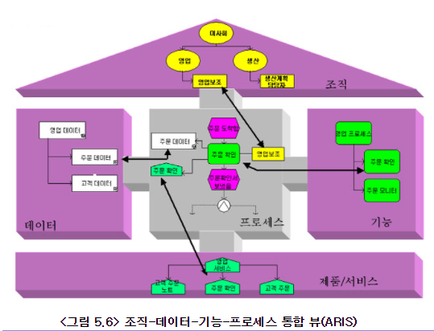

  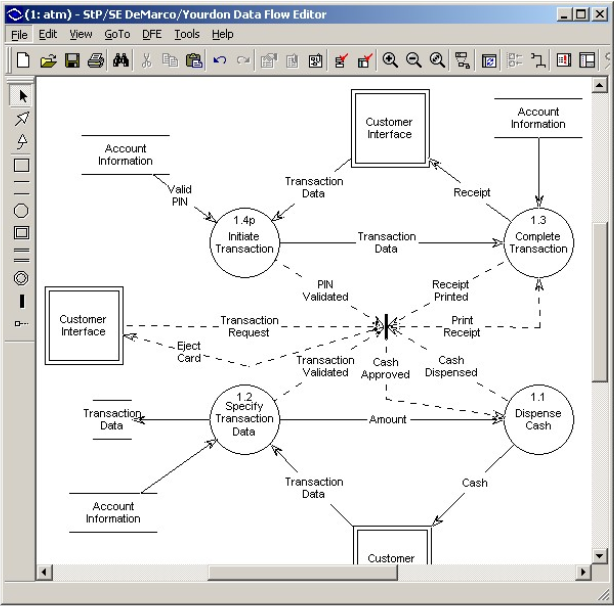

  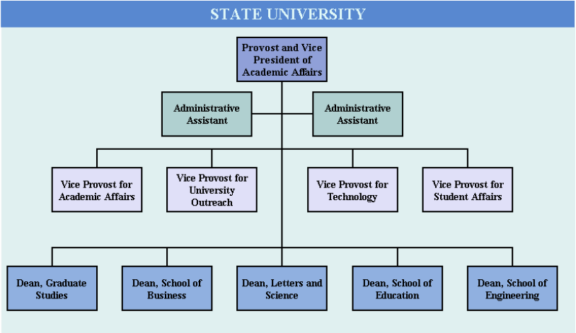

  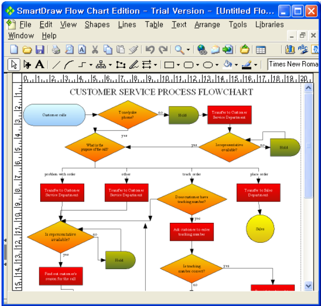

****

* ### 데이터 흐름도 (DFD)

  * **DFD** : ***D***ata ***F***low ***D***iagram

  * 데이터베이스 설계와 직접적으로 관련이 있는 분석 정리 문서

  * 시스템 내에서 데이터가 어떻게 생성되어 어떤 프로세스를 거쳐 어더로 저장이 되는지를 가시적으로 보여준다.

  * 약속된 표기법을 사용한다. <표 5.1>참조

    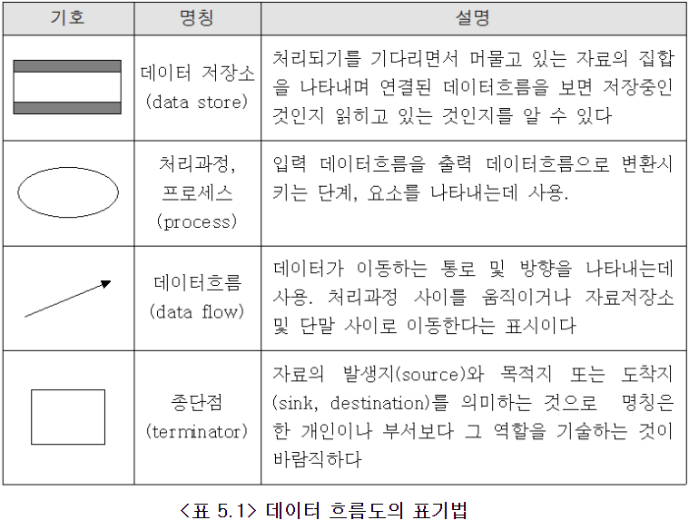

    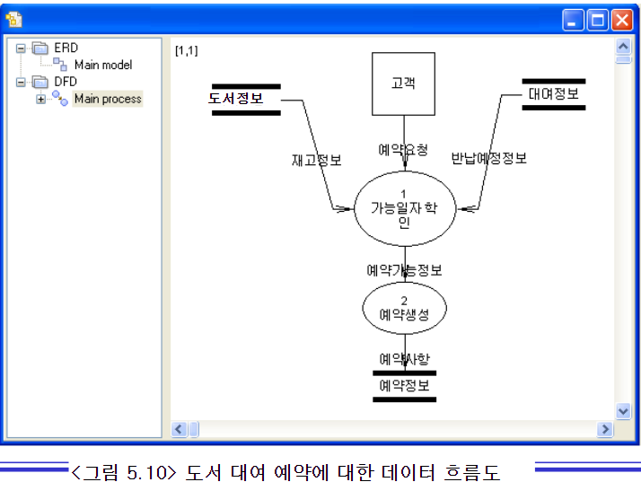


****

****


## 업무분석 사례

* ### 도서관 관리

  * 프로젝트 개요서
  * 시스템 기능도
  * 업무 기술서
  * 사용자 요구사항 분석서
  * 관련문서 목록
  * 수직한 장부/전표 샘플
  * <u>***교재 참조***</u>


****

****

****

# 6. 엔티티의 정의

## 개요

* ### 데이터 모델링 (논리적 DB 설계) 과정

  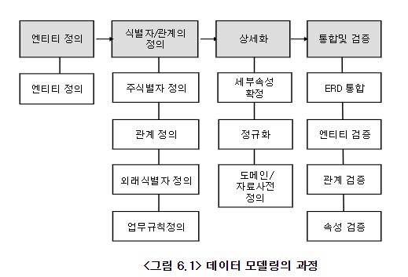

****

* ### 데이터 모델링

  * 현실 업무에 대한 자료 수집 및 정리 작업이 어느 정도 끝나게 되면 본격적으로 모델링 단계로 넘어 간다.
  * <그림 6.1>에서는 편의상 각 단계를 나누어 놓았지만 실제 모델링 과정에서는 여러 단계를 함께 진행하는 경우가 많다.
  * 데이터 모델링에서는 ERD 라는 수단을 통하여 모델링을 하고, 모델링의 결과를 표현
  * 데이터 모델링에서의 핵심은 엔티티를 도출하는 일
  * 엔티티를 도출하기위한 특별한 공식은 없다. 앞에서 수집된 자료들을 잘 살펴서 엔티티를 찾아내야 한다.

  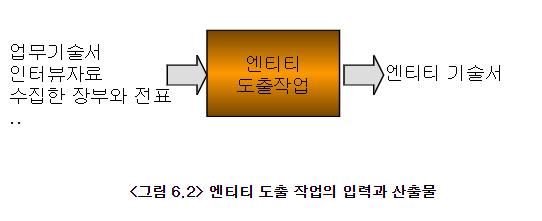

  

****

****


## 엔티티 다시보기

* ### 엔티티란

  * 업무의 관심 대상이 되는 정보를 갖고 있거나, 그에 대한 정보를 관리할 필요가 있는 유형, 무형의 사물 (개체)

    * 여기서 중요한 단어는 **'정보'**
    * 현실세계를 관찰하여 컴퓨터로 관리해야 할 정보, 혹 데이터를 찾는 것이 데이터 모델링
    * ERD의 핵심 개념인 엔티티는 관리해야 할 정보를 가지고 있는 현실 세계의 어떤 사물을 의미

  * 수강신청 업무에서 엔티티의 도출

    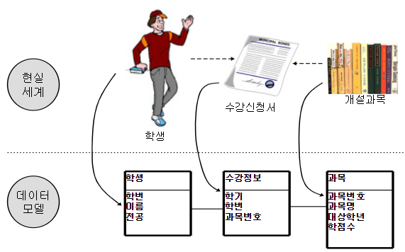


****

****


## 엔티티의 도출 과정

* ### 접근 방법

  * 분석 / 설계 단계에서 업무에 대한 경험이 많지 않다면 다양한 경로를 통해 자료를 수집하고 엔티티를 찾아내야 한다.
  * 엔티티를 찾아내는 정해진 공식은 없다.
  * 다음 사항을 고려
    * 업무를 설명한 업무 기술서를 검토
    * 현업 담당자와의 인터뷰
    * 현업에서 사용하는 장표 (장부, 전표) 를 검토
    * 기존 시스템의 산출물 검토 ( 시스템이 이미 구축된 경우 )
    * DFD가 있다면 DFD상의 Data Stroe 를 추출
    * 현업 업무를 직접 견학하고 인터뷰와 업무 기술서에 누락된 정보가 있는지를 확인

* ### 엔티티 도출 과정

  * #### 엔티티 후보 풀(pool)과 엔티티 리스트를 그린다.

    * 엔티티 후보 풀(pool) : (엔티티인지 아닌지 애매한 경우 임시로 보관)

    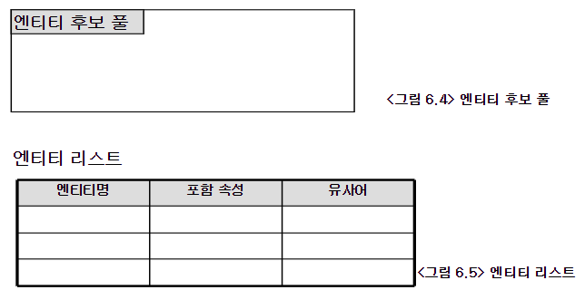

  * #### 분석 대상 문서를 보고 명사를 찾아 표시한다.

    * 문서에서 엔티티는 명사형으로 표현됨

  * #### 명사 하나 하나에 대해 속성인지 엔티티인지 구별한다.

    * 이 명사는 엔티티 => *엔티티 리스트의 엔티티 명에 기록*
    * 이 명사는 어떤 엔티티의 속성 => *엔티티 리스트의 포함 속성에 기록*
    * 이 명사는 어떤 엔티티의 인스턴스 => *소속 엔티티를 엔티티명에 기록*
    * 엔티티인지 속성인지 불분명 => *엔티티 후보풀에 기록*

  * #### 중복된 명사, 혹은 유사한 의미의 명사는 하나로 정리

    * '고객', '회원' => *'회원'*

  * #### 엔티티 후보 풀에 있는 명사를 재검토한다.

    * 검토하여 엔티티 리스트에 기록
    * 여전히 엔티티 여부가 불분명하다면 풀에서 제외

  * #### 도출된 엔티티에 대해 구축될 시스템에서 데이터를 관리할 필요가 있는지 검토한다.

    * 도출된 모든 엔티티가 물리적 DB 설계에 반영되어야 하는 건 아님
    * 관리가 필요한 부분만을 선택적으로 반영
    * 데이터 관리를 할 필요가 없으면 엔티티에서 제외

  * #### 엔티티 기술서를 작성한다.

    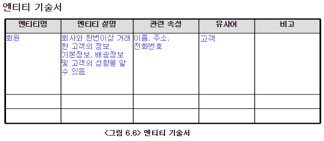

    

****

****

****


## 업무 기술서에서 엩티티 도출의 예

* ### 엔티티를 도출(5장_도서관 관리 시스템 업무) 

  * #### 1. 엔티티 후보풀과 엔티티 리스트를 그린다.

  

  * #### 2. 업무기술서에서 명사를 찾아 표시한다.

    * **도서**를 **대출**하기 위해서는 **회원 가입**을 하여야 한다.

    * 회원가입시에는 **이용자이름**, **전화번호**, **집주소**, **이메일 주소**를 입력한다.

    * 회원 가입을 하면 **회원증**이 발급되고 **회원카드**에 부착된 **바코드**를 가지고 **대출/반납**시 **신분** 확인을 할 수 있다.

    * **회원**에게는 자체 관리를 위해 **회원 번호**가 부여된다.

    * 일반 회원의 대출 가능 도서 수는 5권으로 제한한다.

    * 회원 탈퇴를 하려면 미 반납 도서가 없어야 한다.

    * 회원이 탈퇴하면 **회원 정보**에 **탈퇴여부**를 기록하고, **월말 결산**시 탈퇴한 회원을 일괄 정리한다.

    * 탈퇴한 회원이 재가입시에는 최초 가입과 동일한 **절차**를 가진다.

  * #### 3. 표시한 명사들을 엔티티와 속성으로 분류한다.

    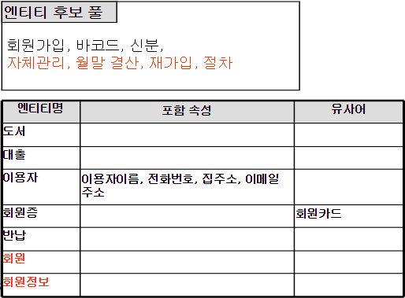

  * #### 4. 중복된 명사/유사의미의 명사를 하나로 정리

    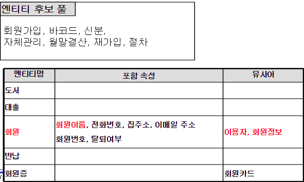

  * #### 5. 엔티티 후보풀에 있는 명사들을 검토

    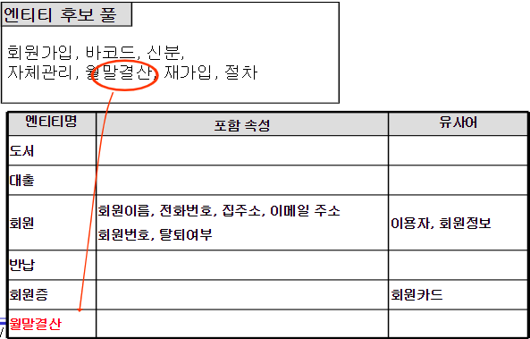

  * #### 6. 도출된 엔티티가 구축될 시스템에서 필요한지 판단

    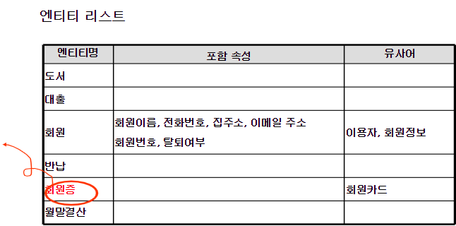

  * #### 7. 엔티티 기술서를 작성한다.

    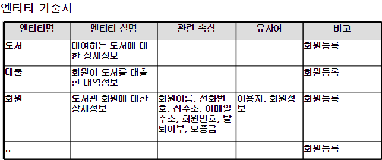

    기준이 되는 데이터 들을 마스터 데이터라 한다.

****

* ### NOTE. 직관적인 방법으로 엔티티 찾기

  * 특정 업무 영역에 대해 대개 한 두개의 핵심 엔티티가 있다.
    * 도서관 업무 : 회원, 도서, 대출, 반납, ...
    * 병원관리 : 환자, 의사, 질병, 병실, ...
    * 수강신청 : 교수, 학생, 과목, 강의실, ...


****

****


## 장부 / 전표에서 엔티티 도출의 예

* ### 아래의 입고 전표에 대해 엔티티를 도출

  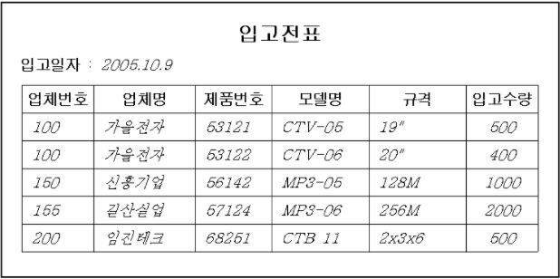

  * #### 장부 / 전표에 들어있는 데이터가 데이터베이스에 저장될 필요가 있는지 판단

    * EX ) 

      신규 도서 카탈로그 => ***관리 필요 없음***

      회원 명단 => ***관리 필요***

  * #### 엔티티로 선택된 장부 / 전표의 이름 대신에 다른 이름을 사용하는 것을 고려한다.

    * 회원 명단 => ***회원*** or ***회원 정보***

  * #### 엔티티로 선택된 장부 / 전표에서 다른 엔티티를 추출 할 수 있는지 검토한다.

    * 다른 입고전표에도 반복해서 나타날 수 있는 정보 항목을 추출

    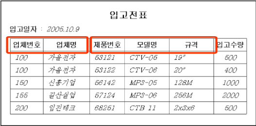

  * #### 엔티티 기술서를 작성한다.

    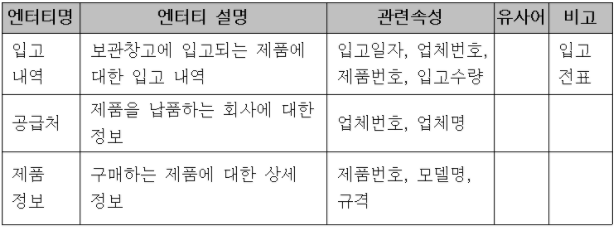

****

* ### 장부/전표에서 엔티티 도출 예제 2

​	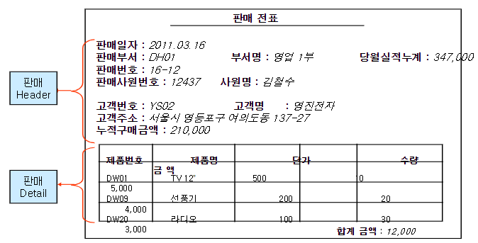

​	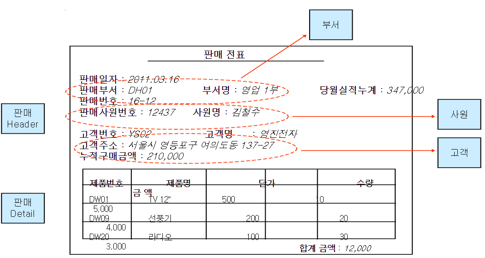

​	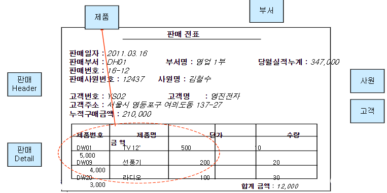


****

****


## 엔티티 도출 사례 : 도서관 관리

교재 참조


****

****

****


# 7. 식별자, 관계, 속성의 정의


## 개요

* ### 식별자, 관계, 속성의 정의 단계는

  * #### 엔티티 기술서 및 수집문서들을 보고 엔티티의

    * ##### 주식별자

    * ##### 관계

    * ##### 관계에 따른 업무규칙

    * ##### 세부 속성

  #### 을 정의하는 단계


****

****


## 주식별자의 정의

* ### 주식별자의 정의 사례

  * 주식별자 : 에티티에 소속된 인스턴스들을 구분하는 기준이 되는 속성

    ```
    만일 어떤 속성 X가 엔티티의 주식별자라면 그 엔티티에 속한 모든 인스턴스들의 속성 X값을 비교했을 때 중복된 값이 나타나지 않아야 한다.
    ```

    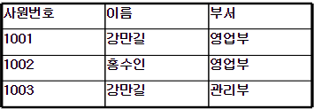

* ### 주식별자 선정하는 법

  * 테이블을 그려본 후 중복 여부를 판단한다.
  * 주식별자(Primary Key)가 되려면 현재 시점에서 뿐만 아니라 미래의 어떤 시점에서도 중복이 있어서는 안된다.
  * 

## 관계/외래식별자의 정의 


## 업무 규칙의 정의


## 속성의 정의


