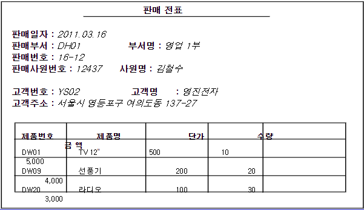
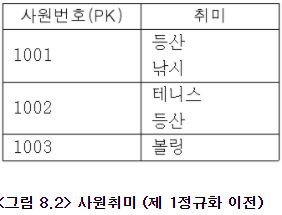
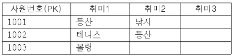
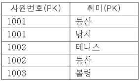
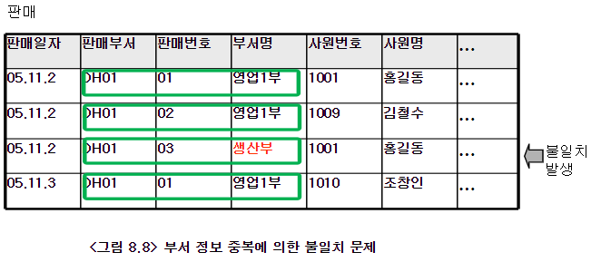
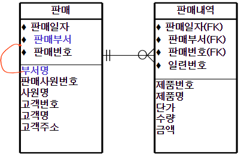
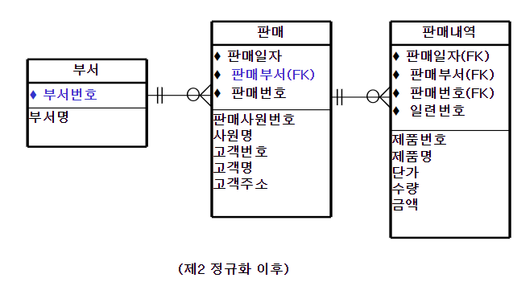

# 8. 정규화

## 개요

* ### 정규화(normalization) 란

  * ERD내에서 **중복요소**를 찾아 **제거**해 나가는 과정
    * 중복된 데이터는 많은 문제를 일으킨다.

  

  * 3차 정규화 정도만 알면 설계하는데 무리가 없다.

  

  * 몇가지 원칙만 지키면 정규화가 필요 없는 ERD를 설계할 수 있다.

****

* ### 정규화 예제 문서

  

****

****

## 정규화 과정

* ### 제 1 정규화

  * 엔티티에서 **하나의 속성이 복수개의 값**을 갖도록 설계되어 있을 때 **하나의 속성이 단일 값 (atomic value)을 갖도록** 설계를 변경하는 과정

  * #### 제1 정규화 과정이 필요한 예

    * 하나의 속성이 복수개의 값을 가지고 있는 경우

      

    * 동일 속성이 반복되는 경우

      

    * 제1정규화 이후

      

****

* ### 제2정규화

  * 주식별자가 아닌 속성들 중에서 주식별자 전체가 아닌 **일부 속성에 종속된 속성을 찾아 제거**하는 과정	

    

  * 해당 예시를보면 주식별자 일반 속성인 부서명은 속성인 판매부서에 종속적이다. 따라서 데이터 중복 및 불일치 사례가 발생 할 수 있다.

    

    

    

****

* ### 제3정규화

  * **주식별자가 아닌 속성**들 중에서 **종속관계에 있는 속성을 찾아 제거**하는 과정

* 

## 정규화에서 엔티티의 분리

## 정규화가 필요 없는 설계 기법

## 정규화 사례 : 도서관 관리

