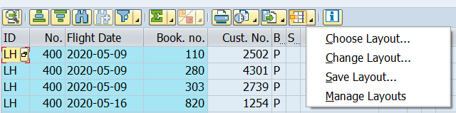
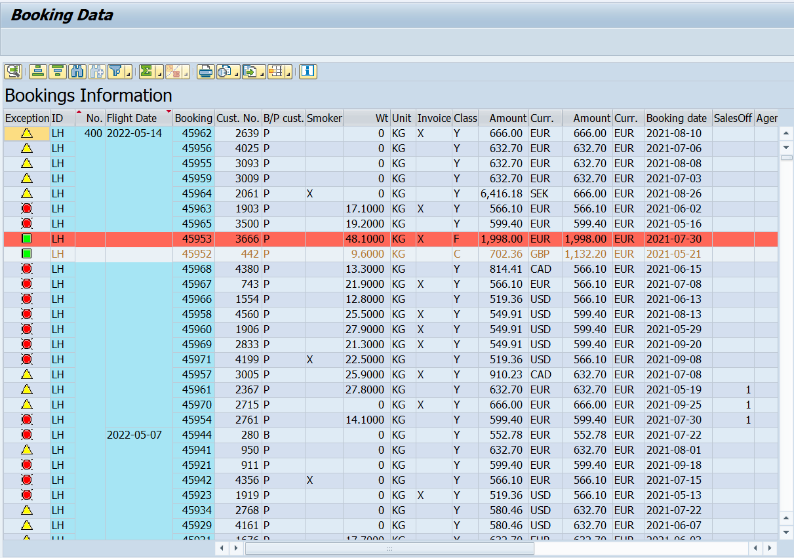
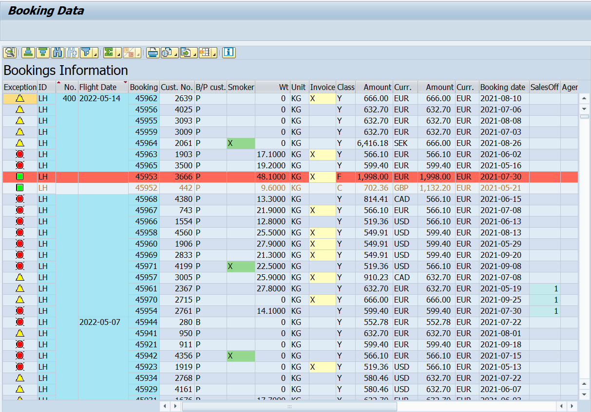
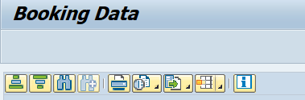
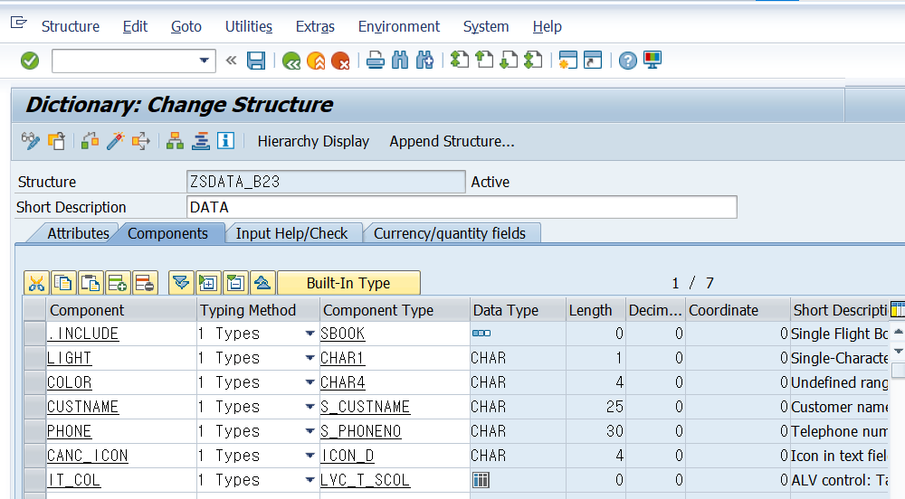

# Unit 4. ALV Design


# Lesson 1. Programming Layout Variant Functionality in the ALV Grid

top 에 gs_variant 를 type disvariant로 선언하고 gs_variant의 report에 현재 프로그램을 sy-oprog로 넘겨 준 후 기존에 호출한 메소드 set_table_for_first_display의 EXPORTING의 is_variant에 gs_variant를 넘겨주면 



이 추가된 것을 볼 수 있다.

i_save에 'U'를 할당하면

i_save에 'X'를 할당하면


gs_variant의 variant에 저장된 레이아웃을 넣으면 저장해 둔 레이아웃의 형태로 데이터를 확인 할 수 있다.


# Lesson 2. Changing the Layout of the ALV Grid

* ## IS_LAYOUT

  lvc_s_layo type의 스트럭쳐가 들어간다.

  |     Fields     | 효과                                                         | DESCRIPTION     |
  | :------------: | ------------------------------------------------------------ | --------------- |
  | **GRID_TITLE** | 텍스트를 넣어주면 제목으로 지정된다.                         | MAX 70자        |
  |   **ZEBRA**    |                                                              | 'X'             |
  | **NO_HEADERS** | HEADER를 가려준다.                                           | 'X'             |
  |  **SEL_MODE**  | **'A'** <br/>COLUMN과 ROW를 여러개 선택 가능<br/>SELECTION COLUMN DISPLAY<br/>**'B'**<br/> COLUMN은 여러개 ROW는 하나만 선택가능<br/>**'C'**<br/>COLUMN과 ROW를 여러개 선택 가능<br/>**'D'**<br/>COLUMN과 ROW를 여러개 선택 가능, <br/>CELL도 선택가능<br/>SELECTION COLUMN DISPLAY<br/>기본값은 B로 설정되어있다. | 'A'/'B'/'C'/'D' |
  | **CWIDTH_OPT** |                                                              | 'X'             |
  | **NO_TOOLBAR** | 툴 바를 가려준다.                                            | 'X'             |
  | **TOTALS_BEF** | TOTAL 값이 제일 위에 뜨게 된다.                              | 'X'             |
  | **INFO_FNAME** | 특정 ROW에 색을 표시해 준다.                                 |                 |
  | **CTAB_FNAME** | 특정 CELL에 색을 표시해준다.                                 |                 |
  | **NO_HGRIDLN** | ALV의 ROW 구분선을 없애준다.                                 | 'X'             |
  | **NO_VGRIDLN** | ALV의 COLUMN 구분선을 없애준다.                              | 'X'             |
  
  이 스트럭처의 grid_title 필드에 텍스트를 넣어주면 layout에 제목이 생성되며


* ## Exception Columns

  EXCP_FNAME LIGHT

  EZCP_LED 'X'

  LIGHT FIELD


* ## IT_SORT

  LVC_T_SORT LVC_S_SORT

  #### ZB23_00045_TOP 

  ```ABAP
  DATA: gt_sort    TYPE lvc_t_sort.
  ```

  

  #### ZB23_00045_F01 - SUBROUTINE set_sort

  ```ABAP
  *&---------------------------------------------------------------------*
  *& Form set_sort
  *&---------------------------------------------------------------------*
  *& text
  *&---------------------------------------------------------------------*
  *& -->  p1        text
  *& <--  p2        text
  *&---------------------------------------------------------------------*
  FORM set_sort .
    DATA: ls_sort TYPE lvc_s_sort.
    ls_sort-fieldname = 'FLDATE'.
    ls_sort-down      = 'X'.
    APPEND ls_sort TO gt_sort.
  
    CLEAR: ls_sort.
    ls_sort-fieldname = 'CONNID'.
    ls-sort-up        = 'X'.
    APPEND ls_sort TO gt_sort.
  ENDFORM.
  ```

  ZB23_00045_O01 - SET_TABLE_FOR_FIRST_DIPLAY 의 CHANGING의 IT_SORT에 GT_SORT 할당.


# Lesson 3. Adapting the Appearance of the ALV Grid


* ## LINE COLORS

  ```ABAP
  * TOP 의 취득 데이터를 담을 테이블/STRUCTURE 타입 정의 구문 
  DATA: BEGIN OF gs_data.
          INCLUDE TYPE sbook.
  DATA:   light TYPE char1,
  *       신호등을 결정하여 담아둘 FIELD
          color TYPE char4,
  *       라인의 색 정보를 문자열로 담아둘 FIELD
        END OF gs_data,
        gt_data LIKE TABLE OF gs_data.
  
  	   
  	   
  *   데이터 취득부의 LOOP 구문 안
      IF gs_data-class = 'F'.
        gs_data-color = 'C' && col_negative && '10'.
  *     && 구문을 이용하여 길이 4인 문자열로 묶어줘도 되며
      ELSEIF gs_data-class = 'C'.
        gs_data-color = 'C701'.
  * 	  직접 입력하여도 무방하다.
      ENDIF.
  
  * LAYOUT 결정하는 SUBROUTINE 내부 
    gs_layout-info_fname = 'COLOR'.
  ```

  생성한 COLOR FIELD 에는 &&로 묶여진 문자열이 들어가는데 그 내용은 다음과 같다.

  | 'C'        | \<COLOR_CONSTANT>                                   | \<INTENSIFIED>                      | \<INVERSE> |
  | ---------- | --------------------------------------------------- | ----------------------------------- | ---------- |
  | 무조건 'C' | 색의 상수 혹은 숫자가 들어간다.<br>색을 결정해준다. | 1/0을 통해<br>색의 농도를 결정한다. |            |

   


* ## CELL COLOR

  ```ABAP
  * TOP 의 취득 데이터를 담을 테이블/STRUCTURE 타입 정의 구문 
  DATA: BEGIN OF gs_data.
          INCLUDE TYPE sbook.
  DATA:   light TYPE char1,
  *       신호등을 결정하여 담아둘 FIELD
          color TYPE char4,
  *       라인의 색 정보를 문자열로 담아둘 FIELD
          IT_COL TYPE LVC_T_SCOL,
  *       CELL 의 색 정보를 입력할 테이블
        END OF gs_data,
        gt_data LIKE TABLE OF gs_data.
        
  * 데이터 취득부 에 해당하는 GET_DATA SUBROUTINE 내부
    DATA: ls_scol TYPE LINE OF lvc_t_scol.
  * 로컬 타입입으로 IT_COL을 핸들링할 STRUCTURE을 선언
  
  * GET_DATA SUBROUTINE의 LOOP 문 내부
      IF gs_data-smoker = 'X'.
        ls_scol-fname = 'SMOKER'.
        ls_scol-color-col = '2'.
        ls_scol-color-int = '1'.
        ls_scol-color-inv = '9'.
        APPEND ls_scol TO gs_data-it_col.
      ENDIF.
      IF gs_data-invoice = 'X'.
        ls_scol-fname = 'INVOICE'.
        ls_scol-color-col = '3'.
        ls_scol-color-int = '0'.
        ls_scol-color-inv = '0'.
        APPEND ls_scol TO gs_data-it_col.
      ENDIF.
      IF gs_data-agencynum = '00000001'.
        ls_scol-fname = 'AGENCYNUM'.
        ls_scol-color-col = '1'.
        ls_scol-color-int = '0'.
        ls_scol-color-inv = '0'.
        APPEND ls_scol TO gs_data-it_col.
      ENDIF.
  
  
  * LAYOUT 결정하는 SUBROUTINE 내부 
    gs_layout-ctab_fname = 'IT_COL'.
  ```

  <table>
    <tr>
      <th colspan="2">Fields</th>
      <th>내용</th>
    </tr>
    <tr>
      <td colspan="2">fname</td>
      <td></td>
    </tr>  
    <tr>
      <td rowspan="4">color</td>
        <td>col</td>
        <td></td>
    </tr>
    <tr>
      <td>int</td>
      <td></td>
    </tr>  
    <tr>
      <td>inv</td>
      <td></td>
    </tr>
    <tr>
      <td>nokeycol</td>
      <td></td>
    </tr>
  </table>

  </table>

  


* ## Hiding of Standard Functions

  ```ABAP
  * TOP에 TOOLBAR를 핸들링할 테이블 GT_TOOLBAR을 생성한다.
  DATA: gt_toolbar TYPE ui_functions.
  
  * PBO의 INIT_ALV 모듈에 GT_TOOLBAR를 수정할 SUBROUTINE을 생성한다.
      PERFORM set_exclude_toolbar.
      
  * ZB23_00045_F01내부 SET_EXCLUDE_TOOLBAR SUBROUTINE
  *&---------------------------------------------------------------------*
  *& Form set_exclude_toolbar
  *&---------------------------------------------------------------------*
  *& text
  *&---------------------------------------------------------------------*
  *& -->  p1        text
  *& <--  p2        text
  *&---------------------------------------------------------------------*
  FORM set_exclude_toolbar .
    APPEND:
      cl_gui_alv_grid=>mc_fc_filter TO gt_toolbar,
      cl_gui_alv_grid=>mc_mb_sum    TO gt_toolbar,
      cl_gui_alv_grid=>mc_fc_detail TO gt_toolbar.
  ENDFORM.
  
  * set_table_for_first_display 의 EXPORTING의 it_toolbar_excluding을 주석을 풀고 GT_TOOLBAR을 할당한다.
      METHOD go_alv->set_table_for_first_display
        EXPORTING
         it_toolbar_excluding          = gt_toolbar
         
  ```

  

  


# Lesson 4. Adapting thd ALV Grid Control using the Field Catalog


* ## Options for Creating a Grid

  

  

  

FIELD CATALOG를 만드는 방법과 >?????


* ## 기존의 COLUMN의 HIDDEN과 COLUMN 추가

  #### TOP 의 GS_DATA에 FIELD를 추가하는 경우

  ```ABAP
  DATA: BEGIN OF gs_data.
          INCLUDE TYPE sbook.
  DATA:   light     TYPE char1,
  *       신호등을 결정하여 담아둘 FIELD
          color     TYPE char4,
  *       라인의 색 정보를 문자열로 담아둘 FIELD
          it_col    TYPE lvc_t_scol,
  *       CELL 의 색 정보를 입력할 테이블
          custname  TYPE scustom-name,
          phone     TYPE scustom-telephone,
          canc_icon TYPE icon-id,
  *       SBOOK에 없는 FIELD를 입력
  *       =>set_table_for_first_display의 i_structure_name이 SBOOK이므로
  *         ALV에 DISPLAY되지 않는다.
        END OF gs_data,
        gt_data LIKE TABLE OF gs_data.
  ```

  SBOOK에 없는 FIELD를 입력

  =>set_table_for_first_display의 i_structure_name이 SBOOK이므로 데이터를 아무리 넣어도 해당 컬럼 자체가 ALV에 DISPLAY되지 않는다.

  ```ABAP
  DATA: gt_fcat TYPE lvc_t_fcat.
  ```

  TOP에 LVC_T_FCAT TYPE의 GT_FCAT을 선언해 주고

  ```ABAP
      PERFORM set_fieldcatalog.
  ```

  PBO에 GT_FCAT을 핸들링 할 SUBROUTINE SET_FIELDCATALOG를 생성해 준다.

  * ### CASE1

    ```ABAP
    *&---------------------------------------------------------------------*
    *& Form set_fieldcatalog
    *&---------------------------------------------------------------------*
    *& text
    *&---------------------------------------------------------------------*
    *& -->  p1        text
    *& <--  p2        text
    *&---------------------------------------------------------------------*
    FORM set_fieldcatalog .
      DATA: ls_fcat TYPE lvc_s_fcat.
    * CASE 1
      ls_fcat-fieldname = 'CUSTNAME'.
    * DATA를 받아온 INTERNAL TABLE에서 참조할 FIELD 이름을 지정해 준다.
      ls_fcat-ref_table = 'SCUSTOM'.
    * 참조 테이블을 적어준다.
      ls_fcat-ref_field = 'NAME'.
    * FIELD 명을 참조한다.
      ls_fcat-col_pos   = 7.
      APPEND ls_fcat TO gt_fcat.
    
      CLEAR: ls_fcat.
      ls_fcat-fieldname = 'PHONE'.
    * DATA를 받아온 INTERNAL TABLE에서 참조할 FIELD 이름을 지정해 준다.
      ls_fcat-ref_table = 'SCUSTOM'.
    * 참조 테이블을 적어준다.
      ls_fcat-ref_field = 'TELEPHONE'.
    * FIELD 명을 참조한다.
      APPEND ls_fcat TO gt_fcat.
    
      CLEAR: ls_fcat.
      ls_fcat-fieldname = 'CANC_ICON'.
    * DATA를 받아온 INTERNAL TABLE에서 참조할 FIELD 이름을 지정해 준다.
      ls_fcat-coltext = 'CANCELLED'.
    * 해당 FIELD에 들어갈 TEXT를 정해 준다.
      ls_fcat-icon = 'X'.
    * ICON을 넣을 수 있는 FIELD로 만들어 준다.
      ls_fcat-col_pos = 1.
    * COLUMN의 위치를 지정해 준다.
      APPEND ls_fcat TO gt_fcat.
    
    
      CLEAR: ls_fcat.
      ls_fcat-fieldname = 'CANCELLED'.
      ls_fcat-no_out    = 'X'.
    * 해당 컬럼을 DISPLAY 하지 않겠다.
      APPEND ls_fcat TO gt_fcat.
    ENDFORM.
    ```

    

  * ### CASE2

    

    ```ABAP
    *&---------------------------------------------------------------------*
    *& Form set_fieldcatalog
    *&---------------------------------------------------------------------*
    *& text
    *&---------------------------------------------------------------------*
    *& -->  p1        text
    *& <--  p2        text
    *&---------------------------------------------------------------------*
    FORM set_fieldcatalog .
      DATA: ls_fcat TYPE lvc_s_fcat.
    
    *CASE2
    
      CALL FUNCTION 'LVC_FIELDCATALOG_MERGE'
        EXPORTING
    *     I_BUFFER_ACTIVE  =
          i_structure_name = 'ZSDATA_B23'
    *     만들어둔 스트럭쳐의 COMPONENT들이 GT_FCAT에 들어간다.
    *     I_CLIENT_NEVER_DISPLAY       = 'X'
    *     I_BYPASSING_BUFFER           =
    *     I_INTERNAL_TABNAME           =
        CHANGING
          ct_fieldcat      = gt_fcat
    * EXCEPTIONS
    *     INCONSISTENT_INTERFACE       = 1
    *     PROGRAM_ERROR    = 2
    *     OTHERS           = 3
        .
      IF sy-subrc <> 0.
    * Implement suitable error handling here
      ENDIF.
    
      LOOP AT gt_fcat INTO ls_fcat.
        CASE ls_fcat-fieldname.
          WHEN 'CANCELLED'.
            ls_fcat-no_out = 'X'.
          WHEN 'CUSTNAME'.
            ls_fcat-col_pos = 8.
          WHEN 'CANC_ICON'.
            ls_fcat-coltext = 'CANCELLED'.
            ls_fcat-col_pos = 1.
          WHEN 'PHONE'.
            ls_fcat-col_pos = 9.
        ENDCASE.
        MODIFY gt_fcat FROM ls_fcat.
        CLEAR: ls_fcat.
      ENDLOOP.
    ENDFORM.
    ```

    

참고

```ABAP

    CALL METHOD go_alv->set_table_for_first_display
      EXPORTING
*       i_buffer_active               =
*       i_bypassing_buffer            =
*       i_consistency_check           =
*        i_structure_name              = 'ZSDATA_B00' "'SBOOK'
        is_variant                    = gs_variant
        i_save                        = 'A'
*       i_default                     = 'X'
        is_layout                     = gs_layout
*       is_print                      =
*       it_special_groups             =
        it_toolbar_excluding          = gt_toolbar
*       it_hyperlink                  =
*       it_alv_graphics               =
*       it_except_qinfo               =
*       ir_salv_adapter               =
      CHANGING
        it_outtab                     = gt_data
        it_fieldcatalog               = gt_fcat
        it_sort                       = gt_sort
*       it_filter                     =
      EXCEPTIONS
        invalid_parameter_combination = 1
        program_error                 = 2
        too_many_lines                = 3
        OTHERS                        = 4.
    IF sy-subrc <> 0.
*     Implement suitable error handling here
    ENDIF.
  ELSE.
*    gs_stable-row = 'X'.
*    gs_stable-col = 'X'.

    CALL METHOD go_alv->refresh_table_display
      EXPORTING
        is_stable = gs_stable
*       i_soft_refresh =
      EXCEPTIONS
        finished  = 1
        OTHERS    = 2.
    IF sy-subrc <> 0.
*     Implement suitable error handling here
    ENDIF.

```


# 부록

```ABAP
DATA: BEGIN OF gs_data.
        INCLUDE TYPE sbook.
DATA: light TYPE char1,
      END OF gs_data,
      gt_data LIKE TABLE OF gs_data.
```

SBOOK의 모든 FIELD들을 GS_DATA 안에 INCLUDE하고 LIGHT FIELD를 추가한다.


* ## COLLECT

  ```ABAP
  COLLECT GS_BP INTO GT_BP.
  ```

  