# Unit 5. ALV Events and Methods


# Lesson 1. Handling Events of the ALV Grid Control


* ## The Most Important Events of the ALV Grid

  ### DOUBLE_CLICK

  

  ## PRINT_TOP_OF_LIST, PRINT_TOP_OF_PAGE, PRINT_END_OF_PAGE, PRINT_END_OF_LIST

  

  

  ## TOOLBAR

  

  

  ## USER_COMMAND


* ## Event Handlers

  ```ABAP
  CLASS <class_name> DEFINITION.
    [PUBLIC | PROTECTED | PRIVATE] SECTION
      [CLASS-]METHODS:
        <method_name> FOR EVENT <event_name> OF <class_name>
          IMPORTING <p_1> ... <p_n> [SENDER],
        <method_name>....
        	...
  ENDCLASS.
  
  CLASS <class_name> IMPLEMENTATION.
    METHOD <method_name>.
      ... " method implementation
    ENDMETHOD.
  ENDCLASS.
  ```

  


* ## ALV Grid Control Events Through Mouse Operations

  ```ABAP
  DOUBLE_CLICK (double-click a row or cell)
  EXPORT PARAMETERS:
    ES_ROW_NO (num.row ID , TYPE LVC_S_ROID)
    	ROW_ID (row number in data table)
    E_COLUMN (column ID, TYPE LVC_S_COL)
      FIELDNAME (column name in data table)
  ```

  ```ABAP
  HOTSPOT_CLICK (click a hotspot column)
  EXPORT PARAMETERS:
    ES_ROW_NO (num.row ID , TYPE LVC_S_ROID)
    	ROW_ID (row number in data table)
    E_COLUMN (column ID, TYPE LVC_S_COL)
      FIELDNAME (column name in data table)
  ```

  

  

  

  

* ## 실습

  #### ZB23_00045_C01

  ```ABAP
  *&---------------------------------------------------------------------*
  *& Include          ZB23_00045_C01
  *&---------------------------------------------------------------------*
  
  CLASS lcl_event_handler DEFINITION.
    PUBLIC SECTION.
      CLASS-METHODS:
        on_double_click FOR EVENT double_click OF cl_gui_alv_grid
          IMPORTING es_row_no e_column.
  ENDCLASS.
  
  
  * 구현부
  CLASS lcl_event_handler IMPLEMENTATION.
    METHOD on_double_click.
      MESSAGE i016(bc405_408) WITH es_row_no-row_id
                                   e_column-fieldname.
    ENDMETHOD.
  ENDCLASS.
  ```

  #### ZB23_00045_O01 - INIT_ALV 

  ```ABAP
  *   생성산 ZB23_00045_C01의 CLASS METHOD ON_DOUBLE_CLICK을 GO_ALV에 연결해 준다.
      SET HANDLER lcl_event_handler=>on_double_click FOR go_alv.
  ```

  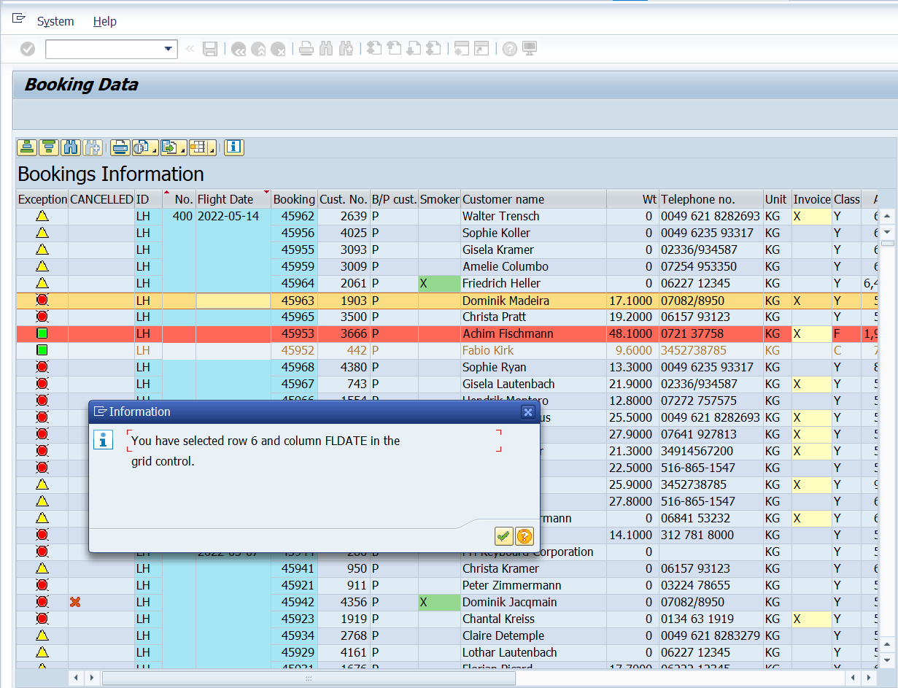

  

  #### ZB23_00045_C01

  ```ABAP
  *&---------------------------------------------------------------------*
  *& Include          ZB23_00045_C01
  *&---------------------------------------------------------------------*
  
  CLASS lcl_event_handler DEFINITION.
    PUBLIC SECTION.
      CLASS-METHODS:
        on_double_click FOR EVENT double_click OF cl_gui_alv_grid
          IMPORTING es_row_no e_column,
        on_hotspot_click FOR EVENT hotspot_click
          OF cl_gui_alv_grid
          IMPORTING es_row_no e_column_id.
  ENDCLASS.
  
  
  * 구현부
  CLASS lcl_event_handler IMPLEMENTATION.
    METHOD on_double_click.
      MESSAGE i016(bc405_408) WITH es_row_no-row_id
                                   e_column-fieldname.
    ENDMETHOD.
  
    METHOD on_hotspot_click.
      READ TABLE gt_data INTO gs_data INDEX es_row_no-row_id.
      IF sy-subrc = 0.
        CALL SCREEN 110
          STARTING AT 5 5.
      ENDIF.
    ENDMETHOD.
  ENDCLASS.
  ```

  ##### 불러온 스크린 110 을 더블클릭해 스크린을 생성한다.

  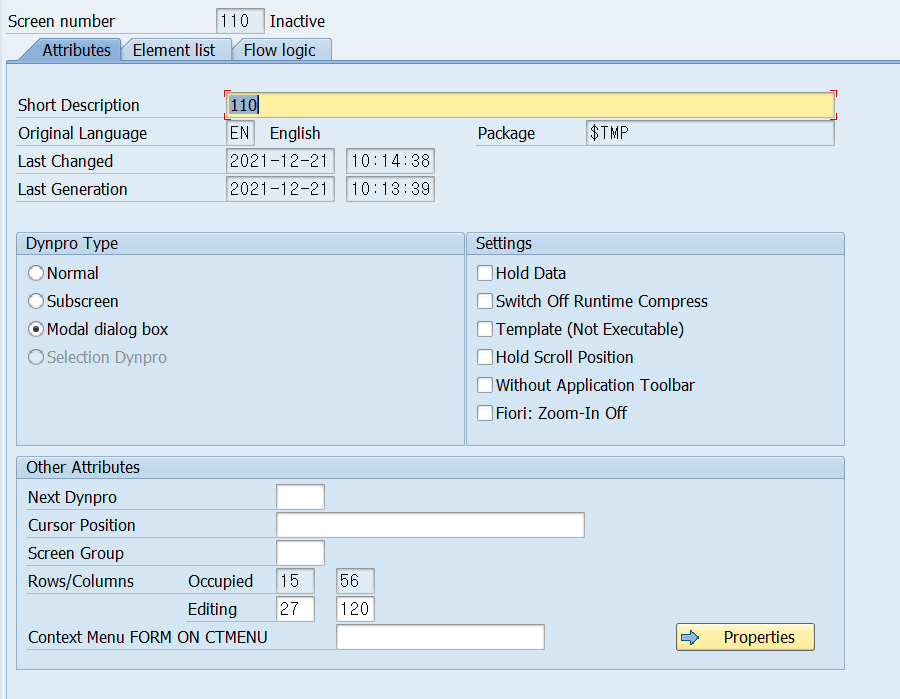

  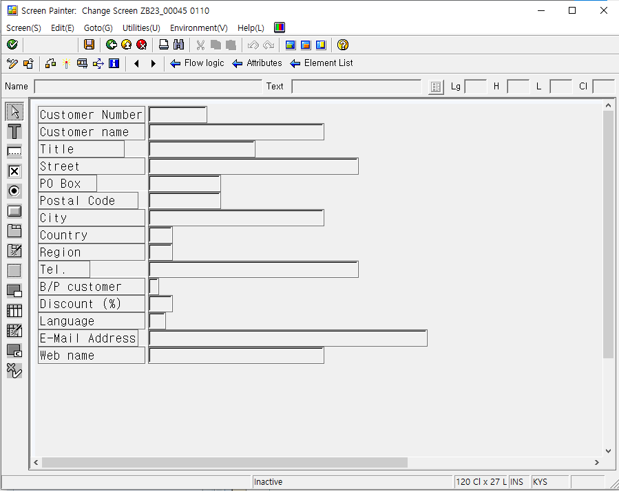

  

  #### ZB23_00045_TOP

  ```ABAP
  *&---------------------------------------------------------------------*
  *& Include          ZB23_00045_TOP
  *&---------------------------------------------------------------------*
  
  TABLES: scustom.
  ```

  ##### LAYOUT에 생성해준 필드들에 해당하는 SCUSTOM을 TOP에서 선언해 준다.

  

  #### SCREEN 110 - LOGIC FLOW

  ```ABAP
  PROCESS BEFORE OUTPUT.
  * MODULE STATUS_0110.
    MODULE get_data_customer.
  
  PROCESS AFTER INPUT.
  * MODULE user_command_0110.
  ```

  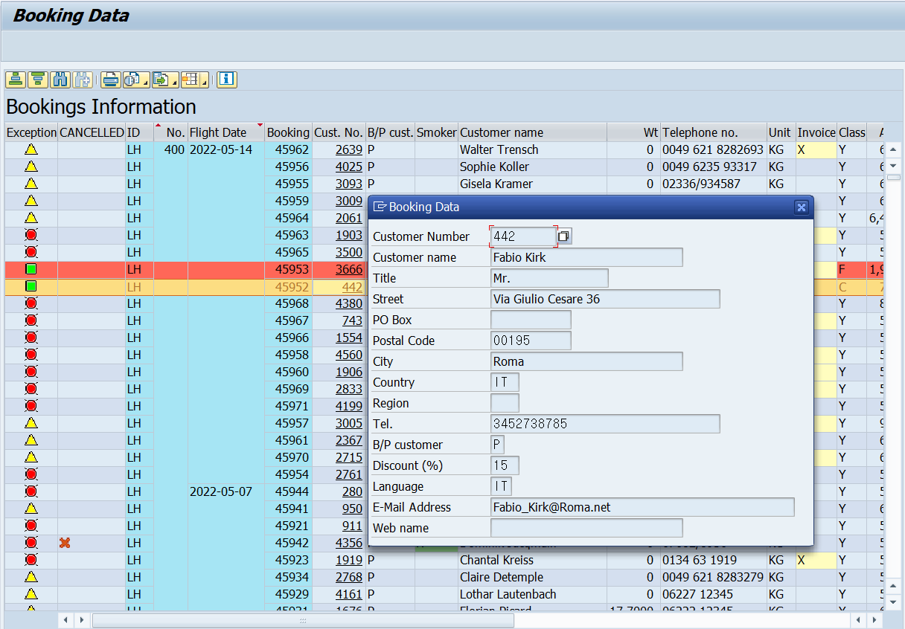

  

  

  ### 다른 방식

  #### ZB23_00045_C01

  ```ABAP
  *&---------------------------------------------------------------------*
  *& Include          ZB23_00045_C01
  *&---------------------------------------------------------------------*
  
  CLASS lcl_event_handler DEFINITION.
    PUBLIC SECTION.
  *    CLASS-METHODS:
      METHODS:
        on_double_click FOR EVENT double_click OF cl_gui_alv_grid
          IMPORTING es_row_no e_column,
        on_hotspot_click FOR EVENT hotspot_click
          OF cl_gui_alv_grid
          IMPORTING es_row_no e_column_id.
  ENDCLASS.
  
  
  * 구현부
  CLASS lcl_event_handler IMPLEMENTATION.
    METHOD on_double_click.
      READ TABLE gt_data INTO gs_data INDEX es_row_no-row_id.
      IF sy-subrc = 0.
        CALL SCREEN 110
          STARTING AT 5 5.
      ENDIF.
    ENDMETHOD.
  
    METHOD on_hotspot_click.
      READ TABLE gt_data INTO gs_data INDEX es_row_no-row_id.
      IF sy-subrc = 0.
        CALL SCREEN 110
          STARTING AT 5 5.
      ENDIF.
    ENDMETHOD.
  ENDCLASS.
  ```

  

  ```ABAP
  
      CREATE OBJECT lo_handler.
  *   생성산 ZB23_00045_C01의 CLASS METHOD ON_DOUBLE_CLICK을 GO_ALV에 연결해 준다.
      SET HANDLER: lo_handler->on_double_click FOR go_alv,
                   lo_handler->on_hotspot_click FOR go_alv.
  ```

  

  

  

  

# Lesson 2. Handling Additional Events of the ALV Grid

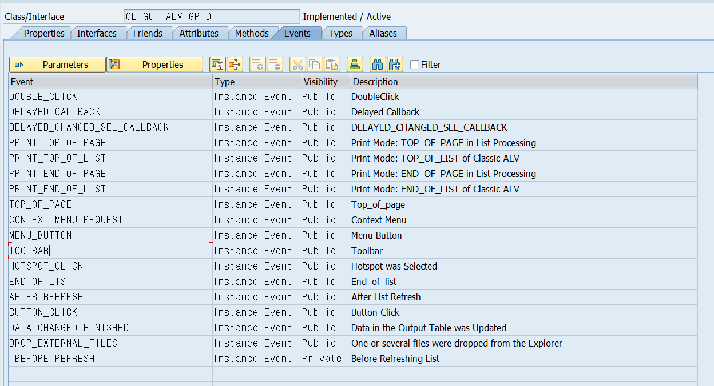

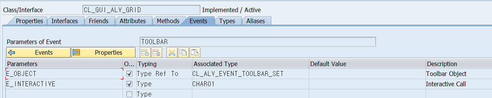

CL_GUI_ALV_GRID

의 event의 toolbar의 parameter들을 보면


CL_ALV_EVENT_TOOLBAR_SET 이라는 타입의 reference 변수가 있다.

이 타입의 attribute를 보면 MT_TOOLBAR이 있다.


* ## ON_TOOLBAR

  #### ZB23_00045_C01

  ```ABAP
  *&---------------------------------------------------------------------*
  *& Include          ZB23_00045_C01
  *&---------------------------------------------------------------------*
  
  CLASS lcl_event_handler DEFINITION.
    PUBLIC SECTION.
      CLASS-METHODS:
        on_toolbar FOR EVENT toolbar
          OF cl_gui_alv_grid
          IMPORTING e_object,
  
        on_toolbar FOR EVENT toolbar
          OF cl_gui_alv_grid
          IMPORTING e_object,
        on_user_command FOR EVENT user_command
          OF cl_gui_alv_grid
          IMPORTING e_ucomm.
  ENDCLASS.
  
  
  * 구현부
  CLASS lcl_event_handler IMPLEMENTATION.
    METHOD on_toolbar.
      DATA: ls_button TYPE stb_button.
      ls_button-butn_type = 3.
      APPEND ls_button TO e_object->mt_toolbar.
  
      CLEAR: ls_button.
      ls_button-function = 'FC1'.
      ls_button-icon     = icon_flight.
      ls_button-text     = 'FLIHGT'.
      APPEND ls_button TO e_object->mt_toolbar.
  
      CLEAR: ls_button.
      ls_button-function = 'FC2'.
      ls_button-icon     = icon_TRANSPORT.
      ls_button-text     = 'TRANSPORT'.
      APPEND ls_button TO e_object->mt_toolbar.
    ENDMETHOD.
    
    METHOD on_user_command.
      CASE e_ucomm.
        WHEN 'FC1'.
          MESSAGE i100(bc405_408) WITH e_ucomm.
        WHEN 'FC2'.
          MESSAGE i100(bc405_408) WITH e_ucomm.
      ENDCASE.
    ENDMETHOD.
  ENDCLASS.
  ```

  #### ZB23_00045_O01 - INIT_ALV 

  ```ABAP
  *   생성산 ZB23_00045_C01의 CLASS METHOD ON_DOUBLE_CLICK을 GO_ALV에 연결해 준다.
      SET HANDLER: lcl_event_handler=>on_double_click  FOR go_alv,
                   lcl_event_handler=>on_hotspot_click FOR go_alv,
                   lcl_event_handler=>on_toolbar       FOR go_alv,
                   lcl_event_handler=>on_USER_COMMAND  FOR go_alv.
  
  ```

  

  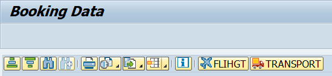

  

  ##### 버튼이 클릭시 해당 정보를 ON_USER_COMMAND 이벤트 METHOD로 보내지고 E_UCOMM에 FUNCTION CODE값이 호출 된다.

  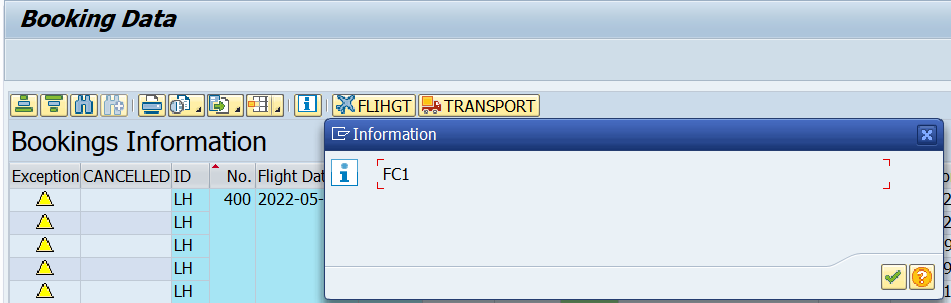


* ## Reaction to Button Clicks

  FIELD에 버튼을 넣기 위해서는 두가지의 FIELD가 필요하다.

  버튼을 처리하기 위한 CT TYPE LVC_T_STYL과 DKSDML 

  텍스트에 해당하는 BTN_TEXT TYPE C LENGTH 10 이 해당 FIELD들이다.

   LVC_T_STYL 타입의 인터널 테이블 CT 에는 FIELDNAME 과 STYLE 두개의 FIELD가 존재하며

  FIELDNAME에는 위의 BTN_TEXT가 들어가게 되며 

  STYLE에는 CL_GUI_ALV_GRID=>MC_STYLE_BUTTON이 들어가게 된다.

  

  이후 GS_LAYOUT-STYLEFNAME 에 'CT' 를 할당해 준다.

  

  이후 버튼을 클릭하게 되면 ***BUTTON_CLICK***이라는 EVENT가 발생한다.

   해당 EVENT HANLDER METHOD를 EVENT HANDLER CLASS에 정의해주고

  SET HANDLER를 해준다.


# Lesson 3. Calling Additional Methods of the ALV Grid

* ## Description of ALV Control Methods

  | Method | Description |
  | ------ | ----------- |
  |        |             |
  |        |             |
  |        |             |
  |        |             |
  |        |             |


* ## 실습	

  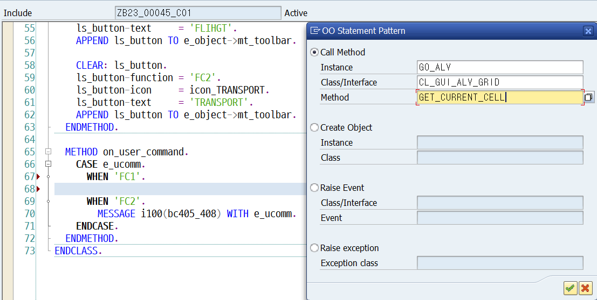

  ```ABAP
    METHOD on_user_command.
      DATA: lv_row TYPE i,
            lv_col TYPE i,
            lv_msg TYPE string.
  
      DATA: lt_row TYPE lvc_t_roid,
            ls_row LIKE LINE OF lt_row.
  
      DATA: lv_totamt TYPE sbook-loccuram.
  
      CASE e_ucomm.
        WHEN 'FC1'.
          CALL METHOD go_alv->get_current_cell
            IMPORTING
              e_row = lv_row
  *           e_value   =
              e_col = lv_col
  *           es_row_id =
  *           es_col_id =
  *           es_row_no =
            .
          lv_msg = 'Selected row : ' && lv_row && ' Column : ' && lv_col.
          MESSAGE lv_msg TYPE 'I'.
  
        WHEN 'FC2'.
          CALL METHOD go_alv->get_selected_rows
            IMPORTING
  *           et_index_rows =
              et_row_no = lt_row.
  
          LOOP AT lt_row INTO ls_row.
            READ TABLE gt_data INTO gs_data INDEX ls_row-row_id.
            IF sy-subrc = 0.
              lv_totamt = lv_totamt + gs_data-loccuram.
            ENDIF.
          ENDLOOP.
  
          lv_msg = 'Selected row total : ' && lv_totamt.
          MESSAGE lv_msg TYPE 'I'.
      ENDCASE.
    ENDMETHOD.
  ```

  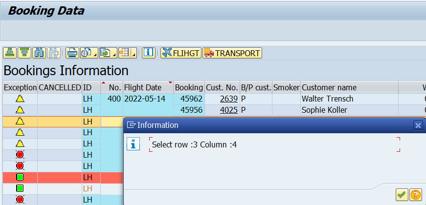

  여러건의 CELL을 클릭한 경우 마지막으로 선택한 CELL의 ROW와 COLUMN을 반환한다.

  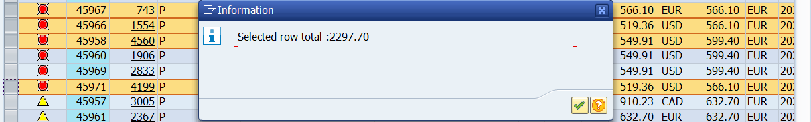


# Lesson 4. Implementing Context Menus for the ALV Grid


* ## Dynamic Context Menus

  #### Methods of CL_CTMENU CLASS:

  | Method | Description |
  | ------ | ----------- |
  |        |             |
  |        |             |
  |        |             |

  

우클릭을 통해 만들어진 메뉴 창을 클릭하면 ON_USER_COMMAND 이벤트로 전달이 된다.


# 부록

#### 중요 !!!

class 의 이벤트 수행 후 다시 PBO가 실행 되도록 하는 방법

CREAT OBJECT 의 GO_ALV에서 EXPORTING 의 I_APPL_EVENTS에 'X'를 할당해 준다.!!!


