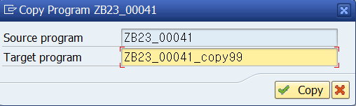
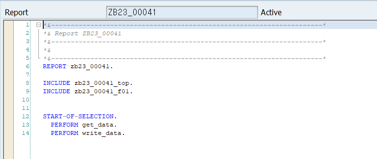

# Unit 1. Introduction to ABAP Reports


# Lesson 1. Using Standard Reports


* ## Reporting Tools

  * ### SAP Query

  * ### InfoSet query 

  * ### Quick Viewer


| Reporting Solution         | Purpose                                                      | Advantages                                                   | Limitations                                                  |
| -------------------------- | ------------------------------------------------------------ | ------------------------------------------------------------ | ------------------------------------------------------------ |
| **Standard Reports**       | 가장 일반적인 리포팅 요구사항 해결                           | 즉시 사용 가능 <br/>개발에 소요되는 시간/자원 없음           | 제한된 유연성<br/>출력 필드와 관련한 유연성 없음             |
| **Info Set Query**         | 작업자 고유 리포트를 생성하는 일반 SAP 리포팅 툴을 손쉽게 사용할 수 있다.<br/>모든 인력 자원 영역에 대한 평가 생성 가능 | 간편한 사용자 인터페이스<br/>조작이 용이<br/>프로그래밍 없음<Br/>SAP Query - Info Set 통합<br/>필요에 따라 SAP Query에서 쿼리 편집 가능<br/>Info Set Query에 대한 사용자 액세스가 역할에 통합 | 먼저 SAP Query 에서 Info Set와 사용자 그릅을 정의해야함<br/>여러개의 행으로 리스트 엔트리를 표시할 수 없음 |
| **SAP Query**              | 작업자의 고유 리포트를 생성할 수 있는 일반 SAP 리포팅 툴 <br/>사용자 그룹, Info Set 및 쿼리의 개별 정의 | 유연함<br/>프로그래밍 없음 <br/>***SAP Easy Access***메뉴에 쿼리를 배치할 수 있음<br/>데이터 집계, 계산 수행, 그래픽 표시를 지원하는 포괄적인 옵션 제공<br/>여러 개의 행으로 리스트 엔트리를 푯할 수 있음<br/>쿼리마다 기본 리스트와 복수의 통계, 순위 리스트 정의 가능 | SAP 시스템에서 제공되는 데이터로 제한됨<br/>다른 리포트 생성 툴에 비해 교육 관련 투자가 더 많이 요구됨 |
| **User own ABAP Programs** | 고객 요구사항을 구현할 수 있도록 최상의 유연성 제공          | 전 범위의 ABAP 언어를 이용할 수 있음<br/>사용하기 편리한 개발 환경 제공 | 자유로운 솔루션 이용<br/>짧은 런타임 부정확한 데이터 검색 또는 부정확한 데이터 해석등의 프로그래밍 이슈가 발생할 리스크 동반 |


* ## Advantages and Disadvantages <br/>of the ALV Grid Control and the Classic ABAP List

  | Feature                                               | ALV Grid Control | Classic ABAP List |
  | ----------------------------------------------------- | :--------------: | :---------------: |
  | 접근성                                                |      **O**       |       **X**       |
  | 세부 조회 구현 가능                                   |      **O**       |       **O**       |
  | 백그라운드에서 생성 가능                              |      **O**       |       **O**       |
  | Interactive Sorting이 표준기능으로 포함               |      **O**       |       **X**       |
  | Interactive Aggregation이 표준 기능으로 포함          |      **O**       |       **X**       |
  | Interactive Generation이 표준 기능으로 포함           |      **O**       |       **X**       |
  | Interactive Hiding이 표준 기능으로 포함               |      **O**       |       **X**       |
  | Excel Inplace가 표준 기능으로 포함                    |      **O**       |       **X**       |
  | 사용자가 열 숨기기, 열너비 변경, 열 순서 변경 가능    |      **O**       |       **X**       |
  | 프로그래머가 사용자 정의 대화형 기능을 구현할 수 있음 |      **O**       |       **O**       |
  | 단일 데이터 레코드가 여러개의 행에 표시될 수 있음     |      **X**       |       **O**       |
  
  


# Lesson 2. Implementing a Simple List


* ## Naming Convention for Includes

  | Program Type                                            | Naming Convention |
  | ------------------------------------------------------- | ----------------- |
  | ***Main Program***                                      | ZDEMO\_##         |
  | ***Top Include (global data Definitions)***             | ZDEMO\_##\_TOP    |
  | ***Process Before Output (PBO) Modules***               | ZDEMO\_##\_O01    |
  | ***Process After Input (PAI) Modules***                 | ZDEMO\_##\_I01    |
  | ***Subroutines***                                       | ZDEMO\_##\_F01    |
  | ***ABAP events. <br/>for example, START-OF-SELECTION*** | ZDEMO\_##\_E01    |

  

* ## Copy

  프로그램을 copy 할 경우 INCLUDEs 까지 copy 해야한다. 

  copy 하지 않을 경우 copy한 프로그램이 원본 프로그램의 INCLUDEs를 바라보게 되어 수정할 경우 서로 영향을 줄 수 있다.

  

  

  

  

  INCLUDE 프로그램은 COPY 한 프로그램에 맞게 변경한다.

  

  


* ## Create

  

  #### INCLUDE 프로그램을 생성할 때에는 MAIN 프로그램에서 

  ```ABAP
  INCLUDE <프로그램명>.
  ```

  #### 을 입력후 프로그램명을 더블클릭하여 생성해 준다.

  

  

  

  #### GLOBAL DATA를 선언할 경우 TOP INCLUDE 에서 정의한다.

  

  

  

  #### SUBROUTINE을 생성할 경우 F01 INCLUDE프로그램에 생성한다.

  

  

  


* ## List Generation with the WRITE Statement

  ```ABAP
  WRITE [AT]: [/<POS(LEN)>] <F> <OPTION1> <OPTION2> ....
  ```

  | WRITE | [AT]                                                         | :    | [/<POS(LEN)>]  | <F>  |        <OPTION1>        |
  | :---: | :----------------------------------------------------------- | ---- | :------------: | :--: | :---------------------: |
  |       | AT을 사용할 경우 POS(LEN)을 사용하여 작성 위치를 지정해 줄 수 있다. |      | AT과 함께 사용 |      | CENTERED 등이 들어간다. |

  

  |          |                |
  | -------- | -------------- |
  | SY-VLINE | 선을 그어준다. |
  |          |                |
  |          |                |

  ABAP Dictionary에서의 COL 타입을 확인해 보면 highlight 기능에 사용할 수 있는 색들을 확일 할 수 있다.

  |         Addtion         | Description                                                  |
  | :---------------------: | ------------------------------------------------------------ |
  |         NO-GAP          | <F> 필드 뒤에 공백을 표시하지 않음                           |
  |         NO-ZERO         | <F> 필드 값이 0인 경우 공백 출력<br/>필드 유형이 C 또는 N인 경우 맨 앞에 표시되는 0을 공백으로 대체 |
  |        DD/MM/YY         | 연도 숫자 표기를 두 자리 또는 네 자리로 결정하고 사용되는 구분 기호 결정<br/>일자, 월, 연도의 순서는 사용자의 마스터 데이터에 있는 설정에 따라 결정됨 |
  | CURRENCY <currency_key> | 금액을 표시 할때 사용<br/>같은 금액이더라도 화폐의 단위에따라 display 하는 포맷이 달라진다.<br/> |
  |     UNIT <unit_key>     | CURRENCY와 마찬가지로 단위에 따라 display하는 포맷을 달리하고 싶을 때 사용한다. |
  | USING EDIT MASK <mask>  | 특정 포맷을 정해 두고 그 포맷에 맞게 데이터가 display되도록 하고 싶을 때 사용한다.<br/>Ex ) 960203-1\***\*\*\*\*\*** |
  |        UNDER <g>        | <g> 필드가 출력된 열에서 출력 시작                           |
  |     LEFT-JUSTIFIED      | 데이터의 정렬 방식을 정해준다.                               |
  |        CENTERED         | 데이터의 정렬 방식을 정해준다.                               |
  |     RIGHT-JUSTIFIED     | 데이터의 정렬 방식을 정해준다.                               |

  ALV를 사용하여 데이터를 보여주는 경우가 더 많고 더 효율적이기 때문에 지금은 잘 사용하지 않는 방식이다.


# 학습 평가


* ### ALV Query는 SAP 가 제공하는 표준 리포팅 툴이다.

  * **TRUE**

  * #### <u>FALSE</u>

  

* ### 일반적인 리포팅 요구사항을 해결하며 개발에 따른 시간/자원이 필요없는 솔루션은 무엇인가?

  * ### <u>Standard Report</u>

  * **InfoSet Query**

  * **SAP Query**


* ### Customer-Defined Interactive Functions기능을 구현하기 위해 사용되는 툴은 무엇인가?

  * #### <u>SAP List Viewer (ALV)</u>

  * **Classic ABAP List**

  * **Quick Viewer**


* ### ZTEST 프로그램의 전역 데이터 정의는 어떤 INCLUDE프로그램에서 찾을 수 있는가?

  * **ZTEST_O01**

  * #### <u>ZTEST_TOP</u>

  * **ZTEST_I01**

  * **ZTEST_E01**

