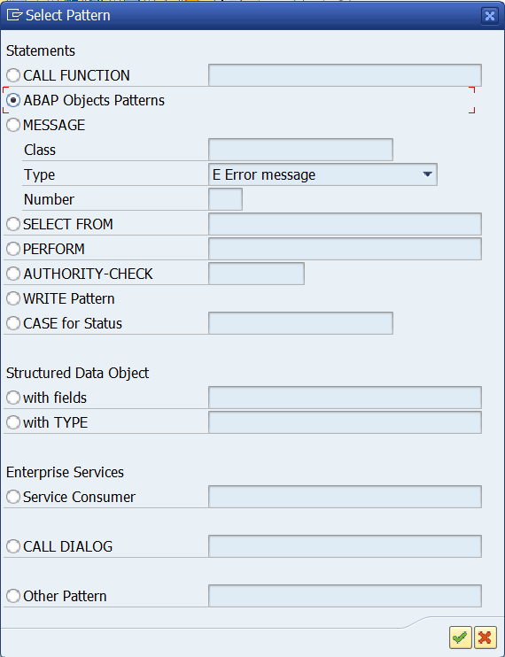
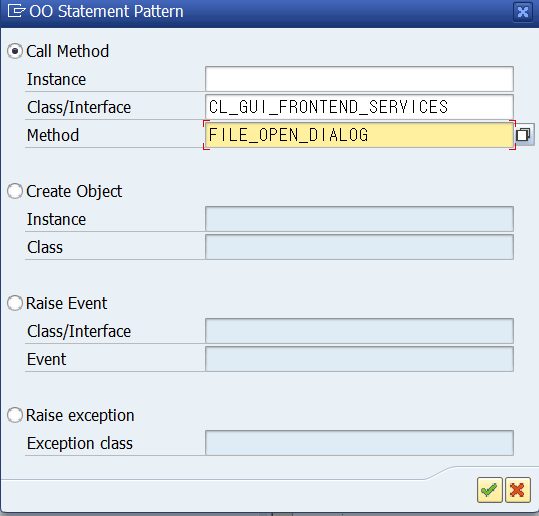
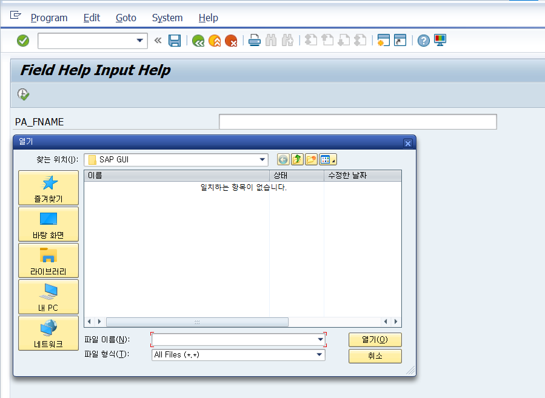
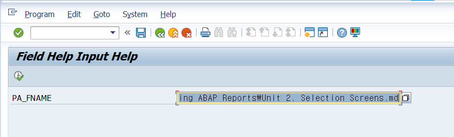

# Unit 2. Selection Screens


# Lesson 1. Implementing a Selection Screen

* ## Selection Screens

  ### Within Program

  ```ABAP
  PARAMETERS : ...
  
  SELECT-OPTIONS : ...
  ```

  ### Logical Database

  ```ABAP
  NODES: ...
  ```

  를 사용하여 Standard Selection Screen 1000번을 만들 수 있으며 스크린에는 Variant들이 존재할 수 있다.

  ```ABAP
  SELECTION-SCREEN BEGIN OF SCREEN ####.
  	...
  SELECTION-SCREEN END OF SCREEN ####.
  
  CALL SELECTION-SCREEN ####.
  ```

  을 통해 스크린을 만들고 불러 올 수 있다.


* ## Statement of PARAMETERS 

  ```ABAP
  PARAMETERS <f>
    TYPE <TYPE> 
    LIKE <F1>
    DECIMALS <N> 
    MEMORY ID <PID> 
    OBLIGATORY
    DEFAULT <VALUE> 
    LOWER CASE
    VALUE CHECK 
    AS CHECKBOX 
    RADIOBUTTON GROUP <GRP>
    MODIF ID <MOD>
  ```

  * ###  TYPE <TYPE> 

    변수의 TYPE을 지정해 준다.

    

  * ### LIKE <F1>

    변수를 통해 같은 TYPE으로 TYPE을 지정해 준다.

    

  * ### DECIMALS <N> 

    소숫점 자릿수를 정해준다.

    

  * ### MEMORY ID <PID> 

    입력값을 저장해준다.

    
  
    ```ABAP
    PARAMETERS: PA_DATE  TYPE SFLIGHT-FLDATE MEMORY ID FLD.
    ```

    

  * ### OBLIGATORY

    필수 입력 값으로 바꿔준다.

    

  * ### DEFAULT <VALUE> 

    기본 입력값을 정해준다.
  
    ```ABAP
    PARAMETERS: pa_conn  TYPE s_conn_id      DEFAULT '0017'.
    ```

    

    

  * ### LOWER CASE

    소문자도 입력이 가능하게 한다.
  
    ```ABAP
    PARAMETERS: PA_CITY2 TYPE C LENGTH 20    LOWER CASE.
    ```

    

    

    

  * ### VALUE CHECK 

    

    

  * ### AS CHECKBOX 

    DEFAULT 'X' 를 통해 체크 된 것을 기본 값으로 할 수 있다.
  
    ```ABAP
    PARAMETERS: pa_name AS CHECKBOX DEFAULT 'X',
                pa_curr AS CHECKBOX,
    ```

    

  * ### RADIOBUTTON GROUP <GRP>

    DEFAULT 'X' 를 통해 체크 된 것을 기본 값으로 할 수 있다.

    같은 이름의 GROUP 으로 묶여진 것들을 하나의 RADIOBUTTON으로 만들어준다. 

    주로 CASE문과 같이 쓰인다. 
  
    ```ABAP
    PARAMETERS: pa_lim1 RADIOBUTTON GROUP lim DEFAULT 'X',
                pa_lim2 RADIOBUTTON GROUP lim,
                pa_lim3 RADIOBUTTON GROUP lim.
                
    CASE gc_mark.
      WHEN pa_lim1.
        WRITE '1번'.
      WHEN pa_lim2.
        WRITE '2번'.
      WHEN pa_lim3.
        WRITE '3번'.
    ENDCASE.
    ```

    
  
  * ### MODIFY ID <MOD>
  
    같은 동작을 수행할 PARAMETER들 끼리 그룹을 지어줄 수 있다.


* ## SELECT-OPTIONS

  ```ABAP
  SELECT-OPTIONS: <seltab> FOR <Data Object> DEFAULT <Default>.
  
  DATA: gv_carrid TYPE s_carr_id.
  SELECT-OPTIONS: <seltab> FOR gv_carrid
  ```

  ```ABAP
  SELECT-OPTIONS: so_carr FOR sflight-carrid.
  ```

  오류가 난다 Data Object가 아니기 때문

  ===>

  ```ABAP
  DATA: gs_sflight TYPE sflight.
  
  SELECT-OPTIONS: so_carr FOR gs_flight-carrid
  ```

  

  

  

* ## Multiple Selection 

  * Select Single Values

    검색할 값들을 입력한다.

  * Select Ranges

    검색할 값을 범위로 입력한다.

    

    

    

  * Exclude Single Values

    제외할 값을 입력한다.

  * Exclude Ranges

    제외 할 범위를 입력한다.

  입력한 내용이 SELECT-OPTION의 테이블에 쌓이는것을 볼 수 있다.

  

  

* ## Statement of  SELECT-OPTIONS

  * #### DEFAULT <VALUE>

    기본값을 설정해 준다.

    

  * #### DEFAULT <VALUE1> TO <VALUE2>

    기본값을 설정해 준다.

    ```ABAP
    SELECT-OPTIONS: so_car FOR gs_flight-carrid DEFAULT 'AA' TO 'LH'.
    ```

    

    

  * #### MEMORY ID <PID>

    입력값을 저장해준다.

    ```ABAP
    SELECT-OPTIONS: SO_CARR6 FOR GS_SFLIGHT-CARRID MEMORY ID CAR.
    ```

    

  * #### LOWER CASE

    소문자를 입력 가능하게 해준다.

    ```ABAP
    SELECT-OPTIONS: SO_CARR1 FOR GS_SFLIGHT-CARRID LOWER CASE.
    ```

    

  * #### OBLIGATORY

    필수 입력으로 만들어준다.

    ```ABAP
    SELECT-OPTIONS: SO_CARR2 FOR GS_SFLIGHT-CARRID OBLIGATORY.
    ```

    

  * #### NO-EXTENSION

    Multiple Selection 버튼을 제거해 준다.

    ```ABAP
    SELECT-OPTIONS: SO_CARR4 FOR GS_SFLIGHT-CARRID NO-EXTENSION.
    ```

    

  * #### NO INTERVALS

    입력창을 하나로 만들어준다. 

    범위 검색은 Multiple Selection에서 가능하다.

    NO-EXTENSION과 같이 사용 가능하다.

    ```ABAP
    SELECT-OPTIONS: SO_CARR3 FOR GS_SFLIGHT-CARRID NO INTERVALS.
    ```

    

  * #### NO-EXTENSION NO INTERVALS

    ```ABAP
    SELECT-OPTIONS: SO_CARR5 FOR GS_SFLIGHT-CARRID NO-EXTENSION NO INTERVALS.
    ```

    

  * #### MODIF ID <MOD>

    같은 동작을 할 것들을 위해 GROUP을 지어준다.


* ## Dynamic Pre-assignment of the Selection Screen

  #### LOAD-OF-PROGRAM

  #### INITIALIZATION - 딱 한번만 실행된다

  TYPE 1 programs 에서만 사용 가능하다.

  SELECT-OPTIONS나 PARAMETERS 필드의 기본 값을 덮어 쓸 수 있다.

  따라서 SELECTION-SCREEN에 표시되는 입력 필드를 독적으로 사전 지정할 때 적합하다.

  SELECTION-SCREEN이 처음 표시 되기 전에 한번만 처리된다.7

  MOVE를 통해 SELECT-OPTION에 값을 넣어줄 수 있다. SELECTION SCREEN에서는 변화 없음

  ```ABAP
  INITIALIZATION
    MOVE: 'I' TO so_carr-sign,
          'BT' TO so_carr-option,
          'AA' TO so_carr-low,
          'LH' TO so_carr-high.
    APPEND so_carr.
  
  
    MOVE: 'I' TO so_carr-sign,
          'EQ' TO so_carr-option,
          'US' TO so_carr-low,
          ' ' TO so_carr-high.
    APPEND so_carr.
  ```

  ```ABAP
  *&---------------------------------------------------------------------*
  *& Report ZB23_00043
  *&---------------------------------------------------------------------*
  *&
  *&---------------------------------------------------------------------*
  REPORT zb23_00043.
  
  DATA: gs_flight TYPE sflight.
  
  SELECT-OPTIONS: so_car FOR gs_flight-carrid.
  
  INITIALIZATION.
    so_car-sign = 'E'.
    so_car-option = 'EQ'.
    so_car-low = 'DL'.
    APPEND so_car.
  ```

  

  #### AT SELECTION-SCREEN OUTPUT - ***PBO에 해당한다.***

  #### AT SELECTION-SCREEN - ***PAI에 해당한다.***

  #### START-OF-SELECTION

  


* ## BLOCK, ROW

  * #### BLOCK

    SELECTION-SCREEN에 블록을 만들어준다.

    ```ABAP
    SELECTION-SCREEN BEGIN OF BLOCK carr WITH FRAME TITLE TEXT-t01.
    
      SELECT-OPTIONS: so_carr FOR gs_sflight-carrid DEFAULT 'AA',
                      so_conn FOR gs_sflight-connid.
      
    SELECTION-SCREEN END OF BLOCK carr.
    ```

  * #### LINE

    안의 값들을 한줄에 프린트 해준다.

    ```ABAP
    *&---------------------------------------------------------------------*
    *& Report ZB23_00043
    *&---------------------------------------------------------------------*
    *&
    *&---------------------------------------------------------------------*
    REPORT zb23_00043.
    
    DATA: gs_flight TYPE sflight,
          gt_scarr  TYPE TABLE OF scarr.
          
    SELECTION-SCREEN BEGIN OF BLOCK blk1 WITH FRAME TITLE TEXT-t01.
      SELECT-OPTIONS: so_car FOR gs_flight-carrid DEFAULT 'AA' TO 'LH',
                      so_con FOR gs_flight-connid NO-EXTENSION NO INTERVALS.
    SELECTION-SCREEN END OF BLOCK blk1.
    
    SELECTION-SCREEN BEGIN OF BLOCK blk2 WITH FRAME TITLE TEXT-t02.
      SELECTION-SCREEN BEGIN OF LINE.
        SELECTION-SCREEN COMMENT 1(15) TEXT-002.
    
        SELECTION-SCREEN COMMENT 20(15) TEXT-003 FOR FIELD pa_all.
      	" FOR FIELD 를 통해 파라미터와 연결해 주면 TEXT를 클릭해도 체크 박스가 클릭된다.
        PARAMETERS: pa_all AS CHECKBOX.
    
        SELECTION-SCREEN COMMENT 40(15) TEXT-004.
        PARAMETERS: pa_ico AS CHECKBOX.
      SELECTION-SCREEN END OF LINE.
    
      SELECTION-SCREEN SKIP.
    
      SELECTION-SCREEN BEGIN OF BLOCK blk3 WITH FRAME.
        PARAMETERS: pa_carr TYPE scarr-carrid.
      SELECTION-SCREEN END OF BLOCK blk3.
    SELECTION-SCREEN END OF BLOCK blk2.
    
    ```

    

    


* ## Exercise 3

  #### ZBC405_B23_SOL - MAIN

  ```ABAP
  *&---------------------------------------------------------------------*
  *& Report ZBC405_B23_SOL
  *&---------------------------------------------------------------------*
  *&
  *&---------------------------------------------------------------------*
  REPORT zbc405_b23_sol.
  
  INCLUDE zbc405_b23_sol_top.
  INCLUDE zbc405_b23_sol_e01.
  INCLUDE zbc405_b23_sol_f01.
  ```

  #### ZBC405_B23_SOL_TOP

  ```ABAP
  *&---------------------------------------------------------------------*
  *& Include          ZBC405_B23_SOL_TOP
  *&---------------------------------------------------------------------*
  DATA: gs_flights TYPE dv_flights.
  
  CONSTANTS gc_mark VALUE 'X'.
  
  SELECT-OPTIONS: so_car FOR gs_flights-carrid MEMORY ID car,
                  so_con FOR gs_flights-connid,
                  so_fld FOR gs_flights-fldate NO-EXTENSION.
  
  SELECTION-SCREEN SKIP 3.
  
  SELECTION-SCREEN BEGIN OF BLOCK radio WITH FRAME TITLE TEXT-001.
    SELECTION-SCREEN SKIP.
    PARAMETERS: pa_rad1 RADIOBUTTON GROUP gr1,
                pa_rad2 RADIOBUTTON GROUP gr1,
                pa_rad3 RADIOBUTTON GROUP gr1 DEFAULT 'X'.
    SELECTION-SCREEN SKIP.
  SELECTION-SCREEN END OF BLOCK radio.
  ```

  #### ZBC405_B23_SOL_E01

  ```ABAP
  *&---------------------------------------------------------------------*
  *& Include          ZBC405_B23_SOL_E01
  *&---------------------------------------------------------------------*
  
  INITIALIZATION.
    so_car-sign   = 'I'.
    so_car-option = 'BT'.
    so_car-low    = 'AA'.
    so_car-high   = 'QF'.
    APPEND so_car.
  
    CLEAR so_car.
    so_car-low    = 'AZ'.
    so_car-option = 'EQ'.
    so_car-sign   = 'E'.
    APPEND so_car.
  
  START-OF-SELECTION.
    CASE gc_mark.
      WHEN pa_rad1.
        SELECT * INTO gs_flights
          FROM dv_flights
         WHERE carrid IN so_car
           AND connid IN so_con
           AND fldate IN so_fld.
          PERFORM write_data USING gs_flights.
  
        ENDSELECT.
      WHEN pa_rad2.
        SELECT * INTO gs_flights
          FROM dv_flights
          WHERE countryto = dv_flights~countryfr
           AND carrid IN so_car
           AND connid IN so_con
           AND fldate IN so_fld.
          PERFORM write_data USING gs_flights.
        ENDSELECT.
  
      WHEN pa_rad3.
        SELECT * INTO gs_flights
          FROM dv_flights
         WHERE countryto <> dv_flights~countryfr
           AND carrid IN so_car
           AND connid IN so_con
           AND fldate IN so_fld.
          PERFORM write_data USING gs_flights.
        ENDSELECT.
      WHEN OTHERS.
    ENDCASE.
  ```

  #### ZBC405_B23_SOL_F01

  ```ABAP
  *&---------------------------------------------------------------------*
  *& Include          ZBC405_B23_SOL_F01
  *&---------------------------------------------------------------------*
  *&---------------------------------------------------------------------*
  *& Form write_data
  *&---------------------------------------------------------------------*
  *& text
  *&---------------------------------------------------------------------*
  *&      --> GS_FLIGHT
  *&---------------------------------------------------------------------*
  FORM write_data  USING p_flights TYPE dv_flights.
    WRITE:/ sy-vline,
            p_flights-carrid CENTERED,
            sy-vline,
            p_flights-connid CENTERED,
            sy-vline,
            p_flights-fldate CENTERED,
            sy-vline,
            p_flights-countryfr CENTERED,
            sy-vline,
            p_flights-cityfrom CENTERED,
            sy-vline,
            p_flights-airpfrom CENTERED,
            sy-vline,
            p_flights-countryto CENTERED,
            sy-vline,
            p_flights-cityto CENTERED,
            sy-vline,
            p_flights-airpto CENTERED,
            sy-vline,
            p_flights-price CURRENCY p_flights-currency RIGHT-JUSTIFIED,
            sy-vline,
            p_flights-currency LEFT-JUSTIFIED,
            sy-vline,
            p_flights-seatsmax CENTERED,
            sy-vline,
            p_flights-seatsocc CENTERED,
            sy-vline.
  ENDFORM.
  ```

  

# Lesson 2. Implementing Multiple Selection Screens


* ## Selection Screens as Subscreens

  ```ABAP
  SELECTION-SCREEN BEGIN OF SCREEN ### AS SUBSCREEN.
    ___
  SELECTION-SCREEN END OF SCREEN ###
  ```

  와 같이 구현한다.

  

* ### Tabstrips on Selection Screens

  Report 프로그램에서도 Tabstrip을 구현할 수 있으며 주로 subscreen을 이용하여 구현한다.

  ```ABAP
  SELECTION-SCREEN BEGIN OF TABBED BLOCK <Name of tab box> FOR # LINES.
    SELECTION-SCREEN TAB (10) tab1 USER-COMMAND comm1 DEFAULT SCREEN 101.
    SELECTION-SCREEN TAB ( <Maximum Length of tab page> ) <Name of tab page> 
    	USER-COMMAND <User command for switching tab pages> DEFAULT SCREEN ###.
  SELECTION-SCREEN END OF SCREEN ###.
  
  tab_block-activetab = 'comm2'.
  ```

  


* ## Exercise 4

  ####   ZBC405_B23_TAB

  ```ABAP
  *&---------------------------------------------------------------------*
  *& Report ZBC405_B23_SOL
  *&---------------------------------------------------------------------*
  *&
  *&---------------------------------------------------------------------*
  REPORT zbc405_b23_tab.
  
  INCLUDE ZBC405_B23_TAB_TOP.
  *INCLUDE zbc405_b23_sol_top.
  INCLUDE ZBC405_B23_TAB_E01.
  *INCLUDE zbc405_b23_sol_e01.
  INCLUDE ZBC405_B23_TAB_F01.
  *INCLUDE zbc405_b23_sol_f01.
  ```

  #### ZBC405_B23_TAB_TOP

  ```ABAP
  *&---------------------------------------------------------------------*
  *& Include          ZBC405_B23_SOL_TOP
  *&---------------------------------------------------------------------*
  
  DATA: gs_flights TYPE dv_flights.
  
  CONSTANTS gc_mark VALUE 'X'.
  
  * SELECT-OPTIONS 를 통해 CARRID의 검색 범위를 입력할 탭에 들어갈 SUBSCREEN 1100을 생성
  SELECTION-SCREEN BEGIN OF SCREEN 1100 AS SUBSCREEN.
    SELECTION-SCREEN SKIP 1.
    SELECT-OPTIONS: so_car FOR gs_flights-carrid MEMORY ID car,
                    so_con FOR gs_flights-connid.
  SELECTION-SCREEN END OF SCREEN 1100.
  
  * SELECT-OPTIONS 를 통해 CONNID의 검색 범위를 입력할 탭에 들어갈 SUBSCREEN 1200을 생성
  SELECTION-SCREEN BEGIN OF SCREEN 1200 AS SUBSCREEN.
    SELECTION-SCREEN SKIP 2.
    SELECT-OPTIONS: so_fld FOR gs_flights-fldate NO-EXTENSION.
  SELECTION-SCREEN END OF SCREEN 1200.
  
  * SELECT-OPTIONS 를 통해 FLDATE의 검색 범위를 입력할 탭에 들어갈 SUBSCREEN 1300을 생성
  SELECTION-SCREEN BEGIN OF SCREEN 1300 AS SUBSCREEN.
    SELECTION-SCREEN BEGIN OF BLOCK radio WITH FRAME TITLE TEXT-001.
      PARAMETERS: pa_rad1 RADIOBUTTON GROUP gr1,
                  pa_rad2 RADIOBUTTON GROUP gr1,
                  pa_rad3 RADIOBUTTON GROUP gr1 DEFAULT 'X'.
    SELECTION-SCREEN END OF BLOCK radio.
  SELECTION-SCREEN END OF SCREEN 1300.
  
  * 크기가 2줄 짜리인 TAB을 생성하여
  SELECTION-SCREEN BEGIN OF TABBED BLOCK tab_block FOR 5 LINES.
    SELECTION-SCREEN TAB (20) tab1 USER-COMMAND comm1 DEFAULT SCREEN 1100.
  * SUBSCREEN 1100 번을 들어갈 텍스트의 최대 길이를 20으로 설정한
  * TAB1 이름인 첫번째 TAB에 넣고 USER-COMMEND를 COMM1으로 지정한다.
    SELECTION-SCREEN TAB (20) tab2 USER-COMMAND comm2 DEFAULT SCREEN 1200.
  * SUBSCREEN 1200 번을 들어갈 텍스트의 최대 길이를 20으로 설정한
  * TAB2 이름인 두번째 TAB에 넣고 USER-COMMEND를 COMM2으로 지정한다.
    SELECTION-SCREEN TAB (20) tab3 USER-COMMAND comm3 DEFAULT SCREEN 1300.
  * SUBSCREEN 1300 번을 들어갈 텍스트의 최대 길이를 20으로 설정한
  * TAB3 이름인 세번째 TAB에 넣고 USER-COMMEND를 COMM3으로 지정한다.
  SELECTION-SCREEN END OF BLOCK tab_block.
  ```

  #### ZBC405_B23_SOL_E01

  ```ABAP
  *&---------------------------------------------------------------------*
  *& Include          ZBC405_B23_SOL_E01
  *&---------------------------------------------------------------------*
  
  INITIALIZATION.
    so_car-sign   = 'I'.
    so_car-option = 'BT'.
    so_car-low    = 'AA'.
    so_car-high   = 'QF'.
    APPEND so_car.
  
    CLEAR so_car.
    so_car-low    = 'AZ'.
    so_car-option = 'EQ'.
    so_car-sign   = 'E'.
    APPEND so_car.
  
  * Setting texts for pushbuttons of tab
    tab1 = 'Flight connections'.
    tab2 = 'Flight date'.
    tab3 = 'Flight type'.
  * Setting initial active tab
    tab_block-activetab = 'COMM2'.
    tab_block-dynnr = 1200.
  
  * ALL/국내선/국제선 을 선택하는 RADIO 버튼이 선택된 상태에서 실행되는 로직
  START-OF-SELECTION.
    CASE gc_mark.
  *      VALUE가 'X'인 것이
      WHEN pa_rad1.
  *        첫번째 버튼인경우
        SELECT * INTO gs_flights
          FROM dv_flights
         WHERE carrid IN so_car
           AND connid IN so_con
           AND fldate IN so_fld.
          PERFORM write_data USING gs_flights.
  *       출력부가 길며 같은 동작을 여러번 수행하고 있으므로 SUBROUTINE으로 만들어 F01에 저장하여 사용한다.
  
        ENDSELECT.
      WHEN pa_rad2.
  *        두번째 버튼인경우
        SELECT * INTO gs_flights
          FROM dv_flights
          WHERE countryto = dv_flights~countryfr
  *             도착 국가와 출발 국가가 같은 경우 => 국내선
           AND carrid IN so_car
           AND connid IN so_con
           AND fldate IN so_fld.
          PERFORM write_data USING gs_flights.
  *       출력부가 길며 같은 동작을 여러번 수행하고 있으므로 SUBROUTINE으로 만들어 F01에 저장하여 사용한다.
        ENDSELECT.
  
      WHEN pa_rad3.
  *        세번째 버튼인경우
        SELECT * INTO gs_flights
          FROM dv_flights
         WHERE countryto <> dv_flights~countryfr
  *             도착 국가와 출발 국가가 다른 경우 => 국제선
           AND carrid IN so_car
           AND connid IN so_con
           AND fldate IN so_fld.
          PERFORM write_data USING gs_flights.
  *       출력부가 길며 같은 동작을 여러번 수행하고 있으므로 SUBROUTINE으로 만들어 F01에 저장하여 사용한다.
        ENDSELECT.
      WHEN OTHERS.
    ENDCASE.
  ```

  #### ZBC405_B23_SOL_F01

  ```ABAP
  *&---------------------------------------------------------------------*
  *& Include          ZBC405_B23_SOL_F01
  *&---------------------------------------------------------------------*
  *&---------------------------------------------------------------------*
  *& Form write_data
  *&---------------------------------------------------------------------*
  *& text
  *&---------------------------------------------------------------------*
  *&      --> GS_FLIGHT
  *&---------------------------------------------------------------------*
  FORM write_data  USING p_flights TYPE dv_flights.
    WRITE:/ sy-vline,
            p_flights-carrid CENTERED,
            sy-vline,
            p_flights-connid CENTERED,
            sy-vline,
            p_flights-fldate CENTERED,
            sy-vline,
            p_flights-countryfr CENTERED,
            sy-vline,
            p_flights-cityfrom CENTERED,
            sy-vline,
            p_flights-airpfrom CENTERED,
            sy-vline,
            p_flights-countryto CENTERED,
            sy-vline,
            p_flights-cityto CENTERED,
            sy-vline,
            p_flights-airpto CENTERED,
            sy-vline,
            p_flights-price CURRENCY p_flights-currency RIGHT-JUSTIFIED,
            sy-vline,
            p_flights-currency LEFT-JUSTIFIED,
            sy-vline,
            p_flights-seatsmax CENTERED,
            sy-vline,
            p_flights-seatsocc CENTERED,
            sy-vline.
  ENDFORM.
  ```

  

  

  

  

# Lesson 3. Implementing Input checks and Creating Variants


* ## Input Check

  ```ABAP
  AT SELECTION-SCREEN ON so_dept.
    IF so_dept-low LT '060000' AND so_dept-high LT '060000'.
    	MESSAGE e046(bc405)
    ENDIF.
  ```

  AT SELECTION-SCREEN ON을 사용하여 INPUT CHECK를 구현한다.


* ## Field Help and Input Help

  ```ABAP
  AT SELECTION-SCREEN ON HELP-REQUEST  FOR [<param>|<sel_opt>].
  AT SELECTION-SCREEN ON VALUE-REQUEST FOR [<param>|<sel_opt-low>|<sel_opt-high>].
  ```

  

* ## 실습

  #### 시나리오

  파일 경로를 찾을 수 있는 F4 HELP 만들기

  

  #### PATTERN을 눌러

  

  #### ABAP OBJECTS PATTERNS를 클릭후 체크 버튼을 누른다.

  

  #### 파일 경로 관련 메소드를 찾아 코드에 넣는다.

  

  

  ```ABAP
  *&---------------------------------------------------------------------*
  *& Report ZB23_00044
  *&---------------------------------------------------------------------*
  *&
  *&---------------------------------------------------------------------*
  REPORT zb23_00044.
  
  DATA: gt_file TYPE filetable,
        gs_file LIKE LINE OF gt_file.
  
  DATA: gv_rc TYPE i.
  
  PARAMETERS: pa_fname TYPE string.
  
  AT SELECTION-SCREEN ON VALUE-REQUEST FOR pa_fname.
  *Search Help 버튼이 생성된다.
    CALL METHOD cl_gui_frontend_services=>file_open_dialog
  *  EXPORTING
  *    window_title            =
  *    default_extension       =
  *    default_filename        =
  *    file_filter             =
  *    with_encoding           =
  *    initial_directory       =
  *    multiselection          =
      CHANGING
        file_table              = gt_file
        rc                      = gv_rc
  *     user_action             =
  *     file_encoding           =
      EXCEPTIONS
        file_open_dialog_failed = 1
        cntl_error              = 2
        error_no_gui            = 3
        not_supported_by_gui    = 4
        OTHERS                  = 5.
    IF sy-subrc <> 0.
  * Implement suitable error handling here
    ENDIF.
  
    READ TABLE gt_file INTO gs_file INDEX 1.
    pa_fname = gs_file-filename.
  ```

  

# Lesson 4. Modifying the Selection Screens at Runtime 


* ## Evaluating Selection Screen Buttons

  버튼이 눌려졌을 때 PAI에 해당하는 AT SELECTION-SCREEN이벤트의 로직이 실행된다.


SCREEN이라는 Structure와 SCREEN이라는 System Table


Selection-Screen 에서는 group 1만 사용이 가능하다.

따라서 MODIFID 를 이용해 ID를 할당하게 되면 SCREEN의 GROUP 1에 할다이 된다.


AT SELECTION-SCREEN OUTPUT.

에서 MODIFY SCREEN 구문을 꼭 추가한다.


* ## Excercise 6

  #### 시나리오

  INPUT FIELD를 열고 닫는 버튼생성

  #### ZBC405_B23_BUT

  ```ABAP
  *&---------------------------------------------------------------------*
  *& Report ZBC405_B23_SOL
  *&---------------------------------------------------------------------*
  *&
  *&---------------------------------------------------------------------*
  REPORT zbc405_b23_but.
  
  INCLUDE ZBC405_B23_BUT_TOP.
  INCLUDE ZBC405_B23_BUT_E01.
  INCLUDE ZBC405_B23_BUT_F01.
  ```

  #### ZBC405_B23_BUT_TOP

  ```ABAP
  *&---------------------------------------------------------------------*
  *& Include          ZBC405_B23_SOL_TOP
  *&---------------------------------------------------------------------*
  
  TABLES: sscrfields.
  
  DATA: gs_flights TYPE dv_flights,
        gv_chg     TYPE i VALUE 1.
  *     버튼을 누를때 마다 값을 바꾸며 SCREEN-INPUT에게 할달해줄 값.
  
  *CONSTANTS gc_mark VALUE 'X'.
  
  * SELECT-OPTIONS 를 통해 CARRID의 검색 범위를 입력할 탭에 들어갈 SUBSCREEN 1100을 생성
  SELECTION-SCREEN BEGIN OF SCREEN 1100 AS SUBSCREEN.
    SELECT-OPTIONS: so_car FOR gs_flights-carrid MEMORY ID car MODIF ID mod,
  *                                              입력값 기억      REPORT 프로그램은 GROUP1만 사용 가능하다. GROUP1을 MOD로 설정해 준다.
                    so_con FOR gs_flights-connid MODIF ID mod.
  *                                              REPORT 프로그램은 GROUP1만 사용 가능하다. GROUP1을 MOD로 설정해 준다.
    SELECTION-SCREEN SKIP.
  * 줄바꾸기
    SELECTION-SCREEN PUSHBUTTON /pos_low(20) btn USER-COMMAND push.
  * 입력 버튼을 만들어 주며 FCTCODE를 PUSH로 설정해 준다.
  SELECTION-SCREEN END OF SCREEN 1100.
  
  * SELECT-OPTIONS 를 통해 CONNID의 검색 범위를 입력할 탭에 들어갈 SUBSCREEN 1200을 생성
  SELECTION-SCREEN BEGIN OF SCREEN 1200 AS SUBSCREEN.
    SELECT-OPTIONS: so_fld FOR gs_flights-fldate NO-EXTENSION.
  SELECTION-SCREEN END OF SCREEN 1200.
  
  * SELECT-OPTIONS 를 통해 FLDATE의 검색 범위를 입력할 탭에 들어갈 SUBSCREEN 1300을 생성
  SELECTION-SCREEN BEGIN OF SCREEN 1300 AS SUBSCREEN.
    SELECTION-SCREEN BEGIN OF BLOCK radio WITH FRAME TITLE TEXT-001.
      PARAMETERS: pa_rad1 RADIOBUTTON GROUP gr1,
                  pa_rad2 RADIOBUTTON GROUP gr1,
                  pa_rad3 RADIOBUTTON GROUP gr1 DEFAULT 'X'.
    SELECTION-SCREEN END OF BLOCK radio.
  SELECTION-SCREEN END OF SCREEN 1300.
  
  * 크기가 2줄 짜리인 TAB을 생성하여
  SELECTION-SCREEN BEGIN OF TABBED BLOCK tab_block FOR 5 LINES.
    SELECTION-SCREEN TAB (20) tab1 USER-COMMAND comm1 DEFAULT SCREEN 1100.
  * SUBSCREEN 1100 번을 들어갈 텍스트의 최대 길이를 20으로 설정한
  * TAB1 이름인 첫번째 TAB에 넣고 USER-COMMEND를 COMM1으로 지정한다.
    SELECTION-SCREEN TAB (20) tab2 USER-COMMAND comm2 DEFAULT SCREEN 1200.
  * SUBSCREEN 1200 번을 들어갈 텍스트의 최대 길이를 20으로 설정한
  * TAB2 이름인 두번째 TAB에 넣고 USER-COMMEND를 COMM2으로 지정한다.
    SELECTION-SCREEN TAB (20) tab3 USER-COMMAND comm3 DEFAULT SCREEN 1300.
  * SUBSCREEN 1300 번을 들어갈 텍스트의 최대 길이를 20으로 설정한
  * TAB3 이름인 세번째 TAB에 넣고 USER-COMMEND를 COMM3으로 지정한다.
  SELECTION-SCREEN END OF BLOCK tab_block.
  ```

  #### ZBC405_B23_BUT_E01

  ```ABAP
  *&---------------------------------------------------------------------*
  *& Include          ZBC405_B23_SOL_E01
  *&---------------------------------------------------------------------*
  
  INITIALIZATION.
  * Setting texts for pushbuttons of tab
    tab1 = 'Flight Connections'(t01).
    tab2 = 'Flight Date'(t02).
    tab3 = 'Flight Type'(t03).
  * Setting initial active tab
  *  tab_block-activetab = 'COMM2'.
  *  tab_block-dynnr = 1200.
  
    btn = 'Display/Change'.
  * 버튼에 display될 텍스트를 설정해 준다.
  
  
    so_car-sign   = 'I'.
    so_car-option = 'BT'.
    so_car-low    = 'AA'.
    so_car-high   = 'QF'.
    APPEND so_car.
  
    CLEAR so_car.
    so_car-low    = 'AZ'.
    so_car-option = 'EQ'.
    so_car-sign   = 'E'.
    APPEND so_car.
  
  
  
  AT SELECTION-SCREEN OUTPUT.
    " PBO 모듈 파트
    IF sy-dynnr = '1100'.
  * 지금 화면이 1100번 화면이면
      LOOP AT SCREEN.
  *   SCREEN을 LOOP문으로 돌며
        IF screen-group1 = 'MOD'.
  *     GROUP1이 MOD인 경우
          screen-input = gv_chg.
  *       INPUT 상태를 현재 GV_CHG로 갱신한다. (0인경우 입력 불가 1인 경우 입력 가능)
  *       screen-active = gv_chg.
  
        ENDIF.
        MODIFY SCREEN.
  *       화면을 갱신해 준다.
      ENDLOOP.
    ENDIF.
  
  
  
  
  
  AT SELECTION-SCREEN.
  *PAI 모듈 파트
    IF sy-dynnr = '1100'.
  * 현재 화면이 1100번 인 경우
      CASE sscrfields-ucomm.
  *   SSCRFIELDS-UCOMM 버튼 등을 통해 입력된 값을 CASE문을 통해
        WHEN 'PUSH'.
  *     PUSH 인 경우에
          IF gv_chg = 1.
  *       GV_CHG가 지금 1이면
            gv_chg = 0.
  *         0으로 갱신해 주고
          ELSE.
  *       0 인 경우
            gv_chg = 1.
  *         1로 갱신해 준다.
          ENDIF.
      ENDCASE.
    ENDIF.
  
  
  
  
  
  
  START-OF-SELECTION.
  * ALL/국내선/국제선 을 선택하는 RADIO 버튼이 선택된 상태에서 실행되는 로직
    CASE 'X'.
  *      VALUE가 'X'인 것이
      WHEN pa_rad1.
  *        첫번째 버튼인경우
        SELECT * INTO gs_flights
          FROM dv_flights
         WHERE carrid IN so_car
           AND connid IN so_con
           AND fldate IN so_fld.
          PERFORM write_data USING gs_flights.
  *       출력부가 길며 같은 동작을 여러번 수행하고 있으므로 SUBROUTINE으로 만들어 F01에 저장하여 사용한다.
  
        ENDSELECT.
      WHEN pa_rad2.
  *        두번째 버튼인경우
        SELECT * INTO gs_flights
          FROM dv_flights
         WHERE fldate IN so_fld
           AND carrid IN so_car
           AND connid IN so_con
           AND countryto = dv_flights~countryfr.
  *             도착 국가와 출발 국가가 같은 경우 => 국내선
          PERFORM write_data USING gs_flights.
  *       출력부가 길며 같은 동작을 여러번 수행하고 있으므로 SUBROUTINE으로 만들어 F01에 저장하여 사용한다.
        ENDSELECT.
  
      WHEN pa_rad3.
  *        세번째 버튼인경우
        SELECT * INTO gs_flights
          FROM dv_flights
         WHERE fldate IN so_fld
           AND carrid IN so_car
           AND connid IN so_con
           AND countryto <> dv_flights~countryfr.
  *             도착 국가와 출발 국가가 다른 경우 => 국제선
          PERFORM write_data USING gs_flights.
  *       출력부가 길며 같은 동작을 여러번 수행하고 있으므로 SUBROUTINE으로 만들어 F01에 저장하여 사용한다.
        ENDSELECT.
      WHEN OTHERS.
    ENDCASE.
  ```

  #### ZBC405_B23_BUT_F01

  ```ABAP
  *&---------------------------------------------------------------------*
  *& Include          ZBC405_B23_SOL_F01
  *&---------------------------------------------------------------------*
  *&---------------------------------------------------------------------*
  *& Form write_data
  *&---------------------------------------------------------------------*
  *& text
  *&---------------------------------------------------------------------*
  *&      --> GS_FLIGHT
  *&---------------------------------------------------------------------*
  FORM write_data  USING p_flights TYPE dv_flights.
    WRITE:/ sy-vline,
            p_flights-carrid CENTERED,
            sy-vline,
            p_flights-connid CENTERED,
            sy-vline,
            p_flights-fldate CENTERED,
            sy-vline,
            p_flights-countryfr CENTERED,
            sy-vline,
            p_flights-cityfrom CENTERED,
            sy-vline,
            p_flights-airpfrom CENTERED,
            sy-vline,
            p_flights-countryto CENTERED,
            sy-vline,
            p_flights-cityto CENTERED,
            sy-vline,
            p_flights-airpto CENTERED,
            sy-vline,
            p_flights-price CURRENCY p_flights-currency RIGHT-JUSTIFIED,
            sy-vline,
            p_flights-currency LEFT-JUSTIFIED,
            sy-vline,
            p_flights-seatsmax CENTERED,
            sy-vline,
            p_flights-seatsocc CENTERED,
            sy-vline.
  ENDFORM.
  ```

  