# Unit 3. ASP List Viewer (ALV)


# Lesson 1. Using ALV Functionality


* ## ALV Standard Functions

  


# Lesson 2. Preparing the Container Screen for an ALV Grid Control


기본적으로 Report 프로그램을 사용하여 100번 스크린에서 ALV Grid를 사용하여 출력한다. 


SAP Enjoy Control 의 ALV Grid Control 사용 하며 이를 사용하기 위해서는 100번 스크린을 만들며 100번 스크린에 Area를 생성해 그 위의 Container Control을 생성, 그 위에 ALV Grid를 display 한다.  


* ## SCREEN 100 / AREA 생성

  #### ZB23_00045

  ```ABAP
  *&---------------------------------------------------------------------*
  *& Report ZB23_00045
  *&---------------------------------------------------------------------*
  *&
  *&---------------------------------------------------------------------*
  REPORT zb23_00045.
  
  INCLUDE ZB23_00045_top.
  INCLUDE ZB23_00045_o01.
  INCLUDE ZB23_00045_i01.
  INCLUDE ZB23_00045_f01.
  
  INITIALIZATION.
    so_car-sign = 'I'.
    so_car-option = 'EQ'.
    so_car-low = 'LH'.
    APPEND so_car.
  
    so_con-sign = 'I'.
    so_con-option = 'EQ'.
    so_con-low = '0400'.
    APPEND so_con.
  
  START-OF-SELECTION.
    PERFORM get_data.
  
    CALL SCREEN 100.
  ```

  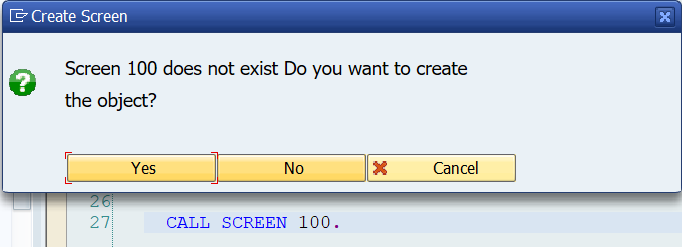

  #### CALL SCREEN 100.의 100을 더블클릭해 스크린 100을 생성한다.

  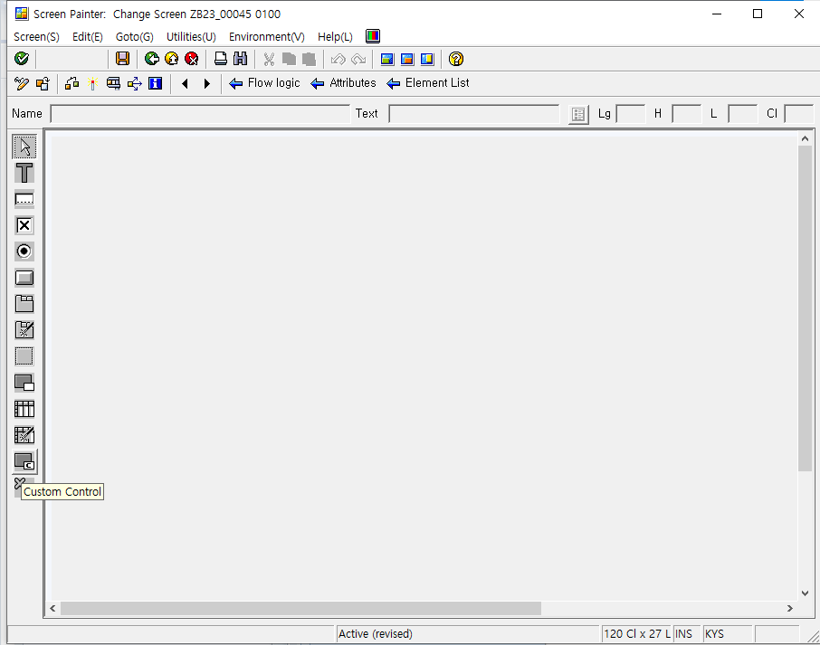

  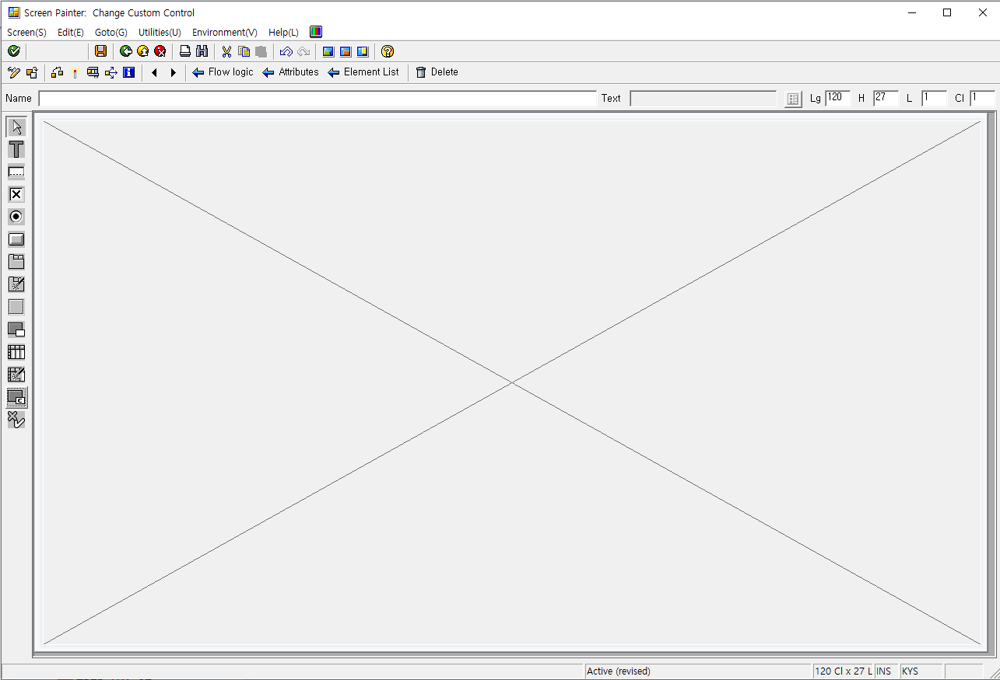

  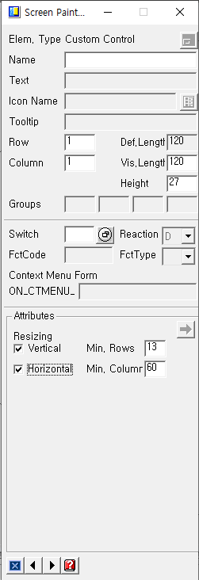

  #### 레이아웃에 들어가 CUSTOM CONTROL을 통해 CUSTOM CONTROL AREA를 생성한다.

  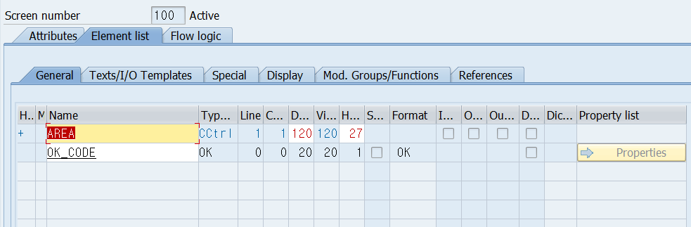

  #### ELEMENT LIST에 들어가 OK_CODE와 AREA의 생성을 확인하고

  #### FLOW LOGIC에 PBO PAI 모듈들을 작성하고 생성한다.

  #### SCREEN100 - FLOW LOGIC

  ```ABAP
  PROCESS BEFORE OUTPUT.
    MODULE status_0100.
    MODULE clear_ok_code.
  
  PROCESS AFTER INPUT.
    MODULE user_command_0100.
  ```

  #### ZB23_00045_O01

  ```
  *&---------------------------------------------------------------------*
  *& Include          ZB23_00045_O01
  *&---------------------------------------------------------------------*
  *&---------------------------------------------------------------------*
  *& Module STATUS_0100 OUTPUT
  *&---------------------------------------------------------------------*
  *&
  *&---------------------------------------------------------------------*
  MODULE status_0100 OUTPUT.
    SET PF-STATUS 'S100'.
    SET TITLEBAR 'T100'.
  ENDMODULE.
  *&---------------------------------------------------------------------*
  *& Module CLEAR_OK_CODE OUTPUT
  *&---------------------------------------------------------------------*
  *&
  *&---------------------------------------------------------------------*
  MODULE clear_ok_code OUTPUT.
    CLEAR ok_code.
  ENDMODULE.
  ```

  #### ZB23_00045_I01

  ```ABAP
  *&---------------------------------------------------------------------*
  *& Include          ZB23_00045_I01
  *&---------------------------------------------------------------------*
  *&---------------------------------------------------------------------*
  *&      Module  USER_COMMAND_0100  INPUT
  *&---------------------------------------------------------------------*
  *       text
  *----------------------------------------------------------------------*
  MODULE user_command_0100 INPUT.
    CASE ok_code.
      WHEN 'BACK'.
        LEAVE TO SCREEN 0.
      WHEN 'CANCEL'.
        LEAVE TO SCREEN 0.
      WHEN 'EXIT'.
        LEAVE PROGRAM.
    ENDCASE.
  
  ENDMODULE.
  ```

  

  

* ## Exercise 7

  #### ZBC405_B23_ALV

  ```ABAP
  *&---------------------------------------------------------------------*
  *& Report ZBC405_B23_ALV
  *&---------------------------------------------------------------------*
  *&
  *&---------------------------------------------------------------------*
  REPORT zbc405_b23_alv.
  
  DATA: ok_code LIKE sy-ucomm.
  
  DATA: gt_flights TYPE TABLE OF sflight,
        gs_flights LIKE LINE OF gt_flights.
  
  
  SELECT-OPTIONS: so_carr FOR gs_flights-carrid,
                  so_conn FOR gs_flights-connid.
  
  START-OF-SELECTION.
    SELECT *
      INTO TABLE gt_flights
      FROM sflight
     WHERE carrid IN so_carr
       AND connid IN so_conn.
  
    CALL SCREEN 100.
  
  
  *&---------------------------------------------------------------------*
  *& PROCESS BEFORE OUTPUT. PBO                                          *
  *&---------------------------------------------------------------------*
  
  *&---------------------------------------------------------------------*
  *& Module STATUS_0100 OUTPUT
  *&---------------------------------------------------------------------*
  *&
  *&---------------------------------------------------------------------*
  MODULE status_0100 OUTPUT.
    SET PF-STATUS 'DYN'.
    SET TITLEBAR 'T100'.
  ENDMODULE.
  *&---------------------------------------------------------------------*
  *& Module CLEAR_OK_CODE OUTPUT
  *&---------------------------------------------------------------------*
  *&
  *&---------------------------------------------------------------------*
  MODULE clear_ok_code OUTPUT.
    CLEAR ok_code.
  ENDMODULE.
  
  
  
  *&---------------------------------------------------------------------*
  *& PROCESS AFTER INPUT. PAI                                            *
  *&---------------------------------------------------------------------*
  
  *&---------------------------------------------------------------------*
  *&      Module  USER_COMMAND_0100  INPUT
  *&---------------------------------------------------------------------*
  *       text
  *----------------------------------------------------------------------*
  MODULE user_command_0100 INPUT.
    CASE ok_code.
      WHEN 'BACK'.
        LEAVE TO SCREEN 0.
      WHEN 'EXIT'.
        LEAVE PROGRAM.
      WHEN 'CANCEL'.
        LEAVE TO SCREEN 0.
    ENDCASE.
  ENDMODULE.
  ```

  #### SCREEN 100 - FLOW LOGIC

  ```ABAP
  PROCESS BEFORE OUTPUT.
    MODULE status_0100.
    MODULE clear_ok_code.
  *
  PROCESS AFTER INPUT.
    MODULE user_command_0100.
  ```

  

# Lesson 3. Displaying Data Using an ALV Grid

프로그램이 실행되면 PBO에 있는 모든 로직이 실행되어 스크린이 생성되며 동작을 할 경우  PAI 의 로직이 실행되고 프로그램이 실행되며 PBO가 실행되 화면이 생성된다.

따라서 IF GO_CONTAINER IS INITIAL. 안에 OBJECT를 생성해야 한다. => OBJECT 중복 생성 방지

CONTAINER CONTROL의 OBJECT를 생성하기 위해서는 CL_GUI_CUSTOM_CONTAINER 클래스가 필요하며 우리가 LAYOUT을 통해 만들어둔 AREA에 생성한다. 즉 EXPORTING을 AREA로 잡는다.

ALV GRID CONTROL의 OBJECT를 생성하기 위해서는 CL_GUI_ALV_GRID 클래스가 필요하며 GO_CONTAINER 즉 CONTAINER CONTROL 에 생성한다. 즉 EXPORTING을 GO_CONTAINER로 잡는다.

* ## CONTAINER CONTROL

  #### ZB23_00045_TOP

  ```ABAP
  *&---------------------------------------------------------------------*
  *& Include          ZB23_00045_TOP
  *&---------------------------------------------------------------------*
  
  DATA: ok_code TYPE sy-ucomm.
  
  DATA: gt_data TYPE TABLE OF sbook,
        gs_data LIKE LINE OF gt_data.
  
  DATA: go_cont TYPE REF TO cl_gui_custom_container,
        go_alv  TYPE REF TO cl_gui_alv_grid.
  
  SELECTION-SCREEN BEGIN OF BLOCK blk1 WITH FRAME.
    SELECT-OPTIONS: so_car FOR gs_data-carrid,
                    so_con FOR gs_data-connid,
                    so_fld FOR gs_data-fldate.
  SELECTION-SCREEN END OF BLOCK blk1.
  ```

  ##### TOP에 

  ```ABAP
  DATA: go_cont TYPE REF TO cl_gui_custom_container,
        go_alv  TYPE REF TO cl_gui_alv_grid.
  ```

  ##### ???????? 의 참조 변수(REFERENCE VARIABLE)를 만들어준다.

  #### SCREEN 100 - FLOW LOGIC

  ```ABAP
  PROCESS BEFORE OUTPUT.
    MODULE status_0100.
    MODULE clear_ok_code.
    MODULE init_alv.
    MODULE .
  
  PROCESS AFTER INPUT.
    MODULE user_command_0100.
  ```

  ##### SCREEN 100 의 PBO에 MODULE INIT_ALV. 를 작성하고 더블클릭하여 PBO에 모듈을 생성한다.

  #### ZB23_00045_O01 - Module INIT_ALV OUTPUT

  ```ABAP
  *&---------------------------------------------------------------------*
  *& Module INIT_ALV OUTPUT
  *&---------------------------------------------------------------------*
  *&
  *&---------------------------------------------------------------------*
  MODULE init_alv OUTPUT.
    IF go_cont IS INITIAL.
      CREATE OBJECT go_cont
        EXPORTING
          container_name              = 'AREA'
        EXCEPTIONS
          cntl_error                  = 1
          cntl_system_error           = 2
          create_error                = 3
          lifetime_error              = 4
          lifetime_dynpro_dynpro_link = 5
          OTHERS                      = 6.
      IF sy-subrc <> 0.
  *     MESSAGE ID SY-MSGID TYPE SY-MSGTY NUMBER SY-MSGNO
  *                WITH SY-MSGV1 SY-MSGV2 SY-MSGV3 SY-MSGV4.
      ENDIF.
  
      CREATE OBJECT go_alv
        EXPORTING
          i_parent          = co_cont
        EXCEPTIONS
          error_cntl_create = 1
          error_cntl_init   = 2
          error_cntl_link   = 3
          error_dp_create   = 4
          OTHERS            = 5.
      IF sy-subrc <> 0.
  *     MESSAGE ID SY-MSGID TYPE SY-MSGTY NUMBER SY-MSGNO
  *                WITH SY-MSGV1 SY-MSGV2 SY-MSGV3 SY-MSGV4.
      ENDIF.
  
  
    ENDIF.
  ENDMODULE.
  ```

  

  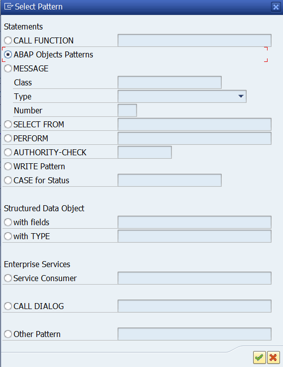

  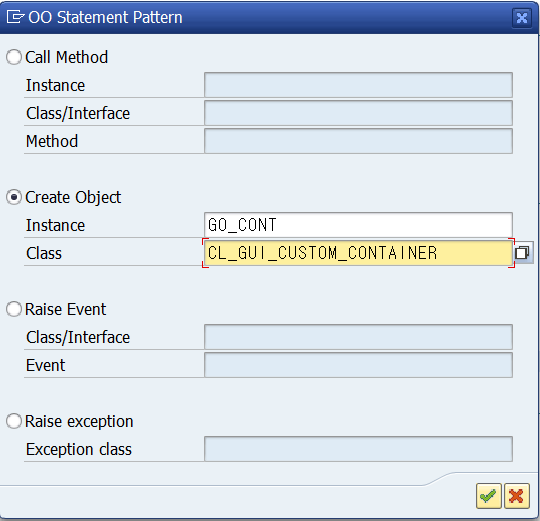

  ##### PATTERN의 ABAP Objects Patterns로 들어가 이전에 만들어둔 container의 REF VARIABLE을 INSTANCE에 CONTAINER에 해당되는 클래스를 CLASS에 입력후 오브젝트를 생성해주는 코드를 삽입한다.

  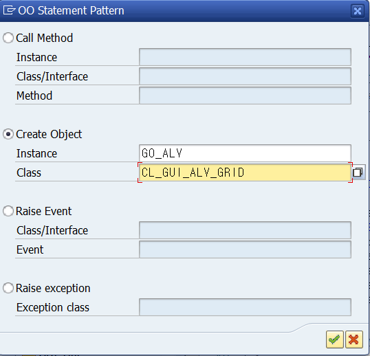

  ##### PATTERN의 ABAP Objects Patterns로 들어가 이전에 만들어둔 ALV GRID의 REF VARIABLE을 INSTANCE에 ALV GRID에 해당되는 클래스를 CLASS에 입력후 오브젝트를 생성해주는 코드를 삽입한다.

  ##### ALV GRID 오브젝트는 EXPORTING에 GO_CONT를 넣어 CONTAINER OBJECT에 연결해 주며

  ##### CONTAINER 오브젝트는 EXPORTING에 AREA를 넣어 SCREAN의 AREA에 연결해 준다.

  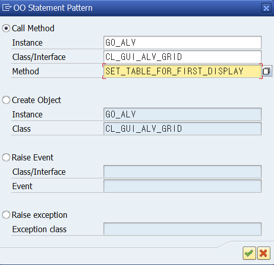

  ##### 화면에 DISPLAY해주는 METHOD의 구문을 PATTERN을 통해 찾아 넣어준다.

  ##### Instance에는 ALV GRID의 reference variable 이름이 들어가며 CLASS / INTERFACE에는 ALV GRID의  CLASS가 들어간다.

  #### ZB23_00045_O01 - Module INIT_ALV OUTPUT

  ```ABAP
  *&---------------------------------------------------------------------*
  *& Module INIT_ALV OUTPUT
  *&---------------------------------------------------------------------*
  *&
  *&---------------------------------------------------------------------*
  MODULE init_alv OUTPUT.
    IF go_cont IS INITIAL.
      CREATE OBJECT go_cont
        EXPORTING
          container_name              = 'AREA'
        EXCEPTIONS
          cntl_error                  = 1
          cntl_system_error           = 2
          create_error                = 3
          lifetime_error              = 4
          lifetime_dynpro_dynpro_link = 5
          OTHERS                      = 6.
      IF sy-subrc <> 0.
  *     MESSAGE ID SY-MSGID TYPE SY-MSGTY NUMBER SY-MSGNO
  *                WITH SY-MSGV1 SY-MSGV2 SY-MSGV3 SY-MSGV4.
      ENDIF.
  
      CREATE OBJECT go_alv
        EXPORTING
          i_parent          = go_cont
        EXCEPTIONS
          error_cntl_create = 1
          error_cntl_init   = 2
          error_cntl_link   = 3
          error_dp_create   = 4
          OTHERS            = 5.
      IF sy-subrc <> 0.
  *     MESSAGE ID SY-MSGID TYPE SY-MSGTY NUMBER SY-MSGNO
  *                WITH SY-MSGV1 SY-MSGV2 SY-MSGV3 SY-MSGV4.
      ENDIF.
      CALL METHOD go_alv->set_table_for_first_display
        EXPORTING
  *       i_buffer_active               =
  *       i_bypassing_buffer            =
  *       i_consistency_check           =
          i_structure_name              = 'SBOOK'
  *       is_variant                    =
  *       i_save                        =
  *       i_default                     = 'X'
  *       is_layout                     =
  *       is_print                      =
  *       it_special_groups             =
  *       it_toolbar_excluding          =
  *       it_hyperlink                  =
  *       it_alv_graphics               =
  *       it_except_qinfo               =
  *       ir_salv_adapter               =
        CHANGING
          it_outtab                     = gt_data
  *      DISPLAY 하고자가는 데이터를 가지고 있는 INTERNAL TABLE
  *       it_fieldcatalog               =
  *       it_sort                       =
  *       it_filter                     =
        EXCEPTIONS
          invalid_parameter_combination = 1
          program_error                 = 2
          too_many_lines                = 3
          OTHERS                        = 4.
      IF sy-subrc <> 0.
  * Implement suitable error handling here
      ENDIF.
  
  
    ENDIF.
  ENDMODULE.
  ```

  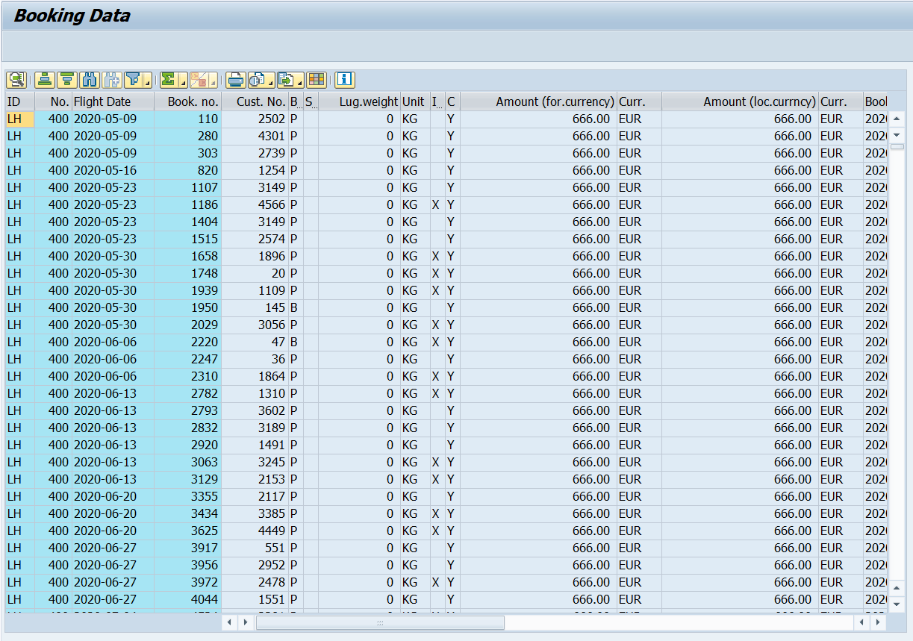

  

  

  

  

  

```ABAP
   CALL METHOD go_alv->set_table_for_first_display
      EXPORTING
*       i_buffer_active            = 
*       i_bypassing_buffer         =
        i_consistency_check        = "Managing display variants
        i_structure_name           = "Global structure type for field catalog
        is_variant                 = "Managing display variants
        i_save                     = "Managing display variants
        i_default                  = "Managing display variants
        is_layout                  = "Structure for displaying control
        is_print                   = "Structure for displaying print list
        it_special_groups          = "Internaltable with field group texts
        it_toolbar_excluding       = "Internal table with inactive functions
*       it_hyperlink               =
*       it_alv_graphics            =
*       it_except_qinfo            =
*       ir_salv_adapter            =
      CHANGING
        it_outtab                  = "Internal table with list data
*       DISPLAY 하고자가는 데이터를 가지고 있는 INTERNAL TABLE
        it_fieldcatalog            = "Internal table for field catalog
        it_sort                    = "Internal table with inital sort criteria
        it_filter                  = "Internal table with initial filter criteria
      EXCEPTIONS
        invalid_parameter_combination = 1
        program_error                 = 2
        too_many_lines                = 3
        OTHERS                        = 4.
    IF sy-subrc <> 0.
* Implement suitable error handling here
    ENDIF.
```


TOP INCLUDE에 데이터 GS_STABLE을 TYPE LVC_S_STBL로 선언해 준다. 이는 ROW와 COL로 이루어진 Structure 구조이다.

이후 앞의 PBO의 INIT_ALV 모듈 뒤에 

```ABAP
    gs_stable-row = 'X'.
    gs_stable-col = 'X'.
```

를 추가해 준후 패턴을 이용해

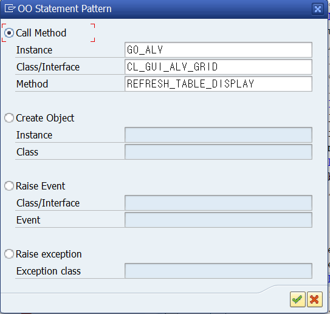

refresh_table_display메소드를 추가해 준다.

```ABAP
  ELSE.
    gs_stable-row = 'X'.
    gs_stable-col = 'X'.
    CALL METHOD go_alv->refresh_table_display
      EXPORTING
        is_stable = gs_stable
*       i_soft_refresh =
      EXCEPTIONS
        finished  = 1
        OTHERS    = 2.
    IF sy-subrc <> 0.
*     Implement suitable error handling here
    ENDIF.
```

s