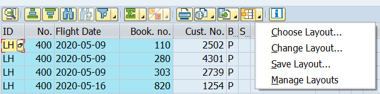

# Unit 4. ALV Design


# Lesson 1. Programming Layout Variant Functionality in the ALV Grid

top 에 gs_variant 를 type disvariant로 선언하고 gs_variant의 report에 현재 프로그램을 sy-oprog로 넘겨 준 후 기존에 호출한 메소드 set_table_for_first_display의 EXPORTING의 is_variant에 gs_variant를 넘겨주면 



이 추가된 것을 볼 수 있다.

i_save에 'U'를 할당하면

i_save에 'X'를 할당하면


gs_variant의 variant에 저장된 레이아웃을 넣으면 저장해 둔 레이아웃의 형태로 데이터를 확인 할 수 있다.


# Lesson 2. Changing the Layout of the ALV Grid

* ## IS_LAYOUT

  lvc_s_layo type의 스트럭쳐가 들어간다.

  |     Fields     | 효과                                                         | DESCRIPTION     |
  | :------------: | ------------------------------------------------------------ | --------------- |
  | **GRID_TITLE** | 텍스트를 넣어주면 제목으로 지정된다.                         | MAX 70자        |
  |   **ZEBRA**    |                                                              | 'X'             |
  | **NO_HEADERS** | HEADER를 가려준다.                                           | 'X'             |
  |  **SEL_MODE**  | **'A'** <br/>COLUMN과 ROW를 여러개 선택 가능<br/>SELECTION COLUMN DISPLAY<br/>**'B'**<br/> COLUMN은 여러개 ROW는 하나만 선택가능<br/>**'C'**<br/>COLUMN과 ROW를 여러개 선택 가능<br/>**'D'**<br/>COLUMN과 ROW를 여러개 선택 가능, <br/>CELL도 선택가능<br/>SELECTION COLUMN DISPLAY<br/>기본값은 B로 설정되어있다. | 'A'/'B'/'C'/'D' |
  | **CWIDTH_OPT** |                                                              | 'X'             |
  | **NO_TOOLBAR** | 툴 바를 가려준다.                                            | 'X'             |
  | **TOTALS_BEF** | TOTAL 값이 제일 위에 뜨게 된다.                              | 'X'             |
  | **INFO_FNAME** | 특정 ROW에 색을 표시해 준다.                                 |                 |
  | **CTAB_FNAME** | 특정 CELL에 색을 표시해준다.                                 |                 |

  이 스트럭처의 grid_title 필드에 텍스트를 넣어주면 layout에 제목이 생성되며


* ## Exception Columns

  EXCP_FNAME LIGHT

  EZCP_LED 'X'

  LIGHT FIELD


* ## IT_SORT

  LVC_T_SORT LVC_S_SORT

  #### ZB23_00045_TOP 

  ```ABAP
  DATA: gt_sort    TYPE lvc_t_sort.
  ```

  

  #### ZB23_00045_F01 - SUBROUTINE set_sort

  ```ABAP
  *&---------------------------------------------------------------------*
  *& Form set_sort
  *&---------------------------------------------------------------------*
  *& text
  *&---------------------------------------------------------------------*
  *& -->  p1        text
  *& <--  p2        text
  *&---------------------------------------------------------------------*
  FORM set_sort .
    DATA: ls_sort TYPE lvc_s_sort.
    ls_sort-fieldname = 'FLDATE'.
    ls_sort-down      = 'X'.
    APPEND ls_sort TO gt_sort.
  
    CLEAR: ls_sort.
    ls_sort-fieldname = 'CONNID'.
    ls-sort-up        = 'X'.
    APPEND ls_sort TO gt_sort.
  ENDFORM.
  ```

  ZB23_00045_O01 - SET_TABLE_FOR_FIRST_DIPLAY 의 CHANGING의 IT_SORT에 GT_SORT 할당.


# Lesson 3. Adapting the Appearance of the ALV Grid


# Lesson 4. Adapting thd ALV Grid Control using the Field Catalog


# 부록

```ABAP
DATA: BEGIN OF gs_data.
        INCLUDE TYPE sbook.
DATA: light TYPE char1,
      END OF gs_data,
      gt_data LIKE TABLE OF gs_data.
```

SBOOK의 모든 FIELD들을 GS_DATA 안에 INCLUDE하고 LIGHT FIELD를 추가한다.