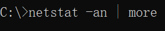
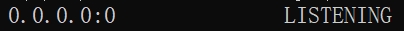
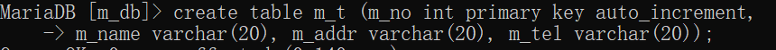
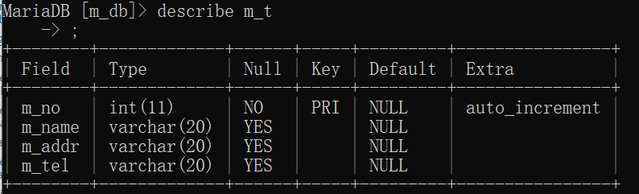
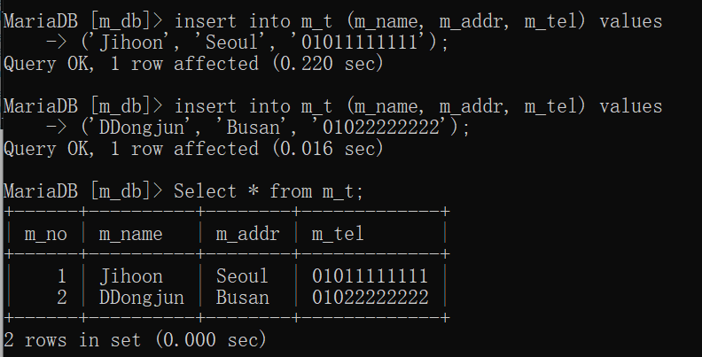
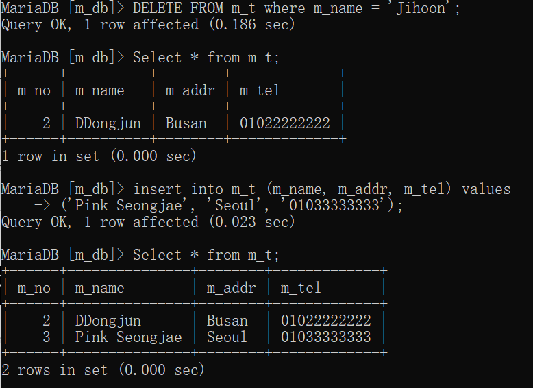

# 클라우드 체험 (아마존AWS + SAP서비스 ERP)

4일차때 (아마존aws + SAP ERP)를 이용한 클라우드 체험 예정

컨테이너서비스

* 노트북(하드웨어) + 운영체제(OS) + XAMPP(웹서버) + 데이터베이스 + VSCODE + 메모장 + 웹브라우저 -->> 하나의 이미지파일로 만들어 놓은것.
* 리눅스기반 노트북 (컨테이너소프트웨어 -> 이미지르르 로딩)
* 비주얼소프트웨어 (윈도우위에서 리눅스서버를 운영, 아니면 그 반대가 가능)
  * VMware (가상화기반으로 운영체제를 작동시킨다.)
  * 비주얼박스 (비슷한데 오픈소스 라이센스)


****

온프레미스 -->> 클라우드회사 서비스구독


****

* Amazon EC2 공부해보기

* Amazon AWS 계정 (프리티어: 무료(1년))

  * 클라우드서비스 --> 계정 --> 접속 --> 대쉬보드(제어판)

  * 인스턴스생성(ㄷㅊ2) --> 하드웨어기반(IaaS) + 플랫폼기반(PasS) + 서비스기반 (SaaS) 

  * 인스턴스기반 서비스를 운영(Operating)

  * 리전( Region): 특정구역에 서비스를 구축하는 것.

    전세계를 기반으로 특정지역을 선택함,

    * 오스트레일리아(서버)  + 미국, 뉴욕 + 일본, 도쿄 (호주에선 하드웨어기반, 미국에선 플랫폼기반, 일본에선 소프트웨어 기반 이렇게 운영한다고 가정)
    * 그 지역에 서비스를 원하는 소비자가 있는것


# 네트워크서비스의 포트번호에 대해 알아보자. (기본상식)

* 포트번호란? 서비스에 접속하기 위한 고유번호 (integer)

* integer 의 범위는? (-2147483648 ~ 2147483647)

* 특수범위도 있다. (Unsigned integer) : (-)를 포기하고, 모두 양수(+)에 사용 (0 ~ 4294967295)

* 실제 포트번호의 범위는? (0 ~ 65535)

* 유명한 서비스의 고유번호들 (Well-known port numbers)

  (0 ~ 1023, 1024개의 포트번호들)

  * 21     (FTP 파일전송서비스)
  * 22     (SSH 원격접속서비스)
  * 23     (TELNET 원격접속서비스)
  * 25     (SMTP 이메일서비스)
  * 53     (DNS 도메인네임서비스) -> "www.naver.com"과 같은 URL을 처리해줌.
  * 80     (HTTP 웹서비스)
  * 110   (POP3 이메일서비스)
  * 135   (윈도우 운영체제가 사용하는 서비스 포트 번호)
  * 445   (윈도우 운영체제가 사용하는 서비스 포트 번호)





누구든 접속할 수 있게 대기중


# 클라우드 서비스에서 사용하는 프로그래밍 언어들의 특징

* 웹서버와 반드시 연동이 가능해야 한다.

* 웹서버와는 직접적으로 언동이 불가능함. 때문에 특수한 모듈이 필요함.

  (**CGI** : **C**ommon **G**ateway **I**nterface)

* **WSGI** (**W**eb **S**ervice **G**ateway **I**nterface)

  최신 언어들의 웹서버와의 연동을 위한 모듈. (국제표준)

* 프레임워크라는 것이 필요하다. (일종의 도구상자)

  웹서비스를 개발하기위한 모든것들이 모여있음.

  ex) WSGI모듈 + 데이터베이스연결도구 + 관리도구 + 관리자모드 등등...

  - 프레임워크중 유면한 것들 (Django, Spring, Flask)

  - 프레임워크의 종류 : (마이크로 / 풀서비스) -> 상황에 맞게 선택해야함.

* 플라스크 프레임워크

  * 기본적으로 프레임워크는 두가지로 구분되어 있음 (front-end / back-end)
  * html + css + java-script 를 처리하는 부분 (front-end)
  * python / java / php 등의 백엔드 언어를 처리하는 부분 (front-end)

* 프레임워크를 사용하는 방법은 대부분 동일한 패턴을 사용한다.

  * MVC패턴이라고 불리우는 설계기법을 사용한다.
    * M(odel) : 보통 데이터를 저장하는 공간을 의미함. (ex: database)
    * V(iew) : 화면상에 보여지는 것들을 의미함. (ex: 웹브라우저의 화면)
    * C(ontroller) : 대부분 코드로 이루어진 로직들의 조합을 의미함. (ex: 파이썬)

* 이 3가지의 것들을 조립해서 한개의 웹사이트(서비스)를 구성하는 것이다.

  프레임워크의 궁극적인 목적

* 우리가 실제작업할 내용에 빗대어서 얘기하면, 다음과 같은 형태가 된다.

  * Mysql 데이터베이스에 데이터가 저장되고 꺼내짐 **(Model)**
  * 파이썬코드로 데이터를 저장하고 꺼낸다음, 화면에 출력함 (웹브라우저) **(Controller)**
  * 사용자가 접속해서 웹페이지를 보고, 어떤 데이터를 보내고 받음 **(View)**


* ### 실습 프레임 워크로 작업할 샘플 (웹브라우저 -> 콘트롤러)

  * 회원정보입력페이지 (m_reg.html)

  * 구조: 고유번호(no) / 이름(m_name) / 주소(m_addr) / 전화번호(m_tel)

    * 고유번호는 Primary Key (int) - 일단 이것은 사람이 입력하지 않음

      

      

      

      

    * 나머지 칸들은 문자열(크기는 자유)

  * 회원정보입력페이지의 가장상단에는 "Member Register" 라고 찍혀있음. (h1)

  * 테이블을 사용해서 보기좋게 디자인해주세요. (table, tr, td)

  * 가장중요한것은 데이터를 보내는 곳입니다. (action)

    * action = "/m_reg/" 라고 적어줌.(URL라고 부름)

    ****

  * html 페이지가 완성된 후에 할일들

    * 파이썬과 플라스크를 사용해서 어떤파일을 만들어줄것임 (위치는 자유)
  
      * 하지만, 우리는 공통된 곳에 만들것임. (C:/flask_project/ 폴더를 만들어줌)
      * 그곳에 flask_web_controller.py 라는 파일을 만들어줌. (이름이 크게 의미는 없음)

    * 해당 파일의 시작부분에 들어가는 특수한 코드 몇개가 있음.

      (form flask import Flask, render template, request --> 플러그인을 불러옴)

      (app = Flask(_ _name _)) --> 플라스크 프레임워크의 특수기능을 불러옴.)
  
      #### flask_web_controller.py
      
      ```python
      from flask import Flask, render_template, request
      app = Flask(__name__)
      
      
      ###############################################################################
      
      
      #http://localhost/m_search/ --->> 대응컨트롤러(search_member_con)
      @app.route('/m_search/')
      def search_page() -> 'html':
          print("searchpage")
          return render_template("return.html")
      
      
      ###############################################################################
      
      
      #http://localhost/m_del/    --->> 대응컨트롤러(del_member_con)
      @app.route('/m_del/')
      def del_page() -> 'html':
          print("del_page")
          return("del_page")
      
      
      ###############################################################################
      
      
      @app.route('/')     # post 로 전송된 것들을 받음
      def homepage_controller() -> 'html':
          print("Homepage")
          return render_template("m_reg.html")
      
      
      ###############################################################################
      
      
      #http://localhost/m_reg/ 라고 접속하면 이곳을 처리하게 됨
      @app.route('/m_reg/', methods=['Post'])
      def add_member_controller() -> 'html':
          name = request.form['m_name']
          addr = request.form['m_addr']
          tel = request.form['m_tel']
          print("from m_reg.html")    #cmd 창에 결과가 찍힘
          return render_template("return.html")      #브라우저에 결과가 찍힘
      
      
      ###############################################################################
      app.run(debug=True)             #app.run 은 실제로 이 앱을 작동 시킨다. debug True: 오류 메세지를 뜨게 함 False: 오류 메세지가 뜨지 않음
      
      ```
      
      #### m_reg.html
      
      ```html
      <!doctype html>
      <html> 
        <head>
          <title>login</title>
          <meta charset = "utf-8">
          <link rel="stylesheet" href="style.css">
        </head>
      
        <body>
          <header>
            <h1>login page</h1>
          </header> 
      
          <section>
      			<form action="/m_reg/" method="post">
              <table border="2">
      					<tr>
      					<td>이름</td>
      					<td><input type="text" name="m_name"></td>
      					</tr>
      
      					<tr>
      					<td>주소</td>
      					<td><input type="text" name="m_addr"></td>
      					</tr>
      
      					<tr>
      					<td>연락처</td>
      					<td><input type="text" name="m_tel"></td>
      					</tr>
                <tr>
                  <th><input type="submit" value="submit"></th>
                </tr>
      
              </table>
      			</form>
          </section>
        </body>
      </html>
      
      ```
      
      #### return.html
      
      ```html
      <!doctype html>
      <html> 
        <head>
          <title>return</title>
          <meta charset = "utf-8">
          <link rel="stylesheet" href="style.css">
        </head>
      
        <body>
          <header>
            <h1>return</h1>
          </header> 
      
          <section>
            <table>
              <tr>
                <td>이름</td>
                <td>{{n}}</td>
              </tr>
              <tr>
                <td>주소</td>
                <td>{{a}}</td>
              </tr>
              <tr>
                <td>연락처</td>
                <td>{{t}}</td>
              </tr>
            </table>
          </section>
        </body>
      </html>
      ```
      
      

  * 기존의 XAMPP는 PHP와 웹서버의 연동을 미리해놓은 완제품이다.
  
    때문에, 파이썬은 XAMPP의 웹서버와 연동할 수 없다. 기존의 웹서버를 사용할 수 없는 상태가 됨. (그럼 새로운 웹서버는 어떻게?)
  
    * 다행히 프레임워크 안에는 우리가 바로 사용할 수 있도록 셋팅된 웹서버가 있다
  
      이것을 개발용 웹서버라 부른다. (실제로 웹사이트를 작동시키기 위한 서버는 아님!!)
  
  * jinja2 라이브러리 (html페이지를 처리하는 코드들의 묶음)
     - 데이터를 html과 혼합시켜줄수있다. (embedding data)
     - {{변수이름}} 이런것을 html파일에 넣어주면 그부분에 실제데이터가 들어가게된다.
     - 즉, 템플릿(미리만들어놓은 디자인의 html파일)의 동적으로 변경될만한 부분을 
       {{ }} 기호로 비워놓고 그곳을 실제 사용자가 접속시 처리되게끔 만들어놓는것이다.


****

윈도우10 --> 브리징(가상화레이어) --> 리눅스서버

리눅스 --> 브리징(가상화레이어) --> 윈도우서버

****

패러다임의 변화를 일으킴

하드웨어 -- os 운영

하드웨어 -- 다중 os 운영

****

컨테이너 가상화

소프트웨어작동에 필요한 재료들 (라이브러리/커널-os의 엔진)

소프트웨어개발 (라이브러리 버전 1.0 --> 2.0)

--> 가상화된 환경을 만든다. (어떤 가상의 폴더 안에서 작업한다고 보면 됨)

- 필요한 파일들, 동영상파일, 이미지파일, 사운드 파일
- 컨테이너화 (모두 한 묶음으로 만들어줌) --> 가상화 이미지파일
- 나중에 가상화이미지파일 로딩 (그때의 환경이 다시 살아남)
- 도커(Docker) : 리눅스기반의 컨테이너
- 클라우드서비스 + 도커


