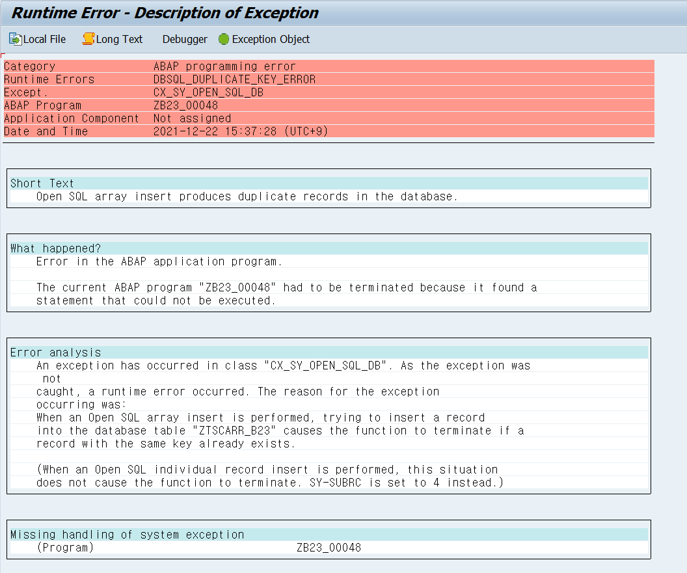

# Unit 1. Database Updates with ABAP Open SQL


# Lesson 1. Database Updates with ABAP Open SQL


* ## Creation of a Record

  ```ABAP
  INSERT INTO <DBTBA> [CLIENT SPECIFIED | USING CLIENT client#] VALUES <wa>
  INSERT 		<DBTBA> [CLIENT SPECIFIED | USING CLIENT client#] FROM   <wa>
  ```

  를 통해 한건의 RECORD를 저장할 수 있다.

  ```ABAP
  *&---------------------------------------------------------------------*
  *& Report ZB23_00048
  *&---------------------------------------------------------------------*
  *&
  *&---------------------------------------------------------------------*
  REPORT zb23_00048.
  
  DATA: gs_carrier TYPE ztscarr_b23.
  
  gs_carrier-carrid = 'AA'.
  gs_carrier-carrname = 'American Airline'.
  gs_carrier-currcode = 'USD'.
  gs_carrier-url = 'www://aa.com'.
  
  INSERT INTO ztscarr_b23 VALUES gs_carrier.
  
  gs_carrier-carrid = 'DL'.
  gs_carrier-carrname = 'Delta Airline'.
  gs_carrier-currcode = 'USD'.
  gs_carrier-url = 'www://delta.com'.
  
  INSERT ztscarr_b23 FROM gs_carrier.
  IF sy-subrc = 0.
    MESSAGE 'SUCCESS, DATA SAVE!' TYPE 'S'.
  ELSE.
    MESSAGE 'FAIL, DATA SAVE!' TYPE 'S' DISPLAY LIKE 'E'.
  ENDIF.
  ```

  다시 실행할 경우 이미 입력되어 더이상 입력되지 않는다.

  성공시 SY-SUBRC에는 0이 실패시 4가 반환된다.


* ## Creation of Multiple Records

  ```ABAP
  INSERT <DBTAB> [CLIENT SPECIFIED | USING CLIENT client#] FROM TABLE <ITAB>
  			   [ACCEPTION DUPLICATE KEYS].
  ```

  

  

  

  ```ABAP
  *&---------------------------------------------------------------------*
  *& Report ZB23_00048
  *&---------------------------------------------------------------------*
  *&
  *&---------------------------------------------------------------------*
  REPORT zb23_00048.
  
  DATA: gs_carrier TYPE ztscarr_b23,
        gt_carrier TYPE TABLE OF ztscarr_b23.
  
  SELECT *
    INTO CORRESPONDING FIELDS OF TABLE gt_carrier
    FROM scarr
    WHERE carrid BETWEEN 'LH' AND 'UA'.
  
  INSERT ztscarr_b23 FROM TABLE gt_carrier.
  
  IF sy-subrc = 0.
    MESSAGE 'SUCCESS, DATA SAVE!' TYPE 'S'.
  ELSE.
    MESSAGE 'FAIL, DATA SAVE!' TYPE 'S' DISPLAY LIKE 'E'.
  ENDIF.
  ```

  다시 실행할 경우

  

  덤프가 나게 된다.

  ```ABAP
  INSERT ztscarr_b23 FROM TABLE gt_carrier
    ACCEPTING DUPLICATE KEYS.
  ```

  구문으로 중복된 경우 INSERT되지 않도록 하여 덤프를 막을 수 있다.

  중복되지 않는 데이터만 INSERT된다.

  하지만 SY-SUBRC는 4가 떨어진다.


* ## Change a Single Record

  ```ABAP
  UPDATE <DBTBA> [CLIENT SPECIFIED | USING CLIENT client#] FROM <wa>.
  UPDATE <DBTBA> [CLIENT SPECIFIED | USING CLIENT client#] SET <F1> = <G1> ... <FN> = <GN>
    WHERE <FULL_QUALIFIED_KEY>.
  * 		해당 테이블의 KEY FIELD 모두를 넣어준다.
  ```

  

  

  ```ABAP
  *&---------------------------------------------------------------------*
  *& Report ZB23_00048
  *&---------------------------------------------------------------------*
  *&
  *&---------------------------------------------------------------------*
  REPORT zb23_00048.
  
  DATA: gs_carrier TYPE ztscarr_b23,
        gt_carrier TYPE TABLE OF ztscarr_b23.
  
  
  gs_carrier-carrid = 'DL'.
  gs_carrier-carrname = 'Delta Airline'.
  gs_carrier-currcode = 'EUR'.
  gs_carrier-url = 'www://WWW.delta.com'.
  
  UPDATE ztscarr_b23 FROM gs_carrier.
  
  UPDATE ztscarr_b23
    SET currcode = 'USD'
        carrname = 'DELTA AIRWAY'
    WHERE carrid = 'DL'.
  ```

  


* ## Change Several Records

  ```ABAP
  UPDATE <DBTBA> [CLIENT SPECIFIED | USING CLIENT client#] FROM TABLE <ITAB>.
  UPDATE <DBTBA> [CLIENT SPECIFIED | USING CLIENT client#] SET <F1> = <G1> ... <FN> = <GN>
    WHERE <CONDITION>.
  *       상황에 맞는 조건을 준다.
  ```

  

  

  ```ABAP
  *&---------------------------------------------------------------------*
  *& Report ZB23_00048
  *&---------------------------------------------------------------------*
  *&
  *&---------------------------------------------------------------------*
  REPORT zb23_00048.
  
  DATA: gs_carrier TYPE ztscarr_b23,
        gt_carrier TYPE TABLE OF ztscarr_b23.
  
  
  SELECT *
    INTO CORRESPONDING FIELDS OF TABLE gt_carrier
    FROM ztscarr_b23
    WHERE currcode = 'USD'.
  
  LOOP AT gt_carrier INTO gs_carrier.
    gs_carrier-currcode = 'KRW'.
    MODIFY gt_carrier FROM GS_carrier.
  ENDLOOP.
  
  UPDATE ztscarr_b23 FROM TABLE gt_carrier.
  
  UPDATE ztscarr_b23 SET currcode = 'USD'
    WHERE carrid BETWEEN 'DL' AND 'LH'.
  ```

  


* ## Modification of Database Records

  MODIFY 구문에는 UPDATE 와 INSERT 두가지 기능이 있다.

  해당 데이터가 DBTABLE에 있는 경우 UPDATE 없는 경우 INSERT한다.

  ```ABAP
  MODIFY <DBTBA> [CLIENT SPECIFIED | USING CLIENT client#] FROM <WA>.
  MODIFY <DBTBA> [CLIENT SPECIFIED | USING CLIENT client#] FROM TABLE <ITAB>.
  ```

  

  

  ```ABAP
  *&---------------------------------------------------------------------*
  *& Report ZB23_00048
  *&---------------------------------------------------------------------*
  *&
  *&---------------------------------------------------------------------*
  REPORT zb23_00048.
  
  DATA: gs_carrier TYPE ztscarr_b23,
        gt_carrier TYPE TABLE OF ztscarr_b23.
  
  
  gs_carrier-carrid = 'DL'.
  gs_carrier-carrname = 'Delta Airline'.
  gs_carrier-currcode = 'USD'.
  gs_carrier-url = 'www://WWW.delta.com'.
  
  MODIFY ztscarr_b23 FROM gs_carrier.
  
  gs_carrier-carrid = 'DL'.
  gs_carrier-carrname = 'Delta Airline'.
  gs_carrier-currcode = 'USD'.
  gs_carrier-url = 'http://www.delta.com'.
  
  APPEND gs_carrier TO gt_carrier.
  
  CLEAR: gs_carrier.
  gs_carrier-carrid = 'BA'.
  gs_carrier-carrname = 'British Airways'.
  gs_carrier-currcode = 'GBP'.
  gs_carrier-url = 'http://www.british-airways.com'.
  APPEND gs_carrier TO gt_carrier.
  
  MODIFY ZTSCARR_B23 FROM TABLE GT_CARRIER.
  ```

  

  

* ## Deletion of a Record

  ```ABAP
  DELETE	    <DBTBA> [CLIENT SPECIFIED | USING CLIENT client#] FROM <WA>.
  DELETE FROM <DBTBA> [CLIENT SPECIFIED | USING CLIENT client#] 
    WHERE <FULL_QUALIFIED_KEY>.
  ```

  

  

  ```ABAP
  *&---------------------------------------------------------------------*
  *& Report ZB23_00048
  *&---------------------------------------------------------------------*
  *&
  *&---------------------------------------------------------------------*
  REPORT zb23_00048.
  
  DATA: gs_carrier TYPE ztscarr_b23,
        gt_carrier TYPE TABLE OF ztscarr_b23.
  
  gs_carrier-carrid = 'DL'.
  gs_carrier-carrname = 'Delta Airline'.
  gs_carrier-currcode = 'GB'.
  gs_carrier-url = ''.
  
  DELETE ztscarr_b23 FROM gs_carrier.
  
  DELETE FROM ztscarr_b23 WHERE carrid = 'BA'.
  ```

  


* ## Deletion of Several Records

  ```ABAP
  DELETE	    <DBTBA> [CLIENT SPECIFIED | USING CLIENT client#] FROM TABLE <ITAB>.
  DELETE FROM <DBTBA> [CLIENT SPECIFIED | USING CLIENT client#] 
    WHERE <CONDITION>.
  * WHERE 절이 없는 경우 모든 데이터를 DELETE 한다.
  ```

  


* ## Restoration of Previous Database Status

  ```ABAP
  INSERT scarr   FROM TABLE gt_###1.
  INSERT spfli   FROM TABLE gt_###2.
  INSERT sflight FROM TABLE gt_###3.
  
  ```

  경우에 따라서 일부 SQL문에서 오류가 날 수 있다. 이 경우 이전에 삽입이 되었던 SQL문도 ROLLBACK 하는 것이 일반적이다.

  (ALL-OR-NOTHING)

  이때 사용하는 것이 

  ```ABAP
  IF sy-subrc <> 0.
    MESSAGE a ...
    ROLLBACK WORK.
  ENDIF.
  ```

  메세지 타입 A 나 X  또는

  * 메세지 타입 X는 덤프 화면이 떠서 잘 사용하지 않는다.

  ROLLBACK WORK 구문을 사용한다.

  


