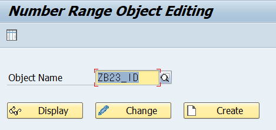
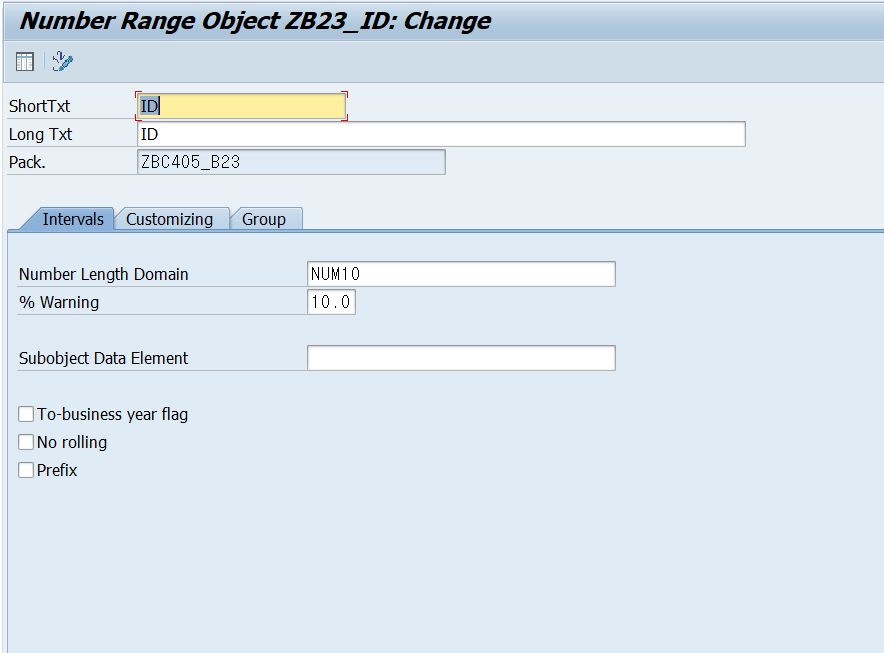
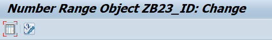
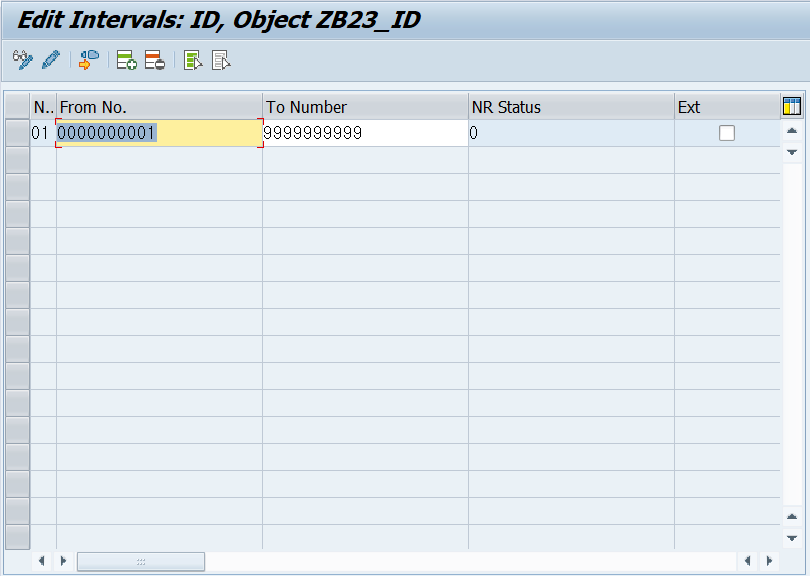
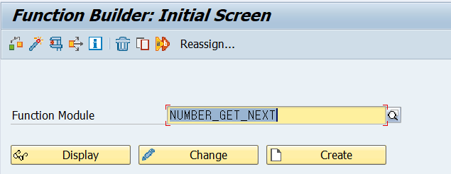
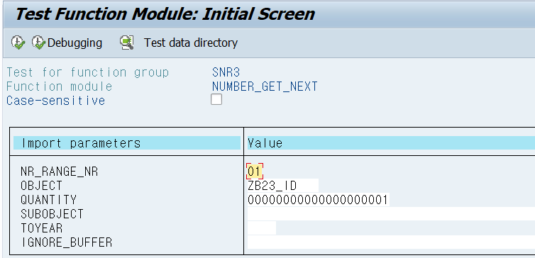
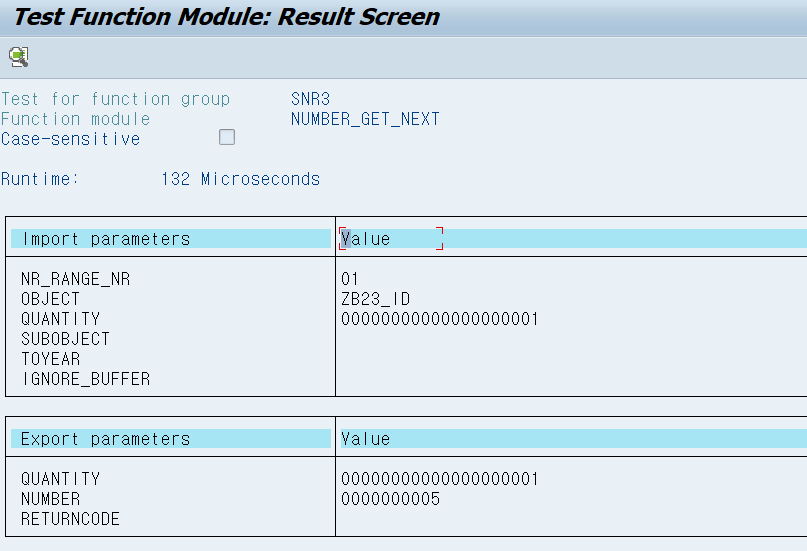

# Unit 6. Number Assignment

# Lesson 1. Assigning Numbers

EXT에 체크를 하면 해당 범위 안에서 특정 숫자를 지정해 주어 사용하게 된다.

해당 숫자들을 부여하기 위해서는 Standard Function Moduele ***NUMBER_GET_NEXT*** 를 사용한다.

# Lesson 2. Using Advanced Features of Number Assignment

안함