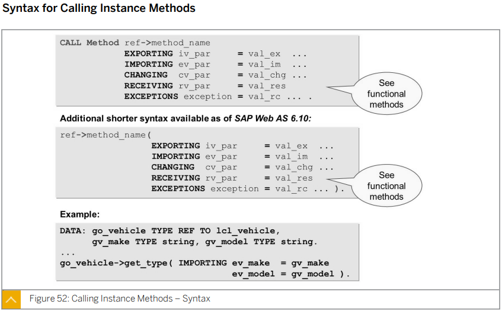

# Unit 2. Fundamental Object-Oriented Syntax


# Lesson 1. Creating Local Classes


* ## Definition of Local Classes

  

  Componenets가 다른 프로그램에서도 사용이 되어야 한다면 Public에 넣어준다.

  Private의 Component들은 해당 class 내에서만 접근 가능하다.

  일반적으로 Methods 와 Events 는 Public에 넣어주며 Data types 와 Atrributes들은

  Private에 넣어준다.
  
  
  
  
  
  


* ## Declaration of Attributes

  class의 변수들이라고 생각하면 된다.

  


* ## Definition of Attributes, Types, and Constants

  


* ## Visibility of Attributes

  

  ### PUBLIC ATTRIBUTES

  어디서는 access 가능하며 값의 변경이 가능하다.

  예외적으로 선언할때 READ-ONLY를 추가한 경우 값의 변경이 불가능하다.

  

  ### PRIVATE ATTRIBUTES

  값의 변경이 불가능하다. 

  CLASS 내부에서만 변경 가능 

  

  

  DATA는 PRIVATE에 선언하는 것을 권장한다.

  

* ## Static Attributes and Instance Attributes

  ### Instance Attributes

  CLASS 에 의해 생성된 OBJECT 마다 공통적으로 존재하는 Instance Attributes 라 한다.

  Instance Attributes 를 정의할 때는 DATA 구문을 사용한다.

  

  ### Static Attributes 

  CLASS 에 하나만 존재한다.

  Static Attributes 를 정의할대는 CLASS-DATA 구문을 사용한다.

  

  

* ## Implementation of Methods

  

  Method 를 사용하기 위해서는 METHODS 구문을 사용해 정의하며 

  Method는 **[IMPORTING| EXPORTING | CHANGING | RETURNING] signature** 들을 가질 수 있다. 

  RETURNING은 CALL BY VALUE를 사용한다. 


* ## Visibility of Methods

  

  ### PUBLIC Methods

  어디서는 access 가능하며 값의 변경이 가능하다.

  

  ### PRIVATE Methods

  값의 변경이 불가능하다. 

  CLASS 내부에서만 변경 가능 


* ## Static Method and Instance Method 

  ### Instance Method 

  Static / Instance component 모두 access 가능하다.

  Instance Method 를 정의할 때는 METHODS 구문을 사용한다.

  

  ### Static Method 

  Static Component 들만 access 가능하다. 

  Static Attributes 를 정의할대는 CLASS-METHODS 구문을 사용한다.

  

* ## Representation of Visibility in UML Class Diagrams

  

  Component 이름 앞에 + 가 있으면 Public, - 가 있으면 Private이며

  _ 밑줄이 그어져 있으면 Static Component이다.

  


* ## 실습

  #### ZB23_00049

  ```ABAP
  *&---------------------------------------------------------------------*
  *& Report ZB23_00049
  *&---------------------------------------------------------------------*
  *&
  *&---------------------------------------------------------------------*
  REPORT zb23_00049.
  
  CLASS lcl_vehicle DEFINITION.
    PUBLIC SECTION.
      METHODS:
        set_attributes IMPORTING iv_make  TYPE string
                                 iv_model TYPE string,
        display_attributes.
  
      CLASS-METHODS:
        display_n_o_vehicle.
  
    PRIVATE SECTION.
      DATA: mv_make  TYPE string,
            mv_model TYPE string.
  
      CLASS-DATA: gv_n_o_vehicle TYPE i.
  ENDCLASS.
  
  
  
  CLASS lcl_vehicle IMPLEMENTATION.
    METHOD set_attributes.
      mv_make = iv_make.
      mv_model = iv_model.
  
      ADD 1 TO gv_n_o_vehicle.
  
    ENDMETHOD.
  
    METHOD display_attributes.
      WRITE:/ 'MAKE    : ', mv_Make,
            / 'MODEL   : ', mv_model,
            / 'VEHICLE : ', gv_n_o_vehicle.
    ENDMETHOD.
  
    METHOD display_n_o_vehicle.
      WRITE:/ 'VEHICLE COUNT : ', gv_n_o_vehicle.
    ENDMETHOD.
  ENDCLASS.
  ```

  


# Lesson 2. Creating Objects


* ## Objects as Instances of Classes

  Object를 생성하기 위해서는 Reference Variable이 필요하며

  CREATE OBJECT 구문 뒤에 Reference Variable 이름이 온다.

  

  

  

* ## Definition of Reference Variables

  ```ABAP
  DATA: go_vehicle1 TYPE REF TO lcl_vehicle,
  	  go_vehicle2 LIKE go_vehicle1.
  ```

  TYPE REF TO 구문 뒤에는 CLASS의 이름이 온다.


* ## Creating Objects

  ```ABAP
  CREATE OBJECT GO_VEHICLE1.
  CREATE OBJECT GO_VEHICLE2.
  ```

  Object를 생성하기 위해서는 Reference Variable이 필요하며

  CREATE OBJECT 구문 뒤에 Reference Variable 이름이 온다.


* ## Reference Semantics of Object References

  ```ABAP
  go_vehicle2 = go_vehicle1.
  ```

  CREATE 구문을 사용하지 않고 위와 같이 할당을 하게 되면 둘 모두 같은 REFERENCE를 가르키게 된다.

  즉 둘은 수정 사항 또한 공유 하게 된다.

  


* ## The Garbage Collector

  object를 삭재하기 위해서는 해당 object의 reference variable에 CLEAR 나 FREE 구문을 사용하면 된다.


* ## Multiple Instances

  

  Object를 담기 위한 Internal table을 생성할 때는 TYPE TALBE OF REF TO 구문을 사용하며

  생성된 Object를 Internal table에 넣기 위해서는 APPEND 구문을 사용한다.

  ```ABAP
  DATA: go_vehicle TYPE REF TO lcl_vehicle,
        gt_vehicle TYPE TABLE OF REF TO lcl_vehicle.
  
  CREATE OBJECT go_vehicle.
  APPEND go_vehicle TO gt_vehicle.
  
  CREATE OBJECT go_vehicle.
  APPEND go_vehicle TO gt_vehicle.
  
  CREATE OBJECT go_vehicle.
  APPEND go_vehicle TO gt_vehicle.
  
  CREATE OBJECT go_vehicle.
  APPEND go_vehicle TO gt_vehicle.
  ```

  

  

  

  

  


# Lesson 3. Accessing Methods and Attributes


* ## Syntax for  Calling Instance Methods

  

  CALL METHOD를 통해 호출 하거나 CALL METHOD 구문 없이 Method 이름 뒤에 ( \____ ) 로 묶어 줌으로서 메소드를 호출 할 수 있다.

  Instance Method를 호출 할 경우 

  ```ABAP
  CALL METHOD Ref_Vari_name->method_name.
  Ref_Vari_name->method_name( ___ ).
  ```

  와 같이 레퍼런스 배리어블 이름 뒤에 **->** 를 사용해 메소드를 ACCESS 한다.


* ## Static Method Calls

  

  CALL METHOD를 통해 호출 하거나 CALL METHOD 구문 없이 Method 이름 뒤에 ( \____ ) 로 묶어 줌으로서 메소드를 호출 할 수 있다.

  Instance Method를 호출 할 경우 

  ```ABAP
  CALL METHOD Class_name=>method_name.
  Class_name=>method_name( ___ ).
  ```

  와 같이 Class 이름 뒤에 **=>** 를 사용해 메소드를 ACCESS 한다.


* ## Functional Method Calls

  

  RETURNING 파라미터는 하나만 받을 수 있다.

  RETURNING 파라미터가 있는 경우 EXPORTING과 CHANGING 파라미터를 받을 수 없다.

  RETURNING 파라미터는 RECEIVING 파라미터로 받는다.

  또는 변수에 바로 할당이 가능하다. 	

  * **하나의 파라미터만 선언할 수 있기 때문**

  

  


* ## Access to Public Attributes

  


# Lesson 4. Implementing Constructors in Local Classes


# Lesson 5. Implementing Class Constructors in Local classes