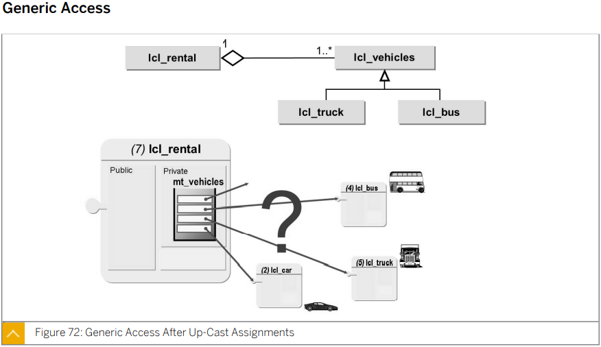
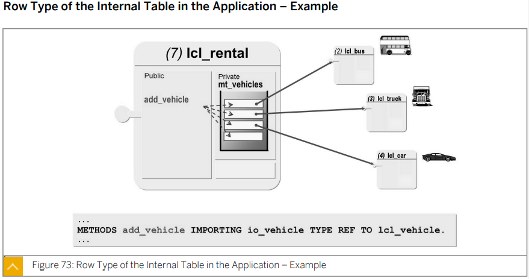
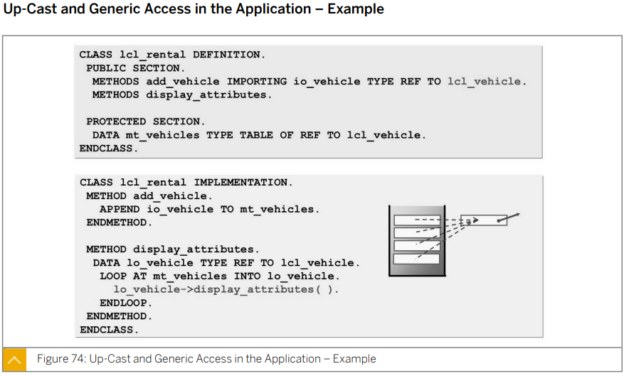
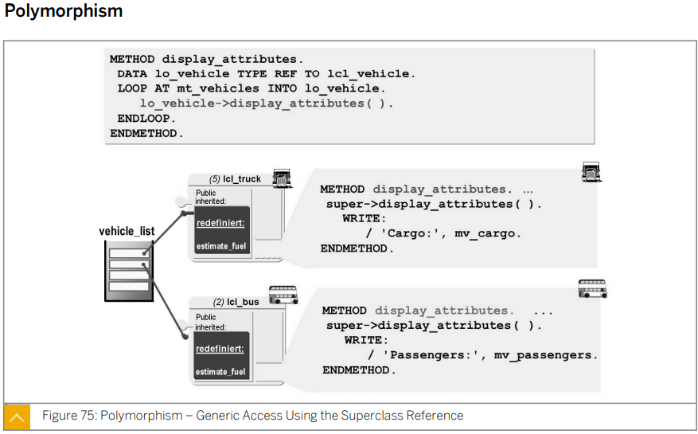
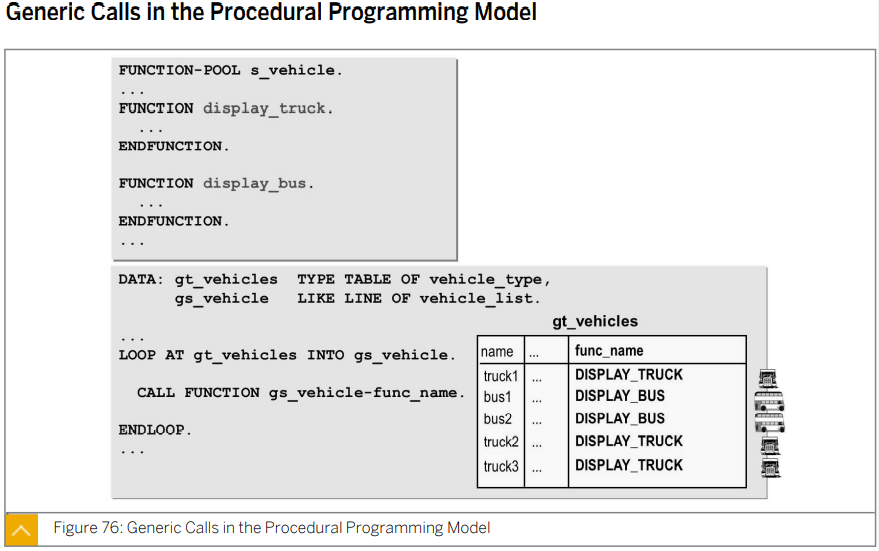
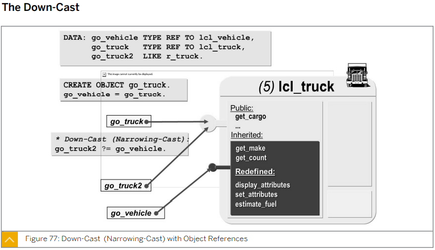
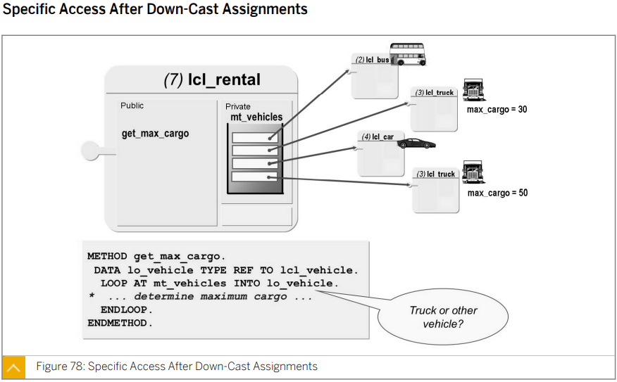
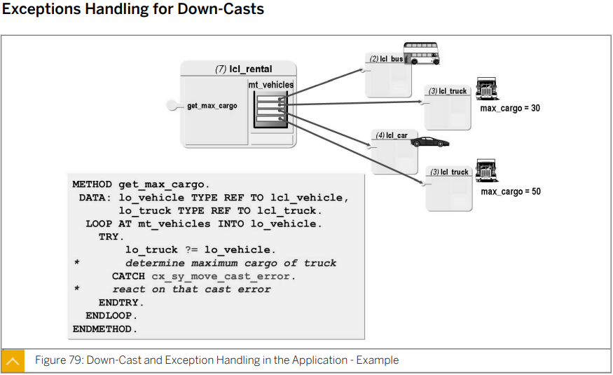
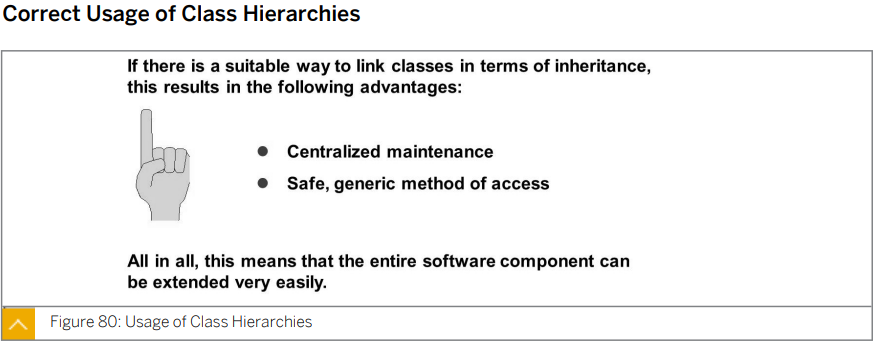
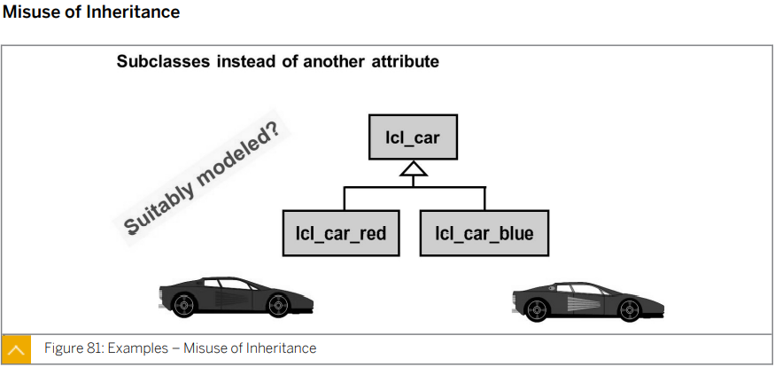

# Unit 3. Inheritance and Casting


# Lesson 1. Implementing Inheritance

* ## Generalization and Specialization

  

  


* ## Characteristics of Generalization and Specialization

  

  공통된 component들은 부모 클래스 (Sub Class) 에서 관리한다.

  자식 클래스 (Sub Class) 는 부모 클래스의 component들을 상속받아 사용할 수 있으며 component들을 확장 또는 개별 component 를 가질 수 있다.


* ## Implementation of Inheritance

  

  Sub Class를 생성할 때에는 class 정의 부분 뒤에 INHERITING FROM 구문을 사용한다.


* ## Redefinition of Methods

  

  SUPER CLASS 로 부터 상속받은 METHOD를 변형 할때에는

  CLASS <\_Sub CLASS NAME\_> DEFINITION INHERITING FROM <\_SUPER CLASS NAME\_>파트 정의 부에서는 METHOD<\_METHOD NAME\_> REDEFINITION 구문을 사용하며

  CLASS <\_Sub CLASS NAME\_> IMPLEMENTATION 파트 구현 부에서는 SUPER-><\_METHOD NAME\_> 구문을 사용하여 super class의 어느 method를 변형해 주었는지 명시해 준다.

  


* ## Subclass Constructors

  

  Subclass 와 Superclass 모두 개별의 Constructor 가 있을 시

  Subclass 의 Constructor 구현 시 super->constructor( ). 를 통해 Superclass의 Constructor 를 명시적으로 호출해 주어야 한다. (유일하게 constructor를 호출하는 경우)

  

* ## Rules for Calling the constructor

  

  CREATE OBJECT 구문 사용시 SUBCLASS에 CONSTRUCTOR가 없는 경우에도 부모 클래스의 CONSTRUCTOR 의 파라미터를 넘겨 줘야 하며

  SUBCLASS에 CONSTRUCTOR가 있는 경우 

  ```ABAP
  *&---------------------------------------------------------------------*
  *& Report ZB23_00049
  *&---------------------------------------------------------------------*
  *&
  *&---------------------------------------------------------------------*
  REPORT zb23_00049.
  
  CLASS lcl_vehicle DEFINITION.
    PUBLIC SECTION.
      METHODS:
        constructor IMPORTING iv_make  TYPE string
                              iv_model TYPE string,
  
        set_attributes IMPORTING iv_make  TYPE string
                                 iv_model TYPE string,
        display_attributes.
  
      CLASS-METHODS:
        display_n_o_vehicle.
  
    PRIVATE SECTION.
      DATA: mv_make  TYPE string,
            mv_model TYPE string.
  
      CLASS-DATA: gv_n_o_vehicle TYPE i.
  ENDCLASS.
  
  
  
  CLASS lcl_vehicle IMPLEMENTATION.
    METHOD constructor.
      mv_make = iv_make.
      mv_model = iv_model.
      ADD 1 TO gv_n_o_vehicle.
    ENDMETHOD.
  
    METHOD set_attributes.
      mv_make = iv_make.
      mv_model = iv_model.
  
      ADD 1 TO gv_n_o_vehicle.
  
    ENDMETHOD.
  
    METHOD display_attributes.
      WRITE:/ 'MAKE    : ', mv_Make,
            / 'MODEL   : ', mv_model.
    ENDMETHOD.
  
    METHOD display_n_o_vehicle.
      WRITE:/ 'VEHICLE COUNT : ', gv_n_o_vehicle.
    ENDMETHOD.
  ENDCLASS.
  
  
  CLASS lcl_truck DEFINITION INHERITING FROM lcl_vehicle.
    PUBLIC SECTION.
      METHODS:
        display_attributes REDEFINITION,
        constructor IMPORTING iv_make  TYPE string
                              iv_model TYPE string
                              iv_cargo TYPE s_plan_car.
  
    PRIVATE SECTION.
      DATA: mv_cargo TYPE s_plan_car.
  
  ENDCLASS.
  
  
  CLASS lcl_truck IMPLEMENTATION.
    METHOD display_attributes.
      super->display_attributes( ).
      WRITE:/ 'MAX CARGO : ', mv_cargo.
    ENDMETHOD.
  
    METHOD constructor.
      super->constructor( EXPORTING iv_make  = iv_make
                                    iv_model = iv_model ).
  *                                 SUPER      SUB
      mv_cargo = iv_cargo.
    ENDMETHOD.
  ENDCLASS.
  
  
  CLASS lcl_bus DEFINITION INHERITING FROM lcl_vehicle.
    PUBLIC SECTION.
      METHODS:
        display_attributes REDEFINITION,
  
        constructor IMPORTING iv_make  TYPE string
                              iv_model TYPE string
                              iv_seats TYPE s_seatsmax.
  
    PRIVATE SECTION.
      DATA: mv_seats TYPE s_seatsmax.
  ENDCLASS.
  
  CLASS lcl_bus IMPLEMENTATION.
    METHOD display_attributes.
      super->display_attributes( ).
  
      WRITE:/ 'MAX SEATS : ', mv_seats.
    ENDMETHOD.
  
    METHOD constructor.
      super->constructor( EXPORTING iv_make  = iv_make
                                    iv_model = iv_model ).
  *                                 SUPER      SUB
      mv_seats = iv_seats.
    ENDMETHOD.
  ENDCLASS.
  ```


* ## Inheritance and Visibility

  

  ### PUBLIC COMPONENT

  어디서든 ACCESS 가능하다.

  다이어 그램에서 표기시 +를 COMPONENT 이름 앞에 붙인다. 

  

  ### PROTECTED COMPONENT

  구문에 선언된 COMPONENT 들은 모든 SUBCLASS에서 ACCESS 가능하다.

  다이어 그램에서 표기시 #를 COMPONENT 이름 앞에 붙인다. 

  

  ### PRIVATE  COMPONENT

  클래스 내부에서만 ACCESS 가능하다.

  다이어 그램에서 표기시 -를 COMPONENT 이름 앞에 붙인다. 

  

  #### SECTION 순서 중요!!


* ## Visibility Section - Protected Versus Private

  

  SUPERCLASS 의 PRIVATE SECTION 에서 선언된 COMPONENT 들은 SUBCLASS 에서 ACCESS 불가능하다.

  반면 SUPERCLASS 의 PROTECTED SECTION 에서 선언된 COMPONENT 들은 SUBCLASS 에서 ACCESS 가능하다.


* ## Inheritance and Static Component

  모든 SUBCLASS 는  SUPERCLASS의 PUBLIC, PROTECTED SECTION의 모든 STATIC ATTRIBUTE에 ACCESS 가능하다. 

  

  STATIC METHOD 들은 확장/REDEFINE 될 수 없다.

  

  SUPERCLASS 에 STATIC CONSTRUCTOR 가 존재할 경우 SUBCLASS 또는 SUPERCLASS 에 첫 실행시 자동으로 실행된다. 

  

  SUPERCLASS 에 STATIC CONSTRUCTOR  가 존재하더라도 SUBCLASS는 자신만의 STATIC CONSTRUCTOR를 가질 수 있다.

  

  SUPERCLASS 와 SUBCLASS 모두 STATIC CONSTRUCTOR 가 존재하는 경우 SUBCLASS에 처음으로 ACCESS 하는 경우 

  SUPERCLASS 의 STATIC CONSTRUCTOR => SUBCLASS 의 STATIC CONSTRUCTOR  순으로 실행된다.  

  * ##### 이후 SUPERCLASS와 SUBCLASS 모두에 INSTANCE CONSTRUCTOR가 존재하는 경우 

    *  SUBCLASS 의 INSTANCE CONSTRUCTOR가 실행되어 

    * 내부에서 SUPERCLASS 의 INSTANCE CONSTRUCTOR 를 호출하여 실행되고 

    * 다시 SUBCLASS 의 INSTANCE CONSTRUCTOR 순으로 실행된다. 


* ## Exercise 7.

  ```ABAP
  ```


# Lesson 2. Implementing Upcasts Using Inheretance


* ## The Up-Cast

  

  SUBCLASS 의 OBJECT 를 SUPERCLASS 의 OBJECT에 할당할 수 있다. 이때 SUPERCLASS 는 SUBCLASS 의 COMPONENT를 다시 받아 사용한다.


* ## Static and Dynamic Type

  

  

  ### Static Type of a Reference variable

  TYPE REF TO 구문을 사용하여 정의한다.

  

  ### Dynamic Type of a Reference variable


* ## Exercise 8

  


# Lesson 3. Implementing Polymorphism Using Inheritance


* ## Generic Access

  

  lcl_truck과 lcl_bus의 object들을 upcast을 이용해 lcl_vehicles 에 담아 lcl_rental을 통해 관리할 수 있다.

  

  

  이렇게 Up-Cast를 이용한 access를 Generic Access 라고 한다.

  


* ## Polymorphism

  

  전제조건은 부모 class 의 component를 상속 받아 확장 또는 redefine 하고 

  Up-Cast 를 사용하는 Generic Access를 사용한 경우 

  

  

  

  Procedural Programming Model에서도 Generic Call이 가능하지만 잘 사용하지 않는다.

  

* ## Exercise 9

  ```ABAP
  *&---------------------------------------------------------------------*
  *& Report ZBC401_B23_MAIN
  *&---------------------------------------------------------------------*
  *&
  *&---------------------------------------------------------------------*
  REPORT zbc401_b23_main_polymorphism.
  
  **********************************************************************
  *&-------------------------------------------------------------------*
  *& CLASS LCL_AIRPLANE                                                *
  *&-------------------------------------------------------------------*
  **********************************************************************
  CLASS lcl_airplane DEFINITION.
    PUBLIC SECTION.
      CLASS-METHODS:
        class_constructor.
  
      METHODS:
        constructor
          IMPORTING
            iv_name      TYPE string
            iv_planetype TYPE saplane-planetype
          EXCEPTIONS
            wrong_planetype,
        display_attributes.
  
      CLASS-METHODS:
        display_n_o_airplanes,
        get_n_o_airplanes
          RETURNING
            VALUE(rv_count) TYPE i.
  
    PROTECTED SECTION.
      CONSTANTS: c_pos_1 TYPE i VALUE 30.
  
    PRIVATE SECTION.
  
      DATA: mv_name      TYPE string,
            mv_planetype TYPE saplane-planetype,
            mv_weight    TYPE saplane-weight,
            mv_tankcap   TYPE saplane-tankcap.
  
  
      CLASS-DATA: gv_n_o_airplanes TYPE i,
                  gt_planetypes    TYPE TABLE OF saplane.
  
      CLASS-METHODS:
        get_technical_attributes
          IMPORTING
            iv_type    TYPE saplane-planetype
          EXPORTING
            ev_weight  TYPE saplane-weight
            ev_tankcap TYPE saplane-tankcap
          EXCEPTIONS
            wrong_planetype.
  ENDCLASS.
  
  
  CLASS lcl_airplane IMPLEMENTATION.
    METHOD class_constructor.
      SELECT *
        INTO TABLE gt_planetypes
        FROM saplane.
    ENDMETHOD.
  
    METHOD constructor.
      mv_name = iv_name.
      mv_planetype = iv_planetype.
      get_technical_attributes(
        EXPORTING
          iv_type = iv_planetype
        IMPORTING
          ev_weight = mv_weight
          ev_tankcap = mv_tankcap
        EXCEPTIONS
          wrong_planetype = 1
      ).
  
      IF sy-subrc <> 0.
        RAISE wrong_planetype.
      ELSE.
        ADD 1 TO gv_n_o_airplanes.
      ENDIF.
    ENDMETHOD.
  
    METHOD display_attributes.
      WRITE:/ icon_ws_plane AS ICON,
            / 'NAME      : ', AT c_pos_1 mv_name,
            / 'PLANETYPE : ', AT c_pos_1 mv_planetype,
            / 'WEIGHT    : ', AT c_pos_1 mv_weight LEFT-JUSTIFIED,
            / 'TANKCAP   : ', AT c_pos_1 mv_tankcap LEFT-JUSTIFIED.
    ENDMETHOD.
  
    METHOD display_n_o_airplanes.
      SKIP.
      WRITE:/ 'NUMBER OF AIRPLANES : ',
              AT c_pos_1 gv_n_o_airplanes LEFT-JUSTIFIED.
    ENDMETHOD.
  
    METHOD get_n_o_airplanes.
      rv_count = gv_n_o_airplanes.
    ENDMETHOD.
  
    METHOD get_technical_attributes.
      DATA: ls_planetype TYPE saplane.
      READ TABLE gt_planetypes INTO ls_planetype
        WITH KEY planetype = iv_type
        TRANSPORTING weight tankcap.
      IF sy-subrc <> 0.
        RAISE wrong_planetype.
      ELSE.
        ev_weight = ls_planetype-weight.
        ev_tankcap = ls_planetype-tankcap.
      ENDIF.
    ENDMETHOD.
  ENDCLASS.
  
  
  
  **********************************************************************
  *&-------------------------------------------------------------------*
  *& CLASS LCL_PASSENGER_PLANE                                         *
  *&-------------------------------------------------------------------*
  **********************************************************************
  CLASS lcl_passenger_plane DEFINITION INHERITING FROM lcl_airplane.
    PUBLIC SECTION.
      METHODS:
        constructor
          IMPORTING
            iv_name      TYPE string
            iv_planetype TYPE saplane-planetype
            iv_seats     TYPE saplane-seatsmax
          EXCEPTIONS
            wrong_planetype,
  
        display_attributes REDEFINITION.
    PRIVATE SECTION.
      DATA: mv_seats TYPE saplane-seatsmax.
  ENDCLASS.
  
  
  CLASS lcl_passenger_plane IMPLEMENTATION.
    METHOD constructor.
      super->constructor(
        EXPORTING
          iv_name      = iv_name
          iv_planetype = iv_planetype
        EXCEPTIONS
          wrong_planetype = 1
      ).
      IF sy-subrc <> 0.
        RAISE wrong_planetype.
      ENDIF.
  
      mv_seats = iv_seats.
    ENDMETHOD.
  
    METHOD display_attributes.
      super->display_attributes( ).
      WRITE:/ 'SEATS   : ', AT c_pos_1 mv_seats LEFT-JUSTIFIED.
    ENDMETHOD.
  ENDCLASS.
  
  
  
  **********************************************************************
  *&-------------------------------------------------------------------*
  *& CLASS LCL_CARGO_PLANE                                             *
  *&-------------------------------------------------------------------*
  **********************************************************************
  CLASS lcl_cargo_plane DEFINITION INHERITING FROM lcl_airplane.
    PUBLIC SECTION.
      METHODS:
        constructor
          IMPORTING
            iv_name      TYPE string
            iv_planetype TYPE saplane-planetype
            iv_cargo     TYPE scplane-cargomax
          EXCEPTIONS
            wrong_planetype,
  
        display_attributes REDEFINITION.
    PRIVATE SECTION.
      DATA: mv_cargo TYPE scplane-cargomax.
  ENDCLASS.
  
  
  CLASS lcl_cargo_plane IMPLEMENTATION.
    METHOD constructor.
      super->constructor(
        EXPORTING
          iv_name      = iv_name
          iv_planetype = iv_planetype
        EXCEPTIONS
          wrong_planetype = 1
      ).
      IF sy-subrc <> 0.
        RAISE wrong_planetype.
      ENDIF.
  
      mv_cargo = iv_cargo.
    ENDMETHOD.
  
    METHOD display_attributes.
      super->display_attributes( ).
      WRITE:/ 'SEATS   : ', AT c_pos_1 mv_CARGO LEFT-JUSTIFIED.
    ENDMETHOD.
  ENDCLASS.
  
  
  
  **********************************************************************
  *&-------------------------------------------------------------------*
  *& CLASS LCL_CARRIER                                                 *
  *&-------------------------------------------------------------------*
  **********************************************************************
  CLASS lcl_carrier DEFINITION.
    PUBLIC SECTION.
      METHODS:
        constructor IMPORTING iv_name TYPE string,
        display_attributes,
        add_airplane IMPORTING io_plane TYPE REF TO lcl_airplane.
  
    PRIVATE SECTION.
      DATA: mv_name      TYPE string,
            mt_airplanes TYPE TABLE OF REF TO lcl_airplane.
  
      METHODS:
        display_airplanes.
  ENDCLASS.
  
  CLASS lcl_carrier IMPLEMENTATION.
    METHOD constructor.
      mv_name = iv_name.
    ENDMETHOD.
  
    METHOD display_attributes.
      SKIP 2.
      WRITE: icon_flight AS ICON, mv_name.
      ULINE.
      ULINE.
      me->display_airplanes( ).
    ENDMETHOD.
  
    METHOD add_airplane.
      APPEND io_plane TO mt_airplanes.
    ENDMETHOD.
  
    METHOD display_airplanes.
      DATA: lo_plane TYPE REF TO lcl_airplane.
  
      LOOP AT mt_airplanes INTO lo_plane.
        lo_plane->display_attributes( ).
        ULINE.
      ENDLOOP.
    ENDMETHOD.
  
  ENDCLASS.
  
  
  
  
  
  
  DATA: go_plane     TYPE REF TO lcl_airplane,
        go_passenger TYPE REF TO lcl_passenger_plane,
        go_cargo     TYPE REF TO lcl_cargo_plane,
        go_carrier   TYPE REF TO lcl_carrier,
        gt_plane     TYPE TABLE OF REF TO lcl_airplane,
        gv_count     TYPE i.
  
  START-OF-SELECTION.
    lcl_airplane=>display_n_o_airplanes( ).
  
    CREATE OBJECT go_carrier
      EXPORTING
        iv_name = 'Smile&Fly-Travel'.
  
    CREATE OBJECT go_passenger
      EXPORTING
        iv_name         = 'LH BERLIN'
        iv_planetype    = '747-400'
        iv_seats        = 345
      EXCEPTIONS
        wrong_planetype = 1.
  
    CASE sy-subrc.
      WHEN 0.
        go_carrier->add_airplane( io_plane = go_passenger ).
      WHEN 1.
        MESSAGE s000(zb23_class) WITH 1 DISPLAY LIKE 'E'.
      WHEN OTHERS.
    ENDCASE.
  
  
  
    CREATE OBJECT go_passenger
      EXPORTING
        iv_name         = 'LH BERLIN'
        iv_planetype    = '1234566'
        iv_seats        = 345
      EXCEPTIONS
        wrong_planetype = 1.
  
    CASE sy-subrc.
      WHEN 0.
        go_carrier->add_airplane( io_plane = go_passenger ).
      WHEN 1.
        MESSAGE s000(zb23_class) WITH 2 DISPLAY LIKE 'E'.
      WHEN OTHERS.
    ENDCASE.
  
  
  
  
    CREATE OBJECT go_CARGO
      EXPORTING
        iv_name         = 'US Hercules'
        iv_planetype    = '747-200F'
        iv_cargo        = 533
      EXCEPTIONS
        wrong_planetype = 1.
  
    CASE sy-subrc.
      WHEN 0.
        go_carrier->add_airplane( io_plane = go_cargo ).
      WHEN 1.
        MESSAGE s000(zb23_class) WITH 3 DISPLAY LIKE 'E'.
      WHEN OTHERS.
    ENDCASE.
  
    go_carrier->display_attributes( ).
  ```

  


# Lesson 4. Implementing Downcasts Using Inheritance


* ## Down-Cast

  

  부모 Class의 Object를 자식 class의 Object에 할당

  Down-Cast를 사용할 때는 ?= 를 사용하여 할당한다.

  

  Up-Cast를 한 상태에서는 자식 class의 component는 자체적으로 access할 수 없다.

  따라서 Down-Cast를 사용하여 access 한다.

  

  

  

* ## Exceptions Handling for Down-Casts

  

  Down-Cast를 할 경우  TYPE 이 맞지 않는 경우 ERROR가 날 수 있다 

  따라서 TRY \___ CATCH \___ ENDTRY 구문을 이용해 EXCEPTIONS을 처리해준다.


* ## Usage of Class Hierarchies

  

  중앙 유지 보수가 쉬우며 

  COMPONENT의 확장이 쉬워진다.

  

  

  

  

  속성으로 구현할 수 있는 것을 Hierarchy 구조로 만들지 않도록 유의해야한다.


* ## 실습

  ```ABAP
  *&---------------------------------------------------------------------*
  *& Report ZB23_00049
  *&---------------------------------------------------------------------*
  *&
  *&---------------------------------------------------------------------*
  REPORT zb23_00050.
  
  
  **********************************************************************
  *&-------------------------------------------------------------------*
  *& CLASS LCL_VEHICLE                                                 *
  *&-------------------------------------------------------------------*
  **********************************************************************
  CLASS lcl_vehicle DEFINITION.
    ...
  ENDCLASS.
  
  **********************************************************************
  *&-------------------------------------------------------------------*
  *& CLASS LCL_TRUCK                                                   *
  *&-------------------------------------------------------------------*
  **********************************************************************
  CLASS lcl_truck DEFINITION INHERITING FROM lcl_vehicle.
    PUBLIC SECTION.
      METHODS:
        display_attributes REDEFINITION,
        constructor IMPORTING iv_make  TYPE string
                              iv_model TYPE string
                              iv_cargo TYPE s_plan_car,
  
        get_weight RETURNING VALUE(rv_weight) TYPE s_plan_car.
  
    PRIVATE SECTION.
      DATA: mv_cargo TYPE s_plan_car.
  
  ENDCLASS.
  
  
  CLASS lcl_truck IMPLEMENTATION.
    METHOD display_attributes.
      super->display_attributes( ).
      WRITE:/ 'MAX CARGO : ', mv_cargo.
    ENDMETHOD.
  
    METHOD constructor.
      super->constructor( EXPORTING iv_make  = iv_make
                                    iv_model = iv_model ).
  *                                 SUPER      SUB
      mv_cargo = iv_cargo.
    ENDMETHOD.
  
    METHOD get_weight.
      rv_weight = mv_cargo.
    ENDMETHOD.
  ENDCLASS.
  
  **********************************************************************
  *&-------------------------------------------------------------------*
  *& CLASS LCL_BUS                                                     *
  *&-------------------------------------------------------------------*
  **********************************************************************
  CLASS lcl_bus DEFINITION INHERITING FROM lcl_vehicle.
    ...
  ENDCLASS.
  
  **********************************************************************
  *&-------------------------------------------------------------------*
  *& CLASS LCL_RENTAL                                                  *
  *&-------------------------------------------------------------------*
  **********************************************************************
  CLASS lcl_rental DEFINITION.
    PUBLIC SECTION.
      METHODS:
        constructor IMPORTING iv_name TYPE string,
  
        display_attribute,
  
        add_vehicle IMPORTING io_vehicle TYPE REF TO lcl_vehicle,
  
        get_total_weight RETURNING VALUE(rv_weight) TYPE s_plan_car.
  
    PRIVATE SECTION.
      DATA: mv_name    TYPE string,
            mt_vehicle TYPE TABLE OF REF TO lcl_vehicle.
  
      METHODS:
        display_vehicle.
  ENDCLASS.
  
  
  CLASS lcl_rental IMPLEMENTATION.
    METHOD constructor.
      mv_name = iv_name.
    ENDMETHOD.
  
    METHOD display_attribute.
      WRITE:/ mv_name.
      ULINE.
      ULINE.
      me->display_vehicle( ).
    ENDMETHOD.
  
    METHOD add_vehicle.
      APPEND io_vehicle TO mt_vehicle.
    ENDMETHOD.
  
    METHOD display_vehicle.
      DATA: lo_vehicle TYPE REF TO lcl_vehicle.
      LOOP AT mt_vehicle INTO lo_vehicle.
        lo_vehicle->display_attributes( ).
        ULINE.
      ENDLOOP.
    ENDMETHOD.
  
    METHOD get_total_weight.
      DATA: lo_vehicle TYPE REF TO lcl_vehicle,
            lo_truck   TYPE REF TO lcl_truck.
  
      LOOP AT mt_vehicle INTO lo_vehicle.
        TRY .
            lo_truck ?= lo_vehicle.
            rv_weight = rv_weight + lo_truck->get_weight( ).
          CATCH cx_sy_move_cast_error.
  
        ENDTRY.
      ENDLOOP.
    ENDMETHOD.
  ENDCLASS.
  
  
  
  
  DATA: go_vehicle TYPE REF TO lcl_vehicle,
        go_truck   TYPE REF TO lcl_truck,
        go_bus     TYPE REF TO lcl_bus,
        go_rental  TYPE REF TO lcl_rental.
  
  DATA: gt_vehicle TYPE TABLE OF REF TO lcl_vehicle.
  
  DATA: gv_weight  TYPE s_plan_car.
  
  START-OF-SELECTION.
  
    CALL METHOD lcl_vehicle=>display_n_o_vehicle.
  
  
    CREATE OBJECT go_rental
      EXPORTING
        iv_name = 'IITP & RENTAL'.
  
    CREATE OBJECT go_truck
      EXPORTING
        iv_make  = 'MAN'
        iv_model = 'TX40'
        iv_cargo = 300.
  
    go_rental->add_vehicle( io_vehicle = go_truck ).
  *  go_vehicle = go_truck.
  *  APPEND go_vehicle TO gt_vehicle.
  
  
    CREATE OBJECT go_bus
      EXPORTING
        iv_make  = 'BENZ'
        iv_model = 'BS100'
        iv_seats = 47.
  
    go_rental->add_vehicle( io_vehicle = go_bus ).
  
  
    CREATE OBJECT go_truck
      EXPORTING
        iv_make  = 'MAN'
        iv_model = 'TX40'
        iv_cargo = 200.
  
    go_rental->add_vehicle( io_vehicle = go_truck ).
  
  
    go_rental->display_attribute( ).
  
  
    gv_weight = go_rental->get_total_weight( ).
  
  
    ULINE.
    WRITE:/ 'TOTAL WEIGHT : ', gv_weight.
    CALL METHOD lcl_vehicle=>display_n_o_vehicle.
  
  ```

  


