# Unit 3. Inheritance and Casting


# Lesson 1. Implementing Inheritance

* ## Generalization and Specialization

  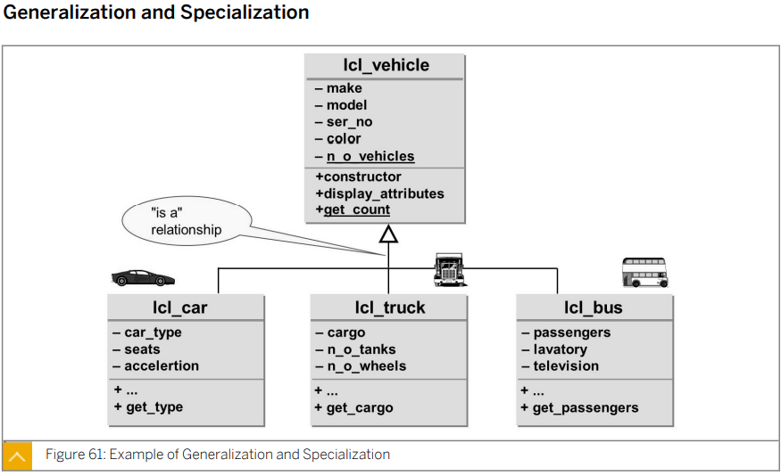

  


* ## Characteristics of Generalization and Specialization

  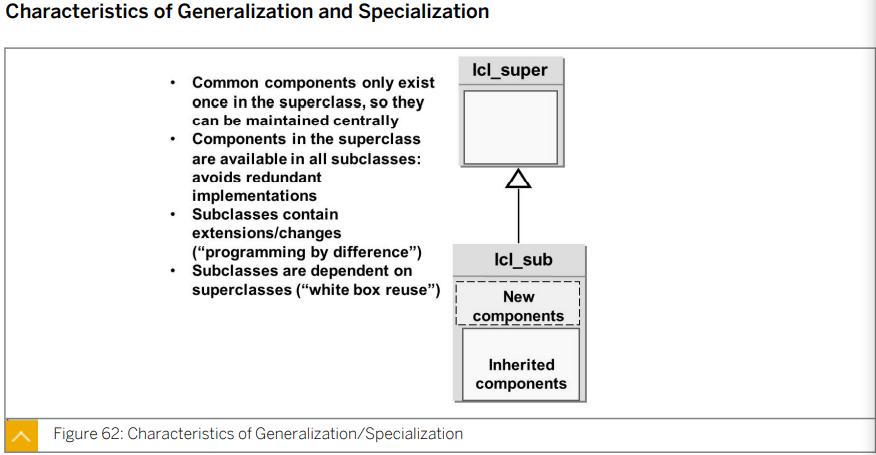

  공통된 component들은 부모 클래스 (Sub Class) 에서 관리한다.

  자식 클래스 (Sub Class) 는 부모 클래스의 component들을 상속받아 사용할 수 있으며 component들을 확장 또는 개별 component 를 가질 수 있다.


* ## Implementation of Inheritance

  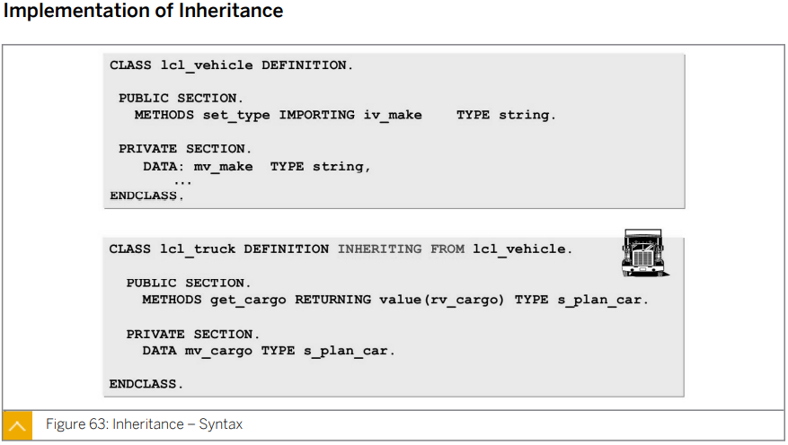

  Sub Class를 생성할 때에는 class 정의 부분 뒤에 INHERITING FROM 구문을 사용한다.


* ## Redefinition of Methods

  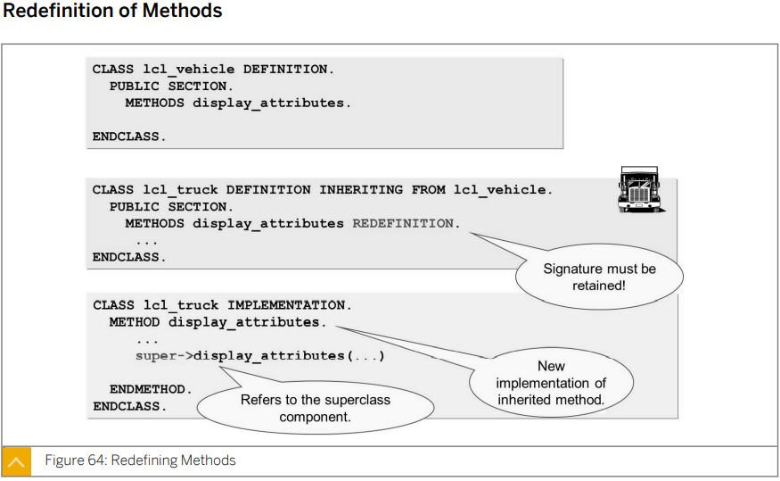

  SUPER CLASS 로 부터 상속받은 METHOD를 변형 할때에는

  CLASS <\_Sub CLASS NAME\_> DEFINITION INHERITING FROM <\_SUPER CLASS NAME\_>파트 정의 부에서는 METHOD<\_METHOD NAME\_> REDEFINITION 구문을 사용하며

  CLASS <\_Sub CLASS NAME\_> IMPLEMENTATION 파트 구현 부에서는 SUPER-><\_METHOD NAME\_> 구문을 사용하여 super class의 어느 method를 변형해 주었는지 명시해 준다.

  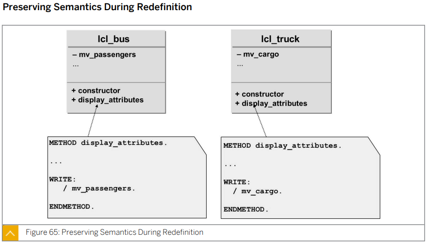


* ## Subclass Constructors

  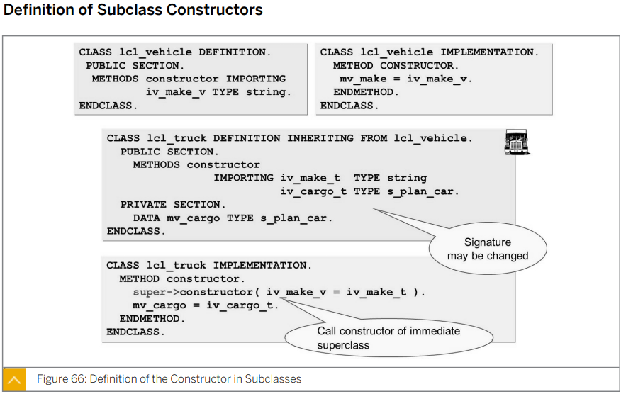

  Subclass 와 Superclass 모두 개별의 Constructor 가 있을 시

  Subclass 의 Constructor 구현 시 super->constructor( ). 를 통해 Superclass의 Constructor 를 명시적으로 호출해 주어야 한다. (유일하게 constructor를 호출하는 경우)

  

* ## Rules for Calling the constructor

  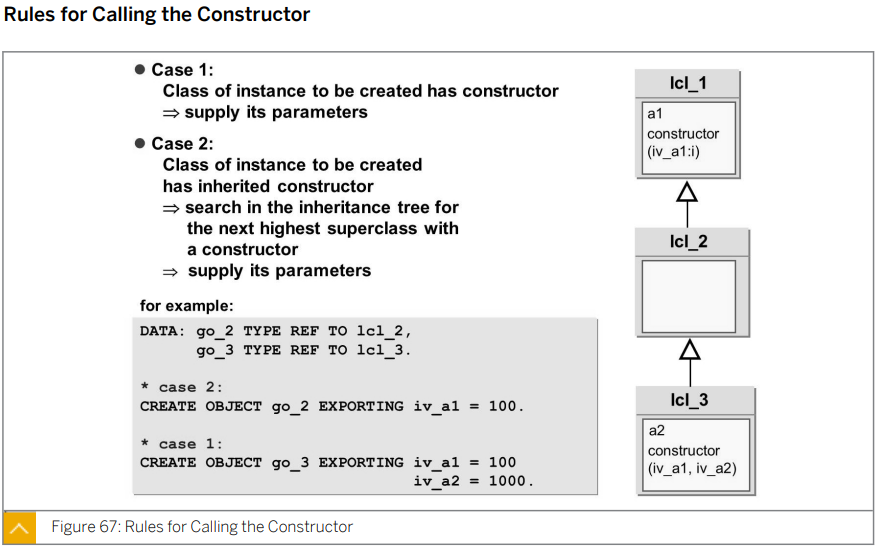

  CREATE OBJECT 구문 사용시 SUBCLASS에 CONSTRUCTOR가 없는 경우에도 부모 클래스의 CONSTRUCTOR 의 파라미터를 넘겨 줘야 하며

  SUBCLASS에 CONSTRUCTOR가 있는 경우 

  ```ABAP
  *&---------------------------------------------------------------------*
  *& Report ZB23_00049
  *&---------------------------------------------------------------------*
  *&
  *&---------------------------------------------------------------------*
  REPORT zb23_00049.
  
  CLASS lcl_vehicle DEFINITION.
    PUBLIC SECTION.
      METHODS:
        constructor IMPORTING iv_make  TYPE string
                              iv_model TYPE string,
  
        set_attributes IMPORTING iv_make  TYPE string
                                 iv_model TYPE string,
        display_attributes.
  
      CLASS-METHODS:
        display_n_o_vehicle.
  
    PRIVATE SECTION.
      DATA: mv_make  TYPE string,
            mv_model TYPE string.
  
      CLASS-DATA: gv_n_o_vehicle TYPE i.
  ENDCLASS.
  
  
  
  CLASS lcl_vehicle IMPLEMENTATION.
    METHOD constructor.
      mv_make = iv_make.
      mv_model = iv_model.
      ADD 1 TO gv_n_o_vehicle.
    ENDMETHOD.
  
    METHOD set_attributes.
      mv_make = iv_make.
      mv_model = iv_model.
  
      ADD 1 TO gv_n_o_vehicle.
  
    ENDMETHOD.
  
    METHOD display_attributes.
      WRITE:/ 'MAKE    : ', mv_Make,
            / 'MODEL   : ', mv_model.
    ENDMETHOD.
  
    METHOD display_n_o_vehicle.
      WRITE:/ 'VEHICLE COUNT : ', gv_n_o_vehicle.
    ENDMETHOD.
  ENDCLASS.
  
  
  CLASS lcl_truck DEFINITION INHERITING FROM lcl_vehicle.
    PUBLIC SECTION.
      METHODS:
        display_attributes REDEFINITION,
        constructor IMPORTING iv_make  TYPE string
                              iv_model TYPE string
                              iv_cargo TYPE s_plan_car.
  
    PRIVATE SECTION.
      DATA: mv_cargo TYPE s_plan_car.
  
  ENDCLASS.
  
  
  CLASS lcl_truck IMPLEMENTATION.
    METHOD display_attributes.
      super->display_attributes( ).
      WRITE:/ 'MAX CARGO : ', mv_cargo.
    ENDMETHOD.
  
    METHOD constructor.
      super->constructor( EXPORTING iv_make  = iv_make
                                    iv_model = iv_model ).
  *                                 SUPER      SUB
      mv_cargo = iv_cargo.
    ENDMETHOD.
  ENDCLASS.
  
  
  CLASS lcl_bus DEFINITION INHERITING FROM lcl_vehicle.
    PUBLIC SECTION.
      METHODS:
        display_attributes REDEFINITION,
  
        constructor IMPORTING iv_make  TYPE string
                              iv_model TYPE string
                              iv_seats TYPE s_seatsmax.
  
    PRIVATE SECTION.
      DATA: mv_seats TYPE s_seatsmax.
  ENDCLASS.
  
  CLASS lcl_bus IMPLEMENTATION.
    METHOD display_attributes.
      super->display_attributes( ).
  
      WRITE:/ 'MAX SEATS : ', mv_seats.
    ENDMETHOD.
  
    METHOD constructor.
      super->constructor( EXPORTING iv_make  = iv_make
                                    iv_model = iv_model ).
  *                                 SUPER      SUB
      mv_seats = iv_seats.
    ENDMETHOD.
  ENDCLASS.
  ```


* ## Inheritance and Visibility

  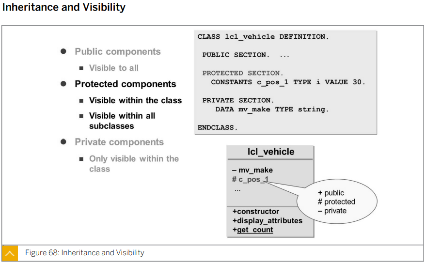

  ### PUBLIC COMPONENT

  어디서든 ACCESS 가능하다.

  다이어 그램에서 표기시 +를 COMPONENT 이름 앞에 붙인다. 

  

  ### PROTECTED COMPONENT

  구문에 선언된 COMPONENT 들은 모든 SUBCLASS에서 ACCESS 가능하다.

  다이어 그램에서 표기시 #를 COMPONENT 이름 앞에 붙인다. 

  

  ### PRIVATE  COMPONENT

  클래스 내부에서만 ACCESS 가능하다.

  다이어 그램에서 표기시 -를 COMPONENT 이름 앞에 붙인다. 

  

  #### SECTION 순서 중요!!


* ## Visibility Section - Protected Versus Private

  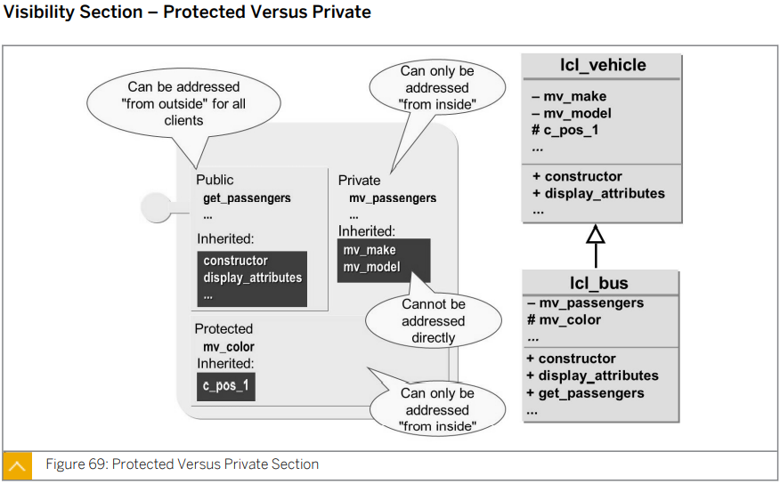

  SUPERCLASS 의 PRIVATE SECTION 에서 선언된 COMPONENT 들은 SUBCLASS 에서 ACCESS 불가능하다.

  반면 SUPERCLASS 의 PROTECTED SECTION 에서 선언된 COMPONENT 들은 SUBCLASS 에서 ACCESS 가능하다.


* ## Inheritance and Static Component

  모든 SUBCLASS 는  SUPERCLASS의 PUBLIC, PROTECTED SECTION의 모든 STATIC ATTRIBUTE에 ACCESS 가능하다. 

  

  STATIC METHOD 들은 확장/REDEFINE 될 수 없다.

  

  SUPERCLASS 에 STATIC CONSTRUCTOR 가 존재할 경우 SUBCLASS 또는 SUPERCLASS 에 첫 실행시 자동으로 실행된다. 

  

  SUPERCLASS 에 STATIC CONSTRUCTOR  가 존재하더라도 SUBCLASS는 자신만의 STATIC CONSTRUCTOR를 가질 수 있다.

  

  SUPERCLASS 와 SUBCLASS 모두 STATIC CONSTRUCTOR 가 존재하는 경우 SUBCLASS에 처음으로 ACCESS 하는 경우 

  SUPERCLASS 의 STATIC CONSTRUCTOR => SUBCLASS 의 STATIC CONSTRUCTOR  순으로 실행된다.  

  * ##### 이후 SUPERCLASS와 SUBCLASS 모두에 INSTANCE CONSTRUCTOR가 존재하는 경우 

    *  SUBCLASS 의 INSTANCE CONSTRUCTOR가 실행되어 

    * 내부에서 SUPERCLASS 의 INSTANCE CONSTRUCTOR 를 호출하여 실행되고 

    * 다시 SUBCLASS 의 INSTANCE CONSTRUCTOR 순으로 실행된다. 


* ## Exercise 7.

  ```ABAP
  ```


# Lesson 2. Implementing Upcasts Using Inheretance


* ## The Up-Cast

  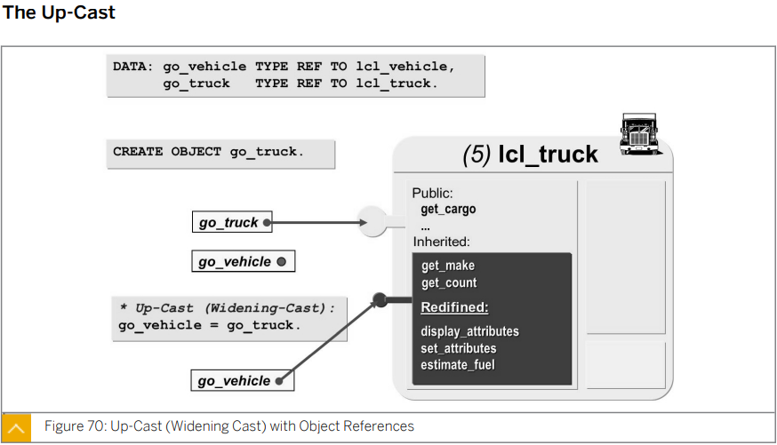

  SUBCLASS 의 OBJECT 를 SUPERCLASS 의 OBJECT에 할당할 수 있다. 이때 SUPERCLASS 는 SUBCLASS 의 COMPONENT를 다시 받아 사용한다.


* ## Static and Dynamic Type

  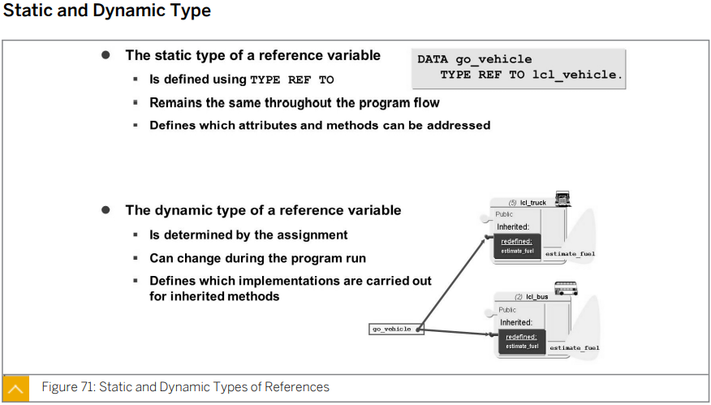

  

  ### Static Type of a Reference variable

  TYPE REF TO 구문을 사용하여 정의한다.

  

  ### Dynamic Type of a Reference variable


# Lesson 3. Implementing Polymorphism Using Inheritance


# Lesson 4. Implementing Downcasts Using Inheritance