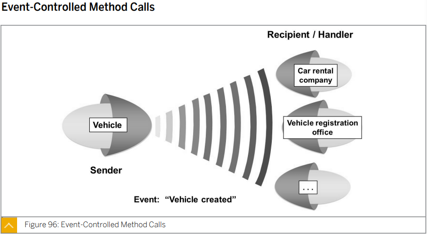
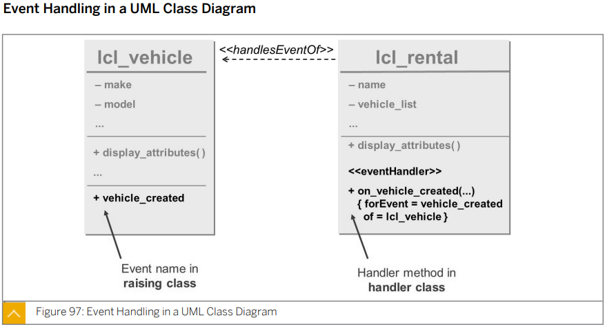
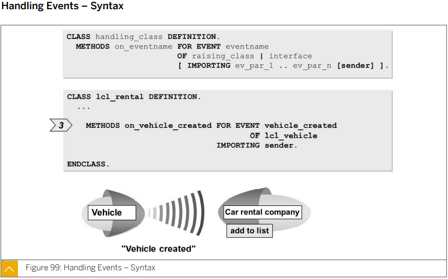
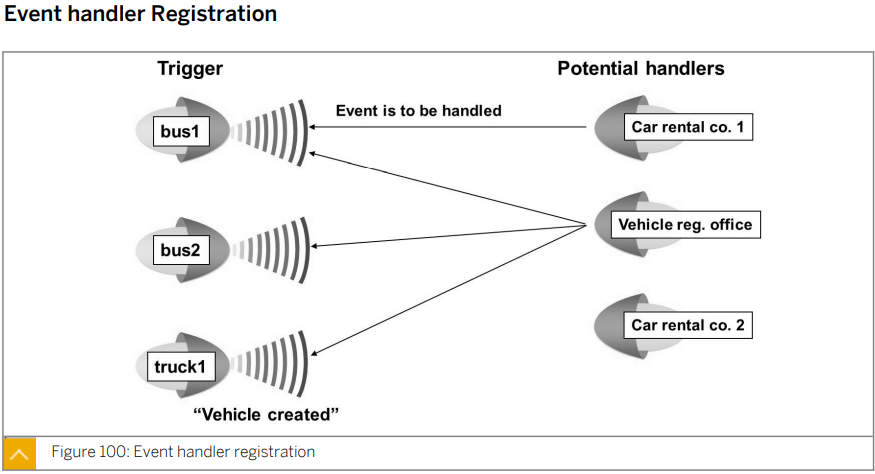
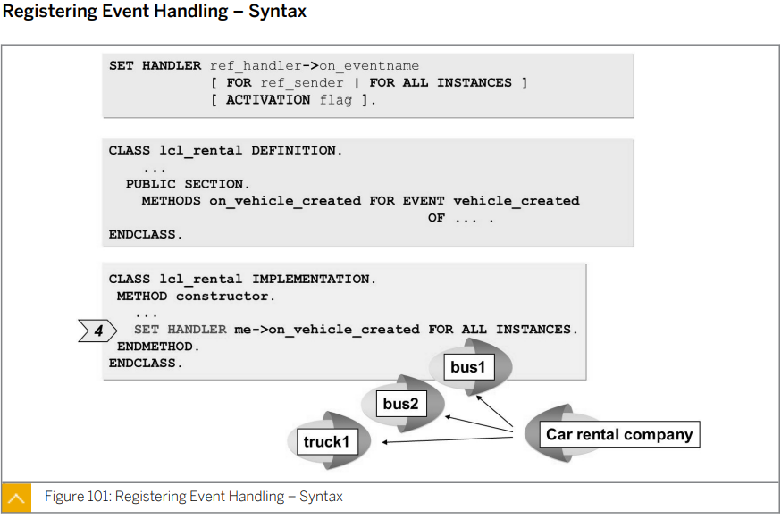
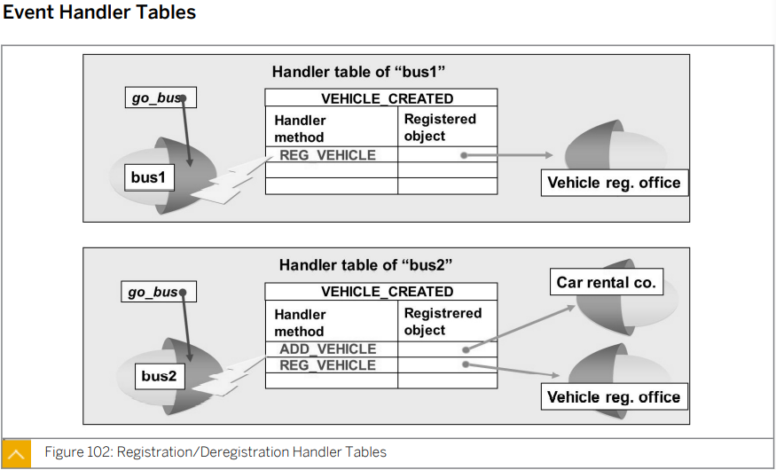

# Unit 5. Object-Oriented Events

# Lesson 1. Implementing Events in Local Classes

* ## Event-controlled Method Calls

  

* ## Event Handling in a UML Class Diagram

  

* ## Event Triggering and Handling

  

  

  EVENT HANDLER 인 EVENTS 구문은 EXPORTING 파라미터를 가질 수 있으며 PASS BY VALUE의 형태로 갖는다.

  EVENT 는 DEFINITION 에서 EVENTS 구문을 사용해 정의를 해주며 

  IMPLEMENTATION 에서 특정 METHOD안에서 RAISE EVENT 구문을 사용한다.

  

  

  

  EVENT를 사용하기 위해서는 EVENT HANDLER METHOD와 이를 담을 EVENT HANDLER의 CLASS를 정의해 줘야 하는데 

  EVENT HANDLER METHOD의 이름은 기본적으로 EVENT 이름 앞에 ON_을 붙이는 방식으로 정한다.

  

  EVENT를 사용하기 위해서는 정의 뿐 아니라 등록 REGISTRATION을 해줘야 한다.

  

  

  이 과정에서 SET HANDLER 구문을 사용한다.

  FOR 구문 뒤에는 ALL INSTANCES 대신 대상 INSTANCE를 따로 작성해도 무방하다.

  

  

  SET HANDLER 구문을 통해 REGISTRATION 되면 EVENT HANDLER TABLE이 생성된다.

  

* ## Visibility Sections in Event Handling

  ### PUBLIC

  프로그램 전체

  ## PROTECTED

  자기 자신과 자식 CLASS

  ### PRIVATE

  자기 자신 내부에서만

# Lesson 2. Implement Events in Local Interfaces

안함-

