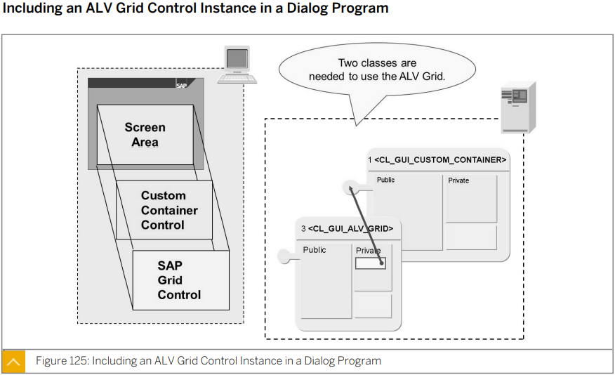
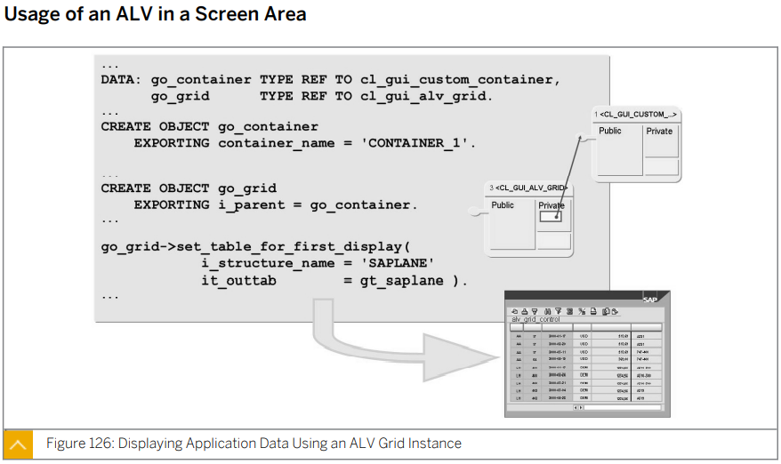
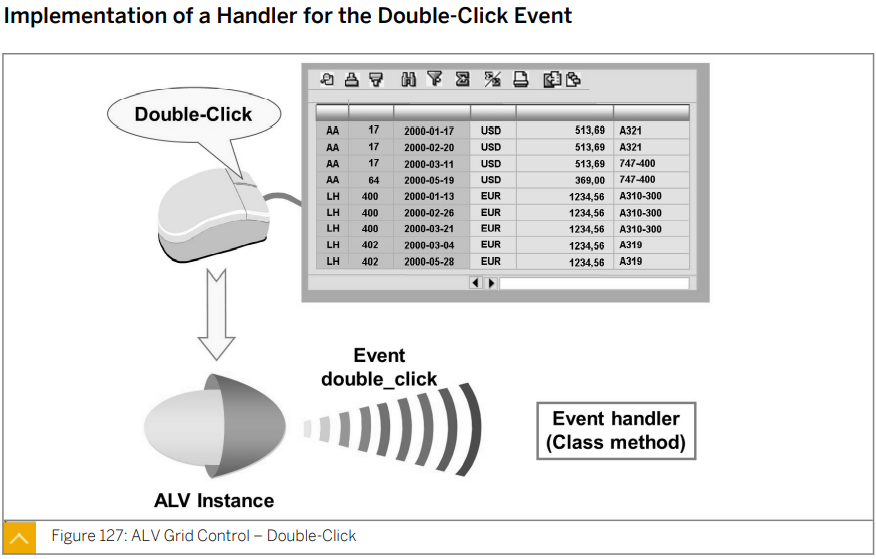
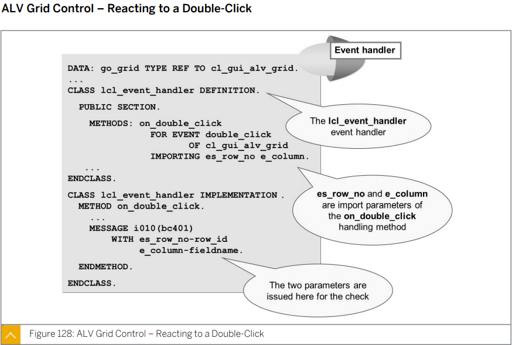

# Unit 7. ABAP Object-Oriented Examples

# Lesson 1. Using the ABAP List Viewer (ALV)

* # Create ALV

  

  

  

  더블 클릭을 할 시 double_click event 가 발생하며 이를 처리할 event handler class를 만들어 줘야 한다.

  

  

  

  

# Lesson 2. Describing Business Add-Ins (BAdls)