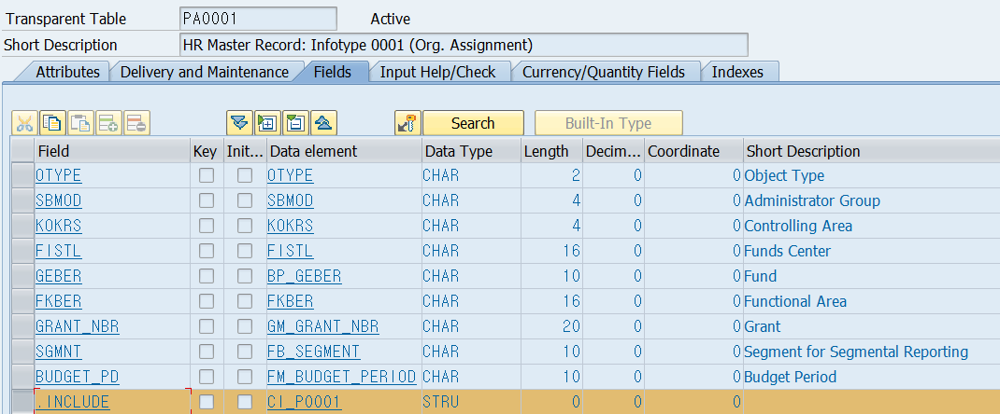

# Unit 1. Adjustment of SAP Standard Software

# Lesson 1. Adjusting SAP Standard Software

* ## Personalization

  #### Transaction Variants

  

  

* ## Modification

  #### Modification Assistant

  #### User Exits

  

  

* ## Enhancement

  #### ABAP Dictionary

  * Tables
  * Data Elements
  * Domains

  #### Customer Exits

  #### Business Transaction Events

  #### Business Add-Ins (Classic)

  #### Business Add-Ins (New)

  ####  Explicit Enhancements

  * Points
  * Sections

  #### Implicit Enhancemants

* ## Procedure for Deciding How to make Changes

   

# Lesson 2. Describing Classic Enhancement Types

* ## Change Levels Using the ABAP Workbench

* ## Table Enhancements

  ### Append Structures

  

  ### Customizing Includes (CI_Include)

   

  

* ## Program Enhancements

  * ## Implementation Techniques for Program Exits

    ### SAP Program

    * #### Subroutine (user exit)

    * #### Function module (customer exit)

    * #### Function module (BTE)

    * #### Method (BAdi)

    ### Customer source code

  

  

  

* ## Menu Enhancements

  Menu Exits 라는 용어로 사용된다.

  

  

  

* ## Screen Enhancements

  Screen Exits 라는 용어로 사용된다.

  

  

  

* ## Origin of the Implementation Techniques

  

  

* ## Program Exits - Multiple Implementations

  #### SAP Program => BTE(Bridging function module) =>  + IBU function module

  #### 																						   	  + Partner function module

  #### 																							     + Customer function module   

  #### SAP Program => BADI(Bridging function module) =>  + IBU function module

  #### 																						   	    + Partner function module

  #### 																							       + Customer function module   

  * Implicit enhancement points and options
  * Explicit enhancement points
  * Explicit enhancement sections
  * New BAdis

* ## Enhancement points

  

* ## Modifications

  enhancement가 끼워 넣는 거라면 Modification은 오리지널 자체를 수정 삭제 하는 것이다.

  최후의 수단이다. 잘 사용하지 않음

  새로운 버전이 나올시 어떤 충돌이 일어날지 알 수 없음

  

  

