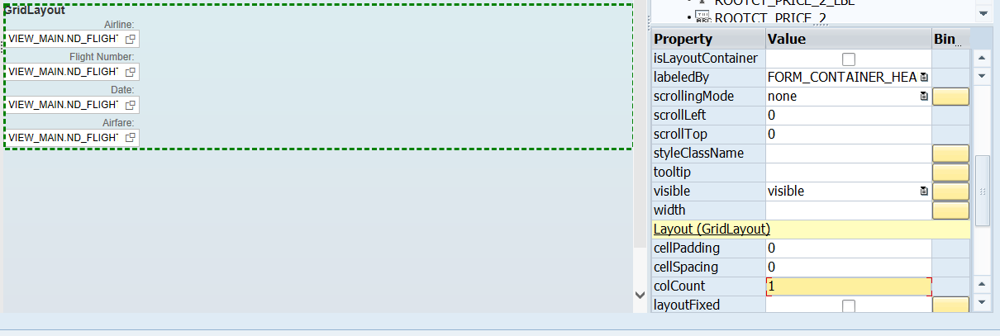
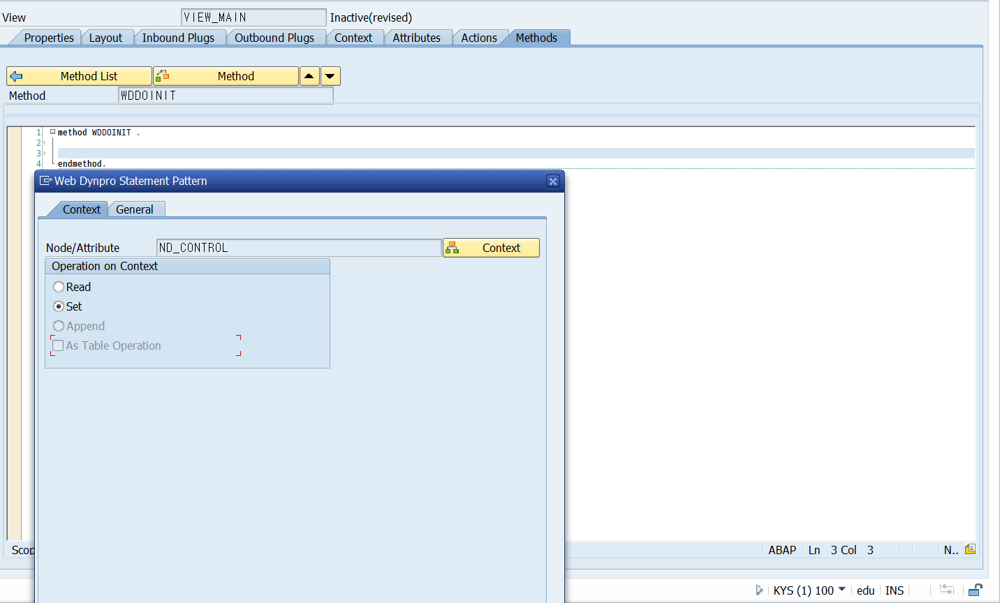

# Unit 12. Web Dynpro User Interface

# Lesson 1. Defining the View Layout

* ## Available Container Elements

  #### Group

  #### Panel

  #### Transparent Container

  #### Tray

* ## Layout Property Possible Values

  ### FlowLayout

  * ##### 한라인에 표시할 수 있는 경우 한줄에 표시
  * ##### 줄을 넘길경우 다른 줄에 표시

  

  

  

  

  

  ### RowLayout

  * ##### ROWDATA 를 선택할 경우 이전 요소와 같은 라인을 공유하게 된다.

  * ##### ROWHEADDATA 를 선택할 경우 다음 라인에 DISPLAY된다.

  

  

  

  ### MatrixLayout

  * ##### 모든 라인이 동일한 길이로 작성된다.

  * ##### MATRIXDATA 를 선택할 경우 이전 요소와 같은 라인을 공유하게 된다.
  
  * ##### MATRIXHEADDATA 를 선택할 경우 다음 라인에 DISPLAY된다.
  
  
  
  
  
  #### FormLayout
  
  ### GridLayout
  
  * COLCOUNT를 조절해 한줄에 표시될 요소의 개수를 정해 줄 수 있다.
  
  
  
  #### FormLayoutAdvanced
  
  #### TitleLayout
  
  
  
  
  
  
  
  #### MatrixLayout 과 GridLayout 이 가장 많이 쓰인다.

# Lesson 2. Controlling UI Element Behavior with Data Binding

* ## Data Binding

  UI ELEMENT와 ATTRIBUTE를 연결하여 UI ELEMENT에 DATA가 DISPLAY되도록 연결하는 것을 ***Data Binding***이라 한다.

  value Property를 설정하여 input field를 binding 할 수 있다. 하지만 잘 사용하지 않는다.

  

  

  

  

  

  

  

  

  abap_true 와 abap_false를 지정하여 input field를 열고 잠글 수 있다.

  

# Lesson 3. Using Composite UI Elements

* ## Selection Mode

  auto로 설정하면 자동으로 설정값을 잡아준다.

  Selection Mode를 none으로 하면 선택할 수 있는 radio button이 사라진다.

  single로 설정한 경우 하나만 선택 할수 있다.

  * single no lead 를 선택한 경우 선택해도 선택한 인덱스 값을 return 하지 않는다.

  multi로 설정한 경우 여러건을 선택할 수 있게 한다.

  * multi no lead 를 선택한 경우 선택해도 선택한 인덱스 값을 return 하지 않는다.

6표

간장계란

5표

스팸마요, 치킨마요, 참치마요, 

4표

미역국, 김치 날치알, 스팸김치, 육계장

3표

사골 곰탕, 직화짜장, 설렁탕, 철판제육, 불닭 마요

