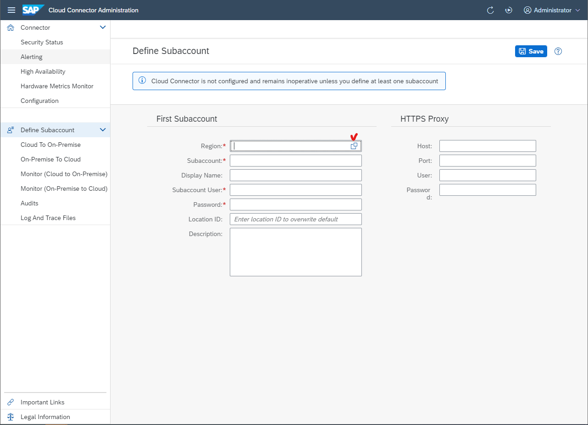
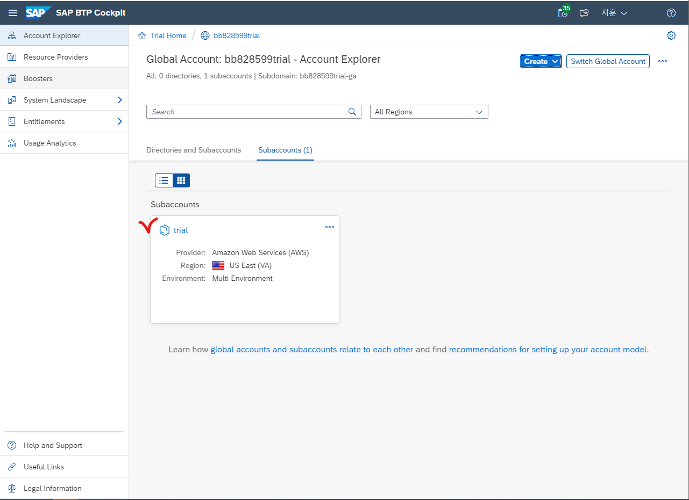
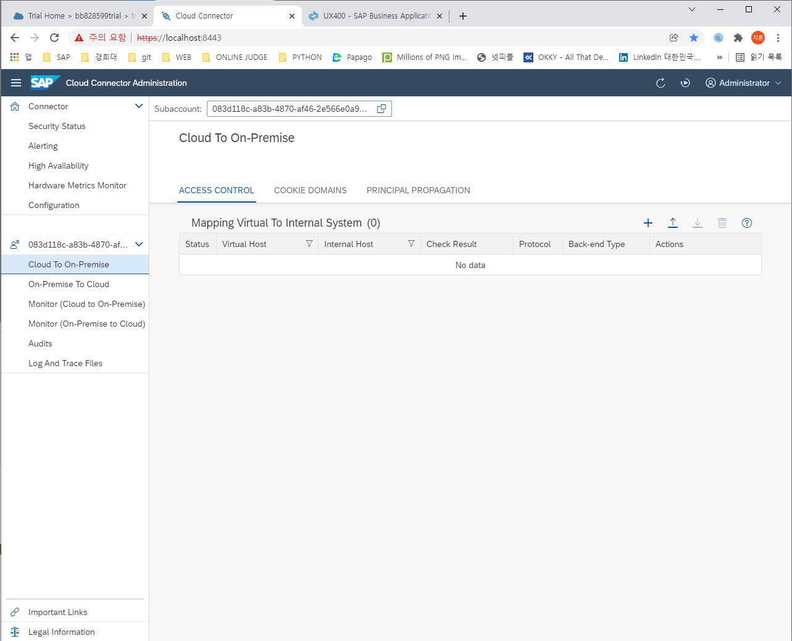
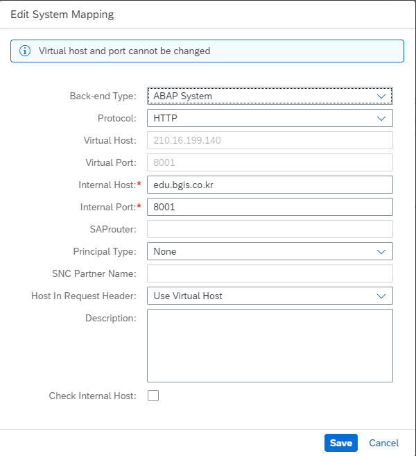
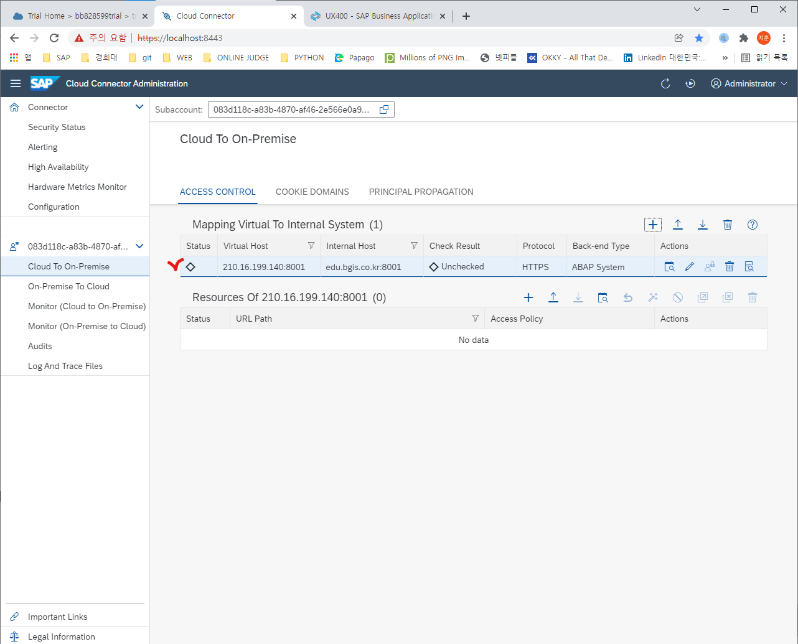
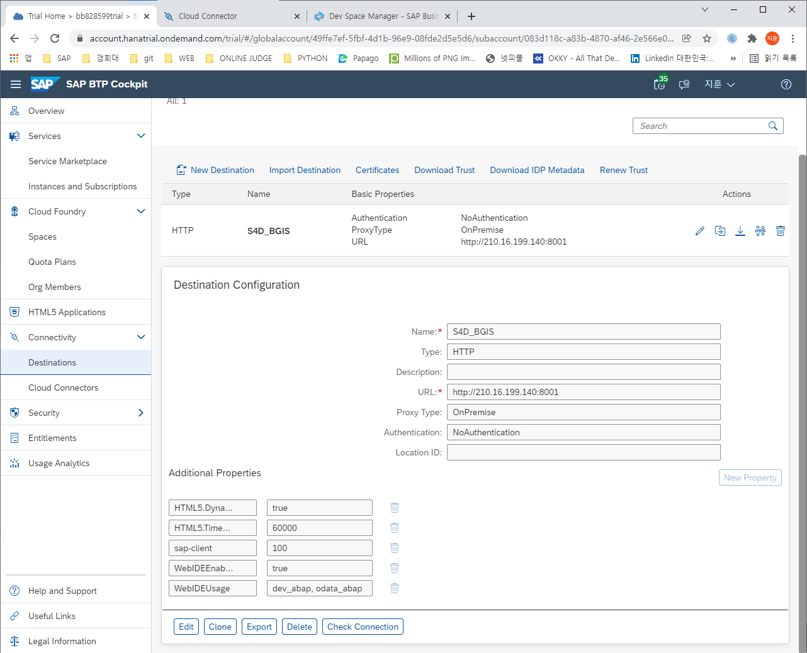
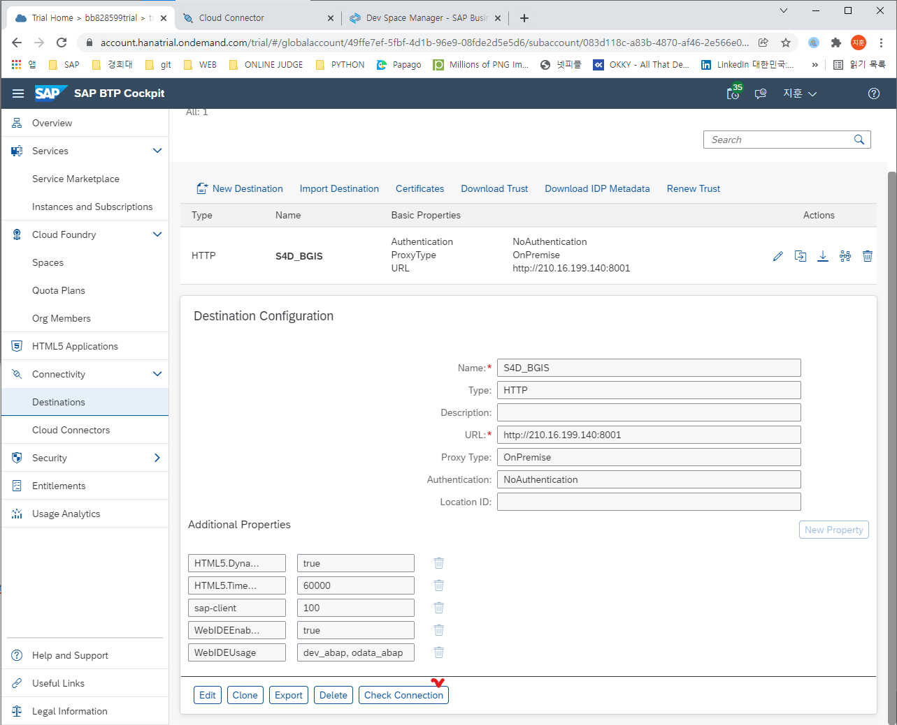
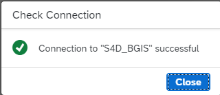

* ## Connecting Cloud Applications to On-premise Systems

  https://localhost:8443/ 에 접속 후 로그인을 하고

  

  ##### https://localhost:8443/ 

  #### Define Subaccount 의 First Subaccount 의 칸을 작성한다.

  

  #### SAP BTP 에서 Go To Your Trial Account 로 가서 

  

  #### 내 계정의 Region 을 확인 한 뒤

  

  ##### https://localhost:8443/ 

  #### Search Help 를 통해 작성한다.

  

  #### BTP의 어카운트를 클릭하여 들어가 Tenant ID를 확인 후 

  

  ##### https://localhost:8443/ 

  #### Subaccount 에 작성해 준다.

  #### 밑에 두 칸은 BTP의 ID/PW를 작성해 준 후 SAVE 한다.

  

  #### Cloud To On-Premise 로 가 Mapping Virtual To Internal System 과 Resource를 생성해 준다.

  

  

  

  

  

  

  

  ### Destination 생성 

  

  

  

  

  

  

  ### URL

  #### localhost의 Mapping Virtual To Internal System의 Virtual host를 확인후 작성한다.

  

  #### dev_abap - 확장성 시나리오 지원, SAP UI5 ABAP 저장소로의 개발 또는 배포 

  #### odata_abap - SAP Gateway의 ODATA기능

  #### 공백 없이 쉼표로 구분한다.

  

  

  

  #### 이 팝업 창이 뜨면 성공!!
  
  
  
