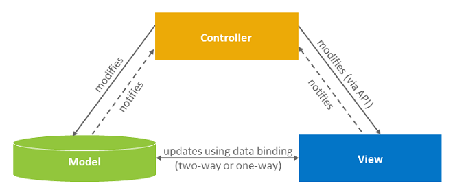

# UNIT 2. SAPUI5 Overview

# Lesson 1. Understanding SAPUI5

* ## MVC (<u>M</u>*odel* <u>V</u>*iew* <u>C</u>*ontroller*)

  Model View Controller concept는 UI (view) 와 Data visualized by application (model) 과 Code for business logic for processing the data (controller) 를 분리 하기 위해 사용된다.
  
  MVC 방식은 Model View controller 가 나위어져 있어 가독성이 좋으며 유지 보수가 쉽고 확장성이 좋다.
  
  

* ## SAP UI5 Libraries

  라이브러리는 연관된 타입들과 Control 의 집핟을 묶어 준다. 

  라이브러는 Standard Library 들이 있으며 사용자 고유의 UI library를 생성할 수도 있다.

  

  ### sap.m

  응답 제어 기능이 있는 main SAPUI5 control library 이다. 

  ### sap.ui.comp

  

  ### sap.ui.table

  

  ### sap.ui.layout

  layout control들을 이용해 layout을 꾸민다.

  ### sap.ui.core

  다른 라이브러리에서 사용되는 core set of types를 정의 하는 코어 라이브러리이다.

  

  

  

* ## Open UI5

  모든 사람들이 무료로 사용할 수 있는 UI5 

  일부 기능을 제외하고는 모든 기능이 SAP UI5 와 동일하다.

Geyerstrasse 52, 80469, Living hotel Prinzessin Elisabeth Room 204, Munich, Germany

80469