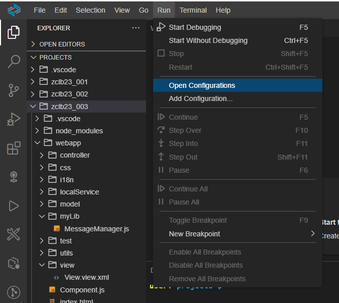

# UNIT 5. Dependency Management


# Lesson 1. Managing Dependencies


#### 모듈화를 말한다.


* ## sap.ui.require() 및 sap.ui.define()

  sap.ui.define 은 실제 비동기 모듈(AMD, Asynchronous Module Definitions)를 지원하도록 설계되었다.

  모듈의 동기 로딩은 jQuery.sap.require()를 사용하여수행했다. 모듈을 선언할때는 jQuery.sap.declare()를 사용했다.

  sapui5 1.52 버전 부터는 이 jQuery함수가 모두 더이상 사용되지 않는다.


* ## Defining a JavaScript Module

  일반적으로 제안되는 이 메소드의 사용법은 하나의 JAVASCRIPT 리소스(파일) 에서 ***sap.ui.define()*** 을 단일 최상위 레벨로 호출하는 것이다.

  모듈을 이름으로 처음 요청하는 경우, 이름과 현재 구성에 따라 해당 리소스가 결정된다.

  리소스가 로드 및 실행되고 최상위 레벨 sap.ui.define() 호출이 실행된다.

  모듈 이름이 호출에서 생략된 경우에는 모듈 요청에 사용된 이름으로 대체된다.

  sap.ui.define()은 모듈의 고유 이름 및 종속성에 대해 통합 리소스 이름 구문의 축소된 변형을 사용한다.

  해당 구문과의 유일한 차이점은 확장자(.js) 를 생략해야 한다는 것이다.

  "."는 / 로 대체한다.

  

  ```javascript
  sap.ui.define(sModule, aDependecies, vFactory, bExport);
  ```

  #### sModule

  모듈의 이름을 작성한다. 생략할 경우 로더가 요청에서 이름을 결정한다.

  #### aDependecies 

  종속 모듈을 리스트로 작성한다. 

  Ex )  ["sap/m/MessageBox",  "sap/ui/core/format/dataFormat"]

  #### vFactory

  모듈 값 또는 값을 계산하는 함수

  실질적으로 모듈을 사용할때 실행하고자 하는 로직

  #### bExport

  전역 이름으로 엑스포트 해야하는 지 여부를 boolean type 으로 결정한다.

  ##### SAP 소유 코드에서만 사용해야 한다.

  

  

  * ### Ex )

    #### zclb23_003 / webapp / myLib / MessageManager.js

    ```javascript
    sap.ui.define(
        ["sap/m/MessageBox"], 			//aDependecies 
        function(MessageBox) {			//vFactory
            return {
                reportSuccess: function (pMsg, pTitle){
                    MessageBox.show(pMsg, {
                        title: pTitle
                    })
            }
        }
        
    });
    ```

    


* ## Asynchronous Loading of Modules

  부트스트랩의 표준 변형은 성능 향상을 위해 단일 요청으로 라이브러리의 모든 JavaScript 모듈을 미리 로드한다.

  라이브러리 preload 파일 library-preload.js 에는 특정 라이브러리의 모든 모듈이 포함되어 있다.

  이 모듈은 어플리케이션에 필요한 경우 요청시에만 실행된다. 

  preload를 사용하면 개별 모듈이 하나의 파일로 묶이므로 라운드 트립의 수가 대폭 줄어든다.

  

  구성 옵션 async를 대신하는 방법으로, preload 구성 매개변수를 async(권장), sync 또는 auto 중 하나로 설정하면 다른 단일 모듈에 영향을 주지 않으면서 preload 파일의 로딩 동작을 변경할 수 있다.

  * async = true 또는 preload = async 구성 매개변수를 사용하려면 어플리케이션 측에서 광범위한 테스트와 공동 작업을 수행하여 안정적이고 완전히 작동하는 어플리케이션인지 확인해야 한다.
  * async=true 를 설정하면 모듈 로더가 모듈과 preload 파일을 비 동기적으로 로드
  * preload 파일에 포함된 모듈은 로드되기만 하고, 어플리케이션에서 사용하기 전까지 실행되지 않는다.
  
  
  
  코어의 **attachInit()** 메소드는 프레임 워크 초기화 이후 실행되는 특정 함수를 등록한다.
  
  해당 함수는 프레임 워크가 초기화 되면 바로 호출되거나 이미 초기화 되었다면 즉시 호출된다.
  
  
  
  기본적으로 SAPUI5는 런타임이 로드된 폴더 (리소스 폴더)를 기준으로 모듈을 로드한다. 
  
  웹 어플리케이션에 포함된 모듈의 경우 이 작업이 실패한다.
  
  구성 옵션 resourceRoots를 사용하여 어플리케이션 고유 모듈의 요청을 해당 웹 어플리케이션으로 리디렉션 할 수 있다.
  
  
  
  
  
  ***sap.ui.require()*** 메소드 배열의 문자열이 모듈 이름으로 해석되고 해당 모듈이 비동기적으로 로드된다.
  
  지정된 모듈의 모듈값은 종속성 배열에 표시되는 순서대로 콜백 함수의 매개변수로 제공된다.
  
  콜백 함수는 모듈 종속성을 확인한 후 비동기적으로 호출된다.
  
  * ### Ex )
  
    #### zclb23_003 / webapp / index.html
  
    ```html
    <script
      id="sap-ui-bootstrap"
      src="resources/sap-ui-core.js"
      data-sap-ui-theme="sap_fiori_3"
      data-sap-ui-libs="sap.m"
      data-sap-ui-resourceroots='{    // 모듈 이름의 접두부
            "IITP.zclb23003": "./"
        }'
      data-sap-ui-oninit="module:sap/ui/core/ComponentSupport"
      data-sap-ui-compatVersion="edge"
      data-sap-ui-async="true"			모듈로더에서 모듈과 preload 파일 모두
            							비동기식으로 로드할 수 있도록 설정
      data-sap-ui-frameOptions="trusted"
    ></script>
    
    <script> //attachInit 으로 프레임 워크 초기화 이후 실행되는 특정 함수를 등록한다.
      sap.ui.getCore().attachInit(function () { 
        //버튼 생성...
        var oButton = new sap.m.Button({
          text: "Press me",
        });
    
        oButton.placeAt("content");
    
        oButton.attachPress(function () {
          sap.ui.require(
            ["IITP/zclb23003/myLib/MessageManager"],
            function (MessageManager) {				//parameter로 모듈 이름
              MessageManager.reportSuccess("메시지", "제목");
            }
          );
        });
      });
    </script>
    ```
  
    
  
  
  
  
  
  
  
  sap.ui.require([])   비 동기화로 


##### myLib 폴더 => MessageManager.js 생성

```javascript
sap.ui.define([
    "sap/m/MessageBox"
    //사용할 라이브러리의 모듈???
], function(MessageBox) {
    return {
        reportSuccess: function (pMsg, pTitle){
            MessageBox.show(pMsg, {
                title: pTitle
            })
        }
    }
    
});
```

#### index.html

```html
<!DOCTYPE html>
<html>
<head>
    <meta charset="UTF-8">
    <meta name="viewport" content="width=device-width, initial-scale=1.0">
    <meta http-equiv="X-UA-Compatible" content="IE=edge">
    <title>App Title</title>
    <style>
        html, body, body > div, #container, #container-uiarea {
            height: 100%;
        }
    </style>
    <script
        id="sap-ui-bootstrap"
        src="resources/sap-ui-core.js"
        data-sap-ui-theme="sap_fiori_3"
        
        data-sap-ui-libs = "sap.m"               
        
        data-sap-ui-resourceroots='{
            "IITP.zclb23003": "./"
        }'
        data-sap-ui-oninit="module:sap/ui/core/ComponentSupport"
        data-sap-ui-compatVersion="edge"
        data-sap-ui-async="true"
        data-sap-ui-frameOptions="trusted"
    ></script>

    
    <script>
        sap.ui.getCore().attachInit(
            function () {
                //버튼 생성...
                var oButton = new sap.m.Button({
                    text: "Press me"
                });

                oButton.placeAt("content")

                oButton.attachPress(
                    function () {
                        sap.ui.require(
                            ["IITP/zclb23003/myLib/MessageManager"],

                            function (MessageManager){       //parameter로 모듈 이름
                                MessageManager.reportSucess("메시지", "제목");
                            }
                            
                        );
                    }
                );
            }
        );
    </script>

</head>
<body class="sapUiBody sapUiSizeCompact" id="content">

</body>
</html>
```



#### Run => Open configurations 또는

#### .vscode/launch.json 으로 들어가 아래 내용을 수정한다.

##### .vscode/launch.json

```javascript
{
"args": [
	"--open",
	"index.html"
],
    
}
```


* ## Exercise 4

  #### modularization / webapp / myLib / Formatter.js

  ```javascript
  sap.ui.define([], function () {
      return {
          capitalizeFirstLetter: function (sValue) {
              return sValue.charAt(0).toUpperCase() + sValue.slice(1);
          }
      };
  });
  ```

  #### modularization / webapp / myLib / MessageManager.js

  ```javascript
  sap.ui.define ( [
      "sap/m/MessageBox",
      "studentb23/sap/training/modularization/myLib/Formatter"
  ], function (MessageBox, Formatter) {
      return {
          reportSuccess: function(sMsg, sTitle) {
              MessageBox.show(
                  Formatter.capitalizeFirstLetter(sMsg), {
                      title: Formatter.capitalizeFirstLetter(sTitle)
                  });
          }
      };
  });
  ```

  #### modularization / webapp / index.html

  ```html
  <!DOCTYPE html>
  <html>
  <head>
      <meta charset="UTF-8">
      <meta name="viewport" content="width=device-width, initial-scale=1.0">
      <meta http-equiv="X-UA-Compatible" content="IE=edge">
      <title>App Title</title>
      <style>
          html, body, body > div, #container, #container-uiarea {
              height: 100%;
          }
      </style>
      <script
          id="sap-ui-bootstrap"
          src="resources/sap-ui-core.js"
          data-sap-ui-theme="sap_belize"
          data-sap-ui-libs="sap.m"
          data-sap-ui-resourceroots='{"studentb23.sap.training.modularization": "./"}'
          data-sap-ui-oninit="module:sap/ui/core/ComponentSupport"
          data-sap-ui-compatVersion="edge"
          data-sap-ui-async="true"
          data-sap-ui-frameOptions="trusted"
      ></script>
      <script>
          sap.ui.getCore().attachInit(function() {
              var oButton = new sap.m.Button({ text: "Press Me"});
              oButton.placeAt("content");
              oButton.attachPress(function() {
                  sap.ui.require(["studentb23/sap/training/modularization/myLib/MessageManager"],
                      function(MessageManager) {
                          MessageManager.reportSuccess("button was pressed", "success");
                      });
              });
          });
      </script>
  </head>
  <body class="sapUiBody" id="content"></body>
  </html>
  ```

  

  

  
